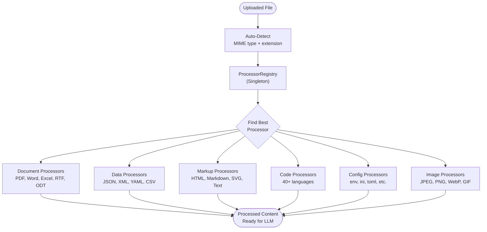

You will process over 50 file types through a single API using NeuroLink's `ProcessorRegistry`. By the end of this tutorial, you will have automatic file type detection with confidence scoring, priority-based processor selection, batch processing for multiple documents, and custom processor registration for proprietary formats.

Without a unified processing layer, you write a new parser for every format -- a PDF library here, a CSV parser there, a docx extractor somewhere else. The integration code grows faster than the feature code.

Next, you will learn the `ProcessorRegistry` architecture, process single files and batches, see the complete inventory of supported types, register custom processors, and build document-aware AI pipelines that handle anything your users upload.

## Architecture: The ProcessorRegistry

The `ProcessorRegistry` is the core of NeuroLink's file processing system. It maintains a registry of processors, each specialized for a set of file types, and selects the best processor for each file based on MIME type, file extension, priority, and confidence scoring.



The `ProcessorRegistry` is implemented as a singleton to ensure a single source of truth across your application. When a file arrives, the registry:

1. Examines both the MIME type and file extension for detection
2. Queries all registered processors for support
3. Scores each match by confidence (exact MIME match: 100, category match: 80, extension match: 60, generic: 40)
4. Selects the processor with the highest confidence, using priority as a tiebreaker (lower number = higher priority)

This two-factor selection (confidence plus priority) ensures that a specialized SVG processor (priority 5) is preferred over a generic image processor (priority 10) for SVG files, even though both can handle the format.

## Supported file types: The Complete Inventory

NeuroLink ships with processors covering six categories and over 50 file types:

**Images (AI Vision):** .jpg, .jpeg, .png, .gif, .webp (5 types, priority 10). Image files are processed through the provider's vision capabilities, generating text descriptions of image content.

**Documents:** .pdf, .docx, .doc, .xlsx, .xls, .pptx, .ppt, .odt, .ods, .odp, .rtf (11 types, priority 20-30). Full text extraction from office documents, maintaining structure where possible (tables from Excel, paragraphs from Word, slides from PowerPoint).

**Data Formats:** .json, .xml, .csv, .yaml, .yml (5 types, priority 40-50). Structured data is preserved in its original format, making it directly usable in LLM prompts for analysis or transformation.

**Markup and Text:** .html, .htm, .xhtml, .md, .markdown, .mdown, .mkd, .svg, .txt, .css, .log (11 types, priority 5-70). SVG gets the highest priority (5) because it requires specialized processing that a generic text handler would not provide.

**Source Code:** .js, .jsx, .ts, .tsx, .py, .java, .go, .rs, .c, .cpp, .rb, .php, .swift, .kt, and 30+ more (40+ types, priority 100-120). Code files are processed with language-aware formatting that preserves syntax structure and comments.

**Config Files:** .env, .ini, .toml, .cfg, .conf, .properties, .editorconfig, .gitignore, and more (15 types, priority 130). Configuration files are processed with key-value awareness, making them suitable for LLM-based configuration analysis.

## Processing a Single File

The simplest use case is processing a single uploaded file. The registry auto-detects the type and selects the appropriate processor:

```typescript
import { getProcessorRegistry } from '@juspay/neurolink';

const registry = getProcessorRegistry();

// Auto-detect and process any file
const result = await registry.processFile({
  id: 'doc-001',
  name: 'quarterly-report.pdf',
  mimetype: 'application/pdf',
  size: 2048000,
  url: 'https://storage.example.com/quarterly-report.pdf',
});

if (result?.success) {
  console.log('Processed content:', result.data);
}
```

The `FileInfo` object accepts either a `url` (for remote files) or `content` (for in-memory buffers). The `mimetype` and `name` fields are used together for processor selection -- the MIME type provides the primary signal, and the file extension provides a fallback when the MIME type is generic (like `application/octet-stream`).

## Processing with Detailed Error Handling

For production applications, you need more than a success/failure boolean. The `processWithResult` method returns structured error information with actionable suggestions:

```typescript
// processWithResult returns structured errors with suggestions
const result = await registry.processWithResult({
  id: 'file-002',
  name: 'data.xlsx',
  mimetype: 'application/vnd.openxmlformats-officedocument.spreadsheetml.sheet',
  size: 512000,
  content: excelBuffer,
});

if (result.error) {
  console.error(result.error.message);
  console.log('Suggestion:', result.error.suggestion);
  console.log('Supported types:', result.error.supportedTypes);
} else {
  console.log(`Processed as ${result.type}:`, result.data);
}
```

The error object includes a `suggestion` field that tells the caller what to do about the failure. For an unsupported file type, the suggestion might recommend registering a custom processor. For a file that is too large, it might suggest streaming. The `supportedTypes` array lists all types that the registry can currently handle, useful for displaying upload guidelines to users.

## Batch processing: Handling Entire Directories

When processing document collections -- an entire contract folder, a codebase, a batch of uploaded resumes -- the batch processor handles parallel processing with concurrency limits and aggregated results.

```typescript
import { processBatchWithRegistry } from '@juspay/neurolink';

const files = [
  { id: '1', name: 'report.pdf', mimetype: 'application/pdf', size: 1024000 },
  { id: '2', name: 'data.csv', mimetype: 'text/csv', size: 50000 },
  { id: '3', name: 'app.ts', mimetype: 'text/typescript', size: 8000 },
  { id: '4', name: 'unknown.xyz', mimetype: 'application/octet-stream', size: 100 },
];

const result = await processBatchWithRegistry(files, {
  maxFiles: 50,
  timeout: 60000,
});

console.log(`Successful: ${result.successful.length}`);
console.log(`Failed: ${result.failed.length}`);
console.log(`Skipped: ${result.skipped.length}`);
```

The batch processor categorizes each file into one of three buckets:

- **Successful:** Processed without errors. The result includes the extracted content.
- **Failed:** A processor was found but processing failed (corrupted file, timeout, etc.).
- **Skipped:** No processor was found for the file type.

The `maxFiles` option prevents runaway processing of unexpectedly large directories. The `timeout` sets a per-batch time limit, ensuring that a single slow file does not block the entire batch.

## Discovery: Checking Support Before Upload

In user-facing applications, you want to validate file types before the user uploads rather than after. NeuroLink provides discovery functions for this purpose.

```typescript
import {
  isFileTypeSupported,
  getProcessorForFile,
  getSupportedFileTypes,
} from '@juspay/neurolink';

// Validate before upload
if (isFileTypeSupported('application/pdf', 'document.pdf')) {
  console.log('PDF files are supported');
}

// Get processor details
const match = getProcessorForFile('image/jpeg', 'photo.jpg');
if (match) {
  console.log(`Processor: ${match.name}, Priority: ${match.priority}, Confidence: ${match.confidence}%`);
}

// List all supported types
const types = getSupportedFileTypes();
for (const { name, mimeTypes, extensions, priority } of types) {
  console.log(`${name} (priority: ${priority}): ${extensions.join(', ')}`);
}
```

The `isFileTypeSupported()` function is a quick boolean check suitable for upload validation endpoints. The `getProcessorForFile()` function returns full details including the processor name, priority, and confidence score -- useful for debugging when you need to understand which processor will handle a specific file.

The `getSupportedFileTypes()` function returns the complete registry inventory, which you can use to generate upload guidelines, populate file type filter dropdowns, or document your application's capabilities.

## Registering custom processors

When your application needs to handle file types that NeuroLink does not support out of the box, you can register custom processors that plug into the same priority and confidence system.

```typescript
import { getProcessorRegistry, PROCESSOR_PRIORITIES } from '@juspay/neurolink';

const registry = getProcessorRegistry();

registry.register({
  name: 'dicom',
  priority: 25,
  processor: new DicomProcessor(),
  isSupported: (mimetype, filename) =>
    mimetype === 'application/dicom' || filename.endsWith('.dcm'),
  description: 'Processes DICOM medical imaging files',
  aliases: ['medical-image'],
});
```

Custom processors must implement the processor interface with a `processFile` method that accepts a `FileInfo` object and returns a `FileProcessingResult`. The `isSupported` function defines the matching logic -- it receives both the MIME type and filename and returns a boolean.

Priority determines processing order when multiple processors claim support for the same file. Set your custom processor's priority relative to the built-in priorities: SVG is 5, Image is 10, PDF is 20, CSV is 30, and so on up to Config at 130. A DICOM processor at priority 25 would be checked before the generic document processor but after the SVG processor.

> **Note:** Custom processors are registered at the singleton registry level. Once registered, they are available to all `processFile` and `processBatchWithRegistry` calls in the application. Register custom processors during application initialization, not per-request.
{: .prompt-info }

## Feeding processed documents to LLMs

The entire point of document processing is to prepare content for AI analysis. Here is how to connect the processing pipeline to NeuroLink's generation system:

```typescript
import { NeuroLink } from '@juspay/neurolink';

const neurolink = new NeuroLink();

// Process file, then send to LLM
const processed = await registry.processFile(fileInfo);

const result = await neurolink.generate({
  input: { text: `Analyze this document:\n\n${processed?.data?.content}` },
  provider: 'anthropic',
  model: 'claude-sonnet-4-5-20250929',
});
```

This two-step pattern -- process then generate -- keeps concerns separated. The processor handles format-specific extraction (PDF rendering, Excel cell extraction, code formatting), and the LLM handles analysis and understanding. This separation means you can upgrade processors independently of your LLM pipeline, and you can reuse processed content across multiple LLM calls without re-processing.

For complex document analysis workflows, you might process multiple documents and combine their content:

```typescript
const files = [contract, amendment, termSheet];
const batchResult = await processBatchWithRegistry(files, { timeout: 30000 });

const combinedContent = batchResult.successful
  .map(r => `## ${r.name}\n\n${r.data.content}`)
  .join('\n\n---\n\n');

const analysis = await neurolink.generate({
  input: { text: `Compare these documents and identify discrepancies:\n\n${combinedContent}` },
  provider: 'anthropic',
  model: 'claude-sonnet-4-5-20250929',
});
```

## Production tips

Running document processing in production brings additional considerations:

**Size limits:** Configure per-processor size limits to prevent memory exhaustion. A 500MB video file should not be processed the same way as a 50KB text file. NeuroLink's processor configuration supports size limits that can be tuned per processor type.

**Timeouts:** Always set timeouts for URL-based file fetching. A slow or unresponsive file server should not block your processing pipeline indefinitely. The batch processor's `timeout` option applies globally; individual file timeouts can be set in processor configurations.

**Memory management:** Stream large files rather than loading them entirely into memory. For files over 10MB, consider processing them in chunks or using a queue-based architecture where processing happens asynchronously.

**Security:** Never trust client-supplied MIME types. Always validate MIME types server-side using file signature detection (magic bytes). A file named `document.pdf` with a MIME type of `application/pdf` might actually be an executable. Validate before processing.

**Monitoring:** Log the processor name, confidence score, and processing time for each file. This data is invaluable for identifying slow processors, files that are being handled by incorrect processors (low confidence scores), and processing failures that need attention.

```typescript
const match = getProcessorForFile(file.mimetype, file.name);
const startTime = Date.now();
const result = await registry.processFile(file);
const duration = Date.now() - startTime;

logger.info('File processed', {
  fileName: file.name,
  processor: match?.name,
  confidence: match?.confidence,
  duration,
  success: result?.success ?? false,
});
```

## What you built

You built a unified file processing system that handles 50+ file types through a single API using the `ProcessorRegistry` pattern. You configured MIME-type-based processor routing with confidence scoring, set up batch processing for handling multiple files in parallel, implemented size limits and timeouts for production safety, and added monitoring with processor name, confidence score, and processing time logging.

To build on these capabilities:

- Read about [building auditable AI pipelines](/posts/auditable-ai-pipelines/) for processing documents in regulated industries
- Explore the [AI recruitment pipeline](/posts/ai-recruitment-pipeline/) for a practical example of document processing in a multi-stage AI workflow
- See [debugging AI applications](/posts/debugging-ai-applications/) for monitoring file processing performance in production

---

**Related posts:**

- [Multimodal Document Processing with NeuroLink](/posts/multimodal-document-processing/)
- [Building RAG Applications with NeuroLink SDK](/posts/rag-implementation/)
- [Debugging AI Applications: Tools, Techniques, and NeuroLink's Observability Stack](/posts/debugging-ai-applications/)
