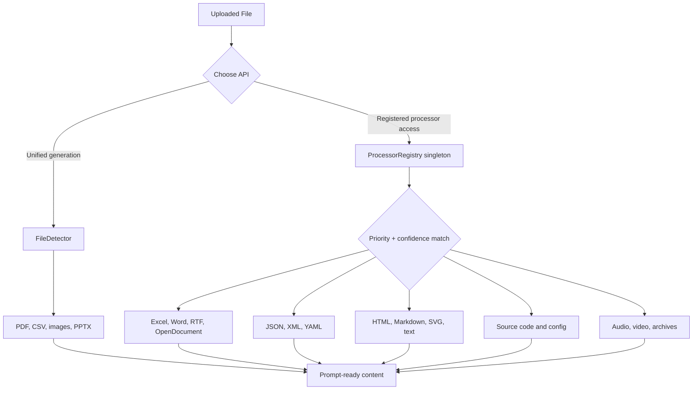

You will process files through NeuroLink's two complementary paths: the unified file API for PDF, CSV, images, and PPTX, and `ProcessorRegistry` for its 16 registered `BaseFileProcessor` implementations. By the end of this tutorial, you will have automatic file type detection, confidence-scored registry selection, batch processing for registered formats, and custom processor registration for proprietary formats.

Without a unified processing layer, you write a new parser for every format -- a PDF library here, a CSV parser there, a docx extractor somewhere else. The integration code grows faster than the feature code.

Next, you will learn how FileDetector and `NeuroLink.generate({ input: { files } })` handle legacy/static routes, how `ProcessorRegistry` handles its registered subset, and how to build document-aware AI pipelines without confusing those two APIs.

## Architecture: The ProcessorRegistry

The `ProcessorRegistry` is the core of NeuroLink's file processing system. It maintains a registry of processors, each specialized for a set of file types, and selects the best processor for each file based on MIME type, file extension, priority, and confidence scoring.


```mermaid
flowchart TB
    FILE["Uploaded File"] --> API{"Choose API"}
    API -->|"Unified generation"| DETECTOR["FileDetector"]
    API -->|"Registered processor access"| REGISTRY["ProcessorRegistry singleton"]
    DETECTOR --> LEGACY["PDF, CSV, images, PPTX"]
    REGISTRY --> MATCH{"Priority + confidence match"}
    MATCH --> DOC["Excel, Word, RTF, OpenDocument"]
    MATCH --> DATA["JSON, XML, YAML"]
    MATCH --> MARKUP["HTML, Markdown, SVG, text"]
    MATCH --> CODE["Source code and config"]
    MATCH --> MEDIA["Audio, video, archives"]
    LEGACY & DOC & DATA & MARKUP & CODE & MEDIA --> RESULT["Prompt-ready content"]
```

The `ProcessorRegistry` is implemented as a singleton to ensure a single source of truth across your application. On first access, it registers 16 `BaseFileProcessor` implementations. When a registry-supported file arrives, the registry:

1. Examines both the MIME type and file extension
2. Queries all registered processors for support
3. Scores each match by confidence (exact MIME match: 100, category match: 80, extension match: 60, generic: 40)
4. Sorts matches by priority first (lower number wins), then confidence within equal priorities

PDF, CSV, images, and PPTX use FileDetector's static routes instead of `ProcessorRegistry`. Use `NeuroLink.generate({ input: { files } })` when you want one public handoff that covers both systems.

## Supported file types: Two complementary inventories

NeuroLink supports 260+ extensions overall. `ProcessorRegistry` covers the BaseFileProcessor-backed subset below; FileDetector handles several legacy/static routes separately.

**FileDetector routes:** PDF, CSV/tabular files, provider-ready images, and PPTX. These do not appear in `getSupportedFileTypes()` and cannot be processed by `registry.processFile()` unless you register a custom adapter.

**Registered documents:** .xlsx and .xls route to Excel at priority 90, .docx and .doc route to Word at 100, .rtf routes to RTF at 140, and .odt/.ods/.odp route to OpenDocument at 150. The current Excel and Word implementations parse ZIP-based `.xlsx` and `.docx`; legacy `.xls` and `.doc` routing does not make those binary formats parseable.

**Registered data:** .json, .jsonl, .geojson, .xml, .xsd, .xsl, .yaml, and .yml at priorities 50-70. CSV stays on the FileDetector path.

**Registered markup and text:** SVG at priority 5, Markdown at 40, HTML at 80, and plain text/log files at 110. CSS is handled by the source-code processor at 120, not the markup range.

**Registered code and configuration:** Source code across 50+ languages at priority 120, plus configuration formats such as .env, .ini, .toml, and .cfg at 130.

**Registered media and archives:** Video at priority 160, audio at 170, and archives such as .zip, .tar, .gz, and .tgz at 180.

## Processing a Single File

For PDF, CSV, images, and PPTX, use the unified generation API. FileDetector recognizes the file and converts it to prompt-ready input before generation:

```typescript
import { NeuroLink } from '@juspay/neurolink';

const neurolink = new NeuroLink();
const result = await neurolink.generate({
  input: {
    text: 'Summarize this quarterly report',
    files: ['quarterly-report.pdf'],
  },
});

console.log(result.content);
```

For a registered format such as `.docx`, access `ProcessorRegistry` directly when you need the processor-specific payload:

```typescript
import { getProcessorRegistry } from '@juspay/neurolink/processors';
import fs from 'node:fs';

const registry = await getProcessorRegistry();
const result = await registry.processFile({
  id: 'doc-001',
  name: 'contract.docx',
  mimetype: 'application/vnd.openxmlformats-officedocument.wordprocessingml.document',
  size: fs.statSync('contract.docx').size,
  buffer: fs.readFileSync('contract.docx'),
});

if (result?.success) {
  console.log('Processed payload:', result.data);
}
```

The `FileInfo` object accepts either a `url` or `buffer`. The registry uses `mimetype` and `name` together for selection, but it only sees registered formats; the unified file API is the correct entry point for FileDetector-only formats.

## Processing with Detailed Error Handling

For production applications, you need more than a success/failure boolean. The `processWithResult` method returns structured error information with actionable suggestions:

```typescript
// processWithResult returns structured errors with suggestions
const result = await registry.processWithResult({
  id: 'file-002',
  name: 'data.xlsx',
  mimetype: 'application/vnd.openxmlformats-officedocument.spreadsheetml.sheet',
  size: 512000,
  buffer: excelBuffer,
});

if (result.error) {
  console.error(result.error.message);
  console.log('Suggestion:', result.error.suggestion);
  console.log('Supported types:', result.error.supportedTypes);
} else {
  console.log(`Processed as ${result.type}:`, result.data);
}
```

The error object includes a `suggestion` field that tells the caller what to do about the failure. For an unsupported file type, the suggestion might recommend registering a custom processor. For a file that is too large, it might suggest streaming. The `supportedTypes` array lists all types that the registry can currently handle, useful for displaying upload guidelines to users.

## Batch processing: Handling Entire Directories

For registered formats, `processBatchWithRegistry()` processes files sequentially and aggregates the outcomes. Each file must provide a `buffer` or `url`:

```typescript
import { processBatchWithRegistry } from '@juspay/neurolink/processors';
import fs from 'node:fs';

const files = [
  {
    id: '1',
    name: 'contract.docx',
    mimetype: 'application/vnd.openxmlformats-officedocument.wordprocessingml.document',
    size: fs.statSync('contract.docx').size,
    buffer: fs.readFileSync('contract.docx'),
  },
  {
    id: '2',
    name: 'app.ts',
    mimetype: 'text/typescript',
    size: fs.statSync('app.ts').size,
    buffer: fs.readFileSync('app.ts'),
  },
  {
    id: '3',
    name: 'unknown.xyz',
    mimetype: 'application/octet-stream',
    size: fs.statSync('unknown.xyz').size,
    buffer: fs.readFileSync('unknown.xyz'),
  },
];

const result = await processBatchWithRegistry(files, {
  maxFiles: 50,
  timeout: 60000,
});

console.log(`Successful: ${result.successful.length}`);
console.log(`Failed: ${result.failed.length}`);
console.log(`Skipped: ${result.skipped.length}`);
```

The batch processor categorizes each file into one of three buckets:

- **Successful:** Processed without errors. Each entry contains `{ fileInfo, processorName, result }`.
- **Failed:** A processor was found but processing failed (corrupted file, per-file timeout, etc.).
- **Skipped:** No registered processor was found, or the file exceeded `maxFiles`.

The `maxFiles` option bounds the collection. The `timeout` is applied independently to each file, and files run sequentially. If you need bounded concurrency, implement it outside this helper and account for memory use and downstream rate limits.

## Discovery: Checking Support Before Upload

In user-facing applications, you want to validate file types before the user uploads rather than after. NeuroLink provides discovery functions for this purpose.

```typescript
import {
  isFileTypeSupported,
  getProcessorForFile,
  getSupportedFileTypes,
} from '@juspay/neurolink/processors';

// Validate a ProcessorRegistry-backed format before upload
if (await isFileTypeSupported('application/json', 'data.json')) {
  console.log('JSON files are supported by ProcessorRegistry');
}

// Get registered processor details
const match = await getProcessorForFile('text/typescript', 'app.ts');
if (match) {
  console.log(`Processor: ${match.name}, Priority: ${match.priority}, Confidence: ${match.confidence}%`);
}

// List all supported types
const types = await getSupportedFileTypes();
for (const { name, mimeTypes, extensions, priority } of types) {
  console.log(`${name} (priority: ${priority}): ${extensions.join(', ')}`);
}
```

The `isFileTypeSupported()` function is a quick check for the registry subset. The `getProcessorForFile()` function returns the registered processor name, priority, and confidence score. Both return negative results for FileDetector-only PDF, CSV, image, and PPTX routes even though the unified file API supports those formats.

The `getSupportedFileTypes()` function returns the complete ProcessorRegistry inventory, not the complete SDK-wide extension catalog. Use it for registry-specific upload guidelines and diagnostics.

## Registering custom processors

When your application needs to handle file types that NeuroLink does not support out of the box, you can register custom processors that plug into the same priority and confidence system.

```typescript
import { getProcessorRegistry, PROCESSOR_PRIORITIES } from '@juspay/neurolink/processors';

const registry = await getProcessorRegistry();

registry.register({
  name: 'dicom',
  priority: 25,
  processor: new DicomProcessor(),
  isSupported: (mimetype, filename) =>
    mimetype === 'application/dicom' || filename.endsWith('.dcm'),
  description: 'Processes DICOM medical imaging files',
  aliases: ['medical-image'],
});
```

Custom processors must implement the processor interface with a `processFile` method that accepts a `FileInfo` object and returns a `FileProcessingResult`. The `isSupported` function defines the matching logic -- it receives both the MIME type and filename and returns a boolean.

Priority determines processing order when multiple registered processors claim support for the same file. Compare a custom priority with actual registry entries: SVG is 5, Markdown 40, JSON 50, Excel 90, Word 100, source code 120, RTF 140, OpenDocument 150, video 160, audio 170, and archive 180. The image, PDF, and CSV constants belong to FileDetector routes and are not default registry registrations. A DICOM processor at priority 25 would run after SVG but before the remaining registered defaults.

> **Note:** Custom processors are registered at the singleton registry level. Once registered, they are available to all `processFile` and `processBatchWithRegistry` calls in the application. Register custom processors during application initialization, not per-request.
{: .prompt-info }

## Feeding processed documents to LLMs

When you only need analysis, prefer the unified file API. It already runs FileDetector and converts each supported file into prompt text:

```typescript
import { NeuroLink } from '@juspay/neurolink';

const neurolink = new NeuroLink();
const result = await neurolink.generate({
  input: {
    text: 'Analyze this document',
    files: ['contract.docx'],
  },
  provider: 'anthropic',
  model: 'claude-sonnet-5',
});
```

Use `ProcessorRegistry` directly when your application needs structured processor-specific data before generation. `result.data` is a union, so narrow by `processorName` rather than assuming a universal `content` field:

```typescript
const files = [contract, amendment, termSheet];
const batchResult = await processBatchWithRegistry(files, { timeout: 30000 });

const combinedContent = batchResult.successful
  .map(({ fileInfo, processorName, result }) => {
    if (processorName === 'word' && 'markdownContent' in result.data) {
      return `## ${fileInfo.name}\n\n${result.data.markdownContent}`;
    }
    if (processorName === 'source_code' && 'content' in result.data) {
      return `## ${fileInfo.name}\n\n${result.data.content}`;
    }
    throw new Error(`Add a formatter for ${processorName}`);
  })
  .join('\n\n---\n\n');

const analysis = await neurolink.generate({
  input: { text: `Compare these documents and identify discrepancies:\n\n${combinedContent}` },
  provider: 'anthropic',
  model: 'claude-sonnet-5',
});
```

Word results expose `textContent` and `markdownContent`; source, text, Markdown, JSON, XML, YAML, and config processors expose `content`; Excel exposes `worksheets`; and several media/document processors expose `textContent`. Explicit narrowing keeps the handoff aligned with the public result types.

## Production tips

Running document processing in production brings additional considerations:

**Size limits:** Configure per-processor size limits to prevent memory exhaustion. A 500MB video file should not be processed the same way as a 50KB text file. NeuroLink's processor configuration supports size limits that can be tuned per processor type.

**Timeouts:** Always set timeouts for URL-based file fetching. A slow or unresponsive file server should not block your processing pipeline indefinitely. The batch helper passes its `timeout` to each file independently; processor configurations can enforce their own format-specific limits too.

**Memory management:** Stream large files rather than loading them entirely into memory. For files over 10MB, consider processing them in chunks or using a queue-based architecture where processing happens asynchronously.

**Security:** Never trust client-supplied MIME types. Always validate MIME types server-side using file signature detection (magic bytes). A file named `document.pdf` with a MIME type of `application/pdf` might actually be an executable. Validate before processing.

**Monitoring:** Log the processor name, confidence score, and processing time for each file. This data is invaluable for identifying slow processors, files that are being handled by incorrect processors (low confidence scores), and processing failures that need attention.

```typescript
const match = await getProcessorForFile(file.mimetype, file.name);
const startTime = Date.now();
const result = await registry.processFile(file);
const duration = Date.now() - startTime;

logger.info('File processed', {
  fileName: file.name,
  processor: match?.name,
  confidence: match?.confidence,
  duration,
  success: result?.success ?? false,
});
```

## What you built

You built a file processing system that uses the unified file API for FileDetector routes and `ProcessorRegistry` for its 16 registered processor categories. You configured MIME- and extension-based registry routing with confidence scoring, set up sequential batch processing with per-file timeouts, narrowed processor-specific payloads before LLM handoff, and added processor diagnostics.

To build on these capabilities:

- Read about [building auditable AI pipelines](/posts/auditable-ai-pipelines/) for processing documents in regulated industries
- Explore the [AI recruitment pipeline](/posts/ai-recruitment-pipeline/) for a practical example of document processing in a multi-stage AI workflow
- See [debugging AI applications](/posts/debugging-ai-applications/) for monitoring file processing performance in production

---

**Related posts:**

- [Multimodal Document Processing with NeuroLink](/posts/multimodal-document-processing/)
- [Building RAG Applications with NeuroLink SDK](/posts/rag-implementation/)
- [Debugging AI Applications: Tools, Techniques, and NeuroLink's Observability Stack](/posts/debugging-ai-applications/)
