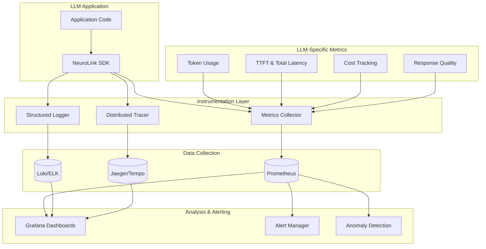

You will set up production monitoring for LLM applications covering token usage tracking, latency distributions, response quality scoring, and hallucination detection. By the end of this tutorial, you will have metrics collection with Prometheus, structured logging with Loki, distributed tracing with Jaeger, and intelligent alerting for cost spikes and quality degradation.

Traditional APM tools were not designed for AI workloads. Next, you will configure each layer of the observability stack using NeuroLink's built-in instrumentation.

## Observability architecture

The following diagram illustrates a comprehensive observability architecture for LLM applications:



## Why traditional monitoring falls short for AI applications

Standard application performance monitoring (APM) tools excel at tracking request rates, error counts, and response times. However, LLM applications introduce several unique characteristics that require specialized observability approaches:

### The non-deterministic nature of AI

Unlike traditional applications where the same input produces the same output, LLM responses vary based on temperature settings, context windows, and model state. This non-determinism makes it challenging to establish baseline behaviors and detect anomalies using conventional methods.

### Complex cost structures

LLM API costs depend on token consumption rather than compute time. A single request might cost anywhere from fractions of a cent to several dollars depending on prompt length, response size, and model selection. Traditional monitoring tools lack the ability to track these granular cost metrics.

### Quality as a primary metric

For LLM applications, response quality is as important as availability and latency. Monitoring must extend beyond uptime to include relevance, accuracy, and coherence of generated content.

## Essential metrics for LLM application monitoring

Building a comprehensive observability strategy starts with identifying the right metrics to track.

### Performance metrics

**Latency Distribution**

Track latency at multiple percentiles (p50, p90, p95, p99) rather than just averages.

```typescript
import { NeuroLink } from '@juspay/neurolink';

class LatencyTracker {
  private latencies: number[] = [];

  async trackRequest<T>(operation: () => Promise<T>): Promise<T> {
    const startTime = performance.now();
    try {
      const result = await operation();
      const duration = performance.now() - startTime;
      this.latencies.push(duration);
      return result;
    } catch (error) {
      const duration = performance.now() - startTime;
      this.latencies.push(duration);
      throw error;
    }
  }

  getPercentile(p: number): number {
    const sorted = [...this.latencies].sort((a, b) => a - b);
    const index = Math.ceil((p / 100) * sorted.length) - 1;
    return sorted[index] || 0;
  }

  getMetrics() {
    return {
      p50: this.getPercentile(50),
      p90: this.getPercentile(90),
      p95: this.getPercentile(95),
      p99: this.getPercentile(99),
      count: this.latencies.length
    };
  }
}

// Usage with NeuroLink
const neurolink = new NeuroLink();
const tracker = new LatencyTracker();

const result = await tracker.trackRequest(() =>
  neurolink.generate({
    input: { text: 'Explain monitoring best practices' },
    provider: 'vertex',
    model: 'gemini-2.0-flash'
  })
);

console.log('Latency Metrics:', tracker.getMetrics());
// Output: { p50: 245.2, p90: 1023.4, p95: 1456.7, p99: 2134.5, count: 1000 }
```

**Time to First Token (TTFT)**

For streaming applications, measure the time until the first token arrives.

```typescript
import { NeuroLink } from '@juspay/neurolink';

async function measureTTFT() {
  const neurolink = new NeuroLink();
  const startTime = performance.now();
  let ttft: number | null = null;
  let totalDuration: number;

  const result = await neurolink.stream({
    input: { text: 'Write a comprehensive guide on monitoring' },
    provider: 'anthropic',
    model: 'claude-3-5-sonnet-20241022'
  });

  for await (const chunk of result.stream) {
    // Capture time to first token
    if (ttft === null && 'content' in chunk && chunk.content) {
      ttft = performance.now() - startTime;
      console.log(`Time to First Token: ${ttft.toFixed(2)}ms`);
    }
  }

  totalDuration = performance.now() - startTime;

  return {
    ttft,
    totalDuration,
    streamingOverhead: totalDuration - (ttft || 0)
  };
}

// Track TTFT across multiple requests
const metrics = await measureTTFT();
console.log('Streaming Metrics:', metrics);
// Output: { ttft: 234.5, totalDuration: 3456.7, streamingOverhead: 3222.2 }
```

### Token usage metrics

**Input and Output Token Counts**

Track token consumption across your LLM applications to monitor usage and costs. NeuroLink's built-in analytics middleware automatically captures token usage metrics (input, output, and total tokens) from all `generate()` and `stream()` calls.

```typescript
import { NeuroLink } from '@juspay/neurolink';

interface TokenMetrics {
  input: number;
  output: number;
  total: number;
  estimatedCost: number;
}

class TokenUsageMonitor {
  private metrics: TokenMetrics[] = [];
  // Cost per 1K tokens (example rates)
  private readonly costs = {
    'claude-3-5-sonnet-20241022': { input: 0.003, output: 0.015 },
    'gemini-2.0-flash': { input: 0.00015, output: 0.0006 }
  };

  async trackGeneration(neurolink: NeuroLink, prompt: string, model: string) {
    const result = await neurolink.generate({
      input: { text: prompt },
      provider: 'anthropic',
      model
    });

    const metrics: TokenMetrics = {
      input: result.analytics?.tokenUsage?.input || 0,
      output: result.analytics?.tokenUsage?.output || 0,
      total: result.analytics?.tokenUsage?.total || 0,
      estimatedCost: this.calculateCost(result.analytics?.tokenUsage, model)
    };

    this.metrics.push(metrics);
    console.log('Token Usage:', metrics);
    return result;
  }

  private calculateCost(tokenUsage: any, model: string): number {
    const rates = this.costs[model] || { input: 0, output: 0 };
    const inputCost = (tokenUsage?.input || 0) / 1000 * rates.input;
    const outputCost = (tokenUsage?.output || 0) / 1000 * rates.output;
    return inputCost + outputCost;
  }

  getTotalCost(): number {
    return this.metrics.reduce((sum, m) => sum + m.estimatedCost, 0);
  }
}

// Usage
const monitor = new TokenUsageMonitor();
const neurolink = new NeuroLink();

await monitor.trackGeneration(neurolink, 'Explain observability', 'claude-3-5-sonnet-20241022');
console.log('Total Cost:', `$${monitor.getTotalCost().toFixed(4)}`);
```

### Error and reliability metrics

**Error Rates by Type**

Monitor different error categories to identify and address reliability issues quickly.

```typescript
import { NeuroLink } from '@juspay/neurolink';

interface ErrorMetrics {
  timestamp: Date;
  errorType: string;
  provider: string;
  model: string;
  message: string;
  retryable: boolean;
}

class ErrorTracker {
  private errors: ErrorMetrics[] = [];
  private successCount = 0;

  async executeWithTracking<T>(operation: () => Promise<T>): Promise<T> {
    try {
      const result = await operation();
      this.successCount++;
      return result;
    } catch (error: any) {
      // Categorize and track the error
      const errorMetric: ErrorMetrics = {
        timestamp: new Date(),
        errorType: this.categorizeError(error),
        provider: error.provider || 'unknown',
        model: error.model || 'unknown',
        message: error.message,
        retryable: this.isRetryable(error)
      };

      this.errors.push(errorMetric);
      console.error('LLM Error:', errorMetric);
      throw error;
    }
  }

  private categorizeError(error: any): string {
    if (error.status === 429) return 'RATE_LIMIT';
    if (error.status === 401 || error.status === 403) return 'AUTH_ERROR';
    if (error.status === 500 || error.status === 502) return 'PROVIDER_ERROR';
    if (error.message?.includes('timeout')) return 'TIMEOUT';
    return 'UNKNOWN_ERROR';
  }

  private isRetryable(error: any): boolean {
    return ['RATE_LIMIT', 'PROVIDER_ERROR', 'TIMEOUT'].includes(
      this.categorizeError(error)
    );
  }

  getErrorRate(): number {
    const total = this.successCount + this.errors.length;
    return total > 0 ? this.errors.length / total : 0;
  }

  getErrorsByType(): Record<string, number> {
    return this.errors.reduce((acc, err) => {
      acc[err.errorType] = (acc[err.errorType] || 0) + 1;
      return acc;
    }, {} as Record<string, number>);
  }
}

// Usage
const tracker = new ErrorTracker();
const neurolink = new NeuroLink();

await tracker.executeWithTracking(() =>
  neurolink.generate({
    input: { text: 'Test query' },
    provider: 'vertex',
    model: 'gemini-2.0-flash'
  })
);

console.log('Error Rate:', `${(tracker.getErrorRate() * 100).toFixed(2)}%`);
console.log('Errors by Type:', tracker.getErrorsByType());
```

## Implementing comprehensive logging strategies

Effective logging for LLM applications requires capturing rich contextual information while managing potentially large payload sizes.

### Structured logging framework

Structured logging is essential for LLM applications. Capture rich contextual information including request IDs, model parameters, token usage, and response metadata.

```typescript
import { NeuroLink } from '@juspay/neurolink';
import { randomUUID } from 'crypto';

interface StructuredLog {
  timestamp: string;
  level: 'info' | 'warn' | 'error';
  requestId: string;
  event: string;
  context: Record<string, any>;
}

class StructuredLogger {
  log(level: StructuredLog['level'], event: string, context: Record<string, any>) {
    const logEntry: StructuredLog = {
      timestamp: new Date().toISOString(),
      level,
      requestId: context.requestId || randomUUID(),
      event,
      context: this.sanitize(context)
    };

    // Output as JSON for log aggregation tools
    console.log(JSON.stringify(logEntry));
  }

  private sanitize(context: Record<string, any>): Record<string, any> {
    // Truncate long strings and remove sensitive data
    const sanitized = { ...context };
    Object.keys(sanitized).forEach(key => {
      if (typeof sanitized[key] === 'string' && sanitized[key].length > 1000) {
        sanitized[key] = sanitized[key].substring(0, 1000) + '... (truncated)';
      }
      // Remove potential PII patterns
      if (key.toLowerCase().includes('email') || key.toLowerCase().includes('password')) {
        sanitized[key] = '[REDACTED]';
      }
    });
    return sanitized;
  }
}

// Usage with NeuroLink
const logger = new StructuredLogger();
const neurolink = new NeuroLink();
const requestId = randomUUID();

logger.log('info', 'llm_request_started', {
  requestId,
  provider: 'anthropic',
  model: 'claude-3-5-sonnet-20241022',
  promptLength: 45
});

try {
  const result = await neurolink.generate({
    input: { text: 'Explain structured logging benefits' },
    provider: 'anthropic',
    model: 'claude-3-5-sonnet-20241022'
  });

  logger.log('info', 'llm_request_completed', {
    requestId,
    input: result.analytics?.tokenUsage?.input,
    output: result.analytics?.tokenUsage?.output,
    latencyMs: 1234,
    model: 'claude-3-5-sonnet-20241022'
  });
} catch (error: any) {
  logger.log('error', 'llm_request_failed', {
    requestId,
    errorType: error.name,
    errorMessage: error.message,
    provider: 'anthropic'
  });
}
```

## Distributed tracing for LLM applications

Distributed tracing becomes essential when LLM calls are part of larger workflows involving retrieval, preprocessing, and post-processing steps.

### NeuroLink built-in observability

NeuroLink provides built-in observability features with Langfuse integration via OpenTelemetry, making it easy to trace LLM calls in production:

> **Note:** These APIs are production-ready as of NeuroLink v8.x. Check the
> [CHANGELOG](https://github.com/juspay/neurolink/blob/main/CHANGELOG.md)
> for any breaking changes in newer versions.

```typescript
import {
  NeuroLink,
  buildObservabilityConfigFromEnv,
  initializeOpenTelemetry,
  setLangfuseContext,
  flushOpenTelemetry,
  getLangfuseHealthStatus
} from '@juspay/neurolink';

// Option 1: Configure from environment variables
// Set: LANGFUSE_ENABLED=true, LANGFUSE_PUBLIC_KEY, LANGFUSE_SECRET_KEY
const neurolink = new NeuroLink({
  observability: buildObservabilityConfigFromEnv()
});

// Option 2: Explicit configuration
initializeOpenTelemetry({
  enabled: true,
  publicKey: process.env.LANGFUSE_PUBLIC_KEY!,
  secretKey: process.env.LANGFUSE_SECRET_KEY!,
  baseUrl: 'https://cloud.langfuse.com',
  environment: 'production',
  release: 'v1.0.0'
});

// Set user and session context for request tracing
async function handleUserRequest(userId: string, sessionId: string) {
  let content: string | undefined;

  await setLangfuseContext({ userId, sessionId }, async () => {
    const result = await neurolink.generate({
      input: { text: 'Explain observability in distributed systems' },
      provider: 'vertex',
      model: 'gemini-2.0-flash',
    });

    content = result.content;
  });

  return content;
}

// Check observability health status
function checkObservabilityHealth() {
  const status = getLangfuseHealthStatus();
  console.log('Langfuse Status:', {
    isHealthy: status.isHealthy,
    initialized: status.initialized,
    credentialsValid: status.credentialsValid,
    enabled: status.enabled,
    hasProcessor: status.hasProcessor,
    config: status.config
  });
}

// Flush traces before shutdown
async function gracefulShutdown() {
  await flushOpenTelemetry();
}
```

### NeuroLink analytics data

NeuroLink automatically includes analytics data in the response object's `analytics` property. This includes token usage, response times, and model performance metrics:

```typescript
import { NeuroLink } from '@juspay/neurolink';

const neurolink = new NeuroLink();

// Access analytics data from the response object's 'analytics' property
const result = await neurolink.generate({
  input: { text: 'What are best practices for monitoring?' },
  provider: 'bedrock',
  model: 'anthropic.claude-3-5-sonnet-20241022-v2:0',
});

// Analytics are available directly on the response object:
console.log('Token Usage:', {
  input: result.analytics?.tokenUsage?.input,
  output: result.analytics?.tokenUsage?.output,
  total: result.analytics?.tokenUsage?.total
});

// The analytics property includes:
// - tokenUsage: { input, output, total }
// - Request/response timing
// - Provider and model information
// - Error tracking with context
```

### Implementing custom OpenTelemetry tracing

For custom tracing implementations beyond NeuroLink's built-in features, you can integrate OpenTelemetry directly with your application to capture spans for LLM operations.

```typescript
import { NeuroLink } from '@juspay/neurolink';
import { trace, context, SpanStatusCode } from '@opentelemetry/api';
import { NodeTracerProvider } from '@opentelemetry/sdk-trace-node';
import { SimpleSpanProcessor } from '@opentelemetry/sdk-trace-base';
import { OTLPTraceExporter } from '@opentelemetry/exporter-trace-otlp-http';

// Initialize OpenTelemetry provider
const provider = new NodeTracerProvider();
provider.addSpanProcessor(
  new SimpleSpanProcessor(
    new OTLPTraceExporter({
      url: 'http://localhost:4318/v1/traces'
    })
  )
);
provider.register();

const tracer = trace.getTracer('llm-application', '1.0.0');

async function tracedLLMGeneration(prompt: string) {
  return await tracer.startActiveSpan('llm.generate', async (span) => {
    const neurolink = new NeuroLink();

    try {
      // Set span attributes
      span.setAttributes({
        'llm.provider': 'anthropic',
        'llm.model': 'claude-3-5-sonnet-20241022',
        'llm.prompt_length': prompt.length,
        'llm.temperature': 0.7
      });

      const result = await neurolink.generate({
        input: { text: prompt },
        provider: 'anthropic',
        model: 'claude-3-5-sonnet-20241022'
      });

      // Add result metrics to span
      span.setAttributes({
        'llm.input_tokens': result.analytics?.tokenUsage?.input || 0,
        'llm.output_tokens': result.analytics?.tokenUsage?.output || 0,
        'llm.total_tokens': result.analytics?.tokenUsage?.total || 0
      });

      span.setStatus({ code: SpanStatusCode.OK });
      return result;
    } catch (error: any) {
      span.recordException(error);
      span.setStatus({
        code: SpanStatusCode.ERROR,
        message: error.message
      });
      throw error;
    } finally {
      span.end();
    }
  });
}

// Usage
await tracedLLMGeneration('Explain distributed tracing');
```

## Building effective alerting systems

Alerting for LLM applications requires careful threshold calibration and multi-signal correlation.

### Alert categories and priorities

```yaml
groups:
  - name: llm_critical
    rules:
      - alert: LLMServiceDown
        expr: up{job="llm-service"} == 0
        for: 1m
        labels:
          severity: critical

      - alert: LLMErrorRateHigh
        expr: |
          sum(rate(llm_errors_total[5m])) /
          sum(rate(llm_requests_total[5m])) > 0.1
        for: 5m
        labels:
          severity: critical

  - name: llm_warning
    rules:
      - alert: LLMLatencyHigh
        expr: histogram_quantile(0.95, rate(llm_request_duration_seconds_bucket[5m])) > 10
        for: 10m
        labels:
          severity: warning

      - alert: LLMCostAnomaly
        expr: |
          sum(rate(llm_cost_dollars_total[1h])) >
          1.5 * avg_over_time(sum(rate(llm_cost_dollars_total[1h]))[7d:1h])
        for: 30m
        labels:
          severity: warning
```

### Anomaly detection for LLM metrics

Implement anomaly detection to identify unusual patterns in latency, token usage, or costs. Use statistical methods like z-score analysis or moving averages to detect outliers.

```typescript
interface Metric {
  timestamp: Date;
  value: number;
}

class AnomalyDetector {
  private metrics: Metric[] = [];
  private readonly zScoreThreshold = 3; // 3 standard deviations

  addMetric(value: number) {
    this.metrics.push({ timestamp: new Date(), value });

    // Keep only last 1000 data points for efficiency
    if (this.metrics.length > 1000) {
      this.metrics.shift();
    }
  }

  private calculateStats() {
    const values = this.metrics.map(m => m.value);
    const mean = values.reduce((a, b) => a + b, 0) / values.length;
    const variance = values.reduce((sum, val) => sum + Math.pow(val - mean, 2), 0) / values.length;
    const stdDev = Math.sqrt(variance);
    return { mean, stdDev };
  }

  isAnomaly(value: number): boolean {
    if (this.metrics.length < 30) return false; // Need baseline

    const { mean, stdDev } = this.calculateStats();
    if (stdDev === 0) return false; // All values identical, no anomaly possible
    const zScore = Math.abs((value - mean) / stdDev);
    return zScore > this.zScoreThreshold;
  }

  detectMovingAverageAnomaly(value: number, windowSize = 10): boolean {
    if (this.metrics.length < windowSize) return false;

    const recent = this.metrics.slice(-windowSize).map(m => m.value);
    const movingAvg = recent.reduce((a, b) => a + b, 0) / recent.length;
    const deviation = Math.abs(value - movingAvg) / movingAvg;

    // Alert if deviation exceeds 50% of moving average
    return deviation > 0.5;
  }

  getAnomalyReport(value: number) {
    const { mean, stdDev } = this.calculateStats();
    return {
      isAnomaly: this.isAnomaly(value),
      value,
      mean,
      stdDev,
      zScore: Math.abs((value - mean) / stdDev),
      threshold: this.zScoreThreshold
    };
  }
}

// Usage for latency monitoring
const latencyDetector = new AnomalyDetector();

// Collect metrics over time
[120, 135, 142, 128, 155, 148].forEach(l => latencyDetector.addMetric(l));

// Check for anomalies
const newLatency = 450; // Suspiciously high
const report = latencyDetector.getAnomalyReport(newLatency);

if (report.isAnomaly) {
  console.warn('Latency Anomaly Detected:', report);
  // Trigger alert: Send to monitoring service
}
```

## Building observability dashboards

Create dashboards that provide both high-level overviews and detailed drill-down capabilities.

### Executive dashboard components

Create dashboards that display key metrics for LLM applications:

- **Request Volume**: Track requests per second to monitor usage patterns
- **Error Rate**: Monitor error rates as a percentage of total requests
- **P95 Latency**: Track 95th percentile latency to catch performance issues
- **Daily Cost**: Monitor daily spend across all LLM operations

Use tools like Grafana with Prometheus or Langfuse dashboards to visualize these metrics. NeuroLink's built-in Langfuse integration automatically sends trace data that can be visualized in the Langfuse dashboard.

## Production monitoring best practices

### Establishing baselines

Before setting alerts, establish baselines for your specific use cases. Collect data over a representative period (typically 7-14 days) and calculate:

- **Mean and standard deviation** for normal operating ranges
- **Percentiles (p50, p95, p99)** to understand typical and worst-case performance
- **Time-based patterns** to account for daily/weekly usage variations

Use this baseline data to set meaningful alert thresholds that reduce false positives while catching real issues.

## What you built

You set up production monitoring for LLM applications: metrics collection with Prometheus, structured logging with PII sanitization, distributed tracing with OpenTelemetry and Langfuse, anomaly detection for latency and cost spikes, and alerting with Grafana dashboards.

NeuroLink simplifies observability with built-in features:

- **Langfuse Integration**: Automatic trace collection via OpenTelemetry with `initializeOpenTelemetry()` and `setLangfuseContext()`
- **Analytics Middleware**: Automatic tracking of token usage, response times, and model performance
- **Environment Configuration**: Simple setup with `buildObservabilityConfigFromEnv()` for production deployments
- **Health Monitoring**: Built-in health checks via `getLangfuseHealthStatus()`

> **Tip:** These APIs are production-ready as of NeuroLink v8.x. Check the [CHANGELOG](https://github.com/juspay/neurolink/blob/main/CHANGELOG.md) for any breaking changes in newer versions.
{: .prompt-tip }

Continue with [debugging AI applications](/posts/debugging-ai-applications/) for NeuroLink-specific observability patterns and [auditable AI pipelines](/posts/auditable-ai-pipelines/) for compliance-grade monitoring.

---

**Related posts:**

- [Error Handling Patterns for AI Applications](/posts/error-handling-patterns/)
- [Multi-Provider Failover: Never Lose an API Call](/posts/provider-failover-patterns/)
- [Security Best Practices for AI Applications](/posts/enterprise-security-guide/)
