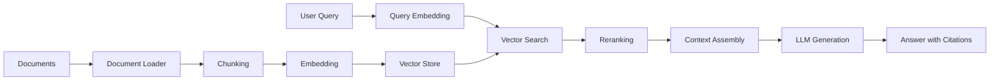

You will build a complete RAG pipeline from scratch using TypeScript and the NeuroLink SDK. By the end of this tutorial, you will have a working system that loads documents, chunks them intelligently, creates vector embeddings, stores them for fast retrieval, and generates answers with citations -- all with hybrid search, reranking, metadata extraction, and circuit breaker resilience.

RAG combines document retrieval with LLM generation to produce grounded, accurate responses backed by your own data. It reduces hallucination by grounding responses in real documents, works with private data the model has never seen, and requires no fine-tuning.

Now you will set up the architecture, starting with the ingestion pipeline.

## Architecture overview

Before writing code, let us understand how the pieces fit together. A RAG pipeline has two phases: **ingestion** (preparing documents for search) and **query** (finding relevant context and generating answers).



Each stage in the pipeline serves a distinct purpose:

1. **Load** -- Read documents from files, URLs, or raw strings into a normalized format.
2. **Chunk** -- Split documents into smaller passages that fit within embedding model limits and serve as retrieval units.
3. **Embed** -- Convert text chunks into high-dimensional vectors that capture semantic meaning.
4. **Store** -- Persist vectors in a vector database for efficient similarity search.
5. **Query** -- Convert the user's question into a vector and find the most similar stored chunks.
6. **Rerank** -- Apply a more sophisticated model to re-score the top candidates for precision.
7. **Assemble** -- Combine the best chunks into a context window with source citations.
8. **Generate** -- Pass the context and question to an LLM to produce a grounded answer.


## Step 1 -- Project Setup

Start by creating a new TypeScript project and installing the NeuroLink SDK.

```bash
mkdir rag-tutorial && cd rag-tutorial
npm init -y
npm install @juspay/neurolink
npm install -D typescript @types/node
```

Configure TypeScript for modern ES modules:

```json
// tsconfig.json
{
  "compilerOptions": {
    "target": "ES2022",
    "module": "ESNext",
    "moduleResolution": "bundler",
    "strict": true,
    "outDir": "dist",
    "rootDir": "src"
  },
  "include": ["src"]
}
```

Set your environment variables in a `.env` file:

```bash
OPENAI_API_KEY=sk-...
```

> **Note:** Never commit your `.env` file to version control. Add it to `.gitignore` immediately.
{: .prompt-info }

Create a `src/index.ts` file as the entry point. We will build up the RAG pipeline step by step in this file.

## Step 2 -- Load Documents

NeuroLink supports seven document formats out of the box: text, markdown, HTML, JSON, CSV, PDF, and web pages. The `loadDocument` and `loadDocuments` functions handle file reading and format detection automatically.

```typescript
import { loadDocument, loadDocuments, MDocument } from "@juspay/neurolink";

// Load a single markdown file
const doc = await loadDocument("./docs/architecture.md");

// Load multiple files with glob pattern
const docs = await loadDocuments(["./docs/*.md", "./docs/*.txt"]);

// Or use MDocument for fluent API
const mdoc = new MDocument({ text: rawMarkdownString });

// Load from web
import { WebLoader } from "@juspay/neurolink";
const webLoader = new WebLoader();
const webDoc = await webLoader.load("https://docs.example.com/api");
```

The `loadDocument` function detects the file type from the extension and uses the appropriate loader. For markdown files, it preserves heading structure. For HTML, it strips non-content tags while preserving semantic structure. For JSON, it serializes the content in a searchable format.

The `MDocument` class provides a fluent API that chains loading, chunking, embedding, and querying operations together. This is especially useful when processing a single document through the full pipeline.

> **Note:** For production workloads with large document sets, use `loadDocuments` with glob patterns to process files in batch. This is more memory-efficient than loading files one at a time in a loop.
{: .prompt-info }

When loading from the web, the `WebLoader` fetches the page, extracts the main content, and strips navigation, headers, and footers. You can configure it with custom CSS selectors for sites with non-standard layouts.

## Step 3 -- Chunk Documents

Chunking is arguably the most important step in a RAG pipeline. LLMs have token limits, and embedding models work best on focused passages rather than entire documents. The chunk size and strategy directly affect retrieval quality.

NeuroLink provides ten chunking strategies, each optimized for different content types. Here are the most commonly used options:

| Strategy | Best For | Max Size Default |
|---|---|---|
| `recursive` | General text | 1000 |
| `markdown` | Markdown docs | 1000 |
| `semantic` | Meaning-preserving splits | 500 |
| `sentence` | Paragraph-level retrieval | 1000 |
| `html` | Web pages | 1000 |
| `token` | Token-aware splitting | 512 |

You can chunk documents in several ways depending on your needs:

```typescript
import {
  ChunkerRegistry,
  getRecommendedStrategy,
  processDocument,
} from "@juspay/neurolink";

// Option 1: Auto-select strategy based on content type
const strategy = getRecommendedStrategy("text/markdown"); // returns "markdown"

// Option 2: Use MDocument fluent API
const doc = await loadDocument("./docs/guide.md");
await doc.chunk({
  strategy: "markdown",
  config: { maxSize: 1000 },
});
const chunks = doc.getChunks();

// Option 3: Use processDocument convenience function
const semanticChunks = await processDocument(markdownText, {
  strategy: "recursive",
  maxSize: 1000,
  overlap: 200,
});

// Option 4: Direct chunker access
const chunker = ChunkerRegistry.get("semantic");
const slidingChunks = await chunker.chunk(text, {
  maxSize: 500,
  overlap: 50,
});

console.log(`Created ${chunks.length} chunks`);
console.log("First chunk:", chunks[0].text.substring(0, 100));
```

**Choosing the right strategy matters.** The `recursive` strategy is the best general-purpose default. It attempts to split at paragraph boundaries first, then sentence boundaries, then word boundaries. This preserves natural reading units whenever possible.

For documentation and README files, the `markdown` strategy splits at heading boundaries (`#`, `##`, `###`), keeping each section as a coherent chunk. This dramatically improves retrieval quality because headings naturally delineate topics.

The `semantic` strategy goes a step further. It uses embedding similarity to detect where the topic changes within a document, inserting splits at meaning boundaries rather than structural ones. This is ideal for documents where structural markers do not align with topic boundaries.

> **Note:** Chunk overlap is critically important. Setting an overlap of 100-200 characters ensures that facts near chunk boundaries are not orphaned. Without overlap, a relevant sentence could be split across two chunks, and neither chunk would contain the complete thought.
{: .prompt-info }

## Step 4 -- Create Embeddings and Store

Embeddings convert text chunks into numerical vectors that capture semantic meaning. Similar texts produce similar vectors, which enables fast similarity search.

```typescript
import {
  InMemoryVectorStore,
  createVectorQueryTool,
} from "@juspay/neurolink";

// Create vector store (in-memory for development)
const vectorStore = new InMemoryVectorStore();

// Create the vector query tool
const queryTool = createVectorQueryTool(
  {
    indexName: "docs",
    embeddingModel: "text-embedding-3-small",
    topK: 10,
    enableFilter: true,
    includeSources: true,
  },
  vectorStore
);
```

The `InMemoryVectorStore` implements the `VectorStore` interface, which provides two core operations: `upsert` for adding embeddings and `query` for similarity search. The in-memory implementation is perfect for development and small-to-medium datasets.

For production deployments, you can swap in a persistent vector database like Pinecone, Qdrant, or pgvector by implementing the same `VectorStore` interface. The rest of your pipeline code stays exactly the same.

The `createVectorQueryTool` wraps the vector store in a tool interface that can be used directly with NeuroLink's generation pipeline. The `topK` parameter controls how many results to return, and `enableFilter` allows metadata-based filtering alongside vector similarity.

## Step 5 -- Use the RAG Pipeline

While you can wire each stage manually, the `RAGPipeline` class orchestrates the full ingestion and query flow in a single, clean API.

```typescript
import { RAGPipeline, createRAGPipeline } from "@juspay/neurolink";

// Create pipeline with configuration
const pipeline = new RAGPipeline({
  embeddingModel: {
    provider: "openai",
    modelName: "text-embedding-3-small",
  },
  generationModel: {
    provider: "openai",
    modelName: "gpt-4o-mini",
  },
});

// Ingest documents
await pipeline.ingest(["./docs/*.md"]);

// Query the pipeline
const response = await pipeline.query(
  "What are the key architectural decisions?"
);

console.log("Answer:", response.answer);
console.log("Sources:", response.sources);
```

The `RAGPipeline` handles the entire lifecycle for you. During ingestion, it loads documents, applies the configured chunking strategy, generates embeddings, and stores them in the vector store. During query, it embeds the question, performs similarity search, assembles context, and generates an answer with the LLM.

The `response.sources` array contains references to the original documents and chunk positions that contributed to the answer. This gives you automatic citation tracking without any additional code.

## Step 6 -- Add Hybrid Search and Reranking

Pure vector search is good, but hybrid search is better. Vector search excels at finding semantically similar content, but it can miss exact keyword matches. BM25 (the algorithm behind traditional full-text search) catches exact terms but misses semantic equivalence. Combining both gives you the best of both worlds.

```typescript
import {
  createHybridSearch,
  InMemoryBM25Index,
  InMemoryVectorStore,
  rerank,
  reciprocalRankFusion,
} from "@juspay/neurolink";

// Create hybrid search combining vector + BM25
const bm25Index = new InMemoryBM25Index();
const vectorStore = new InMemoryVectorStore();

const hybridSearch = createHybridSearch({
  vectorStore,
  bm25Index,
  fusionMethod: reciprocalRankFusion,
  vectorWeight: 0.7,
  bm25Weight: 0.3,
});

// Search and rerank
const results = await hybridSearch.search("query text", { topK: 20 });
const reranked = await rerank(results, "query text", { topK: 5 });
```

The `reciprocalRankFusion` function merges results from vector and BM25 search using the RRF formula: `score = 1/(k + rank_vector) + 1/(k + rank_bm25)`. This produces a unified ranking that respects both semantic similarity and keyword relevance.

Reranking adds a second quality filter. The initial retrieval (vector + BM25) is fast but approximate. Reranking applies a more sophisticated cross-encoder model to the top candidates, dramatically improving precision. You over-retrieve (top 20) and then rerank down to the final set (top 5).

> **Note:** The `vectorWeight` and `bm25Weight` parameters control the balance between semantic and keyword search. Start with 0.7/0.3 (favoring semantic) and adjust based on your evaluation results. For technical documentation with specific terminology, increase the BM25 weight.
{: .prompt-info }

## Step 7 -- Context Assembly and Generation

Once you have your top-ranked chunks, the final step is assembling them into a context window and generating an answer with citations.

```typescript
import {
  assembleContext,
  formatContextWithCitations,
  createContextWindow,
} from "@juspay/neurolink";
import { NeuroLink } from "@juspay/neurolink";

// Assemble context from retrieved chunks
const context = assembleContext(rerankedChunks, {
  maxTokens: 4000,
  includeSources: true,
});

// Format with citations
const formattedContext = formatContextWithCitations(context);

// Generate answer
const neurolink = new NeuroLink();
const result = await neurolink.generate({
  input: { text: userQuestion },
  provider: "openai",
  model: "gpt-4o-mini",
  systemPrompt: `Answer based on this context:\n\n${formattedContext}\n\nCite sources using [1], [2] format.`,
});

console.log(result.content);
```

The `assembleContext` function takes your reranked chunks and fits them into a token budget. It prioritizes higher-ranked chunks and ensures the total context stays within the specified `maxTokens` limit. The `includeSources` flag embeds source metadata into each chunk so the LLM can reference them.

The `formatContextWithCitations` function formats each chunk with a numbered citation marker. When you instruct the LLM to cite sources using `[1], [2]` format, the numbers correspond to the original documents. This gives your users verifiable, traceable answers.

## Step 8 -- Add Metadata Extraction

Metadata extraction enriches your chunks with structured information like titles, summaries, and keywords. This enables more sophisticated filtering and improves retrieval quality by giving the search engine more signals to work with.

```typescript
import { processDocument } from "@juspay/neurolink";

const chunks = await processDocument(documentText, {
  strategy: "markdown",
  maxSize: 1000,
  extract: {
    title: true,
    summary: true,
    keywords: true,
  },
  provider: "openai",
  model: "gpt-4o-mini",
});

// Chunks now have metadata
chunks.forEach((chunk) => {
  console.log("Title:", chunk.metadata.title);
  console.log("Keywords:", chunk.metadata.keywords);
});
```

Metadata extraction uses a lightweight LLM call (like `gpt-4o-mini`) to analyze each chunk and produce structured metadata. The extracted keywords enable faceted search -- you can filter chunks by topic, author, or date before applying vector similarity. The summaries provide a concise overview that can be displayed in search results alongside the full text.

> **Note:** Metadata extraction adds cost during ingestion (one LLM call per chunk), but it significantly improves retrieval quality and user experience at query time. Use a fast, inexpensive model like `gpt-4o-mini` for extraction to keep costs manageable.
{: .prompt-info }

## Complete RAG Application

Here is the full working example combining all steps into a single file with a CLI interface:

```typescript
import {
  RAGPipeline,
  NeuroLink,
  loadDocuments,
} from "@juspay/neurolink";
import * as readline from "readline";

async function main() {
  // Step 1: Create the pipeline
  const pipeline = new RAGPipeline({
    embeddingModel: {
      provider: "openai",
      modelName: "text-embedding-3-small",
    },
    generationModel: {
      provider: "openai",
      modelName: "gpt-4o-mini",
    },
  });

  // Step 2: Ingest documents
  console.log("Ingesting documents...");
  await pipeline.ingest(["./docs/*.md"]);
  console.log("Documents ingested successfully.");

  // Step 3: Interactive Q&A loop
  const rl = readline.createInterface({
    input: process.stdin,
    output: process.stdout,
  });

  const askQuestion = () => {
    rl.question("\nAsk a question (or 'quit'): ", async (question) => {
      if (question.toLowerCase() === "quit") {
        rl.close();
        return;
      }

      const response = await pipeline.query(question);
      console.log("\nAnswer:", response.answer);

      if (response.sources?.length > 0) {
        console.log("\nSources:");
        response.sources.forEach((source, i) => {
          console.log(`  [${i + 1}] ${source.document} (chunk ${source.chunkIndex})`);
        });
      }

      askQuestion();
    });
  };

  askQuestion();
}

main().catch(console.error);
```

This gives you a fully functional document Q&A system in under 50 lines of code. Load your documentation, ask questions in natural language, and get cited answers backed by your actual content.

## Resilience with Circuit Breaker

In production, your RAG pipeline depends on external services: embedding APIs, vector databases, and LLM providers. Any of these can experience transient failures. NeuroLink provides circuit breaker and retry patterns specifically designed for RAG workloads.

```typescript
import {
  RAGCircuitBreaker,
  RAGRetryHandler,
  executeWithCircuitBreaker,
} from "@juspay/neurolink";

const result = await executeWithCircuitBreaker(
  "embedding-service",
  async () => pipeline.query("user question"),
  { failureThreshold: 3, resetTimeoutMs: 30000 }
);
```

The circuit breaker monitors failure rates for each service. After three consecutive failures (configurable via `failureThreshold`), it opens the circuit and stops sending requests to the failing service for 30 seconds (configurable via `resetTimeoutMs`). This prevents cascading failures and gives the service time to recover.

The `RAGRetryHandler` adds exponential backoff for transient errors. Combined with the circuit breaker, this gives your RAG pipeline the resilience needed for production workloads where uptime matters.

## What you built

You built a production-ready RAG pipeline: document loading, intelligent chunking, vector embeddings, hybrid search, reranking, metadata extraction, and circuit breaker resilience. Your system goes from raw documents to cited answers with a single API call.

Continue with these related tutorials:

- Advanced RAG for ten chunking strategies, Graph RAG, and RAGAS evaluation
- Structured Output from LLMs for validating RAG answers against Zod schemas
- MCP Server Tutorial for exposing your RAG pipeline as an MCP tool

---

**Related posts:**

- [Building RAG Applications with NeuroLink SDK](/posts/rag-implementation/)
- [Multimodal Document Processing with NeuroLink](/posts/multimodal-document-processing/)
- [Real-Time AI: Streaming Response Patterns with NeuroLink](/posts/streaming-best-practices/)
