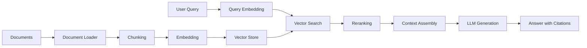

You will build a complete RAG pipeline from scratch using TypeScript and the NeuroLink SDK. By the end of this tutorial, you will have a working system that loads documents, chunks them, creates vector embeddings, stores them for retrieval, and returns generated answers with source records. You will also see hybrid search, reranking, metadata extraction, and a circuit-breaker wrapper.

RAG combines document retrieval with LLM generation so responses can be grounded in your own data. Supplying relevant source context can reduce unsupported answers, works with private data the model has not been trained on, and does not require fine-tuning; you should still evaluate factuality and citation quality for your application.

Now you will set up the architecture, starting with the ingestion pipeline.

## Architecture overview

Before writing code, let us understand how the pieces fit together. A RAG pipeline has two phases: **ingestion** (preparing documents for search) and **query** (finding relevant context and generating answers).


```mermaid
flowchart LR
    A[Documents] --> B[Document Loader]
    B --> C[Chunking]
    C --> D[Embedding]
    D --> E[Vector Store]
    F[User Query] --> G[Query Embedding]
    G --> H[Vector Search]
    E --> H
    H --> I[Reranking]
    I --> J[Context Assembly]
    J --> K[LLM Generation]
    K --> L[Answer with Citations]
```

Each stage in the pipeline serves a distinct purpose:

1. **Load** -- Read documents from files, URLs, or raw strings into a normalized format.
2. **Chunk** -- Split documents into smaller passages that fit within embedding model limits and serve as retrieval units.
3. **Embed** -- Convert text chunks into high-dimensional vectors that capture semantic meaning.
4. **Store** -- Persist vectors in a vector database for efficient similarity search.
5. **Query** -- Convert the user's question into a vector and find the most similar stored chunks.
6. **Rerank** -- Apply a more sophisticated model to re-score the top candidates for precision.
7. **Assemble** -- Combine the best chunks into a context window with source citations.
8. **Generate** -- Pass the context and question to an LLM to produce a grounded answer.


## Step 1 -- Project Setup

Start by creating a new TypeScript project and installing the NeuroLink SDK.

```bash
mkdir rag-tutorial && cd rag-tutorial
npm init -y
npm install @juspay/neurolink
npm install -D typescript @types/node
```

Configure TypeScript for modern ES modules:

```json
// tsconfig.json
{
  "compilerOptions": {
    "target": "ES2022",
    "module": "ESNext",
    "moduleResolution": "bundler",
    "strict": true,
    "outDir": "dist",
    "rootDir": "src"
  },
  "include": ["src"]
}
```

Set your environment variables in a `.env` file:

```bash
OPENAI_API_KEY=sk-...
```

> **Note:** Never commit your `.env` file to version control. Add it to `.gitignore` immediately.
{: .prompt-info }

Create a `src/index.ts` file as the entry point. We will build up the RAG pipeline step by step in this file.

## Step 2 -- Load Documents

NeuroLink supports seven document formats out of the box: text, markdown, HTML, JSON, CSV, PDF, and web pages. The `loadDocument` and `loadDocuments` functions handle file reading and format detection automatically.

```typescript
import { loadDocument, loadDocuments, MDocument } from "@juspay/neurolink";

// Load a single markdown file
const doc = await loadDocument("./docs/architecture.md");

// Load multiple files (an explicit array of paths -- loadDocuments does not expand globs)
const docs = await loadDocuments(["./docs/architecture.md", "./docs/setup.md"]);

// Or use MDocument for fluent API
const mdoc = MDocument.fromText(rawMarkdownString);

// Load from web
import { WebLoader } from "@juspay/neurolink";
const webLoader = new WebLoader();
const webDoc = await webLoader.load("https://docs.example.com/api");
```

The `loadDocument` function detects the file type from the extension and uses the appropriate loader. For markdown files, it preserves heading structure. For HTML, it strips non-content tags while preserving semantic structure. For JSON, it serializes the content in a searchable format.

The `MDocument` class provides a fluent API for creating, chunking, enriching, and embedding a document. Use `RAGPipeline` or a vector query tool for retrieval after those document-processing steps.

> **Note:** `loadDocuments` takes an explicit array of file paths -- it does not expand glob patterns itself. For large document sets, build the path list with a glob library (such as `glob` or `fast-glob`) and pass the resulting array in one call rather than looping over `loadDocument` file by file.
{: .prompt-info }

When loading from the web, `WebLoader` fetches the page and converts its HTML to plain text. Set `extractMainContent: true` to extract a common `<main>`, `<article>`, content container, or `<body>` region first; `contentSelector` accepts a tag name for a custom container.

## Step 3 -- Chunk Documents

Chunking is arguably the most important step in a RAG pipeline. LLMs have token limits, and embedding models work best on focused passages rather than entire documents. The chunk size and strategy directly affect retrieval quality.

NeuroLink provides ten chunking strategies, each optimized for different content types. Here are the most commonly used options:

| Strategy | Best For | Max Size Default |
|---|---|---|
| `recursive` | General text | 1000 |
| `markdown` | Markdown docs | 1000 |
| `semantic` | Meaning-preserving splits | 1000 |
| `sentence` | Paragraph-level retrieval | 1000 |
| `html` | Web pages | 1000 |
| `token` | Token-aware splitting | 512 |

You can chunk documents in several ways depending on your needs:

```typescript
import {
  ChunkerRegistry,
  getRecommendedStrategy,
  processDocument,
} from "@juspay/neurolink";

// Option 1: Auto-select strategy based on content type
const strategy = getRecommendedStrategy("text/markdown"); // returns "markdown"

// Option 2: Use MDocument fluent API
const doc = await loadDocument("./docs/guide.md");
await doc.chunk({
  strategy: "markdown",
  config: { maxSize: 1000 },
});
const chunks = doc.getChunks();

// Option 3: Use processDocument convenience function
const semanticChunks = await processDocument(markdownText, {
  strategy: "recursive",
  maxSize: 1000,
  overlap: 200,
});

// Option 4: Direct chunker access
const chunker = ChunkerRegistry.get("semantic");
const slidingChunks = await chunker.chunk(text, {
  maxSize: 500,
  overlap: 50,
});

console.log(`Created ${chunks.length} chunks`);
console.log("First chunk:", chunks[0].text.substring(0, 100));
```

**Choosing the right strategy matters.** The `recursive` strategy is a practical general-purpose default. It attempts to split at paragraph boundaries first, then line, sentence, word, and finally character boundaries. This preserves larger natural reading units when the configured size allows it.

For documentation and README files, the `markdown` strategy splits at configured heading levels (levels 1-3 by default), keeping heading context with each chunk and recording its heading metadata. Evaluate it against `recursive` on your own documentation queries.

The `semantic` strategy goes a step further. It uses embedding similarity to detect where the topic changes within a document, inserting splits at meaning boundaries rather than structural ones. This is ideal for documents where structural markers do not align with topic boundaries.

> **Note:** Chunk overlap is critically important. Setting an overlap of 100-200 characters ensures that facts near chunk boundaries are not orphaned. Without overlap, a relevant sentence could be split across two chunks, and neither chunk would contain the complete thought.
{: .prompt-info }

## Step 4 -- Create Embeddings and Store

Embeddings convert text chunks into numerical vectors that capture semantic meaning. Similar texts produce similar vectors, which enables fast similarity search.

```typescript
import {
  InMemoryVectorStore,
  createVectorQueryTool,
} from "@juspay/neurolink";

// Create vector store (in-memory for development)
const vectorStore = new InMemoryVectorStore();

// Create the vector query tool
const queryTool = createVectorQueryTool(
  {
    indexName: "docs",
    embeddingModel: { provider: "openai", modelName: "text-embedding-3-small" },
    topK: 10,
    enableFilter: true,
    includeSources: true,
  },
  vectorStore
);
```

The `InMemoryVectorStore` implements the `VectorStore` interface, whose two core operations are `upsert` for adding embeddings and `query` for similarity search. This snippet configures retrieval; populate the `"docs"` index with embedded chunks before invoking `queryTool.execute()`. The in-memory implementation is useful for development and small datasets.

For a persistent deployment, implement the same `VectorStore` interface for your chosen database and pass that implementation to the tool or pipeline. Confirm the database's filtering and indexing semantics in your adapter.

The `createVectorQueryTool` wraps the vector store in an object with a schema and `execute()` method. The `topK` parameter controls how many results to return, `enableFilter` exposes an optional metadata filter, and `includeSources` includes matching vector results in the response. Adapt this returned object to the tool shape expected by your generation path when necessary.

## Step 5 -- Use the RAG Pipeline

While you can wire each stage manually, the `RAGPipeline` class orchestrates the full ingestion and query flow in a single, clean API.

```typescript
import { RAGPipeline } from "@juspay/neurolink";

// Create pipeline with configuration
const pipeline = new RAGPipeline({
  embeddingModel: {
    provider: "openai",
    modelName: "text-embedding-3-small",
  },
  generationModel: {
    provider: "openai",
    modelName: "gpt-5.4-mini",
  },
});

// Ingest documents
await pipeline.ingest(["./docs/architecture.md", "./docs/setup.md"]);

// Query the pipeline
const response = await pipeline.query(
  "What are the key architectural decisions?"
);

console.log("Answer:", response.answer);
console.log("Sources:", response.sources);
```

The `RAGPipeline` handles the entire lifecycle for you. During ingestion, it loads documents, applies the configured chunking strategy, generates embeddings, and stores them in the vector store. During query, it embeds the question, performs similarity search, assembles context, and generates an answer with the LLM.

The `response.sources` array contains each retrieved chunk's `id`, `text`, similarity `score`, and any `metadata`. Use those records to display or persist source references alongside the generated answer.

## Step 6 -- Add Hybrid Search and Reranking

Vector and keyword search provide different signals. Vector search finds semantically similar content but can miss exact identifiers; BM25 favors matching terms but does not model semantic equivalence. Hybrid search fuses both rankings, and you should compare it with each single-mode baseline on your query set.

```typescript
import {
  createHybridSearch,
  InMemoryBM25Index,
  InMemoryVectorStore,
  ProviderFactory,
  rerank,
} from "@juspay/neurolink";

// Create hybrid search combining vector + BM25
const bm25Index = new InMemoryBM25Index();
const vectorStore = new InMemoryVectorStore();

const hybridSearch = createHybridSearch({
  vectorStore,
  bm25Index,
  indexName: "docs",
  embeddingModel: { provider: "openai", modelName: "text-embedding-3-small" },
  defaultConfig: {
    fusionMethod: "rrf",
    vectorWeight: 0.7,
    bm25Weight: 0.3,
  },
});

// Search and rerank
const results = await hybridSearch("query text", { topK: 20 });
const rerankModel = await ProviderFactory.createProvider("openai", "gpt-5.4-mini");
const reranked = await rerank(results, "query text", rerankModel, { topK: 5 });
```

The `"rrf"` fusion method merges results from vector and BM25 search using the Reciprocal Rank Fusion formula: `score = 1/(k + rank_vector) + 1/(k + rank_bm25)`. This produces a unified ranking that respects both semantic similarity and keyword relevance.

Reranking adds a second quality filter. The initial retrieval (vector + BM25) is fast but approximate. NeuroLink's `rerank` combines an LLM-based semantic relevance score with the original vector similarity and result position to re-score the top candidates. In this example you over-retrieve 20 results and rerank down to 5; evaluate the effect on your own query set.

> **Note:** The `vectorWeight` and `bm25Weight` parameters control the balance between semantic and keyword search. Start with 0.7/0.3 (favoring semantic) and adjust based on your evaluation results. For technical documentation with specific terminology, increase the BM25 weight.
{: .prompt-info }

## Step 7 -- Context Assembly and Generation

Once you have your top-ranked chunks, the final step is assembling them into a context window and generating an answer with citations.

```typescript
import { formatContextWithCitations, NeuroLink } from "@juspay/neurolink";

const retrievedChunks = reranked.map(({ result }) => result);
const { context, citations } = formatContextWithCitations(retrievedChunks, {
  maxTokens: 4000,
});

// Generate answer
const neurolink = new NeuroLink();
const result = await neurolink.generate({
  input: { text: userQuestion },
  provider: "openai",
  model: "gpt-5.4-mini",
  systemPrompt: `Answer based on this context:\n\n${context}\n\nCite sources using [1], [2] format.`,
});

console.log(result.content);
console.log(citations);
```

`formatContextWithCitations` accepts chunks or vector-query results, orders them by relevance by default, and assembles them within the approximate `maxTokens` budget. Because `rerank()` returns wrapper objects, the example first extracts each wrapper's `result`.

The function returns both the formatted `context` string and a `citations` array. The numbered markers identify retrieved chunks; their labels use `metadata.source` when available and otherwise fall back to the chunk ID.

## Step 8 -- Add Metadata Extraction

Metadata extraction enriches your chunks with structured information like titles, summaries, and keywords. This enables more sophisticated filtering and improves retrieval quality by giving the search engine more signals to work with.

```typescript
import { processDocument } from "@juspay/neurolink";

const chunks = await processDocument(documentText, {
  strategy: "markdown",
  maxSize: 1000,
  extract: {
    title: true,
    summary: true,
    keywords: true,
  },
  provider: "openai",
  model: "gpt-5.4-mini",
});

// Chunks now have metadata
chunks.forEach((chunk) => {
  console.log("Title:", chunk.metadata.title);
  console.log("Keywords:", chunk.metadata.keywords);
});
```

Metadata extraction uses an LLM call to analyze each chunk and produce the requested fields. The resulting values are attached to `chunk.metadata`; your application can display the summaries or use metadata filters supported by its vector store.

> **Note:** Metadata extraction adds LLM calls during ingestion. Use a fast, inexpensive model like `gpt-5.4-mini` for extraction, and measure whether the additional metadata improves retrieval for your corpus.
{: .prompt-info }

## Complete RAG Application

Here is the full working example combining all steps into a single file with a CLI interface:

```typescript
import { RAGPipeline } from "@juspay/neurolink";
import * as readline from "readline";

async function main() {
  // Step 1: Create the pipeline
  const pipeline = new RAGPipeline({
    embeddingModel: {
      provider: "openai",
      modelName: "text-embedding-3-small",
    },
    generationModel: {
      provider: "openai",
      modelName: "gpt-5.4-mini",
    },
  });

  // Step 2: Ingest documents
  console.log("Ingesting documents...");
  await pipeline.ingest(["./docs/architecture.md", "./docs/setup.md"]);
  console.log("Documents ingested successfully.");

  // Step 3: Interactive Q&A loop
  const rl = readline.createInterface({
    input: process.stdin,
    output: process.stdout,
  });

  const askQuestion = () => {
    rl.question("\nAsk a question (or 'quit'): ", async (question) => {
      if (question.toLowerCase() === "quit") {
        rl.close();
        return;
      }

      const response = await pipeline.query(question);
      console.log("\nAnswer:", response.answer);

      if (response.sources?.length > 0) {
        console.log("\nSources:");
        response.sources.forEach((source, i) => {
          console.log(`  [${i + 1}] ${source.id} (score: ${source.score.toFixed(2)})`);
        });
      }

      askQuestion();
    });
  };

  askQuestion();
}

main().catch(console.error);
```

This gives you a compact document Q&A example. Load your documentation, ask questions in natural language, and inspect the returned source records alongside each answer.

## Resilience with Circuit Breaker

In production, your RAG pipeline depends on external services: embedding APIs, vector databases, and LLM providers. Any of these can experience transient failures. NeuroLink provides circuit breaker and retry patterns specifically designed for RAG workloads.

```typescript
import { executeWithCircuitBreaker } from "@juspay/neurolink";

const result = await executeWithCircuitBreaker(
  "embedding-service",
  async () => pipeline.query("user question"),
  "query",
  { failureThreshold: 3, resetTimeout: 30000 }
);
```

The circuit breaker tracks calls for each named operation. With the default `minimumCallsBeforeCalculation` of 10, it begins evaluating the window after ten calls and opens when failures reach the configured `failureThreshold` (three here). It then stops sending requests for 30 seconds (`resetTimeout`). This prevents cascading failures and gives the service time to recover.

The `RAGRetryHandler` adds exponential backoff for transient errors. Combined with the circuit breaker, this gives your RAG pipeline the resilience needed for production workloads where uptime matters.

## What you built

You built a RAG pipeline with document loading, chunking, vector embeddings, hybrid search, reranking, metadata extraction, and a circuit-breaker wrapper. Before production use, add persistent storage, access controls, observability, and evaluation for your own corpus and failure modes.

Continue with these related tutorials:

- Advanced RAG for ten chunking strategies, Graph RAG, and retrieval evaluation design
- Structured Output from LLMs for validating RAG answers against Zod schemas
- MCP Server Tutorial for exposing your RAG pipeline as an MCP tool

---

**Related posts:**

- [Building RAG Applications with NeuroLink SDK](/posts/rag-implementation/)
- [Multimodal Document Processing with NeuroLink](/posts/multimodal-document-processing/)
- [Real-Time AI: Streaming Response Patterns with NeuroLink](/posts/streaming-best-practices/)
