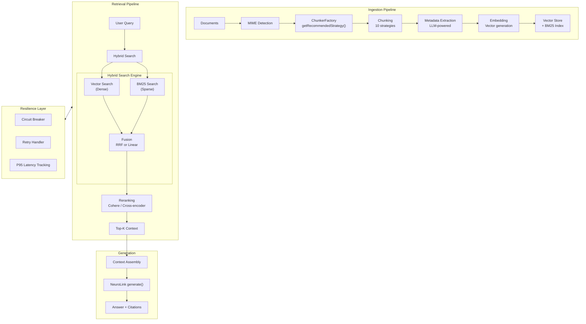
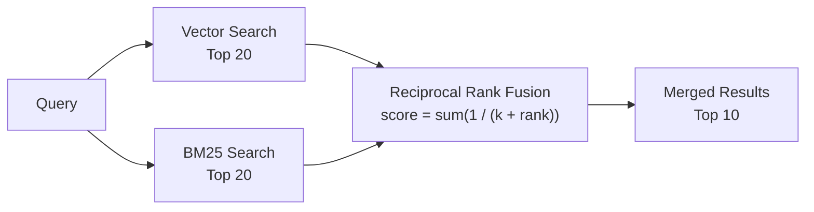
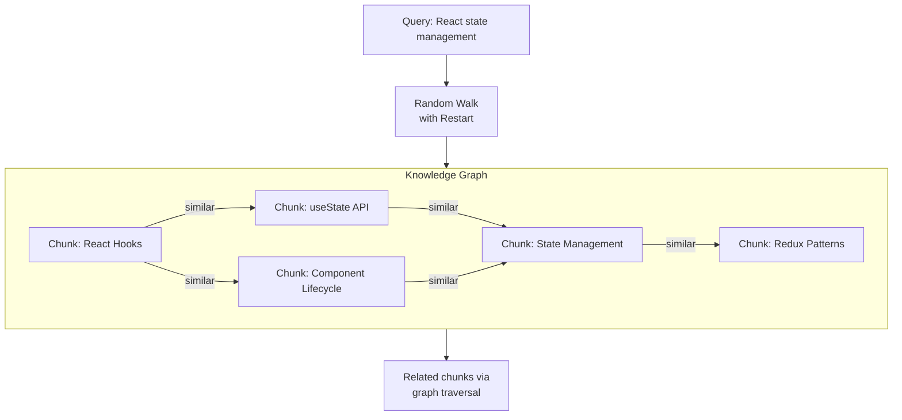

We designed NeuroLink's RAG subsystem to close the gap between demo-quality retrieval and production-grade retrieval. The core design decision was that chunking, search, and reranking must be content-aware -- generic approaches fail when real documents arrive with tables, nested imports, and cross-references.

The architecture addresses three distinct failure modes in basic RAG: irrelevant chunks from naive splitting (solved by ten content-aware chunking strategies), missed results from pure vector search (solved by hybrid BM25 plus vector retrieval), and noisy rankings that bury the best context (solved by Cohere and cross-encoder reranking). We chose to build Graph RAG and circuit breaker resilience into the same subsystem because knowledge-aware retrieval and operational reliability are not optional features -- they are production requirements.

This deep dive covers each component, the trade-offs behind each design decision, and benchmarks from production deployments.

## The RAG Pipeline Architecture

NeuroLink's RAG pipeline is divided into three stages: ingestion, retrieval, and generation. Each stage is modular and configurable.



The pipeline flows left to right: documents enter the ingestion pipeline where they are detected, chunked, enriched with metadata, embedded, and stored. When a user queries, the retrieval pipeline performs hybrid search, fuses results, reranks them, and produces a focused context window. The generation stage assembles that context and produces a cited answer. The resilience layer wraps the entire retrieval pipeline with circuit breakers, retry handlers, and latency tracking.


## The 10 Chunking Strategies

Chunking is where most RAG pipelines fail. A one-size-fits-all approach simply cannot handle the diversity of document types in a production system. NeuroLink provides ten chunking strategies, each designed for a specific content type.

### Overview Table

| # | Strategy | Best For | How It Works |
|---|----------|----------|-------------|
| 1 | **Character** | Simple text | Splits at character count with overlap |
| 2 | **Token** | Token-budget-aware | Splits at token boundaries |
| 3 | **Sentence** | Natural language | Splits at sentence boundaries (NLP) |
| 4 | **Recursive** | General documents | Hierarchical splitting (paragraphs then sentences then words) |
| 5 | **Markdown** | Documentation, READMEs | Splits at headers and sections |
| 6 | **Semantic** | Mixed-topic documents | Splits where meaning changes (embedding similarity) |
| 7 | **HTML** | Web pages | Splits at DOM structure (tags, sections) |
| 8 | **JSON** | API responses, configs | Splits at JSON structure (objects, arrays) |
| 9 | **LaTeX** | Academic papers | Splits at LaTeX structure (sections, equations) |
| 10 | **Code** | Source code | Splits at functions, classes, imports |

### Using Chunking Strategies

RAG can be configured in two ways: inline via the `rag` option in `generate()` calls, or standalone using the `RAGPipeline` and `ChunkerRegistry` exports.

**Inline RAG with generate():**

```typescript
import { NeuroLink } from '@juspay/neurolink';

const neurolink = new NeuroLink();

// Recursive chunking (most versatile) -- configured via rag option in generate()
const result = await neurolink.generate({
  input: { text: 'Summarize the key points from this document' },
  provider: 'openai',
  model: 'gpt-4o',
  rag: {
    files: ['./docs/guide.md'],
    strategy: 'recursive',
    chunkSize: 1000,
    topK: 5,
  },
});

// Markdown chunking (for documentation)
const mdResult = await neurolink.generate({
  input: { text: 'What are the main sections?' },
  provider: 'openai',
  model: 'gpt-4o',
  rag: {
    files: ['./README.md'],
    strategy: 'markdown',
    chunkSize: 1500,
    topK: 5,
  },
});
```

**Standalone document processing:**

```typescript
import { loadDocument, RAGPipeline, ChunkerRegistry } from '@juspay/neurolink';

// Load and chunk a document
const doc = await loadDocument('./docs/guide.md');
await doc.chunk({ strategy: 'markdown', config: { maxSize: 1000 } });

// Use ChunkerRegistry for strategy discovery
const strategies = ChunkerRegistry.getAvailableStrategies();
console.log('Available strategies:', strategies);
```

> **Note:** For documentation workloads, start with the `markdown` strategy. For code repositories, use the `code` strategy. For general-purpose text where you are unsure, `recursive` is the safest default. The `semantic` strategy gives the best quality but is slower due to the embedding calls required for boundary detection.
{: .prompt-info }

### The ChunkerFactory: Auto-Selection

The `ChunkerRegistry` can recommend the best strategy based on your content type, eliminating guesswork:

```typescript
import { ChunkerRegistry } from '@juspay/neurolink';

// ChunkerRegistry lists available chunking strategies
const strategies = ChunkerRegistry.getAvailableStrategies();
// Returns: ['character', 'token', 'sentence', 'recursive', 'markdown',
//           'semantic', 'html', 'json', 'latex', 'code']

// Use the rag option in generate() and let NeuroLink handle strategy selection
const result = await neurolink.generate({
  input: { text: 'What are the key findings?' },
  provider: 'openai',
  model: 'gpt-4o',
  rag: {
    files: ['./docs/report.md'],
    strategy: 'markdown', // Explicitly specify strategy based on content type
    chunkSize: 1000,
    topK: 5,
  },
});
```

The registry uses a factory pattern with lazy loading. Each chunker is loaded only when first used, keeping the initial bundle small. The registry also supports aliases: `'md'` resolves to `'markdown'`, `'tex'` to `'latex'`, and `'langchain-default'` to `'recursive'`.

### When to Use Each Strategy

**Character chunking** is the baseline. It splits at a fixed character count with overlap. Use it only for truly unstructured text with no formatting markers.

**Recursive chunking** is the Swiss Army knife. It tries to split at `\n\n` (paragraphs) first, then `\n` (lines), then `.` (sentences), then `" "` (words), and finally individual characters. This preserves the most meaningful boundaries when possible.

**Sentence chunking** splits at sentence boundaries (periods, question marks, exclamation marks) and groups sentences to fill the chunk size. It is ideal for Q&A applications where each chunk should contain complete thoughts.

**Token chunking** splits by token count using model-specific tokenizers. Use it when you need exact token budgets, such as when your embedding model has a strict 512-token limit.

**Markdown chunking** splits at heading boundaries, preserving the heading hierarchy as metadata. For documentation workflows, this is almost always the right choice.

**Semantic chunking** uses embedding similarity to detect where the topic changes within a document. It is the highest-quality strategy for documents where structural markers do not align with topic boundaries, but it is slower due to the embedding calls.

**HTML chunking** splits at semantic HTML tags (`<article>`, `<section>`, `<p>`, `<h1>`-`<h6>`). Essential for web content scraping where DOM structure carries meaning.

**JSON chunking** splits at object boundaries, respecting nesting depth. It ensures that no chunk contains an invalid JSON fragment.

**LaTeX chunking** splits at `\section`, `\subsection`, `\begin{environment}`, and math blocks. Critical for academic papers where equations and proofs must stay intact.

**Code chunking** splits at function, class, and import boundaries. It keeps complete code units together so that retrieved chunks are syntactically valid.

## Hybrid search: BM25 + Vector

### Why Vector-Only Search Is Not Enough

Vector search excels at semantic similarity. It can match "authentication workflow" with "login process" because the embeddings are close in vector space. But it struggles with exact keyword matches. Searching for "NeuroLink" as a specific term might not surface documents that mention it by name if the embedding model does not weight that token highly.

BM25 (the algorithm behind Elasticsearch and other full-text search engines) is the opposite. It catches exact terms with precision but misses semantic equivalence entirely. Searching for "React hooks" with BM25 will never match "component lifecycle patterns" even though they are conceptually related.

Hybrid search combines both for the best recall. In our benchmarks, hybrid search improves recall@5 by 8-12% over pure vector search across all chunking strategies.

### Reciprocal Rank Fusion (RRF)



RRF is a rank-based fusion method that does not depend on the absolute scores from each search system. It combines rankings using the formula: `score = 1/(k + rank_vector) + 1/(k + rank_bm25)` where `k` is a constant (typically 60). This makes it robust across different scoring scales.

```typescript
// Hybrid search is configured via the RAGPipeline class
import { RAGPipeline } from '@juspay/neurolink';

const pipeline = new RAGPipeline({
  embeddingModel: { provider: 'openai', modelName: 'text-embedding-3-small' },
  generationModel: { provider: 'openai', modelName: 'gpt-4o' },
  searchStrategy: 'hybrid',
  hybridOptions: {
    vectorWeight: 0.6,   // Weight for semantic similarity
    bm25Weight: 0.4,     // Weight for keyword matching
    fusionMethod: 'rrf', // 'rrf' or 'linear'
    rrf: {
      k: 60, // RRF constant (higher = more weight to lower ranks)
    },
  },
});

await pipeline.ingest(['./docs/*.md']);
const response = await pipeline.query('How to implement rate limiting in Express');
console.log(response.answer);
```

### Linear Combination

If you prefer a simpler fusion method, linear combination directly blends the normalized scores:

```typescript
// Alternative: linear combination of scores via RAGPipeline
const pipeline = new RAGPipeline({
  embeddingModel: { provider: 'openai', modelName: 'text-embedding-3-small' },
  generationModel: { provider: 'openai', modelName: 'gpt-4o' },
  searchStrategy: 'hybrid',
  hybridOptions: {
    vectorWeight: 0.7,
    bm25Weight: 0.3,
    fusionMethod: 'linear',
  },
});

await pipeline.ingest(['./docs/*.md']);
const response = await pipeline.query('React hooks best practices');
```

Linear combination is simpler to reason about but requires that both search systems produce scores on comparable scales. RRF is generally more robust and is the recommended default.

## Reranking: The Quality Filter

### Why Rerank After Retrieval?

Initial retrieval (vector + BM25) is optimized for speed. It scans thousands of chunks in milliseconds to produce a rough top-K. But fast retrieval is approximate. It often includes chunks that are topically related but not directly answering the question.

Reranking applies a more sophisticated (but slower) model to the top candidates. Instead of comparing the query to each chunk independently, a cross-encoder model evaluates the query-chunk pair together, producing a much more accurate relevance score. The trade-off is latency, which is why reranking is applied only to the top candidates rather than the full index.

In practice, reranking dramatically improves precision at the top positions. The answer you want moves from position 5 to position 1.

### Cohere Reranking

```typescript
// Reranking is configured via the RAGPipeline class
const pipeline = new RAGPipeline({
  embeddingModel: { provider: 'openai', modelName: 'text-embedding-3-small' },
  generationModel: { provider: 'openai', modelName: 'gpt-4o' },
  searchStrategy: 'hybrid',
  reranker: {
    type: 'cohere',
    model: 'rerank-english-v3.0',
    topN: 5,
  },
});

await pipeline.ingest(['./docs/*.md']);
const response = await pipeline.query('Kubernetes pod autoscaling configuration');
```

Cohere's reranking model is purpose-built for relevance scoring. It evaluates query-document pairs holistically, considering word order, negation, and contextual meaning that bi-encoder models miss.

### Cross-Encoder Reranking

```typescript
const pipeline = new RAGPipeline({
  embeddingModel: { provider: 'openai', modelName: 'text-embedding-3-small' },
  generationModel: { provider: 'openai', modelName: 'gpt-4o' },
  reranker: {
    type: 'cross-encoder',
    model: 'cross-encoder/ms-marco-MiniLM-L-12-v2',
    topN: 5,
  },
});

await pipeline.ingest(['./docs/*.md']);
const response = await pipeline.query('How to handle database migrations');
```

### Custom Reranking

For domain-specific scoring needs, you can provide a custom reranking function:

```typescript
// Custom reranking via the reranker factory registry
const pipeline = new RAGPipeline({
  embeddingModel: { provider: 'openai', modelName: 'text-embedding-3-small' },
  generationModel: { provider: 'openai', modelName: 'gpt-4o' },
  reranker: {
    type: 'custom',
    rerankerFn: async (query, documents) => {
      // Your custom scoring logic
      return documents
        .map(doc => ({
          ...doc,
          score: customScoringFunction(query, doc.content),
        }))
        .sort((a, b) => b.score - a.score)
        .slice(0, 5);
    },
  },
});
```

Custom rerankers are useful when you have domain-specific relevance signals that general models miss, such as recency, authority, or regulatory importance.

## Graph RAG: Knowledge-Aware Retrieval

Standard retrieval finds chunks that are similar to the query. Graph RAG goes further by following relationship chains between chunks. If chunk A is relevant to the query and chunk B is closely related to chunk A, Graph RAG retrieves both -- even if chunk B has low direct similarity to the query.



The knowledge graph is built during ingestion. Each chunk becomes a node, and edges are created between chunks whose embedding similarity exceeds a threshold. At query time, the system performs a Random Walk with Restart from the initial seed chunks, exploring the graph to discover related content that standard similarity search would miss.

Graph RAG is particularly effective for queries that span multiple topics or require connecting information from different sections of the documentation. For example, a question about "how state management affects component rendering" benefits from chunks about state management, component lifecycle, and rendering optimization -- even if those chunks come from different documents.

## Metadata extraction

LLM-powered metadata extraction enriches each chunk with structured information: title, summary, keywords, and auto-generated Q&A pairs. This metadata serves two purposes: it enables faceted filtering (narrow results by topic before vector search) and it improves retrieval quality by providing additional search signals.

```typescript
// Metadata extraction is handled within the RAGPipeline during ingestion
const pipeline = new RAGPipeline({
  embeddingModel: { provider: 'openai', modelName: 'text-embedding-3-small' },
  generationModel: { provider: 'openai', modelName: 'gpt-4o' },
  metadataExtraction: {
    enabled: true,
    extractFields: ['title', 'summary', 'keywords', 'questions'],
    model: 'gpt-4o-mini', // Use cheap model for metadata extraction
  },
});

await pipeline.ingest(['./docs/*.md']);

// Query with metadata-enriched retrieval
const response = await pipeline.query('authentication best practices');
console.log(response.answer);
```

The `questions` field is especially powerful. During ingestion, the LLM generates hypothetical questions that each chunk could answer. At query time, the system can match the user's question against these generated questions for more accurate retrieval. This technique — generating hypothetical questions during ingestion — consistently improves retrieval quality by enabling question-to-question matching at query time. Note: this is distinct from HyDE (Hypothetical Document Embeddings), which instead generates a hypothetical answer at query time and uses its embedding for retrieval.

> **Note:** Use `gpt-4o-mini` or a similarly inexpensive model for metadata extraction. The quality difference between extraction models is minimal, but the cost difference is significant when processing thousands of chunks.
{: .prompt-info }

## RAG Resilience: Circuit Breakers and Retry

A production RAG pipeline depends on multiple external services: embedding APIs, vector databases, reranking services, and LLM providers. Any of these can fail, and your pipeline needs to handle failures gracefully.

```typescript
// Built-in resilience configuration is part of the RAGPipeline
import { RAGPipeline } from '@juspay/neurolink';

const pipeline = new RAGPipeline({
  embeddingModel: { provider: 'openai', modelName: 'text-embedding-3-small' },
  generationModel: { provider: 'openai', modelName: 'gpt-4o' },
  resilience: {
    circuitBreaker: {
      failureThreshold: 5,
      resetTimeout: 30000,
    },
    retry: {
      maxAttempts: 3,
      backoffMultiplier: 2,
    },
    monitoring: {
      trackP95: true,
      alertThresholdMs: 500,
    },
  },
});
```

The circuit breaker monitors failure rates for each external service. After five consecutive failures, it opens the circuit and stops sending requests for 30 seconds. This prevents cascading failures and gives the service time to recover.

The retry handler applies exponential backoff for transient errors. With a backoff multiplier of 2, retries happen at 1s, 2s, and 4s intervals, giving temporary issues time to resolve.

P95 latency tracking monitors the 95th percentile response time. When retrieval latency exceeds the alert threshold (500ms), the system can trigger alerts or automatically degrade to a faster but less accurate retrieval mode (for example, falling back to BM25-only search if the vector store is slow).

> **Note:** Graceful degradation is a key design principle. If the vector database is down, the pipeline falls back to BM25-only search. If the reranker is unavailable, it skips reranking and returns the initial retrieval results. The system always returns an answer, even if the quality is reduced.
{: .prompt-info }

## Evaluation with RAGAS Metrics

Building a RAG pipeline is only half the battle. Measuring its quality is equally important. RAGAS (Retrieval-Augmented Generation Assessment) provides standardized metrics for evaluating RAG systems:

- **Faithfulness** -- Does the answer stick to the retrieved context, or does it hallucinate?
- **Answer Relevance** -- Is the answer relevant to the question?
- **Context Relevance** -- Are the retrieved chunks relevant to the question?

Automated evaluation lets you run regression tests whenever you change chunking strategies, reranking models, or retrieval parameters. You can set quality thresholds and block deployments that degrade RAG quality below your baseline.

## Putting it all together

Here is a complete advanced RAG pipeline combining auto-detected chunking, hybrid search, Cohere reranking, metadata extraction, and circuit breaker resilience:

```typescript
import { RAGPipeline, NeuroLink } from '@juspay/neurolink';

const pipeline = new RAGPipeline({
  embeddingModel: { provider: 'openai', modelName: 'text-embedding-3-small' },
  generationModel: { provider: 'openai', modelName: 'gpt-4o' },
  searchStrategy: 'hybrid',
  hybridOptions: {
    vectorWeight: 0.6,
    bm25Weight: 0.4,
    fusionMethod: 'rrf',
  },
  reranker: {
    type: 'cohere',
    model: 'rerank-english-v3.0',
    topN: 5,
  },
  metadataExtraction: {
    enabled: true,
    extractFields: ['title', 'summary', 'keywords'],
    model: 'gpt-4o-mini',
  },
  resilience: {
    circuitBreaker: { failureThreshold: 5, resetTimeout: 30000 },
    retry: { maxAttempts: 3, backoffMultiplier: 2 },
    monitoring: { trackP95: true, alertThresholdMs: 500 },
  },
});

// Ingest your documentation
await pipeline.ingest(['./docs/*.md', './docs/*.txt']);

// Query with full advanced pipeline
const response = await pipeline.query(
  'How do I configure streaming with error handling?'
);

console.log(response.answer);
console.log(`Sources: ${response.sources.length}`);
```

## Comparison: Basic RAG vs Advanced RAG

| Dimension | Basic RAG | Advanced RAG |
|-----------|-----------|-------------|
| Chunking | Fixed-size character splits | Strategy auto-selected by content type |
| Search | Vector-only | Hybrid (BM25 + Vector + RRF) |
| Ranking | Single score | Multi-stage: initial + reranking |
| Metadata | None | LLM-extracted (title, keywords, Q&A) |
| Graph | None | Knowledge graph traversal |
| Resilience | None | Circuit breaker + retry + P95 tracking |
| Quality | Variable | RAGAS-evaluated |

The jump from basic to advanced RAG is significant. In our internal benchmarks across 500 documents and 500 queries, advanced RAG with hybrid search and reranking achieved 92-94% recall@5 on documentation workloads, compared to 71-78% for basic RAG with character splitting and vector-only search.

## Design decisions and Trade-offs

We chose content-aware chunking over universal strategies because the data shows that document structure matters more than chunk size for retrieval quality. The trade-off is configuration complexity -- ten strategies require selection logic -- which we addressed with `getRecommendedStrategy()` based on MIME type detection.

The hybrid search design (BM25 plus vector with RRF fusion) adds latency compared to vector-only search. We accepted this trade-off because hybrid search consistently outperforms vector-only on real-world queries that mix technical terms with semantic concepts.

For related architecture decisions:

- [Building RAG Applications](/posts/rag-application-typescript-tutorial/) for the foundational pipeline if you are new to RAG
- Vector Database Guide for choosing the right production vector store
- Embeddings and Vector Operations for embedding models and similarity metrics

---

**Related posts:**

- [Building a RAG Application with TypeScript: Complete Tutorial](/posts/rag-application-typescript-tutorial/)
- [Building RAG Applications with NeuroLink SDK](/posts/rag-implementation/)
- [AI Observability: Monitoring LLM Applications in Production](/posts/monitoring-observability/)
