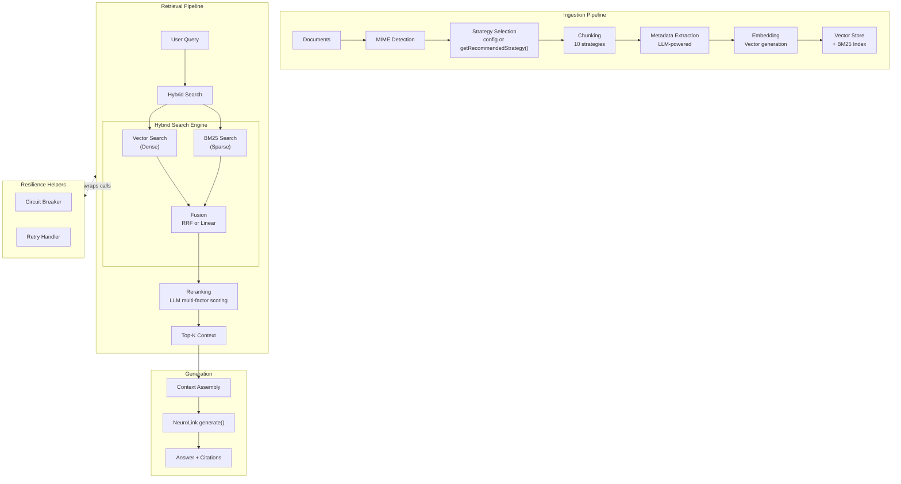
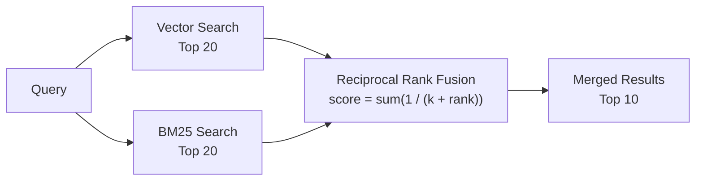
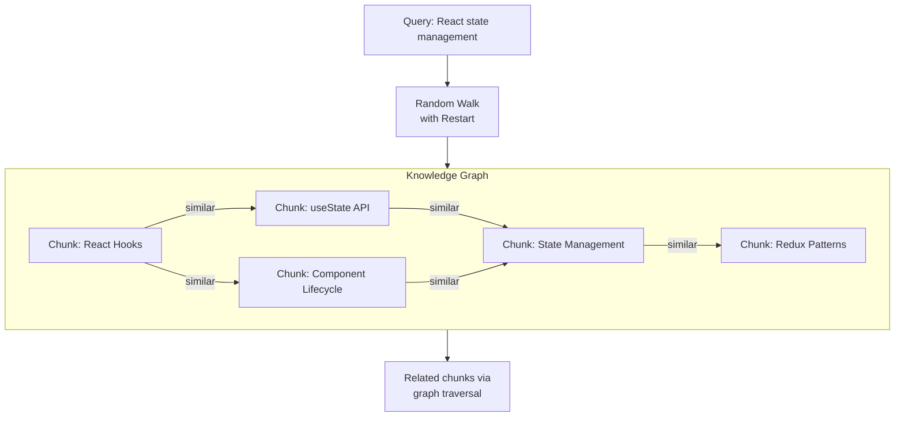

NeuroLink's RAG subsystem provides content-aware choices for chunking, search, and reranking. Those choices matter when documents contain tables, nested structure, and cross-references that a single fixed-size splitter does not preserve well.

The architecture targets three common failure modes in basic RAG: irrelevant chunks from naive splitting, missed results from pure vector search, and noisy rankings that bury useful context. Ten chunking strategies, hybrid BM25 plus vector retrieval, and LLM-based multi-factor reranking address those stages; Graph RAG and standalone resilience helpers support relationship-aware retrieval and failure handling when an application needs them.

This deep dive covers each component, the trade-offs behind each design decision, and how to configure each one.

## The RAG Pipeline Architecture

NeuroLink's RAG pipeline is divided into three stages: ingestion, retrieval, and generation. Each stage is modular and configurable.


```mermaid
flowchart TB
    subgraph Ingestion["Ingestion Pipeline"]
        DOC["Documents"] --> DETECT["MIME Detection"]
        DETECT --> SELECT["Strategy Selection<br/>config or getRecommendedStrategy()"]
        SELECT --> CHUNK["Chunking<br/>10 strategies"]
        CHUNK --> META["Metadata Extraction<br/>LLM-powered"]
        META --> EMBED["Embedding<br/>Vector generation"]
        EMBED --> STORE["Vector Store<br/>+ BM25 Index"]
    end

    subgraph Retrieval["Retrieval Pipeline"]
        QUERY["User Query"] --> HYBRID["Hybrid Search"]

        subgraph HybridSearch["Hybrid Search Engine"]
            VEC["Vector Search<br/>(Dense)"]
            BM25["BM25 Search<br/>(Sparse)"]
            FUSE["Fusion<br/>RRF or Linear"]
        end

        HYBRID --> VEC & BM25
        VEC & BM25 --> FUSE
        FUSE --> RERANK["Reranking<br/>LLM multi-factor scoring"]
        RERANK --> CONTEXT["Top-K Context"]
    end

    subgraph Generation["Generation"]
        CONTEXT --> ASSEMBLE["Context Assembly"]
        ASSEMBLE --> LLM["NeuroLink generate()"]
        LLM --> ANSWER["Answer + Citations"]
    end

    subgraph Resilience["Resilience Helpers"]
        CB["Circuit Breaker"]
        RETRY["Retry Handler"]
    end

    Retrieval <-.->|"caller wraps calls"| Resilience
```

The diagram shows the optional stages together. Documents are loaded, chunked, optionally enriched with metadata, embedded, and stored. A query can use vector, hybrid, or graph retrieval and can optionally rerank the results before context assembly and generation. The circuit breaker and retry handler are standalone helpers you wrap around pipeline calls yourself -- they are not automatically applied.


## The 10 Chunking Strategies

Chunking is where most RAG pipelines fail. A one-size-fits-all approach simply cannot handle the diversity of document types in a production system. NeuroLink provides ten chunking strategies, each designed for a specific content type.

### Overview Table

| # | Strategy | Best For | How It Works |
|---|----------|----------|-------------|
| 1 | **Character** | Simple text | Splits at character count with overlap |
| 2 | **Token** | Approximate token budgets | Groups words using estimated token counts |
| 3 | **Sentence** | Natural language | Splits with configurable punctuation boundaries |
| 4 | **Recursive** | General documents | Hierarchical splitting (paragraphs then sentences then words) |
| 5 | **Markdown** | Documentation, READMEs | Splits at headers and sections |
| 6 | **Semantic** | Mixed-topic documents | Splits where meaning changes (embedding similarity) |
| 7 | **HTML** | Web pages | Splits at DOM structure (tags, sections) |
| 8 | **JSON** | API responses, configs | Splits at JSON structure (objects, arrays) |
| 9 | **LaTeX** | Academic papers | Splits at LaTeX structure (sections, equations) |
| 10 | **Semantic-Markdown** | Markdown sections | Splits at headers, then size-merges adjacent sections |

### Using Chunking Strategies

RAG can be configured in two ways: inline via the `rag` option in `generate()` calls, or standalone using the `RAGPipeline` and `ChunkerRegistry` exports.

**Inline RAG with generate():**

```typescript
import { NeuroLink } from '@juspay/neurolink';

const neurolink = new NeuroLink();

// Recursive chunking (most versatile) -- configured via rag option in generate()
const result = await neurolink.generate({
  input: { text: 'Summarize the key points from this document' },
  provider: 'openai',
  model: 'gpt-5.4',
  rag: {
    files: ['./docs/guide.md'],
    strategy: 'recursive',
    chunkSize: 1000,
    topK: 5,
  },
});

// Markdown chunking (for documentation)
const mdResult = await neurolink.generate({
  input: { text: 'What are the main sections?' },
  provider: 'openai',
  model: 'gpt-5.4',
  rag: {
    files: ['./README.md'],
    strategy: 'markdown',
    chunkSize: 1500,
    topK: 5,
  },
});
```

**Standalone document processing:**

```typescript
import { loadDocument, RAGPipeline, ChunkerRegistry } from '@juspay/neurolink';

// Load and chunk a document
const doc = await loadDocument('./docs/guide.md');
await doc.chunk({ strategy: 'markdown', config: { maxSize: 1000 } });

// Use ChunkerRegistry for strategy discovery
const strategies = ChunkerRegistry.getAvailableStrategies();
console.log('Available strategies:', strategies);
```

> **Note:** For documentation workloads, start with the `markdown` strategy. For general-purpose text where you are unsure, `recursive` is a practical default. The `semantic` strategy is slower because it makes embedding calls to detect boundaries; evaluate whether that improves retrieval on your corpus.
{: .prompt-info }

### Strategy Recommendation

The `ChunkerRegistry` can recommend a strategy based on a content-type string. Call the helper explicitly, then pass its result to `ingest()` or `doc.chunk()`:

```typescript
import {
  ChunkerRegistry,
  RAGPipeline,
  getRecommendedStrategy,
} from '@juspay/neurolink';

const pipeline = new RAGPipeline({
  embeddingModel: { provider: 'openai', modelName: 'text-embedding-3-small' },
  generationModel: { provider: 'openai', modelName: 'gpt-5.4-mini' },
});

// ChunkerRegistry lists available chunking strategies.
const strategies = ChunkerRegistry.getAvailableStrategies();
// Returns: ['character', 'recursive', 'sentence', 'token', 'markdown',
//           'html', 'json', 'latex', 'semantic', 'semantic-markdown']

const strategy = getRecommendedStrategy('text/markdown'); // 'markdown'
await pipeline.ingest(['./docs/report.md'], {
  strategy,
  chunkSize: 1000,
});
```

The registry creates a chunker when requested. Pass one of the ten exact strategy names shown above -- `ChunkerRegistry.get()` throws on anything else.

### When to Use Each Strategy

**Character chunking** is the baseline. It splits at a fixed character count with overlap. Use it only for truly unstructured text with no formatting markers.

**Recursive chunking** is the Swiss Army knife. It tries to split at `\n\n` (paragraphs) first, then `\n` (lines), then `.` (sentences), then `" "` (words), and finally individual characters. This preserves the most meaningful boundaries when possible.

**Sentence chunking** splits at sentence boundaries (periods, question marks, exclamation marks) and groups sentences to fill the chunk size. It is ideal for Q&A applications where each chunk should contain complete thoughts.

**Token chunking** estimates token counts from words and a configurable characters-per-token ratio (`cl100k_base` defaults to four characters per token). Use it for approximate token-aware budgets; it does not run an exact model tokenizer.

**Markdown chunking** splits at configured heading levels and records each chunk's heading text and level in metadata. It is a strong starting point for documentation workflows.

**Semantic chunking** uses embedding similarity to detect where the topic changes within a document. It is the highest-quality strategy for documents where structural markers do not align with topic boundaries, but it is slower due to the embedding calls.

**HTML chunking** uses structural-tag patterns to split content; its default tags include `<div>`, `<p>`, `<section>`, `<article>`, and `<header>`, among others (13 in total, including list and table tags), and you can supply a custom `splitTags` list. It is useful for web content where markup structure carries meaning.

**JSON chunking** parses the input and splits arrays, objects, and selected keys while tracking JSON paths. Each emitted chunk is serialized independently as JSON, with fallback handling when a value exceeds the configured size.

**LaTeX chunking** splits at configurable sectioning commands such as `\section` and `\subsection`. By default it protects common display-math environments and `\[...\]` blocks while splitting oversized section content.

**Semantic-Markdown chunking** first splits at markdown headings, then merges adjacent small sections while their combined size remains within `maxSize`. Despite the strategy name, the current implementation does not calculate embedding similarity during that merge.

## Hybrid search: BM25 + Vector

### Why Vector-Only Search Is Not Enough

Vector search excels at semantic similarity. It can match "authentication workflow" with "login process" because the embeddings are close in vector space. But it struggles with exact keyword matches. Searching for "NeuroLink" as a specific term might not surface documents that mention it by name if the embedding model does not weight that token highly.

BM25 (the algorithm behind Elasticsearch and other full-text search engines) emphasizes lexical overlap instead. It can rank exact terms effectively but does not directly model semantic equivalence, so a query for "React hooks" may not surface a passage that only says "component lifecycle patterns."

Hybrid search combines both signals: vector search can catch paraphrases and synonyms, while BM25 favors exact identifiers and jargon. Evaluate the fused ranking against vector-only and BM25-only baselines on your own queries.

### Reciprocal Rank Fusion (RRF)


```mermaid
flowchart LR
    Q["Query"] --> V["Vector Search<br/>Top 20"]
    Q --> B["BM25 Search<br/>Top 20"]
    V --> RRF["Reciprocal Rank Fusion<br/>score = sum(1 / (k + rank))"]
    B --> RRF
    RRF --> MERGED["Merged Results<br/>Top 10"]
```

RRF is a rank-based fusion method that does not depend on the absolute scores from each search system. It combines rankings using the formula: `score = 1/(k + rank_vector) + 1/(k + rank_bm25)` where `k` is a constant (typically 60). This makes it robust across different scoring scales.

```typescript
// The simplest path: enable hybrid search on RAGPipeline and request it per query.
// RAGPipeline fuses vector and BM25 results with RRF at an equal 0.5/0.5 weighting.
import { RAGPipeline } from '@juspay/neurolink';

const pipeline = new RAGPipeline({
  embeddingModel: { provider: 'openai', modelName: 'text-embedding-3-small' },
  generationModel: { provider: 'openai', modelName: 'gpt-5.4-mini' },
  enableHybridSearch: true,
});

await pipeline.ingest(['./docs/architecture.md', './docs/setup.md']);
const response = await pipeline.query('How to implement rate limiting in Express', {
  hybrid: true,
});
console.log(response.answer);
```

To control the vector/BM25 weighting or the RRF constant directly, call the standalone `createHybridSearch()` function instead of going through `RAGPipeline`:

```typescript
import { createHybridSearch, InMemoryBM25Index, InMemoryVectorStore } from '@juspay/neurolink';

const vectorStore = new InMemoryVectorStore();
const bm25Index = new InMemoryBM25Index();

// Populate both indexes with the same document chunks before searching.
const hybridSearch = createHybridSearch({
  vectorStore,
  bm25Index,
  indexName: 'docs',
  embeddingModel: { provider: 'openai', modelName: 'text-embedding-3-small' },
  defaultConfig: {
    vectorWeight: 0.6,   // Weight for semantic similarity
    bm25Weight: 0.4,     // Weight for keyword matching
    fusionMethod: 'rrf', // 'rrf' or 'linear'
    rrfK: 60,            // RRF constant (higher = more weight to lower ranks)
  },
});

const results = await hybridSearch('How to implement rate limiting in Express', { topK: 10 });
```

### Linear Combination

If you prefer a simpler fusion method, linear combination directly blends the normalized scores. Pass `fusionMethod: 'linear'` to the same `createHybridSearch()` config:

```typescript
// Reuse the populated vectorStore and bm25Index from the RRF example.
const linearHybridSearch = createHybridSearch({
  vectorStore,
  bm25Index,
  indexName: 'docs',
  embeddingModel: { provider: 'openai', modelName: 'text-embedding-3-small' },
  defaultConfig: {
    vectorWeight: 0.7,
    bm25Weight: 0.3,
    fusionMethod: 'linear',
  },
});

const results = await linearHybridSearch('React hooks best practices', { topK: 10 });
```

Linear combination is simpler to reason about but depends on score normalization. RRF is rank-based and avoids comparing the raw scales directly; test both methods against your evaluation set.

## Reranking: The Quality Filter

### Why Rerank After Retrieval?

Initial retrieval (vector + BM25) is optimized for speed. It scans thousands of chunks in milliseconds to produce a rough top-K. But fast retrieval is approximate. It often includes chunks that are topically related but not directly answering the question.

Reranking applies a more sophisticated (but slower) model to the top candidates. NeuroLink's built-in `rerank()` function combines an LLM-based semantic relevance score with the original vector similarity and result position into a single multi-factor score. The trade-off is latency, which is why reranking is applied only to the top candidates rather than the full index.

When the semantic scorer distinguishes a directly relevant chunk from merely topical ones, reranking can move that chunk toward the top. Measure the effect on your own query set because the result depends on the retrieval candidates and scoring model.

> **Note:** NeuroLink also exports `RerankerType` values for `cohere` and `cross-encoder` through the reranker factory, but the underlying `CohereRelevanceScorer` and `CrossEncoderReranker` classes are stubs that throw at call time until you wire up your own Cohere API key or cross-encoder model -- they are not drop-in working backends. The `llm` reranker (the `rerank()` function below) is the one that works out of the box.
{: .prompt-warning }

### LLM-Based Multi-Factor Reranking

```typescript
import { rerank, ProviderFactory } from '@juspay/neurolink';

const rerankModel = await ProviderFactory.createProvider('openai', 'gpt-5.4-mini');

const reranked = await rerank(results, 'Kubernetes pod autoscaling configuration', rerankModel, {
  topK: 5,
});
```

The `rerank()` function scores each result on three factors -- semantic relevance (an LLM call), the original vector similarity, and rank position -- then combines them into one score. Pass a `weights` object (`{ semantic, vector, position }`, must sum to 1.0) to shift the balance; the default is `{ semantic: 0.4, vector: 0.4, position: 0.2 }`.

### Custom Weighting

For domain-specific tuning, adjust the scoring weights rather than writing a separate reranking function:

```typescript
const reranked = await rerank(results, query, rerankModel, {
  topK: 5,
  weights: {
    semantic: 0.6, // Lean harder on LLM relevance judgment
    vector: 0.3,
    position: 0.1,
  },
});
```

Weighting the semantic factor higher favors LLM judgment over raw vector similarity; weighting position higher keeps the original retrieval order more intact. There is no separate custom-function hook -- `rerank()`'s three factors and their weights are the available levers.

## Graph RAG: Knowledge-Aware Retrieval

Standard retrieval finds chunks that are similar to the query. Graph RAG goes further by following relationship chains between chunks. If chunk A is relevant to the query and chunk B is closely related to chunk A, Graph RAG retrieves both -- even if chunk B has low direct similarity to the query.


```mermaid
flowchart TD
    subgraph KG["Knowledge Graph"]
        A["Chunk: React Hooks"] -->|"similar"| B["Chunk: useState API"]
        A -->|"similar"| C["Chunk: Component Lifecycle"]
        B -->|"similar"| D["Chunk: State Management"]
        C -->|"similar"| D
        D -->|"similar"| E["Chunk: Redux Patterns"]
    end

    Q["Query: React state management"] --> WALK["Random Walk<br/>with Restart"]
    WALK --> KG
    KG --> RESULTS["Related chunks via<br/>graph traversal"]
```

The knowledge graph is built during ingestion. Each chunk becomes a node, and edges are created between chunks whose embedding similarity exceeds a threshold. At query time, the system performs a Random Walk with Restart from the initial seed chunks, exploring the graph to discover related content that standard similarity search would miss.

Graph RAG is particularly effective for queries that span multiple topics or require connecting information from different sections of the documentation. For example, a question about "how state management affects component rendering" benefits from chunks about state management, component lifecycle, and rendering optimization -- even if those chunks come from different documents.

## Metadata extraction

LLM-powered metadata extraction enriches each chunk with a title, summary, and keywords. Applications can display these fields or pass supported metadata filters to their vector-store adapter; measure whether they improve retrieval for your corpus.

```typescript
// Pass extractMetadata: true to ingest() -- title, summary, and keywords
// are extracted for every chunk automatically.
const pipeline = new RAGPipeline({
  embeddingModel: { provider: 'openai', modelName: 'text-embedding-3-small' },
  generationModel: { provider: 'openai', modelName: 'gpt-5.4-mini' },
});

await pipeline.ingest(['./docs/architecture.md', './docs/setup.md'], {
  extractMetadata: true,
});

// Query with metadata-enriched retrieval
const response = await pipeline.query('authentication best practices');
console.log(response.answer);
```

`extractMetadata: true` requests title, summary, and keywords for each chunk; the extracted fields are fixed, not configurable per `ingest()` call. These fields are attached to chunk metadata. In the current implementation the metadata extractor uses its own default provider and model rather than the pipeline's `generationModel`, so configure credentials for that path and verify its model choice for your deployment.

> **Note:** Metadata extraction can make several LLM calls per chunk because title, summary, and keywords are extracted separately (with document-title caching). Account for that latency and cost during ingestion.
{: .prompt-info }

## RAG Resilience: Circuit Breakers and Retry

A production RAG pipeline depends on multiple external services: embedding APIs, vector databases, reranking services, and LLM providers. Any of these can fail, and your pipeline needs to handle failures gracefully.

Resilience is not a `RAGPipeline` constructor option -- `RAGPipeline` itself has no circuit-breaker or retry config. Instead, wrap pipeline calls with the standalone `executeWithCircuitBreaker` function and `RAGRetryHandler` class:

```typescript
import { RAGPipeline, RAGRetryHandler, executeWithCircuitBreaker } from '@juspay/neurolink';

const pipeline = new RAGPipeline({
  embeddingModel: { provider: 'openai', modelName: 'text-embedding-3-small' },
  generationModel: { provider: 'openai', modelName: 'gpt-5.4' },
});

const retryHandler = new RAGRetryHandler({ maxRetries: 3, backoffMultiplier: 2 });

const response = await executeWithCircuitBreaker(
  'rag-query',
  () => retryHandler.executeWithRetry(() => pipeline.query('user question')),
  'query',
  { failureThreshold: 5, resetTimeout: 30000 },
);
```

The circuit breaker tracks calls for the named operation (`'rag-query'` here). Once at least ten calls have been recorded (the default `minimumCallsBeforeCalculation`), it opens when failures in the five-minute statistics window reach `failureThreshold` (five here), then stops sending requests for 30 seconds (`resetTimeout`). This prevents cascading failures and gives the service time to recover.

`RAGRetryHandler` wraps an operation with exponential backoff and jitter. With `maxRetries: 3`, a backoff multiplier of 2, and the default 1000ms initial delay, it can make the initial attempt plus three retries delayed by roughly 1s, 2s, and 4s (plus jitter), giving transient issues time to resolve.

> **Note:** There is no built-in P95 latency tracking or automatic degrade-to-BM25 behavior in `RAGPipeline` -- if you need latency monitoring or fallback search modes, implement them around the wrapped call shown above using your own observability stack.
{: .prompt-info }

## Evaluate Retrieval Quality

Building a RAG pipeline is only half the work; measure it against a representative query set. NeuroLink's RAG module does not currently export built-in RAGAS scorers, so connect an evaluation library or implement application-level checks for metrics such as:

- **Faithfulness** -- Does the answer stay supported by the retrieved context?
- **Answer relevance** -- Does the answer address the question?
- **Context relevance** -- Are the retrieved chunks relevant to the question?

Run the same evaluation set whenever you change chunking strategies, reranking models, or retrieval parameters. Establish baselines before setting deployment thresholds.

## Putting it all together

Here is an advanced RAG pipeline combining recursive chunking, hybrid search, metadata extraction, and circuit-breaker resilience, followed by an optional LLM-based reranking pass over the returned sources:

```typescript
import {
  RAGPipeline,
  RAGRetryHandler,
  executeWithCircuitBreaker,
  rerank,
  ProviderFactory,
} from '@juspay/neurolink';

const pipeline = new RAGPipeline({
  embeddingModel: { provider: 'openai', modelName: 'text-embedding-3-small' },
  generationModel: { provider: 'openai', modelName: 'gpt-5.4' },
  enableHybridSearch: true,
});

// Ingest your documentation with metadata extraction turned on
await pipeline.ingest(['./docs/architecture.md', './docs/setup.md'], {
  extractMetadata: true,
});

const retryHandler = new RAGRetryHandler({ maxRetries: 3, backoffMultiplier: 2 });

// Query through hybrid search, wrapped in retry + circuit breaker
const response = await executeWithCircuitBreaker(
  'rag-query',
  () =>
    retryHandler.executeWithRetry(() =>
      pipeline.query('How do I configure streaming with error handling?', {
        hybrid: true,
      }),
    ),
  'query',
  { failureThreshold: 5, resetTimeout: 30000 },
);

console.log(response.answer);
console.log(`Sources: ${response.sources.length}`);

// Optionally rerank the sources with the multi-factor LLM reranker before
// using them elsewhere (e.g. for a citation UI)
const rerankModel = await ProviderFactory.createProvider('openai', 'gpt-5.4-mini');
const rerankedSources = await rerank(
  response.sources,
  'How do I configure streaming with error handling?',
  rerankModel,
  { topK: 5 },
);
```

## Comparison: Basic RAG vs Advanced RAG

| Dimension | Basic RAG | Advanced RAG |
|-----------|-----------|-------------|
| Chunking | Fixed-size character splits | Content-appropriate strategy selected by the application |
| Search | Vector-only | Hybrid (BM25 + Vector + RRF) |
| Ranking | Single score | Multi-stage: initial + reranking |
| Metadata | None | LLM-extracted (title, summary, keywords) |
| Graph | None | Knowledge graph traversal |
| Resilience | None | Circuit breaker + retry (wrapped around calls) |
| Quality | Unevaluated by default | Application-supplied evaluation set |

Advanced RAG adds more retrieval signals and tuning points: hybrid search can recover exact-keyword matches that vector-only search misses, while reranking can reorder candidates using semantic, vector, and position scores. Run your own evaluation against the actual document set and query distribution before treating any quality claim as representative.

## Design decisions and Trade-offs

Content-aware chunking trades simplicity for quality: document structure (headings, code blocks, table boundaries) carries retrieval-relevant signal that a fixed-size splitter throws away, but ten strategies also mean selection logic. `getRecommendedStrategy(contentType)` maps a MIME type or document-type string to a sensible default when you call it; `RAGPipeline.ingest()` otherwise uses the pipeline's configured `defaultChunkingStrategy` (default `recursive`).

The hybrid search design (BM25 plus vector with RRF fusion) adds latency compared to vector-only search, since it runs two retrieval passes and fuses them. That cost is worth paying when queries mix exact technical terms (function names, error codes, config keys) with semantic concepts that a keyword search alone would miss.

If you are new to RAG, start with [Building RAG Applications](/posts/rag-application-typescript-tutorial/) for the foundational pipeline before layering on the chunking, hybrid search, and reranking strategies covered here.

---

**Related posts:**

- [Building a RAG Application with TypeScript: Complete Tutorial](/posts/rag-application-typescript-tutorial/)
- [Building RAG Applications with NeuroLink SDK](/posts/rag-implementation/)
- [AI Observability: Monitoring LLM Applications in Production](/posts/monitoring-observability/)
