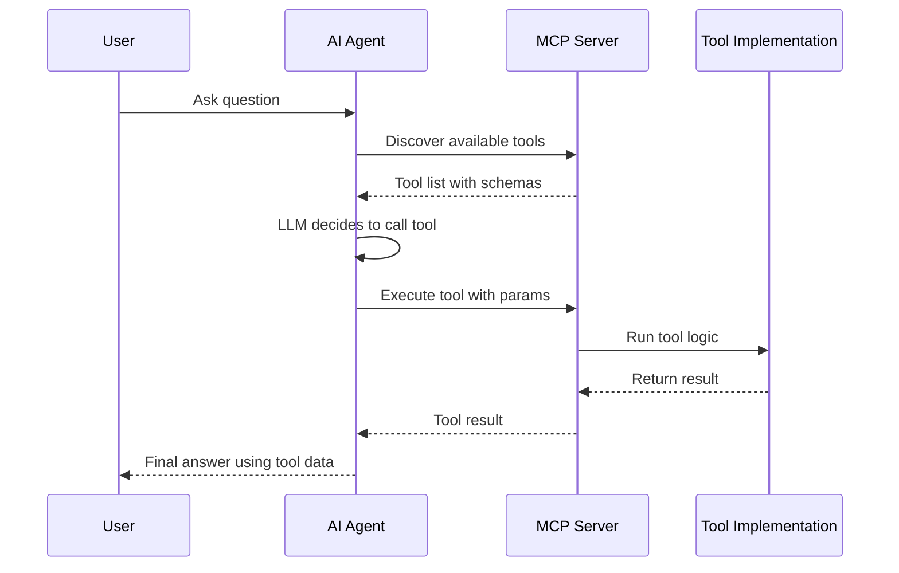
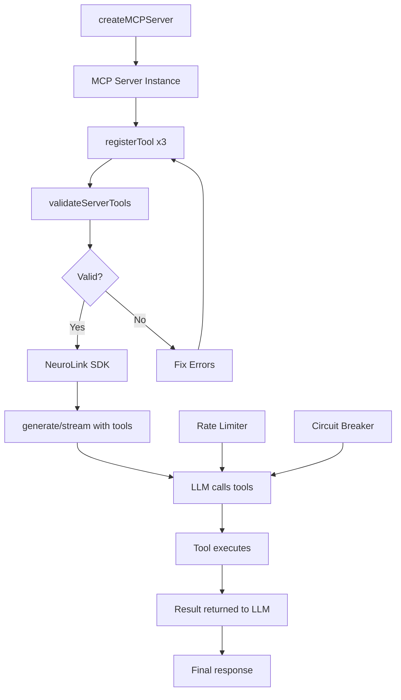

You will build an MCP server with three custom AI tools in 30 minutes: a database query tool, a notification tool, and a file operations tool. By the end of this tutorial, you will have a working MCP server with Zod-validated tool schemas, rate limiting, circuit breaker resilience, and full integration with the NeuroLink SDK for end-to-end AI tool calling.

The Model Context Protocol (MCP) decouples your business logic from your AI orchestration layer. Instead of hardcoding tool logic into your application, you define tools on a server that any AI agent can discover and execute at runtime. Now you will set up the server and build your first tool.

## What is the Model Context Protocol?

MCP standardizes how AI models discover and execute tools. The protocol defines a clear lifecycle: a server registers tools with their schemas, an AI agent discovers those tools at connection time, the model decides when to call a tool based on the user's request, the server executes the tool logic, and the result flows back to the model for incorporation into the final response.



The key insight is separation of concerns. Your MCP server encapsulates business logic -- database queries, API calls, file operations -- behind a clean tool interface. The AI agent does not need to know how the database works or how notifications are sent. It just calls the tool with the parameters the schema defines.

This pattern has several practical benefits:

- **Reusability**: The same MCP server can serve multiple AI agents, different models, and different applications.
- **Testability**: Tools have defined inputs and outputs, making them easy to unit test in isolation.
- **Security**: Tool execution happens server-side where you control access, rate limiting, and audit logging.
- **Discovery**: Agents automatically learn what tools are available and how to call them.


## Step 1 -- Create an MCP Server

Start by creating a server using the `createMCPServer()` factory function. The server needs an ID, title, description, and category.

```typescript
import { createMCPServer } from "@juspay/neurolink";

const server = createMCPServer({
  id: "my-business-tools",
  title: "Business Tools Server",
  description: "Custom tools for business operations",
  category: "business",
  version: "1.0.0",
});

console.log("Server created:", server.id);
console.log("Category:", server.category); // "business"
```

The `category` field classifies your server for discovery and organization. NeuroLink supports the following categories: `aiProviders`, `frameworks`, `development`, `business`, `content`, `data`, `integrations`, `automation`, `analysis`, and `custom`. Choose the one that best describes your tools' purpose.

The server object is a lightweight container that holds tool registrations and provides methods for validation and execution. It does not start an HTTP server or listen on a port. It is a logical grouping of tools that can be embedded in any application, exposed over HTTP, or used directly in-process.


## Step 2 -- Register Tools

Tools are the core of your MCP server. Each tool needs a `name`, a `description` (used by the LLM to decide when to call it), a `parameters` schema (defined with Zod for runtime validation and type inference), and an `execute` function that contains your business logic.

```typescript
import { z } from "zod";

// Tool 1: Database query tool
server.registerTool({
  name: "queryDatabase",
  description: "Execute a read-only SQL query against the analytics database",
  parameters: z.object({
    query: z.string().describe("SQL SELECT query"),
    limit: z.number().optional().default(100).describe("Max rows"),
  }),
  execute: async (params) => {
    const { query, limit } = params;
    if (!query.trim().toUpperCase().startsWith("SELECT")) {
      return { success: false, error: "Only SELECT queries allowed" };
    }
    // Use a read-only database role for defense-in-depth
    const results = await db.query(`${query} LIMIT $1`, [limit]);
    return { success: true, data: results, rowCount: results.length };
  },
});

// Tool 2: Send notification tool
server.registerTool({
  name: "sendNotification",
  description: "Send a notification to a Slack channel or email",
  parameters: z.object({
    channel: z.enum(["slack", "email"]).describe("Notification channel"),
    recipient: z.string().describe("Channel ID or email address"),
    message: z.string().describe("Notification message"),
  }),
  execute: async (params) => {
    if (params.channel === "slack") {
      await slackClient.postMessage(params.recipient, params.message);
    } else {
      await emailClient.send(params.recipient, "AI Notification", params.message);
    }
    return { success: true, channel: params.channel };
  },
});

// Tool 3: File operations
server.registerTool({
  name: "readFile",
  description: "Read the contents of a file from the project directory",
  parameters: z.object({
    path: z.string().describe("Relative file path"),
  }),
  execute: async (params) => {
    const PROJECT_DIR = path.resolve(process.cwd());
    const safePath = path.resolve(PROJECT_DIR, params.path);
    if (!safePath.startsWith(PROJECT_DIR)) {
      return { success: false, error: "Path traversal detected" };
    }
    const content = await fs.readFile(safePath, "utf-8");
    return { success: true, content, size: content.length };
  },
});
```

> **Security:** This example allows the LLM to submit arbitrary SELECT queries. In production, use a read-only database role, restrict queries to an allowlist of approved tables, and consider a query builder like Knex or Drizzle instead of raw SQL. The `startsWith("SELECT")` check is a minimal guard — it does not prevent data exfiltration via `UNION` or subqueries. Always use parameterized queries for user-supplied values (like `limit`), and never interpolate untrusted input into SQL identifiers (table or column names).
{: .prompt-warning }

A few important design principles for tool definitions:

**Descriptions matter more than names.** The LLM reads the description to decide when to call the tool. Write descriptions that clearly state what the tool does, what inputs it expects, and what it returns. A vague description leads to incorrect tool selection.

**Zod schemas enforce contracts.** The `parameters` schema defines the exact shape of the input the tool accepts. Zod validates inputs at runtime, so malformed parameters from the LLM are caught before your business logic runs. Use `.describe()` on each field to give the LLM hints about expected values.

**Execute functions should be defensive.** Always validate inputs beyond what Zod checks. In the database tool example, we verify the query starts with SELECT even though the description says "read-only" -- because LLMs do not always follow instructions perfectly.

> **Note:** Tool names should be camelCase and descriptive. The LLM uses the name alongside the description to determine when a tool is appropriate. Avoid generic names like "doThing" or "process" -- specific names like "queryDatabase" or "sendNotification" give the model clearer intent signals.
{: .prompt-info }

## Step 3 -- Validate Tools

Before using your tools in production, validate them to ensure they follow proper patterns. The `validateServerTools()` function checks all registered tools for completeness and correctness.

```typescript
import { validateServerTools, getServerInfo } from "@juspay/neurolink";

// Validate all tools
const validation = await validateServerTools(server);

if (!validation.isValid) {
  console.error("Invalid tools:", validation.invalidTools);
  console.error("Errors:", validation.errors);
  process.exit(1);
}

// Get server info
const info = getServerInfo(server);
console.log(`Server: ${info.title}`);
console.log(`Tools registered: ${info.toolCount}`);
console.log(`Category: ${info.category}`);
```

Validation checks include: tool names are non-empty strings, descriptions exist and are meaningful, execute functions are callable, and parameter schemas are valid Zod objects. Running validation at startup catches configuration errors early, before any user request hits a broken tool.

The `getServerInfo()` function provides a summary of the server's state: how many tools are registered, what category it belongs to, and its version. This is useful for health check endpoints and operational dashboards.

## Step 4 -- Use Tools with NeuroLink

Now connect your MCP tools to the NeuroLink SDK so that LLMs can discover and call them during generation.

```typescript
import { NeuroLink } from "@juspay/neurolink";
import { tool } from "ai";
import { z } from "zod";

const neurolink = new NeuroLink();

// Convert MCP tools to AI SDK format for use with generate/stream
const aiTools = {
  queryDatabase: tool({
    description: "Execute a read-only SQL query against the analytics database",
    parameters: z.object({
      query: z.string().describe("SQL SELECT query"),
      limit: z.number().optional().default(100),
    }),
    execute: async (params) => {
      // Delegate to MCP server tool
      return server.tools["queryDatabase"].execute(params);
    },
  }),
  sendNotification: tool({
    description: "Send a notification to a Slack channel or email",
    parameters: z.object({
      channel: z.enum(["slack", "email"]),
      recipient: z.string(),
      message: z.string(),
    }),
    execute: async (params) => {
      return server.tools["sendNotification"].execute(params);
    },
  }),
};

// Use tools in generation
const result = await neurolink.generate({
  input: {
    text: "How many orders did we process last week? Send a summary to #analytics on Slack.",
  },
  provider: "openai",
  model: "gpt-4o",
  tools: aiTools,
});

console.log(result.content);
```

When you pass tools to `neurolink.generate()`, the LLM receives the tool schemas as part of its system context. It then decides whether to call tools based on the user's request. In this example, the model would likely call `queryDatabase` to get order counts, then call `sendNotification` to post the summary to Slack, and finally synthesize a natural language response.

The delegation pattern (AI tool wrapping MCP server tool) keeps your MCP server as the single source of truth for tool logic. The AI SDK tools are thin wrappers that forward execution to the MCP server. This means you can update tool logic in one place and all consumers get the update automatically.

> **Note:** The `tools` option in `generate()` accepts tools in the AI SDK format. The MCP server's `registerTool()` uses a slightly different shape. The wrapper pattern shown above bridges the two formats cleanly. In the future, NeuroLink will support direct MCP tool passthrough.
{: .prompt-info }

## Step 5 -- Add Rate Limiting and Circuit Breaking

Production MCP servers need protection against abuse and cascading failures. NeuroLink provides built-in rate limiting and circuit breaking specifically designed for MCP tool execution.

```typescript
import {
  HTTPRateLimiter,
  MCPCircuitBreaker,
  DEFAULT_RATE_LIMIT_CONFIG,
} from "@juspay/neurolink";

// Rate limit: 100 requests per minute
const rateLimiter = new HTTPRateLimiter({
  ...DEFAULT_RATE_LIMIT_CONFIG,
  maxRequests: 100,
  windowMs: 60000,
});

// Circuit breaker: Open after 5 failures, reset after 30s
const circuitBreaker = new MCPCircuitBreaker({
  failureThreshold: 5,
  resetTimeoutMs: 30000,
});
```

The rate limiter prevents any single client from overwhelming your tools. At 100 requests per minute, a runaway agent loop would be throttled before it racks up significant costs or overwhelms your database.

The circuit breaker monitors failure rates for tool execution. After five consecutive failures (a database connection timeout, an API outage, etc.), the circuit opens and immediately returns errors without attempting execution. After 30 seconds, the circuit enters a half-open state and allows a single test request through. If it succeeds, the circuit closes and normal operation resumes. If it fails, the circuit stays open for another 30 seconds.

Together, rate limiting and circuit breaking give your MCP server production-grade resilience without complex custom implementation.

## Tool validation deep dive

The `validateTool()` function provides fine-grained validation for individual tools, useful during development and testing:

```typescript
import { validateTool } from "@juspay/neurolink";

const isValid = validateTool({
  name: "myTool",
  description: "Does something useful",
  execute: async (params) => ({ result: "ok" }),
});

console.log("Valid:", isValid); // true
```

Validation checks cover several categories:

- **Name validation**: Names must be non-empty strings, ideally camelCase.
- **Description validation**: Descriptions must exist and provide meaningful context for the LLM.
- **Execute validation**: The execute field must be a callable async function.
- **Parameter validation**: If parameters are provided, they must be valid Zod schemas with correct types and descriptions.

Running validation in your CI/CD pipeline ensures that no malformed tool definitions ship to production.

## Architecture overview

Here is the complete architecture of an MCP server integrated with NeuroLink:



The flow is straightforward: create a server, register tools, validate them, and connect to NeuroLink. During generation, the LLM calls tools as needed, with rate limiting and circuit breaking protecting every execution. Results flow back to the LLM for synthesis into a final response.

## Testing Your MCP Tools

Testability is one of the strongest benefits of the MCP pattern. Because tools have defined inputs and outputs, you can unit test them without any AI involvement:

```typescript
// Unit test
const result = await server.tools["queryDatabase"].execute({
  query: "SELECT COUNT(*) FROM orders WHERE date > '2025-01-01'",
  limit: 1,
});
assert(result.success === true);
```

For integration testing, run the full flow through `neurolink.generate()` with your tools and verify that the model correctly identifies when to call each tool and how to interpret the results. Mock your external dependencies (database, Slack, email) to keep integration tests fast and deterministic.

Test edge cases thoroughly: What happens when the database returns zero rows? When the Slack API is down? When the file does not exist? Each tool should return structured error responses that the LLM can interpret gracefully, rather than throwing unhandled exceptions.

```typescript
// Edge case test: invalid SQL
const invalidResult = await server.tools["queryDatabase"].execute({
  query: "DROP TABLE orders",
  limit: 1,
});
assert(invalidResult.success === false);
assert(invalidResult.error === "Only SELECT queries allowed");

// Edge case test: missing file
try {
  await server.tools["readFile"].execute({
    path: "./nonexistent.txt",
  });
  assert.fail("Should have thrown");
} catch (error) {
  assert(error.code === "ENOENT");
}
```

> **Tip:** Always return structured error objects from your tools rather than throwing exceptions. The LLM can interpret a `{ success: false, error: "..." }` response and adjust its approach, but an unhandled exception terminates the tool call chain entirely.
{: .prompt-tip }

## Real-World MCP Server Patterns

Beyond the basics, here are patterns we see in production MCP deployments:

**Composite tools** wrap multiple operations into a single tool call. Instead of the LLM calling "queryDatabase" and then "sendNotification" separately, a "generateAndSendReport" tool handles the entire workflow internally. This reduces the number of tool calls and the chance of the LLM making intermediate mistakes.

**Parameterized permissions** restrict tool access based on the calling context. A tool can check the user's role before executing sensitive operations, returning a permission error if the caller lacks the required access level.

```typescript
// Authentication middleware for MCP tool execution
function withAuth(tool: MCPTool, requiredRole: string): MCPTool {
  return {
    ...tool,
    execute: async (params, context) => {
      const user = await verifyToken(context.headers?.authorization);
      if (!user || !user.roles.includes(requiredRole)) {
        return { success: false, error: "Unauthorized: insufficient permissions" };
      }
      return tool.execute(params, { ...context, user });
    },
  };
}

// Usage
server.registerTool(withAuth(queryDatabaseTool, "analyst"));
server.registerTool(withAuth(sendNotificationTool, "admin"));
```

**Caching layers** store frequent tool results for reuse. If ten users ask "How many orders this month?" in a minute, the database tool can serve cached results instead of hitting the database ten times.

**Audit logging** records every tool call with its parameters, caller, timestamp, and result. This is essential for regulated industries where you need to prove what the AI did and why.

## What you built

You built a fully functional MCP server with three validated tools, rate limiting, circuit breaker resilience, and end-to-end NeuroLink integration. Your tools are discoverable, testable, and usable by any AI agent without code changes.

Continue with these related tutorials:

- [Building a RAG Application](/posts/rag-application-typescript-tutorial/) for exposing your RAG pipeline as an MCP tool
- Structured Output from LLMs for validating tool outputs with Zod schemas
- Building a Slack Bot with AI for connecting MCP tools to a Slack bot

---

**Related posts:**

- [MCP Tools: Extending AI with External Capabilities](/posts/mcp-tools-integration/)
- [MCP is the USB-C of AI: Why Model Context Protocol Changes Everything](/posts/mcp-usb-c-of-ai/)
- [Building a RAG Application with TypeScript: Complete Tutorial](/posts/rag-application-typescript-tutorial/)
