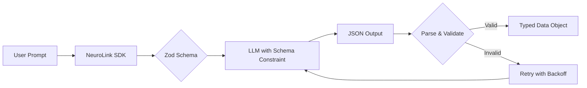

> **Note:** This guide covers structured output features available in the current NeuroLink SDK. See our changelog for version-specific details.
{: .prompt-info }

You will enforce structured JSON output from any LLM using NeuroLink's Zod schema validation. By the end of this tutorial, you will have schema-constrained generation that returns validated, typed JSON every time -- no regex parsing, no markdown unwrapping, no hoping the model follows instructions.

Ask an LLM for JSON without schema enforcement and you might get valid JSON, markdown-wrapped JSON, JSON with trailing commas, or a conversational explanation. You will eliminate this inconsistency entirely.

Next, you will define Zod schemas for LLM output, integrate schema validation with NeuroLink's `generate()` call, and build error handling patterns for edge cases.



## The Problem with Unstructured LLM Output

Before diving into solutions, let us understand why structured output matters. Consider a simple use case: extracting contact information from unstructured text.

```typescript
const prompt = `Extract the contact info from this text and return JSON:
"Hi, I'm Sarah Chen. You can reach me at sarah.chen@techcorp.io or call 555-0123."`;

// Without structured output, you might get:
// Response 1: {"name": "Sarah Chen", "email": "sarah.chen@techcorp.io", "phone": "555-0123"}
// Response 2: ```json\n{"name": "Sarah Chen"...}\n```
// Response 3: Here's the extracted information: {"name": ...}
// Response 4: {"Name": "Sarah Chen", "Email": ...}  // Different casing
```

Each response requires different parsing logic. Multiply this by dozens of prompts across your application, and you have a maintenance nightmare. Worse, these variations often appear randomly, making bugs intermittent and hard to reproduce.

## Zod Schema Fundamentals

NeuroLink uses Zod schemas directly for structured output, providing excellent TypeScript integration and type inference. Zod schemas describe the shape of valid data while automatically providing TypeScript types.

### Basic Zod Schema Structure

A Zod schema document describes the shape of valid data:

```typescript
import { z } from 'zod';

const ContactSchema = z.object({
  name: z.string().describe('Full name of the contact'),
  email: z.string().email().describe('Valid email address'),
  phone: z.string().regex(/^[0-9]{3}-[0-9]{4}$/).optional()
});

// TypeScript type is automatically inferred
type Contact = z.infer<typeof ContactSchema>;
// { name: string; email: string; phone?: string }
```

This schema specifies that valid documents must be objects with a required `name` (string) and `email` (valid email format), plus an optional `phone` matching a specific pattern.

### Common Zod Schema Patterns

Understanding key Zod methods helps you define precise constraints:

**Type Methods:**

- `z.string()`, `z.number()`, `z.boolean()`: Primitive types
- `z.array(schema)`: Array of items matching schema
- `z.object({})`: Object with specified properties
- `z.enum(['a', 'b'])`: Restricts values to specific set
- `z.literal('value')`: Requires exact value

**String Refinements:**

- `.min(n)` / `.max(n)`: Length constraints
- `.regex(pattern)`: Regular expression validation
- `.email()`, `.url()`, `.uuid()`: Built-in format validators

**Number Refinements:**

- `.min(n)` / `.max(n)`: Value bounds
- `.int()`: Integer validation
- `.positive()`, `.negative()`: Sign constraints

**Array Methods:**

- `.min(n)` / `.max(n)`: Length constraints
- `.nonempty()`: Require at least one element

**Object Methods:**

- `.partial()`: Make all properties optional
- `.required()`: Make all properties required
- `.extend({})`: Add additional properties

## NeuroLink Schema Enforcement

NeuroLink integrates Zod schemas directly into the API, ensuring the model's output always conforms to your specification. This is not post-processing validation; the model is constrained during generation to only produce valid output.

> **Tip:** The `schema` option works with the `generate()` method only. For streaming, use `generate()` with schema to get validated output.
{: .prompt-tip }

<!-- markdownlint-disable-next-line MD028 -->

> **Important:** For schema enforcement to work, you must set `output.format` to either `'json'` or `'structured'`. Without this option, the schema will not be enforced.
{: .prompt-warning }

### Basic Usage

Define your Zod schema and pass it to the generate method:

```typescript
import { z } from 'zod';
import { NeuroLink } from '@juspay/neurolink';

const neurolink = new NeuroLink();

const ContactSchema = z.object({
  name: z.string().describe('Full name'),
  email: z.string().email().describe('Email address'),
  phone: z.string().optional(),
  company: z.string().optional()
});

const result = await neurolink.generate({
  input: {
    text: 'Extract contact: "John Smith, john@acme.com, works at Acme Inc"'
  },
  schema: ContactSchema,
  output: { format: 'json' }
});

// result.content is always a string, so JSON.parse() is required
const contact = JSON.parse(result.content);
// { name: "John Smith", email: "john@acme.com", company: "Acme Inc" }
```

NeuroLink automatically converts your Zod schema to the appropriate format for each provider.

### Important: Google Provider Limitation

> **Critical:** Google Gemini providers (Vertex AI and Google AI Studio) cannot use tools and JSON schema output simultaneously. When using schemas with Google providers, you **must** set `disableTools: true`.
{: .prompt-warning }

```typescript
import { z } from 'zod';
import { NeuroLink } from '@juspay/neurolink';

const neurolink = new NeuroLink();

const AnalysisSchema = z.object({
  sentiment: z.enum(['positive', 'negative', 'neutral']),
  confidence: z.number().min(0).max(1),
  topics: z.array(z.string())
});

// Correct usage for Google providers
const result = await neurolink.generate({
  input: { text: 'Analyze: "The product exceeded expectations!"' },
  schema: AnalysisSchema,
  output: { format: 'json' },
  provider: 'vertex', // or 'google-ai'
  disableTools: true  // REQUIRED for Google providers with schemas
});

// OpenAI and Anthropic work without disableTools
const openaiResult = await neurolink.generate({
  input: { text: 'Analyze: "The product exceeded expectations!"' },
  schema: AnalysisSchema,
  output: { format: 'json' },
  provider: 'openai',  // No restriction - works with or without tools
});
```

This is a documented Google API limitation, not a NeuroLink bug. All frameworks (LangChain, Vercel AI SDK, etc.) require this approach.

### Nested Objects and Arrays

Real-world data often involves nested structures. NeuroLink handles complex schemas seamlessly:

```typescript
import { z } from 'zod';
import { NeuroLink } from '@juspay/neurolink';

const neurolink = new NeuroLink();

const AddressSchema = z.object({
  street: z.string(),
  city: z.string(),
  postalCode: z.string(),
  country: z.string()
});

const LineItemSchema = z.object({
  description: z.string(),
  quantity: z.number().int().min(1),
  unitPrice: z.number().min(0),
  total: z.number()
});

const InvoiceSchema = z.object({
  invoiceNumber: z.string(),
  date: z.string().describe('ISO date format'),
  customer: z.object({
    name: z.string(),
    address: AddressSchema.optional()
  }),
  lineItems: z.array(LineItemSchema).min(1),
  subtotal: z.number(),
  tax: z.number(),
  total: z.number()
});

const result = await neurolink.generate({
  input: {
    text: `Parse this invoice:
      Invoice #INV-2024-001
      Date: 2024-01-15
      Customer: Acme Corp, 123 Main St, New York, NY 10001
      Items:
      - Widget A x 5 @ $10 = $50
      - Widget B x 3 @ $25 = $75
      Subtotal: $125, Tax: $12.50, Total: $137.50`
  },
  schema: InvoiceSchema,
  output: { format: 'json' },
  provider: 'openai',
});

// result.content is always a string, so JSON.parse() is required
const invoice = JSON.parse(result.content);
```

## Type-Safe Extraction Patterns

Build reusable utilities for type-safe extractions:

```typescript
import { z, ZodSchema } from 'zod';
import { NeuroLink } from '@juspay/neurolink';

const neurolink = new NeuroLink();

async function extract<T extends ZodSchema>(
  schema: T,
  prompt: string,
  options?: {
    provider?: string;
    temperature?: number;
    disableTools?: boolean;
  }
): Promise<z.infer<T>> {
  const result = await neurolink.generate({
    input: { text: prompt },
    schema,
    output: { format: 'json' },
    provider: options?.provider,
    temperature: options?.temperature ?? 0,
    disableTools: options?.disableTools
  });

  // result.content is always a string, so JSON.parse() is required
  const data = JSON.parse(result.content);
  return schema.parse(data); // Validate and get typed result
}

// Usage with automatic type inference
const EventSchema = z.object({
  title: z.string(),
  date: z.string(),
  location: z.string(),
  attendees: z.array(z.string())
});

const event = await extract(
  EventSchema,
  'Parse: "Team meeting on Jan 15th at HQ with Alice, Bob, and Carol"'
);
// event is fully typed as { title: string; date: string; location: string; attendees: string[] }
```

### Provider-Aware Extraction Helper

> **Note**: The `smartExtract()` function shown below is a **custom helper pattern**, not a built-in NeuroLink API method. You can implement this helper in your own codebase.
{: .prompt-info }

Create a reusable helper that automatically handles Google provider restrictions:

```typescript
import { z, ZodSchema } from 'zod';
import { NeuroLink } from '@juspay/neurolink';

// Custom helper - implement this in your application code
const neurolink = new NeuroLink();

const GOOGLE_PROVIDERS = ['vertex', 'google-ai'];

async function smartExtract<T extends ZodSchema>(
  schema: T,
  prompt: string,
  options?: {
    provider?: string;
    model?: string;
    temperature?: number;
  }
): Promise<z.infer<T>> {
  const provider = options?.provider ?? 'openai';

  // Automatically disable tools for Google providers when using schemas
  const disableTools = GOOGLE_PROVIDERS.includes(provider);

  const result = await neurolink.generate({
    input: { text: prompt },
    schema,
    output: { format: 'json' },
    provider,
    model: options?.model,
    temperature: options?.temperature ?? 0,
    disableTools
  });

  const data = JSON.parse(result.content);
  return schema.parse(data);
}

// Works seamlessly with any provider
const PersonSchema = z.object({
  name: z.string(),
  age: z.number(),
  occupation: z.string()
});

// Automatically disables tools for Vertex AI
const vertexResult = await smartExtract(
  PersonSchema,
  'Extract: "John is a 30-year-old engineer"',
  { provider: 'vertex' },
);

// Works normally with OpenAI
const openaiResult = await smartExtract(
  PersonSchema,
  'Extract: "John is a 30-year-old engineer"',
  { provider: 'openai' },
);
```

## Error Handling Patterns

Even with schema enforcement, robust error handling remains essential. Network issues, rate limits, and edge cases require thoughtful handling.

### Basic Error Handling

```typescript
import { z, ZodError } from 'zod';
import { NeuroLink } from '@juspay/neurolink';

const neurolink = new NeuroLink();

async function safeExtract<T>(
  schema: z.ZodSchema<T>,
  prompt: string,
  provider: string = 'openai'
): Promise<{ success: true; data: T } | { success: false; error: string }> {
  try {
    const result = await neurolink.generate({
      input: { text: prompt },
      schema,
      output: { format: 'json' },
      provider,
      disableTools: ['vertex', 'google-ai'].includes(provider)
    });

    const data = schema.parse(JSON.parse(result.content));
    return { success: true, data };
  } catch (error) {
    if (error instanceof ZodError) {
      return { success: false, error: `Validation failed: ${error.message}` };
    }
    if (error instanceof Error) {
      if (error.message.includes('rate limit')) {
        return { success: false, error: 'Rate limit exceeded. Please retry later.' };
      }
      return { success: false, error: `API error: ${error.message}` };
    }
    return { success: false, error: 'Unknown error occurred' };
  }
}

// Usage
const ProductSchema = z.object({
  name: z.string(),
  price: z.number(),
  inStock: z.boolean()
});

const result = await safeExtract(
  ProductSchema,
  'Parse: "iPhone 15 Pro at $999, currently available"'
);

if (result.success) {
  console.log('Product:', result.data);
} else {
  console.error('Error:', result.error);
}
```

### Retry Logic with Exponential Backoff

```typescript
import { z, ZodSchema, ZodError } from 'zod';
import { NeuroLink } from '@juspay/neurolink';

const neurolink = new NeuroLink();

async function extractWithRetry<T extends ZodSchema>(
  schema: T,
  prompt: string,
  options?: {
    maxRetries?: number;
    provider?: string;
  }
): Promise<z.infer<T>> {
  const maxRetries = options?.maxRetries ?? 3;
  const provider = options?.provider ?? 'openai';
  let lastError: Error | null = null;

  for (let attempt = 0; attempt < maxRetries; attempt++) {
    try {
      const result = await neurolink.generate({
        input: { text: prompt },
        schema,
        output: { format: 'json' },
        provider,
        disableTools: ['vertex', 'google-ai'].includes(provider)
      });

      const data = JSON.parse(result.content);
      return schema.parse(data);
    } catch (error) {
      lastError = error as Error;

      // Don't retry validation errors - they won't self-resolve
      if (error instanceof ZodError) {
        throw error;
      }

      // Check for rate limiting
      if (error instanceof Error && error.message.includes('rate limit')) {
        const delay = Math.pow(2, attempt) * 1000; // Exponential backoff
        console.log(`Rate limited. Retrying in ${delay}ms...`);
        await new Promise(resolve => setTimeout(resolve, delay));
        continue;
      }

      // Retry other transient errors
      if (attempt < maxRetries - 1) {
        await new Promise(resolve => setTimeout(resolve, 1000));
      }
    }
  }

  throw lastError;
}
```

## Best Practices

### Schema Design

1. **Be specific with descriptions**: Add `.describe()` calls to help the model understand intent
2. **Use appropriate constraints**: Set `.min()`, `.max()`, where sensible
3. **Prefer enums over free text**: `z.enum(['a', 'b'])` reduces ambiguity
4. **Make fields optional when appropriate**: Use `.optional()` to allow the model to indicate missing data

```typescript
// Good schema design
const ReviewSchema = z.object({
  rating: z.number().int().min(1).max(5).describe('Star rating from 1 to 5'),
  sentiment: z.enum(['positive', 'negative', 'neutral']).describe('Overall sentiment'),
  summary: z.string().max(200).describe('Brief summary under 200 characters'),
  pros: z.array(z.string()).max(5).describe('List of positive points'),
  cons: z.array(z.string()).max(5).describe('List of negative points'),
  recommendedFor: z.string().optional().describe('Who might benefit, if applicable')
});
```

### Prompt Engineering for Structured Output

1. **Provide context**: Explain what the data will be used for
2. **Give examples**: Show sample inputs and expected outputs
3. **Handle ambiguity**: Tell the model how to handle unclear cases
4. **Set expectations**: Specify formats for dates, numbers, and other formatted data

```typescript
import { z } from 'zod';
import { NeuroLink } from '@juspay/neurolink';

const neurolink = new NeuroLink();

const DateEventSchema = z.object({
  title: z.string(),
  startDate: z.string().describe('ISO 8601 format: YYYY-MM-DD'),
  endDate: z.string().optional().describe('ISO 8601 format, null if same as start'),
  isRecurring: z.boolean()
});

const result = await neurolink.generate({
  input: {
    text: `Extract event details from: "Weekly team standup every Monday at 9am starting Jan 15, 2024"

    Instructions:
    - Use ISO 8601 date format (YYYY-MM-DD)
    - For recurring events, use the first occurrence as startDate
    - Leave endDate empty if it's a single day event`
  },
  schema: DateEventSchema,
  output: { format: 'json' },
  temperature: 0
});
```

### Testing Strategies

1. **Unit test schemas**: Validate that schemas accept expected data and reject invalid data
2. **Integration test extractions**: Test with real-world examples
3. **Snapshot testing**: Capture extraction results for regression testing

```typescript
import { z } from 'zod';
import { describe, it, expect } from 'vitest';

const ContactSchema = z.object({
  name: z.string().min(1),
  email: z.string().email(),
  phone: z.string().optional()
});

describe('ContactSchema', () => {
  it('accepts valid contact', () => {
    const valid = { name: 'John', email: 'john@example.com' };
    expect(() => ContactSchema.parse(valid)).not.toThrow();
  });

  it('rejects missing email', () => {
    const invalid = { name: 'John' };
    expect(() => ContactSchema.parse(invalid)).toThrow();
  });

  it('rejects invalid email format', () => {
    const invalid = { name: 'John', email: 'not-an-email' };
    expect(() => ContactSchema.parse(invalid)).toThrow();
  });
});
```

## What You Built

You built schema-enforced JSON extraction with Zod schemas, provider-aware helpers that handle Google's `disableTools` requirement, retry logic with exponential backoff, and testing patterns for validation. Every LLM response now returns typed, validated data that your application can consume directly.

Continue with these related tutorials:

- Structured Output in TypeScript for provider-specific behavior and complex nested schemas
- [Building a RAG Application](/posts/rag-application-typescript-tutorial/) for combining structured output with retrieval
- [MCP Server Tutorial](/posts/mcp-server-tutorial/) for validating tool responses with Zod schemas

---

**Related posts:**

- [Error Handling Patterns for AI Applications](/posts/error-handling-patterns/)
- [Building a RAG Application with TypeScript: Complete Tutorial](/posts/rag-application-typescript-tutorial/)
- [MCP Server Tutorial: Build Your Own AI Tools in 30 Minutes](/posts/mcp-server-tutorial/)
