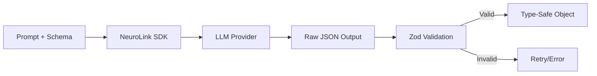
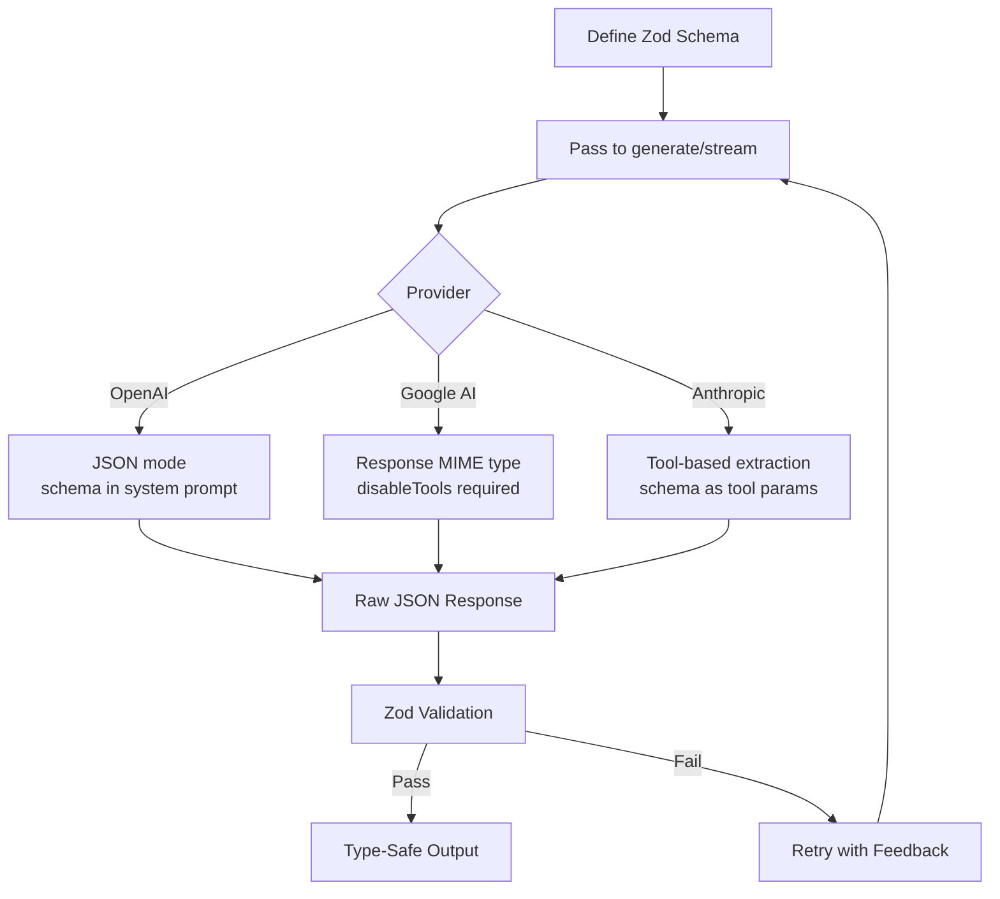

You will get structured, validated JSON from LLMs using TypeScript and Zod schemas with NeuroLink. By the end of this tutorial, you will define Zod schemas for LLM output, use structured output with `generate()` and `stream()`, handle provider-specific differences across OpenAI, Anthropic, and Google AI, build complex nested schemas for real-world extraction, and implement retry logic for validation failures.

Without structured output, parsing free-form LLM text with regex is brittle and breaks whenever the model changes its phrasing. You will eliminate this entirely by telling the LLM exactly what shape of data to return.

Now you will start with Zod schema definitions and progressively build toward production-ready structured extraction.

## Why Structured Output Matters

Without structured output, getting data from an LLM into your application requires fragile parsing:

```typescript
// The fragile way - DO NOT do this
const response = await llm.generate("Extract the product name and price from: ...");
// response.content = "The product is Sony WH-1000XM5 and it costs $349.99"
const name = response.content.match(/product is (.+) and/)?.[1]; // brittle!
const price = parseFloat(response.content.match(/\$(\d+\.\d+)/)?.[1] || "0"); // fragile!
```

This approach breaks when the model phrases things differently, adds extra words, or changes the order. It also provides no type safety -- you are working with strings and hoping for the best.

With structured output, you define a schema once and get validated objects back:



The schema tells the LLM exactly what fields to return, what types they should be, and what values are acceptable. The SDK validates the response against the schema, and you get a TypeScript object with full type inference. If the LLM returns invalid data, the validation catches it immediately.


## Step 1 -- Define a Zod Schema

Zod is a TypeScript-first schema validation library that provides both runtime validation and compile-time type inference. This makes it perfect for structured LLM output: you define the shape once and get both validation and types for free.

```typescript
import { z } from "zod";

// Schema for extracting product information
const ProductSchema = z.object({
  name: z.string().describe("Product name"),
  price: z.number().positive().describe("Price in USD"),
  category: z.enum(["electronics", "clothing", "food", "other"]).describe("Product category"),
  features: z.array(z.string()).describe("Key product features"),
  inStock: z.boolean().describe("Whether the product is in stock"),
  rating: z.number().min(0).max(5).optional().describe("Average rating out of 5"),
});

// TypeScript type is automatically inferred
type Product = z.infer<typeof ProductSchema>;
// {
//   name: string;
//   price: number;
//   category: "electronics" | "clothing" | "food" | "other";
//   features: string[];
//   inStock: boolean;
//   rating?: number;
// }
```

Several Zod features are particularly useful for LLM schemas:

**`.describe()`** adds a description string to each field. The LLM reads these descriptions to understand what data to put in each field. Treat descriptions as instructions to the model -- be specific about format, units, and expected values.

**`.enum()`** constrains string fields to a fixed set of options. This prevents the model from inventing categories or statuses that your application does not handle.

**`.optional()`** marks fields that may not be present in the source text. If the product description does not mention a rating, the LLM can omit it rather than hallucinating a value.

**`.positive()`, `.min()`, `.max()`** add numeric constraints. These catch cases where the model extracts an incorrect value (like a negative price or a rating above 5).

> **Note:** The `.describe()` method is essential for structured LLM output. Without descriptions, the model must guess what each field means from the name alone. With descriptions, the model knows that `price` should be "Price in USD" and `rating` should be "Average rating out of 5". Always add descriptions to every field.
{: .prompt-info }

## Step 2 -- Use Structured Output with NeuroLink

Pass the schema to `generate()` via the `schema` option, and set the output format to `"structured"`:

```typescript
import { NeuroLink } from "@juspay/neurolink";

const neurolink = new NeuroLink();

// Extract product data from a description
const result = await neurolink.generate({
  input: {
    text: `Extract product information from this description:
    "The Sony WH-1000XM5 wireless noise-canceling headphones
    are available for $349.99. They feature 30-hour battery life,
    adaptive sound control, and speak-to-chat technology.
    Currently in stock. Rated 4.7 stars."`,
  },
  provider: "openai",
  model: "gpt-4o",
  schema: ProductSchema,
  output: { format: "structured" },
});

// result.content is now a typed Product object
const product: Product = JSON.parse(result.content);
console.log(product.name);     // "Sony WH-1000XM5"
console.log(product.price);    // 349.99
console.log(product.category); // "electronics"
console.log(product.features); // ["30-hour battery life", "adaptive sound control", ...]
```

Under the hood, NeuroLink converts the Zod schema into a format that the LLM provider understands. For OpenAI, it uses JSON mode with the schema embedded in the system prompt. For Anthropic, it uses tool-based extraction where the schema becomes the tool parameters. The details are handled automatically -- you just pass the schema and get structured output back.

The `output: { format: "structured" }` option tells NeuroLink to enforce JSON output mode on the provider. This ensures the model returns raw JSON rather than wrapping it in markdown code blocks or conversational text.

## Step 3 -- Provider-Specific Behavior

Different LLM providers handle structured output differently. Most work seamlessly, but Google AI and Vertex have one important caveat.

```typescript
// OpenAI: Works without restrictions
const openaiResult = await neurolink.generate({
  input: { text: description },
  provider: "openai",
  model: "gpt-4o",
  schema: ProductSchema,
});

// Google AI / Vertex: MUST disable tools
const googleResult = await neurolink.generate({
  input: { text: description },
  provider: "google-ai",
  model: "gemini-2.5-flash",
  schema: ProductSchema,
  disableTools: true, // Required for Google providers
});

// Anthropic: Works with tools enabled
const anthropicResult = await neurolink.generate({
  input: { text: description },
  provider: "anthropic",
  model: "claude-sonnet-4-20250514",
  schema: ProductSchema,
});
```

Here is the full compatibility matrix:

| Provider | Structured Output | Needs disableTools? |
|---|---|---|
| OpenAI | Full support | No |
| Anthropic | Full support | No |
| Google AI / Vertex | Supported | Yes (required) |
| Bedrock | Supported | No |

> **Note:** When using Google AI or Vertex providers with structured output, you **must** set `disableTools: true`. Google's Gemini models cannot use tool calling and structured output simultaneously. If you omit this flag, the request will fail with a provider error. This is a known limitation of the Google AI API, not a NeuroLink restriction.
{: .prompt-info }

The reason for this difference lies in how each provider implements structured output internally:

- **OpenAI** uses a dedicated JSON mode that coexists with tool calling.
- **Anthropic** implements structured output through tool-based extraction, which works alongside other tools.
- **Google AI** uses response MIME type configuration for structured output, which conflicts with their tool calling implementation.

## Step 4 -- Complex Nested Schemas

Real-world extraction tasks often involve nested objects and arrays. Zod handles these naturally:

```typescript
const InvoiceSchema = z.object({
  invoiceNumber: z.string().describe("Invoice ID"),
  date: z.string().describe("Invoice date in ISO 8601 format"),
  vendor: z.object({
    name: z.string(),
    address: z.string(),
    taxId: z.string().optional(),
  }).describe("Vendor information"),
  lineItems: z.array(z.object({
    description: z.string(),
    quantity: z.number(),
    unitPrice: z.number(),
    total: z.number(),
  })).describe("Invoice line items"),
  subtotal: z.number(),
  tax: z.number(),
  total: z.number(),
  currency: z.string().default("USD"),
});

const result = await neurolink.generate({
  input: {
    text: invoiceText,
    // Can also include images for scanned invoices
    images: [invoiceImageBuffer],
  },
  provider: "openai",
  model: "gpt-4o",
  schema: InvoiceSchema,
  output: { format: "structured" },
});
```

This example demonstrates several advanced patterns:

**Nested objects** (`vendor`) group related fields together. The LLM understands the hierarchy and populates nested fields correctly.

**Arrays of objects** (`lineItems`) handle repeated structures. The LLM creates one object per line item, each with its own description, quantity, unit price, and total.

**Default values** (`currency: z.string().default("USD")`) provide fallbacks when the source text does not specify a value. If the invoice does not mention currency, the schema defaults to USD.

**Multimodal input** (`images: [invoiceImageBuffer]`) lets you pass scanned invoice images alongside text. With vision-capable models like GPT-4o, the LLM can extract structured data directly from images.

## Step 5 -- Structured Output with Streaming

You can stream structured output for progressive UI updates. This is useful when extracting data from large documents where the user wants to see results appearing incrementally.

```typescript
const result = await neurolink.stream({
  input: { text: "Analyze these 5 support tickets..." },
  provider: "openai",
  model: "gpt-4o",
  schema: z.object({
    tickets: z.array(z.object({
      id: z.string(),
      priority: z.enum(["low", "medium", "high", "critical"]),
      category: z.string(),
      summary: z.string(),
    })),
    overallSentiment: z.enum(["positive", "neutral", "negative"]),
  }),
  output: { format: "structured" },
});

let jsonBuffer = "";
for await (const chunk of result.stream) {
  if ("content" in chunk) {
    jsonBuffer += chunk.content;
    // Optionally parse partial JSON for progressive display
  }
}

// Parse the complete JSON
const analysis = JSON.parse(jsonBuffer);
```

Streaming structured output works by accumulating JSON chunks until the full object is complete. You can optionally attempt to parse partial JSON for progressive display -- showing each ticket as it appears in the stream -- but the safest approach is to buffer the complete response and parse once at the end.

> **Note:** When streaming structured output, the `result.stream` async generator yields chunks of raw JSON text. The JSON is only complete and parseable when the stream ends. If you need progressive display, use a streaming JSON parser library that can handle partial objects.
{: .prompt-info }

## Step 6 -- Error Handling and Retry

LLMs are probabilistic. Even with a schema, the model occasionally produces invalid JSON -- a missing required field, a number outside the expected range, or a string where an enum value was expected. A robust implementation includes retry logic with validation feedback.

```typescript
import { z } from "zod";

async function generateStructured<T extends z.ZodType>(
  prompt: string,
  schema: T,
  maxRetries = 3
): Promise<z.infer<T>> {
  for (let attempt = 0; attempt < maxRetries; attempt++) {
    try {
      const result = await neurolink.generate({
        input: { text: prompt },
        provider: "openai",
        model: "gpt-4o",
        schema,
        output: { format: "structured" },
      });

      // Validate with Zod
      const parsed = schema.parse(JSON.parse(result.content));
      return parsed;
    } catch (error) {
      if (error instanceof z.ZodError) {
        console.warn(`Attempt ${attempt + 1}: Validation failed`, error.errors);
        // Retry with more explicit prompt
        prompt += "\n\nIMPORTANT: Return valid JSON matching the exact schema.";
      } else {
        throw error; // Non-validation errors should propagate
      }
    }
  }
  throw new Error("Failed to generate valid structured output after retries");
}

// Usage
const product = await generateStructured(
  "Extract: Sony WH-1000XM5, $349.99, electronics",
  ProductSchema
);
```

This pattern has several important characteristics:

**Separate validation errors from provider errors.** A `ZodError` means the model returned JSON but it did not match the schema -- this is retryable. A network error or authentication error should propagate immediately.

**Augment the prompt on retry.** Adding an explicit instruction to follow the schema increases the success rate on subsequent attempts. You can also include the specific validation errors to help the model correct its output.

**Limit retries.** Three attempts is usually sufficient. If the model cannot produce valid output after three tries, the prompt or schema may need revision rather than more attempts.

## Real-World Use Cases

Structured output transforms several common AI application patterns:

### Data Extraction from Documents

Extract structured data from invoices, resumes, contracts, and other business documents. The schema defines exactly what fields to extract, and the LLM handles the natural language understanding.

```typescript
const ResumeSchema = z.object({
  name: z.string(),
  email: z.string().email(),
  skills: z.array(z.string()),
  experience: z.array(z.object({
    company: z.string(),
    role: z.string(),
    years: z.number(),
  })),
});
```

### Content Classification and Tagging

Classify content into predefined categories with confidence scores. The enum constraints ensure the model only returns categories your application handles.

```typescript
const ClassificationSchema = z.object({
  category: z.enum(["bug", "feature", "question", "documentation"]),
  priority: z.enum(["low", "medium", "high", "critical"]),
  tags: z.array(z.string()).max(5),
  confidence: z.number().min(0).max(1),
});
```

### API Response Generation

Generate structured API responses from natural language inputs. The schema acts as the API contract, ensuring the LLM produces responses that downstream systems can consume without parsing.

```typescript
const ActionSchema = z.object({
  action: z.enum(["create", "update", "delete", "query"]),
  resource: z.string(),
  parameters: z.record(z.unknown()),
  confirmationRequired: z.boolean(),
});
```

### Form Auto-Fill

Convert natural language descriptions into structured form data. Users describe what they need in plain English, and the LLM fills the form fields according to the schema.

## Architecture: How It Works Under the Hood

Different providers implement structured output differently, but NeuroLink abstracts these differences behind a unified API:



The key insight is that NeuroLink translates your Zod schema into the provider-native format automatically. For OpenAI, the schema becomes part of the system prompt with JSON mode enabled. For Anthropic, it becomes a tool definition that the model "calls" to produce structured output. For Google AI, it configures the response MIME type. You write one schema, and it works across all providers.

## Best Practices for Structured Output

**Keep schemas focused.** A schema with 50 fields will produce more errors than five schemas with 10 fields each. Extract one type of data per `generate()` call.

**Use `.describe()` liberally.** Every field should have a description. The more context the LLM has about each field, the more accurate the extraction.

**Prefer enums over free-form strings.** If a field has a known set of values, use `z.enum()`. This prevents the model from inventing values your application cannot handle.

**Validate at the application layer too.** Zod validates the schema structure, but you may need additional business logic validation. A price of $0.01 might be schema-valid but business-invalid.

**Test with edge cases.** Try empty inputs, very long inputs, inputs in other languages, and inputs with ambiguous data. Structured output quality depends heavily on the input text.

## What You Built

You built structured JSON extraction with Zod schemas, provider-aware generation that handles OpenAI, Anthropic, and Google AI differences automatically, retry logic for validation failures, and real-world extraction patterns for documents, classification, and API response generation.

Continue with these related tutorials:

- [Building a RAG Application](/posts/rag-application-typescript-tutorial/) for combining structured output with retrieval
- [MCP Server Tutorial](/posts/mcp-server-tutorial/) for validating tool responses with Zod schemas
- [Structured Output: JSON Schema Enforcement](/posts/structured-output-json/) for additional schema patterns

---

**Related posts:**

- [Structured Output: JSON Schema Enforcement with NeuroLink](/posts/structured-output-json/)
- [Building a RAG Application with TypeScript: Complete Tutorial](/posts/rag-application-typescript-tutorial/)
- [MCP Server Tutorial: Build Your Own AI Tools in 30 Minutes](/posts/mcp-server-tutorial/)
