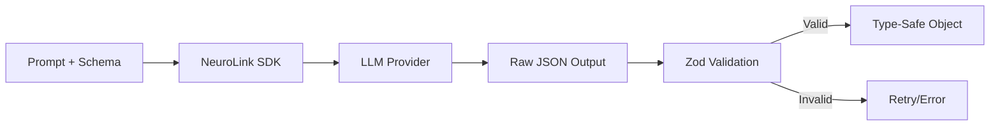
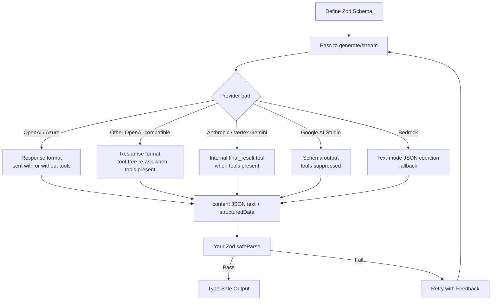

You will get structured, validated JSON from LLMs using TypeScript and Zod schemas with NeuroLink. By the end of this tutorial, you will define Zod schemas for LLM output, use structured output with `generate()` and `stream()`, handle provider-specific differences across OpenAI, Anthropic, and Google AI, build complex nested schemas for real-world extraction, and implement retry logic for validation failures.

Without structured output, parsing free-form LLM text with regex is brittle and breaks whenever the model changes its phrasing. You will eliminate this entirely by telling the LLM exactly what shape of data to return.

Now you will start with Zod schema definitions and progressively build toward production-ready structured extraction.

## Why Structured Output Matters

Without structured output, getting data from an LLM into your application requires fragile parsing:

```typescript
// The fragile way - DO NOT do this
const response = await neurolink.generate({
  input: { text: "Extract the product name and price from: ..." },
  provider: "openai",
  model: "gpt-5.4",
});
// response.content = "The product is Sony WH-1000XM5 and it costs $349.99"
const name = response.content.match(/product is (.+) and/)?.[1]; // brittle!
const price = parseFloat(response.content.match(/\$(\d+\.\d+)/)?.[1] || "0"); // fragile!
```

This approach breaks when the model phrases things differently, adds extra words, or changes the order. It also provides no type safety -- you are working with strings and hoping for the best.

With structured output, you define a schema once and get validated objects back:


```mermaid
flowchart LR
    A[Prompt + Schema] --> B[NeuroLink SDK]
    B --> C[LLM Provider]
    C --> D[Raw JSON Output]
    D --> E[Zod Validation]
    E -->|Valid| F[Type-Safe Object]
    E -->|Invalid| G[Retry/Error]
```

The schema tells the LLM exactly what fields to return, what types they should be, and what values are acceptable. NeuroLink requests schema-shaped JSON and returns the parsed object; validating it with the same Zod schema gives you a TypeScript object with full type inference. If the LLM returns invalid data, that validation step catches it before your application uses it.


## Step 1 -- Define a Zod Schema

Zod is a TypeScript-first schema validation library that provides both runtime validation and compile-time type inference. This makes it perfect for structured LLM output: you define the shape once and get both validation and types for free.

```typescript
import { z } from "zod";

// Schema for extracting product information
const ProductSchema = z.object({
  name: z.string().describe("Product name"),
  price: z.number().positive().describe("Price in USD"),
  category: z.enum(["electronics", "clothing", "food", "other"]).describe("Product category"),
  features: z.array(z.string()).describe("Key product features"),
  inStock: z.boolean().describe("Whether the product is in stock"),
  rating: z.number().min(0).max(5).optional().describe("Average rating out of 5"),
});

// TypeScript type is automatically inferred
type Product = z.infer<typeof ProductSchema>;
// {
//   name: string;
//   price: number;
//   category: "electronics" | "clothing" | "food" | "other";
//   features: string[];
//   inStock: boolean;
//   rating?: number;
// }
```

Several Zod features are particularly useful for LLM schemas:

**`.describe()`** adds a description string to each field. The LLM reads these descriptions to understand what data to put in each field. Treat descriptions as instructions to the model -- be specific about format, units, and expected values.

**`.enum()`** constrains string fields to a fixed set of options. This prevents the model from inventing categories or statuses that your application does not handle.

**`.optional()`** marks fields that may not be present in the source text. If the product description does not mention a rating, the LLM can omit it rather than hallucinating a value.

**`.positive()`, `.min()`, `.max()`** add numeric constraints. These catch cases where the model extracts an incorrect value (like a negative price or a rating above 5).

> **Note:** The `.describe()` method is essential for structured LLM output. Without descriptions, the model must guess what each field means from the name alone. With descriptions, the model knows that `price` should be "Price in USD" and `rating` should be "Average rating out of 5". Always add descriptions to every field.
{: .prompt-info }

## Step 2 -- Use Structured Output with NeuroLink

Pass the schema to `generate()` via the `schema` option, and set the output format to `"structured"`:

```typescript
import { NeuroLink } from "@juspay/neurolink";

const neurolink = new NeuroLink();

// Extract product data from a description
const result = await neurolink.generate({
  input: {
    text: `Extract product information from this description:
    "The Sony WH-1000XM5 wireless noise-canceling headphones
    are available for $349.99. They feature 30-hour battery life,
    adaptive sound control, and speak-to-chat technology.
    Currently in stock. Rated 4.7 stars."`,
  },
  provider: "openai",
  model: "gpt-5.4",
  schema: ProductSchema,
  output: { format: "structured" },
});

// result.content is the JSON text; result.structuredData is the parsed object
// (typed as unknown), so validate it before treating it as a Product
const parsed = ProductSchema.safeParse(result.structuredData);
if (!parsed.success) {
  throw new Error("Model output did not match ProductSchema");
}

const product: Product = parsed.data;
console.log(product.name);     // e.g. "Sony WH-1000XM5"
console.log(product.price);    // e.g. 349.99
console.log(product.category); // e.g. "electronics"
console.log(product.features); // e.g. ["30-hour battery life", "adaptive sound control", ...]
```

`result.content` is still a string: with a schema and `"structured"` or `"json"` output, it holds the JSON text. The parsed object is exposed as `result.structuredData`, which NeuroLink populates from the provider's structured-output path or from text-mode JSON recovery. Prefer it over `JSON.parse(result.content)`, and run your own `safeParse` so your application code gets a checked type rather than `unknown`. If recovery could not produce an object, `structuredData` can be absent, which the `safeParse` above turns into an explicit error.

Under the hood, NeuroLink converts the Zod schema into the form each provider path accepts. The mechanism differs by provider (covered in the next step), but the call shape and the result fields stay the same.

The `output: { format: "structured" }` option asks for JSON output rather than prose or Markdown-fenced code. Passing a `schema` is what tells NeuroLink which shape to request and parse.

## Step 3 -- Provider-Specific Behavior

The call shape is identical across providers. What differs is how each provider path enforces the schema, and what happens when the same request also carries tools.

```typescript
const providers = [
  { provider: "openai", model: "gpt-5.4" },
  { provider: "anthropic", model: "claude-sonnet-5" },
  { provider: "google-ai", model: "gemini-2.5-flash" },
] as const;

for (const target of providers) {
  const result = await neurolink.generate({
    input: { text: description },
    ...target,
    schema: ProductSchema,
    output: { format: "structured" },
  });

  const parsed = ProductSchema.safeParse(result.structuredData);
  console.log(target.provider, parsed.success);
}
```

Without tools, every path above requests schema-shaped JSON. Built-in tools are attached by default, though, so the with-tools column below is the normal case unless you pass `disableTools: true` on the structured call. With tools on the same request, the provider paths behave differently:

| Provider path | Schema with tools in the same request |
|---|---|
| OpenAI, Azure OpenAI | The response format is sent together with the tools. |
| Other OpenAI-compatible providers | The response format is withheld while tools are attached; NeuroLink then makes one tool-free re-ask to obtain the structured answer. |
| Anthropic (native) | An internal `final_result` tool carries the schema, so your tools stay callable. |
| Google AI Studio (Gemini) | Tools are suppressed for the structured turn because the Gemini API does not combine them with schema-enforced output. |
| Vertex Gemini | Uses a `final_result` tool pattern when schema and tools coexist. |
| Vertex Claude | Uses its own Anthropic transport and is not subject to the Gemini restriction. |
| Amazon Bedrock | Can fall back to text-mode JSON coercion rather than a native schema mode. |

> **Note:** A tool-free re-ask is a second billed model call. For streaming, its usage is reported separately in `result.metadata.structuredDataUsage`. If no object can be recovered, the call does not throw: `result.structuredData` is undefined and `result.content` holds the model's raw text. Check `structuredData` for undefined before using it. Errors thrown by `generate()` are provider, network, authentication, or rate-limit failures, not missing objects, so catch those around the call separately. `disableTools: true` is available when you want a structured turn that never attaches tools.
{: .prompt-info }

These behaviors come from NeuroLink's current provider implementations and can change between releases, so pin your SDK version and keep a small structured-output regression test for each provider you depend on.

## Step 4 -- Complex Nested Schemas

Real-world extraction tasks often involve nested objects and arrays. Zod handles these naturally:

```typescript
const InvoiceSchema = z.object({
  invoiceNumber: z.string().describe("Invoice ID"),
  date: z.string().describe("Invoice date in ISO 8601 format"),
  vendor: z.object({
    name: z.string(),
    address: z.string(),
    taxId: z.string().optional(),
  }).describe("Vendor information"),
  lineItems: z.array(z.object({
    description: z.string(),
    quantity: z.number(),
    unitPrice: z.number(),
    total: z.number(),
  })).describe("Invoice line items"),
  subtotal: z.number(),
  tax: z.number(),
  total: z.number(),
  currency: z.string().default("USD"),
});

const result = await neurolink.generate({
  input: {
    text: invoiceText,
    // Can also include images for scanned invoices
    images: [invoiceImageBuffer],
  },
  provider: "openai",
  model: "gpt-5.4",
  schema: InvoiceSchema,
  output: { format: "structured" },
});
```

This example demonstrates several advanced patterns:

**Nested objects** (`vendor`) group related fields together. The LLM understands the hierarchy and populates nested fields correctly.

**Arrays of objects** (`lineItems`) handle repeated structures. The LLM creates one object per line item, each with its own description, quantity, unit price, and total.

**Default values** (`currency: z.string().default("USD")`) provide fallbacks when the source text does not specify a value. If the invoice does not mention currency, the schema defaults to USD.

**Multimodal input** (`images: [invoiceImageBuffer]`) lets you pass scanned invoice images alongside text. With vision-capable models like GPT-5.4, the LLM can extract structured data directly from images.

## Step 5 -- Structured Output with Streaming

You can stream structured output for progressive UI updates. This is useful when extracting data from large documents where the user wants to see results appearing incrementally.

```typescript
const result = await neurolink.stream({
  input: { text: "Analyze these 5 support tickets..." },
  provider: "openai",
  model: "gpt-5.4",
  schema: z.object({
    tickets: z.array(z.object({
      id: z.string(),
      priority: z.enum(["low", "medium", "high", "critical"]),
      category: z.string(),
      summary: z.string(),
    })),
    overallSentiment: z.enum(["positive", "neutral", "negative"]),
  }),
  output: { format: "structured" },
});

let streamedText = "";
for await (const chunk of result.stream) {
  if ("content" in chunk && typeof chunk.content === "string") {
    streamedText += chunk.content;
    // Optionally feed streamedText to a partial-JSON parser for progressive display
  }
}

// Read the parsed object only after the stream has been fully drained
const analysis = result.metadata?.structuredData;
```

While the stream runs, content chunks carry partial text that is usually not parseable JSON. On the OpenAI-compatible provider paths (OpenAI, Azure OpenAI, and the other OpenAI-compatible providers), NeuroLink fills `result.metadata.structuredData` with the parsed object once the loop finishes. Read it only after draining the stream; before that it is still unset, and it stays absent if no object was produced. The Anthropic, Google AI Studio, Vertex, and Bedrock stream paths do not set this field, so for those providers parse the accumulated `streamedText` with your schema after the stream ends.

> **Note:** If you need progressive display, run the accumulated chunk text through a streaming JSON parser that tolerates partial objects, and treat those partial values as provisional. Use `metadata.structuredData` (on the OpenAI-compatible paths) or the fully accumulated text, validated with your schema, as the final result. When the streamed turn also carried tools on a provider that withholds the response format, the chunks you see are the model's prose answer and the structured object comes from the separate tool-free re-ask described above.
{: .prompt-info }

## Step 6 -- Error Handling and Retry

LLMs are probabilistic. Even with a schema, the model can return output that does not satisfy it -- a missing required field, a number outside the expected range, or a string where an enum value was expected. Provider schema modes also do not enforce every Zod refinement, so constraints such as `.positive()` or `.max(5)` still need a local check. A robust implementation validates the result itself and retries with feedback.

```typescript
import { z } from "zod";

async function generateStructured<T extends z.ZodType>(
  prompt: string,
  schema: T,
  maxAttempts = 3
): Promise<z.infer<T>> {
  let currentPrompt = prompt;

  for (let attempt = 1; attempt <= maxAttempts; attempt++) {
    // Provider, network, and authentication errors throw here and propagate
    const result = await neurolink.generate({
      input: { text: currentPrompt },
      provider: "openai",
      model: "gpt-5.4",
      schema,
      output: { format: "structured" },
    });

    const parsed = schema.safeParse(result.structuredData);
    if (parsed.success) {
      return parsed.data;
    }

    const issues = parsed.error.issues
      .map((issue) => `${issue.path.join(".") || "(root)"}: ${issue.message}`)
      .join("; ");
    console.warn(`Attempt ${attempt}: validation failed -- ${issues}`);

    currentPrompt = `${prompt}\n\nYour previous answer did not match the schema (${issues}). Return JSON that satisfies every field constraint.`;
  }

  throw new Error(`No schema-valid output after ${maxAttempts} attempts`);
}

// Usage
const product = await generateStructured(
  "Extract: Sony WH-1000XM5, $349.99, electronics",
  ProductSchema
);
```

This pattern has several important characteristics:

**Validate the result, not the exception type.** The retry decision comes from your own `safeParse` of `result.structuredData`. A missing `structuredData` fails that check too, so it is retried in the same way. Do not assume SDK-level schema failures arrive as a `ZodError`; errors thrown by `generate()` (provider, network, authentication, or rate-limit failures) propagate from the call, while a turn that produced no object returns normally with `structuredData` undefined. You can wrap the call with your own error classification if some of those should be retried.

**Feed the validation issues back.** Rebuilding the prompt from the original text plus the specific issues keeps it from growing on every attempt and tells the model exactly what to fix.

**Limit retries.** Keep the attempt count small and measure how often retries succeed for your schema. Repeated failures usually mean the prompt or schema needs revision rather than more attempts.

## Real-World Use Cases

Structured output transforms several common AI application patterns:

### Data Extraction from Documents

Extract structured data from invoices, resumes, contracts, and other business documents. The schema defines exactly what fields to extract, and the LLM handles the natural language understanding.

```typescript
const ResumeSchema = z.object({
  name: z.string(),
  email: z.string().email(),
  skills: z.array(z.string()),
  experience: z.array(z.object({
    company: z.string(),
    role: z.string(),
    years: z.number(),
  })),
});
```

### Content Classification and Tagging

Classify content into predefined categories with confidence scores. The enum constraints ensure the model only returns categories your application handles.

```typescript
const ClassificationSchema = z.object({
  category: z.enum(["bug", "feature", "question", "documentation"]),
  priority: z.enum(["low", "medium", "high", "critical"]),
  tags: z.array(z.string()).max(5),
  confidence: z.number().min(0).max(1),
});
```

### API Response Generation

Generate structured API responses from natural language inputs. The schema acts as the API contract, ensuring the LLM produces responses that downstream systems can consume without parsing.

```typescript
const ActionSchema = z.object({
  action: z.enum(["create", "update", "delete", "query"]),
  resource: z.string(),
  parameters: z.record(z.string(), z.unknown()),
  confirmationRequired: z.boolean(),
});
```

### Form Auto-Fill

Convert natural language descriptions into structured form data. Users describe what they need in plain English, and the LLM fills the form fields according to the schema.

## Architecture: How It Works Under the Hood

Different providers implement structured output differently, but NeuroLink abstracts these differences behind a unified API:


```mermaid
flowchart TD
    A[Define Zod Schema] --> B[Pass to generate/stream]
    B --> C{Provider path}
    C -->|OpenAI / Azure| D["Response format
    sent with or without tools"]
    C -->|Other OpenAI-compatible| E["Response format
    tool-free re-ask when tools present"]
    C -->|Anthropic / Vertex Gemini| F["Internal final_result tool
    when tools present"]
    C -->|Google AI Studio| K["Schema output
    tools suppressed"]
    C -->|Bedrock| L["Text-mode JSON coercion
    fallback"]
    D --> G[content JSON text + structuredData]
    E --> G
    F --> G
    K --> G
    L --> G
    G --> H[Your Zod safeParse]
    H -->|Pass| I[Type-Safe Output]
    H -->|Fail| J[Retry with Feedback]
    J --> B
```

NeuroLink translates your Zod schema into whatever the selected provider path accepts: a response-format field, an internal `final_result` tool, a Gemini schema configuration, or text-mode JSON recovery. For `generate()`, whichever path runs, the result has the same shape -- JSON text in `content` and the parsed object in `structuredData`, or `structuredData` undefined when no object could be recovered. For `stream()`, only the OpenAI-compatible paths fill `metadata.structuredData` after the stream drains; on other providers, parse the accumulated text yourself. You write one schema and one validation step, and keep a per-provider regression test for the paths you rely on.

## Best Practices for Structured Output

**Keep schemas focused.** A schema with 50 fields will produce more errors than five schemas with 10 fields each. Extract one type of data per `generate()` call.

**Use `.describe()` liberally.** Every field should have a description. The more context the LLM has about each field, the more accurate the extraction.

**Prefer enums over free-form strings.** If a field has a known set of values, use `z.enum()`. This prevents the model from inventing values your application cannot handle.

**Validate at the application layer too.** Zod validates the schema structure, but you may need additional business logic validation. A price of $0.01 might be schema-valid but business-invalid.

**Test with edge cases.** Try empty inputs, very long inputs, inputs in other languages, and inputs with ambiguous data. Structured output quality depends heavily on the input text.

## What You Built

You built structured JSON extraction with Zod schemas, provider-aware generation with one call shape across OpenAI, Anthropic, and Google AI, retry logic for validation failures, and real-world extraction patterns for documents, classification, and API response generation.

Continue with these related tutorials:

- [Building a RAG Application](/posts/rag-application-typescript-tutorial/) for combining structured output with retrieval
- [MCP Server Tutorial](/posts/mcp-server-tutorial/) for validating tool responses with Zod schemas
- [Structured Output: JSON Schema Enforcement](/posts/structured-output-json/) for additional schema patterns

---

**Related posts:**

- [Structured Output: JSON Schema Enforcement with NeuroLink](/posts/structured-output-json/)
- [Building a RAG Application with TypeScript: Complete Tutorial](/posts/rag-application-typescript-tutorial/)
- [MCP Server Tutorial: Build Your Own AI Tools in 30 Minutes](/posts/mcp-server-tutorial/)
