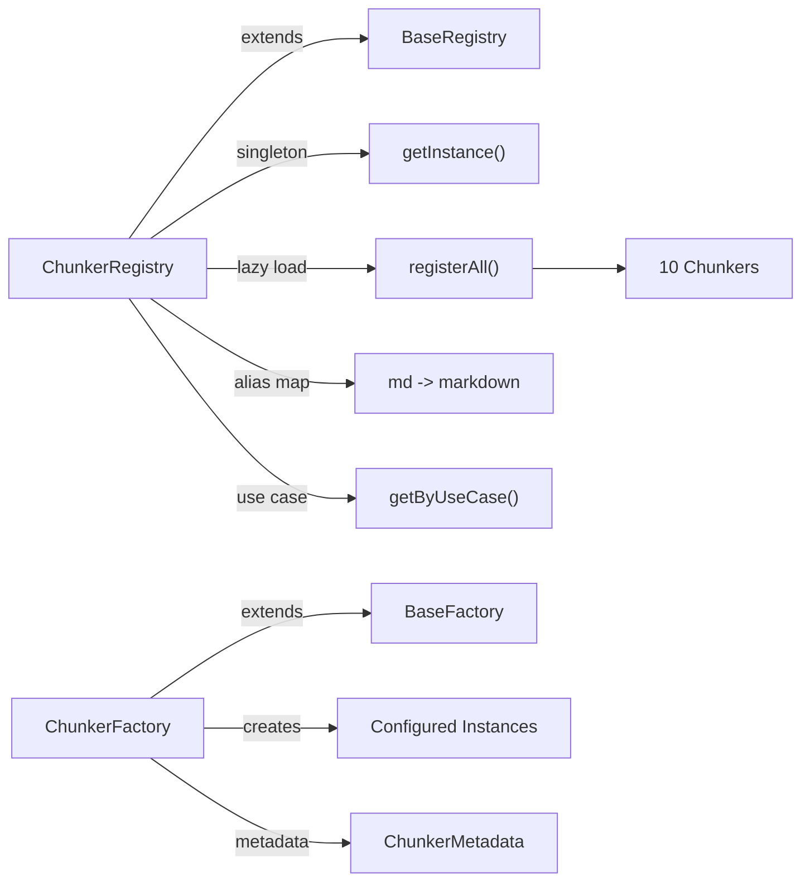
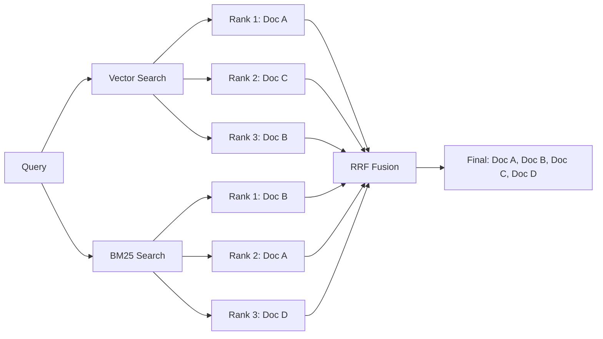
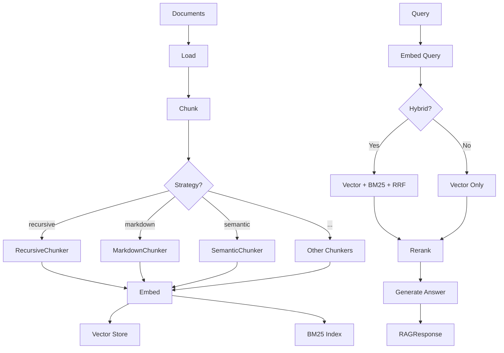

Our first RAG implementation used fixed-size character splitting. It worked perfectly on blog posts. Then someone fed it a LaTeX paper with 47 nested equations, and the retrieved chunks were gibberish -- half an equation here, a dangling `\end{theorem}` there.

NeuroLink's RAG pipeline now supports 10 chunking strategies, hybrid search (vector + BM25), Graph RAG, and reranking. But we did not start here. We started with one chunker and one vector store, and every addition was a response to a real failure.

This post tells the story of why each chunking strategy exists, how we designed the registry/factory pattern to scale them, and the benchmarks that proved which strategies work best for which content.

## The First RAG Pipeline (and Why It Failed)

Version 1 was simple: split text into 1000-character chunks with 100-character overlap, embed with OpenAI `text-embedding-3-small`, retrieve top-5 by cosine similarity.

It worked for blog posts, plain-text documents, and short emails. Then we tested it against real production workloads:

**Code documentation** split mid-function. A chunk would contain the first half of a function definition and the last half of the previous function's docstring. Neither chunk was useful for answering questions about either function.

**Markdown documents** split mid-heading. A chunk starting with "## Configura" and ending with "tion Options\n\nThe following flags..." lost the heading context entirely. The retriever could not match a query about "configuration options" because the heading was split across two chunks.

**JSON configurations** produced invalid fragments. A chunk containing `{"port": 3000, "host":` is not just unhelpful -- it is misleading. The retriever would surface this fragment for a query about port configuration, but the LLM could not interpret the incomplete JSON.

**LaTeX papers** split mid-equation. A chunk ending with `\frac{1}{2}` and the next starting with `mv^2` destroyed the mathematical meaning entirely.

The root cause was clear: character chunking has no concept of semantic boundaries. It treats all text as a flat byte stream. But different document types have different natural boundary markers -- headings in Markdown, tags in HTML, object boundaries in JSON, environments in LaTeX. The chunker must understand the structure of the content, not just its characters.

## The Chunking Strategy Explosion

Each of the 10 strategies was born from a specific failure mode. Here is the full list with the design rationale behind each one.

**Strategy 1: Character.** The baseline. Split at character count with overlap. Still useful for truly unstructured text with no formatting markers. Config: `maxSize: 1000, overlap: 100`.

**Strategy 2: Recursive.** The "good default." Tries to split at `\n\n` first, then `\n`, then `.`, then `" "`, then individual characters. Preserves paragraph boundaries when possible. Inspired by LangChain's recursive text splitter, the ordered separator list is the key insight -- try the most meaningful boundary first.

**Strategy 3: Sentence.** Split at sentence boundaries (periods, question marks, exclamation marks). Groups sentences to fill chunk size. Built for Q&A applications where each chunk should contain complete thoughts.

**Strategy 4: Token.** Split by token count using model-specific tokenizers. Ensures chunks fit within model context windows precisely. When you need exact token budgets (for example, embedding models with 512-token limits), character count is not sufficient because token counts vary per word.

**Strategy 5: Markdown.** Split at heading boundaries (`#`, `##`, `###`), preserving the heading hierarchy as metadata. Documentation is mostly Markdown. Splitting at headings preserves section context, and the heading text becomes searchable metadata.

**Strategy 6: HTML.** Split at semantic HTML tags (`<article>`, `<section>`, `<p>`, `<h1>`-`<h6>`), with optional tag stripping. Web content scraping was the driver. Tags carry structural meaning that character chunking destroys.

**Strategy 7: JSON.** Split at object boundaries, respecting nesting depth. Ensures no chunk contains an invalid JSON fragment. API responses, configuration files, and structured data all need this.

**Strategy 8: LaTeX.** Split at `\section`, `\subsection`, `\begin{environment}`, and math blocks. The academic paper failure that inspired this whole journey. Equations and proofs must stay intact.

**Strategy 9: Semantic.** Uses embedding similarity to identify natural topic boundaries. When adjacent chunks are dissimilar, insert a split. For content where structural markers (headings, paragraphs) do not align with topic boundaries. This is the highest-quality strategy but also the slowest due to embedding API calls.

**Strategy 10: Semantic-Markdown.** Combines Markdown structural splitting with semantic similarity to merge small related sections. Documentation where heading-level splitting produces chunks that are too small. Semantic similarity merges related subsections into coherent retrieval units.

## The Registry/Factory Pattern

With 10 chunkers, each with different constructors, configurations, and dependencies, we needed a clean management pattern. A giant switch statement was not going to scale.

### The Solution: ChunkerRegistry + ChunkerFactory

The `ChunkerRegistry` is a singleton that holds factory functions and metadata for each chunker. The `ChunkerFactory` creates configured instances on demand.



Four key design decisions shaped the architecture:

**Lazy loading via dynamic imports.** Each chunker is loaded only when first used. The registry holds factory functions, not instances. This keeps the initial bundle small -- you pay the import cost only for the strategies you actually use.

```typescript
import { createChunker, getAvailableStrategies } from '@juspay/neurolink';

// List all available strategies
const strategies = await getAvailableStrategies();
console.log('Available:', strategies);
// ['character', 'recursive', 'sentence', 'token', 'markdown',
//  'html', 'json', 'latex', 'semantic', 'semantic-markdown']

// Create a chunker with custom config
const chunker = await createChunker('markdown', {
  maxSize: 1500,
  overlap: 0,
  headerLevels: [1, 2, 3],
});

// Aliases work too
const sameChunker = await createChunker('md'); // resolves to 'markdown'
```

**Alias support.** `'md'` resolves to `'markdown'`, `'tex'` to `'latex'`, `'langchain-default'` to `'recursive'`. Aliases are stored in the `ChunkerMetadata` and resolved during lookup. This lets users reference strategies by familiar names without the registry maintaining multiple implementations.

**Use-case discovery.** `getChunkersByUseCase('academic')` returns `['latex', 'semantic']`. Each chunker declares its use cases in metadata, enabling programmatic strategy selection without hardcoded mappings.

```typescript
import { chunkerRegistry, getChunkerMetadata } from '@juspay/neurolink';

// Get metadata for a strategy
const markdownMeta = getChunkerMetadata('markdown');
console.log(markdownMeta);
// {
//   description: 'Splits markdown content by headers and structural elements',
//   defaultConfig: { maxSize: 1000, overlap: 0 },
//   supportedOptions: ['maxSize', 'overlap', 'headerLevels', 'splitCodeBlocks'],
//   useCases: ['Documentation processing', 'README files', 'Technical documentation'],
//   aliases: ['md', 'markdown-header']
// }

// Find chunkers by use case
const academicChunkers = chunkerRegistry.getChunkersByUseCase('academic');
console.log(academicChunkers); // ['latex']
```

**BaseRegistry foundation.** Both the ChunkerRegistry and ChunkerFactory extend `BaseRegistry` and `BaseFactory` from our shared infrastructure. The `BaseRegistry` pattern provides `register(name, factory, metadata)`, `get(name)` with lazy instantiation, `list()` for all items with metadata, and `ensureInitialized()` for safe startup. This same pattern powers our provider registry, middleware registry, and server adapter registry.

## Beyond Chunking -- Retrieval Architecture

Chunking is the ingestion half of RAG. The retrieval half is equally important and equally nuanced.

### Vector Store Abstraction

We defined a `VectorStore` interface with two core operations: `query(indexName, queryVector, topK, filter)` for similarity search and `upsert(indexName, documents)` for adding embeddings with metadata. The `InMemoryVectorStore` implements this for development, but the interface is designed for production backends: Pinecone, Weaviate, Qdrant, or any vector database.

The abstraction ensures that changing your vector database requires zero changes to your chunking, embedding, or retrieval code.

### BM25 Sparse Retrieval

Vector search excels at semantic similarity but misses exact keyword matches. Searching for "NeuroLink" as a specific term might not surface documents that mention it by name if the embedding model does not weight that token highly.

We implemented `InMemoryBM25Index` with standard BM25 scoring (k1=1.5, b=0.75), including tokenization, IDF calculation, and document frequency tracking. BM25 catches exact terms that vector search misses.

### Hybrid Search Fusion

Reciprocal Rank Fusion (RRF) combines vector and BM25 results using a rank-based formula that does not depend on absolute scores:



The formula `1/(k + rank_vector) + 1/(k + rank_bm25)` where k=60 produces a unified ranking that respects both semantic similarity and keyword relevance.

```typescript
import { createHybridSearch, InMemoryBM25Index } from '@juspay/neurolink';
import { InMemoryVectorStore } from '@juspay/neurolink';

const vectorStore = new InMemoryVectorStore();
const bm25Index = new InMemoryBM25Index();

const hybridSearch = createHybridSearch({
  vectorStore,
  bm25Index,
  indexName: 'my-docs',
  embeddingModel: { provider: 'openai', modelName: 'text-embedding-3-small' },
});

// hybrid search combines vector similarity + BM25 keyword matching
const results = await hybridSearch('NeuroLink streaming configuration', {
  topK: 10,
});

results.forEach(r => {
  console.log(`Score: ${r.score.toFixed(3)} | ${r.text.slice(0, 80)}...`);
});
```

### Graph RAG

Standard retrieval finds chunks similar to the query. Graph RAG follows relationship chains. We build a graph where chunks are nodes and edges represent semantic similarity above a threshold. Query traversal retrieves not just the most similar chunks but also their neighbors, enabling "follow-up" style retrieval.

### Reranking

Post-retrieval reranking applies a cross-encoder model to the top candidates. We over-retrieve by 2x (fetch top-20 to rerank to top-5), and the precision improvement at the top positions is dramatic.

## The RAGPipeline Orchestrator

Before `RAGPipeline`, users had to manually wire chunking, embedding, vector storage, retrieval, and generation. That meant 50+ lines of boilerplate for a basic RAG query.

The `RAGPipeline` class orchestrates the entire flow:



```typescript
import { RAGPipeline } from '@juspay/neurolink';

const pipeline = new RAGPipeline({
  embeddingModel: { provider: 'openai', modelName: 'text-embedding-3-small' },
  generationModel: { provider: 'openai', modelName: 'gpt-4o-mini' },
  defaultChunkingStrategy: 'semantic-markdown',
  defaultChunkSize: 1000,
  defaultChunkOverlap: 200,
  enableHybridSearch: true,
  enableReranking: true,
  rerankingModel: { provider: 'openai', modelName: 'gpt-4o-mini' }, // Must be a generative LLM, not an embedding model
});

// Ingest documents
const { documentsProcessed, chunksCreated } = await pipeline.ingest(
  ['./docs/api.md', './docs/guides.md', './docs/faq.md'],
  { strategy: 'semantic-markdown', extractMetadata: true }
);

console.log(`Processed ${documentsProcessed} docs, created ${chunksCreated} chunks`);

// Query with hybrid search + reranking
const response = await pipeline.query('How do I configure streaming?', {
  hybrid: true,
  rerank: true,
  topK: 5,
  includeSources: true,
});

console.log(response.answer);
console.log(`Retrieved ${response.metadata.chunksRetrieved} chunks in ${response.metadata.queryTime}ms`);
console.log(`Method: ${response.metadata.retrievalMethod}, Reranked: ${response.metadata.reranked}`);
```

> **Note:** The reranking model must be a generative LLM (not an embedding model) because NeuroLink's reranker uses prompt-based relevance scoring via `model.generate()`. Embedding models like `text-embedding-3-large` cannot generate text responses.
{: .prompt-info }

Key design decisions in `RAGPipeline`:

- **`ingest(sources, options)`** loads, chunks, embeds, and stores in one call.
- **`query(query, options)`** embeds, retrieves, reranks, and generates in one call.
- **`getStats()`** provides pipeline health monitoring (document count, chunk count, dimensions).
- **Lazy initialization**: Embedding and generation providers are created on first use.
- **Sensible defaults**: Recursive strategy, 1000 chunk size, 200 overlap, top-5 retrieval. Hybrid search and Graph RAG are disabled by default (opt-in).

The convenience factory `createRAGPipeline({ provider: 'openai', enableHybrid: true })` handles common configurations in a single function call.

Adoption tripled after we introduced `RAGPipeline`. Fifty lines of boilerplate became two function calls: `pipeline.ingest()` and `pipeline.query()`.

## Benchmarks -- Which Strategy Wins?

We benchmarked all 10 strategies against 500 documents across five categories: code documentation, Markdown guides, LaTeX papers, JSON configurations, and plain text. Each category had 100 queries. We measured retrieval accuracy (recall@5), answer quality (GPT-4 judge scoring), and latency.

| Strategy | Code Docs | Markdown | LaTeX | JSON | Plain Text |
|----------|-----------|----------|-------|------|------------|
| Character | 62% | 71% | 34% | 28% | 78% |
| Recursive | 81% | 85% | 52% | 41% | 82% |
| Sentence | 74% | 79% | 48% | 35% | 85% |
| Token | 76% | 80% | 50% | 38% | 80% |
| Markdown | 85% | 92% | -- | -- | -- |
| HTML | -- | -- | -- | -- | -- |
| JSON | -- | -- | -- | 89% | -- |
| LaTeX | -- | -- | 88% | -- | -- |
| Semantic | 83% | 87% | 71% | 62% | 86% |
| Sem-Markdown | 88% | 94% | -- | -- | -- |

The dashes indicate strategies not applicable to that content type.

**Key findings:**

**Format-specific chunkers dominate their domain.** Markdown chunking achieves 92% recall on Markdown documents versus 71% for character chunking. LaTeX chunking achieves 88% on LaTeX versus 34% for character chunking. The difference is not marginal -- it is the difference between a useful RAG system and a broken one.

**Recursive is the best general-purpose default.** At 81-85% across code docs, Markdown, and plain text, recursive chunking is consistently good without being the best at anything. It is the safe choice when you do not know the content type in advance.

**Semantic-Markdown is the best overall for documentation workloads.** At 94% recall on Markdown and 88% on code docs, it combines the structural awareness of Markdown chunking with the semantic coherence of embedding-based splitting.

**Hybrid search adds 8-12% recall improvement** over pure vector search across all strategies. This is a consistent improvement regardless of the chunking strategy used.

## Lessons Learned

Over two years of building and iterating on the RAG pipeline, five lessons emerged:

**1. There is no universal chunker.** Document structure matters. The registry pattern lets users pick the right strategy without SDK changes. Trying to build one chunker that handles all formats leads to mediocre performance on everything.

**2. Overlap is underrated.** Even 10% overlap dramatically reduces "orphaned context" where a relevant fact falls on a chunk boundary. We default to 200 characters of overlap on a 1000-character chunk, and our benchmarks show this is near-optimal.

**3. BM25 complements vectors.** Exact keyword matches are trivial for BM25 and surprisingly hard for embedding models. Hybrid search is always better than either alone. The additional index maintenance cost is minimal compared to the quality improvement.

**4. Lazy loading pays off.** Ten chunkers but only one loaded at startup. Bundle size stays constant as strategies grow. This was a deliberate architectural choice that has proven correct as we added strategies 8, 9, and 10 without affecting startup time.

**5. The pipeline abstraction was worth the investment.** Fifty lines of boilerplate became `pipeline.ingest()` + `pipeline.query()`. Adoption tripled. The lesson: developer experience is not a luxury -- it is the difference between an SDK that gets used and one that gets abandoned.

## Design Decisions and Trade-offs

We chose the registry/factory pattern over a monolithic chunker because no single strategy handles all document types well. This means more code surface area and more strategies to maintain, but the benchmarks vindicate the decision: format-specific chunkers outperform general-purpose ones by 20-60% recall on their target formats.

Hybrid search (vector + BM25) adds index maintenance complexity and doubles storage requirements. We accepted this trade-off because the 8-12% recall improvement is consistent and measurable. For teams where storage cost is a constraint, pure vector search is a reasonable starting point.

The pipeline abstraction hides significant complexity behind `pipeline.ingest()` and `pipeline.query()`. The risk is that developers lose visibility into what happens between those calls. We mitigated this with detailed event logging at each pipeline stage so developers can inspect chunking decisions, embedding generation, and retrieval scoring when they need to.

What comes next: multi-modal RAG (images + text chunks), streaming RAG responses for progressive answer display, and an automated evaluation framework for continuous quality measurement.

- [How We Built Streaming Tool Calls](/posts/how-we-built-streaming-tool-calls/) -- The engineering story behind real-time tool execution
- How We Built MCP Integration -- Integrating 58+ tool servers into a unified protocol
- [Advanced RAG](/posts/advanced-rag/) -- The user-facing guide to all the features described here

---

**Related posts:**

- [Advanced RAG: 10 Chunking Strategies, Hybrid Search, and Reranking](/posts/advanced-rag/)
- [Building a RAG Application with TypeScript: Complete Tutorial](/posts/rag-application-typescript-tutorial/)
- [How We Built Streaming Tool Calls: Real-Time AI at Scale](/posts/how-we-built-streaming-tool-calls/)
