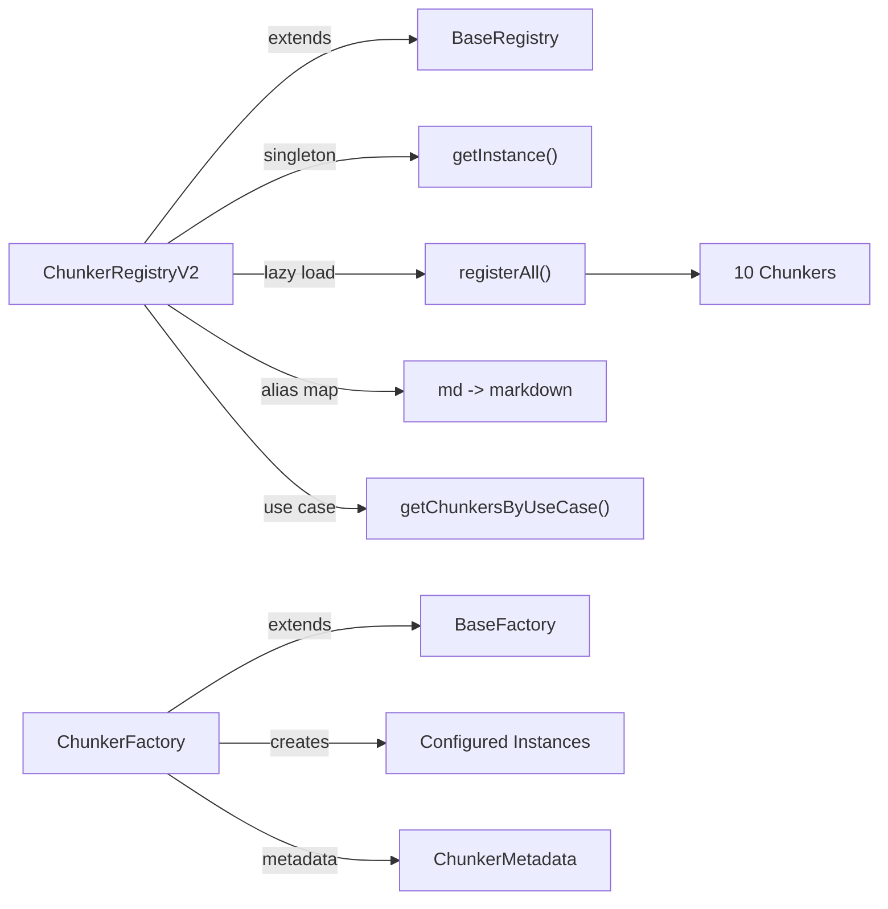
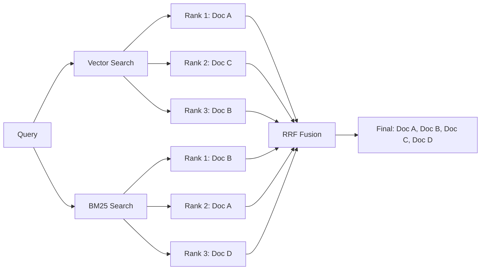
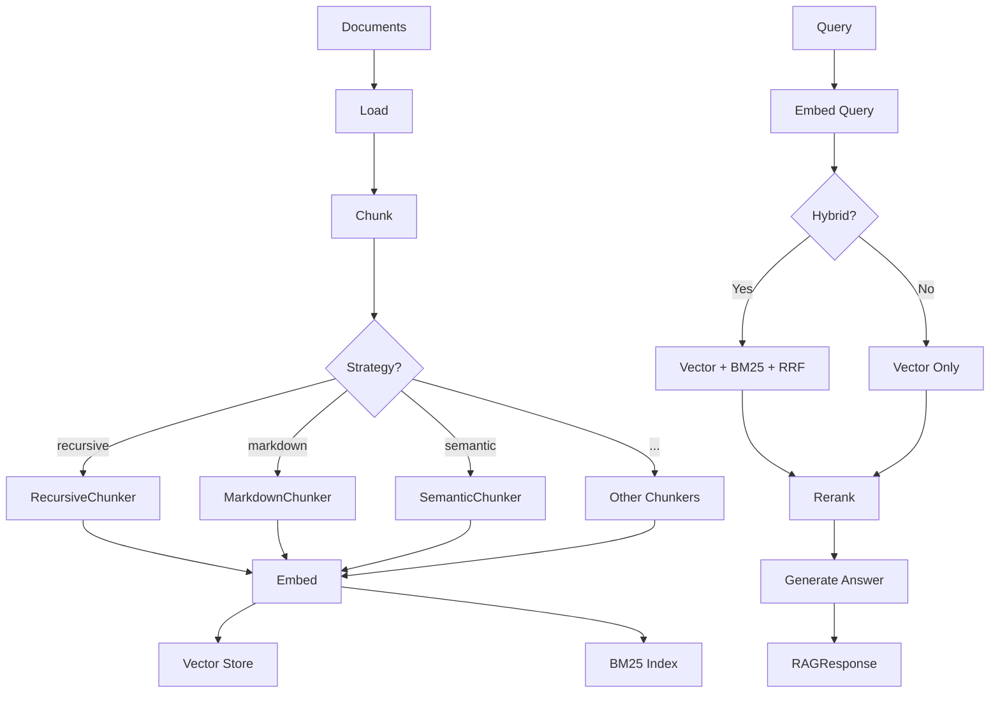

Fixed-size character splitting can work for uniform prose but fail on structured formats. A split can cut a LaTeX equation, Markdown heading, function definition, or JSON object in half, leaving fragments with too little context for reliable retrieval.

NeuroLink's RAG subsystem registers 10 chunking strategies and includes hybrid vector-plus-BM25 search, Graph RAG, and reranking. These components let an application select a retrieval design that matches its document structure and evaluation criteria instead of forcing every corpus through one splitter.

This post examines why the strategies exist, how the registry and factory expose them, and how to evaluate their trade-offs on your own corpus.

## Where Fixed-Size Chunking Breaks Down

Consider a baseline that splits text into 1000-character chunks with 100-character overlap, embeds each chunk with OpenAI `text-embedding-3-small`, and retrieves the five nearest vectors. That is easy to implement, but its boundaries are unrelated to the source structure.

Common failure modes include:

**Code documentation** can split mid-function, separating a definition from the docstring or surrounding explanation that gives it meaning.

**Markdown documents** can split mid-heading. A chunk beginning with "## Configura" and a following chunk beginning with "tion Options" both lose the intact section title.

**JSON configurations** can produce fragments such as `{"port": 3000, "host":`, which no longer represent complete JSON values.

**LaTeX papers** can split an equation or environment across chunks, separating notation that must be interpreted together.

The limitation is structural: character chunking treats text as a flat sequence. Other strategies can instead use paragraphs, sentences, headings, object boundaries, or LaTeX environments as candidate split points.

## The 10 Registered Strategies

NeuroLink exposes 10 strategy names. Their implementations make different compromises, so the right choice depends on the source format and the behavior you validate in retrieval tests.

There are two implementation sets behind those names. The descriptions below cover the public `createChunker()` / `ChunkerFactory` entry point and the metadata registry exported from `@juspay/neurolink/rag`. `MDocument.chunk()` and `RAGPipeline` ingestion use a separate set of chunkers, and where the two differ, the difference is noted in the strategy entry.

**Strategy 1: Character.** Splits by character count with optional overlap. Its default configuration is `maxSize: 1000, overlap: 100`. The `MDocument`/`RAGPipeline` version defaults to an overlap of 0.

**Strategy 2: Recursive.** Tries an ordered separator list, beginning with paragraph and line boundaries before falling back to smaller separators. This is the pipeline's default strategy.

**Strategy 3: Sentence.** Detects sentence endings, groups sentences up to the configured size, and can carry complete trailing sentences into the next chunk as overlap.

**Strategy 4: Token.** Approximates token counts from words at about 1.3 tokens per word. It is useful for rough budgeting, but it does not use a model-specific tokenizer and therefore does not guarantee exact token limits. The `MDocument`/`RAGPipeline` version estimates about 4 characters per token instead, which is also an approximation.

**Strategy 5: Markdown.** Splits around Markdown headings and preserves section context in chunk metadata. It also detects fenced code blocks and tables so those structures can be handled as units where size permits.

**Strategy 6: HTML.** Removes script, style, and HTML tags, normalizes whitespace, and then applies size-based splitting to the extracted text. This version does not retain a semantic tag hierarchy. The `MDocument`/`RAGPipeline` version works differently: it splits on structural tags, keeps elements such as `pre`, `code`, `table`, lists, and `blockquote` together as units, and records the source `tagName` in chunk metadata instead of stripping tags first.

**Strategy 7: JSON.** Parses the document first, emits array elements or the top-level value as items, and serializes them for chunking. An item larger than the configured maximum can still be split into text fragments, so consumers should not assume that every output chunk is independently valid JSON. The `MDocument`/`RAGPipeline` version walks the nesting up to a `maxDepth`, can split on configured `splitKeys`, and can record each chunk's JSON path in metadata.

**Strategy 8: LaTeX.** Uses section commands and selected environments as boundaries, then splits oversized sections by size. This improves structural grouping but does not guarantee that every mathematical expression remains intact.

**Strategy 9: Semantic.** In `RAGPipeline` ingestion and the registry API, this strategy embeds paragraph-sized segments, compares adjacent embeddings, and uses a similarity threshold to find candidate topic boundaries. It defaults to OpenAI `text-embedding-3-small` and falls back to simple size-based chunking if embedding setup fails. One current implementation caveat: the standalone public `createChunker('semantic')` factory path still constructs a `RecursiveChunker` stand-in, so use the pipeline or registry path when you need embedding-based boundaries and pin the SDK version you test.

**Strategy 10: Semantic-Markdown.** Splits by Markdown headings and merges adjacent small sections while they fit the configured maximum. Despite the strategy name, the current `SemanticMarkdownChunker` does not calculate embedding similarity during that merge.

## The Registry/Factory Pattern

With 10 strategy names, different configurations, and some optional provider work, a registry and factory provide a common discovery and construction layer.

### The Solution: ChunkerRegistry + ChunkerFactory

The metadata registry is a singleton that holds async constructors and metadata for each chunker. It is exported from the `@juspay/neurolink/rag` subpath as the `chunkerRegistry` instance (class `ChunkerRegistryV2`), together with helpers such as `getChunkerMetadata()`. The root package's `ChunkerRegistry` export is a different, static class that only lists, looks up, and recommends strategies. `ChunkerFactory`, also exported from `@juspay/neurolink/rag`, creates configured instances on demand, and the root `createChunker()` wraps it. `RAGPipeline` ingestion reaches a separate document-processing registry through `MDocument`; both registries expose the same 10 strategy names, but the semantic implementation caveat below means their behavior is not identical for every entry point.


```mermaid
flowchart LR
    A["ChunkerRegistryV2"] -->|"extends"| B["BaseRegistry"]
    A -->|"singleton"| C["getInstance()"]
    A -->|"lazy load"| D["registerAll()"]
    D --> E["10 Chunkers"]
    A -->|"alias map"| F["md -> markdown"]
    A -->|"use case"| G["getChunkersByUseCase()"]
    H["ChunkerFactory"] -->|"extends"| I["BaseFactory"]
    H -->|"creates"| J["Configured Instances"]
    H -->|"metadata"| K["ChunkerMetadata"]
```

Four key design decisions shaped the architecture:

**Lazy construction via dynamic imports.** The public registry and factory register async constructors, and strategy modules are dynamically imported when a chunker is requested through those entry points. This defers initialization work until the application uses the strategy; measure the effect on your own bundler and runtime rather than assuming a fixed bundle-size result.

```typescript
import { createChunker, getAvailableStrategies } from '@juspay/neurolink';

// List all available strategies
const strategies = await getAvailableStrategies();
console.log('Available:', strategies);
// ['character', 'recursive', 'sentence', 'token', 'markdown',
//  'html', 'json', 'latex', 'semantic', 'semantic-markdown']

// Create a chunker with custom size and overlap
const chunker = await createChunker('markdown', {
  maxSize: 1500,
  overlap: 0,
});

// Aliases work too
const sameChunker = await createChunker('md'); // resolves to 'markdown'
```

**Alias support.** `'md'` resolves to `'markdown'`, `'tex'` to `'latex'`, `'langchain-default'` to `'recursive'`. Aliases are stored in the `ChunkerMetadata` and resolved during lookup. This lets users reference strategies by familiar names without the registry maintaining multiple implementations.

**Use-case discovery.** `chunkerRegistry.getChunkersByUseCase('academic')` returns `['latex']` -- LaTeX chunking is the strategy tagged for academic papers. Each chunker declares its use cases in metadata, enabling programmatic strategy selection without hardcoded mappings.

```typescript
import { chunkerRegistry, getChunkerMetadata } from '@juspay/neurolink/rag';

// Metadata lookups are synchronous, so load the lazy registry first
await chunkerRegistry.ensureInitialized();

// Get metadata for a strategy
const markdownMeta = getChunkerMetadata('markdown');
console.log(markdownMeta);
// {
//   description: 'Splits markdown content by headers and structural elements',
//   defaultConfig: { maxSize: 1000, overlap: 0 },
//   supportedOptions: ['maxSize', 'overlap', 'headerLevels', 'splitCodeBlocks', 'preserveMetadata'],
//   useCases: ['Documentation processing', 'README files', 'Technical documentation'],
//   aliases: ['md', 'markdown-header']
// }

// Find chunkers by use case
const academicChunkers = chunkerRegistry.getChunkersByUseCase('academic');
console.log(academicChunkers); // ['latex']
```

**Base infrastructure.** The `/rag` registry class (`ChunkerRegistryV2`) extends `BaseRegistry`, while `ChunkerFactory` extends `BaseFactory`. The shared infrastructure handles registration, aliases, lazy initialization, lookup, and discovery so each strategy does not need to reimplement that lifecycle.

## Beyond Chunking -- Retrieval Architecture

Chunking is the ingestion half of RAG. The retrieval half is equally important and equally nuanced.

### Vector Store Abstraction

NeuroLink defines a `VectorStore` interface with `query({ indexName, queryVector, topK, filter })` for similarity search. Writable stores additionally implement `upsert(indexName, items)` for adding embeddings with metadata. The `InMemoryVectorStore` supports both methods for development. NeuroLink also ships adapters for Pinecone, pgvector, and Chroma, and the interface is structural, so another vector database can implement it too.

Because the pipeline depends on the interface, an adapter that implements the same methods can usually be substituted without changing chunking or embedding logic. Store-specific configuration, filters, indexing, credentials, and deployment behavior still require integration and testing.

### BM25 Sparse Retrieval

Vector search ranks semantic similarity, while sparse retrieval gives direct weight to matching terms. A query containing a product name, identifier, or configuration key can therefore produce a different ranking in the two systems.

`InMemoryBM25Index` implements BM25 scoring with `k1=1.5` and `b=0.75`, including tokenization, IDF calculation, and document-frequency tracking. It provides a sparse ranking based on query-term matches that can differ from the vector ranking.

### Hybrid Search Fusion

Reciprocal Rank Fusion (RRF) combines vector and BM25 results using a rank-based formula that does not depend on absolute scores:


```mermaid
flowchart LR
    A["Query"] --> B["Vector Search"]
    A --> C["BM25 Search"]
    B --> D["Rank 1: Doc A"]
    B --> E["Rank 2: Doc C"]
    B --> F["Rank 3: Doc B"]
    C --> G["Rank 1: Doc B"]
    C --> H["Rank 2: Doc A"]
    C --> I["Rank 3: Doc D"]
    D --> J["RRF Fusion"]
    E --> J
    F --> J
    G --> J
    H --> J
    I --> J
    J --> K["Final: Doc A, Doc B, Doc C, Doc D"]
```

The formula `1/(k + rank_vector) + 1/(k + rank_bm25)` where k=60 produces a unified ranking that respects both semantic similarity and keyword relevance.

```typescript
import {
  createHybridSearch,
  InMemoryBM25Index,
  InMemoryVectorStore,
} from '@juspay/neurolink';

const vectorStore = new InMemoryVectorStore();
const bm25Index = new InMemoryBM25Index();

const hybridSearch = createHybridSearch({
  vectorStore,
  bm25Index,
  indexName: 'my-docs',
  embeddingModel: { provider: 'openai', modelName: 'text-embedding-3-small' },
});

// hybrid search combines vector similarity + BM25 keyword matching
const results = await hybridSearch('NeuroLink streaming configuration', {
  topK: 10,
});

results.forEach(r => {
  console.log(`Score: ${r.score.toFixed(3)} | ${r.text.slice(0, 80)}...`);
});
```

### Graph RAG

`GraphRAG` builds nodes from chunks and creates weighted edges when embedding similarity meets the configured threshold. At query time it seeds from the most query-similar nodes, runs a random walk with restart, and combines visit frequency with direct query similarity to rank the result nodes.

### Reranking

The pipeline's reranker uses a configured generative provider to score semantic relevance, then combines that score with the original vector score and the candidate's position. It processes candidates in batches and returns the configured top results. This is prompt-based LLM scoring, not a cross-encoder, so evaluate its quality, latency, and model cost for your workload.

## The RAGPipeline Orchestrator

Without `RAGPipeline`, an application must wire chunking, embedding, vector storage, retrieval, and generation itself. The class packages those stages behind `ingest()` and `query()` while keeping strategy and retrieval options configurable.

The `RAGPipeline` class orchestrates the entire flow:


```mermaid
flowchart TD
    A["Documents"] --> B["Load"]
    B --> C["Chunk"]
    C --> D{"Strategy?"}
    D -->|"recursive"| E["RecursiveChunker"]
    D -->|"markdown"| F["MarkdownChunker"]
    D -->|"semantic"| G["SemanticChunker"]
    D -->|"..."| H["Other Chunkers"]
    E --> I["Embed"]
    F --> I
    G --> I
    H --> I
    I --> J["Vector Store"]
    I --> K["BM25 Index"]
    L["Query"] --> M["Embed Query"]
    M --> N{"Hybrid?"}
    N -->|"Yes"| O["Vector + BM25 + RRF"]
    N -->|"No"| P["Vector Only"]
    O --> Q["Rerank"]
    P --> Q
    Q --> R["Generate Answer"]
    R --> S["RAGResponse"]
```

```typescript
import { RAGPipeline } from '@juspay/neurolink';

const pipeline = new RAGPipeline({
  embeddingModel: { provider: 'openai', modelName: 'text-embedding-3-small' },
  generationModel: { provider: 'openai', modelName: 'gpt-5.4-mini' },
  defaultChunkingStrategy: 'semantic-markdown',
  defaultChunkSize: 1000,
  defaultChunkOverlap: 200,
  enableHybridSearch: true,
  enableReranking: true,
  rerankingModel: { provider: 'openai', modelName: 'gpt-5.4-mini' }, // Must be a generative LLM, not an embedding model
});

// Ingest documents
const { documentsProcessed, chunksCreated } = await pipeline.ingest(
  ['./docs/api.md', './docs/guides.md', './docs/faq.md'],
  { strategy: 'semantic-markdown', extractMetadata: true }
);

console.log(`Processed ${documentsProcessed} docs, created ${chunksCreated} chunks`);

// Query with hybrid search + reranking
const response = await pipeline.query('How do I configure streaming?', {
  hybrid: true,
  rerank: true,
  topK: 5,
  includeSources: true,
});

console.log(response.answer);
console.log(`Retrieved ${response.metadata.chunksRetrieved} chunks in ${response.metadata.queryTime}ms`);
console.log(`Method: ${response.metadata.retrievalMethod}, Reranked: ${response.metadata.reranked}`);
```

> **Note:** The reranking model must be a generative LLM (not an embedding model) because NeuroLink's reranker uses prompt-based relevance scoring via `model.generate()`. Embedding models like `text-embedding-3-large` cannot generate text responses.
{: .prompt-info }

Key design decisions in `RAGPipeline`:

- **`ingest(sources, options)`** loads, chunks, embeds, and stores in one call.
- **`query(query, options)`** embeds, retrieves, reranks, and generates in one call.
- **`getStats()`** provides pipeline health monitoring (document count, chunk count, dimensions).
- **Lazy initialization**: Embedding and generation providers are created on first use.
- **Documented defaults**: Recursive strategy, 1000-character chunks, 200-character overlap, and top-5 retrieval. Hybrid search, Graph RAG, and reranking are disabled by default.

The convenience factory `createRAGPipeline({ provider: 'openai', enableHybrid: true })` handles a smaller set of common options. Add `generationModel` when the pipeline should generate an answer instead of returning assembled context only.

The abstraction reduces manual orchestration to `pipeline.ingest()` and `pipeline.query()`, but applications still need to configure providers and stores, define an ingestion policy, and evaluate retrieval quality.

## How to Benchmark the Strategies

The repository does not publish a benchmark artifact that supports one universal winner or fixed recall improvements. Chunking quality depends on the corpus, query distribution, embedding model, retrieval settings, and relevance labels. Treat strategy selection as an experiment you can reproduce.

Build an evaluation set with representative documents and queries, then record at least:

| Dimension | What to compare |
|---|---|
| Retrieval | Recall@k, precision@k, or nDCG against human relevance labels |
| Answer quality | A stable rubric with human review or a calibrated model judge |
| Latency | Ingestion time, query time, and any external provider calls |
| Cost | Embedding, semantic chunking, reranking, and generation usage |
| Integrity | Complete headings, code blocks, tables, JSON values, and LaTeX environments |

Run the same queries against a character or recursive baseline, the format-aware candidate, and any hybrid or reranked variant. Keep the corpus, embedding model, `topK`, and relevance judgments fixed so the comparison isolates the component being tested.

Do not assume the strategy name alone proves its behavior. In the current implementation, `RAGPipeline.ingest({ strategy: 'semantic' })` and the registry path use embedding-based boundary detection, while standalone `createChunker('semantic')` still creates a recursive stand-in. Semantic-Markdown merges heading sections by size without embedding comparisons on these paths. Benchmark the exact entry point you ship and pin the SDK version used for the run.

## Engineering Lessons

**1. There is no universal chunker.** Document structure matters. The registry pattern lets applications select a strategy without changing the pipeline API, but the selection still needs corpus-specific evaluation.

**2. Overlap is a tunable trade-off.** Overlap can preserve facts that cross a boundary, but it also creates duplicate text, more embeddings, and more retrieval candidates. The pipeline defaults to 200 characters for a 1000-character chunk; test smaller and larger values rather than treating that default as optimal.

**3. Sparse and dense retrieval solve different problems.** BM25 weights matching terms; vectors rank semantic similarity. Hybrid retrieval can help when a query set needs both, but it can also add noisy candidates and requires another index. Compare it with each single-retriever baseline.

**4. Deferred initialization limits upfront work.** Providers and chunkers are initialized on demand. The impact on browser bundles, server startup, and first-request latency depends on the application's build and deployment environment, so measure all three where they matter.

**5. A pipeline API reduces wiring, not evaluation work.** `pipeline.ingest()` and `pipeline.query()` coordinate the main stages. Teams still own source validation, chunking policy, access controls, retrieval evaluation, monitoring, and store operations.

## Design Decisions and Trade-offs

The registry and factory add implementation surface, but they also separate discovery and construction from individual chunkers. That makes additional strategies possible without expanding a single conditional dispatcher.

Hybrid search maintains both vector and sparse indexes and queries both paths before fusion. Its storage and operational overhead depend on the adapters, metadata, and corpus. Start with vector or BM25 retrieval as a baseline, then retain hybrid search only when evaluation shows a useful improvement.

Graph RAG adds graph construction and stochastic traversal. LLM-based reranking adds provider calls and prompt-scoring latency. Each should be enabled independently and compared against a simpler retrieval path.

The pipeline abstraction also hides work behind `ingest()` and `query()`. Its response metadata reports retrieval method, retrieved-chunk count, reranking status, and query time; combine those fields with application-level traces and evaluation results when diagnosing retrieval behavior.

The subsystem also contains multi-modal ingestion and retrieval primitives. Treat further extensions and roadmap items as version-specific capabilities, and verify them against the release you deploy.

- [How We Built Streaming Tool Calls](/posts/how-we-built-streaming-tool-calls/) -- The engineering story behind real-time tool execution
- [How We Built MCP Integration](/posts/how-we-built-mcp-integration/) -- The engineering story behind supporting 4 transport protocols
- [Advanced RAG](/posts/advanced-rag/) -- The user-facing guide to all the features described here

---

**Related posts:**

- [Advanced RAG: 10 Chunking Strategies, Hybrid Search, and Reranking](/posts/advanced-rag/)
- [Building a RAG Application with TypeScript: Complete Tutorial](/posts/rag-application-typescript-tutorial/)
- [How We Built Streaming Tool Calls: Real-Time AI at Scale](/posts/how-we-built-streaming-tool-calls/)
