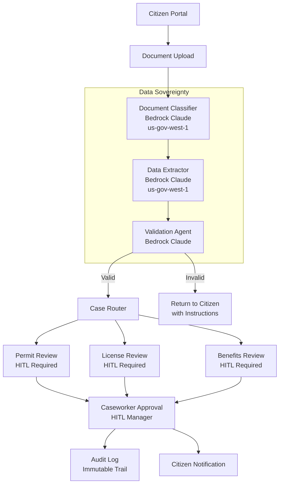

You will build a compliant AI citizen services portal that automates document intake, extraction, classification, and routing for government agencies. By the end of this tutorial, you will have HITL workflows for mandatory human review, immutable audit logging, region-pinned provider routing for data sovereignty, PII guardrails, and resilience patterns for critical services.

Government AI has constraints that commercial applications do not. Every AI-assisted decision must have human oversight. Every action must produce an immutable audit trail. All data must remain within sovereign boundaries. No citizen should be denied a benefit by a machine acting alone.

Next, you will set up the compliance-first architecture with data-sovereign provider routing and mandatory approval gates.

## Compliance-First Architecture

The architecture places compliance at the center of every design decision. All AI processing happens within data-sovereign boundaries, every decision requires human approval, and every action is logged to an immutable audit store.



The pipeline flows from citizen submission to automated classification, extraction, and validation, then routes to the appropriate review queue where a human caseworker makes the final decision. Every step runs on AWS Bedrock in the GovCloud region (`us-gov-west-1`), ensuring no data leaves the US sovereignty boundary.

Key compliance guarantees built into the architecture:

- **No fully automated decisions.** Every approval and denial requires HITL confirmation from a caseworker.
- **Data sovereignty.** All AI providers are pinned to GovCloud regions. No API call routes through commercial endpoints.
- **Immutable audit trail.** Every HITL decision is logged with timestamp, userId, reason, and the full context that informed the decision.
- **PII protection.** Guardrails block sensitive data from entering or leaving the AI pipeline.

## Data-Sovereign Provider Setup

Government deployments require that all AI processing happens within authorized regions. NeuroLink's `AIProviderFactory` supports a `region` parameter that pins all API calls to a specific AWS region.

```typescript
import { AIProviderFactory, ModelConfigurationManager } from '@juspay/neurolink';

const modelConfig = ModelConfigurationManager.getInstance();

// All agents use Bedrock in GovCloud region
const classifierAgent = await AIProviderFactory.createProvider(
  "bedrock",
  modelConfig.getModelForTier("bedrock", "fast"), // claude-3-haiku
  true,  // enableMCP
  undefined, // sdk
  "us-gov-west-1" // region - data sovereignty
);

const extractorAgent = await AIProviderFactory.createProvider(
  "bedrock",
  modelConfig.getModelForTier("bedrock", "balanced"), // claude-3-sonnet
  true,
  undefined,
  "us-gov-west-1"
);

const validatorAgent = await AIProviderFactory.createProvider(
  "bedrock",
  modelConfig.getModelForTier("bedrock", "quality"), // claude-3-opus
  true,
  undefined,
  "us-gov-west-1"
);

// Verify provider availability
const available = modelConfig.isProviderAvailable("bedrock");
// Checks: AWS_ACCESS_KEY_ID, AWS_SECRET_ACCESS_KEY env vars
```

Each agent in the pipeline uses a different model tier optimized for its task:

- **Classifier** uses `fast` tier (Claude 3 Haiku) -- classification is a quick decision that does not need heavy reasoning.
- **Extractor** uses `balanced` tier (Claude 3 Sonnet) -- data extraction needs good comprehension but not maximum reasoning power.
- **Validator** uses `quality` tier (Claude 3 Opus) -- validation requires the strongest reasoning to catch edge cases and inconsistencies.

The `isProviderAvailable()` check at startup verifies that the required environment variables (`AWS_ACCESS_KEY_ID`, `AWS_SECRET_ACCESS_KEY`) are set. In government deployments, this check should be part of your health check endpoint -- if credentials are missing or expired, the system should fail visibly rather than silently degrading.

> **Note:** The `region` parameter in `createProvider()` ensures all API traffic routes through the specified AWS region. For FedRAMP compliance, always use `us-gov-west-1` or `us-gov-east-1`. Never use commercial regions (`us-east-1`, `us-west-2`) for government workloads. The provider factory enforces this routing at the SDK level.
{: .prompt-info }
> **Important:** Deploying to AWS GovCloud is a prerequisite for FedRAMP compliance, not the compliance itself. FedRAMP authorization requires a comprehensive security assessment by a Third-Party Assessment Organization (3PAO), a System Security Plan (SSP), and ongoing continuous monitoring. Using GovCloud regions does not automatically transfer AWS's FedRAMP authorization to your application.
{: .prompt-warning }

## Mandatory HITL for Every Decision

In government AI, human-in-the-loop is not optional. Regulations mandate that no citizen-impacting decision -- approval, denial, escalation -- can be made by AI alone. NeuroLink's `HITLManager` provides the workflow primitives for mandatory human review.

```typescript
import { HITLManager } from '@juspay/neurolink';

const govHITL = new HITLManager({
  enabled: true,
  dangerousActions: [
    "approve-permit",
    "deny-permit",
    "approve-license",
    "deny-license",
    "approve-benefits",
    "deny-benefits",
    "escalate-review",
  ],
  timeout: 604800000, // 7 days for caseworker response
  confirmationMethod: "event",
  allowArgumentModification: true, // Caseworkers can modify decisions
  autoApproveOnTimeout: false, // NEVER auto-approve government decisions
  auditLogging: true, // Mandatory for government compliance
  customRules: [
    {
      name: "benefits-denial",
      requiresConfirmation: true,
      condition: (toolName) => toolName.includes("deny"),
      customMessage: "Denial requires supervisor-level approval per agency policy.",
    },
    {
      name: "high-value-permit",
      requiresConfirmation: true,
      condition: (_toolName, args) => {
        const typedArgs = args as { estimatedValue?: number };
        return typedArgs?.estimatedValue !== undefined && typedArgs.estimatedValue > 100000;
      },
      customMessage: "High-value permit requires senior caseworker review.",
    },
  ],
});
```

Several configuration choices are critical for government compliance:

**`autoApproveOnTimeout: false`** is the most important setting. In commercial applications, you might auto-approve low-risk actions after a timeout. In government, this is never acceptable. A timed-out decision should remain pending until a human reviews it, even if that takes days.

**`timeout: 604800000`** (7 days) gives caseworkers adequate time to review complex cases. Government workflows often span multiple business days, and caseworkers may need to request additional documentation before making a decision.

**`allowArgumentModification: true`** lets caseworkers adjust the AI's recommendation before approving. If the AI recommends approving a permit for $150,000 but the caseworker determines the correct amount is $120,000, they can modify the decision parameters directly.

**`customRules`** implement agency-specific policies. The "benefits-denial" rule ensures that all denials require supervisor approval -- a common regulatory requirement. The "high-value-permit" rule escalates permits above $100,000 to senior caseworkers.

### Comprehensive Audit Logging

Every HITL event is logged to an immutable audit store:

```typescript
// Comprehensive audit logging
govHITL.on("hitl:audit", (auditLog) => {
  // Write to immutable audit store
  // auditLog contains: timestamp, eventType, toolName, userId, sessionId,
  // arguments, reason, responseTime
  auditStore.append({
    ...auditLog,
    agency: process.env.AGENCY_CODE,
    caseId: auditLog.arguments?.caseId,
  });
});

// Monitor for compliance
const stats = govHITL.getStatistics();
// Returns: totalRequests, pendingRequests, approvedRequests,
// rejectedRequests, timedOutRequests, averageResponseTime
```

The `hitl:audit` event fires for every HITL interaction: confirmation requests, approvals, rejections, modifications, and timeouts. Each audit log entry contains the full context of the decision: what was requested, who approved or rejected it, what reason they provided, how long they took, and what arguments were modified.

The `getStatistics()` method provides real-time metrics for SLA compliance dashboards. Government agencies often have SLA requirements for case processing times, and these statistics feed directly into compliance reporting.

> **Note:** Audit logs must be stored in an immutable, append-only store. This is a regulatory requirement for government systems. Use a service like AWS CloudTrail, Azure Immutable Storage, or a dedicated audit logging service that prevents log modification or deletion. Never use a regular database table for government audit logs.
{: .prompt-info }

## PII Guardrails for Citizen Data

Citizen data contains some of the most sensitive PII: Social Security numbers, dates of birth, bank account numbers, passport numbers. The AI pipeline must never expose this data in prompts sent to the LLM or in responses sent back to the application.

```typescript
import { MiddlewareFactory } from '@juspay/neurolink';

const govMiddleware = new MiddlewareFactory({
  middlewareConfig: {
    guardrails: {
      enabled: true,
      config: {
        badWords: [
          "social security number", "ssn", "date of birth", "dob",
          "bank account", "routing number", "passport number",
          "driver license number", "alien registration",
        ],
        precallEvaluation: {
          enabled: true, // Block PII in prompts
        },
      },
    },
    analytics: {
      enabled: true, // Track all interactions
    },
  },
});

// Validate middleware configuration
const validation = govMiddleware.validateConfig({
  guardrails: { enabled: true, config: { badWords: ["ssn"] } },
  analytics: { enabled: true },
});
// Returns: { isValid: true, errors: [], warnings: [] }
```

The guardrails operate at multiple levels:

**Precall evaluation** scans prompts before they reach the LLM. If a prompt contains PII patterns (like a Social Security number format), the middleware blocks the request and returns an error. This prevents citizen data from ever being sent to an AI provider.

**Response filtering** scans the LLM's output for PII patterns and redacts them before the response reaches the application. Even if a previous conversation turn inadvertently included PII in the context, the response filter catches it.

**Stream filtering** applies the same PII detection to streaming responses in real-time. The `wrapStream` transform in the guardrails middleware ensures PII never appears in streaming output, even for a single chunk.

The `analytics` middleware tracks every interaction for cost analysis and usage reporting. In government deployments, you need to account for every API call and its associated cost for budget reporting.

## Structured Output for System Integration

Government case management systems expect structured data, not conversational text. Using structured output instructions ensures the AI produces pure JSON that integrates directly with downstream systems.

```typescript
// Ensures AI responses are pure JSON for system integration
const extractionResult = await neurolink.generate({
  input: {
    text: `Extract the following from this permit application:
    - applicant_name, address, permit_type, estimated_value, description

    Application text: ${applicationText}`,
  },
  provider: "bedrock",
  model: "claude-3-sonnet",
  output: { format: "structured" },
  schema: PermitApplicationSchema,
});

// Output integrates directly with case management systems
// No parsing of markdown or conversational text required
```

Structured output eliminates fragile text parsing for government case management system integration. The AI extracts fields like applicant name, address, permit type, and estimated value as typed JSON fields that map directly to database columns in your case management system.

## Resilience for Critical Services

Government services must not fail silently. When an AI service is unavailable, the system should retry with exponential backoff, alert operations staff, and gracefully degrade rather than dropping citizen requests.

```typescript
import { withRetry, withTimeoutAndRetry } from '@juspay/neurolink';

// Government services must not fail silently
const result = await withTimeoutAndRetry(
  () => extractorAgent.generate({ input: { text: documentText } }),
  30000, // 30s timeout
  {
    maxAttempts: 5,
    initialDelay: 2000,
    maxDelay: 30000,
    backoffMultiplier: 2,
    onRetry: (attempt, error) => {
      alertOps(`Document extraction retry ${attempt}: ${error}`);
    },
  }
);
```

The configuration is deliberately more aggressive than typical commercial settings:

**5 retry attempts** (versus the typical 3) because government services have strict uptime requirements. A single failed extraction means a citizen's application is delayed.

**30-second timeout** ensures that slow responses do not block the pipeline indefinitely. If the AI service is experiencing high latency, the timeout triggers a retry rather than waiting indefinitely.

**`onRetry` callback** alerts the operations team on every retry. Government SLA monitoring requires visibility into service degradation, not just outright failures.

**Exponential backoff** (2s, 4s, 8s, 16s, 30s) prevents overwhelming a recovering service. The `maxDelay` cap at 30 seconds ensures that retries do not space out so far that they violate processing time SLAs.

> **Note:** For critical government services, implement a dead letter queue for requests that fail all retry attempts. These should be routed to manual processing rather than being silently dropped. Every citizen submission must be processed -- even if that means falling back to manual review.
{: .prompt-info }

## Deployment Considerations

### Multi-Environment Configuration

Government deployments typically span development, staging, and production environments. Each environment should use the same code but different configuration:

- **Development**: Use `us-east-1` with commercial AWS accounts for cost-effective testing.
- **Staging**: Use `us-gov-west-1` with GovCloud credentials to validate data sovereignty.
- **Production**: Use `us-gov-west-1` with production GovCloud credentials, full audit logging, and HITL enforcement.

### Compliance Checklist

Before deploying AI-powered citizen services, verify:

- All AI providers are pinned to GovCloud regions.
- `autoApproveOnTimeout` is set to `false` for all HITL workflows.
- Audit logging is enabled and writes to an immutable store.
- PII guardrails are enabled with precall evaluation.
- Retry and timeout patterns are configured for all external calls.
- Health check endpoints verify provider credential validity.
- Dead letter queues capture requests that fail all retry attempts.

### Section 508 Accessibility

AI-generated responses displayed to citizens must comply with Section 508 accessibility requirements. Ensure that:

- AI-generated text can be read by screen readers.
- Structured output is presented in accessible HTML tables.
- Error messages from PII guardrails provide clear, accessible instructions to the citizen.
- All HITL interfaces for caseworkers meet WCAG 2.1 AA standards.

## What You Built

You built a compliant government AI citizen services architecture with HITL approval for every decision, data-sovereign providers pinned to GovCloud regions, PII guardrails that block sensitive data before it reaches the LLM, immutable audit logging for every AI interaction, and aggressive resilience patterns with retry logic and dead letter queues. These patterns apply to any government domain:

- AI Claims Processing for Insurance -- Similar HITL workflow patterns applied to insurance claims
- Real Estate Lease Abstraction with AI -- Document extraction patterns for property records and lease agreements
- [Enterprise Security Guide](/posts/enterprise-security-guide/) -- Advanced guardrails configuration for regulated industries

You now have the infrastructure to amplify caseworker capacity -- AI handles classification, extraction, and routing while humans focus on the complex decisions that require judgment.

---

**Related posts:**

- [Security Best Practices for AI Applications](/posts/enterprise-security-guide/)
- [Human-in-the-Loop (HITL) Security Guide for NeuroLink](/posts/hitl-guardrails-guide/)
- [Structured Output: JSON Schema Enforcement with NeuroLink](/posts/structured-output-json/)
