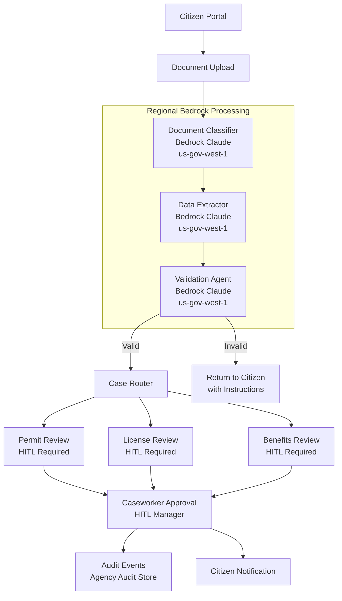

You will build a reference architecture for AI-assisted document intake, extraction, classification, and routing in a citizen-service portal. The example uses HITL review gates, audit events, region-selected Bedrock providers, content controls, and retry patterns that you can adapt to an agency's actual authorization boundary and policy.

Government requirements vary by jurisdiction, program, data classification, and system authorization. This tutorial therefore assumes an agency policy that requires a human to make final approval and denial decisions, regional processing within AWS GovCloud, and retained decision records. Validate those assumptions with your legal, privacy, accessibility, and security teams before implementation.

Next, you will set up that policy-driven architecture with regional provider routing and mandatory approval gates.

## Policy-Driven Architecture

The architecture applies the example policy at each stage: AI processing is routed to the selected GovCloud region, final case decisions require human approval, and HITL events are forwarded to an agency-managed audit store.


```mermaid
flowchart TB
    Citizen[Citizen Portal] --> Upload[Document Upload]
    Upload --> Classify[Document Classifier<br/>Bedrock Claude<br/>us-gov-west-1]
    Classify --> Extract[Data Extractor<br/>Bedrock Claude<br/>us-gov-west-1]
    Extract --> Validate[Validation Agent<br/>Bedrock Claude<br/>us-gov-west-1]

    Validate -->|Valid| Route[Case Router]
    Validate -->|Invalid| Return[Return to Citizen<br/>with Instructions]

    Route --> Permit[Permit Review<br/>HITL Required]
    Route --> License[License Review<br/>HITL Required]
    Route --> Benefits[Benefits Review<br/>HITL Required]

    Permit --> Approve[Caseworker Approval<br/>HITL Manager]
    License --> Approve
    Benefits --> Approve

    Approve --> Audit[Audit Events<br/>Agency Audit Store]
    Approve --> Notify[Citizen Notification]

    subgraph Regional[Regional Bedrock Processing]
        Classify
        Extract
        Validate
    end
```

The pipeline flows from citizen submission to automated classification, extraction, and validation, then routes to a review queue where a human caseworker makes the final decision. The three model-backed stages are configured for AWS Bedrock in `us-gov-west-1`. That region setting controls the Bedrock runtime endpoint; the complete data boundary also depends on storage, logs, networking, middleware providers, monitoring, and every other service in the request path.

Controls represented in the architecture:

- **Human decision gates.** The example policy sends approvals and denials through HITL confirmation.
- **Regional model routing.** Bedrock providers use the selected GovCloud region, subject to model availability and account access.
- **Audit events.** HITL events can be sent to an append-only or write-once store selected by the agency.
- **Content controls.** Deterministic filters and an in-boundary evaluation model can reduce PII exposure, but they require tested patterns and are not a complete data-loss-prevention system.

## Regional Provider Setup

When a system's authorization boundary requires a specific AWS region, NeuroLink's `AIProviderFactory` accepts a `region` parameter for the Bedrock runtime client.

```typescript
import { AIProviderFactory } from '@juspay/neurolink';

const bedrockModels = {
  fast: "anthropic.claude-haiku-4-5-20251001-v1:0",
  balanced: "anthropic.claude-sonnet-4-6",
  quality: "anthropic.claude-opus-4-6-v1",
} as const;

// All agents use Bedrock in the selected GovCloud region
const classifierAgent = await AIProviderFactory.createProvider(
  "bedrock",
  bedrockModels.fast,
  true,  // enableMCP
  undefined, // sdk
  "us-gov-west-1" // region
);

const extractorAgent = await AIProviderFactory.createProvider(
  "bedrock",
  bedrockModels.balanced,
  true,
  undefined,
  "us-gov-west-1"
);

const validatorAgent = await AIProviderFactory.createProvider(
  "bedrock",
  bedrockModels.quality,
  true,
  undefined,
  "us-gov-west-1"
);
```

Each agent in the pipeline uses a model suited to its task:

- **Classifier** uses the fast model -- classification is a quick decision that does not need heavy reasoning.
- **Extractor** uses the balanced model -- data extraction needs good comprehension but not maximum reasoning power.
- **Validator** uses the quality model -- validation requires the strongest reasoning to catch edge cases and inconsistencies.

Your startup health check should make an authenticated Bedrock request in the configured region. A local environment-variable check cannot establish that IAM roles, temporary credentials, model access, and regional endpoints are all usable.

> **Note:** The `region` parameter in `createProvider()` configures the AWS Bedrock runtime client for that region. Choose a GovCloud region supported by your deployment, and verify that the selected model is available there. Region selection is only one part of meeting your system's authorization and data-handling requirements.
{: .prompt-info }
> **Important:** AWS GovCloud can be one component of a FedRAMP authorization boundary; selecting it does not authorize the application. Determine the applicable FedRAMP path, assessment, documentation, and continuous-monitoring obligations with your authorizing stakeholders. AWS's authorizations do not automatically transfer to your system.
{: .prompt-warning }

## Mandatory HITL for Final Decisions

This reference policy prohibits the model from making a final citizen-impacting approval or denial. NeuroLink's `HITLManager` provides workflow primitives for enforcing review on the named actions. Whether a particular program also requires review for routing, escalation, or other actions must come from that program's governing requirements.

```typescript
import { HITLManager } from '@juspay/neurolink';

const govHITL = new HITLManager({
  enabled: true,
  dangerousActions: [
    "approve-permit",
    "deny-permit",
    "approve-license",
    "deny-license",
    "approve-benefits",
    "deny-benefits",
    "escalate-review",
  ],
  timeout: 604800000, // 7 days for caseworker response
  confirmationMethod: "event",
  allowArgumentModification: true, // Caseworkers can modify decisions
  autoApproveOnTimeout: false, // Keep this policy's decisions human-reviewed
  auditLogging: true, // Emit HITL audit events for the agency audit sink
  customRules: [
    {
      name: "benefits-denial",
      requiresConfirmation: true,
      condition: (toolName) => toolName.includes("deny"),
      customMessage: "Denial requires supervisor-level approval per agency policy.",
    },
    {
      name: "high-value-permit",
      requiresConfirmation: true,
      condition: (_toolName, args) => {
        const typedArgs = args as { estimatedValue?: number };
        return typedArgs?.estimatedValue !== undefined && typedArgs.estimatedValue > 100000;
      },
      customMessage: "High-value permit requires senior caseworker review.",
    },
  ],
});
```

Several settings implement the example policy:

**`autoApproveOnTimeout: false`** prevents a timeout from becoming an approval. In this design, an unanswered request is sent to the application's pending or escalation workflow rather than treated as a completed decision.

**`timeout: 604800000`** configures a seven-day response window. Replace it with the service-level target and escalation process that apply to your program.

**`allowArgumentModification: true`** allows an authorized reviewer to return modified tool arguments. The application must validate those modified values, enforce reviewer permissions, and persist the final approved arguments separately.

**`customRules`** encode local policy triggers. In this illustrative configuration, names containing `deny` require confirmation and permits above $100,000 trigger a second rule. The threshold and reviewer role are examples, not universal regulatory requirements.

### Comprehensive Audit Logging

With `auditLogging` enabled, the manager emits `hitl:audit` events that the application can persist in its approved audit store:

```typescript
const getCaseId = (value: unknown): string | undefined => {
  if (typeof value !== "object" || value === null || !("caseId" in value)) {
    return undefined;
  }

  const caseId = value.caseId;
  return typeof caseId === "string" ? caseId : undefined;
};

govHITL.on("hitl:audit", (auditLog) => {
  auditStore.append({
    ...auditLog,
    agency: process.env.AGENCY_CODE,
    caseId: getCaseId(auditLog.arguments),
  });
});

// Operational counters for this manager instance
const stats = govHITL.getStatistics();
// Returns: totalRequests, pendingRequests, approvedRequests,
// rejectedRequests, timedOutRequests, averageResponseTime
```

The `hitl:audit` event fires for confirmation requests, approvals, rejections, timeouts, and timeout auto-approvals. It also fires for a few non-case events with different payload shapes: `rule-evaluation-error` (emitted even when `auditLogging` is off), `configuration-updated`, and `manager-cleanup`. Filter on `auditLog.eventType` -- persisting only `confirmation-requested`/`confirmation-approved`/`confirmation-rejected`/`confirmation-timeout`/`confirmation-auto-approved` -- before writing case records, so the non-case events do not get stored as cases. Its typed payload includes the timestamp, event type, tool name, original arguments, and optional user, session, reason, and response-time fields. If your workflow permits argument modification, persist `modifiedArguments` separately when processing the response; the audit event records the request's original arguments.

The `getStatistics()` method returns in-process request, outcome, timeout, and average-response-time counters. These can inform an operations dashboard, but durable SLA or compliance reporting should use persisted records and account for process restarts and distributed instances.

> **Note:** If your agency's policy or authorization boundary requires tamper-resistant records, send these events to an append-only or write-once audit store with documented retention and access controls. Select the storage service and retention period from the requirements that apply to your system rather than treating one storage pattern as a universal government mandate.
{: .prompt-info }

## PII Guardrails for Citizen Data

Citizen records can contain Social Security numbers, dates of birth, account numbers, and document identifiers. Content middleware can provide defense in depth, but it is not a substitute for data minimization, field-level access control, encryption, approved logging, and a dedicated DLP policy.

```typescript
import { MiddlewareFactory } from '@juspay/neurolink';

const piiPatterns = [
  "\\b\\d{3}-\\d{2}-\\d{4}\\b", // US SSN with separators
  "\\b\\d{9}\\b",                // Review for false positives in your corpus
] as const;

const govMiddleware = new MiddlewareFactory({
  middlewareConfig: {
    guardrails: {
      enabled: true,
      config: {
        badWords: {
          enabled: true,
          regexPatterns: [...piiPatterns],
          replacementText: "[REDACTED]",
        },
        precallEvaluation: {
          enabled: true,
          provider: "bedrock",
          evaluationModel: bedrockModels.fast,
          actions: {
            onUnsafe: "block",
            onInappropriate: "sanitize",
          },
          sanitizationPatterns: [...piiPatterns],
          replacementText: "[REDACTED]",
        },
      },
    },
    analytics: {
      enabled: true,
    },
  },
});

const validation = govMiddleware.validateConfig({
  guardrails: {
    enabled: true,
    config: {
      badWords: {
        enabled: true,
        regexPatterns: [...piiPatterns],
      },
      precallEvaluation: {
        enabled: true,
        provider: "bedrock",
        evaluationModel: bedrockModels.fast,
      },
    },
  },
  analytics: { enabled: true },
});
```

The controls have important boundaries:

**Pre-call evaluation** sends the original user input to the configured evaluation model before an action such as block or sanitize is selected. Pinning it to Bedrock avoids the implementation's default Google AI evaluator. The evaluator creates its own Bedrock provider, so set `AWS_REGION=us-gov-west-1` in this deployment (or use a regional Bedrock model ARN) and verify the resulting route. `sanitizationPatterns` run only after the evaluator returns a result whose configured action is `sanitize`; they do not redact data before evaluation.

**Response and stream filtering** apply `badWords.regexPatterns` to model output and replace matches. With bad-word filtering enabled, contiguous streamed text is buffered before release so a match cannot bypass the filter by spanning chunks.

The two sample patterns are deliberately limited. A nine-digit expression can match legitimate identifiers, while many PII formats will not match either expression. Build and test patterns for the exact data formats in your service, prefer structured redaction before assembling a model prompt, and do not log raw middleware input or output.

The `analytics` middleware can track interaction usage. Review its captured fields and exporter destinations before enabling it for sensitive workloads.

## Structured Output for System Integration

Case-management integrations commonly need structured data rather than conversational prose. NeuroLink's structured-output mode requests JSON matching the supplied schema, after which the application should still validate business rules before writing to a downstream system.

```typescript
// Request schema-shaped JSON for system integration
const extractionResult = await neurolink.generate({
  input: {
    text: `Extract the following from this permit application:
    - applicant_name, address, permit_type, estimated_value, description

    Application text: ${applicationText}`,
  },
  provider: "bedrock",
  model: "anthropic.claude-sonnet-4-6",
  output: { format: "structured" },
  schema: PermitApplicationSchema,
});

const parsed = PermitApplicationSchema.safeParse(extractionResult.structuredData);
if (!parsed.success) {
  // Route to manual review -- the model did not return schema-valid JSON
}
// Apply business rules to parsed.data before writing it to the case management system
```

Structured output avoids parsing Markdown or conversational phrasing. Schema validation checks the JSON shape; separate application validation should confirm identifiers, permitted values, cross-field constraints, provenance, and reviewer requirements before mapping fields into a case-management record.

## Resilience for Critical Services

A citizen-service workflow should preserve a submitted request when an AI dependency fails. For errors classified as transient, the application can retry with backoff; exhausted or non-retryable failures should enter a durable manual-processing path and produce an operational signal.

```typescript
import { withRetry } from '@juspay/neurolink';

class AttemptTimeoutError extends Error {
  readonly code = "ETIMEDOUT";

  constructor(timeoutMs: number) {
    super(`Provider attempt exceeded ${timeoutMs}ms`);
    this.name = "AttemptTimeoutError";
  }
}

const isTransientProviderError = (error: Error): boolean => {
  const status = "status" in error && typeof error.status === "number"
    ? error.status
    : undefined;
  const code = "code" in error && typeof error.code === "string"
    ? error.code
    : undefined;

  return status === 429 ||
    (status !== undefined && status >= 500) ||
    code === "ETIMEDOUT" ||
    code === "ECONNRESET";
};

async function extractWithTimeout(timeoutMs: number) {
  const controller = new AbortController();
  const timeoutId = setTimeout(() => controller.abort(), timeoutMs);

  try {
    return await extractorAgent.generate({
      input: { text: documentText },
      abortSignal: controller.signal,
    });
  } catch (error) {
    if (controller.signal.aborted) {
      throw new AttemptTimeoutError(timeoutMs);
    }
    throw error;
  } finally {
    clearTimeout(timeoutId);
  }
}

const result = await withRetry(
  async () => {
    try {
      return await extractWithTimeout(30000);
    } catch (error) {
      alertOps(`Document extraction attempt failed: ${String(error)}`);
      throw error;
    }
  },
  {
    maxRetries: 5,
    baseDelayMs: 2000,
    maxDelayMs: 30000,
    shouldRetry: isTransientProviderError,
  }
);
```

This example makes the retry policy explicit:

**Up to five retries** are allowed after the initial attempt, but `shouldRetry` limits them to the sample's rate-limit, server, attempt-timeout, and reset conditions. Extend or narrow `isTransientProviderError()` for the exact Bedrock errors you observe; do not retry authentication, validation, or caller-cancellation failures.

**A 30-second per-attempt deadline** aborts the request through NeuroLink's public `abortSignal` option. The wrapper converts only its own fired deadline into `AttemptTimeoutError`, which is retryable; any other error from the call is rethrown as-is and does not match this sample's retry classifier. The `finally` block clears the timer whether the call succeeds or fails.

**Per-attempt alerting** reports each failed attempt. In a production system, aggregate or rate-limit these alerts so one incident does not flood responders.

**Exponential backoff** uses delays of 2s, 4s, 8s, 16s, and 30s before the retries. The `maxDelayMs` cap bounds the final interval.

> **Note:** Persist requests before calling the AI dependency. When retries are exhausted, route the durable request to manual processing or a dead-letter workflow with ownership, alerts, and replay controls. Choose retention and recovery objectives from the service's requirements.
{: .prompt-info }

## Deployment Considerations

### Multi-Environment Configuration

Government deployments typically span development, staging, and production environments. Each environment should use the same code but different configuration:

- **Development**: A commercial AWS region can reduce test friction, but use only synthetic, non-sensitive data and keep it outside any workflow that assumes the target authorization boundary.
- **Staging**: Use an environment inside the target authorization boundary to test credentials, network paths, logging destinations, and regional model access.
- **Production**: Use approved regional credentials and endpoints, production audit retention, and enforced HITL policy.

### Compliance Checklist

Before deploying AI-powered citizen services, verify:

- Every model-backed path, including guardrail evaluation, uses an approved regional endpoint.
- `autoApproveOnTimeout` is `false` wherever policy requires an affirmative human decision.
- HITL audit events are persisted with required retention, integrity, and access controls.
- PII controls have corpus-tested patterns, approved evaluator routing, and field-level redaction before prompt assembly where required.
- Retry policies classify transient errors and abort timed-out calls before starting another attempt.
- Health checks make authenticated regional requests and verify model access.
- Requests that exhaust retries enter a durable manual-processing or dead-letter workflow.

### Section 508 Accessibility

For systems subject to Section 508 or another accessibility standard, include generated content and review interfaces in accessibility testing. For example:

- AI-generated text can be read by screen readers.
- Structured output is presented in accessible HTML tables.
- Error messages from PII guardrails provide clear, accessible instructions to the citizen.
- All HITL interfaces for caseworkers meet WCAG 2.1 AA standards.

## What You Built

You built a policy-driven reference architecture with HITL gates for named decisions, Bedrock clients configured for a GovCloud region, HITL audit events for an agency-managed sink, layered content controls, and abort-aware retries. These components support a compliance program; they do not by themselves certify the application, guarantee a complete sovereignty boundary, or detect every form of PII. The same building blocks can be adapted to other reviewed workflows:

- AI Claims Processing for Insurance -- Similar HITL workflow patterns applied to insurance claims
- Real Estate Lease Abstraction with AI -- Document extraction patterns for property records and lease agreements
- [Enterprise Security Guide](/posts/enterprise-security-guide/) -- Advanced guardrails configuration for regulated industries

You now have the infrastructure to amplify caseworker capacity -- AI handles classification, extraction, and routing while humans focus on the complex decisions that require judgment.

---

**Related posts:**

- [Security Best Practices for AI Applications](/posts/enterprise-security-guide/)
- [Human-in-the-Loop (HITL) Security Guide for NeuroLink](/posts/hitl-guardrails-guide/)
- [Structured Output: JSON Schema Enforcement with NeuroLink](/posts/structured-output-json/)
