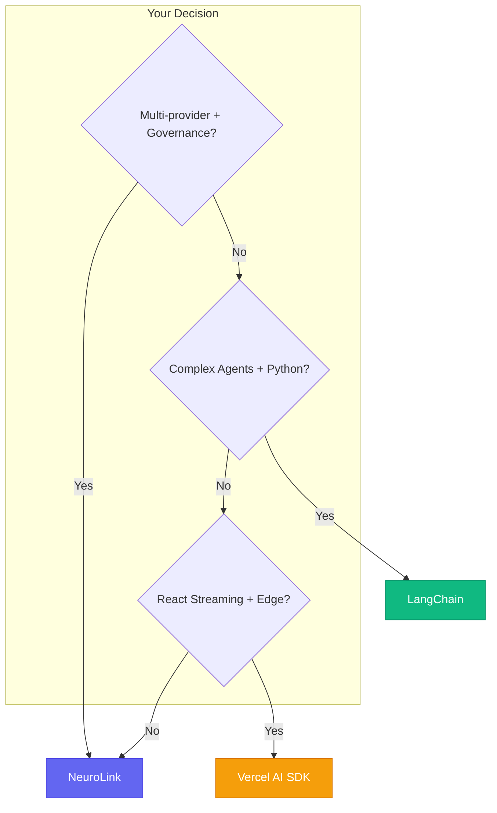
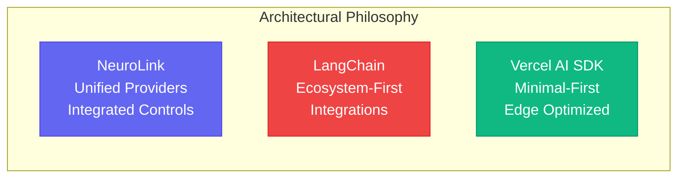

The choice between NeuroLink, LangChain, and Vercel AI SDK depends on your specific constraints -- and most comparison articles gloss over the trade-offs that actually matter.

These frameworks emphasize different workflows: NeuroLink offers a unified provider API with built-in governance features. LangChain provides composable building blocks with a broad ecosystem and agent focus. Vercel AI SDK emphasizes streaming and web-framework integration.

To be fair, we built NeuroLink. We are biased toward it. This source-checked comparison acknowledges where each alternative fits better. The code examples show API shape; the performance section provides measurement guidance rather than claiming benchmark results. You decide what matters for your project.



---

## Framework Philosophy Overview

Understanding each framework's origin explains its strengths.

### NeuroLink

| Aspect | Details |
|--------|---------|
| **Origin** | Built at Juspay |
| **Philosophy** | Unified provider API with built-in governance |
| **Language** | TypeScript-first (SDK + CLI) |
| **Focus** | Multi-provider access, HITL, guardrails, multimodal |
| **Version** | 12.x at the time of this review; check npm for the current release |

NeuroLink was built at Juspay to provide one TypeScript API for multiple AI providers and production controls.

### LangChain

| Aspect | Details |
|--------|---------|
| **Origin** | Open-source community project (Harrison Chase) |
| **Philosophy** | Composable chains and agents, extensive integrations |
| **Language** | Python-first (TypeScript port available) |
| **Focus** | Chains, agents, memory, retrieval, ecosystem |
| **Ecosystem** | LangSmith, LangServe, and community integrations |

LangChain popularized the "chain" abstraction and has a broad ecosystem for agent development and retrieval-augmented generation (RAG).

### Vercel AI SDK

| Aspect | Details |
|--------|---------|
| **Origin** | Vercel engineering team |
| **Philosophy** | Minimal, streaming-optimized, React-native |
| **Language** | TypeScript only |
| **Focus** | Frontend integration, streaming, edge deployment |
| **Bundle** | Depends on imported providers, framework adapters, and bundler output |

Vercel AI SDK prioritizes developer experience for web applications, with direct streaming and UI integrations for frameworks such as Next.js.

---

## Feature Comparison Matrix

### Provider Support

| Provider | NeuroLink | LangChain | Vercel AI SDK |
|----------|-----------|-----------|---------------|
| OpenAI | Native | Native | Native |
| Anthropic | Native | Native | Native |
| Google Vertex | Native | Native | Full official provider |
| AWS Bedrock | Native | Native | Full official provider |
| Azure OpenAI | Native | Native | Native |
| **OpenRouter** | **Native** | Community | Community provider |
| **LiteLLM Hub** | **Native** | Community | No |
| Ollama (Local) | Native | Native | Native |
| Custom Endpoints | Native | Native | Limited |
| **Provider approach** | Native providers, catalog providers, and OpenAI-compatible endpoints | First-party and community integration packages | Provider packages maintained across the AI SDK ecosystem |

**Key Insight**: NeuroLink combines named providers with a generic OpenAI-compatible adapter, which makes it useful when one application must switch across provider APIs.

### Enterprise Features

| Feature | NeuroLink | LangChain | Vercel AI SDK |
|---------|-----------|-----------|---------------|
| HITL Workflows | Built-in | Built-in | No |
| Guardrails/Filters | Built-in | Native middleware | No |
| PII Detection | Built-in | Built-in middleware | No |
| Audit Logging | Built-in | Manual | No |
| Redis Memory | Built-in | Via extension | No |
| Provider Failover | Built-in | Manual | No |
| Telemetry | OpenTelemetry | LangSmith | Vercel Analytics |
| Proxy Support | Full | Limited | No |

**Key Insight**: NeuroLink exposes HITL, middleware, observability, and fallback controls through one SDK. Other frameworks assemble comparable application behavior through their own middleware and integration patterns.

### Multimodal Support

| Format | NeuroLink | LangChain | Vercel AI SDK |
|--------|-----------|-----------|---------------|
| Images | Native | Native | Native |
| PDF (native) | Native | Via loader | Via Files API/preprocessing |
| CSV | Native | Via loader | No |
| Audio | Native | Limited | No |
| Video | Native | Limited | No |
| Office Docs | Native | Via loader | No |

**Key Insight**: NeuroLink accepts supported files directly in `generate()`. LangChain commonly separates loading from model invocation, while Vercel AI SDK file handling depends on the provider and input format.

### Developer Experience

| Feature | NeuroLink | LangChain | Vercel AI SDK |
|---------|-----------|-----------|---------------|
| TypeScript-First | Yes | Partial | Yes |
| Professional CLI | Yes | Basic | No |
| React Hooks | Exported from `@juspay/neurolink/client` | Available through LangChain's web ecosystem | **First-party UI package** |
| Next.js Integration | Use the client/server APIs | Available through framework integrations | **First-party examples and adapters** |
| Setup Wizard | Yes | No | No |
| Bundle Size | Measure your selected imports | Measure your selected packages | Measure your selected providers and adapters |
| API Surface | Broad integrated SDK | Broad modular ecosystem | Focused core with framework adapters |

**Key Insight**: Vercel AI SDK has particularly direct web-framework integrations, while LangChain provides deep ecosystem coverage and NeuroLink combines provider access with integrated operational controls.

> **Bundle Size Note:** Bundle size depends on which features you import, your bundler configuration, and tree-shaking. Measure your specific build.

---

## Code Comparison

Real code tells the truth. Here's how each framework handles common tasks.

### Task 1: Basic Text Generation

**NeuroLink:**

```typescript
import { NeuroLink } from "@juspay/neurolink";

const ai = new NeuroLink();
const result = await ai.generate({
  input: { text: "Explain quantum computing" },
  provider: "anthropic",
  model: 'claude-sonnet-5',
});
console.log(result.content);
```

**LangChain:**

```typescript
import { ChatAnthropic } from "@langchain/anthropic";

const model = new ChatAnthropic();
const result = await model.invoke("Explain quantum computing");
console.log(result.content);
```

**Vercel AI SDK:**

```typescript
import { generateText } from "ai";
import { anthropic } from "@ai-sdk/anthropic";

const { text } = await generateText({
  model: anthropic("claude-sonnet-5"),
  prompt: "Explain quantum computing"
});
console.log(text);
```

**Verdict**: All three handle basic generation cleanly. LangChain is slightly more concise for simple cases. NeuroLink's unified `generate()` becomes advantageous when switching providers.

### Task 2: Streaming Response

**NeuroLink:**

```typescript
import { NeuroLink } from "@juspay/neurolink";

const ai = new NeuroLink();
const result = await ai.stream({
  input: { text: "Write a story about a robot" },
  provider: "openai",
});

for await (const chunk of result.stream) {
  if ('content' in chunk) {
    process.stdout.write(chunk.content);
  }
}
```

**LangChain:**

```typescript
import { ChatOpenAI } from "@langchain/openai";

const chat = new ChatOpenAI({ streaming: true });
const stream = await chat.stream([
  ["human", "Write a story about a robot"]
]);

for await (const chunk of stream) {
  process.stdout.write(chunk.content);
}
```

**Vercel AI SDK:**

```typescript
import { streamText } from "ai";
import { openai } from "@ai-sdk/openai";

const result = await streamText({
  model: openai("gpt-5.4"),
  prompt: "Write a story about a robot"
});

for await (const chunk of result.textStream) {
  process.stdout.write(chunk);
}
```

**Verdict**: All three support streaming. Vercel AI SDK also provides UI integrations aimed at web application frontends.

### Task 3: Document Processing

**NeuroLink:**

```typescript
import { NeuroLink } from "@juspay/neurolink";

const ai = new NeuroLink();

// Built-in, one line
const result = await ai.generate({
  input: {
    text: "Summarize this document",
    files: ["report.pdf", "data.csv"]
  },
  provider: "vertex",
  model: 'gemini-2.5-flash',
});

console.log(result.content);
```

**LangChain:**

```typescript
import { PDFLoader } from "@langchain/community/document_loaders/fs/pdf";
import { CSVLoader } from "@langchain/community/document_loaders/fs/csv";
import { loadSummarizationChain } from "langchain/chains";

// Requires multiple steps
const pdfLoader = new PDFLoader("report.pdf");
const csvLoader = new CSVLoader("data.csv");

const pdfDocs = await pdfLoader.load();
const csvDocs = await csvLoader.load();
const allDocs = [...pdfDocs, ...csvDocs];

const chain = loadSummarizationChain(model, { type: "stuff" });
const result = await chain.call({ input_documents: allDocs });
```

**Vercel AI SDK:**

```typescript
import { generateText } from "ai";
import { extractTextFromPDF } from "./pdf-utils";  // Custom
import { parseCSV } from "./csv-utils";            // Custom

// Requires external document processing
const pdfText = await extractTextFromPDF("report.pdf");
const csvText = await parseCSV("data.csv");

const { text } = await generateText({
  model: openai("gpt-5.4"),
  prompt: `Summarize: ${pdfText}\n${csvText}`
});
```

**Verdict**: NeuroLink accepts supported file inputs directly in `generate()`. LangChain commonly uses explicit loaders, while Vercel AI SDK applications can use provider file inputs or preprocess content depending on the provider and format.

### Task 4: Enterprise Guardrails

**NeuroLink:**

```typescript
import { NeuroLink } from "@juspay/neurolink";

// NeuroLink with HITL for enterprise safety controls
const ai = new NeuroLink({
  hitl: {
    enabled: true,
    dangerousActions: ["delete", "execute", "modify"],
    timeout: 30000,
    allowArgumentModification: true
  },
  observability: {
    langfuse: {
      enabled: true,
      publicKey: process.env.LANGFUSE_PUBLIC_KEY!,
      secretKey: process.env.LANGFUSE_SECRET_KEY!,
      baseUrl: process.env.LANGFUSE_BASE_URL
    }
  }
});

// Built-in evaluation scores response quality; HITL gates configured tool actions
const result = await ai.generate({
  input: { text: userInput },
  provider: "anthropic",
  model: "claude-sonnet-5",
  enableEvaluation: true
});
```

**LangChain:**

```typescript
// Requires custom implementation or third-party
// No built-in guardrails - use callbacks/handlers
import { CallbackHandler } from "langchain/callbacks";

class CustomGuardrail extends CallbackHandler {
  async handleLLMStart(llm, prompts) {
    // Manual safety checking
    for (const prompt of prompts) {
      if (this.containsPII(prompt)) {
        throw new Error("PII detected");
      }
    }
  }
  // ... extensive manual implementation
}
```

**Vercel AI SDK:**

```typescript
// Not available
// Requires custom middleware in Next.js API routes
export async function POST(req) {
  const { prompt } = await req.json();

  // Manual safety check
  if (containsPII(prompt)) {
    return new Response("PII detected", { status: 400 });
  }

  // Continue with generation...
}
```

**Verdict**: NeuroLink includes HITL, evaluation, and middleware primitives in the SDK. The exact controls available in LangChain and Vercel AI SDK depend on the middleware, integrations, and application code you select.

---

## CLI Comparison

### NeuroLink CLI

```bash
npx @juspay/neurolink generate "Explain quantum computing" --provider anthropic

# Streaming output
npx @juspay/neurolink stream "Write a haiku" --provider openai

# Document processing
npx @juspay/neurolink generate "Summarize this" --pdf report.pdf --provider vertex

# Model listing
npx @juspay/neurolink models list --provider openrouter
```

### LangChain CLI

```bash
# Basic (langchain-cli package)
langchain app new my-app
langchain serve

# Limited generation capabilities
# Primarily for project scaffolding
```

### Vercel AI SDK

```bash
# No CLI available
# Uses Next.js/Vercel CLI for deployment
npx create-next-app@latest my-ai-app
```

**Verdict**: NeuroLink's CLI enables rapid prototyping and scripting. LangChain's CLI focuses on project setup. Vercel AI SDK relies on framework CLIs.

---

## Performance Benchmarks

> **Disclaimer:** This section presents **architectural comparisons only**, not absolute performance metrics. Framework performance depends heavily on your specific use case, network conditions, provider response latency, hardware, bundler configuration, and which features you import.
>
> **Do not use these comparisons for production decisions without measuring your actual implementation.** Always profile your code in your target environment.

### Architectural Characteristics

| Characteristic | NeuroLink | LangChain | Vercel AI SDK |
|--------|-----------|-----------|---------------|
| **Dependency Philosophy** | Targeted features | Extensive ecosystem | Minimal core |
| **Streaming Optimization** | Built-in | Via extensions | Streaming-focused core |
| **Setup Complexity** | Simple (wizard) | Moderate (manual config) | Simple (framework-integrated) |
| **Provider Switching** | Unified `provider` and `model` options per call | Provider-specific model instances | Select a provider model per call |

### Real-World Considerations

**Vercel AI SDK:**

- Minimal dependency philosophy results in smallest core footprint
- Optimized for edge deployments and client-side bundles
- Best for React/Next.js-only applications

**NeuroLink:**

- Balanced approach: enterprise features without excessive dependencies
- Designed for backend services and multi-provider scenarios
- Per-call provider and model selection reduces provider-specific application branching

**LangChain:**

- Extensive ecosystem provides value primarily when using integrations
- Significant benefits for agent systems and vector database integration
- Full footprint only needed when leveraging ecosystem components

### Why We Don't Include Specific Numbers

We intentionally avoid publishing specific benchmark numbers (e.g., "285KB bundle" or "45ms cold start") because:

1. **Bundle size varies dramatically** based on which features you import and tree-shaking effectiveness
2. **Performance is environment-specific** (varies by Node.js version, hardware, network conditions)
3. **Provider latency often dominates** end-to-end timing, so isolate framework overhead from model response time
4. **Bundler behavior differs** (Webpack, Vite, and esbuild optimize differently)
5. **Quick numbers become outdated** as frameworks update and dependencies change

### How to Measure Your Use Case

1. Install each framework minimally: `npm install [framework]`
2. Create a simple script using only the features you need
3. Run `npm run build` and examine the actual bundle output
4. Benchmark startup time in your target environment
5. Measure API latency (usually dominates SDK overhead)
6. Compare your measurements to provider response times

### Bundle Size Notes

When evaluating bundle sizes, consider:

- Which specific features you actually import
- Your bundler configuration and optimization settings
- Provider packages included in your dependencies
- Minification and compression during build
- Your application code size alongside framework size



---

## When to Choose Each

### Choose NeuroLink When

- **Enterprise deployment** that needs configurable governance controls and audit data
- **Multi-provider strategy** with failover needs
- **Document processing** is core to your use case
- **CLI-first development** workflow preferred
- **Configurable middleware guardrails** and HITL primitives required
- **TypeScript team** building backend services

**Ideal Use Cases:**

- Financial services document processing
- Healthcare AI with compliance needs
- Enterprise chatbots with governance
- Multi-model routing and optimization

### Choose LangChain When

- **Complex agent systems** with tool use
- **Extensive ecosystem integrations** (vector DBs, retrievers)
- **Python is primary** language
- **Research or academic** applications
- **RAG applications** with multiple retrievers
- **Community contributions** matter to you

**Ideal Use Cases:**

- Autonomous AI agents
- Research paper analysis
- Custom knowledge bases
- Academic experiments

### Choose Vercel AI SDK When

- **Next.js/React applications** primary focus
- **Streaming UI** is core requirement
- **Minimal, clean API** is priority
- **Already in Vercel ecosystem**
- **Frontend-first development**
- **Bundle size critical** (edge functions)

**Ideal Use Cases:**

- AI chatbots in web apps
- Streaming content generation
- Vercel-deployed applications
- Real-time AI interfaces

---

## Quick Decision Matrix

| If you need... | Choose |
|----------------|--------|
| OpenRouter access through the same SDK | **NeuroLink** |
| Native PDF/CSV processing | **NeuroLink** |
| Built-in HITL and Guardrails | **NeuroLink** |
| Complex agent chains | **LangChain** |
| Vector DB integrations | **LangChain** |
| Python ecosystem | **LangChain** |
| React streaming hooks | **Vercel AI SDK** |
| Smallest bundle size | **Vercel AI SDK** |
| Edge deployment | **Vercel AI SDK** |

---

## Migration Guides

### From LangChain to NeuroLink

```typescript
// Before (LangChain)
import { ChatOpenAI } from "@langchain/openai";
const model = new ChatOpenAI({ modelName: "gpt-4" });
const result = await model.invoke("Hello");
console.log(result.content);

// After (NeuroLink)
import { NeuroLink } from "@juspay/neurolink";
const ai = new NeuroLink();
const result = await ai.generate({
  input: { text: "Hello" },
  provider: "openai",
  model: "gpt-5.4",
});
console.log(result.content);
```

**Key Changes:**

- Replace provider-specific imports with unified NeuroLink
- Use `generate()` instead of `invoke()`
- Provider/model specified in config, not constructor

### From Vercel AI SDK to NeuroLink

```typescript
// Before (Vercel AI SDK)
import { generateText } from "ai";
import { openai } from "@ai-sdk/openai";

const { text } = await generateText({
  model: openai("gpt-5.4"),
  prompt: "Hello"
});

// After (NeuroLink)
import { NeuroLink } from "@juspay/neurolink";
const ai = new NeuroLink();

const { content } = await ai.generate({
  input: { text: "Hello" },
  provider: "openai",
  model: "gpt-5.4",
});
```

**Key Changes:**

- Single import instead of per-provider packages
- `content` instead of `text` for response
- Same provider task expressed through NeuroLink's unified call shape

---

## The Honest Summary

| Framework | Strengths | Weaknesses |
|-----------|-----------|------------|
| **NeuroLink** | Integrated controls, multi-provider API, files, CLI | Smaller community, newer ecosystem |
| **LangChain** | Ecosystem, agents, Python, community | Complexity, learning curve, bundle size |
| **Vercel AI SDK** | Streaming, UI integrations, focused core | Operational controls are assembled through application middleware and integrations |

## The Verdict

The evidence points to nuanced recommendations based on your specific constraints:

1. **Building TypeScript AI services with integrated controls?** NeuroLink combines a multi-provider API with HITL and observability primitives.
2. **Building agents or RAG systems in Python?** LangChain offers a broad ecosystem of components and integrations.
3. **Building web apps around streaming UI?** Vercel AI SDK provides first-party UI and framework integrations.

To be fair, all three are production-quality tools maintained by capable teams. The right choice depends on your primary language, team size, and production requirements.

```bash
# Try NeuroLink - setup wizard configures providers automatically
pnpm dlx @juspay/neurolink setup
```

### Related Resources

- OpenRouter Integration Guide - Use OpenRouter models through NeuroLink
- [Multimodal Processing Tutorial](/posts/multimodal-document-processing/) - PDF, CSV, documents
- [Full SDK API Reference](https://docs.neurolink.ink/sdk/api-reference/) - Complete documentation

---

*Last verified against NeuroLink v12 in September 2026. Competitor capabilities evolve independently, so confirm the current LangChain and Vercel AI SDK documentation before making a production decision. Found an error? [Open an issue](https://github.com/juspay/neurolink/issues).*

---

**Related posts:**

- [The AI SDK Landscape 2026: NeuroLink, Vercel AI SDK, LangChain, and More](/posts/ai-sdk-landscape-2026/)
- [The Future of AI SDKs: What's Next for Developer Tools](/posts/future-of-ai-sdks/)
- [What is NeuroLink? The Unified AI SDK Explained](/posts/what-is-neurolink-unified-sdk/)
