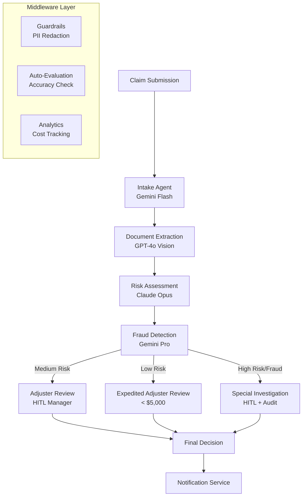

We designed NeuroLink's claims processing architecture around a constraint that single-model approaches cannot satisfy: each stage of the claims pipeline -- intake classification, document extraction, risk assessment, fraud detection -- benefits from fundamentally different AI capabilities. Fast classification needs a lightweight model. Document reading needs multimodal vision. Risk assessment needs deep reasoning. Fraud detection needs pattern matching at scale.

The design decision was to build a multi-agent pipeline where each stage uses the optimal model, with HITL approval gates for high-value claims and full audit logging for regulatory compliance. The trade-off is operational complexity: four models to manage instead of one. We chose this trade-off because the measurable improvement in processing accuracy and the reduction in false denials justify the additional infrastructure.

This deep dive covers the pipeline architecture, the model selection rationale for each stage, and the compliance patterns that satisfy insurance regulatory requirements.

## Claims Pipeline Architecture

The architecture uses four specialized agents, each running on a different model optimized for its task. A middleware layer provides PII protection, auto-evaluation, and cost tracking across all agents.



The pipeline flow is deliberate in its model selection:

- **Intake Agent** uses Gemini Flash -- classification is a quick decision that benefits from speed and low cost. Is this an auto claim, home claim, health claim, or liability claim? Flash handles this in milliseconds.
- **Document Extraction** uses GPT-4o -- multimodal vision capability is essential for reading uploaded photos of damage, medical bills, repair estimates, and police reports.
- **Risk Assessment** uses Claude Opus -- complex reasoning is needed to evaluate claim validity, assess damage severity, cross-reference policy coverage, and determine the appropriate payout range.
- **Fraud Detection** uses Gemini Pro -- balanced performance for pattern matching against known fraud indicators, inconsistency detection in claim narratives, and comparison with historical claims data.

## Agent Setup with Provider Factory

NeuroLink's `AIProviderFactory` creates each agent with the optimal model for its task. The `ModelConfigurationManager` provides tier-based model selection so you can reference logical tiers (fast, balanced, quality) rather than hardcoding model names.

```typescript
import { AIProviderFactory } from '@juspay/neurolink';
import { ModelConfigurationManager } from '@juspay/neurolink';

const modelConfig = ModelConfigurationManager.getInstance();

// Intake agent - fast classification
const intakeAgent = await AIProviderFactory.createProvider(
  "google-ai",
  modelConfig.getModelForTier("google-ai", "fast") // gemini-2.5-flash
);

// Document extraction - multimodal
const docAgent = await AIProviderFactory.createProvider(
  "openai",
  "gpt-4o" // Vision-capable
);

// Risk assessment - quality reasoning
const riskAgent = await AIProviderFactory.createProvider(
  "bedrock",
  modelConfig.getModelForTier("bedrock", "quality") // claude-3-opus
);

// Fraud detection with fallback
const { primary: fraudAgent, fallback: fraudFallback } =
  await AIProviderFactory.createProviderWithFallback(
    "vertex", // Primary: Vertex Gemini
    "openai",        // Fallback: OpenAI
    null,            // Default model per provider
    true             // Enable MCP
  );
```

The fraud detection agent uses `createProviderWithFallback()` because fraud detection is the most critical gate in the pipeline. If the primary provider (Vertex) is experiencing an outage, the system automatically falls back to OpenAI rather than blocking all claims. A 2-hour fraud detection outage during a catastrophic weather event could mean thousands of delayed claims.

The tier-based model selection (`getModelForTier()`) decouples your code from specific model names. When Google releases Gemini 2.5 Flash as an upgrade from 2.0 Flash, you update the model configuration once rather than searching for every hardcoded model reference.

> **Note:** Use `isProviderAvailable()` at application startup to verify that all required provider credentials are configured. A missing API key should be caught at deploy time, not when a policyholder submits a claim. Build this check into your CI/CD pipeline and health check endpoints.
{: .prompt-info }

## HITL for Claims Approval

Insurance regulations in most jurisdictions require human oversight for claim denials and high-value approvals. The HITL Manager implements these requirements as configurable rules that map directly to your compliance policies.

```typescript
import { HITLManager } from '@juspay/neurolink';

const claimsHITL = new HITLManager({
  enabled: true,
  dangerousActions: [
    "approve-claim",
    "deny-claim",
    "flag-fraud",
    "escalate-siu",
  ],
  timeout: 300000, // 5 minutes for adjuster response
  confirmationMethod: "event",
  allowArgumentModification: true, // Adjusters can modify payout amounts
  autoApproveOnTimeout: false, // Never auto-approve claims
  auditLogging: true,
  customRules: [
    {
      name: "all-claims-review",
      requiresConfirmation: true,
      condition: () => true, // All claim approvals require adjuster review
      customMessage: "Claim approval requires licensed adjuster review.",
    },
    {
      name: "fraud-flag",
      requiresConfirmation: true,
      condition: (_toolName, args) => {
        const typedArgs = args as { fraudScore?: number };
        return typedArgs?.fraudScore !== undefined && typedArgs.fraudScore > 0.7;
      },
      customMessage: "Potential fraud detected. SIU review required.",
    },
  ],
});
```

The HITL configuration implements a tiered approval system:

**Low-risk claims under $5,000** with no fraud indicators are prioritized for expedited adjuster review. The AI pre-fills the approval form and highlights key findings, reducing review time from 30 minutes to under 5 minutes.

**Medium-risk claims above $5,000** require adjuster review. The `high-value-claim` custom rule intercepts any approval over $5,000 and routes it to the adjuster dashboard. The adjuster sees the AI's recommendation along with all supporting data and can approve, deny, or modify the payout amount.

**High-risk and fraud-flagged claims** route to the Special Investigations Unit. The `fraud-flag` rule triggers when the fraud detection agent assigns a score above 0.7. These cases require thorough investigation and multiple levels of approval.

### Processing Adjuster Decisions

The event-driven HITL workflow integrates with your adjuster dashboard:

```typescript
// Process adjuster decision
claimsHITL.on("hitl:confirmation-request", (event) => {
  adjusterDashboard.notify({
    claimId: event.payload.arguments.claimId,
    action: event.payload.actionType,
    aiRecommendation: event.payload.arguments,
    confirmationId: event.payload.confirmationId,
    timeout: event.payload.timeoutMs,
  });
});

// Adjuster responds
claimsHITL.processUserResponse(confirmationId, {
  approved: true,
  reason: "Verified damage photos match claim description",
  modifiedArguments: { approvedAmount: 4500 }, // Adjusted payout
  userId: adjusterId,
});
```

The `allowArgumentModification: true` setting is crucial for insurance workflows. The AI might recommend approving a claim for $6,200 based on the repair estimate, but the adjuster determines that the policy deductible reduces the payout to $4,500. The adjuster approves with modified arguments, and the audit trail captures both the original AI recommendation and the adjuster's modification.

Every HITL decision is logged in the audit trail with the adjuster's identity, their reason, the original AI recommendation, and any modifications. This audit trail satisfies state insurance commission requirements for decision documentation.

```typescript
// Monitor HITL statistics for SLA compliance
const stats = claimsHITL.getStatistics();
console.log(`Pending reviews: ${stats.pendingRequests}`);
console.log(`Avg response time: ${stats.averageResponseTime}ms`);
console.log(`Approval rate: ${(stats.approvedRequests / stats.totalRequests * 100).toFixed(1)}%`);
```

> **Note:** The `autoApproveOnTimeout: false` setting is critical for insurance compliance. If an adjuster does not respond within the timeout period, the claim stays pending rather than being auto-approved or auto-denied. Claims should never time out into a decision -- they should time out into an escalation queue for management attention.
{: .prompt-info }
> **Regulatory Note:** Many US states require licensed adjusters to review and approve all claim payments regardless of amount. Auto-approval thresholds must comply with your state insurance commission's regulations. This example shows AI-assisted review, not autonomous approval.
{: .prompt-warning }

## Guardrails for PII Protection

Insurance claims contain highly sensitive data: Social Security numbers, medical records, bank account information, and personal injury details. PII must be blocked from entering or leaving the AI pipeline.

```typescript
import { MiddlewareFactory } from '@juspay/neurolink';

const claimsMiddleware = new MiddlewareFactory({
  middlewareConfig: {
    guardrails: {
      enabled: true,
      config: {
        badWords: ["social security", "ssn", "credit card number"],
        precallEvaluation: {
          enabled: true,
        },
      },
    },
    analytics: {
      enabled: true,
    },
  },
});
```

The guardrails middleware operates at three levels:

**Precall evaluation** scans prompts before they reach any LLM provider. If a prompt contains a Social Security number pattern or credit card number, the middleware blocks the request. This prevents PII from being sent to external AI providers, regardless of which agent in the pipeline is processing the claim.

**Response filtering** scans LLM responses for PII patterns. Even if a previous conversation turn inadvertently included PII in the context, the response filter catches and redacts it before it reaches your application.

**Stream filtering** applies PII detection to streaming responses in real-time via the `wrapStream` transform. This ensures PII never appears in streaming output, even for a single chunk.

The analytics middleware tracks cost per claim for ROI analysis. By tagging each generation call with the claim ID, you can calculate the exact AI processing cost for every claim in your portfolio.

## Evaluation for Quality Assurance

Claims processing accuracy directly impacts both policyholders and the carrier's bottom line. Overestimated claims cost money. Underestimated claims lead to appeals and lawsuits. Auto-evaluation provides a quality gate that catches inaccurate assessments before they reach the adjuster.

```typescript
import { generateEvaluation } from '@juspay/neurolink';

const qaCheck = await generateEvaluation({
  userQuery: `Assess claim #${claimId}: ${claimDescription}`,
  aiResponse: riskAssessmentOutput,
  primaryDomain: "insurance",
  toolUsage: [
    { toolName: "document-extraction", result: docExtractionResult },
    { toolName: "fraud-check", result: fraudCheckResult },
  ],
});

if (qaCheck.accuracy < 7 || qaCheck.completeness < 7) {
  // Re-run with quality-tier model
  const qualityAgent = await AIProviderFactory.createProvider(
    "bedrock",
    modelConfig.getModelForTier("bedrock", "quality")
  );
  // Re-assess with stronger model
}
```

The `primaryDomain: "insurance"` parameter triggers domain-specific evaluation criteria. Instead of generic accuracy and completeness scores, the evaluation considers insurance-specific factors:

- **Domain alignment**: Does the assessment use correct insurance terminology and concepts?
- **Terminology accuracy**: Are coverage types, deductibles, and policy limits referenced correctly?
- **Tool usage quality**: Did the extraction agent capture all relevant document fields? Did the fraud check consider all relevant indicators?

The quality gate pattern is straightforward: if evaluation scores fall below a threshold (7 out of 10 in this example), the claim is re-assessed with a higher-tier model. This catches cases where the balanced-tier model misses a nuanced coverage detail or misinterprets a complex damage assessment.

## Resilience and Cost Management

Claims processing volumes are spiky. A major weather event can increase claim submissions 10-100x overnight. The pipeline needs resilience patterns that handle both normal load and catastrophic surges.

```typescript
import { withRetry, CircuitBreaker, RateLimiter } from '@juspay/neurolink';

// Circuit breaker per provider
const bedrockBreaker = new CircuitBreaker(5, 60000);

// Rate limiter for API budgeting
const apiLimiter = new RateLimiter(50, 60000); // 50 claims/minute

async function processClaimWithResilience(claim) {
  await apiLimiter.acquire();
  return bedrockBreaker.execute(() =>
    withRetry(
      () => riskAgent.generate({ input: { text: claim.description } }),
      { maxAttempts: 3, initialDelay: 2000, maxDelay: 15000 }
    )
  );
}
```

Three resilience patterns work together:

**Rate limiting** prevents API budget overruns. At 50 claims per minute, even a catastrophic event's worth of submissions will be processed at a controlled rate. Claims beyond the limit queue for processing rather than being rejected. This is especially important during natural disasters when API costs could spike to tens of thousands of dollars in hours.

**Circuit breaking** prevents cascading failures. If Bedrock experiences an outage, the circuit breaker opens after 5 consecutive failures and stops sending requests for 60 seconds. This prevents your application from accumulating connection timeouts and gives the provider time to recover.

**Retry with backoff** handles transient errors. A single timeout or 503 error does not fail the claim -- the system retries with exponential backoff (2s, 4s, 8s, up to 15s). Three attempts are usually sufficient for transient issues.

### Cost Tracking

Cost tracking via `ModelConfigurationManager.getCostInfo()` enables per-claim cost reporting:

```typescript
// Track cost per claim
const costInfo = modelConfig.getCostInfo("gpt-4o");
const estimatedCost = (inputTokens * costInfo.inputCostPer1k / 1000) +
                      (outputTokens * costInfo.outputCostPer1k / 1000);

claimCostTracker.record(claimId, {
  stage: "document-extraction",
  model: "gpt-4o",
  tokens: { input: inputTokens, output: outputTokens },
  cost: estimatedCost,
});
```

Per-claim cost tracking enables ROI analysis: if the average AI processing cost per claim is $0.15 and the average manual processing cost was $45, the ROI is clear. It also helps identify claims that are unusually expensive to process (complex multi-document claims, lengthy narratives) and may need workflow optimization.

## Deployment and Compliance

### Audit Trail Requirements

State insurance commissions require detailed records of all claim decisions. The HITL audit trail captures:

- **Timestamp** of every decision event
- **User ID** of the adjuster who made the decision
- **Reason** provided for the decision
- **Modified arguments** if the adjuster changed the AI's recommendation
- **AI recommendation** for comparison with the human decision
- **Processing time** from submission to decision

This audit trail satisfies requirements for most US state insurance commissions. For specific state requirements, consult your compliance team and extend the audit log with additional fields as needed.

### Data Residency

For carriers with data residency requirements, use the region parameter in the provider factory:

```typescript
const riskAgent = await AIProviderFactory.createProvider(
  "bedrock",
  "claude-3-opus",
  true,
  undefined,
  "us-east-1" // Data stays in US East region
);
```

This ensures that policyholder data never leaves the specified AWS region, satisfying data residency requirements for carriers operating in jurisdictions with data sovereignty laws.

### Monitoring and SLA Tracking

The `claimsHITL.getStatistics()` method provides real-time metrics for operational dashboards:

- **Pending requests**: How many claims are waiting for adjuster review?
- **Average response time**: Are adjusters meeting their SLA for review turnaround?
- **Approval rate**: Is the approval/denial ratio within expected bounds?
- **Timeout rate**: Are too many claims timing out, indicating understaffing?

These metrics feed directly into operational dashboards and alert systems. A spike in pending requests might trigger a staffing alert. A drop in approval rate might indicate a policy change that needs investigation.

## Design Decisions and What Comes Next

We chose multi-agent orchestration over a single monolithic model because claims processing has fundamentally different accuracy requirements at each stage. The triage agent needs speed; the risk assessment agent needs reasoning depth; the extraction agent needs structured output precision. Forcing one model to handle all three produces mediocre results at every stage.

The HITL approval workflow introduces latency -- adjuster review adds minutes to hours of processing time. We accepted this trade-off because the cost of an incorrect payout decision far exceeds the cost of waiting for human review. The timeout mechanism with configurable escalation paths ensures that no claim sits in limbo indefinitely.

To continue building on these patterns:

- [Compliant AI for Government](/posts/compliant-ai-citizen-services-government/) -- Similar HITL patterns for public sector document processing
- **Real Estate Document Processing** -- Document extraction patterns for property records and lease abstraction
- **Middleware Deep Dive** -- Advanced guardrails configuration and custom middleware development

---

**Related posts:**

- [Compliant AI Citizen Services: Document Processing with HITL for Government](/posts/compliant-ai-citizen-services-government/)
- [Security Best Practices for AI Applications](/posts/enterprise-security-guide/)
- [AI Recruitment Pipeline: Resume Screening to Interview Scheduling](/posts/ai-recruitment-pipeline/)
