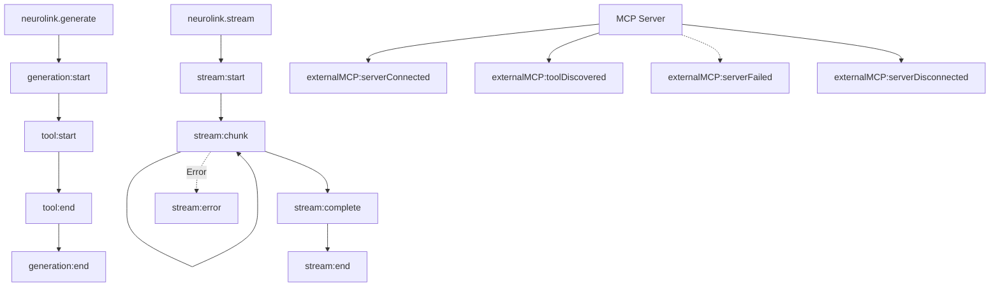

We built NeuroLink's event system to solve an observability problem that request-response logging cannot: understanding what happens inside a multi-step AI pipeline. When a generation triggers three tool calls, each taking different durations, followed by a streaming response, you need visibility into every stage -- not just the final result.

The design decision was to build on Node.js `EventEmitter` with typed events via `TypedEventEmitter<NeuroLinkEvents>`. We chose this over external observability infrastructure because events fire synchronously at every lifecycle stage with zero network overhead. The trade-off is that event handlers run in-process and must be non-blocking. The payoff is compile-time safety for event names and handler signatures, with IDE autocompletion for every event you subscribe to.

This deep dive covers the event architecture, every event category, real-time dashboard patterns, and best practices for production event handler management.

## Event System Architecture

NeuroLink's event system covers three pipelines: generation, streaming, and MCP connections. Each pipeline emits lifecycle events that your handlers can consume.



The `TypedEventEmitter<NeuroLinkEvents>` interface provides the standard EventEmitter methods with type safety: `on()`, `off()`, `emit()`, `removeAllListeners()`, `listenerCount()`, and `listeners()`.

Events are synchronous by default, following Node.js EventEmitter behavior. When an event fires, all registered handlers execute in the order they were registered, before the next line of code continues. This means event handlers should be fast -- heavy processing should be queued for async execution rather than blocking the pipeline.

The event map is extensible: the `[key: string]: unknown` index signature allows custom event names beyond the built-in set. This lets you define application-specific events without modifying the SDK.


## Event Categories

### Generation Events

Generation events bracket the `neurolink.generate()` call, providing timing and metadata for every AI generation.

```typescript
import { NeuroLink } from '@juspay/neurolink';

const neurolink = new NeuroLink();

neurolink.on("generation:start", (data) => {
  console.log("Generation started:", data);
});

neurolink.on("generation:end", (data) => {
  console.log("Generation completed:", data);
});

const result = await neurolink.generate({
  input: { text: "Hello world" },
  provider: "google-ai",
});
```

The `generation:start` event fires when a generate call begins. The payload includes the provider, model, and input metadata. This is useful for logging which model handles each request and tracking generation frequency.

The `generation:end` event fires when generation completes, whether successfully or with an error. The payload includes the response time, token usage, and success status. This is the primary event for latency tracking and cost monitoring.

### Stream Events

Streaming events provide fine-grained visibility into the stream lifecycle, from initiation through every chunk to completion or error.

```typescript
neurolink.on("stream:start", (data) => {
  console.log("Stream initiated");
});

neurolink.on("stream:chunk", (chunk) => {
  // Fires for every chunk received
  process.stdout.write(chunk.content || "");
});

neurolink.on("stream:complete", (data) => {
  console.log("Stream finished:", data);
});

neurolink.on("stream:error", (error) => {
  console.error("Stream failed:", error);
});

const result = await neurolink.stream({
  input: { text: "Write a story" },
  provider: "google-ai",
});
```

The `StreamEvent` type provides a structured payload: `{ type, content?, metadata?, timestamp }`. Four events cover the full stream lifecycle:

- **`stream:start`** fires once when the stream is initiated.
- **`stream:chunk`** fires for every received chunk. This is a high-frequency event -- a typical streaming response might produce 50-200 chunk events.
- **`stream:complete`** fires when all chunks have been received and the stream ends normally.
- **`stream:error`** fires if the stream encounters an error (network failure, provider error, timeout).

> **Note:** The `stream:chunk` event fires at high frequency during active streams. If your handler performs expensive operations (database writes, HTTP calls), batch the chunks and process them periodically rather than on every event. A common pattern is to buffer chunks for 100ms and flush the buffer as a batch.
{: .prompt-info }

### Tool Events

Tool events track the execution of tools called by the AI model during generation. These are essential for debugging tool selection, measuring tool performance, and building audit trails.

```typescript
neurolink.on("tool:start", (data) => {
  console.log(`Tool invoked: ${data.toolName}`);
});

neurolink.on("tool:end", (data) => {
  console.log(`Tool completed: ${data.toolName} in ${data.executionTime}ms`);
});
```

The `tool:end` payload includes the tool name, execution time in milliseconds, success status, the result (if successful), and the error (if failed). This gives you complete visibility into every tool call:

- Which tools does the model call most frequently?
- Which tools are slow and might need optimization?
- Which tools fail often and might need better error handling?
- What results is the model receiving from tools?

Tool events also integrate with the circuit breaker. Failed tools are tracked via `toolCircuitBreakers`, and repeated failures can trigger automatic circuit breaking for specific tools.

### MCP Events

MCP events monitor the lifecycle of external MCP server connections: connections, disconnections, tool discovery, and failures.

```typescript
neurolink.on("externalMCP:serverConnected", (data) => {
  console.log(`MCP server connected: ${data.serverName}`);
});

neurolink.on("externalMCP:toolDiscovered", (data) => {
  console.log(`New tool discovered: ${data.toolName}`);
});

neurolink.on("externalMCP:serverFailed", (data) => {
  console.error(`MCP server failed: ${data.serverName}`, data.error);
});
```

The full set of MCP events covers the complete server lifecycle:

- **`externalMCP:serverConnected`** -- An MCP server has successfully connected and is available for tool calls.
- **`externalMCP:serverDisconnected`** -- An MCP server has disconnected (graceful shutdown or connection loss).
- **`externalMCP:serverFailed`** -- An MCP server connection attempt failed.
- **`externalMCP:toolDiscovered`** -- A new tool has been discovered on a connected MCP server.
- **`externalMCP:toolRemoved`** -- A tool is no longer available (server disconnected or tool unregistered).
- **`externalMCP:serverAdded`** / **`externalMCP:serverRemoved`** -- Server configuration has been added or removed.

These events are critical for monitoring the health of your MCP infrastructure. If a tool server goes down, you want to know immediately -- not when a user's request fails because the tool is unavailable.

## Building a Real-Time Dashboard

Combining all event categories, you can build a real-time operational dashboard with minimal code:

```typescript
import { NeuroLink } from '@juspay/neurolink';

const neurolink = new NeuroLink();

// Metrics collector
const metrics = {
  totalGenerations: 0,
  totalStreams: 0,
  totalErrors: 0,
  avgResponseTime: 0,
  responseTimes: [] as number[],
  activeStreams: 0,
  toolUsage: new Map<string, number>(),
};

// Generation tracking
neurolink.on("generation:start", () => {
  metrics.totalGenerations++;
});

neurolink.on("generation:end", (data: any) => {
  if (data?.responseTime) {
    metrics.responseTimes.push(data.responseTime);
    metrics.avgResponseTime =
      metrics.responseTimes.reduce((a, b) => a + b, 0) /
      metrics.responseTimes.length;
  }
});

// Stream tracking
neurolink.on("stream:start", () => {
  metrics.totalStreams++;
  metrics.activeStreams++;
});

neurolink.on("stream:end", () => {
  metrics.activeStreams--;
});

// Error tracking
neurolink.on("stream:error", () => {
  metrics.totalErrors++;
});

neurolink.on("error", () => {
  metrics.totalErrors++;
});

// Tool tracking
neurolink.on("tool:end", (data: any) => {
  const count = metrics.toolUsage.get(data?.toolName) || 0;
  metrics.toolUsage.set(data?.toolName, count + 1);
});

// Periodic dashboard output
setInterval(() => {
  console.log("=== AI Dashboard ===");
  console.log(`Generations: ${metrics.totalGenerations}`);
  console.log(`Active streams: ${metrics.activeStreams}`);
  console.log(`Avg response: ${metrics.avgResponseTime.toFixed(0)}ms`);
  console.log(`Errors: ${metrics.totalErrors}`);
  console.log(`Tools:`, Object.fromEntries(metrics.toolUsage));
}, 10000);
```

This dashboard provides five key operational metrics:

1. **Total generations** -- How many AI requests have been processed? Useful for volume tracking and capacity planning.
2. **Active streams** -- How many streams are currently in progress? A sudden spike might indicate a resource leak.
3. **Average response time** -- How long do generations take on average? Increasing latency might indicate provider issues or prompt complexity growth.
4. **Error count** -- How many errors have occurred? A rising error rate triggers investigation.
5. **Tool usage** -- Which tools are called most frequently? This reveals AI behavior patterns and helps optimize the tool set.

In production, replace the console output with a metrics export to your observability platform (Datadog, Grafana, CloudWatch). The event handlers remain the same; only the sink changes.

## Event-Driven Logging

Structured logging with events produces machine-parseable log entries that integrate with any logging infrastructure:

```typescript
import { NeuroLink } from '@juspay/neurolink';

const neurolink = new NeuroLink();

// Structured logging for all events
neurolink.on("log-event", (event) => {
  const logEntry = {
    timestamp: new Date().toISOString(),
    ...event,
  };
  // Send to your logging infrastructure
  console.log(JSON.stringify(logEntry));
});

// Error alerting
neurolink.on("error", (error) => {
  // Send to error tracking (Sentry, Datadog, etc.)
  sendToErrorTracker({
    message: error.message,
    stack: error.stack,
    context: { sdk: "neurolink" },
  });
});
```

The `log-event` is a general-purpose event that the SDK emits for significant internal activities. It produces structured JSON entries that can be parsed by any log aggregation tool: CloudWatch Logs, Datadog Logs, Elasticsearch, or Splunk.

The `error` event captures SDK-level errors that are not associated with a specific generation or stream. This includes initialization failures, configuration errors, and unexpected internal exceptions. Routing these to an error tracking service like Sentry ensures that SDK-level issues get the same attention as application-level errors.

> **Note:** Log events are structured JSON by design. Avoid converting them to formatted strings -- the JSON format is what makes them searchable and aggregatable in log analysis tools. Store the raw JSON and use your logging platform's query capabilities for analysis.
{: .prompt-info }

## Listener Management

Proper listener management prevents memory leaks and ensures clean application shutdown.

```typescript
// Add a listener
const handler = (data: unknown) => console.log(data);
neurolink.on("generation:end", handler);

// Remove a specific listener
neurolink.off("generation:end", handler);

// Remove all listeners for an event
neurolink.removeAllListeners("generation:end");

// Check listener count
const count = neurolink.listenerCount("generation:end");

// Get all listeners
const listeners = neurolink.listeners("generation:end");
```

Four rules for listener management:

**Always store handler references.** When you call `neurolink.on("event", handler)`, store the `handler` reference so you can remove it later with `neurolink.off("event", handler)`. Anonymous functions cannot be removed.

**Clean up in application shutdown.** Use `removeAllListeners()` in your graceful shutdown handler to prevent event handlers from firing during teardown. This is especially important for handlers that write to external systems (databases, metrics services) that may already be shutting down.

**Monitor listener counts.** If `listenerCount()` grows unboundedly, you have a listener leak. This typically happens when code in a request handler registers a listener without removing it, causing one new listener per request.

**Be selective with high-frequency events.** The `stream:chunk` event fires many times per stream. If you have 100 concurrent streams and each produces 100 chunks, that is 10,000 chunk events per second. Make sure your handler can keep up or batch the events.

## Best Practices

**Keep event handlers fast.** Event handlers execute synchronously on the main thread. A handler that takes 100ms to execute adds 100ms to every generation that fires that event. If you need to do heavy processing (database writes, HTTP requests, complex calculations), push the work to an async queue:

```typescript
neurolink.on("generation:end", (data) => {
  // Fast: just queue the work
  metricsQueue.push(data);
  // Do not: await db.insert(data) -- this blocks the pipeline
});
```

**Never throw in event handlers.** An uncaught exception in an event handler can crash the Node.js process. Always wrap handler bodies in try-catch:

```typescript
neurolink.on("tool:end", (data) => {
  try {
    recordToolMetric(data);
  } catch (error) {
    console.error("Metric recording failed:", error);
    // Swallow the error -- do not crash the process
  }
});
```

**Use `listenerCount()` in tests.** Verify that handlers are registered correctly in your test setup and removed correctly in your test teardown. Listener leaks in tests cause mysterious failures in subsequent test cases.

**Consider batching for external systems.** If you are sending events to Datadog, CloudWatch, or Elasticsearch, batch them rather than sending one HTTP request per event. Most observability platforms have batch APIs that are both more efficient and cheaper.

**Test with `stream:chunk` volume.** The stream chunk event can fire hundreds of times per request. Load test your event handlers under realistic stream volumes to ensure they do not become a bottleneck.

## Design Decisions and Trade-offs

We built the event system on Node.js's standard `EventEmitter` rather than introducing a custom pub/sub mechanism. This means zero learning curve for developers who already know Node.js, but it also means in-process only -- events do not cross process boundaries without explicit bridging to an external message bus.

The `TypedEventEmitter` wrapper adds compile-time safety at the cost of slightly more complex type definitions. We made this trade-off because runtime handler signature mismatches are notoriously difficult to debug -- a handler receiving the wrong event payload shape silently produces incorrect metrics rather than throwing an obvious error.

Start with logging events for debugging, add metrics for operational dashboards, then build reactive workflows that respond to tool failures, stream errors, and MCP disconnections in real-time.

- Event-Driven AI Architecture -- Build reactive AI systems using events as the foundation
- [MCP Server Tutorial](/posts/mcp-server-tutorial/) -- Build custom tools and monitor them with MCP events
- **Configuration Deep Dive** -- Tune the SDK configuration that affects event behavior

---

**Related posts:**

- [AI Observability: Monitoring LLM Applications in Production](/posts/monitoring-observability/)
- [Building Webhook Handlers with NeuroLink AI Processing](/posts/webhook-integrations/)
- [MCP Server Tutorial: Build Your Own AI Tools in 30 Minutes](/posts/mcp-server-tutorial/)
