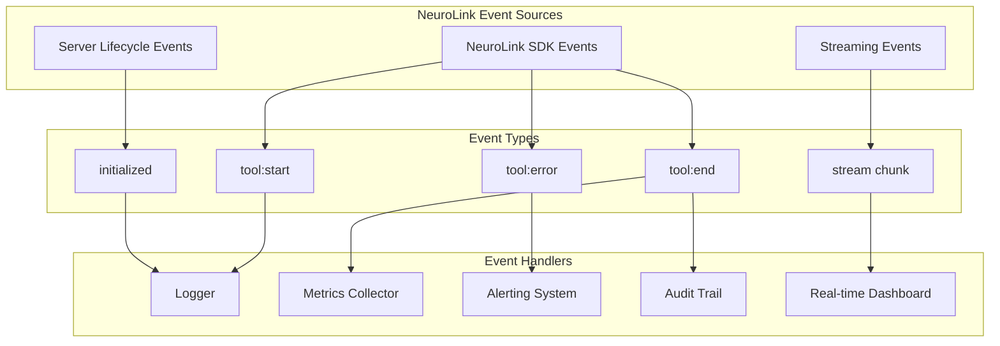

We designed NeuroLink's event-driven architecture around a core insight: AI operations are inherently multi-step and asynchronous, and treating them as simple request-response calls hides the information you need for production observability.

The architecture decision was to emit typed events at every stage of the AI pipeline -- tool execution, streaming chunks, lifecycle changes, server startup and shutdown -- using Node.js `EventEmitter` with `TypedEventEmitter` for compile-time safety. We chose events over logging because events are composable: your code can intercept, transform, and react to pipeline stages in real-time, not just record them.

This deep dive covers three event sources -- SDK events, streaming events, and server lifecycle events -- and the patterns for combining them into reactive production workflows.

## NeuroLink's Event System

The `NeuroLink` class uses a `TypedEventEmitter<NeuroLinkEvents>` internally. Every significant operation emits structured events with timestamps, durations, and context.

### How Events Are Emitted Internally

When a tool executes during generation, NeuroLink emits structured events with timing and result data:

```typescript
// Internal pattern from NeuroLink SDK
// The NeuroLink class emits typed events for every tool execution
export class NeuroLink {
  private emitter = new EventEmitter() as TypedEventEmitter<NeuroLinkEvents>;

  // Tool execution emits structured events
  private emitToolEndEvent(
    toolName: string,
    startTime: number,
    success: boolean,
    result?: unknown,
    error?: Error,
  ): void {
    this.emitter.emit('tool:end', {
      toolName,
      responseTime: Date.now() - startTime,
      success,
      timestamp: Date.now(),
      result,
      error,
    });
  }
}
```

The event payload is designed for observability: `toolName` identifies which tool was called, `responseTime` measures how long it took, `success` indicates the outcome, and `result` or `error` provides the full context. Every event includes a `timestamp` for correlation with other system logs.

### Key Event Categories

NeuroLink emits events in three categories:

- **Tool events**: `tool:start`, `tool:end`, `tool:error` -- fired for every tool call during generation.
- **Lifecycle events**: `initialized`, `error` -- fired during SDK initialization and for unhandled errors.
- **Server events**: `initialized`, `started`, `stopped` -- fired during server adapter lifecycle.

The `TypedEventEmitter` interface provides compile-time safety. If you mistype an event name or provide a handler with the wrong signature, the TypeScript compiler catches it before runtime:

```typescript
// Compile-time error: 'genration:start' is not a valid event name
neurolink.on("genration:start", () => {}); // TypeScript error

// Compile-time error: handler signature does not match event type
neurolink.on("tool:end", (data: string) => {}); // TypeScript error
```

## Tool Execution Events

Every tool call during generation emits a `tool:start` event before execution and a `tool:end` event after, regardless of success or failure. This gives you complete visibility into the AI's tool usage patterns.

```typescript
// Subscribe to tool events for logging and monitoring
const neurolink = new NeuroLink();

neurolink.on('tool:start', (event) => {
  console.log(`Tool ${event.toolName} started at ${event.timestamp}`);
  metrics.increment('tool.executions.started', { tool: event.toolName });
});

neurolink.on('tool:end', (event) => {
  console.log(`Tool ${event.toolName} completed in ${event.responseTime}ms`);
  metrics.histogram('tool.execution.duration', event.responseTime, {
    tool: event.toolName,
    success: String(event.success),
  });

  if (!event.success) {
    alerting.warn(`Tool ${event.toolName} failed`, { error: event.error });
  }
});
```

Tool events enable several production patterns:

**Performance monitoring.** Track the P50, P95, and P99 latency of each tool. If a database query tool starts taking 5 seconds instead of the usual 500ms, you want to know immediately.

**Usage analytics.** Which tools does the model call most frequently? Are there tools that the model never uses (and can be removed)? Are there patterns in tool sequences (the model always calls tool A before tool B)?

**Circuit breaker integration.** Failed tool calls are tracked internally via `toolCircuitBreakers`. When a tool fails repeatedly, the circuit breaker opens and the tool returns an error immediately without executing. Tool events let you monitor circuit breaker state from your application code.

**Audit trails.** For regulated applications, every tool call must be logged with the full context: what was called, with what parameters, what result was returned, and how long it took. Tool events provide all of this in a structured format.

### Tool Execution Summary

After a generation completes, you can analyze the tool execution pattern:

```typescript
const toolExecutions: Array<{
  name: string;
  duration: number;
  success: boolean;
}> = [];

neurolink.on('tool:end', (event) => {
  toolExecutions.push({
    name: event.toolName,
    duration: event.responseTime,
    success: event.success,
  });
});

// After generation
const result = await neurolink.generate({
  input: { text: "Analyze last week's sales data and send a summary to the team" },
  provider: "openai",
  model: "gpt-4o",
  tools: myTools,
});

console.log("Tool execution chain:");
toolExecutions.forEach((exec, i) => {
  console.log(`  ${i + 1}. ${exec.name} (${exec.duration}ms) - ${exec.success ? 'OK' : 'FAILED'}`);
});
// Tool execution chain:
//   1. queryDatabase (234ms) - OK
//   2. calculateMetrics (12ms) - OK
//   3. sendSlackMessage (456ms) - OK
```

This kind of post-hoc analysis reveals how the model orchestrates tools to accomplish complex tasks. It is invaluable for debugging incorrect tool sequences and optimizing slow pipelines.

## Streaming as an Event Source

Streaming transforms a single response into a sequence of events, each carrying a piece of the final output. This makes streaming a natural fit for event-driven architecture.

### Real Streaming vs Synthetic Streaming

NeuroLink supports two streaming modes. Real streaming uses the provider's native streaming API (Server-Sent Events from OpenAI, content blocks from Anthropic). Synthetic streaming falls back to `generate()` and yields the response word-by-word with natural pacing.

```typescript
// Streaming flow from baseProvider.ts
// Real streaming attempt first, fallback to synthetic
async stream(optionsOrPrompt: StreamOptions | string): Promise<StreamResult> {
  try {
    // Attempt real streaming via provider SDK
    const realStreamResult = await this.executeStream(options, analysisSchema);
    return realStreamResult;
  } catch (realStreamError) {
    // Fallback to synthetic streaming from generate()
    return await this.executeFakeStreaming(options, analysisSchema);
  }
}
```

Synthetic streaming provides a consistent stream interface even for providers or models that do not support native streaming. The word-by-word pacing creates a natural reading experience:

```typescript
// Synthetic streaming yields word-by-word with natural pacing
private async executeFakeStreaming(options, analysisSchema): Promise<StreamResult> {
  const result = await this.generate(textOptions, analysisSchema);

  return {
    stream: (async function* () {
      const words = result.content.split(/(\s+)/);
      let buffer = '';
      for (let i = 0; i < words.length; i++) {
        buffer += words[i];
        if (buffer.length > 50 || /[.!?;,]\s*$/.test(buffer)) {
          yield { content: buffer };
          buffer = '';
          await new Promise(resolve => setTimeout(resolve, Math.random() * 9 + 1));
        }
      }

      // Yield image output if present
      if (result?.imageOutput) {
        yield { type: 'image', imageOutput: result.imageOutput };
      }
    })(),
    usage: result?.usage,
    provider: result?.provider,
    model: result?.model,
  };
}
```

The synthetic stream buffers words until a natural break point (50+ characters or end of sentence) and yields with a small random delay for natural pacing. Image generation models use synthetic streaming to yield image output as a special chunk type.

### Consuming Stream Events

From the consumer's perspective, both real and synthetic streams produce the same event sequence:

```typescript
const neurolink = new NeuroLink();

neurolink.on("stream:start", () => {
  console.log("Stream started");
});

neurolink.on("stream:chunk", (chunk) => {
  process.stdout.write(chunk.content || "");
});

neurolink.on("stream:complete", (data) => {
  console.log(`\nStream complete. Total tokens: ${data.usage.total}`);
});

const result = await neurolink.stream({
  input: { text: "Explain event-driven architecture in 3 paragraphs" },
  provider: "openai",
  model: "gpt-4o",
});

// Alternative: consume the stream directly
for await (const chunk of result.stream) {
  process.stdout.write(chunk.content || "");
}
```

### Server-Sent Events (SSE) Integration

NeuroLink's Hono server adapter provides `streamSSE` for delivering AI streams to web clients:

```typescript
import { createServer } from '@juspay/neurolink';

const server = await createServer(neurolink, {
  framework: 'hono',
  port: 3000,
});

// The server automatically exposes streaming endpoints
// Clients connect via SSE and receive chunks in real-time
```

The SSE integration bridges NeuroLink's internal stream events with the HTTP streaming protocol. Each `stream:chunk` event becomes an SSE message that the browser's `EventSource` API can consume. This creates a reactive pipeline from the LLM provider through NeuroLink to the browser, with events flowing at every stage.

## Server Lifecycle Events

NeuroLink's server adapters (`BaseServerAdapter`) extend `EventEmitter` with lifecycle events for initialization, startup, and shutdown.

```typescript
// Server lifecycle events from BaseServerAdapter
export abstract class BaseServerAdapter extends EventEmitter {
  public async initialize(): Promise<void> {
    this.lifecycleState = 'initializing';

    this.initializeFramework();
    this.registerBuiltInMiddleware();
    await this.registerBuiltInRoutes();

    this.lifecycleState = 'initialized';

    this.emit('initialized', {
      config: this.config,
      routeCount: this.routes.size,
      middlewareCount: this.middlewares.length,
    });
  }
}
```

The lifecycle events map directly to deployment operations:

```typescript
// React to server lifecycle
const server = await createServer(neurolink);

server.on('initialized', ({ routeCount, middlewareCount }) => {
  logger.info(`Server initialized: ${routeCount} routes, ${middlewareCount} middleware`);
});

server.on('started', ({ port }) => {
  notifyDeployment(`AI service started on port ${port}`);
});

server.on('stopped', () => {
  notifyDeployment('AI service stopped');
});
```

Server lifecycle events serve several production purposes:

**Deployment notifications.** When a server starts or stops, notify your deployment system (Kubernetes, ECS, CloudFormation) so it knows the instance is ready to receive traffic.

**Scaling decisions.** Monitor connection count events to trigger auto-scaling. When active connections exceed a threshold, scale up. When connections drop, scale down.

**Health check integration.** The `initialized` event confirms that routes and middleware are registered correctly. If initialization fails, the health check endpoint should return unhealthy to prevent the load balancer from routing traffic to a broken instance.

**Log aggregation.** The `started` and `stopped` events bracket the server's active period, making it easy to correlate logs from a specific deployment window.

## Building Reactive Workflows

The real power of event-driven AI emerges when you combine tool events, streaming events, and lifecycle events into reactive workflows.

### Pattern: Auto-Retry on Tool Failure

```typescript
const failedTools = new Map<string, number>();

neurolink.on('tool:end', (event) => {
  if (!event.success) {
    const count = (failedTools.get(event.toolName) || 0) + 1;
    failedTools.set(event.toolName, count);

    if (count >= 3) {
      alerting.critical(`Tool ${event.toolName} has failed ${count} times`);
      // Optionally disable the tool to prevent further failures
    }
  } else {
    // Reset failure count on success
    failedTools.delete(event.toolName);
  }
});
```

### Pattern: Real-Time Analytics Dashboard

```typescript
const dashboard = {
  requestsPerMinute: 0,
  activeStreams: 0,
  toolLatencies: new Map<string, number[]>(),
  errorRate: 0,
  totalRequests: 0,
  totalErrors: 0,
};

neurolink.on('generation:start', () => {
  dashboard.totalRequests++;
  dashboard.requestsPerMinute++;
});

neurolink.on('stream:start', () => dashboard.activeStreams++);
neurolink.on('stream:end', () => dashboard.activeStreams--);

neurolink.on('tool:end', (event) => {
  const latencies = dashboard.toolLatencies.get(event.toolName) || [];
  latencies.push(event.responseTime);
  dashboard.toolLatencies.set(event.toolName, latencies);
});

neurolink.on('error', () => {
  dashboard.totalErrors++;
  dashboard.errorRate = dashboard.totalErrors / dashboard.totalRequests;
});

// Reset per-minute counter every 60 seconds
setInterval(() => {
  exportToGrafana(dashboard);
  dashboard.requestsPerMinute = 0;
}, 60000);
```

### Pattern: Audit Trail from Tool Events

```typescript
const auditLog: Array<{
  timestamp: string;
  toolName: string;
  duration: number;
  success: boolean;
  userId: string;
}> = [];

neurolink.on('tool:end', (event) => {
  auditLog.push({
    timestamp: new Date(event.timestamp).toISOString(),
    toolName: event.toolName,
    duration: event.responseTime,
    success: event.success,
    userId: getCurrentUserId(), // From your auth context
  });

  // Flush to persistent storage periodically
  if (auditLog.length >= 100) {
    flushAuditLog(auditLog.splice(0, auditLog.length));
  }
});
```

### Pattern: Streaming Progress Indicator

```typescript
let totalChunks = 0;
let totalCharacters = 0;

neurolink.on('stream:start', () => {
  totalChunks = 0;
  totalCharacters = 0;
  progressBar.start();
});

neurolink.on('stream:chunk', (chunk) => {
  totalChunks++;
  totalCharacters += (chunk.content || '').length;
  progressBar.update(`${totalCharacters} chars received (${totalChunks} chunks)`);
});

neurolink.on('stream:complete', () => {
  progressBar.complete(`Done: ${totalCharacters} chars in ${totalChunks} chunks`);
});

neurolink.on('stream:error', (error) => {
  progressBar.error(`Failed after ${totalChunks} chunks: ${error.message}`);
});
```

## Architecture: Three Event Sources



The three event sources cover the full lifecycle of an AI application:

1. **SDK events** (tool start/end, errors) cover the AI reasoning and tool execution layer.
2. **Streaming events** (start, chunk, complete, error) cover the response delivery layer.
3. **Server events** (initialized, started, stopped) cover the infrastructure layer.

Each event source feeds into a shared set of handlers: loggers, metrics collectors, alerting systems, audit trails, and dashboards. The same handler infrastructure processes events from all sources, creating a unified observability platform.

## Best Practices for Event-Driven AI

**Start with logging, then add metrics, then build reactive workflows.** Do not try to build a complete reactive system on day one. Start by logging events to understand what your AI system is doing. Add metrics when you need dashboards. Build reactive workflows when you have specific automation needs.

**Use events for observability, not control flow.** Events should inform you about what happened, not control what happens next. Avoid patterns where event handlers modify the generation parameters or tool results -- that creates hard-to-debug coupling between the event system and the execution pipeline.

**Batch events before sending to external systems.** Sending one HTTP request per event to Datadog or CloudWatch is expensive and slow. Buffer events and flush them periodically (every 1-10 seconds depending on your latency requirements).

**Handle backpressure in stream handlers.** If your `stream:chunk` handler writes to a database and the database is slow, chunks will queue up in memory. Implement backpressure by dropping metrics events (not audit events) when the handler queue exceeds a threshold.

**Test event handlers under load.** A handler that works fine at 10 requests per second might become a bottleneck at 1,000 requests per second. Load test your event handlers with realistic stream volumes and tool call frequencies.

## Design Decisions and Trade-offs

We designed the event-driven architecture around three distinct event sources rather than a single unified stream because each source has fundamentally different throughput characteristics. SDK events fire once per generation or tool call; stream chunk events fire hundreds of times per request; server lifecycle events fire once per deployment. A single event bus would force all handlers to filter irrelevant events, adding unnecessary overhead to the highest-volume path.

The composition model -- same event feeding multiple handlers, handlers combining events from multiple sources -- trades simplicity for power. A team that only needs logging could achieve the same result with simpler middleware. But teams that grow into metrics, alerting, audit trails, and reactive automation benefit from having the event infrastructure already in place rather than retrofitting it later.

Start by subscribing to `generation:end` and `tool:end` events for basic observability. Add `stream:chunk` for real-time UI updates. Add server lifecycle events for deployment automation. From there, the reactive patterns grow naturally from your operational needs.

- [The Event System: Real-Time Hooks](/posts/event-system/) -- Detailed reference for every event type and payload
- [MCP Server Tutorial](/posts/mcp-server-tutorial/) -- Build custom tools and monitor them with events
- **Microservices with AI** -- Server lifecycle events in multi-service architectures

---

**Related posts:**

- [The Event System: Real-Time Hooks for AI Observability](/posts/event-system/)
- [AI Observability: Monitoring LLM Applications in Production](/posts/monitoring-observability/)
- [Building Webhook Handlers with NeuroLink AI Processing](/posts/webhook-integrations/)
