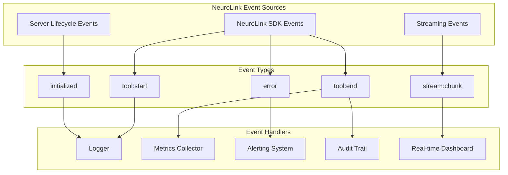

We designed NeuroLink's event-driven architecture around a core insight: AI operations are inherently multi-step and asynchronous, and treating them as simple request-response calls hides the information you need for production observability.

The architecture uses Node.js `EventEmitter` with a `TypedEventEmitter` surface for lifecycle notifications from generation, tool execution, streaming, MCP connections, and server adapters. Events complement logging because application code can subscribe to a pipeline stage and react in real time instead of only recording it.

This deep dive covers three event sources -- SDK events, streaming events, and server lifecycle events -- and the patterns for combining them into reactive production workflows.

## NeuroLink's Event System

The `NeuroLink` class uses a `TypedEventEmitter<NeuroLinkEvents>` internally. Event payloads vary by lifecycle stage; consumers should narrow the `unknown` payload before reading fields.

### How Events Are Emitted Internally

When a tool executes during generation, NeuroLink emits structured events with timing and result data:

```typescript
// Simplified internal pattern from NeuroLink SDK
export class NeuroLink {
  private emitter = createTypedEmitter<NeuroLinkEvents>();

  private emitToolEndEvent(
    toolName: string,
    startTime: number,
    success: boolean,
    result?: unknown,
    error?: Error,
  ): void {
    this.emitter.emit('tool:end', createToolEventPayload(toolName, {
      responseTime: Date.now() - startTime,
      success,
      timestamp: Date.now(),
      result,
      error: error?.message,
    }));
  }
}
```

The `tool:end` payload includes `tool` and `toolName`, plus fields such as `responseTime`, `success`, `result`, and a string `error` when the execution path provides them. A timestamp is included by the primary execution paths for correlation with other system logs.

### Key Event Categories

NeuroLink exposes several event categories:

- **Generation and tool events**: `generation:start`, `generation:end`, `tool:start`, and `tool:end`.
- **Stream events**: `stream:start`, `stream:chunk`, `stream:complete`, `stream:end`, and `stream:error`.
- **MCP events**: connection, failure, discovery, and removal events under the `externalMCP:` prefix.
- **Server events**: `initialized`, `started`, and `stopped` on server adapter instances.

Get the SDK emitter from `neurolink.getEventEmitter()`. Built-in event names are discoverable in TypeScript, while payloads are `unknown` and should be narrowed before field access:

```typescript
const events = neurolink.getEventEmitter();

events.on("generation:start", (payload) => {
  if (payload && typeof payload === "object" && "provider" in payload) {
    console.log("Provider:", payload.provider);
  }
});
```

## Tool Execution Events

Tool execution paths emit a `tool:start` event before execution and a `tool:end` event after success or failure. This gives you visibility into the AI's tool usage patterns.

```typescript
import { NeuroLink } from '@juspay/neurolink';

// Subscribe to tool events for logging and monitoring
const neurolink = new NeuroLink();
const events = neurolink.getEventEmitter();

events.on('tool:start', (event) => {
  console.log('Tool started:', event);
});

events.on('tool:end', (event) => {
  console.log('Tool finished:', event);
});
```

Tool events enable several production patterns:

**Performance monitoring.** Track the P50, P95, and P99 latency of each tool. If a database query tool starts taking 5 seconds instead of the usual 500ms, you want to know immediately.

**Usage analytics.** Which tools does the model call most frequently? Are there tools that the model never uses (and can be removed)? Are there patterns in tool sequences (the model always calls tool A before tool B)?

**Circuit breaker integration.** NeuroLink tracks per-tool circuit breakers internally. Repeated failures can open a breaker and reject execution until its reset window passes. The breaker map is private, so application code should monitor failure outcomes from `tool:end` rather than expecting a public breaker-state event.

**Audit trails.** Applications that need tool-call audit records can use tool events to capture the tool name, available input or result data, outcome, and timing fields supplied by the execution path. Apply redaction and retention rules before persisting those payloads.

### Tool Execution Summary

After a generation completes, you can analyze the tool execution pattern:

```typescript
const toolExecutions: Array<{
  name: string;
  duration: number;
  success: boolean;
}> = [];

events.on('tool:end', (payload) => {
  if (!payload || typeof payload !== 'object') return;
  if (!("toolName" in payload) || !("responseTime" in payload)) return;

  const event = payload as {
    toolName: string;
    responseTime?: number;
    success?: boolean;
  };
  toolExecutions.push({
    name: event.toolName,
    duration: event.responseTime ?? 0,
    success: event.success !== false,
  });
});

// After generation
const result = await neurolink.generate({
  input: { text: "Analyze last week's sales data and send a summary to the team" },
  provider: "openai",
  model: "gpt-5.4",
  tools: myTools,
});

console.log("Tool execution chain:");
toolExecutions.forEach((exec, i) => {
  console.log(`  ${i + 1}. ${exec.name} (${exec.duration}ms) - ${exec.success ? 'OK' : 'FAILED'}`);
});
// Tool execution chain:
//   1. queryDatabase (234ms) - OK
//   2. calculateMetrics (12ms) - OK
//   3. sendSlackMessage (456ms) - OK
```

This kind of post-hoc analysis reveals how the model orchestrates tools to accomplish complex tasks. It is invaluable for debugging incorrect tool sequences and optimizing slow pipelines.

## Streaming as an Event Source

Streaming transforms a single response into a sequence of events, each carrying a piece of the final output. This makes streaming a natural fit for event-driven architecture.

### Real Streaming vs Synthetic Streaming

NeuroLink supports native and synthetic streaming paths. The provider path attempts native streaming first. Synthetic streaming is used for cases such as image or video analysis and as a fallback after eligible native-stream failures when tools are enabled; it calls `generate()` and yields buffered text chunks.

```typescript
// Simplified flow from baseProvider.ts. The actual code has no named
// "is this terminal" helper — it inlines the check on the error's
// name/message, as shown below.
async stream(optionsOrPrompt: StreamOptions | string): Promise<StreamResult> {
  try {
    const realStreamResult = await this.executeStream(options, analysisSchema);
    return this.withStreamModelFallback(realStreamResult, options, analysisSchema);
  } catch (realStreamError) {
    const errMsg = realStreamError instanceof Error ? realStreamError.message : String(realStreamError);
    const errName = realStreamError instanceof Error ? realStreamError.name : "";

    // Abort, timeout, auth, quota, and rate-limit failures are rethrown.
    if (
      errName === "AbortError" ||
      /abort|timeout|401|403|quota|rate limit|authentication/.test(errMsg)
    ) {
      throw realStreamError;
    }

    // The broad synthetic fallback is available when tools are enabled.
    if (!options.disableTools && this.supportsTools()) {
      return this.executeFakeStreaming(options, analysisSchema);
    }
    throw realStreamError;
  }
}
```

Synthetic streaming preserves the `StreamResult` interface while progressively yielding a completed generation. Its text path buffers words into readable chunks:

```typescript
// Synthetic streaming yields word-by-word with natural pacing
private async executeFakeStreaming(options, analysisSchema): Promise<StreamResult> {
  const result = await this.generate(textOptions, analysisSchema);

  return {
    stream: (async function* () {
      const words = result.content.split(/(\s+)/);
      let buffer = '';
      for (let i = 0; i < words.length; i++) {
        buffer += words[i];
        const shouldYield =
          i === words.length - 1 ||
          buffer.length > 50 ||
          /[.!?;,]\s*$/.test(buffer);
        if (shouldYield && buffer.trim()) {
          yield { content: buffer };
          buffer = '';
          await new Promise(resolve => setTimeout(resolve, Math.random() * 9 + 1));
        }
      }

      // Yield image output if present
      if (result?.imageOutput) {
        yield { type: 'image', imageOutput: result.imageOutput };
      }
    })(),
    usage: result?.usage,
    provider: result?.provider,
    model: result?.model,
  };
}
```

The synthetic stream buffers words until a natural break point (more than 50 characters, punctuation, or the final word) and yields with a small random delay. Image generation models use synthetic streaming to yield image output as a special chunk type.

### Consuming Stream Events

From the consumer's perspective, both paths expose the same `StreamResult` interface. NeuroLink also emits stream lifecycle events through its event emitter:

```typescript
const neurolink = new NeuroLink();
const events = neurolink.getEventEmitter();

events.on("stream:start", () => {
  console.log("Stream started");
});

events.on("stream:chunk", (payload) => {
  if (payload && typeof payload === "object" && "content" in payload) {
    process.stdout.write(String(payload.content ?? ""));
  }
});

events.on("stream:complete", (payload) => {
  console.log("\nStream complete:", payload);
});

const result = await neurolink.stream({
  input: { text: "Explain event-driven architecture in 3 paragraphs" },
  provider: "openai",
  model: "gpt-5.4",
});

// Alternative: consume the stream directly
for await (const chunk of result.stream) {
  process.stdout.write(chunk.content || "");
}
```

### Server-Sent Events (SSE) Integration

NeuroLink's Hono server adapter provides `streamSSE` for delivering AI streams to web clients:

```typescript
import { createServer } from '@juspay/neurolink/server';

const server = await createServer(neurolink, {
  framework: 'hono',
  config: { port: 3000 },
});

await server.initialize();
await server.start();

// The built-in agent stream route uses SSE for streaming responses.
```

The Hono adapter consumes the route handler's async iterable, normalizes each yielded chunk, and writes it as an SSE message. This creates a streaming pipeline from the LLM provider through NeuroLink to the browser without coupling the HTTP adapter to the internal `stream:chunk` event.

## Server Lifecycle Events

NeuroLink's server adapters (`BaseServerAdapter`) extend `EventEmitter` with lifecycle events for initialization, startup, and shutdown.

```typescript
// Server lifecycle events from BaseServerAdapter
export abstract class BaseServerAdapter extends EventEmitter {
  public async initialize(): Promise<void> {
    this.lifecycleState = 'initializing';

    this.initializeFramework();
    this.registerBuiltInMiddleware();
    await this.registerBuiltInRoutes();

    this.lifecycleState = 'initialized';

    this.emit('initialized', {
      config: this.config,
      routeCount: this.routes.size,
      middlewareCount: this.middlewares.length,
    });
  }
}
```

The lifecycle events map directly to deployment operations:

```typescript
// React to server lifecycle
const server = await createServer(neurolink);

server.on('initialized', ({ routeCount, middlewareCount }) => {
  logger.info(`Server initialized: ${routeCount} routes, ${middlewareCount} middleware`);
});

server.on('started', ({ port }) => {
  notifyDeployment(`AI service started on port ${port}`);
});

server.on('stopped', () => {
  notifyDeployment('AI service stopped');
});

await server.initialize();
await server.start();
```

Server lifecycle events serve several production purposes:

**Deployment notifications.** When a server starts or stops, notify your deployment tooling or monitoring system so it can record the instance lifecycle.

**Scaling context.** Combine adapter request/response events with infrastructure metrics to inform scaling decisions. The lifecycle events themselves do not expose an active-connection counter.

**Health check integration.** The `initialized` event confirms that routes and middleware are registered correctly. If initialization fails, the health check endpoint should return unhealthy to prevent the load balancer from routing traffic to a broken instance.

**Log aggregation.** The `started` and `stopped` events bracket the server's active period, making it easy to correlate logs from a specific deployment window.

## Building Reactive Workflows

The real power of event-driven AI emerges when you combine tool events, streaming events, and lifecycle events into reactive workflows.

### Pattern: Auto-Retry on Tool Failure

```typescript
const failedTools = new Map<string, number>();

events.on('tool:end', (payload) => {
  if (!payload || typeof payload !== 'object' || !("toolName" in payload)) return;

  const event = payload as { toolName: string; success?: boolean };
  if (event.success === false) {
    const count = (failedTools.get(event.toolName) || 0) + 1;
    failedTools.set(event.toolName, count);

    if (count >= 3) {
      alerting.critical(`Tool ${event.toolName} has failed ${count} times`);
    }
  } else {
    failedTools.delete(event.toolName);
  }
});
```

### Pattern: Real-Time Analytics Dashboard

```typescript
const dashboard = {
  requestsPerMinute: 0,
  activeStreams: 0,
  toolLatencies: new Map<string, number[]>(),
  errorRate: 0,
  totalRequests: 0,
  totalErrors: 0,
};

events.on('generation:start', () => {
  dashboard.totalRequests++;
  dashboard.requestsPerMinute++;
});

events.on('stream:start', () => dashboard.activeStreams++);
events.on('stream:end', () => dashboard.activeStreams--);

events.on('tool:end', (payload) => {
  if (!payload || typeof payload !== 'object') return;
  if (!("toolName" in payload) || !("responseTime" in payload)) return;

  const toolName = String(payload.toolName);
  const latencies = dashboard.toolLatencies.get(toolName) || [];
  latencies.push(Number(payload.responseTime ?? 0));
  dashboard.toolLatencies.set(toolName, latencies);
});

events.on('error', () => {
  dashboard.totalErrors++;
  dashboard.errorRate = dashboard.totalErrors / dashboard.totalRequests;
});

// Reset per-minute counter every 60 seconds
setInterval(() => {
  exportToGrafana(dashboard);
  dashboard.requestsPerMinute = 0;
}, 60000);
```

### Pattern: Audit Trail from Tool Events

```typescript
const auditLog: Array<{
  timestamp: string;
  toolName: string;
  duration: number;
  success: boolean;
  userId: string;
}> = [];

events.on('tool:end', (payload) => {
  if (!payload || typeof payload !== 'object' || !("toolName" in payload)) return;

  const event = payload as {
    toolName: string;
    responseTime?: number;
    success?: boolean;
    timestamp?: number;
  };
  auditLog.push({
    timestamp: new Date(event.timestamp ?? Date.now()).toISOString(),
    toolName: event.toolName,
    duration: event.responseTime ?? 0,
    success: event.success !== false,
    userId: getCurrentUserId(), // From your auth context
  });

  // Flush to persistent storage periodically
  if (auditLog.length >= 100) {
    flushAuditLog(auditLog.splice(0, auditLog.length));
  }
});
```

### Pattern: Streaming Progress Indicator

```typescript
let totalChunks = 0;
let totalCharacters = 0;

events.on('stream:start', () => {
  totalChunks = 0;
  totalCharacters = 0;
  progressBar.start();
});

events.on('stream:chunk', (payload) => {
  if (!payload || typeof payload !== 'object' || !("content" in payload)) return;

  totalChunks++;
  totalCharacters += String(payload.content ?? '').length;
  progressBar.update(`${totalCharacters} chars received (${totalChunks} chunks)`);
});

events.on('stream:complete', () => {
  progressBar.complete(`Done: ${totalCharacters} chars in ${totalChunks} chunks`);
});

events.on('stream:error', (error) => {
  progressBar.error(`Failed after ${totalChunks} chunks: ${String(error)}`);
});
```

## Architecture: Three Event Sources


```mermaid
graph TB
    subgraph "NeuroLink Event Sources"
        SDK[NeuroLink SDK Events]
        STREAM[Streaming Events]
        SERVER[Server Lifecycle Events]
    end

    subgraph "Event Types"
        TS[tool:start]
        TE[tool:end]
        ERR[error]
        INIT[initialized]
        CHUNK[stream:chunk]
    end

    subgraph "Event Handlers"
        LOG[Logger]
        METRICS[Metrics Collector]
        ALERT[Alerting System]
        AUDIT[Audit Trail]
        DASH[Real-time Dashboard]
    end

    SDK --> TS
    SDK --> TE
    SDK --> ERR
    STREAM --> CHUNK
    SERVER --> INIT

    TS --> LOG
    TE --> METRICS
    TE --> AUDIT
    ERR --> ALERT
    CHUNK --> DASH
    INIT --> LOG
```

The three event sources cover the full lifecycle of an AI application:

1. **SDK events** (tool start/end, errors) cover the AI reasoning and tool execution layer.
2. **Streaming events** (start, chunk, complete, error) cover the response delivery layer.
3. **Server events** (initialized, started, stopped) cover the infrastructure layer.

Each event source feeds into a shared set of handlers: loggers, metrics collectors, alerting systems, audit trails, and dashboards. The same handler infrastructure processes events from all sources, creating a unified observability platform.

## Best Practices for Event-Driven AI

**Start with logging, then add metrics, then build reactive workflows.** Do not try to build a complete reactive system on day one. Start by logging events to understand what your AI system is doing. Add metrics when you need dashboards. Build reactive workflows when you have specific automation needs.

**Use events for observability, not control flow.** Events should inform you about what happened, not control what happens next. Avoid patterns where event handlers modify the generation parameters or tool results -- that creates hard-to-debug coupling between the event system and the execution pipeline.

**Batch events before sending to external systems.** Sending one HTTP request per event to Datadog or CloudWatch is expensive and slow. Buffer events and flush them periodically (every 1-10 seconds depending on your latency requirements).

**Handle backpressure in stream handlers.** If your `stream:chunk` handler writes to a database and the database is slow, chunks will queue up in memory. Implement backpressure by dropping metrics events (not audit events) when the handler queue exceeds a threshold.

**Test event handlers under load.** A handler that works fine at 10 requests per second might become a bottleneck at 1,000 requests per second. Load test your event handlers with realistic stream volumes and tool call frequencies.

## Design Decisions and Trade-offs

The architecture separates SDK events from server-adapter lifecycle events because they have different owners and throughput characteristics. Generation and tool events fire around AI work, stream chunks can be high-volume, and server lifecycle events fire only around adapter startup and shutdown. Keeping the server adapter's emitter separate avoids mixing deployment concerns into each NeuroLink instance's operation events.

The composition model -- same event feeding multiple handlers, handlers combining events from multiple sources -- trades simplicity for power. A team that only needs logging could achieve the same result with simpler middleware. But teams that grow into metrics, alerting, audit trails, and reactive automation benefit from having the event infrastructure already in place rather than retrofitting it later.

Start by subscribing to `generation:end` and `tool:end` for basic observability. Consume `result.stream` for real-time UI output, and use `stream:chunk` when you also need lifecycle telemetry. Add server-adapter events for deployment monitoring. From there, the reactive patterns can grow with your operational needs.

- [The Event System: Real-Time Hooks](/posts/event-system/) -- Detailed reference for every event type and payload
- [MCP Server Tutorial](/posts/mcp-server-tutorial/) -- Build custom tools and monitor them with events
- **Microservices with AI** -- Server lifecycle events in multi-service architectures

---

**Related posts:**

- [The Event System: Real-Time Hooks for AI Observability](/posts/event-system/)
- [AI Observability: Monitoring LLM Applications in Production](/posts/monitoring-observability/)
- [Building Webhook Handlers with NeuroLink AI Processing](/posts/webhook-integrations/)
