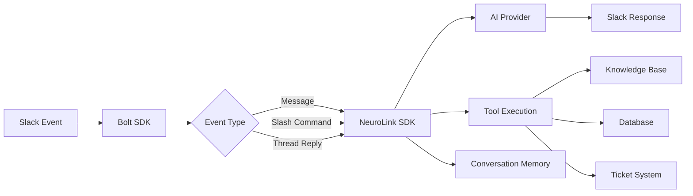

You will build a production-ready AI Slack bot using the Slack Bolt SDK and NeuroLink. By the end of this tutorial, your bot will respond to mentions and direct messages with AI-generated answers, call tools to search your knowledge base and query business metrics, summarize threads on demand via slash commands, stream long responses with progressive message updates, and maintain conversation context per thread.

The stack is straightforward: Slack Bolt SDK for the integration layer and NeuroLink SDK for AI generation, tool orchestration, and conversation memory. Now you will set up the architecture and build your first message handler.

## Architecture Overview

Before writing any code, it is worth understanding the data flow. Every Slack event -- whether it is a mention, a direct message, or a slash command -- flows through the Bolt SDK, gets routed to NeuroLink for AI processing, and the result goes back to Slack.



The key architectural decision is that NeuroLink handles all the AI complexity: provider selection, tool execution, and memory management. Your Slack bot code only needs to bridge events from Slack into NeuroLink and route responses back.

## Step 1 -- Slack App Setup

Start by creating a new Slack app at [api.slack.com/apps](https://api.slack.com). Choose "From scratch" and name your app. Once created, configure the following OAuth scopes under **OAuth & Permissions**:

- `app_mentions:read` -- detect when users mention your bot
- `chat:write` -- send messages as the bot
- `channels:history` -- read channel messages for thread summarization
- `im:history` -- handle direct messages

For development, enable **Socket Mode** under the Socket Mode settings page. This lets your bot connect without exposing a public URL. For production, you will switch to the Events API with a public endpoint.

Grab three tokens from the Slack app dashboard:

```text
SLACK_BOT_TOKEN=xoxb-...
SLACK_SIGNING_SECRET=...
SLACK_APP_TOKEN=xapp-...
OPENAI_API_KEY=sk-...
```

Install your dependencies:

```bash
npm install @slack/bolt @juspay/neurolink ai zod
```

> **Note:** Keep your tokens out of version control. Use a `.env` file locally and a secrets manager in production.
{: .prompt-info }

## Step 2 -- Basic Bot with NeuroLink

With the Slack app configured and dependencies installed, you can wire up the basic bot. The pattern is simple: listen for Slack events, pass the text to NeuroLink for AI generation, and reply with the result.

```typescript
// src/bot.ts
import { App } from "@slack/bolt";
import { NeuroLink } from "@juspay/neurolink";

const app = new App({
  token: process.env.SLACK_BOT_TOKEN,
  signingSecret: process.env.SLACK_SIGNING_SECRET,
  socketMode: true,
  appToken: process.env.SLACK_APP_TOKEN,
});

const neurolink = new NeuroLink({
  conversationMemory: { enabled: true },
});

// Respond to @mentions
app.event("app_mention", async ({ event, say }) => {
  const result = await neurolink.generate({
    input: { text: event.text },
    provider: "openai",
    model: "gpt-4o",
    systemPrompt: `You are a helpful team assistant in a Slack workspace.
      Be concise and use Slack formatting (bold, code blocks, bullet lists).
      Current channel: <#${event.channel}>`,
  });

  await say({
    text: result.content,
    thread_ts: event.thread_ts || event.ts,
  });
});

// Respond to direct messages
app.event("message", async ({ event, say }) => {
  if (event.channel_type !== "im") return;
  if ("bot_id" in event) return; // Ignore bot messages

  const result = await neurolink.generate({
    input: { text: event.text || "" },
    provider: "openai",
    model: "gpt-4o",
  });

  await say(result.content);
});

(async () => {
  await app.start();
  console.log("Slack bot is running!");
})();
```

A few important details in this code. The `conversationMemory: { enabled: true }` setting in the NeuroLink constructor enables automatic conversation tracking. Each subsequent call to `generate()` builds on previous interactions, so the bot remembers what was said earlier in a thread. The `thread_ts` parameter ensures replies go into the correct Slack thread rather than the main channel.

The system prompt instructs the AI to use Slack-compatible formatting. Bold text uses asterisks, code blocks use triple backticks, and bullet lists use dashes -- all standard Slack markdown.

## Step 3 -- Add AI Tools

A bot that only generates text is useful, but a bot that can take actions is powerful. NeuroLink integrates with the Vercel AI SDK tool system, letting you define typed tools that the AI can call when appropriate.

Here are three tools that turn a generic chatbot into a team productivity tool:

```typescript
// src/tools.ts
import { tool } from "ai";
import { z } from "zod";

export const botTools = {
  searchDocs: tool({
    description: "Search the team knowledge base for answers to questions",
    parameters: z.object({
      query: z.string().describe("Search query"),
    }),
    execute: async ({ query }) => {
      // Integration with your RAG pipeline
      const results = await ragPipeline.query(query);
      return {
        answer: results.answer,
        sources: results.sources.map((s) => s.title),
      };
    },
  }),

  queryMetrics: tool({
    description: "Query business metrics from the analytics database",
    parameters: z.object({
      metric: z.string().describe("Metric name (e.g., revenue, signups, churn)"),
      period: z.enum(["today", "this_week", "this_month", "this_quarter"]),
    }),
    execute: async ({ metric, period }) => {
      const data = await db.query(
        `SELECT value FROM metrics WHERE name = $1 AND period = $2`,
        [metric, period]
      );
      return { metric, period, value: data.rows[0]?.value || "N/A" };
    },
  }),

  createTicket: tool({
    description: "Create a support ticket in the ticketing system",
    parameters: z.object({
      title: z.string().describe("Ticket title"),
      description: z.string().describe("Ticket description"),
      priority: z.enum(["low", "medium", "high", "critical"]),
    }),
    execute: async ({ title, description, priority }) => {
      const ticket = await ticketSystem.create({ title, description, priority });
      return { ticketId: ticket.id, url: ticket.url };
    },
  }),
};
```

Now update your bot to use these tools. The AI will automatically decide when to call each tool based on the user's message and the tool descriptions:

```typescript
// Update bot.ts to use tools
const result = await neurolink.generate({
  input: { text: event.text },
  provider: "openai",
  model: "gpt-4o",
  tools: botTools,
  systemPrompt: `You are a team assistant with access to tools.
    Use searchDocs to answer knowledge questions.
    Use queryMetrics to report on business data.
    Use createTicket when users report issues.`,
});
```

With this setup, a user can say "@bot what were our signups this month?" and the AI will call `queryMetrics` with `{ metric: "signups", period: "this_month" }`, get the result, and format a natural language answer. No regex parsing, no command routing -- the AI handles intent detection automatically.

> **Note:** Tool definitions use Zod schemas for parameter validation. This ensures the AI provides correctly typed arguments every time.
{: .prompt-info }

## Step 4 -- Slash Commands

Slash commands give users quick access to specific bot capabilities. Unlike mentions, slash commands are explicit and structured, making them ideal for common actions.

Register two slash commands in your Slack app settings: `/ask` for quick questions and `/summarize` for thread summarization.

```typescript
// /ask command for quick questions
app.command("/ask", async ({ command, ack, respond }) => {
  await ack();

  const result = await neurolink.generate({
    input: { text: command.text },
    provider: "openai",
    model: "gpt-4o-mini", // Faster for slash commands
    tools: botTools,
  });

  await respond({
    response_type: "in_channel",
    text: result.content,
  });
});

// /summarize command for thread summarization
app.command("/summarize", async ({ command, ack, respond, client }) => {
  await ack();

  // Fetch thread messages
  const thread = await client.conversations.replies({
    channel: command.channel_id,
    ts: command.text, // Thread timestamp
  });

  const messages = thread.messages
    ?.map((m) => `${m.user}: ${m.text}`)
    .join("\n");

  const result = await neurolink.generate({
    input: { text: `Summarize this Slack thread:\n\n${messages}` },
    provider: "openai",
    model: "gpt-4o-mini",
  });

  await respond({
    response_type: "ephemeral",
    text: `*Thread Summary:*\n${result.content}`,
  });
});
```

Notice the model choice: `gpt-4o-mini` for slash commands. Slash commands have a 3-second acknowledgment deadline from Slack, so speed matters. The smaller model responds faster while still producing quality summaries. The `/summarize` response uses `response_type: "ephemeral"` so only the requesting user sees the summary, avoiding noise in the channel.

## Step 5 -- Streaming Responses

For longer responses, watching a static "Thinking..." message for several seconds is a poor user experience. Streaming lets you update the message progressively as the AI generates its response, similar to how ChatGPT reveals text word by word.

```typescript
app.event("app_mention", async ({ event, client }) => {
  // Post initial "thinking" message
  const initialMsg = await client.chat.postMessage({
    channel: event.channel,
    thread_ts: event.thread_ts || event.ts,
    text: "_Thinking..._",
  });

  const result = await neurolink.stream({
    input: { text: event.text },
    provider: "openai",
    model: "gpt-4o",
    tools: botTools,
  });

  let fullContent = "";
  let lastUpdate = Date.now();

  for await (const chunk of result.stream) {
    if ("content" in chunk) {
      fullContent += chunk.content;

      // Throttle updates to avoid rate limits (1 update per 2 seconds)
      if (Date.now() - lastUpdate > 2000) {
        await client.chat.update({
          channel: event.channel,
          ts: initialMsg.ts!,
          text: fullContent,
        });
        lastUpdate = Date.now();
      }
    }
  }

  // Final update with complete content
  await client.chat.update({
    channel: event.channel,
    ts: initialMsg.ts!,
    text: fullContent,
  });
});
```

The throttling is critical. Slack enforces rate limits of approximately one API call per second per channel. Without throttling, a fast-streaming model could trigger rate limit errors. The 2-second interval provides a smooth visual update cadence while staying well within Slack's limits.

> **Note:** Use `result.stream` (not `result.textStream`) when iterating over NeuroLink streaming responses. Each chunk includes a `type` field that lets you differentiate between text chunks and tool call events.
{: .prompt-info }

## Step 6 -- Conversation Memory per Thread

One of the most powerful features for a Slack bot is thread-aware memory. When a user starts a conversation in a thread, the bot should remember everything discussed in that thread without mixing it up with other threads.

NeuroLink handles this automatically when `conversationMemory` is enabled in the constructor. Each call to `generate()` maintains conversation history, so follow-up questions in a thread work naturally.

```typescript
// Conversation memory is enabled at the NeuroLink constructor level
const neurolink = new NeuroLink({
  conversationMemory: { enabled: true },
});

// Each generate call automatically maintains conversation history
const result = await neurolink.generate({
  input: { text: event.text },
  provider: "openai",
  model: "gpt-4o",
  // Conversation history is automatically tracked when conversationMemory is enabled
});
```

With memory enabled, a conversation like this works seamlessly:

- **User:** "@bot what is our current churn rate?"
- **Bot:** "Your current monthly churn rate is 3.2%..."
- **User:** "@bot how does that compare to last quarter?"
- **Bot:** "Compared to last quarter's 4.1% churn rate, you've improved by 0.9 percentage points..."

The bot remembers the context of "that" referring to the churn rate discussed earlier. Without conversation memory, the follow-up question would be unintelligible to the AI.

## Step 7 -- Deploy to Production

For development, Socket Mode works well because it does not require a public URL. For production, switch to the Events API with a proper HTTP endpoint.

Key deployment considerations:

1. **Switch to Events API:** Configure your Slack app's Event Subscriptions with your production URL (e.g., `https://bot.yourcompany.com/slack/events`). Disable Socket Mode.

2. **Deploy to a hosting platform:** Railway, Render, or AWS ECS all work well. The bot is a standard Node.js HTTP server once you switch from Socket Mode.

3. **Health checks:** Add a `/health` endpoint for your load balancer:

```typescript
app.receiver.router.get("/health", (req, res) => {
  res.status(200).json({ status: "ok", uptime: process.uptime() });
});
```

1. **Rate limiting:** Slack rate limits API calls to approximately 1 request per second per channel. Batch updates and use throttling for streaming responses.

2. **Monitoring:** Track response times, error rates, and token usage. NeuroLink's analytics provide per-request token counts and provider information for cost attribution.

## Security Considerations

Building an AI bot that lives in your Slack workspace means it has access to team conversations. Security is not optional.

**Verify Slack signatures:** The Bolt SDK handles this automatically via the `signingSecret` configuration. Every incoming request is verified against Slack's signing secret to prevent spoofing.

**Sanitize user input:** Before passing user messages to the LLM, strip any prompt injection attempts. Never include raw user input in system prompts without sanitization.

**Limit tool permissions:** The `queryMetrics` tool should use read-only database connections. The `createTicket` tool should only create, never delete. Design tools with the principle of least privilege.

**Use HITL for destructive actions:** For operations that cannot be undone (deleting data, sending emails, modifying configurations), enable Human-in-the-Loop approval:

```typescript
const neurolink = new NeuroLink({
  conversationMemory: { enabled: true },
  hitl: {
    enabled: true,
    dangerousActions: ["deleteRecord", "sendEmail", "modifyConfig"],
  },
});
```

The `dangerousActions` array specifies which tool names require human approval before execution. When the AI tries to call one of these tools, NeuroLink pauses execution and requests approval.

> **Note:** Always scope database connections for bot tools to read-only access where possible. A compromised prompt should not be able to modify production data.
{: .prompt-warning }

## What You Built

You built a fully functional AI Slack bot with tool calling for querying metrics and creating tickets, slash commands for on-demand interactions, streaming responses that update in real-time, conversation memory backed by Redis, and HITL approval for destructive actions. To extend it further:

- **Add a knowledge base** using RAG to give the bot deep knowledge of your company's documentation. See our [RAG implementation guide](/posts/rag-implementation/) for details.
- **Build custom tools** using the MCP standard for complex integrations that span multiple services.
- **Build a web companion** that shares the same NeuroLink backend, giving users both a Slack bot and a web chat interface.

Start with simple Q&A, add tools as pain points emerge, and iterate based on how your team actually uses the bot.

---

**Related posts:**

- [Building AI Slack Bots with NeuroLink](/posts/slack-bot-tutorial/)
- [Function Calling: AI Tool Use Patterns with NeuroLink](/posts/function-calling-patterns/)
- [Structured Output from LLMs: JSON Schema Validation in TypeScript](/posts/structured-output-llm-json-schema-typescript/)
