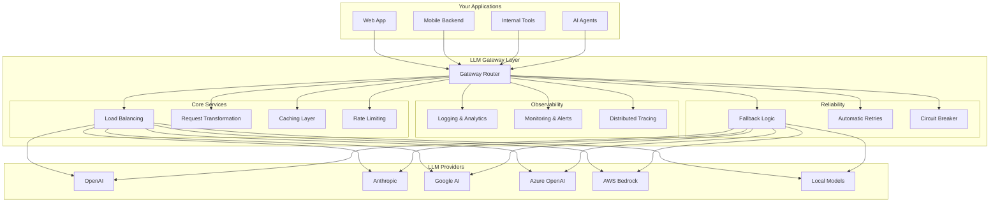

The LLM gateway decision is one of the most consequential infrastructure choices for production AI workloads. NeuroLink, Portkey, and Helicone each take fundamentally different approaches -- and most comparison articles fail to acknowledge where each platform genuinely excels.

This comparison examines all three platforms with evidence-based analysis. To be fair, each platform has a genuine sweet spot that the others cannot match. The goal is to give you enough information to choose the right tool for your specific requirements, not to declare a universal winner.

> **Last Updated:** July 4, 2026
> **Verified Versions:** NeuroLink v9.79.2 | Portkey (as of July 2026, now a Palo Alto Networks company) | Helicone (as of July 2026, in maintenance mode post-Mintlify acquisition)
>
> This comparison reflects our understanding of each platform as of the publication date. Features, pricing, and capabilities change frequently—always consult official documentation for the most current information.

> Tested: 2026-07-04 against NeuroLink v9.79.2

## Understanding LLM Gateways: The Foundation

Before diving into platform specifics, let us establish what an LLM gateway provides and why it has become essential infrastructure for production AI applications.



An LLM gateway sits between your applications and LLM providers, abstracting away the complexity of managing multiple providers, handling failures gracefully, controlling costs, and gaining visibility into how your AI systems behave in production.

## Platform Overview

### NeuroLink

NeuroLink is an open-source TypeScript SDK from Juspay that provides a unified interface to 30 AI providers (29 exported from the public index plus OpenRouter registered dynamically). It emphasizes developer experience with built-in MCP (Model Context Protocol) integration, enterprise middleware, a full RAG pipeline, voice capabilities, and production-ready patterns extracted from real-world deployments.

**Core strengths:**

- Unified TypeScript SDK with consistent API across all providers
- Built-in MCP tool integration with 3 bundled servers, stdio/SSE/WebSocket transport, and tool batching/caching/routing
- Human-in-the-Loop (HITL) security workflows
- Redis-backed or in-memory conversation memory
- Full RAG pipeline: hybrid search (vector + BM25), GraphRAG, 9 chunkers, reranking
- OpenTelemetry-based observability with custom exporters
- Voice pipeline with 5 TTS providers, 4 STT providers, and 2 realtime (S2S) providers; LiveKit WebRTC, real-time WebSocket server

### Portkey

Portkey is a managed LLM gateway focused on reliability, observability, and developer experience. **As of May 29, 2026, Portkey was acquired by Palo Alto Networks and is now integrated into Prisma AIRS as an AI Gateway control plane.** The product continues to operate as a standalone offering for existing and new customers—no shutdown has been announced.

**Core strengths:**

- Routing to 1,600+ LLMs across 40+ providers via a single API (open-source gateway, MIT license)
- Powerful Configs system for complex routing, fallbacks, and conditional logic
- Virtual key vault for secure API key management
- Simple (all tiers) and semantic caching (Production tier and above)
- Automatic fallbacks, retries (up to 5x exponential backoff), and load balancing; claimed sub-1ms added latency
- Guardrails as a dedicated product line (deterministic on all tiers, LLM-based from Production tier)
- **New:** MCP Gateway control plane — centralized auth, per-tool-call observability, and access control for MCP servers
- SOC2, ISO27001, GDPR, and HIPAA compliant (Enterprise tier; air-gapped VPC deployment is Enterprise-only)
- **Pricing:** Developer (free, 10k logs/month, 3-day retention), Production ($49/month, 100k logs/month + $9/100k overage, 30-day retention), Enterprise (custom)

### Helicone

Helicone started as an observability-first platform, providing deep insights into LLM usage patterns, costs, and performance. **As of March 3, 2026, Helicone was acquired by Mintlify and is now in maintenance mode.** Security patches, bug fixes, and new model additions continue to ship; no new product features are being developed. The Experiments (prompt A/B testing) feature was deprecated September 1, 2025. No shutdown date has been announced.

**Core strengths:**

- Excellent observability and analytics, including HQL (Helicone Query Language) and PostHog export
- Single URL-change integration — no SDK wrapping required
- Detailed cost tracking via Model Registry v2 (100% accurate) and a 300+ model open-source cost repository
- Caching with header-based configuration
- Cost-based routing (cheapest-provider routing, smart fallbacks)
- **Pricing:** Hobby (free, 10k req/month, 7-day retention), Pro ($79/month + usage-based, 1-month retention), Team ($799/month + usage-based, SOC-2 & HIPAA, 3-month retention), Enterprise (custom, on-prem)
- **Note:** Proxy adds 5–20ms latency in cloud mode; self-hosted proxy claims under 1ms. Platform is in maintenance mode — weigh this against new production dependencies.

> **Note on Mastra:** If you are evaluating TypeScript-first orchestration options, [Mastra](https://mastra.ai/) is worth knowing about. It is an open-source agent framework that focuses on workflow primitives, tool integration, and RAG — overlapping most with NeuroLink's orchestration tier rather than Portkey's or Helicone's gateway/observability positioning.

## Feature Comparison

> **Last verified:** July 4, 2026. Features, pricing, and capabilities may change. Always consult official documentation for the most current information. Portkey is now a Palo Alto Networks company (acquired May 29, 2026). Helicone is in maintenance mode (acquired by Mintlify March 3, 2026).
{: .prompt-info }

The following table provides a high-level comparison. Each platform has unique strengths—the "best" choice depends on your specific requirements.

| Feature Category | NeuroLink | Portkey | Helicone |
|-----------------|-----------|---------|----------|
| **Architecture** | | | |
| Open source | Yes (MIT) | Yes (AI Gateway, MIT) | Yes (Apache 2.0) |
| Self-hosted option | Yes | Yes (open-source; VPC/air-gapped is Enterprise) | Yes (Docker/Helm; on-prem managed is Enterprise) |
| Cloud-hosted | Planned | Yes | Yes |
| **Provider Support** | | | |
| Total providers supported | 30 (29 public + OpenRouter) | 1,600+ LLMs, 40+ providers | 100+ models (OpenAI, Anthropic, Azure, Gemini, DeepSeek, Groq, Mistral, and more) |
| OpenAI | Yes | Yes | Yes |
| Anthropic | Yes | Yes | Yes |
| Google AI/Vertex | Yes | Yes | Yes |
| Azure OpenAI | Yes | Yes | Yes |
| AWS Bedrock | Yes | Yes | Yes |
| Ollama/Local models | Yes | Yes | Yes |
| **Core Features** | | | |
| Automatic retries | Yes | Yes (up to 5x, exponential backoff) | Yes |
| Provider fallbacks | Yes | Yes | Yes (cost-based routing + smart fallbacks) |
| Load balancing | Yes | Yes | Yes |
| Request caching | Internal tool/model metadata; no HTTP-level LLM response cache | Simple (all tiers) + Semantic (Production+) | Yes (header-based; reported 73% hit-rate example) |
| Streaming support | Yes | Yes | Yes |
| Virtual keys | No | Yes (virtual key vault, rotate + revoke) | No |
| MCP gateway/control plane | Built-in MCP clients + 3 bundled servers | Yes (MCP Gateway — centralized auth, per-tool observability) | No |
| **Observability** | | | |
| Request logging | Yes (OpenTelemetry) | Yes | Yes |
| Cost tracking | Yes | Yes | Yes (Model Registry v2, 300+ model coverage) |
| Custom dashboards | Limited | Yes | Yes |
| Prompt management | Limited | Yes (templates, versioning, playground; unlimited from Production) | No new development (Experiments deprecated Sep 2025) |
| **Compliance** | | | |
| SOC2 certified | TBD | Yes (Enterprise) | Yes (Team tier) |
| ISO27001 certified | TBD | Yes (Enterprise) | TBD |
| GDPR compliant | Yes | Yes | TBD |
| HIPAA compliant | In progress | Yes (Enterprise) | Yes (Team tier) |
| **Pricing** | | | |
| Free tier | Planned | Yes (10k logs/month) | Yes (10k req/month) |
| Starter/Production tier | — | $49/month (100k logs + $9/100k overage) | — |
| Pro/Mid tier | — | — | $79/month + usage |
| Team tier | — | — | $799/month + usage |
| Enterprise | — | Custom (Palo Alto Networks contracts) | Custom |
| **SDK/DX** | | | |
| TypeScript SDK | Yes (primary) | Yes | Yes (`@helicone/helicone` package) |
| Python SDK | No | Yes | Yes (`helicone` package) |
| OpenAI compatibility | Planned | Yes | Yes |
| Header-based integration | No | Yes (`x-portkey-*` headers) | Yes (single baseURL change) |

> **Pricing Disclaimer:** Pricing information reflects data as of July 4, 2026. Verify current pricing at [portkey.ai/pricing](https://portkey.ai/pricing) and [helicone.ai/pricing](https://helicone.ai/pricing). Portkey's pricing and enterprise contracts may evolve under Palo Alto Networks ownership.
{: .prompt-warning }

## Code Examples: Integration Patterns

Let us examine how each platform approaches common integration scenarios.

### Basic Request with NeuroLink

NeuroLink uses a unified TypeScript API:

```typescript
import { NeuroLink } from '@juspay/neurolink';

const neurolink = new NeuroLink();

// Generate text with any provider
const result = await neurolink.generate({
  input: { text: 'Explain quantum computing in simple terms' },
  provider: 'vertex',
  model: 'gemini-2.5-flash',
});

console.log(result.content);
```

> **Note:** Model names and IDs in code examples reflect versions available at time of writing. Model availability, naming conventions, and pricing change frequently. Always verify current model IDs with your provider's documentation before deploying to production.
{: .prompt-info }

### Basic Request with Portkey

Portkey offers OpenAI-compatible SDKs with additional configuration:

```typescript
import Portkey from 'portkey-ai';

const portkey = new Portkey({
  apiKey: 'YOUR_PORTKEY_API_KEY',
  virtualKey: 'YOUR_OPENAI_VIRTUAL_KEY'
});

const response = await portkey.chat.completions.create({
  model: 'gpt-4o',
  messages: [
    { role: 'user', content: 'Explain quantum computing in simple terms' }
  ]
});

console.log(response.choices[0].message.content);
```

### Basic Request with Helicone

Helicone uses a header-based approach with the standard OpenAI SDK:

```typescript
import OpenAI from 'openai';

const openai = new OpenAI({
  apiKey: process.env.OPENAI_API_KEY,
  baseURL: 'https://oai.helicone.ai/v1',
  defaultHeaders: {
    'Helicone-Auth': `Bearer ${process.env.HELICONE_API_KEY}`
  }
});

const response = await openai.chat.completions.create({
  model: 'gpt-4o',
  messages: [
    { role: 'user', content: 'Explain quantum computing in simple terms' }
  ]
});

console.log(response.choices[0].message.content);
```

### Streaming with NeuroLink

NeuroLink provides native streaming support:

```typescript
import { NeuroLink } from '@juspay/neurolink';

const neurolink = new NeuroLink();

// Stream responses
const result = await neurolink.stream({
  input: { text: 'Write a short story about AI' },
  provider: 'anthropic',
  model: 'claude-sonnet-4-6',
});

for await (const chunk of result.stream) {
  if ('content' in chunk) {
    process.stdout.write(chunk.content || '');
  }
}
```

### Provider Fallback with NeuroLink

NeuroLink enables fallback patterns through its multi-provider support:

```typescript
import { NeuroLink } from '@juspay/neurolink';

const neurolink = new NeuroLink();

// Fallback pattern: try providers in priority order
async function generateWithFallback(prompt: string) {
  const providers = [
    { provider: 'vertex', model: 'gemini-2.5-flash' },
    { provider: 'bedrock', model: 'anthropic.claude-sonnet-4-6' },
    { provider: 'openai', model: 'gpt-4o' }
  ] as const;

  for (const { provider, model } of providers) {
    try {
      return await neurolink.generate({
        input: { text: prompt },
        provider,
        model,
      });
    } catch (error) {
      console.warn(`Provider ${provider} failed, trying next...`);
    }
  }
  throw new Error('All providers failed');
}

const result = await generateWithFallback('Analyze this data...');
console.log(result.content);
```

### MCP Tool Integration (NeuroLink Exclusive)

NeuroLink includes built-in MCP (Model Context Protocol) integration with 3 bundled servers and support for external servers via stdio, SSE, or WebSocket transport:

```json
// .mcp-config.json
{
  "mcpServers": {
    "filesystem": {
      "command": "npx",
      "args": ["-y", "@anthropic/mcp-filesystem"]
    },
    "browser": {
      "command": "npx",
      "args": ["-y", "@anthropic/mcp-browser"]
    }
  }
}
```

```typescript
import { NeuroLink } from '@juspay/neurolink';

// NeuroLink automatically loads MCP servers from config
const neurolink = new NeuroLink();

// Tools from configured MCP servers are available to the model
const result = await neurolink.generate({
  input: { text: 'List all TypeScript files in the src directory' },
  provider: 'anthropic',
  model: 'claude-sonnet-4-6',
  // MCP tools from .mcp-config.json are automatically available
});
```

## When to Choose Each Platform

### Choose NeuroLink When

- **You prefer open-source solutions** — NeuroLink is fully open-source (MIT license) and can be self-hosted without vendor dependencies
- **You're building in TypeScript** — NeuroLink is a TypeScript-first SDK with excellent type safety and IDE support
- **You need MCP tool integration** — Built-in support for Model Context Protocol with 3 bundled servers, tool batching, caching, and routing
- **You want HITL security workflows** — Human-in-the-Loop approval for sensitive operations in regulated industries
- **You need conversation memory** — Redis-backed or in-memory persistence for multi-turn conversations
- **You need RAG out of the box** — Full pipeline with hybrid search, GraphRAG, 9 chunkers, and reranking built in
- **You need voice capabilities** — 5 TTS providers, 4 STT providers, and 2 realtime (S2S) providers; LiveKit WebRTC and a real-time WebSocket server
- **You're coming from Juspay's ecosystem** — Production-tested patterns from Juspay's infrastructure

### Choose Portkey When

- **You need the broadest model coverage** — 1,600+ LLMs across 40+ providers via one API
- **You want managed infrastructure** — Portkey handles reliability engineering so you focus on features
- **You need sophisticated routing** — The Configs system enables complex fallback chains, weighted routing, and conditional logic
- **You require advanced caching** — Semantic caching from the $49/month Production tier for cost optimization
- **You need a managed MCP control plane** — The new MCP Gateway provides centralized auth and per-tool-call observability across MCP servers
- **You need enterprise compliance** — SOC2, ISO27001, GDPR, and HIPAA certifications (Enterprise tier)
- **You require virtual keys** — Secure API key management with rotation and revocation
- **You prefer Python** — First-class Python SDK alongside TypeScript
- **Caveat:** Portkey is now a Palo Alto Networks company (acquisition closed May 29, 2026); enterprise contracts and long-term roadmap may evolve under new ownership

### Choose Helicone When

- **Observability is your priority** — Best-in-class analytics, HQL queries, PostHog export, and detailed cost attribution
- **You want minimal integration effort** — A single baseURL change requires almost no code changes
- **You need detailed cost attribution** — Granular tracking by team, feature, or user with Model Registry v2
- **You're starting with observability first** — Add monitoring before committing to full gateway features
- **You prefer working with standard SDKs** — Use OpenAI/Anthropic SDKs directly with Helicone headers
- **Important caveat:** Helicone entered maintenance mode after its March 3, 2026 acquisition by Mintlify. No new features are planned. Weigh this platform risk for new production dependencies; the Experiments (prompt A/B testing) feature was already deprecated. The core proxy, caching, and observability remain operational.

## Making the Decision

Each platform excels in different areas:

| Priority | Recommended Platform |
|----------|---------------------|
| Open-source, self-hosted | NeuroLink |
| TypeScript-first development | NeuroLink |
| MCP/tool integration | NeuroLink |
| RAG pipeline (built-in) | NeuroLink |
| Voice pipeline (built-in) | NeuroLink |
| Broadest model coverage (1,600+ LLMs) | Portkey |
| Advanced caching (semantic) | Portkey |
| Enterprise compliance (SOC2/HIPAA) | Portkey or Helicone (Team tier) |
| Managed MCP control plane | Portkey |
| Managed reliability infrastructure | Portkey |
| Complex routing/fallback rules | Portkey |
| Prompt management & versioning | Portkey |
| Observability & debugging | Helicone |
| Minimal integration effort | Helicone |
| Cost tracking & attribution | Helicone |
| Best value free tier | Helicone (10k/month, Hobby tier) |

For many teams, these platforms can complement each other. You might use Helicone for observability while using NeuroLink or Portkey for routing and reliability. Portkey's virtual keys and compliance certifications make it the best choice for regulated industries, while Helicone's lightweight proxy and Hobby free tier suit observability-first approaches — though its maintenance-mode status is worth factoring into any new production dependency.

## Getting Started with NeuroLink

If NeuroLink fits your needs, here's how to get started:

```bash
npm install @juspay/neurolink

# Or with pnpm
pnpm add @juspay/neurolink
```

Basic setup:

```typescript
import { NeuroLink } from '@juspay/neurolink';

// Configure with environment variables or explicit config
const neurolink = new NeuroLink({
  // Optional: Redis for conversation memory
  conversationMemory: {
    enabled: true,
    redis: {
      url: process.env.REDIS_URL
    }
  }
});

// Start generating
const result = await neurolink.generate({
  input: { text: 'Hello, AI!' },
  provider: 'openai',
  model: 'gpt-4o',
});
```

## The Verdict

NeuroLink wins for teams that want a single open-source SDK handling orchestration, tool calling, RAG, HITL, voice, and observability in one package -- especially if you need full source code access and zero license fees. Portkey wins for teams that need a managed gateway with the widest model coverage and a visual dashboard, and who are comfortable with its new Palo Alto Networks ownership. Helicone wins for teams whose primary need is LLM observability and cost tracking, and who want to add monitoring without changing their existing LLM integration code — with the caveat that the platform is in maintenance mode.

To be fair, each platform has genuine strengths the others lack. NeuroLink's self-hosted model gives you complete control but requires you to run the infrastructure. Portkey's managed gateway eliminates operational burden but introduces a dependency on their service (now under Palo Alto Networks). Helicone's proxy approach is the least invasive but provides the narrowest feature set and carries acquisition-related platform risk.

Choose based on your primary need: orchestration + SDK (NeuroLink), managed gateway + broadest model coverage (Portkey), or observability (Helicone).

- **NeuroLink:** [github.com/juspay/neurolink](https://github.com/juspay/neurolink)
- **Portkey:** [portkey.ai/docs](https://portkey.ai/docs)
- **Helicone:** [helicone.ai/docs](https://helicone.ai/docs)

---

*Last verified: July 4, 2026. Have experience with any of these platforms? We welcome community feedback to keep this comparison accurate and helpful.*

---

**Related posts:**

- [Multi-Provider Failover: Never Lose an API Call](/posts/provider-failover-patterns/)
- [LLM Cost Optimization: Practical Strategies to Reduce Your AI Spend](/posts/cost-optimization-strategies/)
- [AI Observability: Monitoring LLM Applications in Production](/posts/monitoring-observability/)
