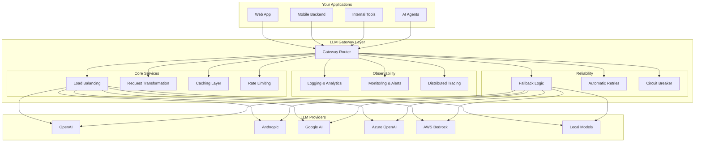

The LLM gateway decision is one of the most consequential infrastructure choices for production AI workloads. NeuroLink, Portkey, and Helicone each take fundamentally different approaches -- and most comparison articles fail to acknowledge where each platform genuinely excels.

This comparison examines all three platforms with evidence-based analysis. To be fair, each platform has a genuine sweet spot that the others cannot match. The goal is to give you enough information to choose the right tool for your specific requirements, not to declare a universal winner.

> **Last Updated:** January 5, 2026
> **Verified Versions:** NeuroLink v8.32.0 | Portkey (as of Jan 2026) | Helicone (as of Jan 2026)
>
> This comparison reflects our understanding of each platform as of the publication date. Features, pricing, and capabilities change frequently—always consult official documentation for the most current information.

## Understanding LLM Gateways: The Foundation

Before diving into platform specifics, let us establish what an LLM gateway provides and why it has become essential infrastructure for production AI applications.



An LLM gateway sits between your applications and LLM providers, abstracting away the complexity of managing multiple providers, handling failures gracefully, controlling costs, and gaining visibility into how your AI systems behave in production.

## Platform Overview

### NeuroLink

NeuroLink is an open-source TypeScript SDK from Juspay that provides a unified interface to 13 AI providers. It emphasizes developer experience with built-in MCP (Model Context Protocol) integration, enterprise middleware, and production-ready patterns extracted from real-world deployments.

**Core strengths:**

- Unified TypeScript SDK with consistent API across all providers
- Built-in MCP tool integration with extensive server support
- Human-in-the-Loop (HITL) security workflows
- Redis-based conversation memory
- Middleware system for custom processing

### Portkey

Portkey is a managed LLM gateway focused on reliability, observability, and developer experience. It provides extensive configuration options through its "Configs" system, allowing sophisticated routing, fallbacks, and caching without managing infrastructure.

**Core strengths:**

- Support for 250+ AI models across 45+ providers
- Powerful Configs system for complex routing scenarios
- Virtual keys for secure API key management
- Simple and semantic caching capabilities
- Strong fallback and load balancing capabilities
- SOC2, ISO27001, GDPR, and HIPAA compliant
- **Pricing:** Free tier (10k requests/month), Production plan ($49/month)

### Helicone

Helicone started as an observability-first platform, providing deep insights into LLM usage patterns, costs, and performance. It offers a lightweight integration approach with a proxy-based architecture while maintaining powerful analytics capabilities.

**Core strengths:**

- Excellent observability and analytics
- Simple header-based integration
- Detailed cost tracking and attribution
- Strong debugging and request inspection
- Logging and caching capabilities
- Prompt management features
- **Pricing:** Free tier (up to 10k requests/month, varies), Pro tier ($79/month), Team tier ($799/month), Enterprise (custom) - [Verify current pricing](https://www.helicone.ai/pricing)
- **Note:** Adds minimal latency (8ms P50); monitoring focused on LLM-only metrics

## Feature Comparison

> **Last verified:** January 2026. Features, pricing, and capabilities may change. Always consult official documentation for the most current information.
{: .prompt-info }

The following table provides a high-level comparison. Each platform has unique strengths—the "best" choice depends on your specific requirements.

| Feature Category | NeuroLink | Portkey | Helicone |
|-----------------|-----------|---------|----------|
| **Architecture** | | | |
| Open source | Yes (MIT) | Yes (AI Gateway) | Yes |
| Self-hosted option | Yes | Yes (Data Plane) | Yes |
| Cloud-hosted | Planned | Yes | Yes |
| **Provider Support** | | | |
| Total providers supported | 13 | 250+ models (45+ providers) | Multi-provider proxy |
| OpenAI | Yes | Yes | Yes |
| Anthropic | Yes | Yes | Yes |
| Google AI/Vertex | Yes | Yes | Yes |
| Azure OpenAI | Yes | Yes | Yes |
| AWS Bedrock | Yes | Yes | Yes |
| Ollama/Local models | Yes | Yes | Yes |
| **Core Features** | | | |
| Automatic retries | Yes | Yes | Yes |
| Provider fallbacks | Yes | Yes | Yes |
| Load balancing | Yes | Yes | Yes |
| Request caching | Internal (tool/model)* | Simple + Semantic | Yes |
| Streaming support | Yes | Yes | Yes |
| Virtual keys | No | Yes | No |
| **Observability** | | | |
| Request logging | Yes | Yes | Yes |
| Cost tracking | Yes | Yes | Yes |
| Custom dashboards | Limited | Yes | Yes |
| Prompt management | Limited | Yes | Yes |
| **Compliance** | | | |
| SOC2 certified | TBD | Yes | TBD |
| ISO27001 certified | TBD | Yes | TBD |
| GDPR compliant | Yes | Yes | TBD |
| HIPAA compliant | In progress | Yes | Yes (Team tier) |
| **Pricing** | | | |
| Free tier | Planned | 10k req/month | Up to 10k req/month* |
| Starter tier | - | $49/month | - |
| Pro/Mid tier | - | - | $79/month (Pro)* |
| Team/Enterprise | - | Custom | Custom* |
| **SDK/DX** | | | |
| TypeScript SDK | Yes (primary) | Yes | Yes (`@helicone/helicone` package) |
| Python SDK | No | Yes | Yes (`helicone` package) |
| OpenAI compatibility | Planned | Yes | Yes |
| Header-based integration | No | Yes (x-portkey-* headers) | Yes (lightweight) |

*\*NeuroLink supports 13 providers with their primary models. Portkey supports 250+ AI models across 45+ providers per their official documentation.*

*\*NeuroLink's caching is internal (tool definitions, model metadata) and differs from Portkey/Helicone's HTTP/API response caching. NeuroLink does not cache LLM responses at the gateway level.*

> **Pricing Disclaimer:** Pricing information reflects data as of January 2026. Pricing and tiers change frequently—verify current pricing at [portkey.ai/pricing](https://portkey.ai/pricing) and [helicone.ai/pricing](https://helicone.ai/pricing) before making decisions. Helicone pricing marked with * is approximate and subject to change; their free tier limits and Pro pricing may vary by usage model.
{: .prompt-warning }

## Code Examples: Integration Patterns

Let us examine how each platform approaches common integration scenarios.

### Basic Request with NeuroLink

NeuroLink uses a unified TypeScript API:

```typescript
import { NeuroLink } from '@juspay/neurolink';

const neurolink = new NeuroLink();

// Generate text with any provider
const result = await neurolink.generate({
  input: { text: 'Explain quantum computing in simple terms' },
  provider: 'vertex',
  model: 'gemini-3-flash',
});

console.log(result.content);
```

> **Note:** Model names and IDs in code examples reflect versions available at time of writing. Model availability, naming conventions, and pricing change frequently. Always verify current model IDs with your provider's documentation before deploying to production.
{: .prompt-info }

### Basic Request with Portkey

Portkey offers OpenAI-compatible SDKs with additional configuration:

```typescript
import Portkey from 'portkey-ai';

const portkey = new Portkey({
  apiKey: 'YOUR_PORTKEY_API_KEY',
  virtualKey: 'YOUR_OPENAI_VIRTUAL_KEY'
});

const response = await portkey.chat.completions.create({
  model: 'gpt-4o',
  messages: [
    { role: 'user', content: 'Explain quantum computing in simple terms' }
  ]
});

console.log(response.choices[0].message.content);
```

### Basic Request with Helicone

Helicone uses a header-based approach with the standard OpenAI SDK:

```typescript
import OpenAI from 'openai';

const openai = new OpenAI({
  apiKey: process.env.OPENAI_API_KEY,
  baseURL: 'https://oai.helicone.ai/v1',
  defaultHeaders: {
    'Helicone-Auth': `Bearer ${process.env.HELICONE_API_KEY}`
  }
});

const response = await openai.chat.completions.create({
  model: 'gpt-4o',
  messages: [
    { role: 'user', content: 'Explain quantum computing in simple terms' }
  ]
});

console.log(response.choices[0].message.content);
```

### Streaming with NeuroLink

NeuroLink provides native streaming support:

```typescript
import { NeuroLink } from '@juspay/neurolink';

const neurolink = new NeuroLink();

// Stream responses
const result = await neurolink.stream({
  input: { text: 'Write a short story about AI' },
  provider: 'anthropic',
  model: 'claude-sonnet-4-5-20250929',
});

for await (const chunk of result.stream) {
  if ('content' in chunk) {
    process.stdout.write(chunk.content || '');
  }
}
```

### Provider Fallback with NeuroLink

NeuroLink enables fallback patterns through its multi-provider support:

```typescript
import { NeuroLink } from '@juspay/neurolink';

const neurolink = new NeuroLink();

// Fallback pattern: try providers in priority order
async function generateWithFallback(prompt: string) {
  const providers = [
    { provider: 'vertex', model: 'gemini-2.5-flash' },
    { provider: 'bedrock', model: 'anthropic.claude-sonnet-4-5-v2-20250929' },
    { provider: 'openai', model: 'gpt-4o' }
  ] as const;

  for (const { provider, model } of providers) {
    try {
      return await neurolink.generate({
        input: { text: prompt },
        provider,
        model,
      });
    } catch (error) {
      console.warn(`Provider ${provider} failed, trying next...`);
    }
  }
  throw new Error('All providers failed');
}

const result = await generateWithFallback('Analyze this data...');
console.log(result.content);
```

### MCP Tool Integration (NeuroLink Exclusive)

NeuroLink includes built-in MCP (Model Context Protocol) integration via configuration:

```json
// .mcp-config.json
{
  "mcpServers": {
    "filesystem": {
      "command": "npx",
      "args": ["-y", "@anthropic/mcp-filesystem"]
    },
    "browser": {
      "command": "npx",
      "args": ["-y", "@anthropic/mcp-browser"]
    }
  }
}
```

```typescript
import { NeuroLink } from '@juspay/neurolink';

// NeuroLink automatically loads MCP servers from config
const neurolink = new NeuroLink();

// Tools from configured MCP servers are available to the model
const result = await neurolink.generate({
  input: { text: 'List all TypeScript files in the src directory' },
  provider: 'anthropic',
  model: 'claude-sonnet-4-5-20250929',
  // MCP tools from .mcp-config.json are automatically available
});
```

## When to Choose Each Platform

### Choose NeuroLink When

- **You prefer open-source solutions** — NeuroLink is fully open-source (MIT license) and can be self-hosted without vendor dependencies
- **You're building in TypeScript** — NeuroLink is a TypeScript-first SDK with excellent type safety and IDE support
- **You need MCP tool integration** — Built-in support for Model Context Protocol with multiple MCP servers
- **You want HITL security workflows** — Human-in-the-Loop approval for sensitive operations in regulated industries
- **You need conversation memory** — Redis-based persistence for multi-turn conversations
- **You're coming from Juspay's ecosystem** — Production-tested patterns from Juspay's infrastructure

### Choose Portkey When

- **You need broad provider support** — Support for 250+ AI models across 45+ providers
- **You want managed infrastructure** — Portkey handles reliability engineering so you focus on features
- **You need sophisticated routing** — The Configs system enables complex fallback chains, weighted routing, and conditional logic
- **You require advanced caching** — Both simple and semantic caching options for cost optimization
- **You need enterprise compliance** — SOC2, ISO27001, GDPR, and HIPAA certifications for regulated industries
- **You require virtual keys** — Secure API key management for multi-tenant environments
- **You prefer Python** — First-class Python SDK alongside TypeScript
- **You want hybrid deployment** — Data Plane option for running in your own infrastructure

### Choose Helicone When

- **Observability is your priority** — Best-in-class analytics, cost tracking, and debugging tools
- **You want minimal integration effort** — Header-based integration requires almost no code changes
- **You're cost-conscious** — Generous free tier (10k requests/month) and transparent pricing
- **You need detailed cost attribution** — Granular tracking by team, feature, or user
- **You need prompt management** — Version control and A/B testing for prompt optimization
- **You're starting with observability first** — Add monitoring before committing to full gateway features
- **You prefer working with standard SDKs** — Use OpenAI/Anthropic SDKs directly with Helicone headers
- **Note:** Proxy adds minimal latency (8ms P50); consider LLM-only monitoring limitations for enterprise use cases

## Making the Decision

Each platform excels in different areas:

| Priority | Recommended Platform |
|----------|---------------------|
| Open-source, self-hosted | NeuroLink |
| TypeScript-first development | NeuroLink |
| MCP/tool integration | NeuroLink |
| Broad provider support (250+ models) | Portkey |
| Advanced caching (semantic) | Portkey |
| Enterprise compliance (SOC2/HIPAA) | Portkey |
| Managed reliability infrastructure | Portkey |
| Complex routing/fallback rules | Portkey |
| Prompt management & versioning | Portkey or Helicone |
| Observability & debugging | Helicone |
| Minimal integration effort | Helicone |
| Cost tracking & attribution | Helicone |
| Best value free tier | Helicone (10k/month) |

For many teams, these platforms can complement each other. You might use Helicone for observability while using NeuroLink or Portkey for routing and reliability. Portkey's virtual keys and compliance certifications make it the best choice for regulated industries, while Helicone's lightweight proxy and generous free tier suit startups and observability-first approaches.

## Getting Started with NeuroLink

If NeuroLink fits your needs, here's how to get started:

```bash
npm install @juspay/neurolink

# Or with pnpm
pnpm add @juspay/neurolink
```

Basic setup:

```typescript
import { NeuroLink } from '@juspay/neurolink';

// Configure with environment variables or explicit config
const neurolink = new NeuroLink({
  // Optional: Redis for conversation memory
  conversationMemory: {
    enabled: true,
    redis: {
      url: process.env.REDIS_URL
    }
  }
});

// Start generating
const result = await neurolink.generate({
  input: { text: 'Hello, AI!' },
  provider: 'openai',
  model: 'gpt-4o',
});
```

## The Verdict

NeuroLink wins for teams that want a single open-source SDK handling orchestration, tool calling, RAG, HITL, and observability in one package -- especially if you need full source code access and zero license fees. Portkey wins for teams that need a managed gateway with a visual dashboard and are willing to pay for hosted infrastructure in exchange for faster setup. Helicone wins for teams whose primary need is LLM observability and cost tracking, and who want to add monitoring without changing their existing LLM integration code.

To be fair, each platform has genuine strengths the others lack. NeuroLink's self-hosted model gives you complete control but requires you to run the infrastructure. Portkey's managed gateway eliminates operational burden but introduces a dependency on their service availability. Helicone's proxy approach is the least invasive but provides the narrowest feature set.

Choose based on your primary need: orchestration (NeuroLink), managed gateway (Portkey), or observability (Helicone).

- **NeuroLink:** [github.com/juspay/neurolink](https://github.com/juspay/neurolink)
- **Portkey:** [portkey.ai/docs](https://portkey.ai/docs)
- **Helicone:** [helicone.ai/docs](https://helicone.ai/docs)

---

*Last verified: January 2026. Have experience with any of these platforms? We welcome community feedback to keep this comparison accurate and helpful.*

---

**Related posts:**

- [Multi-Provider Failover: Never Lose an API Call](/posts/provider-failover-patterns/)
- [LLM Cost Optimization: Practical Strategies to Reduce Your AI Spend](/posts/cost-optimization-strategies/)
- [AI Observability: Monitoring LLM Applications in Production](/posts/monitoring-observability/)
