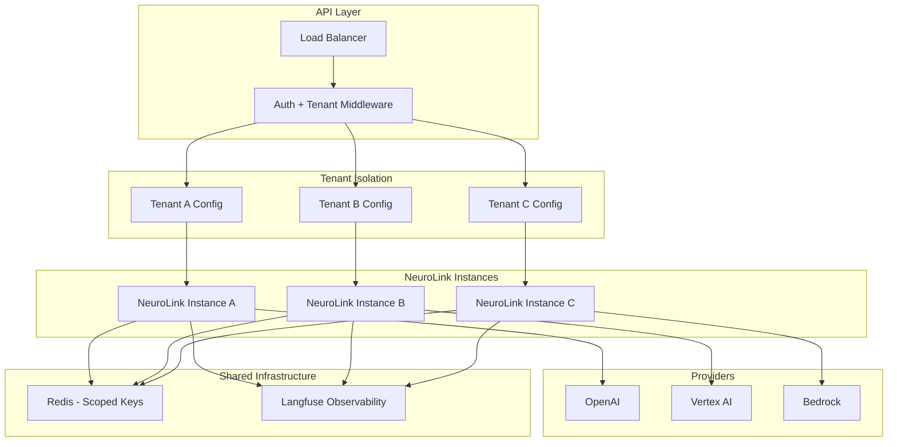

We designed NeuroLink's multi-tenant architecture around a constraint that standard AI SDKs do not address: Tenant A needs OpenAI with HIPAA-compliant data handling, Tenant B needs Vertex AI with aggressive cost optimization, and both share the same application code and API surface. Provider credentials, model selection, rate limits, cost attribution, and conversation isolation all vary per tenant.

The design decision was to make per-tenant NeuroLink instances the isolation boundary. Each tenant gets its own configured instance with its own provider credentials, model preferences, and conversation memory scope. We chose per-instance isolation over middleware-level routing because it eliminates an entire class of cross-tenant data leakage bugs at the architectural level. The trade-off is memory overhead from multiple instances, which we mitigate through lazy initialization and instance pooling.

This deep dive covers the full architecture: per-tenant provider instantiation, fallback chains, session isolation, server adapters for multi-tenant APIs, and cost attribution.



## Per-Tenant Provider Instantiation

The foundation of multi-tenant AI is giving each tenant its own NeuroLink instance configured with their specific provider, model, and credentials. This is not a hack or workaround -- it is the intended architecture. Each NeuroLink instance manages its own provider connections, conversation memory, and tool registry independently.

Start by defining what a tenant's AI configuration looks like:

```typescript
import { NeuroLink } from '@juspay/neurolink';

// Tenant configuration store (from your database)
interface TenantAIConfig {
  tenantId: string;
  provider: string;
  model?: string;
  region?: string;
  fallbackProvider?: string;
  maxTokens?: number;
}

// Create per-tenant NeuroLink instances
function createTenantNeuroLink(config: TenantAIConfig): NeuroLink {
  return new NeuroLink({
    conversationMemory: {
      enabled: true,
      redis: {
        url: process.env.REDIS_URL,
        keyPrefix: `tenant:${config.tenantId}:`
      }
    }
  });
}

// Per-tenant generation with provider routing
async function generateForTenant(
  tenantConfig: TenantAIConfig,
  prompt: string
) {
  const neurolink = getTenantInstance(tenantConfig.tenantId);

  return await neurolink.generate({
    input: { text: prompt },
    provider: tenantConfig.provider,
    model: tenantConfig.model,
    region: tenantConfig.region,
  });
}
```

The critical detail is the Redis key prefix: `tenant:${config.tenantId}:`. This scopes all conversation memory to the tenant, preventing any data leakage between tenants even though they share the same Redis cluster.

In production, you want to cache NeuroLink instances rather than creating them on every request. A simple instance pool works well:

```typescript
const MAX_CACHED_TENANTS = 1000;
const tenantInstances = new Map<string, NeuroLink>();

function getTenantInstance(tenantId: string): NeuroLink {
  if (!tenantInstances.has(tenantId)) {
    // Evict oldest entry if cache is full (simple LRU)
    if (tenantInstances.size >= MAX_CACHED_TENANTS) {
      const oldest = tenantInstances.keys().next().value;
      tenantInstances.delete(oldest);
    }
    const config = loadTenantConfig(tenantId); // From your database
    tenantInstances.set(tenantId, createTenantNeuroLink(config));
  }
  return tenantInstances.get(tenantId)!;
}
```

For tenants that need automatic provider selection based on their preferences (cost optimization, latency requirements, feature needs), NeuroLink's `AIProviderFactory` provides `createBestProvider()` which evaluates available providers against the tenant's criteria and returns the optimal match.

## Provider Fallback Chains Per Tenant

Each tenant can define their own fallback chain. Tenant A might primary on OpenAI with Bedrock as fallback (for HIPAA reasons, both are compliant). Tenant B might primary on Vertex AI with OpenAI as fallback (optimizing for cost with quality backup).

NeuroLink's `AIProviderFactory` supports this directly:

```typescript
// From src/lib/core/factory.ts - Provider fallback pattern
// NeuroLink supports per-tenant fallback chains
static async createProviderWithFallback(
  primaryProvider: string,
  fallbackProvider: string,
  modelName?: string | null,
  enableMCP: boolean = true,
): Promise<ProviderPairResult<AIProvider>> {
  const primary = await this.createProvider(primaryProvider, modelName, enableMCP);
  const fallback = await this.createProvider(fallbackProvider, modelName, enableMCP);
  return { primary, fallback };
}
```

In your multi-tenant setup, you configure fallbacks per tenant:

```typescript
async function createTenantProviders(config: TenantAIConfig) {
  if (config.fallbackProvider) {
    // Tenant has a fallback preference
    const { primary, fallback } = await AIProviderFactory.createProviderWithFallback(
      config.provider,
      config.fallbackProvider,
      config.model,
    );
    return { primary, fallback };
  }

  // Single provider tenant
  const provider = await AIProviderFactory.createProvider(
    config.provider,
    config.model,
  );
  return { primary: provider, fallback: null };
}
```

The circuit breaker pattern works per provider per tenant. If Tenant A's OpenAI connection starts failing, the circuit breaker trips for Tenant A's OpenAI usage only. Tenant B's OpenAI connection (if they use it) is unaffected. This isolation prevents one tenant's provider issues from cascading to others.

Retry logic via the `withRetry()` utility adds another layer of resilience. Configure retries per tenant based on their latency tolerance:

```typescript
import { withRetry } from '@juspay/neurolink';

async function resilientGenerate(tenantId: string, prompt: string) {
  const config = loadTenantConfig(tenantId);
  const neurolink = getTenantInstance(tenantId);

  return await withRetry(
    () => neurolink.generate({
      input: { text: prompt },
      provider: config.provider,
      model: config.model,
    }),
    {
      maxAttempts: config.maxRetries || 3,
      initialDelay: 1000,
    }
  );
}
```

## Session and Memory Isolation

Conversation memory in a multi-tenant system requires strict isolation at two levels: tenant isolation (Tenant A cannot see Tenant B's conversations) and session isolation (User 1 within Tenant A cannot see User 2's sessions).

NeuroLink achieves this through session context scoping on the provider level:

```typescript
// From src/lib/core/baseProvider.ts - Session context isolation
public setSessionContext(sessionId?: string, userId?: string): void {
  this.sessionId = sessionId;
  this.userId = userId;
  this.toolsManager.setSessionContext(sessionId, userId);
}

// In multi-tenant context
async function handleRequest(tenantId: string, sessionId: string, prompt: string) {
  const neurolink = getTenantInstance(tenantId);
  const provider = await neurolink.createProvider(tenantConfig.provider);

  // Scope session to tenant
  provider.setSessionContext(
    `${tenantId}:${sessionId}`,
    `${tenantId}:${userId}`
  );

  return await provider.generate({ prompt });
}
```

By prefixing session IDs with the tenant ID, you create a natural namespace that guarantees isolation. The tool execution context is also scoped per session, so tool state (in-progress operations, cached results) never leaks between tenants or users.

For HITL (Human-in-the-Loop) workflows, the HITLManager supports tenant-specific approval flows. A healthcare tenant might require approval for any action that accesses patient data, while a marketing tenant might only require approval for content publication:

```typescript
const neurolink = new NeuroLink({
  conversationMemory: { enabled: true },
  hitl: {
    enabled: true,
    dangerousActions: getTenantDangerousActions(tenantId),
    // Each tenant defines which actions need human approval
  },
});
```

> **Note:** Always prefix Redis keys and session IDs with the tenant identifier. This is the simplest and most reliable isolation mechanism for shared infrastructure.
{: .prompt-info }

## Server Adapter for Multi-Tenant APIs

When you need to expose your multi-tenant AI as an API (rather than embedding NeuroLink directly in each tenant's application), the server adapter layer provides production-grade infrastructure.

The `BaseServerAdapter` creates a `ServerContext` for each request that includes the NeuroLink reference, tool registry, and request metadata:

```typescript
// From src/lib/server/abstract/baseServerAdapter.ts
protected createContext(options: {
  requestId: string;
  method: string;
  path: string;
  headers: Record<string, string>;
  body?: unknown;
}): ServerContext {
  return {
    requestId: options.requestId,
    neurolink: this.neurolink,
    toolRegistry: this.toolRegistry,
    timestamp: Date.now(),
    metadata: {},
  };
}
```

For multi-tenant APIs, you add tenant identification middleware that resolves the tenant from the request (via API key, JWT, or header) and attaches the appropriate NeuroLink instance to the context:

```typescript
import { ServerAdapterFactory } from '@juspay/neurolink';

// Create the server with tenant middleware
const server = await ServerAdapterFactory.create({
  framework: 'hono',
  neurolink: defaultNeuroLink, // Default instance
  config: {
    port: 3000,
    basePath: '/api',
    cors: { enabled: true },
    rateLimit: {
      enabled: true,
      windowMs: 60000,
      maxRequests: 100,
      keyGenerator: (req) => extractTenantId(req), // Per-tenant rate limits
    },
  },
});
```

The `keyGenerator` function in the rate limit configuration is critical. By generating rate limit keys based on tenant ID, each tenant gets their own request quota. Tenant A making 90 requests does not affect Tenant B's remaining quota.

Per-tenant rate limiting prevents a single tenant from monopolizing your AI infrastructure. Combined with the per-tenant provider instances, you get full resource isolation without separate deployments.

## Cost Attribution and Observability

In a multi-tenant SaaS, you need to know exactly how much each tenant costs. NeuroLink's telemetry system tracks usage per provider per request, giving you the raw data for cost attribution.

Every response includes analytics data with token counts:

```typescript
const result = await neurolink.generate({
  input: { text: prompt },
  provider: tenantConfig.provider,
  model: tenantConfig.model,
});

// Access usage data for billing
const usage = result.usage;
console.log(`Tokens - Input: ${usage.input}, Output: ${usage.output}, Total: ${usage.total}`);
```

For per-tenant observability, the Langfuse integration supports scoped tracing. Each tenant's AI operations appear in their own trace group, making it straightforward to debug issues and analyze performance per tenant:

```typescript
// Per-tenant Langfuse tracing
const neurolink = new NeuroLink({
  conversationMemory: { enabled: true },
  observability: {
    tracing: true,
    langfuse: {
      publicKey: process.env.LANGFUSE_PUBLIC_KEY,
      secretKey: process.env.LANGFUSE_SECRET_KEY,
      tags: [`tenant:${tenantId}`], // Tag traces by tenant
    },
  },
});
```

Build a cost attribution pipeline that aggregates token usage by tenant:

```typescript
interface TenantUsageRecord {
  tenantId: string;
  provider: string;
  model: string;
  inputTokens: number;
  outputTokens: number;
  total: number;
  estimatedCost: number;
  timestamp: Date;
}

async function trackUsage(tenantId: string, result: GenerateResult) {
  const usage = result.usage;
  const costPerToken = getCostPerToken(result.provider, result.model);

  const record: TenantUsageRecord = {
    tenantId,
    provider: result.provider,
    model: result.model,
    inputTokens: usage.input,
    outputTokens: usage.output,
    total: usage.total,
    estimatedCost: (usage.input * costPerToken.input + usage.output * costPerToken.output) / 1_000_000,
    timestamp: new Date(),
  };

  await usageStore.insert(record);
}
```

This usage data feeds into your billing system, enabling usage-based pricing, cost alerts, and tenant-level budgets.

> **Note:** Token costs vary significantly between providers and models. A tenant using Claude Opus will cost roughly 10x more per token than one using Gemini Flash. Per-tenant cost tracking is essential for sustainable SaaS economics.
{: .prompt-warning }

## Putting It All Together

Here is the complete multi-tenant request flow, from incoming API call to AI response:

```typescript
import { NeuroLink } from '@juspay/neurolink';

// 1. Tenant resolution middleware extracts tenant from request
function tenantMiddleware(req: Request) {
  const apiKey = req.headers.get('x-api-key');
  const tenant = resolveTenant(apiKey);
  return tenant;
}

// 2. Get or create per-tenant NeuroLink instance
function getTenantNeuroLink(tenant: TenantAIConfig): NeuroLink {
  if (!tenantInstances.has(tenant.tenantId)) {
    // Evict oldest entry if cache is full (simple LRU)
    if (tenantInstances.size >= MAX_CACHED_TENANTS) {
      const oldest = tenantInstances.keys().next().value;
      tenantInstances.delete(oldest);
    }
    tenantInstances.set(tenant.tenantId, new NeuroLink({
      conversationMemory: {
        enabled: true,
        redis: {
          url: process.env.REDIS_URL,
          keyPrefix: `tenant:${tenant.tenantId}:`
        }
      },
    }));
  }
  return tenantInstances.get(tenant.tenantId)!;
}

// 3. Handle the request with tenant-scoped everything
async function handleAIRequest(req: Request) {
  const tenant = tenantMiddleware(req);
  const neurolink = getTenantNeuroLink(tenant);
  const { prompt, sessionId } = await req.json();

  const result = await neurolink.generate({
    input: { text: prompt },
    provider: tenant.provider,
    model: tenant.model,
  });

  // 4. Track usage for billing
  await trackUsage(tenant.tenantId, result);

  return result;
}
```

## Design Decisions and Trade-offs

We chose per-tenant NeuroLink instances over a shared instance with tenant context because isolation failures in multi-tenant AI have catastrophic consequences -- one tenant's conversation leaking into another's response is a trust-destroying event. Per-tenant instances consume more memory (each instance holds its own provider connections and configuration), but the isolation guarantee is absolute rather than probabilistic.

Redis key prefixing (`tenant:{id}:`) for conversation memory trades storage efficiency for simplicity. A shared key space with tenant metadata columns would be more storage-efficient, but prefix-based isolation means a misconfigured query can never return another tenant's data. The blast radius of a bug is limited to a single tenant.

The server adapter approach -- one HTTP endpoint, tenant resolution via middleware -- trades deployment simplicity for operational complexity. A per-tenant deployment model would provide stronger isolation but would not scale beyond a few dozen tenants. The middleware approach scales from two tenants to two thousand without fundamental architectural changes, which is the right trade-off for a SaaS platform.

---

**Related posts:**

- [Security Best Practices for AI Applications](/posts/enterprise-security-guide/)
- [NeuroLink vs Portkey vs Helicone: Choosing the Right LLM Gateway](/posts/neurolink-vs-portkey-helicone/)
- [AI Observability: Monitoring LLM Applications in Production](/posts/monitoring-observability/)
