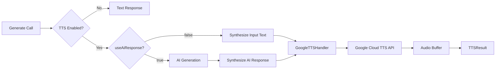

You will add text-to-speech capabilities to your AI applications using NeuroLink's built-in Google Cloud TTS integration. By the end of this tutorial, you will synthesize AI-generated responses into spoken audio with Neural2, Wavenet, Standard, and Chirp voices across 40+ languages -- all through the same `generate()` function you already use for text generation.

The integration supports two modes: synthesize input text directly (skip AI generation), or synthesize the AI-generated response (ask a question, get a spoken answer). Now you will configure TTS and build your first voice-enabled AI application.

## Architecture

The TTS pipeline integrates seamlessly with NeuroLink's generation flow. When the `tts` option is enabled, the system either synthesizes the input text directly or first generates an AI response and then synthesizes that response into audio.



Under the hood, the `GoogleTTSHandler` implements the `TTSHandler` interface with two core methods: `synthesize()` for converting text to audio and `getVoices()` for discovering available voices. The handler manages authentication via the `GOOGLE_APPLICATION_CREDENTIALS` environment variable, enforces a 30-second API timeout, and caps input text at 5,000 bytes including any SSML tags. Voice discovery results are cached with a 5-minute TTL to avoid redundant API calls.

## Quick Start

Getting started with TTS requires a Google Cloud project with the Text-to-Speech API enabled and a service account key. Set the `GOOGLE_APPLICATION_CREDENTIALS` environment variable to point to your service account JSON file.

```typescript
import { NeuroLink } from '@juspay/neurolink';

const neurolink = new NeuroLink();

// Mode 1: Synthesize input text directly (no AI generation)
const result = await neurolink.generate({
  input: { text: "Hello, welcome to our application!" },
  provider: "google-ai",
  tts: {
    enabled: true,
    voice: "en-US-Neural2-C",
    format: "mp3",
  },
});

// Access the audio
const audioBuffer = result.audio?.buffer;
const audioSize = result.audio?.size;
console.log(`Audio: ${audioSize} bytes, format: ${result.audio?.format}`);

// Mode 2: Synthesize the AI response
const aiResult = await neurolink.generate({
  input: { text: "Tell me a joke about programming" },
  provider: "google-ai",
  tts: {
    enabled: true,
    useAiResponse: true, // Synthesize what the AI says
    voice: "en-US-Neural2-D",
    speed: 0.9,
    format: "mp3",
  },
});

console.log("AI said:", aiResult.content);
console.log("Audio bytes:", aiResult.audio?.size);
```

The distinction between the two modes is important:

- `useAiResponse: false` (the default): TTS synthesizes the input text directly without calling any AI provider. This is ideal for narration, accessibility read-aloud, and notification systems.
- `useAiResponse: true`: The AI generates a response first, then TTS synthesizes that response. This is ideal for voice assistants, conversational interfaces, and spoken Q&A systems.

> **Note:** Mode 1 (`useAiResponse: false`) does not consume AI provider tokens since it skips the generation step entirely. Use it for pure TTS workloads to minimize costs.
{: .prompt-info }

## Voice Selection

Google Cloud TTS offers four voice families, each optimized for different quality and latency tradeoffs:

| Voice Type | Quality | Latency | Cost | Example |
|---|---|---|---|---|
| **Neural2** | Highest | Medium | Higher | en-US-Neural2-C |
| **Wavenet** | High | Medium | Medium | en-US-Wavenet-A |
| **Standard** | Good | Fast | Low | en-US-Standard-B |
| **Chirp** | Natural | Variable | Higher | en-US-Chirp-A |

Voice names follow the convention `{lang}-{region}-{type}-{variant}`. For example, `en-US-Neural2-C` is an English (US) Neural2 voice with variant C (male). The variant letter typically maps to a specific voice identity, and the gender detection logic in NeuroLink's `detectVoiceType()` function parses these tokens to classify the voice.

To discover available voices programmatically, use the `GoogleTTSHandler` directly:

```typescript
// List available voices
const handler = new GoogleTTSHandler();
const voices = await handler.getVoices("en-US");

for (const voice of voices) {
  console.log(`${voice.id} - ${voice.gender} - ${voice.type}`);
}
// en-US-Neural2-A - female - neural
// en-US-Neural2-C - male - neural
// en-US-Wavenet-A - female - wavenet
// ...
```

Each `TTSVoice` object includes: `id`, `name`, `languageCode`, `languageCodes[]` (all supported locales), `gender`, `type`, and `naturalSampleRateHertz`. The `getVoices()` method accepts an optional `languageCode` parameter to filter results. Without it, all voices across all 40+ supported languages are returned.

For production applications, choose your voice based on the use case:

- **Customer-facing voice assistants:** Neural2 for the highest quality human-like speech
- **Internal tools and notifications:** Standard voices for fast, cost-effective synthesis
- **Content narration (podcasts, articles):** Wavenet for a good balance of quality and cost
- **Experimental/conversational:** Chirp for the most natural-sounding output

## Audio Configuration

NeuroLink exposes the full range of Google Cloud TTS audio parameters through the `tts` option:

- **Format** (`AudioFormat`): `mp3`, `wav`, `ogg`, `opus` -- mapped internally to Google's encoding constants (MP3, LINEAR16, OGG_OPUS)
- **Speaking rate**: 0.25 to 4.0 (default: 1.0) -- control how fast the voice speaks
- **Pitch**: -20.0 to 20.0 semitones (default: 0.0) -- adjust the voice pitch
- **Volume gain**: -96.0 to 16.0 dB (default: 0.0) -- boost or reduce volume
- **Quality**: `standard` or `hd` -- higher quality increases audio fidelity

```typescript
const result = await neurolink.generate({
  input: { text: "Important announcement for all team members." },
  provider: "google-ai",
  tts: {
    enabled: true,
    voice: "en-US-Neural2-D",
    format: "wav",
    speed: 0.85,
    pitch: -2.0,
    volumeGainDb: 3.0,
    quality: "hd",
    output: "./announcement.wav", // Save to file
  },
});
```

The `output` parameter saves the audio directly to a file. Without it, the audio is available only as a buffer in `result.audio.buffer`. For web applications, you would typically convert the buffer to a base64 data URL or stream it through an HTTP response.

> **Note:** WAV format produces larger files but has zero compression artifacts. Use it when audio quality is paramount (announcements, professional narration). Use MP3 or OGG for general-purpose applications where file size matters.
{: .prompt-info }

## SSML Support

For fine-grained control over speech output, Google Cloud TTS supports SSML (Speech Synthesis Markup Language). NeuroLink auto-detects SSML by checking for `<speak>` opening and `</speak>` closing tags. If detected, the text is sent as SSML rather than plain text.

SSML enables pauses, emphasis, pronunciation control, prosody adjustments, and phoneme substitution:

```typescript
const ssmlText = `<speak>
  Welcome to <emphasis level="strong">NeuroLink</emphasis>.
  <break time="500ms"/>
  Let me tell you about our <say-as interpret-as="characters">AI</say-as> features.
  <prosody rate="slow" pitch="+2st">
    This is spoken slowly with a higher pitch.
  </prosody>
</speak>`;

const result = await neurolink.generate({
  input: { text: ssmlText },
  provider: "google-ai",
  tts: { enabled: true, voice: "en-US-Neural2-C" },
});
```

Common SSML tags and their uses:

- `<break time="500ms"/>` -- Insert pauses between sentences or sections
- `<emphasis level="strong">` -- Stress important words
- `<say-as interpret-as="characters">` -- Spell out acronyms letter by letter
- `<prosody rate="slow" pitch="+2st">` -- Control speed and pitch for specific passages
- `<phoneme alphabet="ipa">` -- Override pronunciation for technical terms or names

NeuroLink validates SSML input and throws a `TTSError` with code `INVALID_INPUT` if the `<speak>` tags are mismatched or malformed. Always ensure your SSML opens with `<speak>` and closes with `</speak>`.

## Streaming TTS

For conversational interfaces where latency matters, NeuroLink supports streaming TTS via the `TTSChunk` type. Instead of waiting for the entire audio to be synthesized, you receive chunks incrementally:

Each `TTSChunk` contains:

- `data` -- the audio bytes for this chunk
- `format` -- the audio format (mp3, wav, etc.)
- `index` -- the chunk sequence number
- `isFinal` -- whether this is the last chunk
- `cumulativeSize` -- total bytes received so far

Streaming reduces time-to-first-audio significantly. For a 30-second audio clip, non-streaming synthesis might take 3-5 seconds before any audio plays. With streaming, the first chunk arrives in under a second, and playback can begin immediately while remaining chunks load in the background.

This is particularly valuable for voice assistants and phone-based interfaces where users expect immediate auditory feedback.

## Error Handling

The TTS system uses a dedicated `TTSError` class with typed error codes for precise error handling:

| Error Code | Category | Description | Retriable |
|---|---|---|---|
| `PROVIDER_NOT_CONFIGURED` | Configuration | Missing Google Cloud credentials | No |
| `INVALID_INPUT` | Validation | Bad voice ID format or malformed SSML | No |
| `SYNTHESIS_FAILED` | Execution | Google API returned empty or error | Yes |

```typescript
try {
  const result = await neurolink.generate({
    input: { text: "Hello world" },
    provider: "google-ai",
    tts: { enabled: true, voice: "invalid-voice-id" },
  });
} catch (error) {
  if (error instanceof TTSError) {
    switch (error.code) {
      case 'PROVIDER_NOT_CONFIGURED':
        console.error("Set GOOGLE_APPLICATION_CREDENTIALS env var");
        break;
      case 'INVALID_INPUT':
        console.error("Check voice ID format: {lang}-{region}-{type}-{variant}");
        break;
      case 'SYNTHESIS_FAILED':
        console.error("Google TTS API error -- retry may succeed");
        break;
    }
  }
}
```

Errors are categorized by severity (LOW, MEDIUM, HIGH, CRITICAL) and include a `retriable` flag. Synthesis failures (transient Google API issues) are retriable, while validation errors (bad voice ID, malformed SSML) are not. Use the `retriable` flag to build intelligent retry logic that does not waste requests on errors that will never succeed.

> **Note:** The `GOOGLE_APPLICATION_CREDENTIALS` environment variable must point to a valid service account JSON file with the Text-to-Speech API enabled. This is the most common source of `PROVIDER_NOT_CONFIGURED` errors.
{: .prompt-warning }

## Production Patterns

### Voice Assistant Pipeline

Combine TTS with conversation memory for a complete voice assistant:

```typescript
const neurolink = new NeuroLink({
  conversationMemory: { enabled: true },
});

async function voiceAssistant(userText: string, sessionId: string) {
  const result = await neurolink.generate({
    input: { text: userText },
    provider: "vertex",
    model: "gemini-2.5-pro",
    tts: {
      enabled: true,
      useAiResponse: true,
      voice: "en-US-Neural2-C",
      format: "mp3",
      speed: 1.0,
    },
  });

  return {
    text: result.content,
    audio: result.audio?.buffer,
    audioFormat: result.audio?.format,
  };
}
```

### Multi-Language Narration

Generate audio in multiple languages for content localization:

```typescript
const languages = [
  { code: "en-US", voice: "en-US-Neural2-C" },
  { code: "es-ES", voice: "es-ES-Neural2-B" },
  { code: "fr-FR", voice: "fr-FR-Neural2-A" },
  { code: "de-DE", voice: "de-DE-Neural2-B" },
  { code: "ja-JP", voice: "ja-JP-Neural2-B" },
];

async function narrateInAllLanguages(text: string) {
  const results = await Promise.all(
    languages.map(async (lang) => {
      const translated = await neurolink.generate({
        input: { text: `Translate to ${lang.code}: ${text}` },
        provider: "openai",
        model: "gpt-4o",
      });

      const audio = await neurolink.generate({
        input: { text: translated.content },
        provider: "google-ai",
        tts: {
          enabled: true,
          voice: lang.voice,
          format: "mp3",
          output: `./output/${lang.code}.mp3`,
        },
      });

      return { language: lang.code, audio };
    })
  );

  return results;
}
```

## What You Built

You built TTS integration with Neural2 voices for production customer-facing applications and Standard voices for cost-effective internal tools. You configured both synthesis modes -- direct input synthesis for narrating existing text and AI response synthesis for intelligent voice assistants. You used SSML for fine-grained speech control including pauses, emphasis, and pronunciation, and streaming for low-latency audio delivery.

Next, explore model evaluation and quality scoring to add automated quality assurance to your AI responses, ensuring that the text your TTS system speaks is accurate and relevant.

---

**Related posts:**

- [Real-Time AI: Streaming Response Patterns with NeuroLink](/posts/streaming-best-practices/)
- [Advanced Vertex AI Patterns with NeuroLink](/posts/google-vertex-advanced/)
- [Multimodal Document Processing with NeuroLink](/posts/multimodal-document-processing/)
