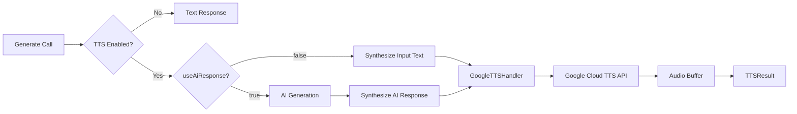

You will add speech-to-text and text-to-speech to an AI application through NeuroLink's `generate()` and `stream()` APIs. You will transcribe recorded audio with one of NeuroLink's shipped STT handlers, then synthesize input text or an AI-generated response with Google Cloud voices such as Neural2, Wavenet, Standard, and Chirp.

The TTS integration supports two non-streaming modes: synthesize input text directly (skip AI generation), or synthesize the AI-generated response (ask a question, get a spoken answer). STT runs before generation, injects the transcript into the prompt, and exposes the same transcript on the result.

## TTS Architecture

The TTS pipeline integrates seamlessly with NeuroLink's generation flow. When the `tts` option is enabled, the system either synthesizes the input text directly or first generates an AI response and then synthesizes that response into audio.


```mermaid
flowchart LR
    A[Generate Call] --> B{TTS Enabled?}
    B -->|No| C[Text Response]
    B -->|Yes| D{useAiResponse?}
    D -->|false| E[Synthesize Input Text]
    D -->|true| F[AI Generation]
    F --> G[Synthesize AI Response]
    E --> H[GoogleTTSHandler]
    G --> H
    H --> I[Google Cloud TTS API]
    I --> J[Audio Buffer]
    J --> K[TTSResult]
```

Under the hood, the `GoogleTTSHandler` implements the `TTSHandler` interface with two core methods: `synthesize()` for converting text to audio and `getVoices()` for discovering available voices. The handler manages authentication via the `GOOGLE_APPLICATION_CREDENTIALS` environment variable, enforces a 30-second API timeout, and caps input text at 5,000 bytes including any SSML tags. Voice discovery results are cached with a 5-minute TTL to avoid redundant API calls.

## Quick Start

Getting started with TTS requires a Google Cloud project with the Text-to-Speech API enabled and a service account key. Set the `GOOGLE_APPLICATION_CREDENTIALS` environment variable to point to your service account JSON file.

```typescript
import { NeuroLink } from '@juspay/neurolink';

const neurolink = new NeuroLink();

// Mode 1: Synthesize input text directly (no AI generation)
const result = await neurolink.generate({
  input: { text: "Hello, welcome to our application!" },
  provider: "google-ai",
  tts: {
    enabled: true,
    voice: "en-US-Neural2-C",
    format: "mp3",
  },
});

// Access the audio
const audioBuffer = result.audio?.buffer;
const audioSize = result.audio?.size;
console.log(`Audio: ${audioSize} bytes, format: ${result.audio?.format}`);

// Mode 2: Synthesize the AI response
const aiResult = await neurolink.generate({
  input: { text: "Tell me a joke about programming" },
  provider: "google-ai",
  tts: {
    enabled: true,
    useAiResponse: true, // Synthesize what the AI says
    voice: "en-US-Neural2-D",
    speed: 0.9,
    format: "mp3",
  },
});

console.log("AI said:", aiResult.content);
console.log("Audio bytes:", aiResult.audio?.size);
```

The distinction between the two modes is important:

- `useAiResponse: false` (the default): TTS synthesizes the input text directly without calling any AI provider. This is ideal for narration, accessibility read-aloud, and notification systems.
- `useAiResponse: true`: The AI generates a response first, then TTS synthesizes that response. This is ideal for voice assistants, conversational interfaces, and spoken Q&A systems.

> **Note:** Mode 1 (`useAiResponse: false`) does not consume AI provider tokens since it skips the generation step entirely. Use it for pure TTS workloads to minimize costs.
{: .prompt-info }

## Speech-to-Text

NeuroLink ships handlers for Whisper/OpenAI STT, Deepgram, Google STT, and Azure STT. Pass the recorded audio buffer through `stt.audio`; NeuroLink transcribes it before the model call and attaches the result as `result.transcription`:

```typescript
import { readFileSync } from 'node:fs';
import { NeuroLink } from '@juspay/neurolink';

const neurolink = new NeuroLink();
const audio = readFileSync('question.mp3');

const result = await neurolink.generate({
  input: { text: 'Answer the question in the recording.' },
  provider: 'openai',
  model: 'gpt-5.4',
  stt: {
    enabled: true,
    provider: 'whisper',
    audio,
    format: 'mp3',
    language: 'en-US',
    punctuation: true,
  },
});

console.log('Transcript:', result.transcription?.text);
console.log('AI response:', result.content);
```

If `input.text` is empty, NeuroLink uses the transcript itself as the model prompt. With both text and audio present, it prepends the transcription to your instruction. The `STTResult` can also include confidence, detected language, duration, word timings, segments, and speaker labels when the chosen provider supplies them.

## Voice Selection

NeuroLink classifies Google Cloud voice names into four families:

| Voice Type | Example |
|---|---|
| **Neural2** | en-US-Neural2-C |
| **Wavenet** | en-US-Wavenet-A |
| **Standard** | en-US-Standard-B |
| **Chirp** | en-US-Chirp-A |

Voice names follow the convention `{lang}-{region}-{type}-{variant}`. For example, `en-US-Neural2-C` is an English (US) Neural2 voice with variant C. NeuroLink parses the name to classify the voice family; gender comes from the `ssmlGender` metadata returned by Google Cloud.

To discover available voices programmatically, use the `GoogleTTSHandler` directly:

```typescript
import { GoogleTTSHandler } from '@juspay/neurolink';

// List available voices
const handler = new GoogleTTSHandler();
const voices = await handler.getVoices("en-US");

for (const voice of voices) {
  console.log(`${voice.id} - ${voice.gender} - ${voice.type}`);
}
// en-US-Neural2-A - female - neural
// en-US-Neural2-C - male - neural
// en-US-Wavenet-A - female - wavenet
// ...
```

Each `TTSVoice` object includes: `id`, `name`, `languageCode`, `languageCodes[]` (all supported locales), `gender`, `type`, and `naturalSampleRateHertz`. The `getVoices()` method accepts an optional `languageCode` parameter to filter results. Without it, all voices returned by the configured Google Cloud project are included.

Choose the voice from Google's current catalog based on the languages, latency, streaming mode, and pricing your application requires. Query `getVoices()` at setup time rather than assuming a sample voice is available in every project or region.

## Audio Configuration

The Google Cloud handler applies these audio parameters from the `tts` option:

- **Format**: `mp3`, `wav`, `ogg`, or `opus` -- mapped to Google's MP3, LINEAR16, or OGG_OPUS encoding
- **Speaking rate**: 0.25 to 4.0 (default: 1.0)
- **Pitch**: -20.0 to 20.0 semitones (default: 0.0)
- **Volume gain**: -96.0 to 16.0 dB (default: 0.0)

```typescript
import { writeFileSync } from 'node:fs';

const result = await neurolink.generate({
  input: { text: "Important announcement for all team members." },
  provider: "google-ai",
  tts: {
    enabled: true,
    voice: "en-US-Neural2-D",
    format: "wav",
    speed: 0.85,
    pitch: -2.0,
    volumeGainDb: 3.0,
  },
});

if (result.audio) {
  writeFileSync('./announcement.wav', result.audio.buffer);
}
```

The generated bytes are returned in `result.audio.buffer`. Save that buffer to disk, send it in an HTTP response, or convert it to the representation your client expects.

> **Note:** WAV format produces larger files but has zero compression artifacts. Use it when audio quality is paramount (announcements, professional narration). Use MP3 or OGG for general-purpose applications where file size matters.
{: .prompt-info }

## SSML Support

For fine-grained control over speech output, Google Cloud TTS supports SSML (Speech Synthesis Markup Language). NeuroLink auto-detects SSML by checking for `<speak>` opening and `</speak>` closing tags. If detected, the text is sent as SSML rather than plain text.

SSML enables pauses, emphasis, pronunciation control, prosody adjustments, and phoneme substitution:

```typescript
const ssmlText = `<speak>
  Welcome to <emphasis level="strong">NeuroLink</emphasis>.
  <break time="500ms"/>
  Let me tell you about our <say-as interpret-as="characters">AI</say-as> features.
  <prosody rate="slow" pitch="+2st">
    This is spoken slowly with a higher pitch.
  </prosody>
</speak>`;

const result = await neurolink.generate({
  input: { text: ssmlText },
  provider: "google-ai",
  tts: { enabled: true, voice: "en-US-Neural2-C" },
});
```

Common SSML tags and their uses:

- `<break time="500ms"/>` -- Insert pauses between sentences or sections
- `<emphasis level="strong">` -- Stress important words
- `<say-as interpret-as="characters">` -- Spell out acronyms letter by letter
- `<prosody rate="slow" pitch="+2st">` -- Control speed and pitch for specific passages
- `<phoneme alphabet="ipa">` -- Override pronunciation for technical terms or names

NeuroLink validates SSML input and throws a `TTSError` with code `TTS_INVALID_INPUT` if the `<speak>` tags are mismatched or malformed. Always ensure your SSML opens with `<speak>` and closes with `</speak>`.

## Streaming TTS

For conversational interfaces where latency matters, NeuroLink supports streaming TTS via the `TTSChunk` type. Instead of waiting for the entire audio to be synthesized, you receive chunks incrementally:

Each `TTSChunk` contains:

- `data` -- the audio bytes for this chunk
- `format` -- the audio format (mp3, wav, etc.)
- `index` -- the chunk sequence number
- `isFinal` -- whether this is the last chunk
- `cumulativeSize` -- total bytes received so far

Use `stream()` with TTS enabled to consume synthesized audio incrementally. In streaming mode, TTS always synthesizes the streamed AI response:

```typescript
const result = await neurolink.stream({
  input: { text: 'Explain how a solar panel produces electricity.' },
  provider: 'google-ai',
  model: 'gemini-2.5-flash',
  tts: {
    enabled: true,
    voice: 'en-US-Chirp3-HD-Aoede',
    format: 'pcm16',
  },
});

for await (const chunk of result.stream) {
  if ('type' in chunk && chunk.type === 'tts_audio') {
    sendAudioChunk(chunk.audio.data, chunk.audio.isFinal);
  }
}
```

Google's streaming API requires a supported streaming voice such as Chirp3-HD, Chirp-HD, or Journey, plain non-SSML text, and a streaming format (`pcm16`, `ogg`, or `opus`). Incremental delivery lets playback begin before the complete response has been synthesized, which is useful for conversational interfaces.

## Error Handling

The TTS system uses a dedicated `TTSError` class with typed error codes for precise error handling:

| Error Code | Category | Description | Retriable |
|---|---|---|---|
| `TTS_PROVIDER_NOT_CONFIGURED` | Configuration | Missing Google Cloud credentials | No |
| `TTS_INVALID_INPUT` | Validation | Bad voice ID format or malformed SSML | No |
| `TTS_SYNTHESIS_FAILED` | Execution | Google API returned empty or error | Yes |

```typescript
import { TTSError } from '@juspay/neurolink';

try {
  const result = await neurolink.generate({
    input: { text: "Hello world" },
    provider: "google-ai",
    tts: { enabled: true, voice: "invalid-voice-id" },
  });
} catch (error) {
  if (error instanceof TTSError) {
    switch (error.code) {
      case 'TTS_PROVIDER_NOT_CONFIGURED':
        console.error("Set GOOGLE_APPLICATION_CREDENTIALS env var");
        break;
      case 'TTS_INVALID_INPUT':
        console.error("Check voice ID format: {lang}-{region}-{type}-{variant}");
        break;
      case 'TTS_SYNTHESIS_FAILED':
        console.error("Google TTS API error -- retry may succeed");
        break;
    }
  }
}
```

Errors are categorized by severity (LOW, MEDIUM, HIGH, CRITICAL) and include a `retriable` flag. Synthesis failures (transient Google API issues) are retriable, while validation errors (bad voice ID, malformed SSML) are not. Use the `retriable` flag to build intelligent retry logic that does not waste requests on errors that will never succeed.

> **Note:** The `GOOGLE_APPLICATION_CREDENTIALS` environment variable must point to a valid service account JSON file with the Text-to-Speech API enabled. This is the most common source of `TTS_PROVIDER_NOT_CONFIGURED` errors.
{: .prompt-warning }

## Production Patterns

### Voice Assistant Pipeline

Combine TTS with conversation memory for a complete voice assistant:

```typescript
const neurolink = new NeuroLink({
  conversationMemory: { enabled: true },
});

async function voiceAssistant(userText: string, sessionId: string) {
  const result = await neurolink.generate({
    input: { text: userText },
    provider: "vertex",
    model: "gemini-2.5-pro",
    tts: {
      enabled: true,
      useAiResponse: true,
      voice: "en-US-Neural2-C",
      format: "mp3",
      speed: 1.0,
    },
  });

  return {
    text: result.content,
    audio: result.audio?.buffer,
    audioFormat: result.audio?.format,
  };
}
```

### Multi-Language Narration

Generate audio in multiple languages for content localization:

```typescript
import { writeFileSync } from 'node:fs';

const languages = [
  { code: "en-US", voice: "en-US-Neural2-C" },
  { code: "es-ES", voice: "es-ES-Neural2-B" },
  { code: "fr-FR", voice: "fr-FR-Neural2-A" },
  { code: "de-DE", voice: "de-DE-Neural2-B" },
  { code: "ja-JP", voice: "ja-JP-Neural2-B" },
];

async function narrateInAllLanguages(text: string) {
  const results = await Promise.all(
    languages.map(async (lang) => {
      const translated = await neurolink.generate({
        input: { text: `Translate to ${lang.code}: ${text}` },
        provider: "openai",
        model: "gpt-5.4",
      });

      const audio = await neurolink.generate({
        input: { text: translated.content },
        provider: "google-ai",
        tts: {
          enabled: true,
          voice: lang.voice,
          format: "mp3",
        },
      });

      if (audio.audio) {
        writeFileSync(`./output/${lang.code}.mp3`, audio.audio.buffer);
      }

      return { language: lang.code, audio };
    })
  );

  return results;
}
```

## What You Built

You built an STT-to-LLM-to-TTS flow: recorded audio is transcribed before generation, and either input text or the AI response can be synthesized with Google Cloud voices. You also used SSML for pauses, emphasis, and pronunciation, and consumed supported TTS formats incrementally from `stream()`.

Next, explore model evaluation and quality scoring to add automated quality assurance to your AI responses, ensuring that the text your TTS system speaks is accurate and relevant.

---

**Related posts:**

- [Real-Time AI: Streaming Response Patterns with NeuroLink](/posts/streaming-best-practices/)
- [Advanced Vertex AI Patterns with NeuroLink](/posts/google-vertex-advanced/)
- [Multimodal Document Processing with NeuroLink](/posts/multimodal-document-processing/)
