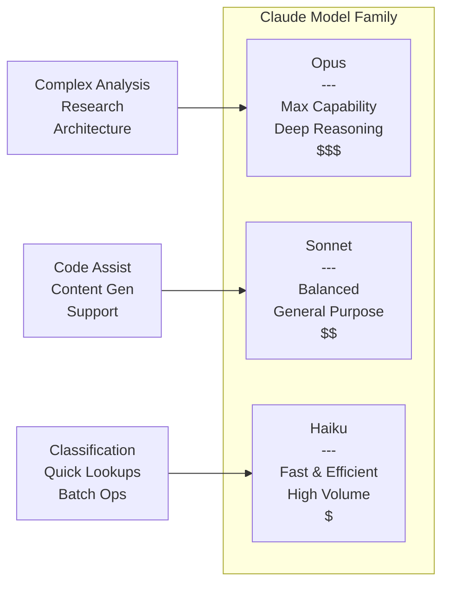

You will integrate Anthropic's Claude models into your NeuroLink-powered applications, from choosing between Opus, Sonnet, and Haiku for each task to building advanced patterns with structured output and agentic workflows. By the end of this tutorial, you will have a working Claude integration with model-tier routing, streaming, tool calling, and cost optimization.

Claude offers distinct capabilities through three model tiers. Now you will learn when to use each tier and how to configure them through NeuroLink's unified interface.

## Understanding the Claude Model Family

Anthropic offers three main model tiers, each optimized for different use cases. Understanding their characteristics helps you choose the right model for each task and optimize both performance and cost.



### Claude Opus: Maximum Capability

Claude Opus represents Anthropic's most capable model, designed for tasks requiring deep reasoning, complex analysis, and nuanced understanding:

```typescript
import { NeuroLink } from '@juspay/neurolink';

const neurolink = new NeuroLink();

// Using Claude Opus for complex analysis
const response = await neurolink.generate({
  input: {
    text: `Analyze this codebase architecture and identify potential
           scalability bottlenecks, security vulnerabilities, and
           opportunities for optimization. Provide specific
           recommendations with implementation details.`
  },
  provider: "anthropic",
  model: "claude-opus-4-5-20251101",
  maxTokens: 8192
});

console.log(response.content);
```

> **Note:** Model names and IDs in code examples reflect versions available at time of writing. Model availability, naming conventions, and pricing change frequently. Always verify current model IDs with your provider's documentation before deploying to production.
{: .prompt-info }

**Opus excels at:**

- Multi-step reasoning and complex problem-solving
- Code architecture analysis and review
- Research synthesis and technical writing
- Tasks requiring broad knowledge integration
- Situations where accuracy is paramount

### Claude Sonnet: Balanced Performance

Sonnet offers an excellent balance between capability and speed, making it suitable for most production workloads:

```typescript
import { NeuroLink } from '@juspay/neurolink';

const neurolink = new NeuroLink();

// Claude Sonnet for everyday tasks
const response = await neurolink.generate({
  input: { text: "Write a TypeScript function that validates email addresses with comprehensive error messages." },
  provider: "anthropic",
  model: "claude-sonnet-4-5-20250929",
  systemPrompt: "You are a helpful coding assistant specializing in JavaScript and TypeScript.",
  maxTokens: 4096
});
```

**Sonnet excels at:**

- General-purpose coding assistance
- Content generation and editing
- Customer support automation
- Data analysis and summarization
- Applications requiring quick response times

### Claude Haiku: Speed and Efficiency

Haiku is optimized for speed and cost-efficiency, ideal for high-volume or latency-sensitive applications:

```typescript
import { NeuroLink } from '@juspay/neurolink';

const neurolink = new NeuroLink();

// Claude Haiku for rapid responses
const response = await neurolink.generate({
  input: { text: 'Classify this customer feedback as positive, negative, or neutral: "The product works but shipping was slow."' },
  provider: "anthropic",
      model: "claude-haiku-4-5-20251001",
  maxTokens: 256
});
```

**Haiku excels at:**

- Classification and categorization
- Quick lookups and simple transformations
- Real-time chat applications
- High-volume batch processing
- Cost-sensitive applications

## Intelligent Model Selection

You can implement dynamic model selection based on task complexity to optimize both performance and cost:

```typescript
import { NeuroLink } from '@juspay/neurolink';

const neurolink = new NeuroLink();

// Select model based on complexity
function selectModel(complexity: 'high' | 'medium' | 'low', tokenCount: number) {
  if (complexity === 'high' || tokenCount > 4000) {
    return "claude-opus-4-5-20251101";
  } else if (complexity === 'medium') {
    return "claude-sonnet-4-5-20250929";
  } else {
    return "claude-haiku-4-5-20251001";
  }
}

async function processRequest(userMessage: string, complexity: 'high' | 'medium' | 'low' = 'medium') {
  const model = selectModel(complexity, userMessage.length);

  return await neurolink.generate({
    input: { text: userMessage },
    provider: "anthropic",
    model
  });
}
```

## Claude-Specific Prompting Techniques

Claude responds particularly well to certain prompting patterns. Understanding these helps you extract maximum value from your interactions.

### The Constitutional Approach

Claude was trained with constitutional AI principles. Framing requests in terms of being helpful, harmless, and honest often yields better results:

```typescript
import { NeuroLink } from '@juspay/neurolink';

const neurolink = new NeuroLink();

const systemPrompt = `You are an expert code reviewer. Your goal is to be:
- Helpful: Provide actionable feedback that improves code quality
- Honest: Point out both strengths and areas for improvement
- Precise: Back up suggestions with specific examples

Review code for correctness, efficiency, maintainability, and security.`;

const response = await neurolink.generate({
  input: { text: `Review this function:\n\n${codeToReview}` },
  provider: "anthropic",
  model: "claude-sonnet-4-5-20250929",
  systemPrompt
});
```

### Structured Output with Schemas

Claude excels at producing structured output. Use Zod schemas for type-safe responses:

```typescript
import { NeuroLink } from '@juspay/neurolink';
import { z } from 'zod';

const neurolink = new NeuroLink();

// Define schema for structured output
const ErrorAnalysis = z.object({
  error_type: z.string(),
  root_cause: z.string(),
  severity: z.enum(['low', 'medium', 'high', 'critical']),
  recommended_actions: z.array(z.string()),
  prevention_steps: z.array(z.string())
});

const response = await neurolink.generate({
  input: { text: `Analyze the following error log:\n\n${errorLog}` },
  provider: "anthropic",
  model: "claude-sonnet-4-5-20250929",
  schema: ErrorAnalysis
});

console.log(response.content); // Type-safe JSON output
```

### Chain-of-Thought Prompting

For complex reasoning tasks, explicitly requesting step-by-step thinking improves accuracy:

```typescript
import { NeuroLink } from '@juspay/neurolink';

const neurolink = new NeuroLink();

const response = await neurolink.generate({
  input: {
    text: `Debug this function. Think through the problem step by step:

1. First, identify what the function is supposed to do
2. Trace through the logic with a sample input
3. Identify where the behavior deviates from expectations
4. Propose a fix with explanation

Function:
${buggyFunction}`
  },
  provider: "anthropic",
  model: "claude-opus-4-5-20251101",
  maxTokens: 4096
});
```

### Role-Based Prompting

Claude performs well when given a clear role with specific expertise:

```typescript
import { NeuroLink } from '@juspay/neurolink';

const neurolink = new NeuroLink();

const expertRoles: Record<string, string> = {
  security: `You are a senior security engineer with expertise in OWASP
             vulnerabilities, penetration testing, and secure coding practices.`,
  performance: `You are a performance optimization specialist who has
                worked on high-scale distributed systems handling millions
                of requests per second.`,
  architecture: `You are a principal software architect with 15 years of
                 experience designing microservices and event-driven systems.`
};

async function getExpertReview(code: string, expertise: keyof typeof expertRoles) {
  return await neurolink.generate({
    input: { text: `Review this code from your perspective:\n\n${code}` },
    provider: "anthropic",
    model: "claude-opus-4-5-20251101",
    systemPrompt: expertRoles[expertise]
  });
}
```

## Building Agentic Workflows with Claude

Claude excels at reasoning through complex tasks. You can build agentic workflows by combining Claude's reasoning capabilities with your application logic:

```typescript
import { NeuroLink } from '@juspay/neurolink';
import { z } from 'zod';

const neurolink = new NeuroLink();

// Define the action schema for Claude's decisions
const AgentAction = z.object({
  action: z.enum(['search_database', 'send_notification', 'respond', 'escalate']),
  parameters: z.record(z.any()).optional(),
  reasoning: z.string()
});

// Claude decides what action to take
async function getNextAction(context: string, history: string[]) {
  const response = await neurolink.generate({
    input: {
      text: `Based on the following context and history, decide the next action to take.

Context: ${context}
History: ${history.join('\n')}

Available actions:
- search_database: Search for products (params: query, category)
- send_notification: Notify user (params: userId, message)
- respond: Generate a response to the user
- escalate: Escalate to human support

Decide the best action and explain your reasoning.`
    },
    provider: "anthropic",
    model: "claude-sonnet-4-5-20250929",
    schema: AgentAction
  });

  // When using schema, response.content may already be a parsed object
  // JSON.parse is only needed if the response is a string
  return typeof response.content === 'string' 
    ? JSON.parse(response.content) 
    : response.content;
}

// Execute the action and continue the loop
async function runAgentLoop(userInput: string) {
  const history: string[] = [];
  let context = userInput;

  for (let i = 0; i < 5; i++) {
    const action = await getNextAction(context, history);
    history.push(`Action: ${action.action} - ${action.reasoning}`);

    if (action.action === 'respond') {
      return await generateFinalResponse(context, history);
    }

    // Execute the action and update context
    const result = await executeAction(action);
    context = `${context}\nResult: ${JSON.stringify(result)}`;
  }
}
```

### ReAct Pattern with Claude

Implement the Reasoning + Acting (ReAct) pattern for complex problem-solving:

```typescript
import { NeuroLink } from '@juspay/neurolink';

const neurolink = new NeuroLink();

async function reactAgent(task: string) {
  const systemPrompt = `You are a helpful assistant that solves problems step by step.
For each step, you should:
1. THOUGHT: Analyze the current situation and decide what to do next
2. ACTION: Specify what action to take (or "FINISH" if done)
3. OBSERVATION: [This will be filled with the result of your action]

Be methodical and verify your work at each step.`;

  let context = `Task: ${task}\n\n`;

  for (let step = 1; step <= 10; step++) {
    const response = await neurolink.generate({
      input: { text: context + `Step ${step}:` },
      provider: "anthropic",
      model: "claude-sonnet-4-5-20250929",
      systemPrompt,
      maxTokens: 1000
    });

    const stepOutput = response.content;
    context += `Step ${step}:\n${stepOutput}\n\n`;

    // Check if the agent wants to finish
    if (stepOutput.includes('ACTION: FINISH')) {
      break;
    }

    // Execute the action and add observation
    const observation = await executeStepAction(stepOutput);
    context += `OBSERVATION: ${observation}\n\n`;
  }

  return context;
}
```

## Best Practices for Claude Integration

### Temperature and Response Control

Claude's behavior can be fine-tuned using temperature and other parameters:

```typescript
import { NeuroLink } from '@juspay/neurolink';

const neurolink = new NeuroLink();

// Creative tasks: higher temperature
const creativeResponse = await neurolink.generate({
  input: { text: 'Write a creative product description for wireless earbuds.' },
  provider: "anthropic",
  model: "claude-sonnet-4-5-20250929",
  temperature: 0.8,
  maxTokens: 1000
});

// Analytical tasks: lower temperature
const analyticalResponse = await neurolink.generate({
  input: { text: 'Analyze this sales data and draw conclusions about trends.' },
  provider: "anthropic",
  model: "claude-opus-4-5-20251101",
  temperature: 0.2,
  maxTokens: 2000
});

// Deterministic outputs: zero temperature
const deterministicResponse = await neurolink.generate({
  input: { text: 'Extract the email addresses from this text: contact@example.com and info@test.org' },
  provider: "anthropic",
  model: "claude-sonnet-4-5-20250929",
  temperature: 0,
  maxTokens: 500
});
```

### Handling Long Contexts

Claude supports substantial context windows. Here's how to manage them effectively:

```typescript
import { NeuroLink } from '@juspay/neurolink';

const neurolink = new NeuroLink();

interface FileContent {
  path: string;
  content: string;
  isCore: boolean;
}

async function analyzeCodebase(files: FileContent[]) {
  // Sort by priority - core files first
  const sortedFiles = files.sort((a, b) => (b.isCore ? 1 : 0) - (a.isCore ? 1 : 0));

  // Build context with file boundaries
  const context = sortedFiles
    .map(f => `### File: ${f.path}\n\`\`\`\n${f.content}\n\`\`\``)
    .join('\n\n');

  // Estimate tokens (rough: ~4 chars per token)
  const estimatedTokens = context.length / 4;
  // Standard context: 200K tokens for most Claude models
  // Extended context: Claude Sonnet 4.5 supports up to 1M tokens
  // with the "anthropic-beta: context-1m-2025-08-07" header
  const maxContextTokens = 200000;

  if (estimatedTokens > maxContextTokens - 8000) {
    console.warn('Context may be too large, consider truncating or using extended context');
  }

  return await neurolink.generate({
    input: { text: `Analyze this codebase:\n\n${context}\n\nProvide a comprehensive review.` },
    provider: "anthropic",
    model: "claude-opus-4-5-20251101",
    maxTokens: 8000
  });
}
```

### Error Handling and Retries

Implement robust error handling for production applications:

```typescript
import { NeuroLink } from '@juspay/neurolink';

const neurolink = new NeuroLink();

async function generateWithRetry(prompt: string, maxRetries = 3): Promise<string> {
  let lastError: Error | null = null;

  for (let attempt = 1; attempt <= maxRetries; attempt++) {
    try {
      const response = await neurolink.generate({
        input: { text: prompt },
        provider: "anthropic",
        model: "claude-sonnet-4-5-20250929",
        maxTokens: 2000
      });
      return response.content;

    } catch (error: any) {
      lastError = error;
      console.log(`Attempt ${attempt} failed: ${error.message}`);

      // Exponential backoff
      if (attempt < maxRetries) {
        const delay = Math.min(1000 * Math.pow(2, attempt - 1), 10000);
        await new Promise(resolve => setTimeout(resolve, delay));
      }
    }
  }

  throw lastError;
}

// With fallback models
async function generateWithFallback(prompt: string): Promise<string> {
  const models = [
    { provider: "anthropic" as const, model: "claude-sonnet-4-5-20250929" },
    { provider: "anthropic" as const, model: "claude-haiku-4-5-20251001" },
    { provider: "openai" as const, model: "gpt-4o" }
  ];

  for (const { provider, model } of models) {
    try {
      const response = await neurolink.generate({
        input: { text: prompt },
        provider,
        model,
        maxTokens: 2000
      });
      return response.content;
    } catch (error) {
      console.log(`${provider}/${model} failed, trying fallback...`);
    }
  }

  throw new Error('All models failed');
}
```

### Streaming Responses

For real-time applications, use streaming to improve perceived latency:

```typescript
import { NeuroLink } from '@juspay/neurolink';

const neurolink = new NeuroLink();

// Generate with streaming enabled
const result = await neurolink.stream({
  input: { text: 'Explain quantum computing in simple terms.' },
  provider: "anthropic",
  model: "claude-sonnet-4-5-20250929",
  maxTokens: 1000
});

// Handle streamed response - result.stream is a ReadableStream
for await (const chunk of result.stream) {
  if ('content' in chunk) {
    process.stdout.write(chunk.content);
  }
}
```

## Cost Optimization Strategies

### Model Tiering for Cost Efficiency

Use the right model for each task complexity level:

```typescript
import { NeuroLink } from '@juspay/neurolink';

const neurolink = new NeuroLink();

// Cost-effective model selection based on task
type TaskType = 'classification' | 'generation' | 'analysis' | 'reasoning';

const modelTiers: Record<TaskType, string> = {
  classification: "claude-haiku-4-5-20251001",  // Cheapest, fast
  generation: "claude-sonnet-4-5-20250929",     // Balanced
  analysis: "claude-sonnet-4-5-20250929",       // Good quality
  reasoning: "claude-opus-4-5-20251101"         // Best for complex tasks
};

async function processTask(task: TaskType, input: string) {
  return await neurolink.generate({
    input: { text: input },
    provider: "anthropic",
    model: modelTiers[task],
    maxTokens: task === 'classification' ? 100 : 2000
  });
}

// Batch classification with Haiku (cost-effective)
async function batchClassify(items: string[]) {
  return Promise.all(items.map(item =>
    neurolink.generate({
      input: { text: `Classify this feedback as positive, negative, or neutral: "${item}"` },
      provider: "anthropic",
  model: "claude-haiku-4-5-20251001",
      maxTokens: 50
    })
  ));
}
```

### Prompt Optimization

Minimize token usage while maintaining quality:

```typescript
import { NeuroLink } from '@juspay/neurolink';

const neurolink = new NeuroLink();

// Efficient prompt structure
function createOptimizedPrompt(task: string, context: string) {
  // Remove redundant whitespace
  const cleanContext = context.replace(/\s+/g, ' ').trim();

  // Use concise instructions
  return `Task: ${task}
Context: ${cleanContext}
Respond concisely.`;
}

// Estimate and control costs
function estimateTokens(text: string): number {
  // Rough estimate: ~4 characters per token for English
  return Math.ceil(text.length / 4);
}

async function generateWithBudget(prompt: string, maxBudgetTokens: number) {
  const inputTokens = estimateTokens(prompt);
  const availableOutputTokens = maxBudgetTokens - inputTokens;

  if (availableOutputTokens < 100) {
    throw new Error('Prompt too long for budget');
  }

  return await neurolink.generate({
    input: { text: prompt },
    provider: "anthropic",
    model: "claude-sonnet-4-5-20250929",
    maxTokens: Math.min(availableOutputTokens, 4000)
  });
}
```

## Monitoring and Observability

Track Claude usage and performance in your applications:

```typescript
import { NeuroLink } from '@juspay/neurolink';

const neurolink = new NeuroLink();

// Simple metrics tracking
interface RequestMetrics {
  model: string;
  inputTokens: number;
  outputTokens: number;
  latencyMs: number;
  success: boolean;
  timestamp: Date;
}

const metricsStore: RequestMetrics[] = [];

async function generateWithMetrics(prompt: string, model: string) {
  const startTime = Date.now();

  try {
    const response = await neurolink.generate({
      input: { text: prompt },
      provider: "anthropic",
      model,
      maxTokens: 2000
    });

    metricsStore.push({
      model,
      inputTokens: response.usage?.input || 0,
      outputTokens: response.usage?.output || 0,
      latencyMs: Date.now() - startTime,
      success: true,
      timestamp: new Date()
    });

    return response;

  } catch (error) {
    metricsStore.push({
      model,
      inputTokens: 0,
      outputTokens: 0,
      latencyMs: Date.now() - startTime,
      success: false,
      timestamp: new Date()
    });
    throw error;
  }
}

// Analyze metrics
function getMetricsSummary() {
  const total = metricsStore.length;
  const successful = metricsStore.filter(m => m.success).length;
  const totalTokens = metricsStore.reduce((sum, m) => sum + m.inputTokens + m.outputTokens, 0);
  const avgLatency = metricsStore.reduce((sum, m) => sum + m.latencyMs, 0) / total;

  const byModel = metricsStore.reduce((acc, m) => {
    acc[m.model] = (acc[m.model] || 0) + 1;
    return acc;
  }, {} as Record<string, number>);

  return {
    totalRequests: total,
    successRate: (successful / total) * 100,
    totalTokens,
    averageLatencyMs: avgLatency,
    modelDistribution: byModel
  };
}

// Usage
const response = await generateWithMetrics(
  'Explain machine learning',
  "claude-sonnet-4-5-20250929"
);

console.log(getMetricsSummary());
```

## What You Built

You configured Claude models through NeuroLink with the right tier for each task -- Opus for complex reasoning, Sonnet for general tasks, Haiku for high-volume operations. You built agentic workflows that leverage Claude's reasoning for multi-step tasks, implemented tool use for powerful automation, optimized prompts with Claude-specific patterns like constitutional framing and explicit structure requests, and set up production patterns including streaming, caching, retries, and fallbacks.

For more advanced patterns, explore our guides on [prompt engineering](/posts/prompt-engineering-neurolink/), [streaming best practices](/posts/streaming-best-practices/), and [cost optimization strategies](/posts/cost-optimization-strategies/).

---

**Related posts:**

- [Prompt Engineering with NeuroLink: A Developer's Guide](/posts/prompt-engineering-neurolink/)
- [AWS Bedrock Integration Guide with NeuroLink](/posts/aws-bedrock-integration/)
- [LLM Cost Optimization: Practical Strategies to Reduce Your AI Spend](/posts/cost-optimization-strategies/)
