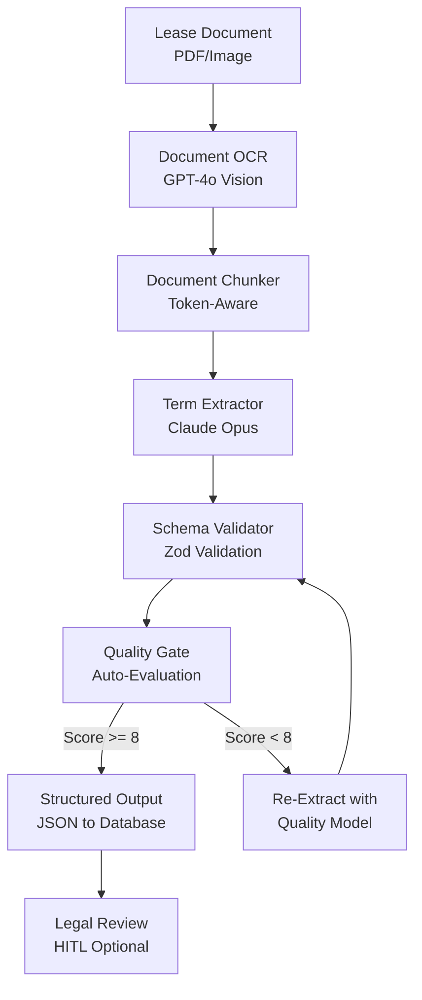

You will build a lease abstraction pipeline that extracts critical terms from commercial lease documents at 99%+ accuracy while reducing cost from hundreds of dollars per lease to under a dollar. By the end of this tutorial, you will have OCR processing with GPT-4o Vision, term extraction with Claude Opus, Zod schema validation, automated quality gates with auto-evaluation, and optional HITL review for edge cases.

> **Note:** Accuracy figures depend heavily on document quality, lease complexity, and extraction field types. The 99%+ target applies to structured fields (dates, amounts) with clear formatting. Complex clauses and non-standard lease language require human review. Always validate AI-extracted terms against source documents for legal and financial decisions.
{: .prompt-info }

Getting a rent amount wrong by a single digit or missing a termination clause has real financial and legal consequences. This is not a use case where 80% accuracy is acceptable. You will build quality gates that catch errors before they reach the database.

Next, you will set up the multi-stage pipeline architecture with the optimal model for each stage.

## Lease Abstraction Architecture

The pipeline follows a multi-stage pattern where each stage uses the optimal AI provider for its task:



Each stage has a specific purpose and provider choice:

- **OCR**: GPT-4o's multimodal capabilities handle scanned PDFs, photographed documents, and poor-quality images. It converts visual documents to clean text.
- **Chunking**: Token-aware splitting respects LLM context limits while maintaining semantic coherence by splitting on section headers.
- **Extraction**: Claude Opus excels at understanding complex legal language, nested clauses, and cross-references within lease documents.
- **Validation**: Zod schema validation ensures the extracted data conforms to the expected structure before database insertion.
- **Evaluation**: NeuroLink's auto-evaluation provides a quality gate -- extractions scoring below threshold are re-extracted with a different provider for a second opinion.
- **HITL**: Optional human review for edge cases or high-value leases.

## Document Processing Pipeline

The first step is configuring providers for each stage of the pipeline. Different providers bring different strengths, and using the right model for each task is how you achieve both high accuracy and reasonable cost:

```typescript
import { NeuroLink } from '@juspay/neurolink';

const neurolink = new NeuroLink({
  conversationMemory: { enabled: true },
});

// OCR: GPT-4o for multimodal document understanding
const ocrResult = await neurolink.generate({
  input: { text: "Extract all text from this lease document, preserving section headers and numbering." },
  provider: "openai",
  model: "gpt-4o",
  // In practice, you would pass the document image/PDF as multimodal input
});

// Extraction: Claude Opus for complex legal reasoning
const extractionResult = await neurolink.generate({
  input: { text: extractionPrompt },
  provider: "bedrock",
  model: "anthropic.claude-3-opus-20240229-v1:0",
});

// Re-extraction fallback: Gemini Pro for verification from a different perspective
const verificationResult = await neurolink.generate({
  input: { text: extractionPrompt },
  provider: "vertex",
  model: "gemini-2.5-pro",
});
```

The multi-provider approach is deliberate. If Claude Opus extracts a rent amount and Gemini Pro extracts the same amount independently, confidence is high. If they disagree, the discrepancy triggers human review. This cross-provider verification is a powerful pattern for high-stakes document processing.

> **Note:** Use `createBestProvider()` from `AIProviderFactory` when you want NeuroLink to automatically select the optimal provider based on the task characteristics rather than hardcoding provider choices.
{: .prompt-info }

## Structured Extraction with Schema Validation

The heart of lease abstraction is extracting structured data from unstructured legal text. Define a comprehensive Zod schema that captures all the terms your system needs:

```typescript
import { z } from "zod";

// Lease abstraction schema
const LeaseAbstractionSchema = z.object({
  propertyAddress: z.string(),
  landlord: z.string(),
  tenant: z.string(),
  leaseType: z.enum(["gross", "net", "triple-net", "modified-gross"]),
  commencementDate: z.string(),
  expirationDate: z.string(),
  baseRent: z.object({
    amount: z.number(),
    frequency: z.enum(["monthly", "quarterly", "annually"]),
    escalations: z.array(z.object({
      date: z.string(),
      newAmount: z.number(),
      percentage: z.number().optional(),
    })),
  }),
  renewalOptions: z.array(z.object({
    term: z.string(),
    noticeRequired: z.string(),
    rentAdjustment: z.string(),
  })),
  terminationClauses: z.array(z.object({
    condition: z.string(),
    noticePeriod: z.string(),
    penalty: z.string().optional(),
  })),
  maintenanceResponsibilities: z.object({
    landlord: z.array(z.string()),
    tenant: z.array(z.string()),
  }),
  securityDeposit: z.number().optional(),
  insuranceRequirements: z.array(z.string()),
});
```

With the schema defined, build the extraction prompt and validate the result. First, add a helper to handle LLM responses that may be wrapped in markdown code fences:

```typescript
function parseJsonResponse(text: string): unknown {
  const fenced = text.match(/```(?:json)?\s*([\s\S]*?)```/);
  return JSON.parse(fenced ? fenced[1].trim() : text.trim());
}
```

```typescript
// Extraction with structured output instructions
const extractionPrompt = `
Extract all lease terms from the following document into this exact JSON schema:
${JSON.stringify(LeaseAbstractionSchema.shape, null, 2)}

Rules:
- Extract EXACT dollar amounts (no rounding)
- Dates in ISO 8601 format (YYYY-MM-DD)
- If a field is not found in the document, use null
- For escalations, calculate percentage if only dollar amounts are given
- Include ALL renewal options and termination clauses

Document text:
${documentChunk}
`;

const result = await neurolink.generate({
  input: { text: extractionPrompt },
  provider: "bedrock",
  model: "anthropic.claude-3-opus-20240229-v1:0",
});

// Validate against schema
const parsed = LeaseAbstractionSchema.safeParse(parseJsonResponse(result.content));
if (!parsed.success) {
  console.error("Extraction failed validation:", parsed.error.issues);

  // Re-extract with different provider for a second attempt
  const reResult = await neurolink.generate({
    input: { text: extractionPrompt },
    provider: "vertex",
    model: "gemini-2.5-pro",
  });

  const reParsed = LeaseAbstractionSchema.safeParse(parseJsonResponse(reResult.content));
  if (!reParsed.success) {
    // Both providers failed validation -- flag for human review
    await flagForHumanReview(documentChunk, parsed.error, reParsed.error);
  }
}
```

The `safeParse` pattern is critical. It never throws -- instead it returns a result object with either the validated data or detailed error information. When extraction fails validation, the system tries a different provider. If both fail, the document is flagged for human review. This three-tier approach (extract, re-extract, human review) ensures nothing falls through the cracks.

> **Note:** Zod is the same validation library used internally by NeuroLink's `EvaluationSchema`. Using it for your domain schemas keeps your validation patterns consistent across the stack.
{: .prompt-info }

## Auto-Evaluation Quality Gate

Schema validation catches structural errors (missing fields, wrong types), but it does not catch semantic errors (extracting the wrong rent amount, confusing landlord and tenant names). For that, you need NeuroLink's evaluation system:

```typescript
import { generateEvaluation } from '@juspay/neurolink';

const evaluation = await generateEvaluation({
  userQuery: `Extract all lease terms from commercial lease for ${propertyAddress}`,
  aiResponse: JSON.stringify(extractedTerms),
  primaryDomain: "real-estate",
  toolUsage: [
    { toolName: "document-ocr", result: ocrConfidence },
  ],
});

// Quality gate thresholds for financial/legal data
const ACCURACY_THRESHOLD = 8;
const COMPLETENESS_THRESHOLD = 8;

if (evaluation.accuracy >= ACCURACY_THRESHOLD &&
    evaluation.completeness >= COMPLETENESS_THRESHOLD) {
  // High confidence - save to database
  await saveLeaseAbstraction(extractedTerms);
} else if (evaluation.accuracy >= 6) {
  // Medium confidence - flag for review
  await flagForReview(extractedTerms, evaluation);
} else {
  // Low confidence - re-extract with quality model
  await reExtractWithQualityModel(documentChunk);
}
```

The three-tier quality routing is designed for the risk profile of financial and legal data:

- **Score 8-10**: High confidence. The extraction is accurate and complete. Save directly to the database.
- **Score 6-7**: Medium confidence. The extraction is mostly correct but may have issues. Flag for a quick human review.
- **Score 0-5**: Low confidence. Something went wrong. Re-extract with a different provider or model.

Setting `primaryDomain: "real-estate"` enables domain-specific scoring that understands the importance of precise dollar amounts, dates, and legal terminology in lease documents.

## Middleware for Processing Pipeline

For a production pipeline processing hundreds of leases, you need guardrails, analytics, and auto-evaluation running on every extraction. NeuroLink's `MiddlewareFactory` configures this in one place:

```typescript
import { MiddlewareFactory } from '@juspay/neurolink';

const leaseMiddleware = new MiddlewareFactory({
  preset: "all", // analytics + guardrails
  middlewareConfig: {
    guardrails: {
      enabled: true,
      config: {
        badWords: ["confidential-watermark", "draft-only"],
        precallEvaluation: { enabled: true },
      },
    },
    analytics: {
      enabled: true,
      config: {
        trackTokenUsage: true,
        trackCost: true,
      },
    },
    autoEvaluation: {
      enabled: true,
    },
  },
});

// Track processing stats
const stats = leaseMiddleware.getChainStats(
  leaseMiddleware.createContext("bedrock", "claude-3-opus"),
  { guardrails: { enabled: true }, analytics: { enabled: true } }
);
```

The `"all"` preset activates both analytics and guardrails simultaneously. The guardrails configuration includes `badWords` for filtering out documents that contain draft watermarks or confidentiality markers that should not be processed. The `precallEvaluation` option validates the prompt before sending it to the AI, catching malformed extraction requests early.

Analytics tracking with `trackTokenUsage` and `trackCost` gives you per-document cost visibility, essential for pricing your lease abstraction service.

## Token-Aware Document Chunking

Commercial leases routinely exceed 50,000 tokens, far beyond the context window of most models. Chunking is essential, but naive chunking (splitting every N tokens) breaks semantic coherence and causes the AI to miss cross-section references.

The smart approach is to chunk by section headers while maintaining overlap:

```typescript
function chunkLeaseDocument(text: string, maxTokens: number = 4000): string[] {
  const sections = text.split(/(?=ARTICLE\s+\d+|SECTION\s+\d+)/i);
  const chunks: string[] = [];
  let currentChunk = "";
  let currentTokens = 0;

  for (const section of sections) {
    const sectionTokens = estimateTokens(section);

    if (currentTokens + sectionTokens > maxTokens && currentChunk) {
      chunks.push(currentChunk);
      // Keep last 200 tokens as overlap for cross-references
      currentChunk = getLastNTokens(currentChunk, 200) + section;
      currentTokens = estimateTokens(currentChunk);
    } else {
      currentChunk += section;
      currentTokens += sectionTokens;
    }
  }

  if (currentChunk) chunks.push(currentChunk);
  return chunks;
}
```

The 200-token overlap captures cross-section references like "as defined in Section 3.2" that would otherwise be lost at chunk boundaries. For section identification, use a fast model (Gemini Flash) to find section boundaries, then use a quality model (Claude Opus) for the actual extraction from each chunk.

After processing all chunks, merge the extracted terms and resolve any conflicts:

```typescript
async function processFullLease(document: string) {
  const chunks = chunkLeaseDocument(document);
  const extractions = [];

  for (const chunk of chunks) {
    const result = await neurolink.generate({
      input: { text: buildExtractionPrompt(chunk) },
      provider: "bedrock",
      model: "anthropic.claude-3-opus-20240229-v1:0",
    });
    extractions.push(parseJsonResponse(result.content));
  }

  // Merge extractions from all chunks
  return mergeExtractions(extractions);
}
```

## Cost Analysis

The economics of AI lease abstraction are compelling:

| Stage | Model | Cost per Lease |
|---|---|---|
| OCR (GPT-4o) | 50-100 page scanned PDF | ~$0.15 |
| Extraction (Claude Opus) | ~50,000 tokens of legal text | ~$0.10 |
| Evaluation (Gemini Flash) | Quality gate scoring | ~$0.005 |
| Re-extraction (when needed) | ~20% of leases need re-extraction | ~$0.02 avg |
| **Total AI Cost** | | **~$0.28/lease** |
| **Manual Processing** | Paralegal/analyst time | **$50-$200/lease** |

At scale, processing 1,000 leases per month costs approximately $280 in AI charges versus $50,000-$200,000 for manual processing. Even with engineering costs for building and maintaining the pipeline, the ROI is achieved within the first month.

> **Note:** The cost estimates assume average document lengths. Very long leases (200+ pages) or documents requiring multiple re-extractions will cost more. Track per-document costs using NeuroLink's analytics middleware.
{: .prompt-info }

## What You Built

You built an AI lease abstraction pipeline with multi-provider orchestration (GPT-4o for OCR, Claude Opus for extraction, Gemini Flash for evaluation), Zod schema validation for structural correctness, auto-evaluation for semantic correctness with configurable quality thresholds, and HITL approval for edge cases that fall below the confidence threshold. The pipeline processes leases at approximately $0.28 each versus $50-$200 for manual processing.

The same architecture applies to insurance policy analysis, loan document processing, regulatory compliance review, and any domain where accuracy matters and manual processing is expensive. For related patterns, explore:

- **Government document processing** -- similar multi-stage extraction with compliance requirements
- **Manufacturing knowledge bases** -- document-heavy RAG pipelines for operational knowledge
- **Insurance claims processing** -- multi-stage document pipelines with fraud detection

---

**Related posts:**

- [Building RAG Applications with NeuroLink SDK](/posts/rag-implementation/)
- [Structured Output: JSON Schema Enforcement with NeuroLink](/posts/structured-output-json/)
- [Multimodal Document Processing with NeuroLink](/posts/multimodal-document-processing/)
