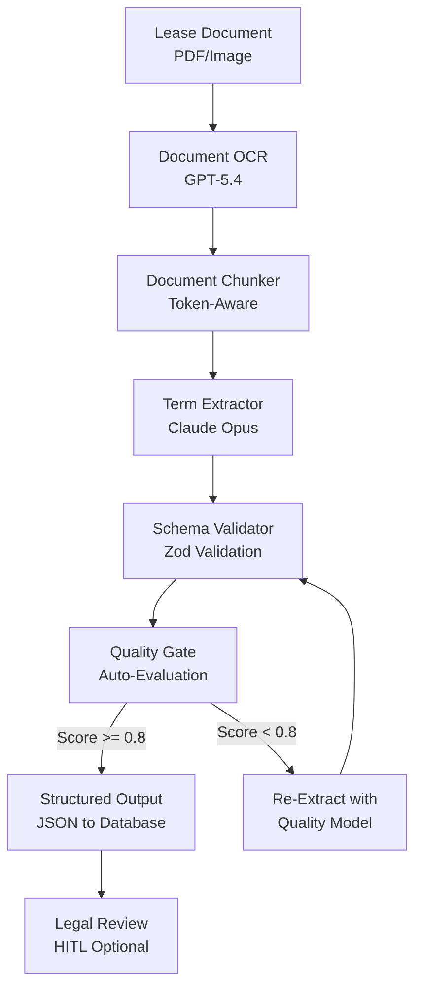

You will build a quality-first lease abstraction pipeline for extracting critical terms from commercial lease documents. By the end of this tutorial, you will have multimodal document processing with GPT-5.4, term extraction with Claude Opus on Bedrock, Zod schema validation, source-grounded evaluation, and optional HITL review for edge cases.

> **Note:** Extraction quality depends heavily on document quality, lease complexity, and field type. Complex clauses and non-standard language require human review. Always validate AI-extracted terms against source documents before making legal or financial decisions.
{: .prompt-info }

Getting a rent amount wrong by a single digit or missing a termination clause has real financial and legal consequences. This is not a use case where 80% accuracy is acceptable. You will build quality gates that catch errors before they reach the database.

Next, you will set up the multi-stage pipeline architecture with the optimal model for each stage.

## Lease Abstraction Architecture

The pipeline follows a multi-stage pattern where each stage uses the optimal AI provider for its task:


```mermaid
flowchart TB
    Lease[Lease Document<br/>PDF/Image] --> OCR[Document OCR<br/>GPT-5.4]
    OCR --> Chunk[Document Chunker<br/>Token-Aware]
    Chunk --> Extract[Term Extractor<br/>Claude Opus]
    Extract --> Validate[Schema Validator<br/>Zod Validation]
    Validate --> Evaluate[Quality Gate<br/>Auto-Evaluation]
    Evaluate -->|Score >= 0.8| Output[Structured Output<br/>JSON to Database]
    Evaluate -->|Score < 0.8| ReExtract[Re-Extract with<br/>Quality Model]
    ReExtract --> Validate
    Output --> Legal[Legal Review<br/>HITL Optional]
```

Each stage has a specific purpose and provider choice:

- **OCR**: GPT-5.4's multimodal capabilities handle scanned PDFs and document images. It converts visual documents to clean text.
- **Chunking**: Token-aware splitting respects LLM context limits while maintaining semantic coherence by splitting on section headers.
- **Extraction**: Claude Opus excels at understanding complex legal language, nested clauses, and cross-references within lease documents.
- **Validation**: Zod schema validation ensures the extracted data conforms to the expected structure before database insertion.
- **Evaluation**: NeuroLink's evaluation pipeline scores the extraction against source text; results below your calibrated threshold are re-extracted or sent for review.
- **HITL**: Optional human review for edge cases or high-value leases.

## Document Processing Pipeline

The first step is configuring providers for each stage of the pipeline. Different providers bring different strengths, and using the right model for each task is how you achieve both high accuracy and reasonable cost:

```typescript
import { readFileSync } from 'node:fs';
import { NeuroLink } from '@juspay/neurolink';

const neurolink = new NeuroLink({
  conversationMemory: { enabled: true },
});

// OCR: GPT-5.4 for multimodal document understanding
const leasePdf = readFileSync("lease.pdf");
const ocrResult = await neurolink.generate({
  input: {
    text: "Extract all text from this lease document, preserving section headers and numbering.",
    pdfFiles: [leasePdf],
  },
  provider: "openai",
  model: "gpt-5.4",
});

// Extraction: Claude Opus for complex legal reasoning
const extractionResult = await neurolink.generate({
  input: { text: extractionPrompt },
  provider: "bedrock",
  model: "anthropic.claude-opus-4-6-v1",
});

// Re-extraction fallback: Gemini Pro for verification from a different perspective
const verificationResult = await neurolink.generate({
  input: { text: extractionPrompt },
  provider: "vertex",
  model: "gemini-2.5-pro",
});
```

The multi-provider approach is deliberate. Agreement between Claude Opus and Gemini Pro is a useful signal, but it is not proof that either extraction matches the source. Route disagreements to human review and evaluate agreements against the original lease text before saving them.

> **Note:** `AIProviderFactory.createBestProvider()` is useful for environment-driven provider discovery: it tries a requested provider or selects one with configured credentials. It does not rank providers by legal-document quality, cost, or latency.
{: .prompt-info }

## Structured Extraction with Schema Validation

The heart of lease abstraction is extracting structured data from unstructured legal text. Define a comprehensive Zod schema that captures all the terms your system needs:

```typescript
import { z } from "zod";

// Lease abstraction schema
const LeaseAbstractionSchema = z.object({
  propertyAddress: z.string(),
  landlord: z.string(),
  tenant: z.string(),
  leaseType: z.enum(["gross", "net", "triple-net", "modified-gross"]),
  commencementDate: z.string(),
  expirationDate: z.string(),
  baseRent: z.object({
    amount: z.number(),
    frequency: z.enum(["monthly", "quarterly", "annually"]),
    escalations: z.array(z.object({
      date: z.string(),
      newAmount: z.number(),
      percentage: z.number().optional(),
    })),
  }),
  renewalOptions: z.array(z.object({
    term: z.string(),
    noticeRequired: z.string(),
    rentAdjustment: z.string(),
  })),
  terminationClauses: z.array(z.object({
    condition: z.string(),
    noticePeriod: z.string(),
    penalty: z.string().optional(),
  })),
  maintenanceResponsibilities: z.object({
    landlord: z.array(z.string()),
    tenant: z.array(z.string()),
  }),
  securityDeposit: z.number().optional(),
  insuranceRequirements: z.array(z.string()),
});
```

With the schema defined, pass it directly to `generate()`. NeuroLink returns the parsed value through `structuredData`, so you do not need to strip markdown fences or call `JSON.parse()` yourself:

```typescript
const extractionPrompt = `
Extract all lease terms from the document below.

Rules:
- Extract exact dollar amounts without rounding
- Use ISO 8601 dates (YYYY-MM-DD)
- Do not invent a value when the document does not supply one
- Include every renewal option and termination clause

Document text:
${documentChunk}
`;

const result = await neurolink.generate({
  input: { text: extractionPrompt },
  provider: "bedrock",
  model: "anthropic.claude-opus-4-6-v1",
  schema: LeaseAbstractionSchema,
});

const parsed = LeaseAbstractionSchema.safeParse(result.structuredData);
if (!parsed.success) {
  console.error("Extraction failed validation:", parsed.error.issues);

  // Re-extract with a different provider for a second attempt
  const reResult = await neurolink.generate({
    input: { text: extractionPrompt },
    provider: "vertex",
    model: "gemini-2.5-pro",
    schema: LeaseAbstractionSchema,
  });

  const reParsed = LeaseAbstractionSchema.safeParse(reResult.structuredData);
  if (!reParsed.success) {
    // Both providers failed validation -- flag for human review
    await flagForHumanReview(documentChunk, parsed.error, reParsed.error);
  }
}
```

The `safeParse` pattern is critical. It never throws -- instead it returns a result object with either the validated data or detailed error information. When extraction fails validation, the system tries a different provider. If both fail, the document is flagged for human review. This three-tier approach (extract, re-extract, human review) prevents schema-invalid output from being saved automatically.

> **Note:** Zod is the same validation library used internally by NeuroLink's `EvaluationSchema`. Using it for your domain schemas keeps your validation patterns consistent across the stack.
{: .prompt-info }

## Auto-Evaluation Quality Gate

Schema validation catches structural errors (missing fields, wrong types), but it does not catch semantic errors (extracting the wrong rent amount, confusing landlord and tenant names). For that, evaluate the extraction against its source text with NeuroLink's RAG evaluation preset:

```typescript
import {
  EvaluationPipeline,
  RAG_PIPELINE,
} from '@juspay/neurolink';

const pipeline = new EvaluationPipeline(RAG_PIPELINE);
const evaluation = await pipeline.execute({
  query: `Extract all lease terms for ${propertyAddress}`,
  response: JSON.stringify(extractedTerms),
  context: [documentChunk],
});

if (evaluation.passed && evaluation.overallScore >= 0.8) {
  // Meets the configured quality gate -- save to database
  await saveLeaseAbstraction(extractedTerms);
} else if (evaluation.overallScore >= 0.6) {
  // Borderline result -- require human review
  await flagForReview(extractedTerms, evaluation);
} else {
  // Low score -- re-extract with a different provider or model
  await reExtractWithQualityModel(documentChunk);
}
```

The three-tier routing reflects the risk profile of financial and legal data:

- **0.8-1.0 and passing**: Save the extraction after the source-grounded scorers pass.
- **0.6-0.79**: Flag the extraction for human review.
- **Below 0.6**: Re-extract with a different provider or model, then evaluate again.

Treat these thresholds as application policy rather than universal accuracy guarantees. Calibrate them with a labeled validation set from your own lease formats, and keep human review in the path for high-value or ambiguous clauses.

## Middleware for Processing Pipeline

You can apply analytics, guardrails, and response auto-evaluation to each extraction through the `middleware` option on `generate()`. Keep the source-grounded RAG evaluation from the previous section as a separate gate: the middleware's response score does not replace comparison against the lease text.

```typescript
const result = await neurolink.generate({
  input: { text: extractionPrompt },
  provider: "bedrock",
  model: "anthropic.claude-opus-4-6-v1",
  schema: LeaseAbstractionSchema,
  middleware: {
    preset: "all", // analytics + guardrails
    middlewareConfig: {
      guardrails: {
        enabled: true,
        config: {
          badWords: {
            enabled: true,
            list: ["confidential-watermark", "draft-only"],
          },
          precallEvaluation: { enabled: true },
        },
      },
      autoEvaluation: {
        enabled: true,
        config: {
          threshold: 8,
          maxRetries: 1,
          blocking: true,
        },
      },
    },
  },
});

console.log(result.usage); // input, output, and total tokens
```

The `"all"` preset enables analytics and guardrails; `autoEvaluation` is enabled explicitly. Content filtering redacts configured watermark phrases rather than deciding whether a document is legally eligible for processing, so enforce document-status rules separately in application code. The returned `usage` object provides token counts that you can combine with your provider's current pricing for per-document cost tracking.

## Token-Aware Document Chunking

Long commercial leases can reach tens of thousands of tokens. Current flagship models may fit such documents in one context window, but section-aware chunking still helps control cost, localize evidence, and retry only the sections that fail validation. Naive chunking (splitting every N tokens) can break semantic coherence and hide cross-section references.

The smart approach is to chunk by section headers while maintaining overlap:

```typescript
function chunkLeaseDocument(text: string, maxTokens: number = 4000): string[] {
  const sections = text.split(/(?=ARTICLE\s+\d+|SECTION\s+\d+)/i);
  const chunks: string[] = [];
  let currentChunk = "";
  let currentTokens = 0;

  for (const section of sections) {
    const sectionTokens = estimateTokens(section);

    if (currentTokens + sectionTokens > maxTokens && currentChunk) {
      chunks.push(currentChunk);
      // Keep last 200 tokens as overlap for cross-references
      currentChunk = getLastNTokens(currentChunk, 200) + section;
      currentTokens = estimateTokens(currentChunk);
    } else {
      currentChunk += section;
      currentTokens += sectionTokens;
    }
  }

  if (currentChunk) chunks.push(currentChunk);
  return chunks;
}
```

The 200-token overlap captures cross-section references like "as defined in Section 3.2" that would otherwise be lost at chunk boundaries. For section identification, use a fast model (Gemini Flash) to find section boundaries, then use a quality model (Claude Opus) for the actual extraction from each chunk.

After processing all chunks, merge the extracted terms and resolve any conflicts:

```typescript
async function processFullLease(document: string) {
  const chunks = chunkLeaseDocument(document);
  const extractions = [];

  for (const chunk of chunks) {
    const result = await neurolink.generate({
      input: { text: buildExtractionPrompt(chunk) },
      provider: "bedrock",
      model: "anthropic.claude-opus-4-6-v1",
      schema: LeaseAbstractionSchema,
    });
    extractions.push(LeaseAbstractionSchema.parse(result.structuredData));
  }

  // Merge extractions from all chunks
  return mergeExtractions(extractions);
}
```

## Cost Measurement

Do not rely on a fixed per-lease estimate: document length, image count, model pricing, retries, and evaluation frequency all change the result. Measure each stage from the `usage` returned by NeuroLink and apply the current provider price for the exact model you invoked:

```typescript
import type { GenerateResult } from '@juspay/neurolink';

type StageUsage = {
  stage: "ocr" | "extraction" | "evaluation" | "re-extraction";
  provider: string;
  model: string;
  inputTokens: number;
  outputTokens: number;
};

function recordStageUsage(
  stage: StageUsage["stage"],
  result: GenerateResult,
): StageUsage {
  return {
    stage,
    provider: result.provider ?? "unknown",
    model: result.model ?? "unknown",
    inputTokens: result.usage?.input ?? 0,
    outputTokens: result.usage?.output ?? 0,
  };
}
```

Store these records with the document ID, then calculate costs from your provider's current pricing table. This lets you compare one-pass extraction with re-extraction and human-review rates using your own corpus instead of assuming a universal lease length or success rate.

## What You Built

You built an AI lease abstraction pipeline with multi-provider orchestration (GPT-5.4 for document OCR, Claude Opus on Bedrock for extraction, and NeuroLink's source-grounded RAG evaluation), Zod schema validation for structural correctness, configurable quality thresholds, usage tracking, and HITL review for results that fall below the confidence threshold.

The same architecture applies to insurance policy analysis, loan document processing, regulatory compliance review, and any domain where accuracy matters and manual processing is expensive. For related patterns, explore:

- **Government document processing** -- similar multi-stage extraction with compliance requirements
- **Manufacturing knowledge bases** -- document-heavy RAG pipelines for operational knowledge
- **Insurance claims processing** -- multi-stage document pipelines with fraud detection

---

**Related posts:**

- [Building RAG Applications with NeuroLink SDK](/posts/rag-implementation/)
- [Structured Output: JSON Schema Enforcement with NeuroLink](/posts/structured-output-json/)
- [Multimodal Document Processing with NeuroLink](/posts/multimodal-document-processing/)
