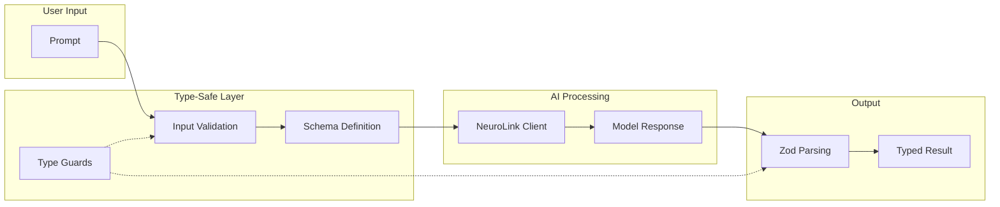
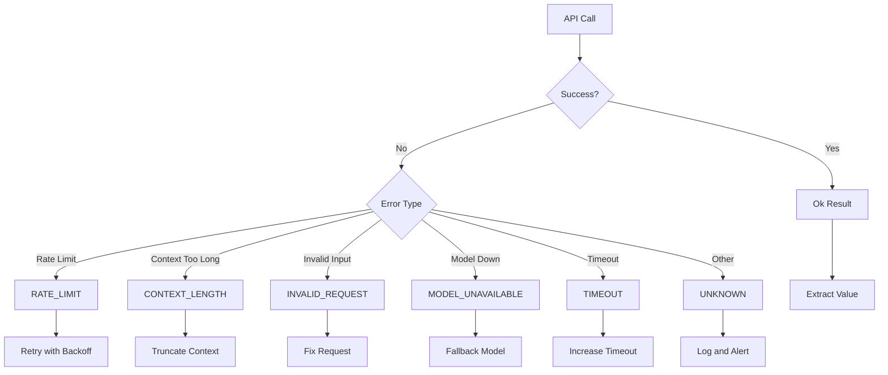

You will learn TypeScript patterns specifically designed for AI application development with NeuroLink. By the end of this tutorial, you will have type-safe provider configurations, Zod schema patterns for structured output, generic wrappers for AI generation, and error handling patterns that make refactoring safe across your AI codebase.

## Why TypeScript Matters for AI Applications



AI applications handle inherently unpredictable data. Language model outputs vary, user inputs surprise us, and API responses change. TypeScript transforms these challenges from runtime mysteries into compile-time certainties.

Consider a typical AI application flow: user input arrives, gets processed, sent to a model, the response is parsed, and results are presented. Without type safety, any step can fail silently. TypeScript catches mismatches before they reach production.

```typescript
// Without types - errors hide until runtime
async function processQuery(input) {
  const response = await model.generate(input);
  return response.text.trim(); // What if text doesn't exist?
}

// With NeuroLink types - errors surface immediately
import { NeuroLink, GenerateResult } from '@juspay/neurolink';

const neurolink = new NeuroLink();

async function processQuery(input: string): Promise<string> {
  const response: GenerateResult = await neurolink.generate({
    input: { text: input }
  });
  return response.content.trim(); // TypeScript ensures content exists
}
```

The investment in type definitions pays dividends throughout the application lifecycle.

## Type Inference and When to Be Explicit

TypeScript's inference engine handles many situations automatically. Understanding when to rely on inference versus explicit annotations improves code readability and maintainability.

### Let Inference Work

TypeScript excels at inferring types from context. Trust it for local variables and return types of simple functions:

```typescript
// Inference handles these well
const modelName = 'neurolink-v2'; // inferred as string
const maxTokens = 4096; // inferred as number
const isStreaming = true; // inferred as boolean

// Array inference
const responses = ['Hello', 'World']; // string[]

// Object inference
const config = {
  temperature: 0.7,
  topP: 0.9,
}; // { temperature: number; topP: number }
```

### Be Explicit at Boundaries

Explicit types become essential at function boundaries, API interfaces, and module exports:



```typescript
// Function parameters always need types
function createPrompt(template: string, variables: Record<string, string>): string {
  return Object.entries(variables).reduce(
    (prompt, [key, value]) => prompt.replace(`{{${key}}}`, value),
    template
  );
}

// Use NeuroLink's exported types directly
import {
  GenerateResult,
  GenerateOptions,
  ToolDefinition,
  TokenUsage,
} from '@juspay/neurolink';

// StreamResult and StreamOptions are exported directly from @juspay/neurolink
// Import them alongside other types for streaming operations

// GenerateResult provides typed access to:
// - content: string (the AI response)
// - usage?: TokenUsage (input, output, total tokens)
// - provider?: string
// - model?: string
// - toolCalls?: Array<{ toolCallId, toolName, args }>

// Export application-specific types for consumers
export interface AgentConfig {
  name: string;
  systemPrompt: string;
  tools: ToolDefinition[];
  maxIterations?: number;
  provider?: string;
  model?: string;
}

// Type-safe wrapper around NeuroLink options
export interface ChatOptions extends Partial<GenerateOptions> {
  sessionId?: string;
  userId?: string;
}
```



## Generics for Reusable AI Components

Generics enable building flexible components that maintain type safety across different use cases. AI applications benefit enormously from generic patterns.

### Generic Response Handlers

Create handlers that work with any response type while preserving type information:

```typescript
interface ApiResult<T> {
  success: boolean;
  data?: T;
  error?: {
    code: string;
    message: string;
  };
}

async function fetchWithRetry<T>(
  fetcher: () => Promise<T>,
  maxRetries: number = 3
): Promise<ApiResult<T>> {
  let lastError: Error | undefined;

  for (let attempt = 0; attempt < maxRetries; attempt++) {
    try {
      const data = await fetcher();
      return { success: true, data };
    } catch (error) {
      lastError = error instanceof Error ? error : new Error(String(error));
      await sleep(Math.pow(2, attempt) * 1000); // Exponential backoff
    }
  }

  return {
    success: false,
    error: {
      code: 'MAX_RETRIES_EXCEEDED',
      message: lastError?.message ?? 'Unknown error',
    },
  };
}

// Usage preserves types
import { NeuroLink, GenerateResult } from '@juspay/neurolink';

const neurolink = new NeuroLink();

const result = await fetchWithRetry<GenerateResult>(
  () => neurolink.generate({
    input: { text: 'Hello, world!' },
    provider: 'openai',
    model: 'gpt-4o',
  })
);

if (result.success && result.data) {
  // TypeScript knows result.data is GenerateResult
  console.log(result.data.content);
}
```

### Generic Tool Definitions

Build type-safe tool systems that validate inputs and outputs:

```typescript
interface Tool<TInput, TOutput> {
  name: string;
  description: string;
  inputSchema: z.ZodType<TInput>;
  outputSchema: z.ZodType<TOutput>;
  execute: (input: TInput) => Promise<TOutput>;
}

function createTool<TInput, TOutput>(
  config: Tool<TInput, TOutput>
): Tool<TInput, TOutput> {
  return {
    ...config,
    execute: async (input: TInput) => {
      // Validate input
      const validatedInput = config.inputSchema.parse(input);

      // Execute
      const result = await config.execute(validatedInput);

      // Validate output
      return config.outputSchema.parse(result);
    },
  };
}

// Type-safe tool creation
const searchTool = createTool({
  name: 'search',
  description: 'Search the knowledge base',
  inputSchema: z.object({
    query: z.string(),
    limit: z.number().optional().default(10),
  }),
  outputSchema: z.object({
    results: z.array(z.object({
      title: z.string(),
      content: z.string(),
      score: z.number(),
    })),
  }),
  execute: async ({ query, limit }) => {
    // Implementation
    return { results: await searchKnowledgeBase(query, limit) };
  },
});
```

### Constrained Generics

Use constraints to ensure generics work with expected shapes:

```typescript
interface HasId {
  id: string;
}

interface HasTimestamp {
  createdAt: Date;
  updatedAt: Date;
}

function sortByDate<T extends HasTimestamp>(items: T[]): T[] {
  return [...items].sort(
    (a, b) => b.updatedAt.getTime() - a.updatedAt.getTime()
  );
}

function findById<T extends HasId>(items: T[], id: string): T | undefined {
  return items.find(item => item.id === id);
}

// Works with any type meeting the constraint
interface Conversation extends HasId, HasTimestamp {
  title: string;
  messages: Message[];
}

const conversations: Conversation[] = getConversations();
const sorted = sortByDate(conversations); // Conversation[]
const found = findById(sorted, 'conv-123'); // Conversation | undefined
```

## Zod Schemas for Runtime Validation

TypeScript types exist only at compile time. For runtime validation of AI outputs, Zod provides a powerful solution that integrates seamlessly with TypeScript.

### Validating Model Outputs

Language model outputs are strings. Structured outputs need parsing and validation. NeuroLink supports Zod schemas natively for structured output:

```typescript
import { z } from 'zod';
import { NeuroLink } from '@juspay/neurolink';

// Define schema for expected structure
const SentimentAnalysisSchema = z.object({
  sentiment: z.enum(['positive', 'negative', 'neutral']),
  confidence: z.number().min(0).max(1),
  reasoning: z.string(),
  keywords: z.array(z.string()),
});

type SentimentAnalysis = z.infer<typeof SentimentAnalysisSchema>;

async function analyzeSentiment(text: string): Promise<SentimentAnalysis> {
  const neurolink = new NeuroLink();

  const response = await neurolink.generate({
    input: { text },
    systemPrompt: 'Analyze sentiment. Respond with JSON matching the schema.',
    schema: SentimentAnalysisSchema,
    provider: 'google-ai',
    model: 'gemini-2.0-flash',
  });

  // When using schema, NeuroLink validates and parses automatically
  // For manual parsing without schema:
  const parsed = JSON.parse(response.content);

  // Runtime validation with type inference
  return SentimentAnalysisSchema.parse(parsed);
}
```

### Schema Composition

Build complex schemas from simpler pieces:

```typescript
// Base schemas
const MessageSchema = z.object({
  role: z.enum(['user', 'assistant', 'system']),
  content: z.string(),
  timestamp: z.string().datetime(),
});

const ToolCallSchema = z.object({
  id: z.string(),
  name: z.string(),
  arguments: z.record(z.unknown()),
});

// Composed schemas
const AssistantMessageSchema = MessageSchema.extend({
  role: z.literal('assistant'),
  toolCalls: z.array(ToolCallSchema).optional(),
});

const ConversationSchema = z.object({
  id: z.string().uuid(),
  title: z.string(),
  messages: z.array(MessageSchema),
  metadata: z.object({
    model: z.string(),
    createdAt: z.string().datetime(),
    tokenCount: z.number().int().positive(),
  }),
});

// Extract types
type Message = z.infer<typeof MessageSchema>;
type Conversation = z.infer<typeof ConversationSchema>;
```

### Safe Parsing for Graceful Handling

Use `safeParse` when validation failure shouldn't throw:

```typescript
async function parseModelOutput<T>(
  output: string,
  schema: z.ZodType<T>
): Promise<{ success: true; data: T } | { success: false; error: string }> {
  try {
    const parsed = JSON.parse(output);
    const result = schema.safeParse(parsed);

    if (result.success) {
      return { success: true, data: result.data };
    }

    // Format Zod errors for logging
    const errorMessages = result.error.issues
      .map(issue => `${issue.path.join('.')}: ${issue.message}`)
      .join('; ');

    return { success: false, error: errorMessages };
  } catch (e) {
    return { success: false, error: 'Invalid JSON in model output' };
  }
}
```

## Error Types and Result Patterns



AI applications face many failure modes. Type-safe error handling makes failures explicit and manageable.

### Discriminated Union Errors

Create error types that TypeScript can narrow:

```typescript
type AIError =
  | { type: 'RATE_LIMIT'; retryAfter: number }
  | { type: 'CONTEXT_LENGTH'; tokenCount: number; maxTokens: number }
  | { type: 'INVALID_REQUEST'; message: string }
  | { type: 'MODEL_UNAVAILABLE'; model: string }
  | { type: 'TIMEOUT'; durationMs: number }
  | { type: 'UNKNOWN'; cause: unknown };

function handleError(error: AIError): string {
  switch (error.type) {
    case 'RATE_LIMIT':
      return `Rate limited. Retry in ${error.retryAfter}s`;
    case 'CONTEXT_LENGTH':
      return `Input too long: ${error.tokenCount}/${error.maxTokens} tokens`;
    case 'INVALID_REQUEST':
      return `Invalid request: ${error.message}`;
    case 'MODEL_UNAVAILABLE':
      return `Model ${error.model} is currently unavailable`;
    case 'TIMEOUT':
      return `Request timed out after ${error.durationMs}ms`;
    case 'UNKNOWN':
      return 'An unexpected error occurred';
  }
}
```

### Result Type Pattern

Avoid throwing exceptions by encoding success and failure in the return type:

```typescript
type Result<T, E = Error> =
  | { ok: true; value: T }
  | { ok: false; error: E };

function ok<T>(value: T): Result<T, never> {
  return { ok: true, value };
}

function err<E>(error: E): Result<never, E> {
  return { ok: false, error };
}

async function generateResponse(
  prompt: string
): Promise<Result<string, AIError>> {
  const neurolink = new NeuroLink();

  try {
    const response = await neurolink.generate({
      input: { text: prompt },
    });
    return ok(response.content);
  } catch (e) {
    // Handle provider-specific errors
    const error = e as Error;
    const message = error.message.toLowerCase();

    if (message.includes('rate limit')) {
      return err({ type: 'RATE_LIMIT', retryAfter: 60 });
    }
    if (message.includes('context length') || message.includes('too long')) {
      return err({
        type: 'CONTEXT_LENGTH',
        tokenCount: 0, // Parse from error if available
        maxTokens: 4096,
      });
    }
    return err({ type: 'UNKNOWN', cause: e });
  }
}

// Usage forces error handling
const result = await generateResponse('Hello');
if (result.ok) {
  console.log(result.value);
} else {
  console.error(handleError(result.error));
}
```

## Async Patterns for AI Workloads

AI operations are inherently asynchronous. TypeScript helps manage async complexity safely.

### Typed Async Iterators for Streaming

Handle streaming responses with proper types using the NeuroLink SDK:

```typescript
import { NeuroLink, GenerateOptions } from '@juspay/neurolink';

// NeuroLink provides typed streaming out of the box
// StreamResult and StreamOptions are exported directly from @juspay/neurolink
async function streamResponse(
  prompt: string,
  options?: Partial<GenerateOptions>
): Promise<Awaited<ReturnType<NeuroLink['stream']>>> {
  const neurolink = new NeuroLink();

  return neurolink.stream({
    input: { text: prompt },
    provider: options?.provider ?? 'openai',
    model: options?.model,
    temperature: options?.temperature,
  });
}

// Consuming the stream with proper typing
async function handleStream(prompt: string): Promise<string> {
  const result = await streamResponse(prompt);
  let fullContent = '';

  // StreamResult.stream is AsyncIterable<{ content: string }>
  for await (const chunk of result.stream) {
    if ('content' in chunk && chunk.content) {
      fullContent += chunk.content;
      process.stdout.write(chunk.content);
    }
  }

  // Access metadata after stream completes
  console.log(`Provider: ${result.provider}`);
  console.log(`Model: ${result.model}`);
  if (result.usage) {
    console.log(`Tokens: ${result.usage.total}`);
  }

  return fullContent;
}
```

### Concurrent Operations with Type Safety

Process multiple AI operations in parallel:

```typescript
interface BatchRequest {
  id: string;
  prompt: string;
}

interface BatchResult {
  id: string;
  response: string;
  duration: number;
}

async function processBatch(
  requests: BatchRequest[],
  concurrency: number = 5
): Promise<BatchResult[]> {
  const results: BatchResult[] = [];
  const queue = [...requests];

  async function processOne(): Promise<void> {
    while (queue.length > 0) {
      const request = queue.shift();
      if (!request) break;

      const start = Date.now();
      const response = await generateResponse(request.prompt);

      results.push({
        id: request.id,
        response: response.ok ? response.value : '',
        duration: Date.now() - start,
      });
    }
  }

  // Start concurrent workers
  await Promise.all(
    Array.from({ length: concurrency }, () => processOne())
  );

  return results;
}
```

### Typed Event Emitters

NeuroLink provides a built-in typed event emitter for monitoring AI operations:

```typescript
import { NeuroLink } from '@juspay/neurolink';

const neurolink = new NeuroLink();
const emitter = neurolink.getEventEmitter();

// NeuroLink emits typed events for all operations
// Example event names - verify against your NeuroLink version
emitter.on('generation:start', (event) => {
  console.log(`Generation started with provider: ${event.provider}`);
});

emitter.on('generation:end', (event) => {
  console.log(`Generation completed in ${event.responseTime}ms`);
  console.log(`Tools used: ${event.toolsUsed?.length ?? 0}`);
});

emitter.on('tool:start', (event) => {
  console.log(`Tool execution started: ${event.tool}`);
});

emitter.on('tool:end', (event) => {
  console.log(`Tool ${event.tool} ${event.success ? 'succeeded' : 'failed'}`);
  console.log(`Execution time: ${event.responseTime}ms`);
});

emitter.on('stream:start', (event) => {
  console.log(`Streaming started with provider: ${event.provider}`);
});

emitter.on('stream:end', (event) => {
  console.log(`Streaming completed in ${event.responseTime}ms`);
});

// Build custom typed event emitters for your application
type AgentEvents = {
  'thinking': { thought: string };
  'tool:start': { tool: string; input: unknown };
  'tool:end': { tool: string; output: unknown; duration: number };
  'response': { content: string; tokens: number };
  'error': { error: AIError };
};

class TypedEventEmitter<T extends Record<string, unknown>> {
  private listeners = new Map<keyof T, Set<(data: unknown) => void>>();

  on<K extends keyof T>(event: K, listener: (data: T[K]) => void): void {
    if (!this.listeners.has(event)) {
      this.listeners.set(event, new Set());
    }
    this.listeners.get(event)!.add(listener as (data: unknown) => void);
  }

  emit<K extends keyof T>(event: K, data: T[K]): void {
    this.listeners.get(event)?.forEach(listener => listener(data));
  }
}
```

> **Disclaimer**: The EventEmitter implementation patterns shown above are examples of how to structure typed event systems. The specific NeuroLink event names and event data structures (such as `generation:start`, `generation:end`, `tool:start`, etc.) are illustrative examples. **Please verify the actual event APIs, available event types, and event payload structures against the current NeuroLink SDK documentation** before using them in production code. Event systems and their APIs may evolve, so always refer to the official documentation for authoritative information on available events and their signatures.

## Project Structure for AI Applications

Organizing TypeScript AI projects for scalability requires thoughtful structure.

### Recommended Directory Layout

```text
src/
├── agents/
│   ├── base.ts           # Base agent class
│   ├── chat.ts           # Chat agent implementation
│   └── index.ts          # Agent exports
├── tools/
│   ├── definitions/      # Tool schemas and types
│   ├── implementations/  # Tool implementations
│   └── index.ts
├── ai/
│   ├── client.ts         # NeuroLink client wrapper
│   ├── config.ts         # AI configuration
│   └── index.ts
├── schemas/
│   ├── messages.ts       # Message schemas (Zod)
│   ├── responses.ts      # Response schemas (Zod)
│   └── index.ts
├── utils/
│   ├── errors.ts         # Error types and handlers
│   ├── retry.ts          # Retry logic
│   └── validation.ts     # Validation helpers
├── types/
│   ├── api.ts            # API types
│   ├── domain.ts         # Domain types
│   └── index.ts          # Re-exports NeuroLink types
└── index.ts              # Public API
```

### Module Organization

Export types and implementations cleanly, re-exporting NeuroLink types where appropriate:

```typescript
// src/types/index.ts
// Re-export NeuroLink types your application uses
export type {
  GenerateOptions,
  GenerateResult,
  ToolDefinition,
  ToolContext,
} from '@juspay/neurolink';

// StreamResult and StreamOptions are exported from @juspay/neurolink
import { StreamResult, StreamOptions } from '@juspay/neurolink';

// Export your domain-specific types
export type { Message, Conversation } from './domain';
export type { ApiRequest, ApiResponse } from './api';
export type { AIError } from '../utils/errors';

// src/agents/index.ts
export { BaseAgent } from './base';
export { ChatAgent } from './chat';
export type { AgentConfig, AgentEvents } from './types';

// src/index.ts - Public API
export { ChatAgent } from './agents';
export { createTool } from './tools';
export type { Message, Conversation, AgentConfig } from './types';
// Re-export commonly used NeuroLink types
export type { GenerateResult, StreamResult } from '@juspay/neurolink';
```

### Configuration Types

Type your configuration for safety. NeuroLink uses environment variables for provider configuration, but you can create application-level config schemas:

```typescript
// src/config/schema.ts
import { z } from 'zod';
import { NeuroLink, GenerateOptions } from '@juspay/neurolink';

// Application-level configuration schema
const AppConfigSchema = z.object({
  // Default provider settings
  provider: z.enum(['openai', 'anthropic', 'vertex', 'bedrock', 'google-ai']).default('openai'),
  model: z.string().optional(),
  temperature: z.number().min(0).max(2).default(0.7),
  maxTokens: z.number().int().positive().default(4096),

  // Feature flags
  enableAnalytics: z.boolean().default(false),
  enableEvaluation: z.boolean().default(false),

  // Conversation memory settings
  conversationMemory: z.object({
    enabled: z.boolean().default(false),
    maxSessions: z.number().int().positive().default(100),
    maxTurnsPerSession: z.number().int().positive().default(50),
  }).optional(),

  // Timeout settings
  timeout: z.number().int().positive().default(30000),
});

export type AppConfig = z.infer<typeof AppConfigSchema>;

export function loadConfig(env: Record<string, string | undefined>): AppConfig {
  return AppConfigSchema.parse({
    provider: env.NEUROLINK_PROVIDER,
    model: env.NEUROLINK_MODEL,
    temperature: env.NEUROLINK_TEMPERATURE
      ? parseFloat(env.NEUROLINK_TEMPERATURE)
      : undefined,
    enableAnalytics: env.NEUROLINK_ANALYTICS === 'true',
    conversationMemory: {
      enabled: env.NEUROLINK_MEMORY === 'true',
    },
  });
}

// Create NeuroLink instance with typed config
export function createNeuroLinkFromConfig(config: AppConfig): NeuroLink {
  return new NeuroLink({
    conversationMemory: config.conversationMemory,
  });
}

// Create typed default options from config
export function createDefaultOptions(config: AppConfig): Partial<GenerateOptions> {
  return {
    provider: config.provider,
    model: config.model,
    temperature: config.temperature,
    maxTokens: config.maxTokens,
    enableAnalytics: config.enableAnalytics,
    enableEvaluation: config.enableEvaluation,
  };
}
```

## NeuroLink Integration Patterns

When working with NeuroLink specifically, these patterns maximize type safety and developer experience.

### Typed Client Wrapper

Create a typed wrapper around the NeuroLink client using actual SDK types:

```typescript
import {
  NeuroLink,
  GenerateOptions,
  GenerateResult,
  TokenUsage,
} from '@juspay/neurolink';

// StreamResult and StreamOptions are exported directly from @juspay/neurolink
// Import them for explicit typing of streaming operations

// Configuration for your application
interface AppConfig {
  defaultProvider: string;
  defaultModel: string;
  temperature: number;
  maxTokens: number;
}

// Enhanced result with normalized types
interface NormalizedResult {
  content: string;
  toolCalls?: Array<{
    id: string;
    name: string;
    args: Record<string, unknown>;
  }>;
  usage: {
    inputTokens: number;
    outputTokens: number;
    totalTokens: number;
  };
}

class TypedNeuroLink {
  private client: NeuroLink;
  private config: AppConfig;

  constructor(config: AppConfig) {
    this.client = new NeuroLink();
    this.config = config;
  }

  async generate(prompt: string, options?: Partial<GenerateOptions>): Promise<NormalizedResult> {
    const response = await this.client.generate({
      input: { text: prompt },
      provider: options?.provider ?? this.config.defaultProvider,
      model: options?.model ?? this.config.defaultModel,
      temperature: options?.temperature ?? this.config.temperature,
      maxTokens: options?.maxTokens ?? this.config.maxTokens,
      ...options,
    });

    return this.normalizeResult(response);
  }

  async stream(prompt: string, options?: Partial<GenerateOptions>): Promise<Awaited<ReturnType<NeuroLink['stream']>>> {
    return this.client.stream({
      input: { text: prompt },
      provider: options?.provider ?? this.config.defaultProvider,
      model: options?.model ?? this.config.defaultModel,
      temperature: options?.temperature ?? this.config.temperature,
      maxTokens: options?.maxTokens ?? this.config.maxTokens,
      ...options,
    });
  }

  private normalizeResult(response: GenerateResult): NormalizedResult {
    return {
      content: response.content,
      toolCalls: response.toolCalls?.map(tc => ({
        id: tc.toolCallId,
        name: tc.toolName,
        args: tc.args,
      })),
      usage: {
        inputTokens: response.usage?.input ?? 0,
        outputTokens: response.usage?.output ?? 0,
        totalTokens: response.usage?.total ?? 0,
      },
    };
  }
}
```

### Type-Safe Tool Registration

Register tools with full type checking using NeuroLink's tool system:

```typescript
import { NeuroLink, ToolDefinition, ToolContext, ToolResult } from '@juspay/neurolink';
import { z } from 'zod';

// Define typed tools with Zod schemas
const SearchInputSchema = z.object({
  query: z.string().describe('Search query'),
  limit: z.number().optional().default(10).describe('Maximum results'),
});

type SearchInput = z.infer<typeof SearchInputSchema>;

interface SearchOutput {
  results: Array<{ title: string; content: string; score: number }>;
}

// Create a type-safe tool factory
function createTypedTool<TInput, TOutput>(config: {
  name: string;
  description: string;
  inputSchema: z.ZodType<TInput>;
  execute: (input: TInput, context?: ToolContext) => Promise<TOutput>;
}): { name: string; tool: ToolDefinition<TInput, TOutput> } {
  return {
    name: config.name,
    tool: {
      description: config.description,
      parameters: config.inputSchema,
      execute: async (params, context) => {
        // Validate input with Zod
        const validated = config.inputSchema.parse(params);
        const result = await config.execute(validated, context);
        return {
          success: true,
          data: result,
        } as ToolResult<TOutput>;
      },
    },
  };
}

// Register tools with NeuroLink
const neurolink = new NeuroLink();

const searchTool = createTypedTool<SearchInput, SearchOutput>({
  name: 'search',
  description: 'Search the knowledge base',
  inputSchema: SearchInputSchema,
  execute: async ({ query, limit }) => {
    // Implementation
    return { results: await searchKnowledgeBase(query, limit) };
  },
});

// Pass tools to generate() or register them directly using the public API.
// NeuroLink provides registerTool(name: string, tool: MCPExecutableTool): void
// for individual tools, and registerTools() for bulk registration.
const tools = {
  [searchTool.name]: searchTool.tool,
};

// Use tools in generation by passing them directly
const result = await neurolink.generate({
  input: { text: 'Search for TypeScript best practices' },
  tools, // Pass tools directly to generate()
});

console.log(result.toolCalls); // Type-safe tool call results
```

## What You Built

You set up TypeScript patterns that make AI development robust: type inference for local variables with explicit types at boundaries, generics for reusable components that preserve type information, Zod validation to bridge the gap between compile-time types and runtime model outputs, discriminated unions for explicit error handling, typed async iterators for streaming, and a project structure that scales.

These practices become especially powerful when integrated with NeuroLink's SDK. The SDK exports comprehensive types like `GenerateOptions`, `GenerateResult`, `StreamOptions`, `StreamResult`, `ToolDefinition`, and `TokenUsage` that provide type safety throughout your AI pipeline -- from prompt construction to response parsing. This reduces bugs, improves developer experience, and enables confident refactoring as requirements evolve.

```typescript
// Quick reference: Key NeuroLink SDK types
import {
  NeuroLink,           // Main SDK class
  GenerateOptions,     // Options for generate()
  GenerateResult,      // Result from generate()
  ToolDefinition,      // Tool registration type: ToolDefinition<TArgs, TResult>
  ToolContext,         // Tool execution context
  ToolResult,          // Tool return type: { success, data, error, usage, metadata }
  TokenUsage,          // Token usage tracking
  StreamResult,          // Result from stream()
  StreamOptions,         // Options for stream()
} from '@juspay/neurolink';
```

Start applying these patterns incrementally. Each typed interface, validated schema, and handled error case compounds into a more reliable system. Your future self--and your team--will thank you when that 2 AM production issue becomes a compile-time error instead.

---

**Related posts:**

- [Error Handling Patterns for AI Applications](/posts/error-handling-patterns/)
- [Testing AI Applications: A Complete Guide](/posts/testing-ai-applications/)
- [Structured Output: JSON Schema Enforcement with NeuroLink](/posts/structured-output-json/)
