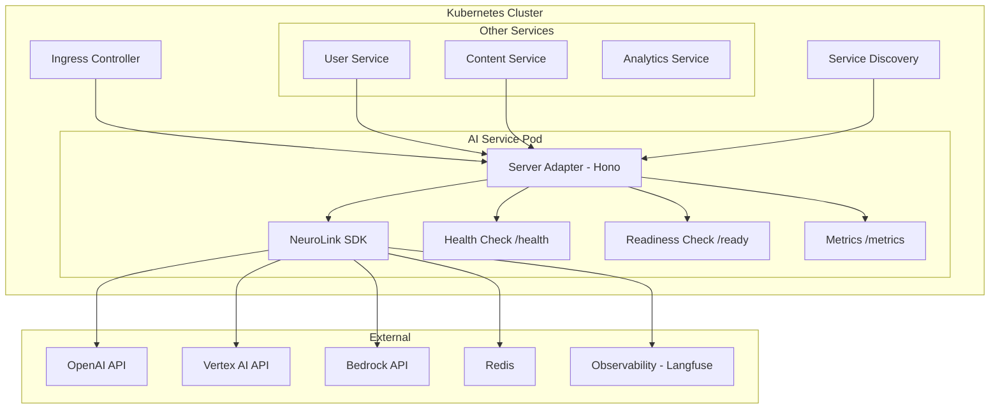

We designed NeuroLink's server adapter layer around a thesis that most AI SDKs ignore: your AI service needs the same production patterns as every other microservice -- health checks for orchestrators, graceful shutdown for zero-downtime deployments, circuit breakers for fault tolerance, and observability for debugging.

The design decision was to provide framework-agnostic server adapters (Hono, Express, Fastify, Koa) that handle health endpoints, connection tracking, graceful shutdown, and request lifecycle management. We chose adapters over a custom server because teams already have framework preferences and deployment pipelines. The trade-off is configuration complexity versus integration flexibility.

This deep dive covers the server adapter architecture, production deployment patterns, and the observability integration that makes AI services first-class citizens in your microservices stack.



## The Server Adapter Architecture

NeuroLink provides a `BaseServerAdapter` abstract class that implements framework-agnostic service infrastructure. Four concrete implementations cover the most popular Node.js frameworks, and the `ServerAdapterFactory` handles dynamic adapter creation:

```typescript
// From src/lib/server/factory/serverAdapterFactory.ts
export class ServerAdapterFactory {
  static async create(options: ServerAdapterFactoryOptions): Promise<BaseServerAdapter> {
    const { framework, neurolink, config } = options;

    switch (framework) {
      case 'hono': {
        const { HonoServerAdapter } = await import('../adapters/honoAdapter.js');
        return new HonoServerAdapter(neurolink, config);
      }
      case 'express': {
        const { ExpressServerAdapter } = await import('../adapters/expressAdapter.js');
        return new ExpressServerAdapter(neurolink, config);
      }
      case 'fastify': {
        const { FastifyServerAdapter } = await import('../adapters/fastifyAdapter.js');
        return new FastifyServerAdapter(neurolink, config);
      }
      case 'koa': {
        const { KoaServerAdapter } = await import('../adapters/koaAdapter.js');
        return new KoaServerAdapter(neurolink, config);
      }
    }
  }
}
```

The factory uses dynamic imports so you only load the framework adapter you actually use. Your production bundle does not include Express code if you are using Hono.

**Framework selection guidance:**

| Framework | Best For | Key Strength |
|---|---|---|
| **Hono** | Multi-runtime (Node, Deno, Bun, Edge) | Ultra-lightweight, runs anywhere |
| **Express** | Ecosystem compatibility | Massive middleware library |
| **Fastify** | Raw performance | Schema-based validation, fastest throughput |
| **Koa** | Minimal footprint | Clean middleware composition |

For new AI microservices, Hono is the recommended choice. It has the smallest footprint, runs on every JavaScript runtime, and its middleware API is clean and composable. For existing Express codebases where you are adding an AI service, use the Express adapter to maintain consistency with the rest of your stack.

## Health Checks and Readiness Probes

Every microservice in a Kubernetes cluster needs health and readiness endpoints. The health check tells the orchestrator "this process is alive," while the readiness check tells the load balancer "this service can handle requests."

NeuroLink's server adapter registers both endpoints automatically:

```typescript
// From src/lib/server/abstract/baseServerAdapter.ts - Built-in readiness check
this.registerRoute({
  method: 'GET',
  path: `${this.config.basePath}/ready`,
  handler: async (ctx) => {
    const toolRegistry = ctx.toolRegistry;
    let tools = [];
    let toolsAvailable = false;

    try {
      tools = await withTimeout(
        toolRegistry.listTools(),
        readinessTimeout,
        new Error(`toolRegistry.listTools timed out after ${readinessTimeout}ms`),
      );
      toolsAvailable = tools.length > 0;
    } catch (error) {
      toolsAvailable = false; // Degraded but still ready
    }

    return {
      ready: true,
      services: {
        neurolink: true,
        tools: toolsAvailable,
        externalServers: !!ctx.externalServerManager,
      },
    };
  },
});
```

Several important design decisions in this readiness check:

1. **Timeout protection**: The tool registry check uses `withTimeout()` to prevent readiness probe hangs. If listing tools takes longer than the configured timeout, the probe returns degraded status rather than hanging indefinitely. This prevents Kubernetes from killing pods during slow tool registry startups.

2. **Degraded readiness**: If tools are unavailable, the service still reports as ready. It can handle requests that do not require tools. This follows the principle of graceful degradation -- partial availability is better than no availability.

3. **Service inventory**: The readiness response includes the status of each subsystem (NeuroLink core, tool registry, external servers), giving operators visibility into what is working and what is degraded.

For Kubernetes, map these endpoints in your deployment manifest:

```yaml
livenessProbe:
  httpGet:
    path: /api/health
    port: 3000
  initialDelaySeconds: 10
  periodSeconds: 15
readinessProbe:
  httpGet:
    path: /api/ready
    port: 3000
  initialDelaySeconds: 5
  periodSeconds: 10
```

> **Note:** Set `initialDelaySeconds` for liveness probes higher than readiness probes. The service should be checked for readiness first, and liveness should only be checked after a reasonable startup period.
{: .prompt-info }

## Graceful Shutdown and Connection Draining

Zero-downtime deployments require graceful shutdown. When Kubernetes sends a SIGTERM, the service must stop accepting new connections, drain existing connections, and then exit cleanly. Without this, active AI generation requests get killed mid-stream, causing client errors and partial responses.

NeuroLink's server adapter implements a complete shutdown lifecycle:

**Lifecycle states:** `uninitialized` -> `initializing` -> `initialized` -> `running` -> `draining` -> `stopping` -> `stopped`

```typescript
// From src/lib/server/abstract/baseServerAdapter.ts
protected async gracefulShutdown(): Promise<void> {
  const { gracefulShutdownTimeoutMs, drainTimeoutMs, forceClose } = this.shutdownConfig;

  this.lifecycleState = 'draining';
  await this.stopAcceptingConnections();

  const drainResult = await Promise.race([
    this.drainConnections(),
    drainTimeoutPromise,
  ]);

  if (drainResult === 'drain_timeout' && this.activeConnections.size > 0) {
    if (forceClose) {
      await this.forceCloseConnections();
    } else {
      throw new DrainTimeoutError(drainTimeoutMs, this.activeConnections.size);
    }
  }

  this.lifecycleState = 'stopping';
  await this.closeServer();
}
```

The shutdown sequence is:

1. **Stop accepting connections**: The server socket stops listening for new connections. New requests get connection refused errors and are routed to other pods by the load balancer.

2. **Drain active connections**: Wait for all in-flight requests to complete. AI generation requests can take 5-30 seconds, so the drain timeout must accommodate this.

3. **Force close (if configured)**: If connections do not drain within the timeout and `forceClose` is enabled, forcefully terminate remaining connections. This is the safety net for stuck requests.

4. **Close server**: Clean up resources and exit.

The default configuration provides generous timeouts for AI workloads:

| Setting | Default | Purpose |
|---|---|---|
| `gracefulShutdownTimeoutMs` | 30,000ms | Total time allowed for shutdown |
| `drainTimeoutMs` | 15,000ms | Time to wait for connections to drain |
| `forceClose` | `true` | Force-close connections after drain timeout |

Connection tracking is the mechanism that makes draining possible. Every incoming request is tracked with an ID, socket reference, and timestamp. When draining begins, the server monitors the active connections set and resolves when it reaches zero.

> **Note:** For AI services with streaming responses, set `drainTimeoutMs` to at least 30 seconds. A streaming response to a complex prompt can take 15-20 seconds, and cutting it off mid-stream provides a poor user experience.
{: .prompt-warning }

## Middleware for Production Services

The server adapter includes a built-in middleware stack that covers the essentials for production services:

```typescript
// Production server configuration
import { NeuroLink } from '@juspay/neurolink';
import { ServerAdapterFactory } from '@juspay/neurolink';

const neurolink = new NeuroLink({
  conversationMemory: { enabled: true },
});

const server = await ServerAdapterFactory.create({
  framework: 'hono',
  neurolink,
  config: {
    port: 3000,
    host: '0.0.0.0',
    basePath: '/api',
    cors: {
      enabled: true,
      origins: ['https://app.example.com'],
      credentials: true,
    },
    rateLimit: {
      enabled: true,
      windowMs: 15 * 60 * 1000, // 15 minutes
      maxRequests: 100,
    },
    bodyParser: {
      maxSize: '10mb',
    },
    timeout: 30000,
    enableMetrics: true,
  },
});
```

The built-in middleware stack executes in this order:

1. **Request ID**: Generates a unique ID for each request, passed through to all logs and responses for traceability
2. **Logging**: Structured request/response logging with timing
3. **CORS**: Cross-origin resource sharing configuration
4. **Rate limiting**: Per-client or per-key request throttling with configurable windows
5. **Body parsing**: Request body parsing with size limits to prevent abuse
6. **Authentication**: Route-level auth configuration for protected endpoints
7. **Request validation**: Input validation middleware for typed endpoints

The rate limiting configuration is particularly important for AI services. Unlike traditional REST endpoints that respond in milliseconds, AI generation requests consume significant compute resources. A rate limit of 100 requests per 15-minute window prevents any single client from monopolizing your AI infrastructure.

The metrics endpoint (`/metrics`) provides runtime telemetry including memory usage, CPU usage, and uptime -- compatible with Prometheus scraping for dashboard integration.

## Route Groups and Custom Endpoints

The server adapter organizes routes into logical groups, each serving a specific purpose:

- **health**: Liveness (`/health`) and readiness (`/ready`) endpoints
- **agent**: AI generation and conversation endpoints
- **tools**: Tool registration, listing, and execution
- **MCP**: Model Context Protocol endpoints for tool interoperability
- **memory**: Conversation memory management
- **OpenAPI**: Auto-generated API documentation

To add custom business logic routes, use `registerRouteGroup()`:

```typescript
server.registerRouteGroup({
  name: 'custom',
  routes: [
    {
      method: 'POST',
      path: '/api/summarize',
      handler: async (ctx) => {
        const { text, maxLength } = ctx.body;
        const result = await ctx.neurolink.generate({
          input: { text: `Summarize in ${maxLength} words: ${text}` },
          provider: "vertex",
          model: "gemini-2.5-flash",
        });
        return { summary: result.content };
      },
    },
    {
      method: 'POST',
      path: '/api/classify',
      handler: async (ctx) => {
        const { text, categories } = ctx.body;
        const result = await ctx.neurolink.generate({
          input: { text: `Classify into [${categories.join(', ')}]: ${text}` },
          provider: "vertex",
          model: "gemini-2.5-flash",
        });
        return { classification: result.content };
      },
    },
  ],
});
```

For real-time bidirectional communication, the server adapter supports WebSocket handlers alongside HTTP routes. This is useful for chat interfaces where you need server-initiated messages (typing indicators, streaming responses) alongside client-initiated requests.

Streaming support via SSE (Server-Sent Events) is built into route definitions for endpoints that return progressive AI responses. The streaming protocol handles backpressure and client disconnection automatically.

## Deploying as a Kubernetes Service

With the server adapter configured, deploying as a Kubernetes service follows standard patterns. Here is a complete deployment manifest:

```yaml
apiVersion: apps/v1
kind: Deployment
metadata:
  name: ai-service
spec:
  replicas: 3
  selector:
    matchLabels:
      app: ai-service
  template:
    metadata:
      labels:
        app: ai-service
    spec:
      terminationGracePeriodSeconds: 45
      containers:
      - name: ai-service
        image: your-registry/ai-service:latest
        ports:
        - containerPort: 3000
        env:
        - name: OPENAI_API_KEY
          valueFrom:
            secretKeyRef:
              name: ai-secrets
              key: openai-api-key
        livenessProbe:
          httpGet:
            path: /api/health
            port: 3000
          initialDelaySeconds: 15
          periodSeconds: 20
        readinessProbe:
          httpGet:
            path: /api/ready
            port: 3000
          initialDelaySeconds: 5
          periodSeconds: 10
        resources:
          requests:
            memory: "256Mi"
            cpu: "250m"
          limits:
            memory: "512Mi"
            cpu: "500m"
```

Set `terminationGracePeriodSeconds` to a value higher than your `gracefulShutdownTimeoutMs` (45 seconds vs 30 seconds default). This gives the graceful shutdown process time to complete before Kubernetes sends SIGKILL.

## Observability and Inter-Service Communication

In a microservices architecture, your AI service communicates with other services via HTTP or message queues. Use NeuroLink's OpenTelemetry integration to trace requests across service boundaries:

```typescript
import { initializeOpenTelemetry } from '@juspay/neurolink';

await initializeOpenTelemetry({
  serviceName: "ai-service",
  endpoint: "http://jaeger:4317",
});
```

With distributed tracing enabled, a request that starts in the user service, calls the AI service for content generation, and then stores results in the content service appears as a single trace in your observability platform. You can see exactly how much time is spent in AI generation versus database writes versus network transit.

For inter-service communication, the AI service exposes its capabilities via the standard REST API created by the server adapter. Other services call it like any other HTTP service, with the same retry, timeout, and circuit breaker patterns they use for all inter-service calls.

## Design Decisions and Trade-offs

We designed the server adapter to handle operational concerns (health checks, graceful shutdown, connection draining, rate limiting) separately from AI concerns (provider connections, tool registries, conversation memory). This separation means your ops team manages the AI service with the same tools and processes they use for every other service in the cluster -- no special AI-specific deployment procedures.

The trade-off is that NeuroLink's server adapter adds an abstraction layer between your framework (Express, Fastify, Hono) and the AI pipeline. For teams that need fine-grained control over request handling, this abstraction can feel limiting. But for teams that want production-grade defaults without reinventing health checks, shutdown sequences, and rate limiting, the adapter pays for itself on the first deployment.

Choose your framework based on your existing stack, configure middleware for production (CORS, rate limits, auth), and deploy like any other service. The AI-specific concerns are handled internally; the operational concerns are handled by the adapter.

---

**Related posts:**

- [Automating Real Estate Document Processing: Lease Abstraction with AI](/posts/real-estate-lease-abstraction-ai/)
- [AI Observability: Monitoring LLM Applications in Production](/posts/monitoring-observability/)
- [Security Best Practices for AI Applications](/posts/enterprise-security-guide/)
