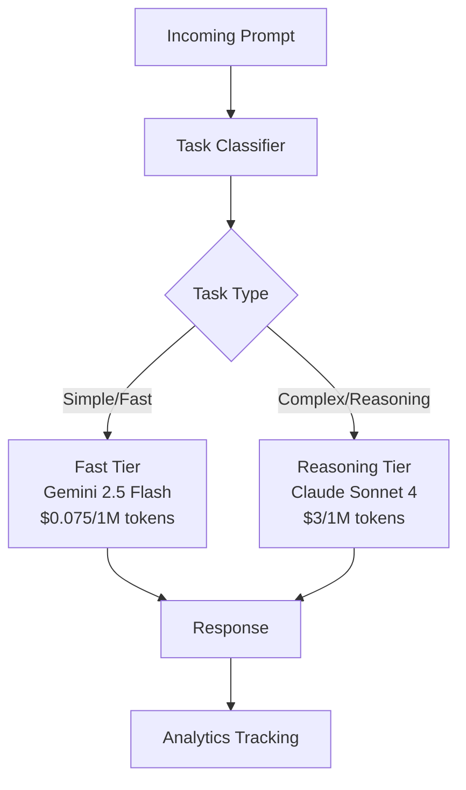

You will reduce your LLM API costs by 60% using smart model routing with NeuroLink SDK. By the end of this tutorial, you will have a classification-based router that sends simple prompts to cheap models and complex prompts to premium models, with cost tracking that proves the savings.

The reality is that 70% of production prompts are simple tasks -- text summaries, entity extraction, sentiment classification, FAQ responses -- that produce identical quality on a model costing 10-30x less. You will build the router that captures this savings automatically.

Now you will start with the cost landscape, then build from NeuroLink's built-in automatic router to custom routing logic for fine-grained control.

## The Cost Landscape

Before building a router, you need to understand the cost differences between models. The gap between the cheapest and most expensive options is enormous:

| Model | Input Cost (per 1M tokens) | Output Cost (per 1M tokens) | Avg Latency | Best For |
|---|---|---|---|---|
| GPT-4o | $2.50 | $10.00 | ~2s | Complex reasoning |
| GPT-4o-mini | $0.15 | $0.60 | ~1s | General tasks |
| Gemini 2.5 Flash | $0.075 | $0.30 | ~0.8s | Fast tasks |
| Claude Sonnet 4 | $3.00 | $15.00 | ~3s | Deep analysis |
| Claude Haiku 3.5 | $0.80 | $4.00 | ~1s | Quick responses |

The cost difference between Gemini 2.5 Flash and Claude Sonnet 4 is **40x for input tokens and 50x for output tokens**. If 70% of your traffic is simple enough for Flash and you are currently running everything on Sonnet, the savings are massive.

Here is the math for a realistic production workload of 1,000,000 requests per month averaging 500 input tokens and 200 output tokens per request:

- **Without routing (all GPT-4o):** ~$3,250/month
- **With routing (70% Gemini Flash + 30% Claude Sonnet):** ~$1,420/month
- **Savings:** ~$1,830/month (56% reduction)




## Step 1 -- Understand Task Classification

NeuroLink includes a built-in `BinaryTaskClassifier` that categorizes every prompt into one of two types: "fast" (simple tasks) or "reasoning" (complex tasks). The classifier analyzes the prompt text and returns a classification with a confidence score and reasoning explanation.

When you enable orchestration in the NeuroLink constructor, the model router activates automatically. Every call to `generate()` is classified and routed to the optimal model tier without any additional code:

```typescript
import { NeuroLink } from "@juspay/neurolink";

// Enable orchestration to activate the model router
const neurolink = new NeuroLink({
  enableOrchestration: true,
});

// Simple prompt -> routed to fast tier (Gemini 2.5 Flash)
const simple = await neurolink.generate({
  input: { text: "Summarize this paragraph in one sentence: ..." },
});
// Uses Gemini 2.5 Flash (~$0.075/1M tokens, ~800ms)

// Complex prompt -> routed to reasoning tier (Claude Sonnet 4)
const complex = await neurolink.generate({
  input: { text: "Design a distributed consensus algorithm for a banking system..." },
});
// Uses Claude Sonnet 4 (~$3/1M tokens, ~3000ms)
```

The classifier looks for signals of complexity: multi-step reasoning requirements, technical depth, creative composition, code generation, and multi-constraint optimization. Simple tasks include summarization, extraction, classification, formatting, and factual lookups.

> **Note:** The task classifier runs locally (no LLM call) and adds negligible latency (<1ms). It analyzes prompt structure and keywords, not semantic meaning.
{: .prompt-info }


## Step 2 -- Configure the Model Router

The model router maps task types to specific model configurations. The built-in routing table defines primary and fallback models for each tier:

```typescript
// The built-in routing configuration:
// Fast tier:
//   Primary: vertex / gemini-2.5-flash (800ms, $0.075/1M tokens)
//   Fallback: vertex / gemini-2.5-pro (1200ms, $0.30/1M tokens)
//
// Reasoning tier:
//   Primary: vertex / claude-sonnet-4@20250514 (3000ms, $3/1M tokens)
//   Fallback: vertex / claude-opus-4@20250514 (4000ms, $5/1M tokens)
```

Each model configuration in the router includes: `provider`, `model`, `capabilities` (what the model can do), `avgResponseTime` (for latency-aware routing), `costPerToken` (for cost-aware routing), and a `reasoning` flag indicating whether the model supports chain-of-thought.

You can override the router's decision when you know better than the classifier:

```typescript
// Force a specific task type when you know best
const result = await neurolink.generate({
  input: { text: prompt },
  // Override routing for specific use cases
  routingOptions: {
    forceTaskType: "fast", // or "reasoning"
  },
});
```

Force overrides are useful when your application context provides information the classifier cannot see. For example, a customer support chatbot might force "fast" for FAQ responses (which the classifier might flag as "reasoning" if the question is long) and "reasoning" for complaint resolution (which requires empathy and multi-step problem-solving).

## Step 3 -- Track Costs with Analytics

Every request through NeuroLink returns analytics data including token usage, provider, and model. This data is the foundation of your cost tracking:

```typescript
const result = await neurolink.generate({
  input: { text: "Classify this support ticket..." },
});

console.log("Provider:", result.provider);
console.log("Model:", result.model);
console.log("Token usage:", result.analytics?.tokenUsage);
// { input: 150, output: 30, total: 180 }

// Calculate cost
const usage = result.analytics?.tokenUsage;
const cost = (usage.input * inputRate + usage.output * outputRate) / 1_000_000;
console.log(`Request cost: $${cost.toFixed(6)}`);
```

Build a cost dashboard that tracks:

- **Cost per task type**: How much are you spending on fast vs reasoning tasks?
- **Classification accuracy**: Are fast-tier results actually good enough? Track user feedback or auto-evaluation scores.
- **Routing distribution**: What percentage of traffic goes to each tier? If reasoning is above 40%, your classifier might be too conservative.
- **Cost trend over time**: Is your cost per request decreasing as you tune routing?

```typescript
// Cost tracking middleware pattern
async function trackedGenerate(prompt: string) {
  const startTime = Date.now();

  const result = await neurolink.generate({
    input: { text: prompt },
  });

  const duration = Date.now() - startTime;
  const usage = result.usage;

  // Log to your analytics system
  await analytics.track({
    event: "ai_generation",
    properties: {
      provider: result.provider,
      model: result.model,
      inputTokens: usage.input,
      outputTokens: usage.output,
      total: usage.total,
      durationMs: duration,
      estimatedCost: calculateCost(result.provider, result.model, usage),
    },
  });

  return result;
}
```

> **Note:** Token counts use `usage.total`, `usage.input`, and `usage.output` -- not `totalTokens`, `inputTokens`, or `outputTokens`. NeuroLink standardizes token reporting across all providers.
{: .prompt-info }

## Step 4 -- Implement Custom Routing Logic

The built-in binary classifier (fast vs reasoning) works well for general use cases. For fine-grained control, implement your own routing before calling NeuroLink:

```typescript
import { NeuroLink } from "@juspay/neurolink";

type TaskCategory = "extraction" | "classification" | "analysis" | "creative" | "code";

function classifyTask(prompt: string): TaskCategory {
  const lower = prompt.toLowerCase();
  if (lower.includes("extract") || lower.includes("parse")) return "extraction";
  if (lower.includes("classify") || lower.includes("categorize")) return "classification";
  if (lower.includes("analyze") || lower.includes("compare")) return "analysis";
  if (lower.includes("write") || lower.includes("create")) return "creative";
  if (lower.includes("code") || lower.includes("function")) return "code";
  return "classification"; // default to cheap
}

const ROUTING_TABLE: Record<TaskCategory, { provider: string; model: string }> = {
  extraction: { provider: "openai", model: "gpt-4o-mini" },
  classification: { provider: "google-ai", model: "gemini-2.0-flash" },
  analysis: { provider: "anthropic", model: "claude-sonnet-4-20250514" },
  creative: { provider: "openai", model: "gpt-4o" },
  code: { provider: "anthropic", model: "claude-sonnet-4-20250514" },
};

const neurolink = new NeuroLink();

async function smartGenerate(prompt: string) {
  const category = classifyTask(prompt);
  const route = ROUTING_TABLE[category];

  const result = await neurolink.generate({
    input: { text: prompt },
    provider: route.provider,
    model: route.model,
  });

  return { ...result, category, route };
}
```

This five-tier routing is more nuanced than binary classification. Extraction and classification tasks go to the cheapest models because they have well-defined outputs. Analysis and code tasks go to premium models because they require reasoning. Creative tasks go to GPT-4o because it produces the most natural prose.

Tune the routing table based on your evaluation data. If extraction quality drops below acceptable levels on GPT-4o-mini, promote it to a higher-tier model. If analysis tasks produce good results on a cheaper model, demote them. The routing table is your cost optimization lever.

## Step 5 -- Use Workflow Engine for Quality-Critical Tasks

For high-stakes decisions where cost savings cannot compromise quality, use NeuroLink's workflow engine. It provides pre-configured workflows that balance cost and quality differently:

```typescript
import {
  SPEED_FIRST_WORKFLOW,
  QUALITY_MAX_WORKFLOW,
  BALANCED_ADAPTIVE_WORKFLOW,
} from "@juspay/neurolink";

// Cost-optimized: Use cheapest models
const cheapResult = await neurolink.generate({
  input: { text: "Simple question..." },
  workflowConfig: SPEED_FIRST_WORKFLOW,
});

// Quality-optimized: Use best models with multi-tier evaluation
const qualityResult = await neurolink.generate({
  input: { text: "Critical business decision..." },
  workflowConfig: QUALITY_MAX_WORKFLOW,
});

// Balanced: Adaptive routing based on prompt complexity
const balancedResult = await neurolink.generate({
  input: { text: "Moderate complexity task..." },
  workflowConfig: BALANCED_ADAPTIVE_WORKFLOW,
});
```

The `QUALITY_MAX_WORKFLOW` runs the prompt through a premium model and then evaluates the response with a separate judge model. If the evaluation score is below threshold, it retries with a different premium model. This is expensive but guarantees the highest quality for critical tasks.

The `SPEED_FIRST_WORKFLOW` uses the cheapest models with no evaluation. It is the fastest and cheapest option, ideal for bulk processing where individual response quality matters less than throughput.

The `BALANCED_ADAPTIVE_WORKFLOW` starts with a cheap model and only escalates to a premium model if the auto-evaluation detects quality issues. This gives you near-cheap-model pricing for simple prompts with automatic quality escalation for complex ones.

## Cost Savings Calculator

Here is a framework for estimating your savings:

```typescript
interface CostEstimate {
  monthlyRequests: number;
  avgInputTokens: number;
  avgOutputTokens: number;
  fastPercentage: number; // 0-1, portion of traffic that is simple
}

function estimateSavings(estimate: CostEstimate) {
  const { monthlyRequests, avgInputTokens, avgOutputTokens, fastPercentage } = estimate;

  // Without routing: all premium (GPT-4o pricing)
  const premiumInputRate = 2.50 / 1_000_000;
  const premiumOutputRate = 10.00 / 1_000_000;
  const withoutRouting = monthlyRequests * (
    avgInputTokens * premiumInputRate + avgOutputTokens * premiumOutputRate
  );

  // With routing: fast tier + reasoning tier
  const fastInputRate = 0.075 / 1_000_000; // Gemini Flash
  const fastOutputRate = 0.30 / 1_000_000;
  const reasoningInputRate = 3.00 / 1_000_000; // Claude Sonnet
  const reasoningOutputRate = 15.00 / 1_000_000;

  const fastRequests = monthlyRequests * fastPercentage;
  const reasoningRequests = monthlyRequests * (1 - fastPercentage);

  const withRouting =
    fastRequests * (avgInputTokens * fastInputRate + avgOutputTokens * fastOutputRate) +
    reasoningRequests * (avgInputTokens * reasoningInputRate + avgOutputTokens * reasoningOutputRate);

  return {
    withoutRouting: withoutRouting.toFixed(2),
    withRouting: withRouting.toFixed(2),
    savings: (withoutRouting - withRouting).toFixed(2),
    savingsPercentage: ((1 - withRouting / withoutRouting) * 100).toFixed(1),
  };
}

// Example calculation
console.log(estimateSavings({
  monthlyRequests: 1_000_000,
  avgInputTokens: 500,
  avgOutputTokens: 200,
  fastPercentage: 0.70,
}));
// { withoutRouting: "3250.00", withRouting: "1158.75", savings: "2091.25", savingsPercentage: "64.3" }
```

> **Note:** These estimates use list prices. Negotiated enterprise rates or commitment discounts will change the absolute numbers, but the percentage savings from routing remain similar.
{: .prompt-info }

## Monitoring and Dashboards

Use NeuroLink's OpenTelemetry integration to track routing decisions in your observability platform:

```typescript
import { initializeOpenTelemetry } from "@juspay/neurolink";

await initializeOpenTelemetry({
  serviceName: "my-ai-service",
  endpoint: "http://localhost:4317",
});
```

Build dashboards that answer these questions:

- **What is my cost per request by task type?** If reasoning tasks cost 30x more, even a small improvement in classification accuracy (routing a few more prompts to fast) yields meaningful savings.
- **Is fast-tier quality acceptable?** Monitor auto-evaluation scores for fast-tier responses. If scores drop below 7/10, the model might be too weak for certain prompt patterns.
- **What is the classification distribution?** A healthy distribution is 60-80% fast, 20-40% reasoning. If reasoning exceeds 40%, investigate whether the classifier is being too conservative.
- **Are fallbacks triggering?** Frequent fallbacks from primary to fallback models within a tier indicate provider issues or capacity problems.

Set up alerts for:

- Cost per request exceeding 2x the expected average
- Fast-tier evaluation scores dropping below 6/10
- Reasoning-tier percentage exceeding 50% of traffic
- Provider fallback rate exceeding 5%

## What You Built

You built a smart model routing system that reduces LLM costs by 60%+ without sacrificing quality. You configured NeuroLink's built-in orchestration for immediate savings with zero code changes, implemented a custom prompt classifier that routes simple prompts to fast-tier models and complex prompts to reasoning-tier models, set up the workflow engine for quality-critical paths with auto-evaluation gates, and added monitoring dashboards to track cost per request, classification distribution, and fallback rates.

For deeper cost optimization, explore:

- **Caching strategies** to avoid redundant LLM calls for identical prompts
- **Streaming responses** to reduce perceived latency on cheaper, slower models
- **Batch processing** to take advantage of bulk pricing tiers

---

**Related posts:**

- [LLM Cost Optimization: Practical Strategies to Reduce Your AI Spend](/posts/cost-optimization-strategies/)
- [Microservices with AI: Integrating NeuroLink into Distributed Systems](/posts/microservices-with-ai/)
- [Performance Benchmarking Guide for NeuroLink](/posts/performance-benchmarks/)
