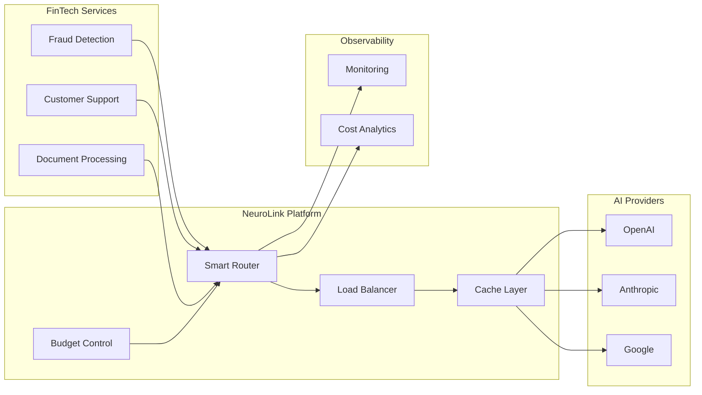

# Building Cost-Effective AI for FinTech: A Multi-Provider Routing Guide

> **Note:** This guide presents a hypothetical scenario to illustrate architectural patterns and best practices for implementing AI in financial services. The company "FinanceFlow" is a fictional example created for educational purposes. Actual results will vary based on your specific use case, implementation, and scale.

Financial services companies increasingly rely on AI for fraud detection, customer support, and document processing. However, scaling these capabilities presents challenges: unpredictable costs, reliability concerns, and operational complexity. This guide explores how multi-provider routing patterns can address these challenges, using a hypothetical fintech company as an illustrative example.

## Reference Architecture



## Hypothetical Scenario: FinanceFlow

### The Situation

Consider a hypothetical digital payments company, "FinanceFlow," with the following characteristics:

- A mid-sized engineering team
- High transaction volume requiring real-time processing
- Strict uptime requirements
- Multiple AI-powered features in production

### Common AI Challenges in FinTech

Financial services companies typically face these challenges when scaling AI:

**1. Real-Time Fraud Detection**
Rule-based fraud detection systems often have high false positive rates. LLMs can provide more nuanced risk assessments, but at significant cost for high-volume applications.

**2. Customer Support Automation**
As customer inquiries grow, AI-powered support can handle routine queries while escalating complex issues to human agents.

**3. Document Processing**
Manual processing of compliance paperwork, merchant documents, and dispute evidence is time-consuming and error-prone.

### Typical Pain Points

When companies first implement AI with direct API integrations, they often encounter:

**Cost Challenges**
- Verbose prompts consuming excessive tokens
- Retry storms during network issues multiplying costs
- No caching for repeated queries
- Using expensive models for simple tasks

**Reliability Issues**
- Single provider outages causing cascading failures
- Rate limiting during peak hours
- No fallback mechanisms
- Inconsistent response times

**Operational Overhead**
- Managing multiple provider dashboards
- Manual provider switching during outages
- Maintaining separate SDKs for each provider

## Implementing Multi-Provider Routing with NeuroLink

### Basic Integration

The first step is replacing direct API calls with NeuroLink's unified client:

```typescript
// Before: Direct OpenAI integration
import OpenAI from 'openai';

const openai = new OpenAI({ apiKey: process.env.OPENAI_API_KEY });
const response = await openai.chat.completions.create({
  model: 'gpt-4',
  messages: [{ role: 'user', content: prompt }],
});

// After: NeuroLink unified client
import { NeuroLink } from '@juspay/neurolink';

const neurolink = new NeuroLink();

const response = await neurolink.generate({
  provider: 'openai',
  model: 'gpt-4',
  input: { text: prompt },
});
```

This provides a foundation for adding routing, failover, and cost controls.

### Model Tiering Strategy

Different tasks have different requirements. A tiered approach matches model capability to task complexity:

```typescript
import { NeuroLink } from '@juspay/neurolink';

const neurolink = new NeuroLink();

// High-value fraud analysis - use more capable models
async function analyzeHighValueTransaction(transactionData: string) {
  return neurolink.generate({
    provider: 'anthropic',
    model: 'claude-sonnet-4-5-20250929',
    input: {
      text: `Analyze this high-value transaction for fraud indicators: ${transactionData}`
    },
  });
}

// Standard transaction checks - use cost-effective models
async function analyzeStandardTransaction(transactionData: string) {
  return neurolink.generate({
    provider: 'anthropic',
    model: 'claude-3-haiku-20240307',
    input: {
      text: `Quick fraud check for transaction: ${transactionData}`
    },
  });
}

// Route based on transaction value
async function routeFraudCheck(transaction: { value: number; data: string }) {
  if (transaction.value > 10000) {
    return analyzeHighValueTransaction(transaction.data);
  }
  return analyzeStandardTransaction(transaction.data);
}
```

### Recommended Model Tiering

| Use Case | High Complexity | Standard | Low Complexity |
|----------|-----------------|----------|----------------|
| Fraud Detection | Claude Sonnet | Claude Haiku | Gemini Flash |
| Customer Support | GPT-4 | GPT-4o-mini | Cached Response |
| Document Processing | Claude Sonnet | Claude Haiku | Gemini Flash |

### Implementing Failover

For critical systems, implement failover to maintain availability:

```typescript
import { NeuroLink } from '@juspay/neurolink';

const neurolink = new NeuroLink();

async function generateWithFailover(prompt: string) {
  const providers = [
    { provider: 'anthropic', model: 'claude-sonnet-4-5-20250929' },
    { provider: 'openai', model: 'gpt-4o' },
    { provider: 'vertex', model: 'gemini-2.0-flash' },
  ];

  for (const config of providers) {
    try {
      const response = await neurolink.generate({
        provider: config.provider,
        model: config.model,
        input: { text: prompt },
      });
      return response;
    } catch (error) {
      console.warn(`Provider ${config.provider} failed, trying next...`);
      continue;
    }
  }

  throw new Error('All providers failed');
}
```

### Streaming for Real-Time Applications

For customer-facing applications where responsiveness matters:

```typescript
import { NeuroLink } from '@juspay/neurolink';

const neurolink = new NeuroLink();

async function streamCustomerResponse(query: string) {
  const result = await neurolink.stream({
    provider: 'openai',
    model: 'gpt-4o',
    input: { text: query },
  });

  for await (const chunk of result.stream) {
    // Send chunk to client immediately
    if ('content' in chunk) {
      process.stdout.write(chunk.content || '');
    }
  }
}
```

## Cost Optimization Strategies

### Strategy 1: Model Selection by Task Complexity

Not every request needs the most expensive model. Analyze your use cases:

- **Complex reasoning**: Use capable models (Claude Sonnet, GPT-4)
- **Simple classification**: Use efficient models (Claude Haiku, GPT-4o-mini)
- **High-volume, low-complexity**: Use the most cost-effective option (Gemini Flash)

### Strategy 2: Implement Application-Level Caching

For repetitive queries (common in customer support), implement caching in your application:

```typescript
import { NeuroLink } from '@juspay/neurolink';

const neurolink = new NeuroLink();
const responseCache = new Map<string, string>();

async function getCachedOrGenerate(query: string) {
  // Check cache first
  const cached = responseCache.get(query);
  if (cached) {
    return cached;
  }

  // Generate new response
  const response = await neurolink.generate({
    provider: 'openai',
    model: 'gpt-4o-mini',
    input: { text: query },
  });

  // Cache the result
  responseCache.set(query, response.content);
  return response.content;
}
```

### Strategy 3: Prompt Optimization

Reducing prompt length directly reduces costs:

```typescript
// Inefficient: Verbose prompt
const verbosePrompt = `
  You are a fraud detection assistant. Your job is to analyze transactions
  and determine if they might be fraudulent. Please carefully review the
  following transaction details and provide your analysis...
  [500+ tokens of instructions]
`;

// Efficient: Concise prompt with system message
const efficientPrompt = `Fraud check: ${transactionSummary}. Reply: SAFE/REVIEW/BLOCK with one-line reason.`;
```

### Strategy 4: Budget Monitoring

Implement cost tracking in your application:

```typescript
interface RequestMetrics {
  provider: string;
  model: string;
  inputTokens: number;
  outputTokens: number;
  estimatedCost: number;
}

function logRequestMetrics(metrics: RequestMetrics) {
  // Send to your monitoring system (DataDog, CloudWatch, etc.)
  console.log(`AI Request: ${metrics.provider}/${metrics.model}`);
  console.log(`Tokens: ${metrics.inputTokens} in, ${metrics.outputTokens} out`);
  console.log(`Est. Cost: $${metrics.estimatedCost.toFixed(4)}`);
}
```

## Expected Benefits

When implementing these patterns, organizations typically see improvements in several areas:

### Cost Reduction
- **Smart routing**: Matching model to task complexity can significantly reduce costs
- **Caching**: Common queries served from cache avoid API calls entirely
- **Prompt optimization**: Shorter prompts mean lower token costs

### Reliability Improvements
- **Multi-provider failover**: Reduces single points of failure
- **Latency-based routing**: Routes to fastest available provider
- **Graceful degradation**: Fall back to simpler models or rule-based systems

### Operational Benefits
- **Unified interface**: Single SDK instead of multiple provider integrations
- **Centralized monitoring**: One place to track costs and performance
- **Simplified debugging**: Consistent logging across providers

## Compliance Considerations for FinTech

Financial services companies have specific compliance requirements. When implementing AI:

**Data Handling**
- Understand what data is sent to AI providers
- Implement PII detection and masking where appropriate
- Review provider data retention policies

**Audit Requirements**
- Log all AI requests and responses for audit trails
- Track model versions and prompt changes
- Document decision-making processes

**Regulatory Alignment**
- Ensure AI use aligns with financial services regulations
- Maintain human oversight for critical decisions
- Implement explainability for AI-assisted decisions

> **Note:** Always consult with your compliance team and legal counsel regarding specific regulatory requirements for your jurisdiction and use case.

## Lessons Learned from the Field

Based on common patterns we see in production deployments:

### 1. Start with Cost Visibility
Before optimizing, understand where costs come from. Often a small percentage of requests account for the majority of costs.

### 2. Match Model to Task
Test each use case against multiple models. Many tasks can be handled by smaller models with no quality degradation.

### 3. Design for Failure
LLM providers have outages. Always maintain a fallback path for critical business functions, even if it is a simpler rule-based system.

### 4. Implement Budget Controls
Set up alerts and hard limits before costs become a problem. It is easier to relax limits than to explain unexpected bills.

### 5. Invest in Prompt Engineering
Well-optimized prompts can reduce costs significantly while maintaining or improving output quality.

## Getting Started

To implement these patterns with NeuroLink:

1. **Install the SDK**
   ```bash
   npm install @juspay/neurolink
   ```

2. **Configure your providers**
   ```typescript
   import { NeuroLink } from '@juspay/neurolink';

   const neurolink = new NeuroLink();
   ```

3. **Start with a single use case** and measure baseline costs

4. **Implement routing logic** based on your requirements

5. **Add monitoring** to track cost and performance

6. **Iterate and optimize** based on real usage data

## Conclusion

Building cost-effective AI for financial services requires thoughtful architecture. By implementing multi-provider routing, intelligent model selection, and proper failover mechanisms, organizations can achieve reliable, scalable AI operations while managing costs effectively.

The key principles are:

1. **Visibility first**: You cannot optimize what you cannot measure
2. **Right-size your models**: Not every task needs the most capable model
3. **Build for resilience**: Single-provider dependence is a business risk
4. **Simplify operations**: Unified management reduces overhead

These patterns apply whether you are processing thousands or millions of requests. Start simple, measure everything, and optimize based on real data.

## Best Practices for AI in PCI-DSS Compliant Environments

> **Disclaimer:** The following represents recommended best practices for using AI in payment card environments, not official PCI-DSS requirements. Always consult with your Qualified Security Assessor (QSA) and refer to official PCI Security Standards Council documentation for compliance requirements. As of early 2025, PCI-DSS does not contain specific AI requirements, but existing data protection requirements apply to AI systems.
{: .prompt-warning }

When deploying AI in payment card environments, apply these security principles:

### Recommended Security Controls

**1. Data Protection Applies to AI Systems**
- PCI-DSS Requirements 3 (data at rest) and 4 (data in transit) apply regardless of AI usage
- Cardholder data should never be sent to external LLM APIs
- Implement data masking before AI processing

**2. Logging and Auditability**
- Maintain audit trails of AI-assisted decisions involving cardholder data
- Log what data was accessed and which AI models were used
- Track human oversight and approval workflows

**3. Access Control**
- Apply least-privilege principles (PCI-DSS Requirement 7) to AI systems
- Restrict which systems can access cardholder data
- Implement human-in-the-loop (HITL) controls for sensitive operations

**4. Data Minimization**
- Only use the minimum data necessary for AI operations
- Tokenize or mask cardholder data before processing
- Never include full PANs in prompts sent to AI providers

### Example: HITL Implementation for Payment Environments

```typescript
import { NeuroLink } from '@juspay/neurolink';

// Configure HITL for sensitive financial operations
const neurolink = new NeuroLink({
  hitl: {
    enabled: true,
    dangerousActions: ['processPayment', 'accessCardData', 'transferFunds'],
    timeout: 30000,
    allowArgumentModification: true,
    autoApproveOnTimeout: false,
    auditLogging: true
  }
});

// Set up event listener for approval requests
neurolink.getEventEmitter().on('hitl:confirmation-request', async (event) => {
  const { confirmationId, toolName, arguments: args } = event.payload;
  console.log(`Review required: ${toolName}`);
  console.log(`Arguments:`, JSON.stringify(args, null, 2));

  // In production: integrate with approval system
  neurolink.getEventEmitter().emit('hitl:confirmation-response', {
    type: 'hitl:confirmation-response',
    payload: { confirmationId, approved: true }
  });
});
```

> **⚠️ Security Warning:** This example auto-approves for demonstration. In production, implement proper approval workflows.

### Additional Compliance Considerations

- **Vendor Management**: Ensure LLM providers meet your third-party risk requirements
- **Data Residency**: Verify where your data is processed and stored by AI providers
- **Incident Response**: Include AI systems in your incident response plan
- **Regular Assessment**: Include AI systems in your annual PCI-DSS assessment

**Resources:**
- [PCI SSC AI Principles for Payment Security](https://blog.pcisecuritystandards.org/ai-principles-securing-the-use-of-ai-in-payment-environments)
- [PCI Security Standards Council](https://www.pcisecuritystandards.org/)

> **Important:** These are general best practices and do not constitute compliance advice. Work with your QSA and legal counsel to determine specific requirements for your implementation.
{: .prompt-info }

---

*Ready to implement these patterns? Check out the [NeuroLink documentation](https://github.com/juspay/neurolink) for detailed API references and more examples.*
