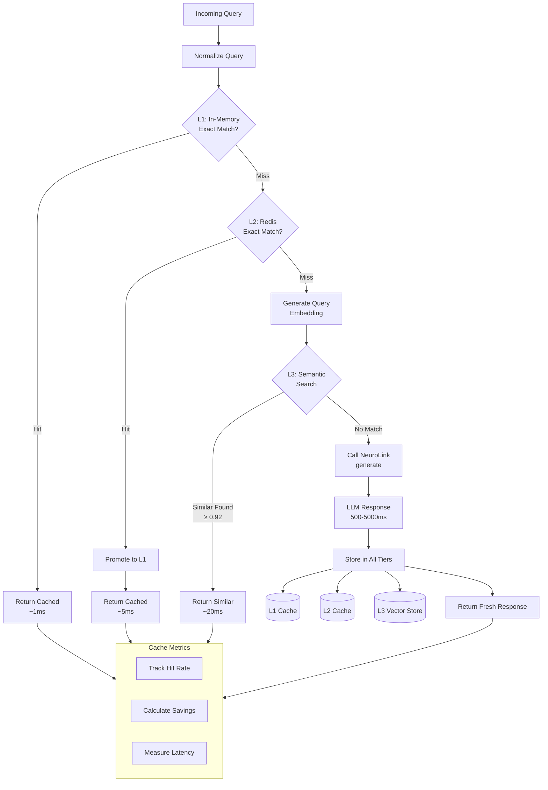

> **Implementation Note**: The patterns shown in this guide are implemented on top of NeuroLink's core API. They are not built-in SDK features but represent recommended approaches you can build yourself.
{: .prompt-info }

# Caching LLM Responses: Performance Optimization with NeuroLink

Every API call to a Large Language Model costs money and time. When users ask similar questions repeatedly, you're paying for the same computation over and over again. Smart caching strategies can typically slash your LLM costs by 40-70% while dramatically improving response times.

**Important Note**: The NeuroLink SDK does not include built-in response caching. This is intentional---caching strategies vary significantly based on application requirements, data sensitivity, and infrastructure. This guide shows how to implement external caching that integrates cleanly with NeuroLink's API.

## Cache Decision Flow

The following diagram illustrates how a multi-tier caching system processes LLM requests:



## Why Caching Matters for LLM Applications

LLM API calls are fundamentally different from traditional API calls. They're expensive (often $0.01-0.10 per request), slow (500ms-5s latency), and frequently return identical or nearly identical responses for similar inputs.

Consider a customer support chatbot handling 10,000 queries daily. Analysis typically reveals that 30-40% of questions are variations of the same underlying query:

- "What's your return policy?"
- "How do I return an item?"
- "Returns policy please"
- "Can I send something back?"

Without caching, each variant triggers a full LLM inference. With intelligent caching, you answer once and serve cached responses for semantically similar queries.

### The Cost Mathematics

Let's examine real numbers for a production application:

```
Daily queries: 10,000
Average cost per query: $0.02
Cache hit rate (achievable): 45%

Without caching:
- Daily cost: $200
- Monthly cost: $6,000

With caching:
- Cached queries: 4,500 x $0.00 = $0
- Fresh queries: 5,500 x $0.02 = $110
- Daily cost: $110
- Monthly cost: $3,300
- Monthly savings: $2,700
```

Beyond cost savings, cached responses return in milliseconds rather than seconds, fundamentally improving user experience.

## Basic Caching Pattern with NeuroLink

Here's the fundamental pattern for wrapping NeuroLink's `generate` method with caching:

```typescript
import { NeuroLink } from '@juspay/neurolink';
// Note: GenerateResult may need to be imported as GenerateApiResult in some versions
// due to naming conflicts with other libraries
import type { GenerateOptions, GenerateResult } from '@juspay/neurolink';
import { createHash } from 'crypto';

// Initialize NeuroLink
const neurolink = new NeuroLink();

// Simple in-memory cache
interface CachedResponse {
  result: GenerateResult;
  createdAt: number;
  expiresAt: number;
}

const cache = new Map<string, CachedResponse>();

// Generate a cache key from request parameters
function generateCacheKey(options: GenerateOptions): string {
  const keyData = {
    text: options.input.text.trim().toLowerCase(),
    provider: options.provider,
    model: options.model,
    temperature: options.temperature,
    systemPrompt: options.systemPrompt,
  };
  return createHash('sha256').update(JSON.stringify(keyData)).digest('hex');
}

// Cached generate function
async function cachedGenerate(
  options: GenerateOptions,
  ttlMs: number = 3600000 // 1 hour default
): Promise<GenerateResult & { cached: boolean }> {
  const cacheKey = generateCacheKey(options);

  // Check cache
  const cached = cache.get(cacheKey);
  if (cached && Date.now() < cached.expiresAt) {
    return { ...cached.result, cached: true };
  }

  // Cache miss - call NeuroLink
  const result = await neurolink.generate(options);

  // Store in cache
  cache.set(cacheKey, {
    result,
    createdAt: Date.now(),
    expiresAt: Date.now() + ttlMs,
  });

  return { ...result, cached: false };
}

// Usage example
async function main() {
  const response = await cachedGenerate({
    input: { text: 'What is the capital of France?' },
    provider: 'openai',
    model: 'gpt-4o-mini',
    temperature: 0, // Deterministic for better caching
  });

  console.log(`Response: ${response.content}`);
  console.log(`From cache: ${response.cached}`);
  console.log(`Tokens used: ${response.usage?.total || 'N/A'}`);
}
```

## Normalized Key Generation

Improving hit rates requires normalizing inputs before key generation:

```typescript
import { NeuroLink } from '@juspay/neurolink';
// Note: GenerateResult may need to be imported as GenerateApiResult in some versions
// due to naming conflicts with other libraries
import type { GenerateOptions, GenerateResult } from '@juspay/neurolink';
import { createHash } from 'crypto';

class NormalizedLLMCache {
  private cache = new Map<string, CachedResponse>();
  private neurolink: NeuroLink;

  constructor() {
    this.neurolink = new NeuroLink();
  }

  // Normalize prompt for better cache hit rates
  private normalizePrompt(prompt: string): string {
    return prompt
      .toLowerCase()
      .trim()
      // Remove extra whitespace
      .replace(/\s+/g, ' ')
      // Standardize punctuation
      .replace(/[""]/g, '"')
      .replace(/['']/g, "'")
      // Remove common filler words that don't change meaning
      .replace(/\b(please|kindly|could you|can you|would you)\b/gi, '')
      // Standardize question endings
      .replace(/\?+$/, '?')
      // Remove trailing periods before question marks
      .replace(/\.\s*\?/, '?');
  }

  private generateKey(options: GenerateOptions): string {
    const normalized = this.normalizePrompt(options.input.text);
    const keyData = {
      prompt: normalized,
      provider: options.provider,
      model: options.model,
      // Only include temperature if it affects output
      temperature: options.temperature ?? 0.7,
    };
    return createHash('sha256').update(JSON.stringify(keyData)).digest('hex');
  }

  async generate(
    options: GenerateOptions,
    cacheTTL: number = 3600000
  ): Promise<GenerateResult & { cached: boolean; cacheKey: string }> {
    const cacheKey = this.generateKey(options);

    // Check cache
    const cached = this.cache.get(cacheKey);
    if (cached && Date.now() < cached.expiresAt) {
      return { ...cached.result, cached: true, cacheKey };
    }

    // Generate fresh response
    const result = await this.neurolink.generate(options);

    // Cache the result
    this.cache.set(cacheKey, {
      result,
      createdAt: Date.now(),
      expiresAt: Date.now() + cacheTTL,
    });

    return { ...result, cached: false, cacheKey };
  }

  // Get cache statistics
  getStats(): { size: number; keys: string[] } {
    return {
      size: this.cache.size,
      keys: Array.from(this.cache.keys()),
    };
  }

  // Clear expired entries
  cleanup(): number {
    const now = Date.now();
    let cleared = 0;
    for (const [key, value] of this.cache) {
      if (now >= value.expiresAt) {
        this.cache.delete(key);
        cleared++;
      }
    }
    return cleared;
  }
}

// Usage
const cache = new NormalizedLLMCache();

// These will likely hit the same cache entry due to normalization
await cache.generate({
  input: { text: 'What is machine learning?' },
  provider: 'vertex',
  model: 'gemini-2.5-flash',
});

await cache.generate({
  input: { text: 'Could you please tell me what is machine learning?' },
  provider: 'vertex',
  model: 'gemini-2.5-flash',
});
```

Normalization increases hit rates by 15-25% for most applications without requiring additional infrastructure.

## Redis Integration for Production Caching

In-memory caching works for development but production systems need distributed, persistent caching. Redis provides the ideal foundation.

```typescript
import { NeuroLink } from '@juspay/neurolink';
// Note: GenerateResult may need to be imported as GenerateApiResult in some versions
// due to naming conflicts with other libraries
import type { GenerateOptions, GenerateResult } from '@juspay/neurolink';
import { createClient, RedisClientType } from 'redis';
import { createHash } from 'crypto';

interface CacheEntry {
  result: GenerateResult;
  createdAt: number;
  provider: string;
  model: string;
  promptHash: string;
}

class RedisLLMCache {
  private redis: RedisClientType;
  private neurolink: NeuroLink;
  private prefix = 'neurolink:cache:';
  private statsPrefix = 'neurolink:stats:';

  constructor(redisUrl: string) {
    this.redis = createClient({ url: redisUrl });
    this.neurolink = new NeuroLink();
  }

  async connect(): Promise<void> {
    await this.redis.connect();
  }

  async disconnect(): Promise<void> {
    await this.redis.quit();
  }

  private generateKey(options: GenerateOptions): string {
    const normalized = options.input.text.trim().toLowerCase().replace(/\s+/g, ' ');
    const keyData = JSON.stringify({
      prompt: normalized,
      provider: options.provider,
      model: options.model,
      temperature: options.temperature ?? 0.7,
      systemPrompt: options.systemPrompt,
    });
    return createHash('sha256').update(keyData).digest('hex');
  }

  async generate(
    options: GenerateOptions,
    ttlSeconds: number = 3600
  ): Promise<GenerateResult & { cached: boolean; latencyMs: number }> {
    const startTime = Date.now();
    const cacheKey = `${this.prefix}${this.generateKey(options)}`;

    // Try to get from cache
    const cached = await this.redis.get(cacheKey);
    if (cached) {
      const entry: CacheEntry = JSON.parse(cached);
      await this.recordHit();
      return {
        ...entry.result,
        cached: true,
        latencyMs: Date.now() - startTime,
      };
    }

    // Cache miss - call NeuroLink
    await this.recordMiss();
    const result = await this.neurolink.generate(options);

    // Store in Redis with TTL
    const entry: CacheEntry = {
      result,
      createdAt: Date.now(),
      provider: options.provider || 'default',
      model: options.model || 'default',
      promptHash: this.generateKey(options),
    };

    await this.redis.setEx(cacheKey, ttlSeconds, JSON.stringify(entry));

    // Track estimated cost savings
    const estimatedCost = this.estimateCost(result);
    await this.redis.incrByFloat(`${this.statsPrefix}potential_savings`, estimatedCost);

    return {
      ...result,
      cached: false,
      latencyMs: Date.now() - startTime,
    };
  }

  private estimateCost(result: GenerateResult): number {
    // Rough cost estimate based on token usage
    const tokens = result.usage?.total || 0;
    return tokens * 0.00001; // Approximate cost per token
  }

  private async recordHit(): Promise<void> {
    await this.redis.incr(`${this.statsPrefix}hits`);
  }

  private async recordMiss(): Promise<void> {
    await this.redis.incr(`${this.statsPrefix}misses`);
  }

  async getStats(): Promise<{
    hits: number;
    misses: number;
    hitRate: number;
    potentialSavings: number;
  }> {
    const [hits, misses, savings] = await Promise.all([
      this.redis.get(`${this.statsPrefix}hits`),
      this.redis.get(`${this.statsPrefix}misses`),
      this.redis.get(`${this.statsPrefix}potential_savings`),
    ]);

    const hitsNum = parseInt(hits || '0');
    const missesNum = parseInt(misses || '0');
    const total = hitsNum + missesNum;

    return {
      hits: hitsNum,
      misses: missesNum,
      hitRate: total > 0 ? (hitsNum / total) * 100 : 0,
      potentialSavings: parseFloat(savings || '0'),
    };
  }

  async invalidateByPattern(pattern: string): Promise<number> {
    const keys = await this.redis.keys(`${this.prefix}*${pattern}*`);
    if (keys.length === 0) return 0;
    return await this.redis.del(keys);
  }
}

// Usage example
async function main() {
  const cache = new RedisLLMCache('redis://localhost:6379');
  await cache.connect();

  try {
    // First call - cache miss
    const result1 = await cache.generate({
      input: { text: 'Explain quantum computing in simple terms' },
      provider: 'anthropic',
      model: 'claude-sonnet-4-5-20250929',
      temperature: 0.3,
    });
    console.log(`First call - Cached: ${result1.cached}, Latency: ${result1.latencyMs}ms`);

    // Second call - cache hit
    const result2 = await cache.generate({
      input: { text: 'Explain quantum computing in simple terms' },
      provider: 'anthropic',
      model: 'claude-sonnet-4-5-20250929',
      temperature: 0.3,
    });
    console.log(`Second call - Cached: ${result2.cached}, Latency: ${result2.latencyMs}ms`);

    // Check stats
    const stats = await cache.getStats();
    console.log(`Cache stats:`, stats);
  } finally {
    await cache.disconnect();
  }
}
```

## Semantic Caching with Embeddings

True semantic caching goes beyond string matching to understand query meaning. This requires an embedding model and vector similarity search.

```typescript
import { NeuroLink } from '@juspay/neurolink';
import type { GenerateOptions, GenerateResult } from '@juspay/neurolink';
import { createClient, RedisClientType } from 'redis';

interface SemanticCacheEntry {
  prompt: string;
  embedding: number[];
  result: GenerateResult;
  createdAt: number;
}

class SemanticLLMCache {
  private redis: RedisClientType;
  private neurolink: NeuroLink;
  private entries: SemanticCacheEntry[] = []; // In production, use a vector DB
  private similarityThreshold: number;

  constructor(redisUrl: string, similarityThreshold: number = 0.92) {
    this.redis = createClient({ url: redisUrl });
    this.neurolink = new NeuroLink();
    this.similarityThreshold = similarityThreshold;
  }

  async connect(): Promise<void> {
    await this.redis.connect();
    await this.loadEntriesFromRedis();
  }

  private async loadEntriesFromRedis(): Promise<void> {
    const data = await this.redis.get('neurolink:semantic_cache:entries');
    if (data) {
      this.entries = JSON.parse(data);
    }
  }

  private async saveEntriesToRedis(): Promise<void> {
    await this.redis.set(
      'neurolink:semantic_cache:entries',
      JSON.stringify(this.entries)
    );
  }

  // Generate embedding using NeuroLink with an embedding-capable model
  private async generateEmbedding(text: string): Promise<number[]> {
    // Use OpenAI's embedding model via NeuroLink
    // Note: You may need to use the provider's embedding API directly
    const response = await this.neurolink.generate({
      input: { text: `Generate a semantic embedding representation for: ${text}` },
      provider: 'openai',
      model: 'gpt-4o-mini',
      temperature: 0,
    });

    // For production, use a proper embedding API
    // This is a simplified example using content hash as pseudo-embedding
    return this.textToSimpleEmbedding(text);
  }

  // Simple text-to-embedding for demonstration
  // In production, use OpenAI embeddings, sentence-transformers, etc.
  private textToSimpleEmbedding(text: string): number[] {
    const normalized = text.toLowerCase().trim();
    const words = normalized.split(/\s+/);
    const embedding = new Array(128).fill(0);

    for (let i = 0; i < words.length; i++) {
      const word = words[i];
      for (let j = 0; j < word.length; j++) {
        const idx = (word.charCodeAt(j) + i * 7 + j * 13) % 128;
        embedding[idx] += 1 / (i + 1);
      }
    }

    // Normalize
    const magnitude = Math.sqrt(embedding.reduce((sum, v) => sum + v * v, 0));
    return embedding.map(v => v / (magnitude || 1));
  }

  // Cosine similarity between two vectors
  private cosineSimilarity(a: number[], b: number[]): number {
    if (a.length !== b.length) return 0;

    let dotProduct = 0;
    let magnitudeA = 0;
    let magnitudeB = 0;

    for (let i = 0; i < a.length; i++) {
      dotProduct += a[i] * b[i];
      magnitudeA += a[i] * a[i];
      magnitudeB += b[i] * b[i];
    }

    const magnitude = Math.sqrt(magnitudeA) * Math.sqrt(magnitudeB);
    return magnitude === 0 ? 0 : dotProduct / magnitude;
  }

  // Find most similar cached entry
  private findSimilar(embedding: number[]): {
    entry: SemanticCacheEntry;
    similarity: number;
  } | null {
    let bestMatch: { entry: SemanticCacheEntry; similarity: number } | null = null;

    for (const entry of this.entries) {
      const similarity = this.cosineSimilarity(embedding, entry.embedding);
      if (similarity >= this.similarityThreshold) {
        if (!bestMatch || similarity > bestMatch.similarity) {
          bestMatch = { entry, similarity };
        }
      }
    }

    return bestMatch;
  }

  async generate(
    options: GenerateOptions,
    ttlMs: number = 3600000
  ): Promise<GenerateResult & {
    cached: boolean;
    similarity?: number;
    originalPrompt?: string;
  }> {
    const queryEmbedding = await this.generateEmbedding(options.input.text);

    // Search for semantically similar cached response
    const similar = this.findSimilar(queryEmbedding);

    if (similar) {
      console.log(`Semantic cache hit! Similarity: ${similar.similarity.toFixed(3)}`);
      return {
        ...similar.entry.result,
        cached: true,
        similarity: similar.similarity,
        originalPrompt: similar.entry.prompt,
      };
    }

    // No cache hit - generate fresh response
    const result = await this.neurolink.generate(options);

    // Store with embedding
    const newEntry: SemanticCacheEntry = {
      prompt: options.input.text,
      embedding: queryEmbedding,
      result,
      createdAt: Date.now(),
    };

    this.entries.push(newEntry);

    // Limit cache size (simple LRU-like behavior)
    if (this.entries.length > 10000) {
      this.entries = this.entries.slice(-5000);
    }

    await this.saveEntriesToRedis();

    return { ...result, cached: false };
  }

  async disconnect(): Promise<void> {
    await this.saveEntriesToRedis();
    await this.redis.quit();
  }
}

// Usage - these semantically similar queries should hit cache
async function demonstrateSemanticCache() {
  const cache = new SemanticLLMCache('redis://localhost:6379', 0.85);
  await cache.connect();

  try {
    // First query
    const r1 = await cache.generate({
      input: { text: "What's the weather forecast for tomorrow?" },
      provider: 'vertex',
      model: 'gemini-2.5-flash',
    });
    console.log(`Query 1 - Cached: ${r1.cached}`);

    // Semantically similar query - should hit cache
    const r2 = await cache.generate({
      input: { text: "Tell me tomorrow's weather prediction" },
      provider: 'vertex',
      model: 'gemini-2.5-flash',
    });
    console.log(`Query 2 - Cached: ${r2.cached}, Similarity: ${r2.similarity}`);

    // Another similar variant
    const r3 = await cache.generate({
      input: { text: "What will the weather be like tomorrow?" },
      provider: 'vertex',
      model: 'gemini-2.5-flash',
    });
    console.log(`Query 3 - Cached: ${r3.cached}, Similarity: ${r3.similarity}`);
  } finally {
    await cache.disconnect();
  }
}
```

### Choosing Similarity Thresholds

The similarity threshold determines how "close" two queries must be to trigger a cache hit:

```typescript
const thresholdConfigs = {
  // Very high threshold (0.95+)
  // Use for: Legal, medical, financial queries where precision is critical
  // Hit rate: Lower
  // Risk: Minimal false positives
  highPrecision: {
    threshold: 0.95,
    useCase: 'Compliance-sensitive applications',
  },

  // Balanced threshold (0.90-0.94)
  // Use for: General chatbots, customer support
  // Hit rate: Moderate
  // Risk: Occasional edge cases
  balanced: {
    threshold: 0.92,
    useCase: 'Most production applications',
  },

  // Lower threshold (0.85-0.89)
  // Use for: FAQ bots, well-defined query spaces
  // Hit rate: Higher
  // Risk: More false positives
  highRecall: {
    threshold: 0.87,
    useCase: 'FAQ systems with verified question sets',
  },
};
```

## Cache Invalidation Strategies

The hardest problem in caching isn't storage---it's knowing when cached data becomes stale.

### Time-Based Invalidation

```typescript
const ttlStrategies = {
  // Static content - long TTL
  faq: 86400 * 7, // 7 days
  productDescriptions: 86400, // 1 day
  documentation: 86400 * 3, // 3 days

  // Dynamic content - short TTL
  pricing: 3600, // 1 hour
  inventory: 900, // 15 minutes
  recommendations: 1800, // 30 minutes

  // Conversational - very short TTL
  chat: 300, // 5 minutes
  contextual: 600, // 10 minutes
};

function determineTTL(query: string, category: string): number {
  let ttl = ttlStrategies[category] || 3600;

  // Adjust based on query characteristics
  if (/today|now|current|latest/i.test(query)) {
    ttl = Math.min(ttl, 900); // Max 15 min for time-sensitive
  }

  if (/price|cost|\$/i.test(query)) {
    ttl = Math.min(ttl, 3600); // Max 1 hour for pricing
  }

  return ttl;
}
```

### Event-Based Invalidation

```typescript
import { EventEmitter } from 'events';
import { createClient, RedisClientType } from 'redis';

class CacheInvalidator extends EventEmitter {
  private redis: RedisClientType;
  private cachePrefix = 'neurolink:cache:';

  constructor(redis: RedisClientType) {
    super();
    this.redis = redis;
    this.setupEventHandlers();
  }

  private setupEventHandlers(): void {
    // Product updates invalidate product-related caches
    this.on('product:updated', async (productId: string) => {
      await this.invalidateByPattern(`product:${productId}`);
      await this.invalidateByTag('product-info');
    });

    // Pricing changes invalidate pricing caches
    this.on('pricing:changed', async () => {
      await this.invalidateByTag('pricing');
      await this.invalidateByPattern('*price*');
      await this.invalidateByPattern('*cost*');
    });

    // Content updates invalidate documentation caches
    this.on('content:published', async (contentType: string) => {
      await this.invalidateByTag(contentType);
    });
  }

  async invalidateByPattern(pattern: string): Promise<number> {
    const keys = await this.redis.keys(`${this.cachePrefix}*${pattern}*`);
    if (keys.length === 0) return 0;

    const deleted = await this.redis.del(keys);
    console.log(`Invalidated ${deleted} cache entries for pattern: ${pattern}`);
    return deleted;
  }

  async invalidateByTag(tag: string): Promise<number> {
    const tagKey = `${this.cachePrefix}tag:${tag}`;
    const cachedKeys = await this.redis.sMembers(tagKey);

    if (cachedKeys.length === 0) return 0;

    const deleted = await this.redis.del(cachedKeys);
    await this.redis.del(tagKey);

    console.log(`Invalidated ${deleted} entries for tag: ${tag}`);
    return deleted;
  }
}
```

## Multi-Tier Caching Architecture

Production systems benefit from multiple cache layers:

```typescript
import { NeuroLink } from '@juspay/neurolink';
import type { GenerateOptions, GenerateResult } from '@juspay/neurolink';
import { createClient, RedisClientType } from 'redis';
import { createHash } from 'crypto';

interface CacheResult {
  source: 'l1' | 'l2' | 'l3' | 'miss';
  cached: boolean;
  result?: GenerateResult;
  similarity?: number;
  latencyMs: number;
}

class MultiTierLLMCache {
  // L1: In-memory, fastest, limited size
  private l1Cache = new Map<string, { result: GenerateResult; expiresAt: number }>();
  private l1MaxSize = 1000;

  // L2: Redis, shared across instances
  private redis: RedisClientType;

  // L3: Semantic search (simplified - use vector DB in production)
  private semanticEntries: Array<{
    key: string;
    embedding: number[];
    result: GenerateResult;
  }> = [];

  private neurolink: NeuroLink;

  constructor(redisUrl: string) {
    this.redis = createClient({ url: redisUrl });
    this.neurolink = new NeuroLink();

    // L1 cache eviction every minute
    setInterval(() => this.evictL1(), 60000);
  }

  async connect(): Promise<void> {
    await this.redis.connect();
  }

  private generateKey(options: GenerateOptions): string {
    const normalized = options.input.text.trim().toLowerCase().replace(/\s+/g, ' ');
    return createHash('sha256').update(JSON.stringify({
      prompt: normalized,
      provider: options.provider,
      model: options.model,
      temperature: options.temperature,
    })).digest('hex');
  }

  private evictL1(): void {
    const now = Date.now();
    for (const [key, value] of this.l1Cache) {
      if (now >= value.expiresAt) {
        this.l1Cache.delete(key);
      }
    }

    // Also evict oldest entries if over size limit
    if (this.l1Cache.size > this.l1MaxSize) {
      const entries = Array.from(this.l1Cache.entries());
      entries.sort((a, b) => a[1].expiresAt - b[1].expiresAt);
      const toRemove = entries.slice(0, this.l1Cache.size - this.l1MaxSize);
      toRemove.forEach(([key]) => this.l1Cache.delete(key));
    }
  }

  async generate(
    options: GenerateOptions,
    config: { ttlSeconds?: number; semanticThreshold?: number } = {}
  ): Promise<CacheResult & { result: GenerateResult }> {
    const startTime = Date.now();
    const exactKey = this.generateKey(options);
    const ttl = config.ttlSeconds || 3600;

    // L1: Check in-memory exact match
    const l1Entry = this.l1Cache.get(exactKey);
    if (l1Entry && Date.now() < l1Entry.expiresAt) {
      return {
        source: 'l1',
        cached: true,
        result: l1Entry.result,
        latencyMs: Date.now() - startTime,
      };
    }

    // L2: Check Redis exact match
    const l2Data = await this.redis.get(`neurolink:l2:${exactKey}`);
    if (l2Data) {
      const result = JSON.parse(l2Data) as GenerateResult;
      // Promote to L1
      this.l1Cache.set(exactKey, {
        result,
        expiresAt: Date.now() + (ttl * 1000),
      });
      return {
        source: 'l2',
        cached: true,
        result,
        latencyMs: Date.now() - startTime,
      };
    }

    // L3: Semantic search (if threshold provided)
    if (config.semanticThreshold) {
      const queryEmbedding = this.simpleEmbedding(options.input.text);
      const semanticMatch = this.findSemanticMatch(
        queryEmbedding,
        config.semanticThreshold
      );

      if (semanticMatch) {
        return {
          source: 'l3',
          cached: true,
          result: semanticMatch.result,
          similarity: semanticMatch.similarity,
          latencyMs: Date.now() - startTime,
        };
      }
    }

    // Cache miss - call NeuroLink
    const result = await this.neurolink.generate(options);

    // Store in all tiers
    this.l1Cache.set(exactKey, {
      result,
      expiresAt: Date.now() + (ttl * 1000),
    });

    await this.redis.setEx(`neurolink:l2:${exactKey}`, ttl, JSON.stringify(result));

    if (config.semanticThreshold) {
      this.semanticEntries.push({
        key: exactKey,
        embedding: this.simpleEmbedding(options.input.text),
        result,
      });
    }

    return {
      source: 'miss',
      cached: false,
      result,
      latencyMs: Date.now() - startTime,
    };
  }

  private simpleEmbedding(text: string): number[] {
    // Simplified embedding - use proper embeddings in production
    const normalized = text.toLowerCase();
    const embedding = new Array(64).fill(0);
    for (let i = 0; i < normalized.length; i++) {
      embedding[i % 64] += normalized.charCodeAt(i) / 1000;
    }
    const mag = Math.sqrt(embedding.reduce((s, v) => s + v * v, 0));
    return embedding.map(v => v / (mag || 1));
  }

  private findSemanticMatch(
    embedding: number[],
    threshold: number
  ): { result: GenerateResult; similarity: number } | null {
    let best: { result: GenerateResult; similarity: number } | null = null;

    for (const entry of this.semanticEntries) {
      const similarity = this.cosineSimilarity(embedding, entry.embedding);
      if (similarity >= threshold && (!best || similarity > best.similarity)) {
        best = { result: entry.result, similarity };
      }
    }

    return best;
  }

  private cosineSimilarity(a: number[], b: number[]): number {
    let dot = 0, magA = 0, magB = 0;
    for (let i = 0; i < a.length; i++) {
      dot += a[i] * b[i];
      magA += a[i] * a[i];
      magB += b[i] * b[i];
    }
    return dot / (Math.sqrt(magA) * Math.sqrt(magB) || 1);
  }

  async disconnect(): Promise<void> {
    await this.redis.quit();
  }
}

// Usage
async function main() {
  const cache = new MultiTierLLMCache('redis://localhost:6379');
  await cache.connect();

  const result = await cache.generate(
    {
      input: { text: 'What is machine learning?' },
      provider: 'vertex',
      model: 'gemini-2.5-flash',
    },
    { ttlSeconds: 3600, semanticThreshold: 0.9 }
  );

  console.log(`Source: ${result.source}`);
  console.log(`Cached: ${result.cached}`);
  console.log(`Latency: ${result.latencyMs}ms`);

  await cache.disconnect();
}
```

## Measuring Cache Effectiveness

Track comprehensive cache metrics:

```typescript
import { createClient, RedisClientType } from 'redis';

class CacheMetrics {
  private redis: RedisClientType;
  private prefix = 'neurolink:metrics:';

  constructor(redis: RedisClientType) {
    this.redis = redis;
  }

  async recordAccess(result: {
    cached: boolean;
    source: string;
    category?: string;
    latencyMs: number;
    tokensSaved?: number;
  }): Promise<void> {
    const hourBucket = Math.floor(Date.now() / 3600000);

    await Promise.all([
      // Overall hit/miss counts
      this.redis.hIncrBy(
        `${this.prefix}totals`,
        result.cached ? 'hits' : 'misses',
        1
      ),

      // Per-source metrics
      this.redis.hIncrBy(
        `${this.prefix}sources`,
        result.source,
        1
      ),

      // Per-category metrics (if provided)
      result.category && this.redis.hIncrBy(
        `${this.prefix}category:${result.category}`,
        result.cached ? 'hits' : 'misses',
        1
      ),

      // Hourly trends
      this.redis.hIncrBy(
        `${this.prefix}hourly:${hourBucket}`,
        result.cached ? 'hits' : 'misses',
        1
      ),

      // Latency tracking
      this.redis.lPush(
        `${this.prefix}latencies:${result.source}`,
        result.latencyMs.toString()
      ),

      // Token savings (cost estimation)
      result.cached && result.tokensSaved && this.redis.incrByFloat(
        `${this.prefix}tokens_saved`,
        result.tokensSaved
      ),
    ]);

    // Trim latency lists to last 1000 entries
    await this.redis.lTrim(`${this.prefix}latencies:${result.source}`, 0, 999);
  }

  async getSummary(): Promise<{
    totalRequests: number;
    cacheHits: number;
    cacheMisses: number;
    hitRate: number;
    tokensSaved: number;
    estimatedCostSavings: number;
    avgLatencyBySource: Record<string, number>;
  }> {
    const totals = await this.redis.hGetAll(`${this.prefix}totals`);
    const tokensSaved = await this.redis.get(`${this.prefix}tokens_saved`);
    const sources = await this.redis.hGetAll(`${this.prefix}sources`);

    const hits = parseInt(totals.hits || '0');
    const misses = parseInt(totals.misses || '0');
    const total = hits + misses;
    const savedTokens = parseFloat(tokensSaved || '0');

    // Calculate average latencies per source
    const avgLatencyBySource: Record<string, number> = {};
    for (const source of Object.keys(sources)) {
      const latencies = await this.redis.lRange(
        `${this.prefix}latencies:${source}`,
        0,
        -1
      );
      if (latencies.length > 0) {
        const sum = latencies.reduce((s, l) => s + parseFloat(l), 0);
        avgLatencyBySource[source] = Math.round(sum / latencies.length);
      }
    }

    return {
      totalRequests: total,
      cacheHits: hits,
      cacheMisses: misses,
      hitRate: total > 0 ? (hits / total) * 100 : 0,
      tokensSaved: savedTokens,
      estimatedCostSavings: savedTokens * 0.00001, // Rough estimate
      avgLatencyBySource,
    };
  }
}
```

## Best Practices Summary

1. **Start simple**: Begin with exact match caching using normalized keys before implementing semantic caching.

2. **Use deterministic settings**: Set `temperature: 0` for queries where consistent responses are acceptable---this maximizes cache hit potential.

3. **Layer your caches**: Combine in-memory (L1), Redis (L2), and semantic (L3) caches for optimal performance across different access patterns.

4. **Monitor obsessively**: Track hit rates, latencies, and cost savings to validate your caching strategy.

5. **Choose TTLs wisely**: Match cache duration to content volatility---static FAQs can cache for days, while dynamic content needs shorter TTLs.

6. **Implement graceful degradation**: Your application should work even if the cache fails.

7. **Consider data sensitivity**: Some responses should never be cached (personalized data, PII-containing responses).

## Conclusion

Effective caching transforms LLM application economics. While NeuroLink doesn't include built-in response caching, the SDK's clean `generate()` API makes it straightforward to implement external caching layers tailored to your specific requirements.

Start with the basic caching wrapper to capture low-hanging fruit, then progressively add normalization and semantic matching as you understand your query patterns. With proper implementation, you can typically achieve 40-70% cost reduction while delivering sub-100ms response times for cached queries.

The investment in caching infrastructure pays for itself within weeks for most production applications.
