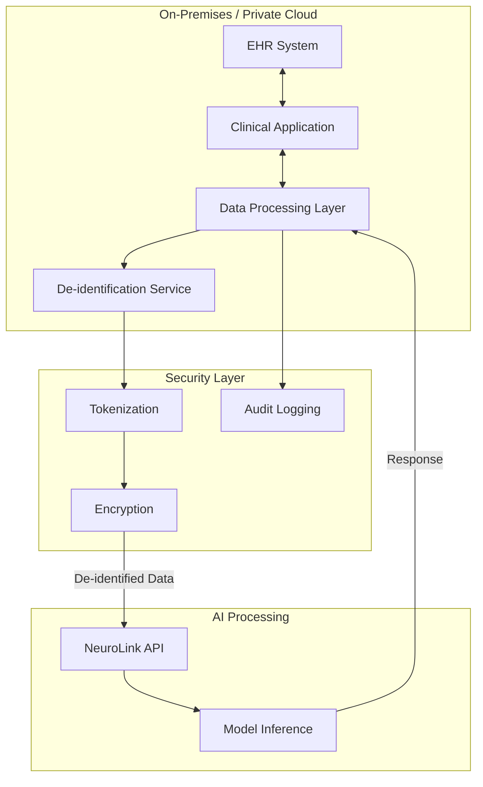

> **Note**: This is an illustrative implementation guide, not a case study of a real deployment.
{: .prompt-info }

In this guide, you will build a privacy-conscious healthcare AI assistant using NeuroLink. You will implement PHI de-identification, HIPAA-compatible provider selection, audit logging, provider failover for high availability, and clinical content validation. By the end, you will have a working architecture for healthcare AI that balances innovation with patient privacy.

> **Important Disclaimer**: This guide provides technical patterns and architectural considerations. It is not legal or compliance advice. Healthcare organizations must work with qualified compliance professionals, legal counsel, and security experts to ensure their implementations meet HIPAA and other regulatory requirements. NeuroLink's suitability for healthcare use cases depends on your specific deployment architecture and compliance requirements.

## Understanding HIPAA Compliance with NeuroLink

**Critical:** NeuroLink is an SDK that **routes requests to third-party AI providers**
(OpenAI, Anthropic, Google, AWS, Azure, etc.). HIPAA compliance depends on:

### 1. Provider Selection

| Provider | HIPAA Compliance | Requirements |
|----------|------------------|--------------|
| Azure OpenAI | ✅ Available with BAA | Business Associate Agreement required, zero data retention |
| AWS Bedrock | ✅ Available with BAA | Business Associate Agreement required, supported models vary |
| OpenAI API | ✅ Available with BAA | Enterprise tier with BAA available - verify current terms with OpenAI |
| Anthropic Claude (API) | ✅ Available with BAA | Enterprise BAA available, verify with sales for your use case |
| Google Vertex AI | ✅ Available with BAA | Business Associate Agreement available, depends on deployment |
| Anthropic (Consumer) | ❌ Not compliant | Consumer-tier API only, not suitable for PHI |
| Google AI Studio | ❌ Not compliant | Consumer-tier API only, not suitable for PHI |

**Information current as of publication date - verify directly with providers before implementation**

> **Important - OpenAI HIPAA Compliance (Jan 2026):**
> OpenAI offers HIPAA compliance with the following options:
>
> 1. **Azure OpenAI Service**: BAA signed, zero data retention, no data sharing with OpenAI
> 2. **OpenAI API Enterprise**: BAA signed, zero data retention option available
>
> The consumer-tier OpenAI API is NOT HIPAA-compliant. Healthcare deployments must use one of the above options.
{: .prompt-warning }

### 2. Business Associate Agreements (BAAs)

You **must** obtain BAAs from:

- Your AI provider (e.g., Microsoft for Azure OpenAI)
- Any infrastructure providers
- NeuroLink itself does not process data - the provider does

### 3. Your Responsibilities

- Deploy on HIPAA-compliant infrastructure
- Implement access controls and audit logging
- Use NeuroLink's HITL features for sensitive operations
- Never send PHI to non-BAA providers

**Recommendation:** Use Azure OpenAI or AWS Bedrock with appropriate BAAs for
HIPAA-compliant deployments.

## Architecture Patterns for Healthcare AI

When building healthcare AI applications, consider a layered architecture that separates sensitive data handling from AI processing.



## Key Privacy Considerations

Healthcare AI implementations must address several critical privacy concerns:

### Protected Health Information (PHI) Handling

When building applications that process clinical data:

- **Data minimization**: Only send the minimum necessary information to AI services
- **De-identification**: Consider removing or tokenizing identifiers before AI processing
- **Encryption**: Use encryption for data in transit (TLS 1.3) and at rest
- **Audit trails**: Maintain comprehensive logs of all AI interactions

### Regulatory Landscape

Healthcare applications typically need to consider:

- **HIPAA**: If handling PHI, understand requirements for Business Associate Agreements, security safeguards, and breach notification
- **State privacy laws**: Many states have additional health privacy requirements
- **Industry standards**: Consider frameworks like HITRUST for security controls

## Technical Implementation Patterns

### Pattern 1: PHI De-identification Before AI Processing

A common pattern is to de-identify data before sending it to AI services:

```typescript
import { NeuroLink } from '@juspay/neurolink';

// Initialize NeuroLink
const neurolink = new NeuroLink();

// De-identification configuration
interface DeidentificationConfig {
  entities: string[];
  action: 'remove' | 'tokenize' | 'generalize';
}

const deidentConfig: DeidentificationConfig = {
  entities: [
    'patient_name',
    'date_of_birth',
    'medical_record_number',
    'social_security_number',
    'address',
    'phone_number',
    'email_address',
  ],
  action: 'tokenize',
};

// Token mapping for re-identification
const tokenMap = new Map<string, string>();

/**
 * ⚠️ **CRITICAL SECURITY WARNING**: Do NOT use regex-based pattern matching for PHI de-identification.
 *
 * Regex patterns are insufficient and dangerous for healthcare data:
 * - Cannot reliably detect contextual PHI (e.g., "John" in patient context vs. in medical text)
 * - High false positive/negative rates
 * - Fails with abbreviations, nicknames, and data variations
 * - Not validated against HIPAA standards
 *
 * **REQUIRED:** Use specialized de-identification libraries:
 * - AWS Comprehend Medical (https://aws.amazon.com/comprehend/medical/)
 * - Microsoft Presidio (https://microsoft.github.io/presidio/)
 * - Google Healthcare DLP API (https://cloud.google.com/dlp)
 *
 * This function is a placeholder for demonstration purposes ONLY.
 */
function deidentifyText(text: string, config: DeidentificationConfig): string {
  // In production, integrate with proper de-identification services
  // This is a conceptual placeholder
  throw new Error('Production de-identification not implemented. Use AWS Comprehend Medical, Microsoft Presidio, or Google DLP API.');
}

function reidentifyText(text: string): string {
  let reidentified = text;

  tokenMap.forEach((original, token) => {
    reidentified = reidentified.replace(token, original);
  });

  return reidentified;
}

async function processWithDeidentification(clinicalNote: string): Promise<string> {
  // Step 1: De-identify before AI processing
  const deidentifiedNote = deidentifyText(clinicalNote, deidentConfig);

  // Step 2: Process with AI using de-identified data
  const response = await neurolink.generate({
    provider: 'openai',
    model: 'gpt-4o',
    input: {
      text: `You are a clinical documentation assistant. Summarize the provided clinical note.\n\n${deidentifiedNote}`,
    },
  });

  // Step 3: Re-identify response for internal use
  const result = reidentifyText(response.content);

  return result;
}
```

### Pattern 2: Comprehensive Audit Logging

Healthcare applications require robust audit trails:

```typescript
import { NeuroLink } from '@juspay/neurolink';
import crypto from 'crypto';

interface AuditRecord {
  timestamp: string;
  userId: string;
  sessionId: string;
  action: 'generate' | 'review' | 'approve' | 'reject';
  contentHash: string;
  modelId: string;
  metadata: Record<string, unknown>;
}

class AuditLogger {
  private records: AuditRecord[] = [];

  log(record: Omit<AuditRecord, 'timestamp'>): void {
    const fullRecord: AuditRecord = {
      ...record,
      timestamp: new Date().toISOString(),
    };

    // In production, send to secure audit log storage
    // Consider SIEM integration, immutable storage, etc.
    this.records.push(fullRecord);

    console.log('[AUDIT]', JSON.stringify(fullRecord));
  }

  hashContent(content: string): string {
    return crypto.createHash('sha256').update(content).digest('hex');
  }
}

const auditLogger = new AuditLogger();
const neurolink = new NeuroLink();

async function generateWithAudit(
  userId: string,
  sessionId: string,
  prompt: string
): Promise<{ content: string; auditId: string }> {
  const response = await neurolink.generate({
    provider: 'openai',
    model: 'gpt-4o',
    input: { text: prompt },
  });

  const auditId = crypto.randomUUID();

  auditLogger.log({
    userId,
    sessionId,
    action: 'generate',
    contentHash: auditLogger.hashContent(response.content),
    modelId: 'gpt-4o',
    metadata: {
      auditId,
      promptLength: prompt.length,
      responseLength: response.content.length,
    },
  });

  return {
    content: response.content,
    auditId,
  };
}
```

### Pattern 3: Provider Failover for Reliability

Next, you will configure provider failover so your healthcare application maintains uptime even when a provider goes down.

**Option A: Built-in Orchestration (Recommended)**

NeuroLink provides built-in failover orchestration that automatically handles provider failures:

```typescript
import { NeuroLink } from '@juspay/neurolink';

const neurolink = new NeuroLink({
  enableOrchestration: true, // Enables automatic failover to configured backup providers
});

async function generateWithBuiltInFailover(prompt: string): Promise<string> {
  const response = await neurolink.generate({
    model: 'gpt-4o',
    input: { text: prompt },
    timeout: 30000,
  });

  return response.content;
}
```

**Option B: Manual Failover Loop**

For more control over failover behavior, you can implement a manual loop:

```typescript
import { NeuroLink } from '@juspay/neurolink';

const neurolink = new NeuroLink();

async function generateWithManualFailover(prompt: string): Promise<string> {
  // Configure multiple providers for fallback
  const providers = [
    { model: 'gpt-4o', provider: 'openai' },
    { model: 'claude-3-5-sonnet-20241022', provider: 'anthropic' },
    { model: 'gemini-1.5-pro', provider: 'google-ai' },
  ];

  for (const { model, provider } of providers) {
    try {
      const response = await neurolink.generate({
        model,
        input: { text: prompt },
        timeout: 30000, // 30 second timeout
      });

      console.log(`Successfully used provider: ${provider}`);
      return response.content;
    } catch (error) {
      console.warn(`Provider ${provider} failed, trying next...`);
      continue;
    }
  }

  throw new Error('All providers failed');
}
```

### Pattern 4: Content Validation and Safety Checks

You will now add validation for AI-generated clinical content to catch uncertainty markers and dosage references that require physician review:

```typescript
import { NeuroLink } from '@juspay/neurolink';

const neurolink = new NeuroLink();

interface ValidationResult {
  isValid: boolean;
  warnings: string[];
  requiresReview: boolean;
}

function validateClinicalContent(content: string): ValidationResult {
  const warnings: string[] = [];
  let requiresReview = false;

  // Check for uncertainty markers
  const uncertaintyPatterns = [
    /\bunsure\b/i,
    /\buncertain\b/i,
    /\bmay be\b/i,
    /\bpossibly\b/i,
    /\bcannot determine\b/i,
  ];

  for (const pattern of uncertaintyPatterns) {
    if (pattern.test(content)) {
      warnings.push('Content contains uncertainty markers - requires physician review');
      requiresReview = true;
      break;
    }
  }

  // Check for medication mentions (simplified example)
  const medicationPattern = /\b\d+\s*(mg|mcg|ml|units?)\b/i;
  if (medicationPattern.test(content)) {
    warnings.push('Content contains dosage information - verify accuracy');
    requiresReview = true;
  }

  return {
    isValid: true,
    warnings,
    requiresReview,
  };
}

async function generateClinicalDocumentation(
  encounterNotes: string
): Promise<{ content: string; validation: ValidationResult }> {
  const response = await neurolink.generate({
    provider: 'openai',
    model: 'gpt-4o',
    input: {
      text: `You are a clinical documentation assistant. Generate a structured clinical note based on the encounter information. Flag any areas of uncertainty. Always defer to physician judgment for clinical decisions.\n\n${encounterNotes}`,
    },
  });

  const validation = validateClinicalContent(response.content);

  return {
    content: response.content,
    validation,
  };
}
```

## Workflow Integration Considerations

### Human-in-the-Loop Review

For healthcare AI applications, human review is typically essential:

```typescript
import { NeuroLink } from '@juspay/neurolink';

type ReviewStatus = 'pending' | 'approved' | 'modified' | 'rejected';

interface DocumentDraft {
  id: string;
  content: string;
  generatedAt: string;
  status: ReviewStatus;
  reviewedBy?: string;
  reviewedAt?: string;
  modifications?: string;
}

class ClinicalDocumentationWorkflow {
  private drafts: Map<string, DocumentDraft> = new Map();
  private neurolink: NeuroLink;

  constructor() {
    this.neurolink = new NeuroLink();
  }

  async generateDraft(encounterData: string): Promise<DocumentDraft> {
    const response = await this.neurolink.generate({
      provider: 'openai',
      model: 'gpt-4o',
      input: {
        text: `Generate a clinical note draft. This is a draft for physician review.\n\n${encounterData}`,
      },
    });

    const draft: DocumentDraft = {
      id: crypto.randomUUID(),
      content: response.content,
      generatedAt: new Date().toISOString(),
      status: 'pending',
    };

    this.drafts.set(draft.id, draft);
    return draft;
  }

  async reviewDraft(
    draftId: string,
    reviewerId: string,
    action: 'approve' | 'modify' | 'reject',
    modifications?: string
  ): Promise<DocumentDraft> {
    const draft = this.drafts.get(draftId);
    if (!draft) {
      throw new Error('Draft not found');
    }

    draft.reviewedBy = reviewerId;
    draft.reviewedAt = new Date().toISOString();

    switch (action) {
      case 'approve':
        draft.status = 'approved';
        break;
      case 'modify':
        draft.status = 'modified';
        draft.modifications = modifications;
        draft.content = modifications || draft.content;
        break;
      case 'reject':
        draft.status = 'rejected';
        break;
    }

    return draft;
  }
}
```

## EHR Integration Patterns

When integrating with Electronic Health Record systems, consider standard interoperability protocols:

### FHIR-Based Integration

```typescript
import { NeuroLink } from '@juspay/neurolink';

// Example FHIR client configuration (simplified)
interface FHIRConfig {
  baseUrl: string;
  clientId: string;
  scopes: string[];
}

const fhirConfig: FHIRConfig = {
  baseUrl: process.env.FHIR_ENDPOINT || '',
  clientId: process.env.FHIR_CLIENT_ID || '',
  scopes: [
    'patient/Patient.read',
    'patient/Encounter.read',
    'patient/DocumentReference.write',
  ],
};

// This is a conceptual example - actual FHIR integration
// requires proper OAuth2/SMART on FHIR authentication
async function createDocumentReference(
  patientId: string,
  content: string,
  encounterId: string
): Promise<void> {
  const documentReference = {
    resourceType: 'DocumentReference',
    status: 'current',
    type: {
      coding: [{
        system: 'http://loinc.org',
        code: '34109-9',
        display: 'Note',
      }],
    },
    subject: {
      reference: `Patient/${patientId}`,
    },
    context: {
      encounter: [{
        reference: `Encounter/${encounterId}`,
      }],
    },
    content: [{
      attachment: {
        contentType: 'text/plain',
        data: Buffer.from(content).toString('base64'),
      },
    }],
  };

  // Submit to FHIR server
  // In production, use proper FHIR client with authentication
  console.log('Would create DocumentReference:', documentReference);
}
```

## Monitoring and Quality Assurance

### Tracking AI Performance

```typescript
interface QualityMetrics {
  totalGenerations: number;
  approvedWithoutModification: number;
  approvedWithModification: number;
  rejected: number;
  averageReviewTime: number;
}

class QualityMonitor {
  private metrics: QualityMetrics = {
    totalGenerations: 0,
    approvedWithoutModification: 0,
    approvedWithModification: 0,
    rejected: 0,
    averageReviewTime: 0,
  };

  recordGeneration(): void {
    this.metrics.totalGenerations++;
  }

  recordReview(
    status: 'approved' | 'modified' | 'rejected',
    reviewTimeSeconds: number
  ): void {
    switch (status) {
      case 'approved':
        this.metrics.approvedWithoutModification++;
        break;
      case 'modified':
        this.metrics.approvedWithModification++;
        break;
      case 'rejected':
        this.metrics.rejected++;
        break;
    }

    // Update rolling average
    const totalReviews =
      this.metrics.approvedWithoutModification +
      this.metrics.approvedWithModification +
      this.metrics.rejected;

    this.metrics.averageReviewTime =
      (this.metrics.averageReviewTime * (totalReviews - 1) + reviewTimeSeconds) / totalReviews;
  }

  getAccuracyRate(): number {
    const totalReviewed =
      this.metrics.approvedWithoutModification +
      this.metrics.approvedWithModification +
      this.metrics.rejected;

    if (totalReviewed === 0) return 0;

    return this.metrics.approvedWithoutModification / totalReviewed;
  }

  getMetricsSummary(): QualityMetrics {
    return { ...this.metrics };
  }
}
```

## Security Best Practices

When building healthcare AI applications:

1. **Access Control**: Implement role-based access aligned with clinical workflows
2. **Key Management**: Use hardware security modules (HSMs) or cloud key management services
3. **Network Security**: Deploy within private networks when possible
4. **Encryption**: Use TLS 1.3 for transit, AES-256 for storage
5. **Audit Logging**: Maintain immutable audit trails for compliance
6. **Incident Response**: Have documented procedures for AI-related incidents

## Compliance Checklist

Before deploying healthcare AI applications, consider:

- [ ] Consulted with legal counsel on regulatory requirements
- [ ] Completed security risk assessment
- [ ] Established vendor agreements (BAAs if required)
- [ ] Implemented PHI safeguards appropriate to your use case
- [ ] Created audit logging and retention policies
- [ ] Documented AI usage in clinical workflows
- [ ] Established human review processes
- [ ] Trained staff on appropriate AI use
- [ ] Created incident response procedures
- [ ] Planned for ongoing monitoring and quality assurance

## What's Next

You have built a healthcare AI assistant with de-identification, audit logging, failover, validation, and HITL review. Here is the recommended path forward:

1. **Start with provider selection** -- sign BAAs with Azure OpenAI or AWS Bedrock before processing any PHI
2. **Implement de-identification** -- integrate AWS Comprehend Medical or Microsoft Presidio for production PHI handling
3. **Add audit logging** -- connect the `AuditLogger` to your SIEM for compliance-ready record keeping
4. **Configure failover** -- set up at least two HIPAA-compliant providers for every clinical pathway
5. **Deploy validation** -- use the content validation pattern to flag uncertainty markers and dosage references for physician review

Work closely with your compliance, legal, and security teams to ensure your implementation meets all applicable requirements for your specific jurisdiction and use case.

---

*For questions about NeuroLink's capabilities for healthcare applications, including deployment options and security features, contact our enterprise team.*

---

**Related posts:**

- [Building RAG Applications with NeuroLink SDK](/posts/rag-implementation/)
- [Human-in-the-Loop (HITL) Security Guide for NeuroLink](/posts/hitl-guardrails-guide/)
- [Building Cost-Effective AI for FinTech: A Multi-Provider Routing Guide](/posts/case-study-fintech/)
