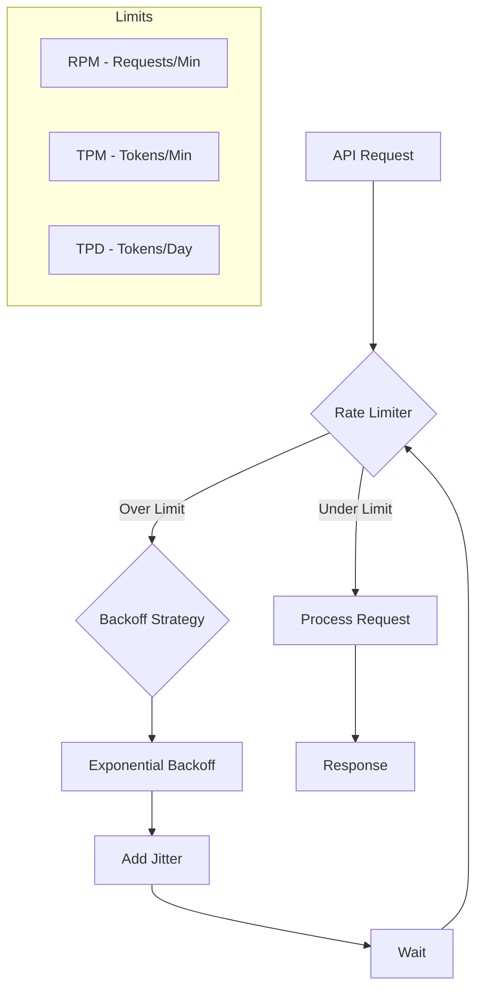
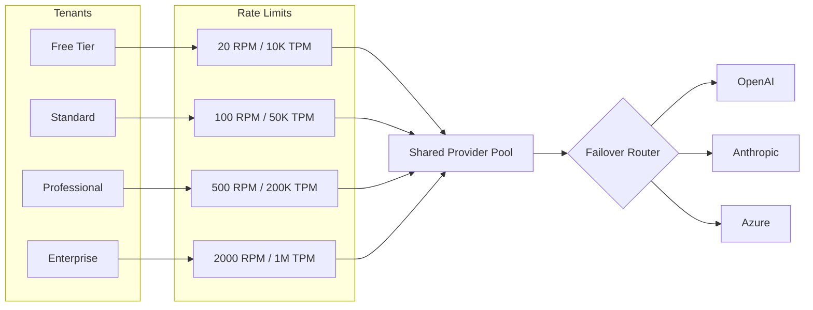

> **Implementation Note**: You will implement these patterns on top of NeuroLink's core API. They are not built-in SDK features but represent recommended approaches you can build yourself.
{: .prompt-info }

In this guide, you will build a complete rate limiting and quota management system for AI applications. You will implement exponential backoff with jitter, proactive token bucket rate limiting, daily and monthly quota tracking, multi-tenant per-user limits, multi-provider failover on rate limit errors, and Prometheus-compatible monitoring. By the end, your application will handle rate limits gracefully instead of crashing when providers push back.



## Understanding Rate Limits in the AI Ecosystem

Before implementing solutions, you need to understand the various types of rate limits you will encounter and why they exist.

### Types of Rate Limits

**Requests Per Minute (RPM)**
The most common limit restricts how many API calls you can make within a time window. For example, OpenAI's GPT-4 might limit you to 500 requests per minute on certain tiers.

**Tokens Per Minute (TPM)**
Beyond request counts, providers limit total token throughput. You might have 90,000 TPM, meaning both your inputs and outputs count against this budget.

**Tokens Per Day (TPD)**
Some providers implement daily caps to prevent runaway costs and ensure fair resource distribution across their customer base.

**Concurrent Requests**
Limits on simultaneous in-flight requests prevent any single customer from monopolizing compute resources.

## Error Handling for Rate Limiting

When implementing retry strategies, you need to handle different error types that may occur during AI generation. NeuroLink throws standard JavaScript Error objects with descriptive messages that you can inspect to determine the error type.

> **Note:** NeuroLink error classes are defined internally but not exported from the main SDK. Use error message inspection to classify errors reliably.

Common error scenarios you may encounter:

- **Rate limit errors**: Check if `error.message` includes `'rate limit'` or `'429'` - implement backoff
- **Network errors**: Check if `error.message` includes `'network'` or `'ECONNREFUSED'` - retry with backoff
- **Authentication errors**: Check if `error.message` includes `'authentication'` or `'401'` - check configuration
- **Provider errors**: Upstream provider issues - consider failover

## Implementing Exponential Backoff

When rate limits are hit, the most fundamental technique is exponential backoff. This pattern reduces retry frequency over time, preventing thundering herd problems while eventually succeeding.

> **⚠️ Note:** This is application-level code you must implement. NeuroLink provides the SDK, but retry and backoff logic must be built by your application. The patterns below show how to implement exponential backoff yourself.
{: .prompt-warning }

### Basic Exponential Backoff with NeuroLink

```typescript
import { NeuroLink } from '@juspay/neurolink';

const neurolink = new NeuroLink();

function isRateLimitError(error: unknown): boolean {
  if (error instanceof Error) {
    const message = error.message.toLowerCase();
    return message.includes('rate limit') || message.includes('429');
  }
  return false;
}

async function generateWithBackoff(
  prompt: string,
  maxRetries: number = 5
): Promise<string> {
  const baseDelay = 1000; // 1 second
  const maxDelay = 60000; // 60 seconds

  for (let attempt = 0; attempt < maxRetries; attempt++) {
    try {
      const result = await neurolink.generate({
        input: { text: prompt },
        provider: 'openai',
        model: 'gpt-4-turbo',
      });
      return result.content;

    } catch (error) {
      // Only retry on rate limit errors
      if (!isRateLimitError(error)) {
        throw error;
      }

      if (attempt === maxRetries - 1) {
        throw error;
      }

      // Calculate delay with exponential backoff
      const delay = Math.min(baseDelay * Math.pow(2, attempt), maxDelay);

      // Add jitter to prevent synchronized retries
      const jitter = Math.random() * delay * 0.1;
      const totalDelay = delay + jitter;

      console.log(
        `Rate limited. Waiting ${(totalDelay / 1000).toFixed(2)}s before retry ${attempt + 1}`
      );

      await new Promise(resolve => setTimeout(resolve, totalDelay));
    }
  }

  throw new Error('Max retries exceeded');
}

// Usage
const response = await generateWithBackoff('Explain quantum computing');
console.log(response);
```

### Adding Full Jitter

Jitter prevents the thundering herd problem where many clients retry simultaneously:

```typescript
function calculateBackoffWithJitter(
  attempt: number,
  baseDelay: number = 1000,
  maxDelay: number = 60000
): number {
  const exponentialDelay = Math.min(baseDelay * Math.pow(2, attempt), maxDelay);

  // Full jitter - most aggressive collision avoidance
  const fullJitter = Math.random() * exponentialDelay;

  // Equal jitter - balanced approach (recommended)
  const equalJitter = exponentialDelay / 2 + Math.random() * (exponentialDelay / 2);

  // Decorrelated jitter - best for high-contention scenarios
  const decorrelatedBase = baseDelay;
  const decorrelatedJitter = Math.min(
    maxDelay,
    Math.random() * (exponentialDelay * 3 - decorrelatedBase) + decorrelatedBase
  );

  return equalJitter; // Recommended for most use cases
}
```

### Retry Wrapper with Comprehensive Error Handling

A production-ready retry wrapper that handles all NeuroLink error types:

```typescript
import { NeuroLink } from '@juspay/neurolink';
import type { GenerateOptions, GenerateResult } from '@juspay/neurolink';

// Helper functions to identify error types by inspecting error messages
function isRateLimitError(error: unknown): boolean {
  if (error instanceof Error) {
    const message = error.message.toLowerCase();
    return message.includes('rate limit') || message.includes('429');
  }
  return false;
}

function isNetworkError(error: unknown): boolean {
  if (error instanceof Error) {
    const message = error.message.toLowerCase();
    return message.includes('network') || message.includes('econnrefused') ||
           message.includes('etimedout') || message.includes('connection');
  }
  return false;
}

function isAuthError(error: unknown): boolean {
  if (error instanceof Error) {
    const message = error.message.toLowerCase();
    return message.includes('authentication') || message.includes('401') ||
           message.includes('unauthorized');
  }
  return false;
}

function isRetryableError(error: unknown): boolean {
  return isRateLimitError(error) || isNetworkError(error);
}

interface RetryConfig {
  maxRetries: number;
  baseDelay: number;
  maxDelay: number;
}

const defaultRetryConfig: RetryConfig = {
  maxRetries: 5,
  baseDelay: 1000,
  maxDelay: 60000
};

async function generateWithRetry(
  neurolink: NeuroLink,
  options: GenerateOptions,
  config: Partial<RetryConfig> = {}
): Promise<GenerateResult> {
  const { maxRetries, baseDelay, maxDelay } = {
    ...defaultRetryConfig,
    ...config
  };

  let lastError: Error | null = null;

  for (let attempt = 0; attempt < maxRetries; attempt++) {
    try {
      return await neurolink.generate(options);
    } catch (error) {
      lastError = error as Error;

      // Check if error is retryable
      if (!isRetryableError(error)) {
        // Authentication errors should not be retried
        if (isAuthError(error)) {
          console.error('Authentication failed - check your API keys');
        }
        throw error;
      }

      if (attempt === maxRetries - 1) {
        break;
      }

      const delay = calculateBackoffWithJitter(attempt, baseDelay, maxDelay);

      console.log(
        `[Attempt ${attempt + 1}/${maxRetries}] ` +
        `${isRateLimitError(error) ? 'Rate limited' : 'Network error'}. ` +
        `Retrying in ${(delay / 1000).toFixed(2)}s...`
      );

      await new Promise(resolve => setTimeout(resolve, delay));
    }
  }

  throw lastError ?? new Error('Max retries exceeded');
}

// Usage
const neurolink = new NeuroLink();

const result = await generateWithRetry(neurolink, {
  input: { text: 'Explain machine learning' },
  provider: 'anthropic',
  model: 'claude-sonnet-4-5-20250929',
}, {
  maxRetries: 3,
  baseDelay: 2000
});

console.log(result.content);
```

## Proactive Rate Limit Management

Now you will move from reactive to proactive rate limiting. Instead of waiting for errors, you will track your request and token budgets and throttle requests before hitting provider limits.

> **⚠️ Note:** This is application-level code you must implement. NeuroLink provides the SDK, but rate limiting and quota management must be built by your application. The patterns below show how to implement proactive rate limiting yourself.
{: .prompt-warning }

### Token Bucket Rate Limiter

The token bucket algorithm smooths request rates to stay within limits:

```typescript
import { NeuroLink } from '@juspay/neurolink';
import type { GenerateOptions, GenerateResult } from '@juspay/neurolink';

class TokenBucket {
  private tokens: number;
  private lastRefill: number;

  constructor(
    private readonly rate: number,      // tokens per second
    private readonly capacity: number   // max tokens
  ) {
    this.tokens = capacity;
    this.lastRefill = Date.now();
  }

  async acquire(tokens: number = 1): Promise<void> {
    this.refill();

    if (this.tokens >= tokens) {
      this.tokens -= tokens;
      return;
    }

    // Calculate wait time for sufficient tokens
    const tokensNeeded = tokens - this.tokens;
    const waitTime = (tokensNeeded / this.rate) * 1000;

    await new Promise(resolve => setTimeout(resolve, waitTime));
    this.refill();
    this.tokens -= tokens;
  }

  private refill(): void {
    const now = Date.now();
    const elapsed = (now - this.lastRefill) / 1000;
    this.tokens = Math.min(this.capacity, this.tokens + elapsed * this.rate);
    this.lastRefill = now;
  }

  getAvailableTokens(): number {
    this.refill();
    return this.tokens;
  }
}

// Rate-limited NeuroLink wrapper
class RateLimitedNeuroLink {
  private neurolink: NeuroLink;
  private requestBucket: TokenBucket;
  private tokenBucket: TokenBucket;

  constructor(
    requestsPerMinute: number = 500,
    tokensPerMinute: number = 90000
  ) {
    this.neurolink = new NeuroLink();
    // Convert per-minute to per-second
    this.requestBucket = new TokenBucket(requestsPerMinute / 60, requestsPerMinute);
    this.tokenBucket = new TokenBucket(tokensPerMinute / 60, tokensPerMinute);
  }

  async generate(options: GenerateOptions): Promise<GenerateResult> {
    // Estimate tokens for the request (rough heuristic)
    const estimatedInputTokens = Math.ceil(options.input.text.length / 4);
    const estimatedOutputTokens = options.maxTokens ?? 1000;
    const totalEstimatedTokens = estimatedInputTokens + estimatedOutputTokens;

    // Wait for both request and token budgets
    await Promise.all([
      this.requestBucket.acquire(1),
      this.tokenBucket.acquire(totalEstimatedTokens)
    ]);

    return this.neurolink.generate(options);
  }

  async stream(options: Parameters<NeuroLink['stream']>[0]) {
    const estimatedInputTokens = Math.ceil(options.input.text.length / 4);
    await Promise.all([
      this.requestBucket.acquire(1),
      this.tokenBucket.acquire(estimatedInputTokens)
    ]);

    return this.neurolink.stream(options);
  }
}

// Usage
const rateLimitedClient = new RateLimitedNeuroLink(100, 50000);

const result = await rateLimitedClient.generate({
  input: { text: 'What is the meaning of life?' },
  provider: 'openai',
  model: 'gpt-4-turbo',
});
```

### Sliding Window Rate Limiter

For more precise rate limiting with a sliding time window:

```typescript
class SlidingWindowRateLimiter {
  private requests: number[] = [];

  constructor(
    private readonly maxRequests: number,
    private readonly windowMs: number
  ) {}

  async acquire(): Promise<void> {
    const now = Date.now();

    // Remove expired entries
    this.requests = this.requests.filter(
      timestamp => now - timestamp < this.windowMs
    );

    if (this.requests.length >= this.maxRequests) {
      // Calculate wait time until oldest request expires
      const oldestRequest = this.requests[0];
      const waitTime = this.windowMs - (now - oldestRequest) + 10; // 10ms buffer

      await new Promise(resolve => setTimeout(resolve, waitTime));
      return this.acquire(); // Retry after waiting
    }

    this.requests.push(now);
  }

  getCurrentRate(): number {
    const now = Date.now();
    this.requests = this.requests.filter(
      timestamp => now - timestamp < this.windowMs
    );
    return this.requests.length;
  }

  getRemainingCapacity(): number {
    return this.maxRequests - this.getCurrentRate();
  }
}
```

## Quota Management Strategies

Beyond per-minute rate limits, managing daily and monthly quotas requires different approaches.

### Quota Tracker with Usage Projection

```typescript
import { NeuroLink } from '@juspay/neurolink';
import type { GenerateResult } from '@juspay/neurolink';

interface UsageRecord {
  timestamp: number;
  tokens: number;
  provider: string;
  model: string;
}

class QuotaManager {
  private usageHistory: UsageRecord[] = [];

  constructor(
    private readonly dailyTokenLimit: number,
    private readonly monthlyTokenLimit: number
  ) {}

  recordUsage(result: GenerateResult): void {
    if (result.usage) {
      this.usageHistory.push({
        timestamp: Date.now(),
        tokens: result.usage.total ?? 0,
        provider: result.provider ?? 'unknown',
        model: result.model ?? 'unknown'
      });
    }
  }

  getDailyUsage(): number {
    const oneDayAgo = Date.now() - 24 * 60 * 60 * 1000;
    return this.usageHistory
      .filter(record => record.timestamp > oneDayAgo)
      .reduce((sum, record) => sum + record.tokens, 0);
  }

  getMonthlyUsage(): number {
    const thirtyDaysAgo = Date.now() - 30 * 24 * 60 * 60 * 1000;
    return this.usageHistory
      .filter(record => record.timestamp > thirtyDaysAgo)
      .reduce((sum, record) => sum + record.tokens, 0);
  }

  canMakeRequest(estimatedTokens: number): { allowed: boolean; reason?: string } {
    const dailyUsed = this.getDailyUsage();
    const monthlyUsed = this.getMonthlyUsage();

    if (dailyUsed + estimatedTokens > this.dailyTokenLimit) {
      return {
        allowed: false,
        reason: `Daily limit exceeded: ${dailyUsed}/${this.dailyTokenLimit} tokens used`
      };
    }

    if (monthlyUsed + estimatedTokens > this.monthlyTokenLimit) {
      return {
        allowed: false,
        reason: `Monthly limit exceeded: ${monthlyUsed}/${this.monthlyTokenLimit} tokens used`
      };
    }

    return { allowed: true };
  }

  getProjectedDailyUsage(): number {
    const hourlyRate = this.getHourlyRate();
    const hoursRemaining = this.getHoursRemainingInDay();
    return this.getDailyUsage() + hourlyRate * hoursRemaining;
  }

  private getHourlyRate(): number {
    const oneHourAgo = Date.now() - 60 * 60 * 1000;
    return this.usageHistory
      .filter(record => record.timestamp > oneHourAgo)
      .reduce((sum, record) => sum + record.tokens, 0);
  }

  private getHoursRemainingInDay(): number {
    const now = new Date();
    return 24 - now.getHours() - now.getMinutes() / 60;
  }
}

// Usage
const quotaManager = new QuotaManager(
  1_000_000,   // 1M tokens per day
  25_000_000   // 25M tokens per month
);

const neurolink = new NeuroLink();

async function generateWithQuotaCheck(prompt: string): Promise<string> {
  const estimatedTokens = Math.ceil(prompt.length / 4) + 1000;

  const quotaCheck = quotaManager.canMakeRequest(estimatedTokens);
  if (!quotaCheck.allowed) {
    throw new Error(`Quota exceeded: ${quotaCheck.reason}`);
  }

  const result = await neurolink.generate({
    input: { text: prompt },
    provider: 'anthropic',
    model: 'claude-sonnet-4-5-20250929',
  });

  quotaManager.recordUsage(result);
  return result.content;
}
```

### Budget Allocation Across Services

When multiple services share a quota pool:

```typescript
import { NeuroLink } from '@juspay/neurolink';
import type { GenerateOptions, GenerateResult } from '@juspay/neurolink';

interface ServiceConfig {
  priority: 'high' | 'medium' | 'low';
  minShare: number;  // 0-1, minimum guaranteed share
  maxShare: number;  // 0-1, maximum allowed share
}

class BudgetAllocator {
  private usageByService: Map<string, number> = new Map();
  private lastRebalance: number = Date.now();

  constructor(
    private readonly totalDailyTokens: number,
    private readonly services: Record<string, ServiceConfig>,
    private readonly rebalanceIntervalMs: number = 300000 // 5 minutes
  ) {
    // Initialize usage tracking
    for (const service of Object.keys(services)) {
      this.usageByService.set(service, 0);
    }
  }

  async requestAllocation(
    serviceName: string,
    estimatedTokens: number
  ): Promise<{ granted: boolean; reason?: string }> {
    this.maybeRebalance();

    const config = this.services[serviceName];
    if (!config) {
      return { granted: false, reason: `Unknown service: ${serviceName}` };
    }

    const currentUsage = this.usageByService.get(serviceName) ?? 0;
    const maxAllowed = this.totalDailyTokens * config.maxShare;

    if (currentUsage + estimatedTokens > maxAllowed) {
      // Check if we can borrow from lower priority services
      if (config.priority === 'high' && this.hasBorrowableCapacity(estimatedTokens)) {
        return { granted: true };
      }
      return {
        granted: false,
        reason: `Service ${serviceName} exceeded max share (${currentUsage}/${maxAllowed})`
      };
    }

    return { granted: true };
  }

  recordUsage(serviceName: string, actualTokens: number): void {
    const current = this.usageByService.get(serviceName) ?? 0;
    this.usageByService.set(serviceName, current + actualTokens);
  }

  private hasBorrowableCapacity(tokensNeeded: number): boolean {
    let borrowable = 0;

    for (const [service, config] of Object.entries(this.services)) {
      if (config.priority === 'low') {
        const used = this.usageByService.get(service) ?? 0;
        const min = this.totalDailyTokens * config.minShare;
        borrowable += Math.max(0, this.totalDailyTokens * config.maxShare - Math.max(used, min));
      }
    }

    return borrowable >= tokensNeeded;
  }

  private maybeRebalance(): void {
    const now = Date.now();
    if (now - this.lastRebalance > this.rebalanceIntervalMs) {
      // Reset at midnight
      const today = new Date().toDateString();
      const lastDay = new Date(this.lastRebalance).toDateString();
      if (today !== lastDay) {
        for (const service of this.usageByService.keys()) {
          this.usageByService.set(service, 0);
        }
      }
      this.lastRebalance = now;
    }
  }

  getServiceStats(): Record<string, { used: number; remaining: number; percentage: number }> {
    const stats: Record<string, { used: number; remaining: number; percentage: number }> = {};

    for (const [service, config] of Object.entries(this.services)) {
      const used = this.usageByService.get(service) ?? 0;
      const maxAllowed = this.totalDailyTokens * config.maxShare;
      stats[service] = {
        used,
        remaining: maxAllowed - used,
        percentage: (used / maxAllowed) * 100
      };
    }

    return stats;
  }
}

// Usage
const allocator = new BudgetAllocator(
  1_000_000, // 1M total daily tokens
  {
    chatbot: { priority: 'high', minShare: 0.4, maxShare: 0.6 },
    contentGen: { priority: 'medium', minShare: 0.2, maxShare: 0.4 },
    analytics: { priority: 'low', minShare: 0.1, maxShare: 0.3 }
  }
);

const neurolink = new NeuroLink();

async function processChatbotRequest(prompt: string): Promise<GenerateResult> {
  const estimatedTokens = Math.ceil(prompt.length / 4) + 1000;

  const allocation = await allocator.requestAllocation('chatbot', estimatedTokens);
  if (!allocation.granted) {
    throw new Error(`Budget exhausted: ${allocation.reason}`);
  }

  const result = await neurolink.generate({
    input: { text: prompt },
    provider: 'openai',
    model: 'gpt-4-turbo',
  });

  allocator.recordUsage('chatbot', result.usage?.total ?? estimatedTokens);
  return result;
}
```

## Multi-Tenant Rate Limiting

Next, you will implement per-tenant rate limiting so each customer gets fair resource allocation based on their pricing tier.



### Per-Tenant Rate Limits

```typescript
import { NeuroLink } from '@juspay/neurolink';
import type { GenerateOptions, GenerateResult } from '@juspay/neurolink';

type TenantTier = 'free' | 'standard' | 'professional' | 'enterprise';

interface TierLimits {
  rpm: number;
  tpm: number;
}

const TIER_LIMITS: Record<TenantTier, TierLimits> = {
  free: { rpm: 20, tpm: 10000 },
  standard: { rpm: 100, tpm: 50000 },
  professional: { rpm: 500, tpm: 200000 },
  enterprise: { rpm: 2000, tpm: 1000000 }
};

// Custom error class for tenant rate limiting
class TenantRateLimitError extends Error {
  constructor(message: string, public tenantId: string, public tier: TenantTier) {
    super(message);
    this.name = 'TenantRateLimitError';
  }
}

class MultiTenantRateLimiter {
  private tenantLimiters: Map<string, {
    rpm: SlidingWindowRateLimiter;
    tpm: SlidingWindowRateLimiter;
    tier: TenantTier;
  }> = new Map();

  private neurolink: NeuroLink;

  constructor() {
    this.neurolink = new NeuroLink();
  }

  private getTenantLimiter(tenantId: string, tier: TenantTier = 'standard') {
    if (!this.tenantLimiters.has(tenantId)) {
      const limits = TIER_LIMITS[tier];
      this.tenantLimiters.set(tenantId, {
        rpm: new SlidingWindowRateLimiter(limits.rpm, 60000),
        tpm: new SlidingWindowRateLimiter(limits.tpm, 60000),
        tier
      });
    }
    return this.tenantLimiters.get(tenantId)!;
  }

  async generate(
    tenantId: string,
    tier: TenantTier,
    options: GenerateOptions
  ): Promise<GenerateResult> {
    const limiter = this.getTenantLimiter(tenantId, tier);

    // Check request limit
    if (limiter.rpm.getRemainingCapacity() <= 0) {
      throw new TenantRateLimitError(
        `Tenant ${tenantId} exceeded RPM limit for ${tier} tier`,
        tenantId,
        tier
      );
    }

    // Estimate tokens and check token limit
    const estimatedTokens = Math.ceil(options.input.text.length / 4) +
      (options.maxTokens ?? 1000);

    if (limiter.tpm.getRemainingCapacity() < estimatedTokens) {
      throw new TenantRateLimitError(
        `Tenant ${tenantId} exceeded TPM limit for ${tier} tier`,
        tenantId,
        tier
      );
    }

    // Acquire rate limit tokens
    await limiter.rpm.acquire();

    const result = await this.neurolink.generate(options);

    // Record actual token usage
    const actualTokens = result.usage?.total ?? estimatedTokens;
    // Record actual token usage in a single call
    await limiter.tpm.acquire(actualTokens);

    return result;
  }

  getTenantUsage(tenantId: string): {
    currentRpm: number;
    remainingRpm: number;
    currentTpm: number;
    remainingTpm: number;
    tier: TenantTier;
  } | null {
    const limiter = this.tenantLimiters.get(tenantId);
    if (!limiter) return null;

    const limits = TIER_LIMITS[limiter.tier];
    return {
      currentRpm: limiter.rpm.getCurrentRate(),
      remainingRpm: limiter.rpm.getRemainingCapacity(),
      currentTpm: limiter.tpm.getCurrentRate(),
      remainingTpm: limiter.tpm.getRemainingCapacity(),
      tier: limiter.tier
    };
  }
}

// Usage
const multiTenantLimiter = new MultiTenantRateLimiter();

// Handle request for a specific tenant
async function handleTenantRequest(
  tenantId: string,
  tier: TenantTier,
  prompt: string
): Promise<string> {
  try {
    const result = await multiTenantLimiter.generate(tenantId, tier, {
      input: { text: prompt },
      provider: 'openai',
      model: 'gpt-4-turbo',
    });
    return result.content;
  } catch (error) {
    if (error instanceof TenantRateLimitError) {
      // Return rate limit info to client
      const usage = multiTenantLimiter.getTenantUsage(tenantId);
      throw new Error(
        `Rate limit exceeded. Current usage: ${JSON.stringify(usage)}`
      );
    }
    throw error;
  }
}
```

## Multi-Provider Failover

You will now add automatic failover so that when one provider is rate limited, your system switches to another provider with a cooldown period:

```typescript
import { NeuroLink } from '@juspay/neurolink';
import type { GenerateOptions, GenerateResult } from '@juspay/neurolink';

function isRateLimitError(error: unknown): boolean {
  if (error instanceof Error) {
    const message = error.message.toLowerCase();
    return message.includes('rate limit') || message.includes('429');
  }
  return false;
}

interface ProviderConfig {
  name: string;
  priority: number;
  model: string;
  cooldownMs: number;
}

class MultiProviderFailover {
  private neurolink: NeuroLink;
  private providerCooldowns: Map<string, number> = new Map();
  private failoverCount: Map<string, number> = new Map();

  constructor(private providers: ProviderConfig[]) {
    this.neurolink = new NeuroLink();
    // Sort by priority
    this.providers.sort((a, b) => a.priority - b.priority);
  }

  async generate(options: Omit<GenerateOptions, 'provider' | 'model'>): Promise<GenerateResult & { failedOver: boolean; usedProvider: string }> {
    const errors: Array<{ provider: string; error: Error }> = [];

    for (const provider of this.getAvailableProviders()) {
      try {
        const result = await this.neurolink.generate({
          ...options,
          provider: provider.name as any,
          model: provider.model
        });

        return {
          ...result,
          failedOver: errors.length > 0,
          usedProvider: provider.name
        };

      } catch (error) {
        const err = error as Error;
        errors.push({ provider: provider.name, error: err });

        // Set cooldown for rate limited providers
        if (isRateLimitError(error)) {
          this.setCooldown(provider.name, provider.cooldownMs);
          console.log(
            `Provider ${provider.name} rate limited. ` +
            `Cooling down for ${provider.cooldownMs / 1000}s`
          );
        }

        // Track failover
        const count = this.failoverCount.get(provider.name) ?? 0;
        this.failoverCount.set(provider.name, count + 1);
      }
    }

    // All providers failed
    const errorSummary = errors
      .map(e => `${e.provider}: ${e.error.message}`)
      .join('; ');

    throw new Error(`All providers failed: ${errorSummary}`);
  }

  private getAvailableProviders(): ProviderConfig[] {
    const now = Date.now();
    return this.providers.filter(provider => {
      const cooldownUntil = this.providerCooldowns.get(provider.name) ?? 0;
      return now > cooldownUntil;
    });
  }

  private setCooldown(providerName: string, durationMs: number): void {
    this.providerCooldowns.set(providerName, Date.now() + durationMs);
  }

  getProviderStats(): Record<string, { available: boolean; failovers: number; cooldownRemaining: number }> {
    const now = Date.now();
    const stats: Record<string, { available: boolean; failovers: number; cooldownRemaining: number }> = {};

    for (const provider of this.providers) {
      const cooldownUntil = this.providerCooldowns.get(provider.name) ?? 0;
      stats[provider.name] = {
        available: now > cooldownUntil,
        failovers: this.failoverCount.get(provider.name) ?? 0,
        cooldownRemaining: Math.max(0, cooldownUntil - now)
      };
    }

    return stats;
  }
}

// Usage
const failoverClient = new MultiProviderFailover([
  { name: 'openai', priority: 1, model: 'gpt-4-turbo', cooldownMs: 60000 },
  { name: 'anthropic', priority: 2, model: 'claude-sonnet-4-5-20250929', cooldownMs: 60000 },
  { name: 'vertex', priority: 3, model: 'gemini-3-flash', cooldownMs: 30000 }
]);

const result = await failoverClient.generate({
  input: { text: 'Explain the theory of relativity' },
  maxTokens: 1000
});

console.log(`Response from ${result.usedProvider}:`);
console.log(result.content);

if (result.failedOver) {
  console.log('Note: Request failed over from primary provider');
  console.log('Provider stats:', failoverClient.getProviderStats());
}
```

> **Note:** Model names and IDs in code examples reflect versions available at time of writing. Model availability, naming conventions, and pricing change frequently. Always verify current model IDs with your provider's documentation before deploying to production.
{: .prompt-info }

## Monitoring and Alerting

Visibility into rate limit behavior is essential for optimization.

### Rate Limit Metrics Collector

```typescript
import { NeuroLink } from '@juspay/neurolink';
import type { GenerateResult } from '@juspay/neurolink';

interface RateLimitMetrics {
  rateLimitHits: number;
  retryAttempts: number;
  totalWaitTimeMs: number;
  requestsPerMinute: number;
  tokensPerMinute: number;
  failoverEvents: number;
  successRate: number;
}

class MetricsCollector {
  private metrics: Map<string, RateLimitMetrics> = new Map();
  private requestHistory: Array<{
    timestamp: number;
    provider: string;
    success: boolean;
    tokens: number;
    waitTime: number;
    retries: number;
    failedOver: boolean;
  }> = [];

  recordRequest(
    provider: string,
    result: GenerateResult,
    metadata: {
      success: boolean;
      waitTime: number;
      retries: number;
      failedOver: boolean;
      rateLimited: boolean;
    }
  ): void {
    this.requestHistory.push({
      timestamp: Date.now(),
      provider,
      success: metadata.success,
      tokens: result.usage?.total ?? 0,
      waitTime: metadata.waitTime,
      retries: metadata.retries,
      failedOver: metadata.failedOver
    });

    // Update provider metrics
    const current = this.getProviderMetrics(provider);
    if (metadata.rateLimited) current.rateLimitHits++;
    current.retryAttempts += metadata.retries;
    current.totalWaitTimeMs += metadata.waitTime;
    if (metadata.failedOver) current.failoverEvents++;
  }

  private getProviderMetrics(provider: string): RateLimitMetrics {
    if (!this.metrics.has(provider)) {
      this.metrics.set(provider, {
        rateLimitHits: 0,
        retryAttempts: 0,
        totalWaitTimeMs: 0,
        requestsPerMinute: 0,
        tokensPerMinute: 0,
        failoverEvents: 0,
        successRate: 100
      });
    }
    return this.metrics.get(provider)!;
  }

  getMetrics(provider?: string): RateLimitMetrics | Map<string, RateLimitMetrics> {
    this.updateCalculatedMetrics();

    if (provider) {
      return this.getProviderMetrics(provider);
    }
    return this.metrics;
  }

  private updateCalculatedMetrics(): void {
    const oneMinuteAgo = Date.now() - 60000;
    const recentRequests = this.requestHistory.filter(
      r => r.timestamp > oneMinuteAgo
    );

    // Group by provider
    const byProvider = new Map<string, typeof recentRequests>();
    for (const req of recentRequests) {
      const list = byProvider.get(req.provider) ?? [];
      list.push(req);
      byProvider.set(req.provider, list);
    }

    // Update calculated metrics
    for (const [provider, requests] of byProvider) {
      const metrics = this.getProviderMetrics(provider);
      metrics.requestsPerMinute = requests.length;
      metrics.tokensPerMinute = requests.reduce((sum, r) => sum + r.tokens, 0);
      metrics.successRate = requests.length > 0
        ? (requests.filter(r => r.success).length / requests.length) * 100
        : 100;
    }
  }

  exportToPrometheus(): string {
    this.updateCalculatedMetrics();

    const lines: string[] = [];
    for (const [provider, metrics] of this.metrics) {
      lines.push(`neurolink_rate_limit_hits{provider="${provider}"} ${metrics.rateLimitHits}`);
      lines.push(`neurolink_retry_attempts{provider="${provider}"} ${metrics.retryAttempts}`);
      lines.push(`neurolink_wait_time_ms{provider="${provider}"} ${metrics.totalWaitTimeMs}`);
      lines.push(`neurolink_rpm{provider="${provider}"} ${metrics.requestsPerMinute}`);
      lines.push(`neurolink_tpm{provider="${provider}"} ${metrics.tokensPerMinute}`);
      lines.push(`neurolink_failovers{provider="${provider}"} ${metrics.failoverEvents}`);
      lines.push(`neurolink_success_rate{provider="${provider}"} ${metrics.successRate}`);
    }
    return lines.join('\n');
  }

  getAlerts(): string[] {
    const alerts: string[] = [];

    for (const [provider, metrics] of this.metrics) {
      if (metrics.successRate < 95) {
        alerts.push(
          `WARNING: ${provider} success rate is ${metrics.successRate.toFixed(1)}%`
        );
      }
      if (metrics.rateLimitHits > 10) {
        alerts.push(
          `WARNING: ${provider} hit rate limits ${metrics.rateLimitHits} times`
        );
      }
      if (metrics.failoverEvents > 5) {
        alerts.push(
          `WARNING: ${provider} triggered ${metrics.failoverEvents} failover events`
        );
      }
    }

    return alerts;
  }
}

// Usage
const metricsCollector = new MetricsCollector();

// After each request
metricsCollector.recordRequest('openai', result, {
  success: true,
  waitTime: 0,
  retries: 0,
  failedOver: false,
  rateLimited: false
});

// Expose metrics endpoint
const prometheusMetrics = metricsCollector.exportToPrometheus();

// Check for alerts
const alerts = metricsCollector.getAlerts();
if (alerts.length > 0) {
  console.warn('Rate limiting alerts:', alerts);
}
```

## Best Practices Summary

### Design Principles

1. **Fail Gracefully**: Always have a degraded mode when limits are hit
2. **Be Predictable**: Users prefer consistent slower responses to intermittent failures
3. **Communicate Limits**: Surface rate limit status to end users when appropriate
4. **Plan for Growth**: Build systems that scale with increasing limits

### Implementation Checklist

- [ ] Implement exponential backoff with jitter
- [ ] Handle errors using error message inspection to classify rate limit, network, and authentication errors
- [ ] Track both RPM and TPM limits proactively
- [ ] Implement proactive rate limiting before hitting limits
- [ ] Set up quota tracking and projection
- [ ] Configure multi-provider failover
- [ ] Implement per-tenant rate limiting for multi-tenant apps
- [ ] Deploy comprehensive monitoring and alerting
- [ ] Document rate limit behavior for operations team

### Common Pitfalls to Avoid

1. **Ignoring Jitter**: Synchronized retries cause thundering herds
2. **Fixed Retry Counts**: Some limits need longer waits, not more retries
3. **Ignoring Token Limits**: RPM compliance does not guarantee TPM compliance
4. **No Monitoring**: Cannot optimize what you cannot measure
5. **Hardcoded Limits**: Provider limits change; make them configurable
6. **Poor Error Detection**: Implement robust error message inspection for reliable error identification

## What's Next

You have built a complete rate limiting system with exponential backoff, proactive token budgets, quota management, multi-tenant limits, multi-provider failover, and Prometheus monitoring. Here is the recommended implementation order:

1. **Start with backoff** -- add the `generateWithRetry` wrapper to every NeuroLink call in your application
2. **Add proactive limiting** -- deploy the `RateLimitedNeuroLink` wrapper to stay under provider limits
3. **Implement quota tracking** -- use the `QuotaManager` to enforce daily and monthly budgets
4. **Configure failover** -- set up the `MultiProviderFailover` with at least two providers
5. **Deploy monitoring** -- expose the `MetricsCollector` via a `/metrics` endpoint for Prometheus
6. **Add multi-tenant limits** -- implement per-tenant rate limiting when you start serving multiple customers

NeuroLink's multi-provider support makes it straightforward to implement all of these patterns. Start simple and layer on complexity as your application scales.

---

*Need help implementing rate limiting for your AI application? Our solutions team has helped dozens of enterprises handle millions of requests while staying within provider limits. Reach out for a consultation.*

---

**Related posts:**

- [Security Best Practices for AI Applications](/posts/enterprise-security-guide/)
- [Building a Healthcare AI Assistant with NeuroLink](/posts/healthcare-ai-assistant-guide/)
- [AI Observability: Monitoring LLM Applications in Production](/posts/monitoring-observability/)
