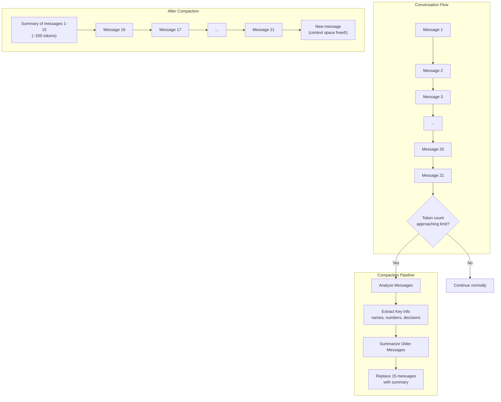
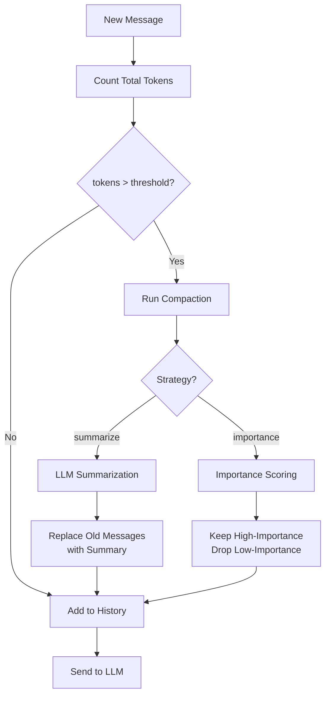

We designed context compaction to solve a fundamental constraint in long-running AI conversations: every LLM has a finite context window, and naive truncation destroys critical information. The trade-off space is well-defined -- you can sacrifice older message fidelity for continued conversation coherence, but only if you preserve the right information.

Every LLM has a finite context window -- ranging from 4,000 tokens for older models to 200,000 tokens for the latest ones. Long conversations, especially those involving tool calls (which consume significant tokens for function definitions, arguments, and results), fill context windows fast. A single tool-heavy exchange can use 2,000-5,000 tokens. Truncation drops messages indiscriminately: account numbers, approval decisions, error codes -- all gone. Context compaction takes a different approach: we use an LLM to summarize older messages while preserving five categories of semantically critical information (identifiers, decisions, technical details, action items, and sentiment). The result is a compressed conversation history that retains what matters while freeing token budget for new exchanges.

## How Context Compaction Works

The compaction pipeline monitors the conversation's token count and triggers automatically when it approaches the configured threshold:



The process is transparent to the user. They never see the compaction happening. The AI continues responding with full awareness of the conversation's history, referencing details from early messages that have been compressed into the summary.


## Enabling Context Compaction

Compaction is configured through the `conversationMemory` option in the NeuroLink constructor. You control when compaction triggers, how aggressively it compresses, and how many recent messages stay untouched:

```typescript
import { NeuroLink } from '@juspay/neurolink';

const neurolink = new NeuroLink({
  conversationMemory: {
    enabled: true,
    compaction: {
      enabled: true,
      tokenThreshold: 6000,      // Trigger compaction when context exceeds this
      targetTokens: 3000,        // Aim to reduce context to this size
      preserveRecentMessages: 5, // Always keep last 5 messages intact
      strategy: 'summarize',     // 'summarize' or 'importance'
    },
  },
});

// Use normally -- compaction happens automatically
const result = await neurolink.generate({
  input: { text: 'What was the account number I mentioned earlier?' },
  context: { sessionId: 'support-session-123' },
  provider: 'openai',
  model: 'gpt-4o',
});

// The AI can still recall information from compacted messages
// because key details (account numbers, names, decisions) are preserved in the summary
```

The configuration parameters control the compaction behavior:

- **`tokenThreshold`**: The token count at which compaction triggers. Set this below your model's context limit to leave room for the new message and response.
- **`targetTokens`**: The target size after compaction. The system compresses enough older messages to bring the total below this number.
- **`preserveRecentMessages`**: Recent messages are never compacted. This ensures the immediate conversation context is always available in full detail.
- **`strategy`**: The compaction algorithm -- either summarization-based or importance-based.

> **Note:** Set `tokenThreshold` to roughly 75% of your model's context window. This leaves headroom for the system prompt, new user message, and AI response.
{: .prompt-info }

## Compaction Strategies

We implemented two compaction strategies, each targeting a different set of trade-offs in the information-preservation vs. token-reduction spectrum.

### Summarization Strategy (Default)

The summarization strategy uses an LLM to generate a concise summary of older messages. It preserves the narrative flow, key decisions, and important details while dramatically reducing token count.

```typescript
compaction: {
  strategy: 'summarize',
  summaryPrompt: `Summarize the following conversation messages. Preserve ALL of:
- Names, account numbers, order IDs, and other identifiers
- Decisions made and agreements reached
- Action items and pending tasks
- Technical details and specifications mentioned
- Emotional tone and user sentiment

Be concise but do not lose any critical details.`,
  summaryProvider: 'openai',
  summaryModel: 'gpt-4o-mini', // Use cheap model for summarization
}
```

This strategy is best for general conversations, customer support sessions, and project discussions where the narrative arc matters. The summary model can be a cheaper model than the main conversation model -- summarization is a simpler task than the original conversation.

### Importance-Based Strategy

The importance-based strategy scores each message individually and keeps high-importance messages verbatim while removing low-importance ones. This preserves the exact wording of critical exchanges.

```typescript
compaction: {
  strategy: 'importance',
  importanceThreshold: 0.6,  // Keep messages scoring above 0.6
  scoringCriteria: [
    'Contains specific data (numbers, IDs, names)',
    'Records a decision or agreement',
    'Provides technical specifications',
    'Expresses user frustration or satisfaction',
    'Contains action items',
  ],
}
```

This strategy is best for technical conversations where exact wording matters -- code reviews, debugging sessions, and specification discussions. A brief context note replaces removed messages so the AI knows something was discussed without consuming tokens for the full text.

## What Gets Preserved During Compaction

The most critical aspect of compaction is what survives. Both strategies are designed to preserve five categories of information:

```mermaid
flowchart LR
    subgraph Before["Before Compaction (20 messages, 8000 tokens)"]
        B1["Greeting<br/>(low importance)"]
        B2["Account: ACC-12345<br/>(HIGH importance)"]
        B3["General chitchat<br/>(low importance)"]
        B4["Problem described<br/>(medium importance)"]
        B5["Troubleshooting steps<br/>(medium importance)"]
        B6["Decision: refund approved<br/>(HIGH importance)"]
        B7["Follow-up questions<br/>(low importance)"]
    end

    subgraph After["After Compaction (summary + 5 recent, 3500 tokens)"]
        A1["SUMMARY: Customer ACC-12345<br/>reported billing issue.<br/>Refund approved for $99."]
        A2["Recent message 16"]
        A3["Recent message 17"]
        A4["Recent message 18"]
        A5["Recent message 19"]
        A6["Recent message 20"]
    end

    Before -->|"Compaction"| After
```



1. **Identifiers**: Names, account numbers, order IDs, email addresses, phone numbers. These are the anchors that connect the conversation to real-world entities.
2. **Decisions**: Agreements, approvals, rejections, policy exceptions. If a supervisor approved a refund, that decision must survive compaction.
3. **Technical details**: Error codes, configuration values, specifications, version numbers. Losing a single digit in an error code makes it useless.
4. **Action items**: Tasks assigned, deadlines, commitments, next steps. Dropping an action item means it never gets done.
5. **Sentiment**: User frustration, satisfaction, urgency. The AI needs to maintain appropriate tone throughout the conversation.

## Manual Compaction Control

While automatic compaction handles most scenarios, you sometimes need manual control -- checking how much context is being used, triggering compaction early before a known-large prompt, or reviewing what has been compacted:

```typescript
// Check current context size
const stats = await neurolink.getConversationStats();
console.log('Total tokens in session:', stats.total);

// Manually trigger compaction
await neurolink.compactSession('session-123', {
  targetTokens: 2000,
  preserveRecentMessages: 3,
});

// Get compaction history for a session
const compactionLog = await neurolink.getCompactionHistory('session-123');
console.log('Compactions performed:', compactionLog.length);
console.log('Last compaction:', compactionLog[compactionLog.length - 1]);
// { timestamp: '...', messagesBefore: 25, messagesAfter: 8,
//   tokensBefore: 8500, tokensAfter: 3200 }
```

Manual compaction is useful in several scenarios:

- **Before large prompts**: If you know the next prompt will be large (e.g., pasting a document for analysis), compact first to make room.
- **Session handoffs**: When transferring a conversation from one agent to another, compact to create a clean summary of the history.
- **Performance monitoring**: Track compaction frequency to identify sessions that grow too fast (which may indicate prompt or workflow issues).

## Compaction with Different Providers

Different models have vastly different context windows. Your compaction thresholds should match the model you are using:

```typescript
// For models with smaller context windows (4K-8K)
const smallContextConfig = {
  compaction: {
    enabled: true,
    tokenThreshold: 3000,
    targetTokens: 1500,
    preserveRecentMessages: 3,
  },
};

// For models with large context windows (128K-200K)
const largeContextConfig = {
  compaction: {
    enabled: true,
    tokenThreshold: 100000,
    targetTokens: 50000,
    preserveRecentMessages: 20,
  },
};

// Per-request override
const result = await neurolink.generate({
  input: { text: userMessage },
  context: {
    sessionId: 'session-123',
    compaction: {
      tokenThreshold: 8000, // Override for this specific request
    },
  },
  provider: 'anthropic',
  model: 'claude-sonnet-4-5-20250929',
});
```

The per-request override is particularly useful when you switch models mid-conversation. If a session starts on a 128K model and is later routed to a smaller model (perhaps due to cost optimization or provider failover), you can lower the compaction threshold for that specific request.

## Compaction Decision Flow

The complete decision flow for each new message:



## Compaction vs. Other Context Management Strategies

Compaction is one of several strategies for managing long conversations. Here is how it compares:

| Strategy | How It Works | Pros | Cons |
|----------|-------------|------|------|
| **Truncation** | Drop oldest messages | Simple, fast | Loses critical context |
| **Sliding Window** | Keep last N messages | Predictable | No summarization |
| **Compaction** | Summarize + preserve key info | Retains important details | Costs extra LLM call |
| **RAG-based** | Store all messages, retrieve relevant | Full history available | Higher latency |
| **Hierarchical** | Multi-level summaries | Handles very long conversations | Complex |

Compaction occupies the sweet spot between simplicity and effectiveness. Truncation and sliding windows are simpler but lose information. RAG-based and hierarchical approaches are more powerful but add significant latency and complexity.

For most production applications, compaction is the right default. Add RAG-based retrieval if conversations span days or weeks and users frequently reference specific earlier exchanges.

## Testing Compaction

Verifying that compaction preserves critical information is essential. Write tests that simulate long conversations with specific data points and then verify those data points survive compaction:

```typescript
import { describe, it, expect } from 'vitest';
import { NeuroLink } from '@juspay/neurolink';

describe('Context Compaction', () => {
  it('preserves critical information after compaction', async () => {
    const neurolink = new NeuroLink({
      conversationMemory: {
        enabled: true,
        compaction: {
          enabled: true,
          tokenThreshold: 500, // Low threshold for testing
          targetTokens: 200,
          preserveRecentMessages: 2,
        },
      },
    });

    const sessionId = 'test-compaction';

    // Build up conversation with critical information
    await neurolink.generate({
      input: { text: 'My account number is ACC-12345' },
      context: { sessionId },
      provider: 'openai',
    });

    // Add many messages to trigger compaction
    for (let i = 0; i < 20; i++) {
      await neurolink.generate({
        input: { text: `Follow-up message ${i}` },
        context: { sessionId },
        provider: 'openai',
      });
    }

    // Critical info should still be available
    const result = await neurolink.generate({
      input: { text: 'What is my account number?' },
      context: { sessionId },
      provider: 'openai',
    });

    expect(result.content).toContain('ACC-12345');
  });
});
```

The test uses a low `tokenThreshold` (500) to force compaction during the test without requiring 20+ real messages. In production, your threshold will be much higher.

Key test scenarios to cover:

- Account numbers and identifiers survive compaction
- Decision records (approvals, rejections) survive compaction
- Error codes and technical details survive compaction
- Multi-compaction sessions (compaction triggers multiple times) still preserve early data
- Different strategies (summarize vs importance) both preserve critical information

## Production Patterns

### Long-Running Support Sessions

For 24/7 support bots where conversations can span hours:

```typescript
const supportBot = new NeuroLink({
  conversationMemory: {
    enabled: true,
    compaction: {
      enabled: true,
      tokenThreshold: 6000,
      targetTokens: 3000,
      preserveRecentMessages: 5,
      strategy: 'summarize',
      summaryModel: 'gpt-4o-mini',
    },
  },
});
```

Combine with cross-session memory for returning customers. The compaction summary becomes a natural "session brief" that can be stored and retrieved when the customer contacts you again.

### Multi-Day Project Conversations

For project assistants where conversations span days or weeks, use hierarchical summarization:

- **Per-conversation compaction**: Summarize within each conversation session
- **Daily summaries**: At end of day, generate a summary of all sessions
- **Weekly digests**: Summarize the daily summaries into a weekly overview

This creates a pyramid of detail: the current conversation has full recent context, today's earlier conversations are summarized, and last week's conversations are summarized at a higher level.

### Performance Monitoring

Track compaction metrics to identify issues:

- **Compaction frequency**: Sessions that compact more than 3 times in an hour may indicate overly verbose prompts or unnecessary back-and-forth
- **Token savings**: Monitor the ratio of tokens before vs after compaction. Healthy compaction achieves 50-70% reduction
- **Information loss incidents**: If users report the AI "forgetting" things after compaction, your summary prompt or importance threshold needs tuning

> **Note:** Archive compaction summaries for compliance-regulated industries. The summary provides an auditable record of what was discussed even after the original messages are compacted.
{: .prompt-info }

## Conclusion

Context compaction sits at the intersection of information theory and practical systems engineering. We made deliberate trade-offs: summarization sacrifices exact wording for narrative coherence, while importance-based filtering preserves critical verbatim exchanges at the cost of losing low-value context. Neither is universally better -- the right choice depends on whether your domain values narrative continuity (customer support, project discussions) or exact phrasing (code reviews, legal analysis).

The key design decisions we would highlight: setting `tokenThreshold` at 75% of context window leaves headroom for system prompts and response generation. Using a cheaper model for summarization (`gpt-4o-mini`) avoids the cost trap of spending more on compression than you save on context reduction. The five-category preservation taxonomy (identifiers, decisions, technical details, action items, sentiment) emerged from analyzing failure modes in production -- each category represents a class of information loss that causes downstream conversation breakdowns.

The combination of automatic compaction, manual control, and per-request overrides gives operators the flexibility to handle any conversation pattern, from quick support exchanges to multi-day technical debugging sessions.

---

**Related posts:**

- [Conversation Memory: Building Stateful AI Applications](/posts/conversation-memory-guide/)
- [Real-Time AI: Streaming Response Patterns with NeuroLink](/posts/streaming-best-practices/)
- [LLM Cost Optimization: Practical Strategies to Reduce Your AI Spend](/posts/cost-optimization-strategies/)
