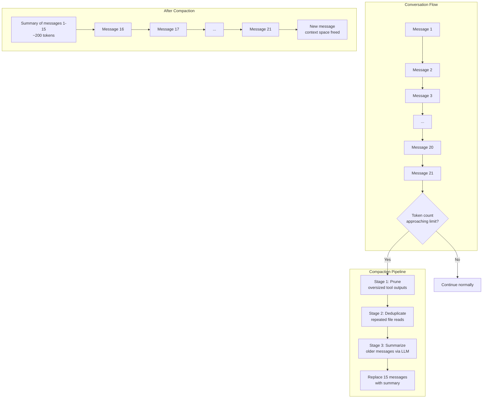
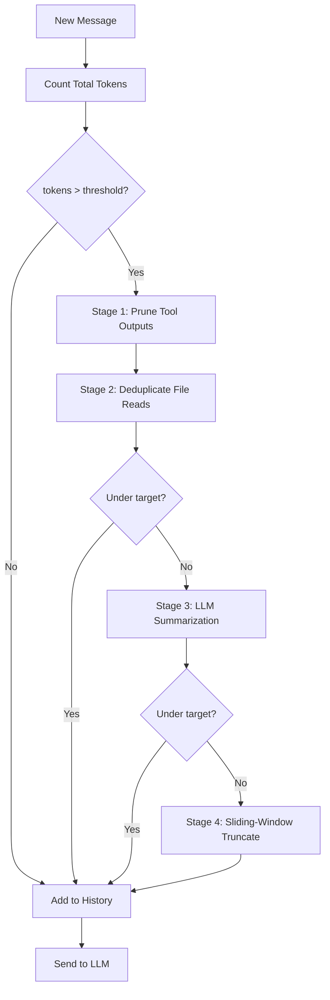

We designed context compaction to solve a fundamental constraint in long-running AI conversations: every LLM has a finite context window, and naive truncation destroys critical information. The trade-off space is well-defined -- you can sacrifice older message fidelity for continued conversation coherence, but only if you preserve the right information.

Every LLM has a finite context window -- ranging from roughly 8,000 tokens for older models to 1,000,000+ tokens for the latest ones. Long conversations, especially those involving tool calls (which consume significant tokens for function definitions, arguments, and results), fill context windows fast. A single tool-heavy exchange can use 2,000-5,000 tokens. Truncation drops messages indiscriminately: account numbers, approval decisions, error codes -- all gone. Context compaction takes a different approach: a multi-stage pipeline prunes oversized tool output and deduplicates repeated file reads before it ever calls an LLM, then uses an LLM only as a later stage to summarize the messages that are still over budget into a structured summary -- one section of which (constraints and established rules) is explicitly guaranteed to carry forward until the user revokes it. The result is a compressed conversation history that retains what matters while freeing token budget for new exchanges.

## How Context Compaction Works

The compaction pipeline monitors the conversation's token count and triggers automatically when it approaches the configured threshold:


```mermaid
flowchart TB
    subgraph Conversation["Conversation Flow"]
        M1["Message 1"] --> M2["Message 2"]
        M2 --> M3["Message 3"]
        M3 --> DOTS1["..."]
        DOTS1 --> M20["Message 20"]
        M20 --> M21["Message 21"]
        M21 --> CHECK{"Token count<br/>approaching limit?"}
    end

    subgraph Compaction["Compaction Pipeline"]
        CHECK -->|"Yes"| PRUNE["Stage 1: Prune<br/>oversized tool outputs"]
        PRUNE --> DEDUP["Stage 2: Deduplicate<br/>repeated file reads"]
        DEDUP --> SUMMARIZE["Stage 3: Summarize<br/>older messages via LLM"]
        SUMMARIZE --> COMPACT["Replace 15 messages<br/>with summary"]
    end

    subgraph Result["After Compaction"]
        SUM["Summary of messages 1-15<br/>~200 tokens"]
        SUM --> M16R["Message 16"]
        M16R --> M17R["Message 17"]
        M17R --> DOTS2["..."]
        DOTS2 --> M21R["Message 21"]
        M21R --> NEW["New message<br/>context space freed"]
    end

    CHECK -->|"No"| CONTINUE["Continue normally"]
```

The process is transparent to the user. They never see the compaction happening. The AI continues responding with full awareness of the conversation's history, referencing details from early messages that have been compressed into the summary.


## Enabling Context Compaction

Compaction is configured through the `conversationMemory` option in the NeuroLink constructor. You control when compaction triggers, how aggressively it compresses, and how many recent messages stay untouched:

```typescript
import { NeuroLink } from '@juspay/neurolink';

const neurolink = new NeuroLink({
  conversationMemory: {
    enabled: true,
    enableSummarization: true,      // Turn on the LLM summarization stage
    tokenThreshold: 6000,            // Trigger summarization when history exceeds this
    summarizationProvider: 'openai',
    summarizationModel: 'gpt-5.4-mini', // Use a cheaper model for summarization
    contextCompaction: {
      enabled: true,
      threshold: 0.8,                // Fraction of the model's context window (default: 0.8)
      enablePruning: true,           // Drop oversized tool outputs first
      enableDeduplication: true,     // Collapse repeated file reads
      enableSlidingWindow: true,     // Fallback: drop oldest messages if still over budget
    },
  },
});

// Use normally -- compaction happens automatically
const result = await neurolink.generate({
  input: { text: 'What was the account number I mentioned earlier?' },
  context: { sessionId: 'support-session-123' },
  provider: 'openai',
  model: 'gpt-5.4',
});

// The AI can still recall information from compacted messages, because the
// summarization stage writes a structured summary whose "constraints and
// established rules" section is explicitly guaranteed to carry forward
```

The configuration parameters control the compaction behavior:

- **`tokenThreshold`**: The absolute token count that triggers summarization for a session. Left unset, it defaults to 80% of the active model's context window.
- **`summarizationProvider` / `summarizationModel`**: Which provider and model run the summarization call. Use a cheaper model here -- summarization is a simpler task than the main conversation.
- **`contextCompaction.threshold`**: A 0.0-1.0 fraction of the context window at which the compaction pipeline runs (default `0.8`).
- **`contextCompaction.enablePruning` / `enableDeduplication` / `enableSlidingWindow`**: Toggle the pipeline's tool-output pruning, file-read deduplication, and sliding-window fallback stages independently of LLM summarization.

> **Note:** The default `contextCompaction.threshold` of 0.8 already leaves headroom for the system prompt, new user message, and AI response. Lower it only if your prompts or tool outputs are unusually large.
{: .prompt-info }

## The Compaction Pipeline

Rather than a single strategy, compaction is a pipeline of independently-toggleable stages that run in order -- cheapest first -- until the conversation fits back under budget:

1. **Prune tool outputs** -- drop or shrink oversized tool-call results. No LLM call needed.
2. **Deduplicate file reads** -- collapse repeated reads of the same file into a single copy.
3. **Summarize** -- an LLM condenses the remaining older messages into a structured summary (see below).
4. **Truncate** -- a sliding-window fallback drops the oldest messages if the earlier stages still didn't reach the target.

For conversations where exact wording matters more than compressing token count -- code reviews, debugging sessions -- you can disable summarization and rely on pruning and deduplication alone; older messages then stay verbatim until the sliding-window fallback has to drop them:

```typescript
conversationMemory: {
  enabled: true,
  enableSummarization: false, // keep exact wording; skip the LLM summarization stage
  contextCompaction: {
    enabled: true,
    enablePruning: true,
    enableDeduplication: true,
    enableSlidingWindow: true,
  },
}
```

Summarization is best left on for general conversations, customer support sessions, and project discussions where the narrative arc matters more than exact wording; the summarization model can be cheaper than the main conversation model since summarizing is a simpler task than the original conversation.

## What Gets Preserved During Compaction

The most critical aspect of compaction is what survives. The summarization stage doesn't write free-form prose -- it fills a structured 10-section summary (primary request and intent, key technical concepts, files and code touched, problem solving, pending tasks, task evolution, current work, next step, required files, and constraints/established rules). Section 10, constraints and established rules, is explicitly guaranteed: the summarizer is told that user-imposed constraints and established agreements are never "no longer relevant" and must carry forward into every incremental re-summary until the user revokes them. The other nine sections are best-effort -- specific details like an account number or a decision survive only if the conversation actually populated that section:


```mermaid
flowchart LR
    subgraph Before["Before Compaction: 20 messages, 8000 tokens"]
        B1["Greeting"]
        B2["Account: ACC-12345"]
        B3["General chitchat"]
        B4["Problem described"]
        B5["Troubleshooting steps"]
        B6["Decision: refund approved"]
        B7["Follow-up questions"]
    end

    subgraph After["After Compaction: structured summary + 5 recent, 3500 tokens"]
        A1["SUMMARY section 4, Problem Solving:<br/>Customer ACC-12345 billing issue,<br/>refund approved"]
        A2["Recent message 16"]
        A3["Recent message 17"]
        A4["Recent message 18"]
        A5["Recent message 19"]
        A6["Recent message 20"]
    end

    Before -->|"Compaction"| After
```

The 10 sections, in order: primary request and intent, key technical concepts, files and code sections, problem solving, pending tasks, task evolution, current work, next step, required files, and constraints/established rules. An identifier like an account number, or a decision like a refund approval, survives only if the conversation's content lands in one of the first nine sections during summarization; the tenth section is the one carried forward unconditionally.

## Manual Compaction Control

While automatic compaction handles most scenarios, you sometimes need manual control -- checking how much context is being used, or triggering compaction early before a known-large prompt:

```typescript
// Check current context usage for a session
const usage = await neurolink.getContextStats('session-123', 'openai', 'gpt-5.4');
console.log('Estimated tokens:', usage?.estimatedInputTokens, '/', usage?.availableInputTokens);
console.log('Should compact:', usage?.shouldCompact);

// Manually trigger the compaction pipeline
const result = await neurolink.compactSession('session-123', {
  keepRecentRatio: 0.3, // keep the most recent 30% of the target budget verbatim
});

if (result?.compacted) {
  console.log('Stages used:', result.stagesUsed); // e.g. ['prune', 'summarize']
  console.log('Tokens before/after:', result.tokensBefore, '->', result.tokensAfter);
  console.log('Tokens saved:', result.tokensSaved);
}
```

Manual compaction is useful in several scenarios:

- **Before large prompts**: If you know the next prompt will be large (e.g., pasting a document for analysis), compact first to make room.
- **Session handoffs**: When transferring a conversation from one agent to another, compact to create a clean summary of the history.
- **Performance monitoring**: Track compaction frequency to identify sessions that grow too fast (which may indicate prompt or workflow issues).

## Compaction with Different Providers

Different models have vastly different context windows. Your compaction thresholds should match the model you are using:

```typescript
// For models with smaller context windows (4K-8K)
const smallContextConfig = {
  conversationMemory: {
    enabled: true,
    tokenThreshold: 3000, // trigger summarization earlier
    contextCompaction: { enabled: true, threshold: 0.75 },
  },
};

// For models with large context windows (128K-200K)
const largeContextConfig = {
  conversationMemory: {
    enabled: true,
    tokenThreshold: 100000,
    contextCompaction: { enabled: true, threshold: 0.8 }, // default
  },
};

// Per-request override
const result = await neurolink.generate({
  input: { text: userMessage },
  context: { sessionId: 'session-123' },
  compactionThreshold: 0.6, // compact earlier than the 0.8 default for this request
  provider: 'anthropic',
  model: 'claude-sonnet-5',
});
```

The per-request `compactionThreshold` override is particularly useful when you switch models mid-conversation. If a session starts on a 128K model and is later routed to a smaller model (perhaps due to cost optimization or provider failover), you can lower the compaction threshold for that specific request -- it must be at or below the instance-level default, never above.

## Compaction Decision Flow

The complete decision flow for each new message:


```mermaid
flowchart TD
    MSG["New Message"] --> COUNT["Count Total Tokens"]
    COUNT --> CHECK{"tokens > threshold?"}
    CHECK -->|"No"| ADD["Add to History"]
    CHECK -->|"Yes"| PRUNE["Stage 1: Prune Tool Outputs"]
    PRUNE --> DEDUP["Stage 2: Deduplicate File Reads"]
    DEDUP --> FIT1{"Under target?"}
    FIT1 -->|"Yes"| ADD
    FIT1 -->|"No"| SUM["Stage 3: LLM Summarization"]
    SUM --> FIT2{"Under target?"}
    FIT2 -->|"Yes"| ADD
    FIT2 -->|"No"| TRUNC["Stage 4: Sliding-Window Truncate"]
    TRUNC --> ADD
    ADD --> GENERATE["Send to LLM"]
```

## Compaction vs. Other Context Management Strategies

Compaction is one of several strategies for managing long conversations. Here is how it compares:

| Strategy | How It Works | Pros | Cons |
|----------|-------------|------|------|
| **Truncation** | Drop oldest messages | Simple, fast | Loses critical context |
| **Sliding Window** | Keep last N messages | Predictable | No summarization |
| **Compaction** | Summarize + preserve key info | Retains important details | Costs extra LLM call |
| **RAG-based** | Store all messages, retrieve relevant | Full history available | Higher latency |
| **Hierarchical** | Multi-level summaries | Handles very long conversations | Complex |

Compaction occupies the sweet spot between simplicity and effectiveness. Truncation and sliding windows are simpler but lose information. RAG-based and hierarchical approaches are more powerful but add significant latency and complexity.

For most production applications, compaction is the right default. Add RAG-based retrieval if conversations span days or weeks and users frequently reference specific earlier exchanges.

## Testing Compaction

Verifying that compaction preserves critical information is essential. Write tests that simulate long conversations with specific data points and then verify those data points survive compaction:

```typescript
import { describe, it, expect } from 'vitest';
import { NeuroLink } from '@juspay/neurolink';

describe('Context Compaction', () => {
  it('preserves critical information after compaction', async () => {
    const neurolink = new NeuroLink({
      conversationMemory: {
        enabled: true,
        enableSummarization: true,
        tokenThreshold: 500, // Low threshold for testing
        contextCompaction: { enabled: true, threshold: 0.5 },
      },
    });

    const sessionId = 'test-compaction';

    // Build up conversation with critical information
    await neurolink.generate({
      input: { text: 'My account number is ACC-12345' },
      context: { sessionId },
      provider: 'openai',
    });

    // Add many messages to trigger compaction
    for (let i = 0; i < 20; i++) {
      await neurolink.generate({
        input: { text: `Follow-up message ${i}` },
        context: { sessionId },
        provider: 'openai',
      });
    }

    // Critical info should still be available
    const result = await neurolink.generate({
      input: { text: 'What is my account number?' },
      context: { sessionId },
      provider: 'openai',
    });

    expect(result.content).toContain('ACC-12345');
  });
});
```

The test uses a low `tokenThreshold` (500) to force compaction during the test without requiring 20+ real messages. In production, your threshold will be much higher.

Key test scenarios to cover:

- Account numbers and identifiers survive compaction
- Decision records (approvals, rejections) survive compaction
- Error codes and technical details survive compaction
- Multi-compaction sessions (compaction triggers multiple times) still preserve early data
- The constraints/established-rules section of the summary survives incremental re-summarization

## Production Patterns

### Long-Running Support Sessions

For 24/7 support bots where conversations can span hours:

```typescript
const supportBot = new NeuroLink({
  conversationMemory: {
    enabled: true,
    enableSummarization: true,
    tokenThreshold: 6000,
    summarizationProvider: 'openai',
    summarizationModel: 'gpt-5.4-mini',
    contextCompaction: { enabled: true, threshold: 0.8 },
  },
});
```

Combine with cross-session memory for returning customers. The compaction summary becomes a natural "session brief" that can be stored and retrieved when the customer contacts you again.

### Multi-Day Project Conversations

For project assistants where conversations span days or weeks, use hierarchical summarization:

- **Per-conversation compaction**: Summarize within each conversation session
- **Daily summaries**: At end of day, generate a summary of all sessions
- **Weekly digests**: Summarize the daily summaries into a weekly overview

This creates a pyramid of detail: the current conversation has full recent context, today's earlier conversations are summarized, and last week's conversations are summarized at a higher level.

### Performance Monitoring

Track compaction metrics to identify issues:

- **Compaction frequency**: Sessions that compact more than 3 times in an hour may indicate overly verbose prompts or unnecessary back-and-forth
- **Token savings**: Monitor the ratio of tokens before vs after compaction. Healthy compaction achieves 50-70% reduction
- **Information loss incidents**: If users report the AI "forgetting" things after compaction, check which stages ran (`result.stagesUsed`) and whether `keepRecentRatio` or the compaction threshold need tuning

> **Note:** Archive compaction summaries for compliance-regulated industries. The summary provides an auditable record of what was discussed even after the original messages are compacted.
{: .prompt-info }

## Conclusion

Context compaction sits at the intersection of information theory and practical systems engineering. The pipeline makes a deliberate trade-off between stages: the cheap, lossless stages (pruning, deduplication) run first, and the LLM summarization stage -- which sacrifices exact wording for narrative coherence -- only runs if those weren't enough. You can also disable summarization entirely and rely on pruning, deduplication, and sliding-window truncation alone when exact wording matters more than compression, at the cost of losing more low-value context sooner.

The key design decisions worth highlighting: the pipeline's default 80% threshold (`contextCompaction.threshold`) leaves headroom for system prompts and response generation. Using a cheaper model for summarization (`summarizationModel`) avoids the cost trap of spending more on compression than you save on context reduction. And the structured 10-section summary format, with its hard guarantee that constraints and established rules always carry forward, targets the specific failure mode where a conversation's ground rules quietly disappear after compaction.

The combination of automatic compaction, manual control, and per-request overrides gives operators the flexibility to handle any conversation pattern, from quick support exchanges to multi-day technical debugging sessions.

---

**Related posts:**

- [Conversation Memory: Building Stateful AI Applications](/posts/conversation-memory-guide/)
- [Real-Time AI: Streaming Response Patterns with NeuroLink](/posts/streaming-best-practices/)
- [LLM Cost Optimization: Practical Strategies to Reduce Your AI Spend](/posts/cost-optimization-strategies/)
