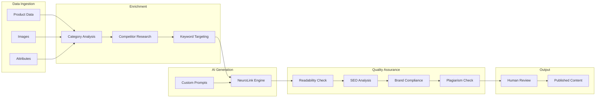

> **Note**: This is an illustrative implementation guide, not a case study of a real deployment.
{: .prompt-info }

# E-commerce Product Recommendations at Scale with NeuroLink

> **Note**: This guide presents implementation patterns and architectural approaches for AI-powered product description generation. The examples demonstrate what is technically achievable with NeuroLink. Actual results will vary based on your specific implementation, data quality, and business context.
{: .prompt-info }

## Overview

E-commerce platforms often face significant challenges with product content at scale. As catalogs grow to thousands or millions of SKUs, maintaining consistent, high-quality product descriptions becomes increasingly difficult. This guide explores technical patterns for implementing AI-powered product description generation using NeuroLink.

The implementation patterns described here can help address common challenges such as:

- **Volume constraints**: Manual content creation that cannot keep pace with catalog growth
- **Quality inconsistencies**: Varying styles and quality across different writers or sources
- **Time-to-market delays**: Slow content pipelines that delay product launches
- **Multilingual requirements**: Need for descriptions in multiple languages

## Architecture Overview



## Implementation Patterns

### Basic Batch Processing

The following example demonstrates a batch processing pipeline for generating product descriptions using NeuroLink.

```typescript
import { NeuroLink } from '@juspay/neurolink';

const neurolink = new NeuroLink();

interface Product {
  id: string;
  name: string;
  category: string;
  attributes: Record<string, string>;
  targetKeywords: string[];
}

interface GeneratedDescription {
  productId: string;
  description: string;
  seoScore: number;
  readabilityScore: number;
}

async function generateProductDescriptions(
  products: Product[]
): Promise<GeneratedDescription[]> {
  const batchPromises = products.map(async (product) => {
    const response = await neurolink.generate({
      provider: 'anthropic',
      model: 'claude-sonnet-4-5-20250929',
      input: {
        text: `You are an expert e-commerce copywriter. Generate SEO-optimized product descriptions that are engaging, benefit-focused, and between 175-225 words. Include emotional appeals and sensory language.

Generate a product description for:
Product: ${product.name}
Category: ${product.category}
Attributes: ${JSON.stringify(product.attributes)}
Target Keywords: ${product.targetKeywords.join(', ')}`,
      },
      temperature: 0.7,
      maxTokens: 500
    });

    // Note: calculateSEOScore and calculateReadabilityScore are user-implemented
    // helper functions for scoring content quality
    return {
      productId: product.id,
      description: response.content,
      seoScore: calculateSEOScore(response.content, product.targetKeywords),
      readabilityScore: calculateReadabilityScore(response.content)
    };
  });

  return Promise.all(batchPromises);
}

// Process products in batches to manage rate limits and memory
async function processBatch(products: Product[], batchSize = 50) {
  const results: GeneratedDescription[] = [];

  for (let i = 0; i < products.length; i += batchSize) {
    const batch = products.slice(i, i + batchSize);
    const batchResults = await generateProductDescriptions(batch);
    results.push(...batchResults);

    console.log(`Processed ${Math.min(i + batchSize, products.length)}/${products.length} products`);
  }

  return results;
}
```

### Key Implementation Considerations

**Data Ingestion Layer**: Build connectors to your product information management (PIM) system, allowing automatic extraction of product attributes, specifications, images, and category hierarchies. This raw data serves as the foundation for each generated description.

**Enrichment Module**: Before generation, each product can pass through an enrichment phase where the system analyzes the product category, competitive landscape, and target customer demographics to determine optimal tone, length, and keyword focus.

**Generation Engine**: The core generation happens through NeuroLink's API, which can route requests to the most appropriate model for your use case. Custom system prompts help maintain brand voice and content guidelines.

**Quality Assurance Layer**: Implement automated quality checks before human review. These checks can include readability scoring, keyword density analysis, brand guideline compliance, and factual accuracy verification.

**Human Review Interface**: Rather than replacing human oversight entirely, build a streamlined review interface where content teams can approve, edit, or flag descriptions. The interface can highlight confidence scores and potential issues.

## Quality Control Implementation

Automated quality gates help ensure descriptions meet standards before reaching human reviewers.

```typescript
import { NeuroLink } from '@juspay/neurolink';
import { z } from 'zod';

const neurolink = new NeuroLink();

const complianceSchema = z.object({
  compliant: z.boolean(),
  issues: z.array(z.string())
});

const factCheckSchema = z.object({
  accurate: z.boolean(),
  discrepancies: z.array(z.string())
});

interface QualityCheckResult {
  passed: boolean;
  readabilityScore: number;
  keywordDensity: number;
  brandCompliance: boolean;
  factualAccuracy: boolean;
  uniquenessScore: number;
  issues: string[];
}

async function runQualityChecks(
  description: string,
  productData: Product,
  brandGuidelines: string[]
): Promise<QualityCheckResult> {
  const issues: string[] = [];

  // AI-powered brand voice compliance check
  const complianceCheck = await neurolink.generate({
    provider: 'anthropic',
    model: 'claude-sonnet-4-5-20250929',
    input: {
      text: `You are a brand compliance checker. Analyze if the content follows these brand guidelines: ${brandGuidelines.join('; ')}. Return JSON with {compliant: boolean, issues: string[]}.

Content to analyze:
${description}`,
    },
    schema: complianceSchema
  });

  const compliance = complianceCheck.content;

  // Factual accuracy verification against source data
  const factCheck = await neurolink.generate({
    provider: 'anthropic',
    model: 'claude-sonnet-4-5-20250929',
    input: {
      text: `Verify that the product description accurately reflects the source product data. Return JSON with {accurate: boolean, discrepancies: string[]}.

Description: ${description}

Source Data: ${JSON.stringify(productData)}`,
    },
    schema: factCheckSchema
  });

  const facts = factCheck.content;

  // Note: calculateReadabilityScore, calculateKeywordDensity, and checkUniqueness
  // are user-implemented helper functions for quality scoring
  return {
    passed: compliance.compliant && facts.accurate && calculateReadabilityScore(description) >= 60,
    readabilityScore: calculateReadabilityScore(description),
    keywordDensity: calculateKeywordDensity(description, productData.targetKeywords),
    brandCompliance: compliance.compliant,
    factualAccuracy: facts.accurate,
    uniquenessScore: await checkUniqueness(description),
    issues: [...compliance.issues, ...facts.discrepancies]
  };
}
```

### Quality Check Components

**Readability Analysis**: Score descriptions using Flesch-Kincaid and other readability metrics, ensuring content matches the target audience's comprehension level. Descriptions outside acceptable ranges can be flagged for revision.

**Keyword Optimization**: Verify that target keywords appear with appropriate frequency and placement. Check for keyword cannibalization across similar products and suggest differentiation strategies.

**Brand Voice Compliance**: Use AI-powered analysis to verify that generated content adheres to brand guidelines, including checks for prohibited phrases, required terminology, and appropriate tone markers.

**Factual Verification**: Cross-reference generated content against source product data to ensure specifications, dimensions, and features are accurately represented.

**Plagiarism Detection**: Check descriptions against databases of previously generated content and external sources to ensure uniqueness and avoid duplicate content issues.

## Multilingual Generation

NeuroLink's provider-agnostic approach enables multilingual generation without managing multiple translation services.

```typescript
import { NeuroLink } from '@juspay/neurolink';
import { z } from 'zod';

const neurolink = new NeuroLink();

const localizationSchema = z.object({
  description: z.string(),
  localizedKeywords: z.array(z.string())
});

type SupportedLanguage = 'en' | 'es' | 'fr' | 'de' | 'it' | 'pt' | 'ja' | 'zh';

interface LocalizedDescription {
  language: SupportedLanguage;
  description: string;
  localizedKeywords: string[];
}

async function generateMultilingualDescriptions(
  product: Product,
  targetLanguages: SupportedLanguage[]
): Promise<LocalizedDescription[]> {
  const localizations = await Promise.all(
    targetLanguages.map(async (language) => {
      const response = await neurolink.generate({
        provider: 'anthropic',
        model: 'claude-sonnet-4-5-20250929',
        input: {
          text: `You are a native ${language} e-commerce copywriter. Generate culturally appropriate, SEO-optimized product descriptions. Adapt idioms and cultural references for the local market. Return JSON with {description: string, localizedKeywords: string[]}.

Create a localized product description in ${language} for:
Product: ${product.name}
Category: ${product.category}
Original Keywords: ${product.targetKeywords.join(', ')}

Ensure the description feels native, not translated.`,
        },
        schema: localizationSchema
      });

      const result = response.content;
      return {
        language,
        description: result.description,
        localizedKeywords: result.localizedKeywords
      };
    })
  );

  return localizations;
}
```

## A/B Testing Framework

One advantage of AI-generated content is the ability to systematically test variations at scale.

### Testing Approaches

**Macro-level testing**: Test different overall content strategies, such as benefit-focused versus feature-focused descriptions, or short-form versus long-form content.

**Micro-level testing**: Test specific elements like opening hooks, call-to-action phrases, and keyword placement.

### Areas to Explore

Consider testing variations across these dimensions:

- **Emotional vs. rational appeals**: Different product categories may respond better to emotional benefits versus technical specifications
- **Description length**: Finding the optimal word count range for your audience and category
- **Social proof integration**: Testing whether mentions of popularity or customer favorites impact engagement
- **Urgency and scarcity language**: Understanding when and where urgency elements are appropriate

### Continuous Optimization

Implement a feedback loop where:
1. Generate multiple description variants
2. Measure performance metrics (click-through, time on page, conversions)
3. Incorporate learnings into prompt engineering
4. Iterate and refine over time

## Best Practices

### Data Quality First

The success of AI-generated content depends on input data quality. Invest in cleaning and standardizing product attribute data before implementation. Products with incomplete or inconsistent attributes will produce lower-quality descriptions.

### Invest in Prompt Engineering

Generic prompts produce generic content. Invest time in developing category-specific prompts that capture your brand voice and content requirements. Consider creating distinct generation profiles for different product categories.

### Embrace Human-AI Collaboration

The most effective model is typically human-AI collaboration rather than full automation. Content teams can transition from writing to editing and strategy, maintaining quality oversight while handling higher volumes.

### Monitor and Iterate

AI systems require ongoing attention and refinement. Track quality metrics, performance data, and edge cases to enable continuous improvement. Regularly review and update prompts based on reviewer feedback.

### Start with a Pilot

Begin with a limited subset of products in a single category. This allows you to refine the pipeline, establish quality benchmarks, and build confidence before scaling.

## Potential Benefits

When implemented thoughtfully, AI-powered product description generation can help address:

- **Scale limitations**: Generate descriptions faster than manual processes
- **Consistency challenges**: Maintain uniform brand voice across all products
- **Time-to-market pressure**: Reduce delays in getting new products live
- **Multilingual expansion**: Support multiple languages without separate translation workflows
- **Testing velocity**: Enable rapid A/B testing of content variations

> **Important**: Actual results depend heavily on implementation quality, data quality, existing content standards, and continuous optimization. These patterns provide a starting point, but success requires investment in customization and ongoing refinement.
{: .prompt-warning }

## Conclusion

AI-powered product description generation offers a path to addressing content scale challenges in e-commerce. The key success factors include thorough planning, investment in prompt engineering, robust quality infrastructure, and continuous optimization.

The technology exists today to generate high-quality product descriptions at significant scale. The question is how to implement it in a way that maintains brand integrity, supports business goals, and positions your organization for continued growth.

These implementation patterns provide a foundation for exploring how NeuroLink's capabilities might apply to your content challenges. Start with a small pilot, measure results carefully, and scale what works.

---

*To learn more about implementing these patterns with NeuroLink, explore our [documentation](/docs) or [contact our team](mailto:enterprise@neurolink.ink).*
