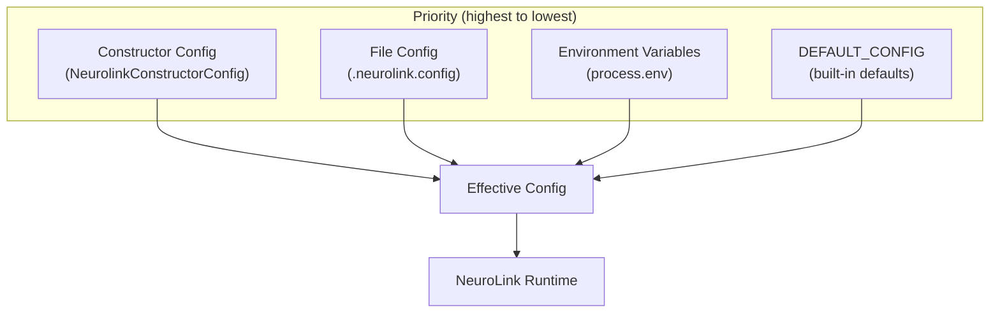
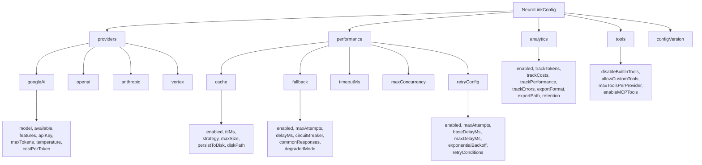
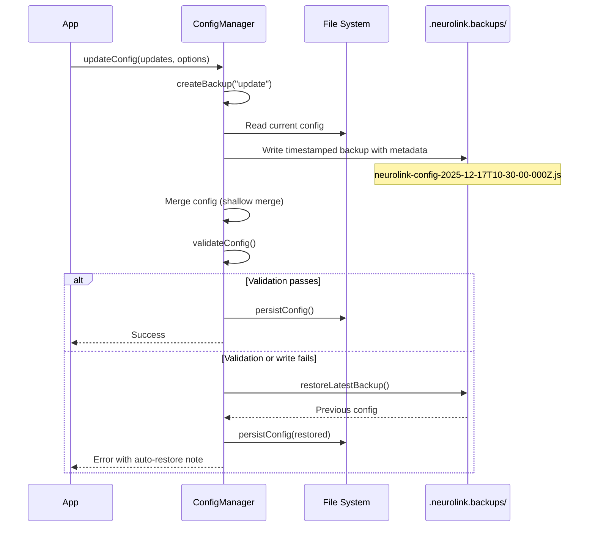

In this guide, you will master NeuroLink's two-layer configuration system. You will set up provider configurations, tune performance settings, configure caching and fallback strategies, manage backups and restores, and validate configuration changes before they reach production. By the end, you will have a fully configured NeuroLink deployment with safe defaults, automatic backup, and environment-specific overrides.

## The Two Configuration Layers

Understanding the distinction between the two configuration layers is fundamental. They serve different purposes and have different lifecycles:



**Precedence order:** Constructor config > File config > Environment variables > Defaults

- **Layer 1: Persistent file-based config** (`NeuroLinkConfig`) -- stored in `.neurolink.config` as a JavaScript module. Covers providers, performance settings, analytics, and tools. Persists across restarts.
- **Layer 2: Runtime constructor config** (`NeurolinkConstructorConfig`) -- passed when you create a new `NeuroLink` instance. Covers conversation memory, orchestration, HITL, tool registry, and observability. Lives in your application code.
- **Layer 3: Environment variables** -- secrets (API keys) and deployment-specific overrides. Never committed to version control.
- **Layer 4: Built-in defaults** -- safe, sensible defaults that apply when nothing else is specified.

```typescript
// Layer 1: Persistent file-based configuration
export type NeuroLinkConfig = {
  providers?: Record<string, ProviderConfig>;
  performance?: PerformanceConfig;
  analytics?: AnalyticsConfig;
  tools?: ToolConfig;
  lastUpdated?: number;
  configVersion?: string;
  [key: string]: unknown; // Extensibility
};

// Layer 2: Runtime constructor configuration
export type NeurolinkConstructorConfig = {
  conversationMemory?: Partial<ConversationMemoryConfig>;
  enableOrchestration?: boolean;
  hitl?: HITLConfig;
  toolRegistry?: MCPToolRegistry;
  observability?: ObservabilityConfig;
};
```

The separation is intentional. Provider configuration changes infrequently (when you add a new provider or update pricing) and should persist across deployments. Runtime behavior like conversation memory and HITL policies are application-specific and belong in your code.

> **Note:** The constructor config (Layer 2) has the highest precedence. If you set a value both in the config file and the constructor, the constructor wins. This lets you override file-based defaults for specific application instances.
{: .prompt-info }

## Configuration Schema Deep-Dive

The full configuration schema is extensive. Here is the complete structure:



### Provider Configuration

Each provider entry is a `ProviderConfig` object with these fields:

```typescript
export type ProviderConfig = {
  model?: string;
  available?: boolean;
  lastCheck?: number;
  reason?: string;
  apiKey?: string;
  endpoint?: string;
  maxTokens?: number;
  temperature?: number;
  timeout?: number;
  costPerToken?: number;
  features?: string[]; // ['streaming', 'functionCalling', 'vision']
  [key: string]: unknown; // Provider-specific extensions
};
```

The `available` flag and `reason` field work together for provider health tracking. When a provider starts failing, the system sets `available: false` with a reason like "Rate limit exceeded" and records a `lastCheck` timestamp. The circuit breaker in the fallback config uses this data to avoid hitting known-down providers.

The extensible `[key: string]: unknown` allows provider-specific settings (like Azure deployment names or Bedrock region overrides) without modifying the type system.

### Cache Configuration

Three caching strategies are available:

- **`memory`**: In-process cache. Fast but lost on restart. Best for development and single-instance deployments.
- **`writeThrough`**: Writes to both memory and disk. Fast reads with persistence. Best for single-server production.
- **`cacheAside`**: Application manages cache population. Most flexible. Best for distributed deployments with shared cache.

The `persistToDisk` option (with configurable `diskPath`) enables cache survival across process restarts, useful for expensive LLM responses that you want to reuse.

### Fallback Configuration

The fallback config includes a circuit breaker pattern and graceful degradation:

- **`circuitBreaker`**: When enabled, the system stops sending requests to a provider that has failed consecutively. This prevents cascading failures where one provider's slowdown causes timeouts across your entire system.
- **`commonResponses`**: Pre-configured fallback responses for when all providers are down. Your application returns a helpful message instead of an error.
- **`degradedMode`**: When enabled, the system accepts partial functionality (e.g., text generation without tool calling) rather than failing completely.

### Retry Configuration

Retry settings control transient failure handling:

- **`exponentialBackoff`**: When true, delays increase exponentially between retries (1s, 2s, 4s, 8s...). Prevents thundering herd effects when a provider recovers.
- **`retryConditions`**: Array of specific error types that should trigger retries. Rate limit errors and network timeouts are retriable; authentication errors are not.

## Default Configuration

When no config file exists, NeuroLink generates a safe default via `generateDefaultConfig()`:

```typescript
export const DEFAULT_CONFIG: NeuroLinkConfig = {
  providers: {
    googleAi: {
      model: "gemini-2.5-pro",
      available: true,
      features: ["streaming", "functionCalling"],
    },
  },
  performance: {
    cache: {
      enabled: true,
      ttlMs: 300000,       // 5 minutes
      strategy: "memory",
      maxSize: 1000,
    },
    fallback: {
      enabled: true,
      maxAttempts: 3,
      delayMs: 1000,
      circuitBreaker: true,
    },
    timeoutMs: 30000,       // 30 seconds
    maxConcurrency: 5,
  },
  analytics: {
    enabled: true,
    trackTokens: true,
    trackCosts: true,
    trackPerformance: true,
    retention: {
      days: 30,
      maxEntries: 10000,
    },
  },
  tools: {
    disableBuiltinTools: false,
    allowCustomTools: true,
    maxToolsPerProvider: 100,
    enableMCPTools: true,
  },
  configVersion: "3.0.1",
};
```

These defaults are designed to work out of the box: caching is enabled to reduce API costs, analytics are on to track usage, fallbacks are configured with circuit breaking, and all tool capabilities are available. The default provider is Google AI with `gemini-2.5-pro`.

> **Note:** The default configuration uses Google AI because it requires only a `GOOGLE_AI_API_KEY` environment variable. To use other providers, add their configuration and API keys.
{: .prompt-info }

## The ConfigManager: Loading and Updating

The `NeuroLinkConfigManager` class handles all config operations: loading, updating, validation, backup, and restore.

### Loading Config

```typescript
import { NeuroLinkConfigManager } from '@juspay/neurolink/config';

const configManager = new NeuroLinkConfigManager();

// Load current config (creates default if none exists)
const config = await configManager.loadConfig();
```

The `loadConfig()` method reads from `.neurolink.config` and caches the result in memory. Subsequent calls return the cached version without file I/O. The config file format is a JavaScript module: `export default { ... };`.

### Updating Config

```typescript
// Update with automatic backup
await configManager.updateConfig(
  {
    providers: {
      openai: {
        model: "gpt-4o",
        available: true,
        apiKey: process.env.OPENAI_API_KEY,
        features: ["streaming", "functionCalling"],
      },
    },
    performance: {
      timeoutMs: 60000,       // Increase timeout to 60s
      maxConcurrency: 10,
    },
  },
  {
    createBackup: true,       // Always backup before changing
    validate: true,           // Validate new config
    merge: true,              // Merge with existing (vs replace)
    reason: "add-openai",     // Reason for audit trail
  }
);
```

The `ConfigUpdateOptions` control the update behavior:

| Option | Default | Purpose |
|---|---|---|
| `createBackup` | `true` | Create a timestamped backup before updating |
| `validate` | `true` | Run validation on the new config |
| `merge` | `true` | Merge with existing config (vs full replace) |
| `reason` | -- | Audit trail string stored in backup metadata |
| `silent` | `false` | Suppress log output |

Merge semantics use shallow merge: `{ ...existing, ...updates, lastUpdated: Date.now() }`. Top-level keys from the update overwrite existing values. To update a nested value without losing siblings, provide the full object at that level.

### Provider Management

Dedicated methods simplify common provider operations:

```typescript
// Update a specific provider
await configManager.updateProviderStatus("anthropic", {
  model: "claude-sonnet-4-20250514",
  available: true,
  features: ["streaming", "functionCalling"],
  maxTokens: 8192,
  temperature: 0.7,
});

// Disable a failing provider
await configManager.updateProviderStatus("openai", {
  available: false,
  reason: "Rate limit exceeded",
});
// Automatically sets lastCheck timestamp and creates backup with reason "provider-openai-update"
```

## Backup and Restore System

The backup system is NeuroLink's safety net against configuration mistakes. Every update creates a timestamped backup, and any failed update automatically restores the previous config.



### Backup Operations

```typescript
// Create manual backup
const backupPath = await configManager.createBackup("before-migration");

// List all backups (sorted newest first)
const backups = await configManager.listBackups();
for (const backup of backups) {
  console.log(
    `${backup.filename} - ${backup.metadata.reason} - ` +
    `${new Date(backup.metadata.timestamp).toISOString()} - ` +
    `hash: ${backup.metadata.hash}`
  );
}

// Restore from specific backup
await configManager.restoreFromBackup(
  "neurolink-config-2025-12-17T10-30-00-000Z.js"
);

// Restore latest backup
await configManager.restoreLatestBackup();

// Clean up old backups (keep last 10)
await configManager.cleanupOldBackups(10);
```

Each backup includes `BackupMetadata` with rich context:

```typescript
export type BackupMetadata = {
  reason: string;
  timestamp: number;
  version: string;
  originalPath: string;
  hash?: string;        // SHA-256 first 8 chars for integrity
  size?: number;        // File size in bytes
  createdBy?: string;   // Who/what created the backup
};

export type BackupInfo = {
  filename: string;
  path: string;
  metadata: BackupMetadata;
  config: NeuroLinkConfig;
};
```

The config hash enables integrity verification: `createHash("sha256").update(configString).digest("hex").substring(0, 8)`. This lets you verify that a backup has not been tampered with before restoring it.

A key safety feature: `restoreFromBackup()` creates a pre-restore backup before overwriting the current config. This provides a double safety net -- if the restoration itself causes issues, you can restore the pre-restore backup.

> **Note:** Run `cleanupOldBackups(10)` periodically to prevent unbounded backup growth. In CI/CD pipelines that update config frequently, this is essential.
{: .prompt-info }

## Configuration Validation

The config manager validates every update before persisting. Validation returns a structured result with errors, warnings, and suggestions:

```typescript
const config = await configManager.loadConfig();
const validation = await configManager.validateConfig(config);

if (!validation.valid) {
  console.error("Config errors:", validation.errors);
  // e.g., ["configVersion must be a string"]
}
if (validation.warnings.length > 0) {
  console.warn("Config warnings:", validation.warnings);
  // e.g., ["No default provider specified", "Cache TTL is very low (< 1 second)"]
}
if (validation.suggestions.length > 0) {
  console.info("Suggestions:", validation.suggestions);
  // e.g., ["Consider setting providers.defaultProvider to \"googleAi\""]
}
```

Validation rules include:

- Config must be a non-null object
- `configVersion` must be a string
- `providers` must be an object (when present)
- Cache TTL below 1 second triggers a warning
- Missing default provider triggers a suggestion

When validation fails during an `updateConfig()` call, the update is rejected and the backup is automatically restored. Your running config is never corrupted by a bad update.

## Constructor Configuration and Environment Variables

The runtime constructor config controls behavior that varies per application instance:

```typescript
import { NeuroLink } from '@juspay/neurolink';

const neurolink = new NeuroLink({
  conversationMemory: {
    enabled: true,
    maxSessions: 50,
    enableSummarization: true,
    summarizationProvider: "vertex",
    summarizationModel: "gemini-2.5-flash",
  },
  enableOrchestration: true,
  hitl: {
    enabled: true,
    dangerousActions: ["delete", "send-email"],
  },
  observability: {
    tracing: true,
    metricsExport: "prometheus",
  },
});
```

Environment variables handle secrets and deployment-specific settings:

| Variable | Purpose | Default |
|---|---|---|
| `GOOGLE_AI_API_KEY` | Google AI Studio API key | Required |
| `OPENAI_API_KEY` | OpenAI API key | -- |
| `ANTHROPIC_API_KEY` | Anthropic API key | -- |
| `NEUROLINK_MEMORY_ENABLED` | Enable conversation memory | `false` |
| `NEUROLINK_MEMORY_MAX_SESSIONS` | Max memory sessions | `50` |
| `NEUROLINK_SUMMARIZATION_ENABLED` | Enable context summarization | `true` |
| `NEUROLINK_TOKEN_THRESHOLD` | Token threshold for summarization | Auto-detect |
| `NEUROLINK_SUMMARIZATION_PROVIDER` | Provider for summarization | `vertex` |
| `NEUROLINK_SUMMARIZATION_MODEL` | Model for summarization | `gemini-2.5-flash` |

> **Note:** Never store API keys in the config file. Use environment variables for all secrets. The config file may be committed to version control; environment variables should not be.
{: .prompt-warning }

## Performance Tuning Reference

A quick reference for the most impactful performance settings:

| Setting | Default | Description | Tune For |
|---|---|---|---|
| `cache.enabled` | `true` | Enable response caching | Repeated queries |
| `cache.ttlMs` | `300000` (5min) | Cache time-to-live | Freshness vs speed |
| `cache.strategy` | `"memory"` | memory, writeThrough, cacheAside | Scale and persistence |
| `cache.maxSize` | `1000` | Max cache entries | Memory usage |
| `cache.persistToDisk` | `false` | Persist cache to disk | Server restarts |
| `fallback.enabled` | `true` | Enable provider fallback | Reliability |
| `fallback.maxAttempts` | `3` | Retry attempts | Availability |
| `fallback.circuitBreaker` | `true` | Stop retrying failing providers | Cascading failures |
| `fallback.degradedMode` | `false` | Allow degraded functionality | Partial availability |
| `timeoutMs` | `30000` | Request timeout | Latency requirements |
| `maxConcurrency` | `5` | Parallel requests | Throughput vs rate limits |
| `retryConfig.exponentialBackoff` | `false` | Exponential backoff | Transient errors |

**Tuning tips:**

- **High-throughput applications**: Increase `maxConcurrency` to 10-20, enable `cache.persistToDisk`, and set `retryConfig.exponentialBackoff: true`
- **Latency-sensitive applications**: Lower `timeoutMs` to 10000, set `cache.ttlMs` to 60000, and enable `degradedMode`
- **Cost-sensitive applications**: Increase `cache.ttlMs` to 3600000 (1 hour) and set `cache.maxSize` to 10000

## What's Next

You have configured NeuroLink's two-layer system with providers, performance tuning, caching, fallback, analytics, and backup management. Here is what to do next:

1. **Start with defaults** -- run `loadConfig()` and verify the default configuration works with your Google AI API key
2. **Add your providers** -- use `updateProviderStatus()` to configure OpenAI, Anthropic, or any other providers you need
3. **Tune performance** -- adjust `timeoutMs`, `maxConcurrency`, and cache settings based on your latency and cost requirements
4. **Enable circuit breakers** -- set `fallback.circuitBreaker: true` to automatically stop sending requests to failing providers
5. **Set up backup rotation** -- schedule `cleanupOldBackups(10)` to run periodically in your deployment pipeline

---

**Related posts:**

- [Getting Started with NeuroLink: Your First AI App in 5 Minutes](/posts/getting-started-first-ai-app/)
- [Rate Limiting and Quota Management for AI Applications](/posts/rate-limiting-strategies/)
- [The Middleware System: Analytics, Guardrails, and Custom Pipelines](/posts/middleware-system/)
