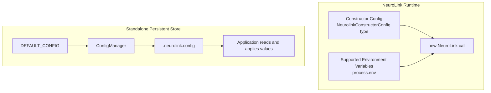
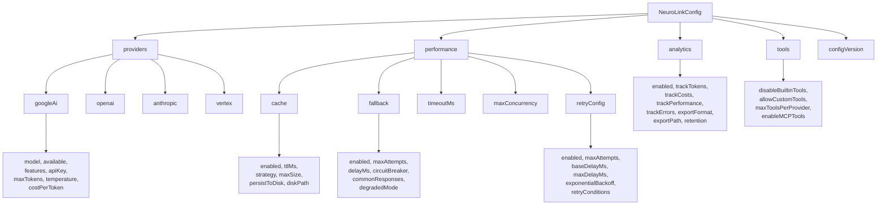
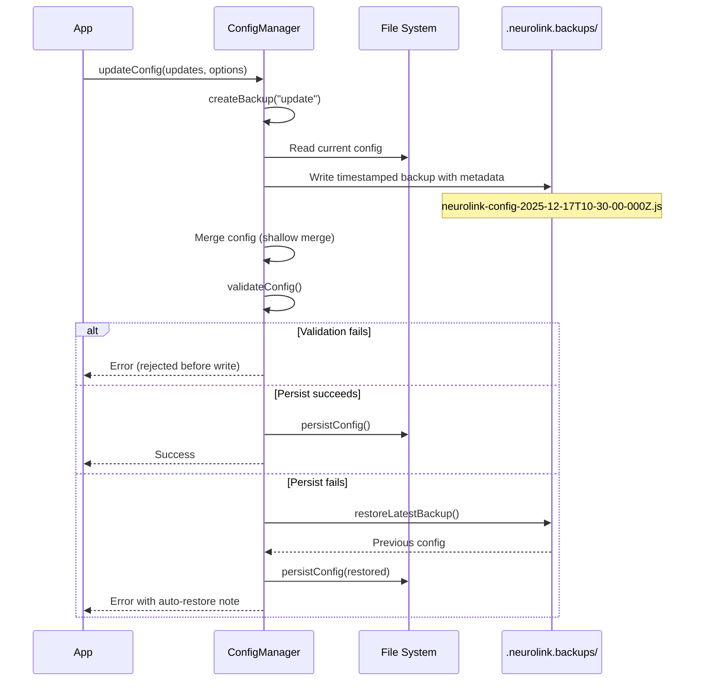

In this guide, you will learn NeuroLink's two distinct configuration surfaces. The `NeuroLink` constructor config controls the SDK runtime, while the exported `ConfigManager` utility reads and writes a standalone `.neurolink.config` file with validation and backups. You will use both APIs accurately, keep provider credentials in environment variables or the constructor's `credentials` field, and understand which behavior the SDK applies automatically versus which persistent settings your application must consume itself.

## The Two Configuration Surfaces

The two surfaces serve different purposes and have different lifecycles. They are not merged into one effective configuration, and there is no precedence hierarchy between them:


```mermaid
graph TD
    subgraph Runtime["NeuroLink Runtime"]
        A["Constructor Config<br/>NeurolinkConstructorConfig type"] --> N["new NeuroLink call"]
        E["Supported Environment Variables<br/>process.env"] --> N
    end

    subgraph Persistent["Standalone Persistent Store"]
        C["ConfigManager"] --> F[".neurolink.config"]
        D["DEFAULT_CONFIG"] --> C
        F --> APP["Application reads and applies values"]
    end
```

- **Runtime constructor config** (`NeurolinkConstructorConfig`) -- passed when you create a `NeuroLink` instance. Covers credentials, conversation memory, orchestration, HITL, tool policy, fallback, observability, and other SDK behavior. This is what directly configures the runtime.
- **Persistent file config** (`NeuroLinkConfig`) -- managed by `ConfigManager` and written to `.neurolink.config` as a JavaScript module. It can store provider metadata, performance policy, analytics, and tool settings across restarts, but the `NeuroLink` constructor does not load or merge it automatically. Your application must read the file and apply the values it needs.
- **Environment variables** -- provider API keys and supported feature-specific defaults, including conversation-memory defaults. Never commit secrets to version control.
- **`DEFAULT_CONFIG`** -- the default value returned by `ConfigManager` when the persistent file is absent or invalid. It is not the constructor's runtime default configuration.

```typescript
// Layer 1: Persistent file-based configuration
export type NeuroLinkConfig = {
  providers?: Record<string, ProviderRuntimeConfig>;
  performance?: PerformanceConfig;
  analytics?: AnalyticsConfig;
  tools?: ToolConfig;
  lastUpdated?: number;
  configVersion?: string;
  [key: string]: unknown; // Extensibility
};

// Layer 2: Runtime constructor configuration
export type NeurolinkConstructorConfig = {
  conversationMemory?: Partial<ConversationMemoryConfig>;
  enableOrchestration?: boolean;
  hitl?: HITLConfig;
  tools?: ToolConfig;
  toolRegistry?: MCPToolRegistry;
  observability?: ObservabilityConfig;
  credentials?: NeurolinkCredentials;
  providerFallback?: ProviderFallbackCallback;
  modelChain?: string[];
  // Additional runtime features omitted here for brevity
};
```

The separation is intentional. A deployment tool can use `ConfigManager` as a durable settings store, while runtime behavior such as credentials, conversation memory, HITL policy, and provider fallback belongs in constructor config. If you want persistent values to influence a `NeuroLink` instance, load them and map them into supported constructor or per-call fields in your own application.

> **Note:** `.neurolink.config` is a standalone store, not an automatic SDK configuration layer. Values under its `performance`, `analytics`, and `tools` sections are typed and persisted by `ConfigManager`, but the manager itself does not install a cache, circuit breaker, retry loop, analytics exporter, or tool policy into `NeuroLink`.
{: .prompt-info }

## Configuration Schema Deep-Dive

The full configuration schema is extensive. Here is the complete structure:


```mermaid
graph TD
    A[NeuroLinkConfig] --> B[providers]
    A --> C[performance]
    A --> D[analytics]
    A --> E[tools]
    A --> F[configVersion]

    B --> B1[googleAi]
    B --> B2[openai]
    B --> B3[anthropic]
    B --> B4[vertex]
    B1 --> B1a["model, available,<br/>features, apiKey,<br/>maxTokens, temperature,<br/>costPerToken"]

    C --> C1[cache]
    C --> C2[fallback]
    C --> C3[timeoutMs]
    C --> C4[maxConcurrency]
    C --> C5[retryConfig]

    C1 --> C1a["enabled, ttlMs,<br/>strategy, maxSize,<br/>persistToDisk, diskPath"]
    C2 --> C2a["enabled, maxAttempts,<br/>delayMs, circuitBreaker,<br/>commonResponses,<br/>degradedMode"]
    C5 --> C5a["enabled, maxAttempts,<br/>baseDelayMs, maxDelayMs,<br/>exponentialBackoff,<br/>retryConditions"]

    D --> D1["enabled, trackTokens,<br/>trackCosts, trackPerformance,<br/>trackErrors, exportFormat,<br/>exportPath, retention"]

    E --> E1["disableBuiltinTools,<br/>allowCustomTools,<br/>maxToolsPerProvider,<br/>enableMCPTools"]
```

### Provider Configuration

Each provider entry is a `ProviderRuntimeConfig` object with these fields:

```typescript
export type ProviderRuntimeConfig = {
  model?: string;
  available?: boolean;
  lastCheck?: number;
  reason?: string;
  apiKey?: string;
  endpoint?: string;
  maxTokens?: number;
  temperature?: number;
  timeout?: number;
  costPerToken?: number;
  features?: string[]; // ['streaming', 'functionCalling', 'vision']
  [key: string]: unknown; // Provider-specific extensions
};
```

The `available` flag and `reason` field work together for provider health tracking. When a provider starts failing, the system sets `available: false` with a reason like "Rate limit exceeded" and records a `lastCheck` timestamp. The circuit breaker in the fallback config uses this data to avoid hitting known-down providers.

The extensible `[key: string]: unknown` allows provider-specific settings (like Azure deployment names or Bedrock region overrides) without modifying the type system.

### Cache Configuration

The persistent schema can describe three application-level caching strategies:

- **`memory`**: Your application keeps entries in process memory.
- **`writeThrough`**: Your application writes entries to both its fast cache and persistent store.
- **`cacheAside`**: Your application loads and populates the cache on demand.

`persistToDisk` and `diskPath` are also available as policy fields. `ConfigManager` persists these values; it does not provide the cache implementation. Your application must read the policy and wire it to its own caching layer.

### Fallback Configuration

The persistent fallback object can record application policy for a circuit breaker and graceful degradation:

- **`circuitBreaker`**: Whether your application should stop sending requests to a repeatedly failing provider.
- **`commonResponses`**: Static responses your application can use when providers are unavailable.
- **`degradedMode`**: Whether your application should accept partial functionality instead of failing completely.

These fields likewise are not connected to `NeuroLink.generate()` by `ConfigManager`. For SDK-level provider failover, use the constructor's `providerFallback` callback (cross-provider) or `modelChain` (same provider, model-access-denied errors only).

### Retry Configuration

The persistent schema can also record retry policy:

- **`exponentialBackoff`**: Whether your application should increase delays between retry attempts.
- **`retryConditions`**: Application-defined error categories that should trigger retries.

This is policy data, not a retry engine; implement or map it explicitly in the host application.

## Default Configuration

When no config file exists, NeuroLink generates a safe default via `generateDefaultConfig()`:

```typescript
export const DEFAULT_CONFIG: NeuroLinkConfig = {
  providers: {
    googleAi: {
      model: "gemini-2.5-pro",
      available: true,
      features: ["streaming", "functionCalling"],
    },
  },
  performance: {
    cache: {
      enabled: true,
      ttlMs: 300000,       // 5 minutes
      strategy: "memory",
      maxSize: 1000,
    },
    fallback: {
      enabled: true,
      maxAttempts: 3,
      delayMs: 1000,
      circuitBreaker: true,
    },
    timeoutMs: 30000,       // 30 seconds
    maxConcurrency: 5,
  },
  analytics: {
    enabled: true,
    trackTokens: true,
    trackCosts: true,
    trackPerformance: true,
    retention: {
      days: 30,
      maxEntries: 10000,
    },
  },
  tools: {
    disableBuiltinTools: false,
    allowCustomTools: true,
    maxToolsPerProvider: 100,
    enableMCPTools: true,
  },
  configVersion: "3.0.1",
};
```

These are the values `ConfigManager` returns when `.neurolink.config` is missing or invalid. They describe Google AI as available with `gemini-2.5-pro`, alongside sample cache, fallback, analytics, and tool policy. They do not activate those subsystems in a `NeuroLink` instance by themselves.

> **Note:** Provider credentials belong in environment variables or `NeurolinkConstructorConfig.credentials`, not in `.neurolink.config`. Even though `ProviderRuntimeConfig` retains an `apiKey` field for compatibility, storing a literal secret in this persistent file is unsafe.
{: .prompt-info }

## The ConfigManager: Loading and Updating

The `NeuroLinkConfigManager` class handles all config operations: loading, updating, validation, backup, and restore.

### Loading Config

```typescript
import { ConfigManager } from '@juspay/neurolink';

const configManager = new ConfigManager();

// Load current config (creates default if none exists)
const config = await configManager.loadConfig();
```

The `loadConfig()` method reads from `.neurolink.config` and caches the result in memory. Subsequent calls return the cached version without file I/O. The config file format is a JavaScript module: `export default { ... };`.

### Updating Config

```typescript
// Update with automatic backup
await configManager.updateConfig(
  {
    providers: {
      openai: {
        model: "gpt-5.4",
        available: true,
        features: ["streaming", "functionCalling"],
      },
    },
    performance: {
      timeoutMs: 60000,       // Increase timeout to 60s
      maxConcurrency: 10,
    },
  },
  {
    createBackup: true,       // Always backup before changing
    validate: true,           // Validate new config
    merge: true,              // Merge with existing (vs replace)
    reason: "add-openai",     // Reason for audit trail
  }
);
```

The `ConfigUpdateOptions` control the update behavior:

| Option | Default | Purpose |
|---|---|---|
| `createBackup` | `true` | Create a timestamped backup before updating |
| `validate` | `true` | Run validation on the new config |
| `merge` | `true` | Merge with existing config (vs full replace) |
| `reason` | -- | Audit trail string stored in backup metadata |
| `silent` | `false` | Suppress log output |

Merge semantics use shallow merge: `{ ...existing, ...updates, lastUpdated: Date.now() }`. Top-level keys from the update overwrite existing values. To update a nested value without losing siblings, provide the full object at that level.

### Provider Management

Dedicated methods simplify common provider operations:

```typescript
// Update a specific provider
await configManager.updateProviderStatus("anthropic", {
  model: "claude-sonnet-5",
  available: true,
  features: ["streaming", "functionCalling"],
  maxTokens: 8192,
  temperature: 0.7,
});

// Disable a failing provider
await configManager.updateProviderStatus("openai", {
  available: false,
  reason: "Rate limit exceeded",
});
// Automatically sets lastCheck timestamp and creates backup with reason "provider-openai-update"
```

## Backup and Restore System

The backup system is the persistent store's safety net against configuration mistakes. By default, every update creates a timestamped backup. A validation failure stops before writing; a persistence failure triggers restoration from the latest backup.


```mermaid
sequenceDiagram
    participant App
    participant CM as ConfigManager
    participant FS as File System
    participant Backup as .neurolink.backups/

    App->>CM: updateConfig(updates, options)
    CM->>CM: createBackup("update")
    CM->>FS: Read current config
    CM->>Backup: Write timestamped backup with metadata
    Note over Backup: neurolink-config-2025-12-17T10-30-00-000Z.js
    CM->>CM: Merge config (shallow merge)
    CM->>CM: validateConfig()
    alt Validation fails
        CM-->>App: Error (rejected before write)
    else Persist succeeds
        CM->>FS: persistConfig()
        CM-->>App: Success
    else Persist fails
        CM->>Backup: restoreLatestBackup()
        Backup-->>CM: Previous config
        CM->>FS: persistConfig(restored)
        CM-->>App: Error with auto-restore note
    end
```

### Backup Operations

```typescript
// Create manual backup
const backupPath = await configManager.createBackup("before-migration");

// List all backups (sorted newest first)
const backups = await configManager.listBackups();
for (const backup of backups) {
  console.log(
    `${backup.filename} - ${backup.metadata.reason} - ` +
    `${new Date(backup.metadata.timestamp).toISOString()} - ` +
    `hash: ${backup.metadata.hash}`
  );
}

// Restore from specific backup
await configManager.restoreFromBackup(
  "neurolink-config-2025-12-17T10-30-00-000Z.js"
);

// Restore latest backup
await configManager.restoreLatestBackup();

// Clean up old backups (keep last 10)
await configManager.cleanupOldBackups(10);
```

Each backup includes `BackupMetadata` with rich context:

```typescript
export type BackupMetadata = {
  reason: string;
  timestamp: number;
  version: string;
  originalPath: string;
  hash?: string;        // SHA-256 first 8 chars for integrity
  size?: number;        // File size in bytes
  createdBy?: string;   // Who/what created the backup
};

export type BackupInfo = {
  filename: string;
  path: string;
  metadata: BackupMetadata;
  config: NeuroLinkConfig;
};
```

The config hash enables integrity verification: `createHash("sha256").update(configString).digest("hex").substring(0, 8)`. This lets you verify that a backup has not been tampered with before restoring it.

A key safety feature: `restoreFromBackup()` creates a pre-restore backup before overwriting the current config. This provides a double safety net -- if the restoration itself causes issues, you can restore the pre-restore backup.

> **Note:** Run `cleanupOldBackups(10)` periodically to prevent unbounded backup growth. In CI/CD pipelines that update config frequently, this is essential.
{: .prompt-info }

## Configuration Validation

The config manager validates every update before persisting. Validation returns a structured result with errors, warnings, and suggestions:

```typescript
const config = await configManager.loadConfig();
const validation = await configManager.validateConfig(config);

if (!validation.valid) {
  console.error("Config errors:", validation.errors);
  // e.g., ["configVersion must be a string"]
}
if (validation.warnings.length > 0) {
  console.warn("Config warnings:", validation.warnings);
  // e.g., ["No default provider specified", "Cache TTL is very low (< 1 second)"]
}
if (validation.suggestions.length > 0) {
  console.info("Suggestions:", validation.suggestions);
  // e.g., ["Consider setting providers.defaultProvider to \"googleAi\""]
}
```

Validation rules include:

- Config must be a non-null object
- `configVersion` must be a string
- `providers` must be an object (when present)
- Cache TTL below 1 second triggers a warning
- Missing default provider triggers a suggestion

When validation fails during an `updateConfig()` call, the update is rejected before `.neurolink.config` is written; the pre-update backup remains available. If persistence itself fails after validation, `updateConfig()` calls `restoreLatestBackup()` and rethrows an error. Because the manager caches the candidate object before validation, a caller that catches a validation error should create a fresh `ConfigManager` or reload the process before assuming the in-memory value matches disk.

## Constructor Configuration and Environment Variables

The runtime constructor config controls behavior that varies per application instance:

```typescript
import { NeuroLink } from '@juspay/neurolink';

const neurolink = new NeuroLink({
  credentials: {
    openai: { apiKey: process.env.OPENAI_API_KEY },
    anthropic: { apiKey: process.env.ANTHROPIC_API_KEY },
    googleAiStudio: { apiKey: process.env.GOOGLE_AI_API_KEY },
  },
  conversationMemory: {
    enabled: true,
    maxSessions: 50,
    enableSummarization: true,
    summarizationProvider: "vertex",
    summarizationModel: "gemini-2.5-flash",
  },
  enableOrchestration: true,
  hitl: {
    enabled: true,
    dangerousActions: ["delete", "send-email"],
  },
  observability: {
    openTelemetry: {
      enabled: true,
      endpoint: process.env.OTEL_EXPORTER_OTLP_ENDPOINT,
      serviceName: "product-api",
    },
  },
});
```

Environment variables handle secrets and deployment-specific settings:

| Variable | Purpose | Default |
|---|---|---|
| `GOOGLE_AI_API_KEY` | Google AI Studio API key | Required |
| `OPENAI_API_KEY` | OpenAI API key | -- |
| `ANTHROPIC_API_KEY` | Anthropic API key | -- |
| `NEUROLINK_MEMORY_ENABLED` | Enable conversation memory | `false` |
| `NEUROLINK_MEMORY_MAX_SESSIONS` | Max memory sessions | `50` |
| `NEUROLINK_SUMMARIZATION_ENABLED` | Enable context summarization | `true` |
| `NEUROLINK_TOKEN_THRESHOLD` | Token threshold for summarization | Auto-detect |
| `NEUROLINK_SUMMARIZATION_PROVIDER` | Provider for summarization | `vertex` |
| `NEUROLINK_SUMMARIZATION_MODEL` | Model for summarization | `gemini-2.5-flash` |

> **Note:** Never store API keys in the config file. Use environment variables for all secrets. The config file may be committed to version control; environment variables should not be.
{: .prompt-warning }

## Application-Owned Policy Reference

A quick reference for the performance policy fields that `ConfigManager` can persist. NeuroLink does not consume these fields automatically; use them as inputs to your host application's cache, fallback, concurrency, and retry implementations:

| Setting | Default | Description | Tune For |
|---|---|---|---|
| `cache.enabled` | `true` | Enable response caching | Repeated queries |
| `cache.ttlMs` | `300000` (5min) | Cache time-to-live | Freshness vs speed |
| `cache.strategy` | `"memory"` | memory, writeThrough, cacheAside | Scale and persistence |
| `cache.maxSize` | `1000` | Max cache entries | Memory usage |
| `cache.persistToDisk` | `false` | Persist cache to disk | Server restarts |
| `fallback.enabled` | `true` | Enable provider fallback | Reliability |
| `fallback.maxAttempts` | `3` | Retry attempts | Availability |
| `fallback.circuitBreaker` | `true` | Stop retrying failing providers | Cascading failures |
| `fallback.degradedMode` | `false` | Allow degraded functionality | Partial availability |
| `timeoutMs` | `30000` | Request timeout | Latency requirements |
| `maxConcurrency` | `5` | Parallel requests | Throughput vs rate limits |
| `retryConfig.exponentialBackoff` | `false` | Exponential backoff | Transient errors |

**Tuning tips (for your host implementation):**

- **High-throughput applications**: Increase concurrency only after measuring provider rate limits; add persistent caching and exponential backoff in the host.
- **Latency-sensitive applications**: Lower request timeouts and keep a short cache TTL, then define an explicit degraded-mode response in application code.
- **Cost-sensitive applications**: Use a longer cache TTL and size the cache from measured memory usage rather than copying a fixed entry count.

## What's Next

You now know where each configuration belongs: constructor config directly controls the SDK runtime, supported environment variables provide secrets and feature defaults, and `ConfigManager` maintains a separate persistent policy store with validation and backups. Here is what to do next:

1. **Configure the runtime first** -- pass provider keys through `credentials` (or environment variables) and enable only the constructor features your application needs.
2. **Use `ConfigManager` only when you need persistence** -- call `loadConfig()` and explicitly map the stored policy into your application's own components.
3. **Add provider metadata** -- use `updateProviderStatus()` to record availability and model preferences without writing API keys into the file.
4. **Implement policy deliberately** -- if you persist cache, circuit-breaker, retry, or concurrency settings, connect them to real host-side implementations and test their failure behavior.
5. **Set up backup rotation** -- schedule `cleanupOldBackups(10)` if your deployment pipeline updates the persistent config frequently.

---

**Related posts:**

- [Getting Started with NeuroLink: Your First AI App in 5 Minutes](/posts/getting-started-first-ai-app/)
- [Rate Limiting and Quota Management for AI Applications](/posts/rate-limiting-strategies/)
- [The Middleware System: Analytics, Guardrails, and Custom Pipelines](/posts/middleware-system/)
