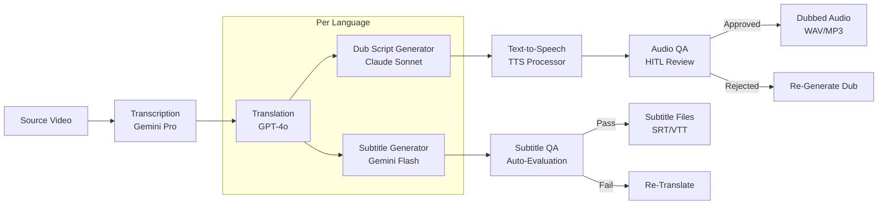

In this guide, you will build a complete AI content localization pipeline that transcribes, translates, generates subtitles, and produces dubbed audio across multiple languages. You will orchestrate five different AI models -- each selected for its specific strength -- into a production pipeline that processes an hour of content across 6 languages for approximately $2.53, compared to $30,000-$300,000 for traditional localization.

> **Note:** The $2.53 figure reflects raw AI API costs only. Total production costs include engineering time, human review of AI output, quality assurance, cultural adaptation review, and ongoing maintenance. The $30K-$300K traditional cost includes professional voice talent, studio recording, and cultural experts. The real-world savings are significant but less dramatic than the raw API cost comparison suggests.
{: .prompt-info }

## Localization Pipeline Architecture

The pipeline processes source content through five stages, with quality gates ensuring that only accurate, culturally appropriate content reaches the final output:



Each stage uses a different provider optimized for that specific task:

- **Transcription**: Gemini Pro for accurate speech-to-text from source audio
- **Translation**: GPT-4o for nuanced multi-language translation that preserves cultural context
- **Subtitle generation**: Gemini Flash for fast timing alignment and subtitle formatting
- **Dub script generation**: Claude Sonnet for adapting translations into natural spoken scripts
- **TTS**: NeuroLink's TTS processor for speech synthesis with language-appropriate voices
- **Quality evaluation**: Auto-evaluation at each stage with HITL for final review

## Multi-Provider Translation Pipeline

The provider selection for each stage is deliberate. NeuroLink's `ModelConfigurationManager` provides tier-based model selection so you always get the right quality level for each task:

```typescript
import { NeuroLink } from '@juspay/neurolink';

const neurolink = new NeuroLink({
  conversationMemory: { enabled: true },
});

// Step 1: Transcription - balanced accuracy model
const transcript = await neurolink.generate({
  input: { text: "Transcribe the following audio content accurately, preserving speaker labels and timestamps." },
  provider: "vertex",
  model: "gemini-2.5-pro",
});

// Step 2: Translation - quality model for nuance preservation
const translation = await neurolink.generate({
  input: {
    text: `Translate the following content to Spanish (es-ES).
    Preserve cultural context, idioms, and tone.
    Do not translate proper nouns unless they have established translations.
    Source: ${transcript.content}`,
  },
  provider: "openai",
  model: "gpt-4o",
});

// Step 3: Subtitle timing - fast model for high-volume processing
const subtitles = await neurolink.generate({
  input: {
    text: `Generate SRT subtitle format from this translated text.
    Each subtitle should be 1-2 lines, max 42 characters per line.
    Duration: 2-7 seconds per subtitle.
    Translation: ${translation.content}`,
  },
  provider: "vertex",
  model: "gemini-2.5-flash",
});

// Step 4: Dub script adaptation - balanced model for natural language
const dubScript = await neurolink.generate({
  input: {
    text: `Adapt this translation for spoken delivery in Spanish.
    Match the original timing and pacing.
    Make it sound natural, not like a literal translation.
    Translation: ${translation.content}`,
  },
  provider: "anthropic",
  model: "claude-sonnet-4-20250514",
});
```

For processing multiple target languages, parallelize with `Promise.all`:

```typescript
const targetLanguages = ["es", "fr", "de", "ja", "ko", "pt-BR"];

const results = await Promise.all(
  targetLanguages.map(async (lang) => {
    const translation = await neurolink.generate({
      input: {
        text: `Translate to ${lang}, preserving cultural context:\n${transcript.content}`,
      },
      provider: "openai",
      model: "gpt-4o",
    });
    return { lang, translation: translation.content };
  })
);
```

Parallel processing across languages dramatically reduces total pipeline time. A sequential pipeline for 6 languages might take 30 minutes; parallel processing completes in 5 minutes.

> **Note:** Each provider has rate limits. When processing many languages in parallel, monitor for rate limit errors and implement backoff. NeuroLink's retry utilities handle this automatically.
{: .prompt-info }

## TTS Processing for Dubbing

Dubbing requires more than translation -- the spoken version must sound natural in the target language while matching the original video's timing and emotional tone. The dub script adaptation stage handles the linguistic side; TTS handles the audio generation.

```typescript
// Generate dub scripts adapted for spoken delivery
const dubScript = await neurolink.generate({
  input: {
    text: `Adapt this translation for spoken delivery in ${targetLanguage}.
    Match the original timing: ${timingData}.
    Make it sound natural, not like a literal translation.
    Source: ${sourceTranscript}
    Translation: ${rawTranslation}`,
  },
  provider: "anthropic",
  model: "claude-sonnet-4-20250514",
});

// TTS synthesis for each language segment
const audioResult = await neurolink.generate({
  input: { text: dubScript.content },
  provider: "google-ai",
  tts: {
    enabled: true,
    voice: voiceMapping[targetLanguage], // e.g., "es-ES-Neural2-A"
    format: "wav",
    speed: 1.0,
    quality: "hd",
  },
});
```

Voice mapping by language ensures appropriate voices for each locale:

```typescript
const voiceMapping: Record<string, string> = {
  "es": "es-ES-Neural2-A",
  "fr": "fr-FR-Neural2-A",
  "de": "de-DE-Neural2-B",
  "ja": "ja-JP-Neural2-B",
  "ko": "ko-KR-Neural2-A",
  "pt-BR": "pt-BR-Neural2-A",
};
```

The dub script adaptation is where AI truly shines over literal translation. A phrase like "break a leg" in English would be literally translated as something nonsensical in most languages. Claude Sonnet's strength in natural language understanding produces adaptations that sound like they were originally written in the target language.

Timing alignment is critical for dubbing. The adapted script must fit within the same time windows as the original dialogue. If the original line takes 3 seconds, the dubbed version must also take approximately 3 seconds. The TTS speed parameter can be adjusted per segment to match timing, but the adaptation prompt should also request length-appropriate translations.

## Quality Evaluation for Translations

Translation quality varies widely by language pair, content domain, and cultural nuance. NeuroLink's evaluation system provides automated quality gates at each stage:

```typescript
import { generateEvaluation } from '@juspay/neurolink';

// Evaluate translation quality
const translationEval = await generateEvaluation({
  userQuery: `Translate from English to ${targetLanguage}: "${sourceText}"`,
  aiResponse: translatedText,
  primaryDomain: "translation",
  conversationHistory: [
    { role: "system", content: `Context: ${contentCategory} content for ${targetAudience}` },
  ],
});

// Quality thresholds for different content types
const thresholds = {
  subtitles: { accuracy: 7, completeness: 7 },
  dubbing: { accuracy: 8, completeness: 8 }, // Higher for spoken delivery
  legal: { accuracy: 9, completeness: 9 },    // Highest for legal content
};

const threshold = thresholds[contentType];
if (translationEval.accuracy < threshold.accuracy) {
  // Re-translate with quality-tier model
  const retranslation = await neurolink.generate({
    input: {
      text: `The previous translation scored ${translationEval.accuracy}/10 for accuracy.
      Issues: ${translationEval.reasoning}
      Please retranslate with these corrections: "${sourceText}"`,
    },
    provider: "openai",
    model: "gpt-4o",
  });
}
```

Different content types demand different quality levels:

- **Subtitles** (threshold 7/10): Viewers can see the video and infer context from visuals. Minor translation imperfections are tolerable.
- **Dubbing** (threshold 8/10): Audio-only delivery means the translation must stand on its own. Natural-sounding delivery is critical.
- **Legal/regulatory content** (threshold 9/10): Compliance requirements demand near-perfect accuracy. No room for interpretation errors.

The evaluation uses `primaryDomain: "translation"` to activate domain-specific scoring that understands translation-specific quality criteria: semantic accuracy, natural phrasing, cultural appropriateness, and register consistency.

## Content Safety Guardrails

Localization introduces unique safety challenges. Content that is appropriate in one culture may be offensive or even illegal in another. NeuroLink's middleware system provides cultural sensitivity filtering:

```typescript
import { MiddlewareFactory } from '@juspay/neurolink';

const mediaMiddleware = new MiddlewareFactory({
  middlewareConfig: {
    guardrails: {
      enabled: true,
      config: {
        badWords: [
          // Content-rating specific filters per target market
          ...getMarketSpecificBadWords(targetMarket),
        ],
        precallEvaluation: { enabled: true },
        modelFilter: {
          enabled: true, // AI-powered cultural sensitivity check
        },
      },
    },
    analytics: {
      enabled: true, // Track cost per language per content hour
    },
  },
});
```

The `modelFilter` option enables AI-powered cultural sensitivity checking. Beyond simple keyword filtering, it uses an LLM to evaluate whether the translated content is culturally appropriate for the target market. This catches subtle issues that keyword lists miss -- for example, a gesture description that is innocuous in one culture but offensive in another.

Market-specific `badWords` lists filter content at the vocabulary level. These lists vary by target market and content rating:

```typescript
function getMarketSpecificBadWords(market: string): string[] {
  const filters: Record<string, string[]> = {
    "us-pg": ["profanity-list-us-pg"],
    "de-fsk12": ["profanity-list-de-fsk12"],
    "jp-all-ages": ["profanity-list-jp-all"],
    // Each market has its own filtering requirements
  };
  return filters[market] || [];
}
```

## HITL for Final Review

While AI handles 90%+ of the localization pipeline automatically, human review remains essential for final quality assurance. Native-speaking reviewers catch nuances that automated evaluation misses:

```typescript
import { HITLManager } from '@juspay/neurolink';

const mediaHITL = new HITLManager({
  enabled: true,
  dangerousActions: ["publish-localized", "approve-dub"],
  timeout: 172800000, // 48 hours for reviewer turnaround
  allowArgumentModification: true, // Reviewers can edit translations
  auditLogging: true,
});
```

The `allowArgumentModification` setting is key for localization workflows. When a reviewer spots an issue, they can directly edit the translation rather than rejecting it for a full re-generation. This is much faster than the reject-regenerate-review cycle.

`auditLogging` creates a record of every human review decision, which is valuable for:

- Training data: reviewer corrections improve future translation prompts
- Quality metrics: track which languages have the highest correction rates
- Compliance: demonstrate human oversight of AI-generated content

## Resilience and Scale

Localization pipelines process large volumes -- a single 1-hour video localized into 6 languages generates dozens of API calls. Rate limiting and retry logic prevent API throttling:

```typescript
import { withRetry, RateLimiter } from '@juspay/neurolink';

// Rate limiter per provider to avoid hitting API limits during batch processing
const translationLimiter = new RateLimiter(100, 60000); // 100 req/min

async function translateBatch(segments: string[], targetLang: string) {
  const results = [];
  for (const segment of segments) {
    await translationLimiter.acquire();
    const result = await withRetry(
      () => neurolink.generate({
        input: { text: `Translate to ${targetLang}: ${segment}` },
        provider: "openai",
        model: "gpt-4o",
      }),
      { maxAttempts: 3, initialDelay: 1000 }
    );
    results.push(result);
  }
  return results;
}
```

The `RateLimiter` prevents bursting beyond provider limits even during parallel language processing. The `withRetry` wrapper handles transient failures (network timeouts, rate limit responses) with exponential backoff.

For very large batches (feature-length films, multi-season series), consider:

- **Chunking by scene**: Process scenes independently for natural parallelization
- **Priority queuing**: Process subtitle tracks first (fast), dubbing second (slower)
- **Progress tracking**: Store intermediate results so failures resume from the last checkpoint rather than restarting the entire pipeline

## Cost Analysis

The economics of AI localization are transformative:

| Stage | Model | Cost per Hour of Content |
|---|---|---|
| Transcription (Gemini Pro) | Speech-to-text | ~$0.05 |
| Translation (GPT-4o) | Per language | ~$0.30/language |
| Subtitles (Gemini Flash) | Per language | ~$0.01/language |
| Dub scripts (Claude Sonnet) | Per language | ~$0.10/language |
| Evaluation (Gemini Flash) | Quality gates | ~$0.02 |
| **Total for 6 languages** | | **~$2.53** |
| **Traditional cost** | Per language | **$5,000-$50,000/language** |

The AI cost per hour of content across 6 languages is approximately $2.53. Traditional localization for the same content would cost $30,000-$300,000. Even accounting for human review of AI output (which takes a fraction of the time compared to creating translations from scratch), the cost reduction is 99%+.

> **Note:** These costs assume standard-length content segments. Very long continuous segments or highly technical content may require more tokens and re-generation cycles. Track actual costs using the analytics middleware.
{: .prompt-info }

## Production Pipeline Example

Here is a complete pipeline function that processes source content through all stages:

```typescript
async function localizeContent(
  sourceAudioUrl: string,
  targetLanguages: string[],
  contentType: "subtitles" | "dubbing" | "both"
) {
  // Step 1: Transcribe source
  const transcript = await neurolink.generate({
    input: { text: `Transcribe with timestamps: ${sourceAudioUrl}` },
    provider: "vertex",
    model: "gemini-2.5-pro",
  });

  // Step 2: Parallel translation + generation per language
  const localizations = await Promise.all(
    targetLanguages.map(async (lang) => {
      // Translate
      const translation = await neurolink.generate({
        input: { text: `Translate to ${lang}:\n${transcript.content}` },
        provider: "openai",
        model: "gpt-4o",
      });

      // Evaluate translation quality
      const evaluation = await generateEvaluation({
        userQuery: `Translate to ${lang}`,
        aiResponse: translation.content,
        primaryDomain: "translation",
      });

      // Re-translate if quality is below threshold
      let finalTranslation = translation.content;
      if (evaluation.accuracy < 7) {
        const retry = await neurolink.generate({
          input: { text: `Improve this ${lang} translation:\n${translation.content}` },
          provider: "openai",
          model: "gpt-4o",
        });
        finalTranslation = retry.content;
      }

      const result: any = { lang, translation: finalTranslation };

      // Generate subtitles if requested
      if (contentType === "subtitles" || contentType === "both") {
        const subs = await neurolink.generate({
          input: { text: `Generate SRT subtitles:\n${finalTranslation}` },
          provider: "vertex",
          model: "gemini-2.5-flash",
        });
        result.subtitles = subs.content;
      }

      // Generate dubbed audio if requested
      if (contentType === "dubbing" || contentType === "both") {
        const dubScript = await neurolink.generate({
          input: { text: `Adapt for spoken delivery in ${lang}:\n${finalTranslation}` },
          provider: "anthropic",
          model: "claude-sonnet-4-20250514",
        });
        result.dubScript = dubScript.content;
      }

      return result;
    })
  );

  return localizations;
}
```

## What's Next

You have built a complete localization pipeline with transcription, translation, subtitle generation, dubbing, quality evaluation, and HITL review. Here is the recommended path forward:

1. **Start with subtitles** -- they are faster to generate and easier to review than dubbed audio
2. **Run quality evaluation on every translation** -- use the `generateEvaluation` function with content-type-specific thresholds
3. **Add cultural safety guardrails** -- configure market-specific `badWords` lists and enable the `modelFilter` for AI-powered sensitivity checking
4. **Implement HITL review** -- set up native-speaking reviewers with `allowArgumentModification: true` so they can edit translations directly
5. **Scale to dubbing** -- once your translation quality is stable, add TTS synthesis with language-appropriate voice mappings

---

**Related posts:**

- [Multimodal Document Processing with NeuroLink](/posts/multimodal-document-processing/)
- [Structured Output: JSON Schema Enforcement with NeuroLink](/posts/structured-output-json/)
- [LLM Cost Optimization: Practical Strategies to Reduce Your AI Spend](/posts/cost-optimization-strategies/)
