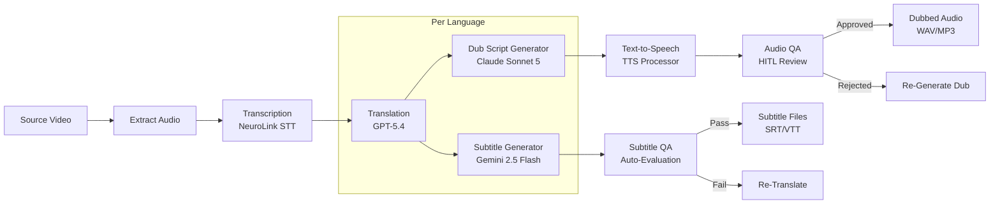

In this guide, you will build an AI content localization pipeline that transcribes uploaded audio, translates the transcript, generates subtitles, and produces dubbed audio across multiple languages. The examples combine NeuroLink's STT and TTS processors with provider-agnostic text generation, built-in response evaluation, guardrails, and human review. Treat it as a reference architecture: actual cost, latency, and quality depend on media length, provider pricing, language pair, retry volume, and review requirements.

> **Note:** Budget with current provider price sheets and measurements from your own media. Raw API charges exclude engineering, storage, transcoding, human review, quality assurance, cultural adaptation, and ongoing maintenance.
{: .prompt-info }

## Localization Pipeline Architecture

The pipeline processes source content through five stages, with quality gates ensuring that only accurate, culturally appropriate content reaches the final output:


```mermaid
flowchart LR
    Source["Source Video"] --> Extract["Extract Audio"]
    Extract --> Transcribe["Transcription<br/>NeuroLink STT"]
    Transcribe --> Translate["Translation<br/>GPT-5.4"]
    Translate --> SubGen["Subtitle Generator<br/>Gemini 2.5 Flash"]
    Translate --> DubGen["Dub Script Generator<br/>Claude Sonnet 5"]

    SubGen --> SubQA["Subtitle QA<br/>Auto-Evaluation"]
    DubGen --> TTS["Text-to-Speech<br/>TTS Processor"]
    TTS --> AudioQA["Audio QA<br/>HITL Review"]

    SubQA -->|"Pass"| SubOutput["Subtitle Files<br/>SRT/VTT"]
    SubQA -->|"Fail"| SubFix["Re-Translate"]
    AudioQA -->|"Approved"| AudioOutput["Dubbed Audio<br/>WAV/MP3"]
    AudioQA -->|"Rejected"| DubFix["Re-Generate Dub"]

    subgraph Language["Per Language"]
        Translate
        SubGen
        DubGen
    end
```

Each stage uses a different provider optimized for that specific task:

- **Transcription**: one of NeuroLink's registered STT handlers (`whisper`, `deepgram`, `google-stt`, or `azure-stt`) processes extracted audio bytes
- **Translation**: GPT-5.4 handles nuanced multi-language translation with source context
- **Subtitle generation**: Gemini 2.5 Flash formats the translated transcript and timing data as subtitles
- **Dub script generation**: Claude Sonnet 5 adapts translations into natural spoken scripts
- **TTS**: NeuroLink's TTS processor synthesizes speech with language-appropriate voices
- **Quality evaluation**: NeuroLink's per-call auto-evaluation provides relevance, accuracy, and completeness scores; HITL gates final publishing

## Multi-Provider Translation Pipeline

Provider selection for each stage is deliberate, but NeuroLink does not choose a quality tier from a `ModelConfigurationManager`; specify a provider and current in-catalog model for each text-generation call. For transcription, pass real audio bytes to an STT handler rather than putting a file URL in a text prompt:

```typescript
import { readFile } from 'node:fs/promises';
import {
  NeuroLink,
  STTProcessor,
  registerDefaultSTTHandlers,
} from '@juspay/neurolink';

registerDefaultSTTHandlers();
const neurolink = new NeuroLink();

// Step 1: Transcribe extracted audio bytes with a registered STT handler
const audio = await readFile('./source-audio.wav');
const transcript = await STTProcessor.transcribe(audio, 'whisper', {
  language: 'en-US',
  format: 'wav',
  punctuation: true,
  speakerDiarization: true,
  wordTimestamps: true,
});

// Step 2: Translation - flagship model for nuance preservation
const translation = await neurolink.generate({
  input: {
    text: `Translate the following content to Spanish (es-ES).
    Preserve cultural context, idioms, and tone.
    Do not translate proper nouns unless they have established translations.
    Source: ${transcript.text}`,
  },
  provider: 'openai',
  model: 'gpt-5.4',
});

// Step 3: Subtitle formatting - fast model for high-volume processing
const subtitles = await neurolink.generate({
  input: {
    text: `Generate SRT subtitle format from this translation and the source timing data.
    Each subtitle should be 1-2 lines, max 42 characters per line.
    Translation: ${translation.content}
    Source segments: ${JSON.stringify(transcript.segments ?? [])}`,
  },
  provider: 'vertex',
  model: 'gemini-2.5-flash',
});

// Step 4: Dub script adaptation - balanced model for natural language
const dubScript = await neurolink.generate({
  input: {
    text: `Adapt this translation for spoken delivery in Spanish.
    Match the original segment timing and pacing.
    Make it sound natural, not like a literal translation.
    Translation: ${translation.content}`,
  },
  provider: 'anthropic',
  model: 'claude-sonnet-5',
});
```

For processing multiple target languages, parallelize with `Promise.all`:

```typescript
const targetLanguages = ["es", "fr", "de", "ja", "ko", "pt-BR"];

const results = await Promise.all(
  targetLanguages.map(async (lang) => {
    const translation = await neurolink.generate({
      input: {
        text: `Translate to ${lang}, preserving cultural context:\n${transcript.text}`,
      },
      provider: "openai",
      model: "gpt-5.4",
    });
    return { lang, translation: translation.content };
  })
);
```

Parallel processing can reduce wall-clock time, but the actual speedup depends on provider concurrency and rate limits; unbounded `Promise.all` can simply move the bottleneck into throttling.

> **Note:** Each provider has rate limits. Bound concurrency in the host application and wrap only retryable failures with NeuroLink's exported `withRetry` helper; `generate()` does not automatically apply an application-specific batch limit.
{: .prompt-info }

## TTS Processing for Dubbing

Dubbing requires more than translation -- the spoken version must sound natural in the target language while matching the original video's timing and emotional tone. The dub script adaptation stage handles the linguistic side; TTS handles the audio generation.

```typescript
import { writeFile } from 'node:fs/promises';

// Generate dub scripts adapted for spoken delivery
const dubScript = await neurolink.generate({
  input: {
    text: `Adapt this translation for spoken delivery in ${targetLanguage}.
    Match the original timing: ${timingData}.
    Make it sound natural, not like a literal translation.
    Source: ${sourceTranscript}
    Translation: ${rawTranslation}`,
  },
  provider: "anthropic",
  model: "claude-sonnet-5",
});

// TTS synthesis for each language segment
const audioResult = await neurolink.generate({
  input: { text: dubScript.content },
  provider: 'google-ai',
  tts: {
    enabled: true,
    provider: 'google-ai',
    voice: voiceMapping[targetLanguage], // e.g., "es-ES-Neural2-A"
    format: 'wav',
    speed: 1.0,
    quality: 'hd',
  },
});

if (!audioResult.audio) {
  throw new Error('TTS did not return audio');
}
await writeFile(`dub-${targetLanguage}.wav`, audioResult.audio.buffer);
```

Voice mapping by language ensures appropriate voices for each locale:

```typescript
const voiceMapping: Record<string, string> = {
  "es": "es-ES-Neural2-A",
  "fr": "fr-FR-Neural2-A",
  "de": "de-DE-Neural2-B",
  "ja": "ja-JP-Neural2-B",
  "ko": "ko-KR-Neural2-A",
  "pt-BR": "pt-BR-Neural2-A",
};
```

The dub script adaptation is where AI truly shines over literal translation. A phrase like "break a leg" in English would be literally translated as something nonsensical in most languages. Claude Sonnet's strength in natural language understanding produces adaptations that sound like they were originally written in the target language.

Timing alignment is critical for dubbing. The adapted script must fit within the same time windows as the original dialogue. If the original line takes 3 seconds, the dubbed version must also take approximately 3 seconds. The TTS speed parameter can be adjusted per segment to match timing, but the adaptation prompt should also request length-appropriate translations.

## Quality Evaluation for Translations

Translation quality varies widely by language pair, content domain, and cultural nuance. NeuroLink's evaluation system provides automated quality gates at each stage:

```typescript
// Ask NeuroLink to evaluate the generated translation in the same call
const translation = await neurolink.generate({
  input: {
    text: `Translate from English to ${targetLanguage} for ${targetAudience}.
    Content category: ${contentCategory}
    Source: ${sourceText}`,
  },
  provider: 'openai',
  model: 'gpt-5.4',
  enableEvaluation: true,
  evaluationDomain: 'translation',
});

// Quality thresholds for different content types (application policy)
const thresholds = {
  subtitles: { accuracy: 7, completeness: 7 },
  dubbing: { accuracy: 8, completeness: 8 },
  legal: { accuracy: 9, completeness: 9 },
};

const threshold = thresholds[contentType];
const translationEval = translation.evaluation;
if (
  !translationEval ||
  translationEval.accuracy < threshold.accuracy ||
  translationEval.completeness < threshold.completeness
) {
  const retranslation = await neurolink.generate({
    input: {
      text: `Improve this ${targetLanguage} translation.
      Evaluation feedback: ${translationEval?.reasoning ?? 'No evaluation returned'}
      Source: ${sourceText}
      Previous translation: ${translation.content}`,
    },
    provider: 'openai',
    model: 'gpt-5.4',
  });
}
```

Different content types demand different quality levels:

- **Subtitles** (threshold 7/10): Viewers can see the video and infer context from visuals. Minor translation imperfections are tolerable.
- **Dubbing** (threshold 8/10): Audio-only delivery means the translation must stand on its own. Natural-sounding delivery is critical.
- **Legal/regulatory content** (threshold 9/10): Compliance requirements demand near-perfect accuracy. No room for interpretation errors.

`evaluationDomain: 'translation'` labels the generated result's evaluation context. NeuroLink returns general relevance, accuracy, and completeness scores on a 1-10 scale; it does not replace a native-speaker review for cultural appropriateness, idiomatic phrasing, or legal meaning.

## Content Safety Guardrails

Localization introduces unique safety challenges. Content that is appropriate in one culture may be offensive or restricted in another. NeuroLink's guardrails middleware can apply deterministic term and regex filtering to generated output:

```typescript
const localized = await neurolink.generate({
  input: { text: localizationPrompt },
  provider: 'openai',
  model: 'gpt-5.4',
  middleware: {
    enabledMiddleware: ['guardrails'],
    middlewareConfig: {
      guardrails: {
        enabled: true,
        config: {
          badWords: {
            enabled: true,
            list: getMarketSpecificBadWords(targetMarket),
            replacementText: '[REDACTED]',
          },
        },
      },
    },
  },
});
```

The `badWords` config is intentionally narrow: it filters literal terms (or configured regex patterns) and cannot judge cultural meaning. NeuroLink also exposes a `modelFilter` hook, but it requires a real `LanguageModel` implementation in `filterModel`; `{ enabled: true }` alone performs no model check. Use a dedicated evaluation prompt plus native-speaker review for subtle issues such as register, gestures, political context, and local restrictions.

Market-specific term lists vary by target market and content rating:

```typescript
function getMarketSpecificBadWords(market: string): string[] {
  const filters: Record<string, string[]> = {
    "us-pg": ["profanity-list-us-pg"],
    "de-fsk12": ["profanity-list-de-fsk12"],
    "jp-all-ages": ["profanity-list-jp-all"],
    // Each market has its own filtering requirements
  };
  return filters[market] || [];
}
```

## HITL for Final Review

Human review remains essential for final quality assurance. Native-speaking reviewers catch nuances that automated evaluation misses. NeuroLink's HITL system gates **tool calls**, so use it when your localization agent has tools that publish or approve media:

```typescript
const reviewedNeurolink = new NeuroLink({
  hitl: {
    enabled: true,
    dangerousActions: ['publish-localized', 'approve-dub'],
    timeout: 172800000, // 48 hours for reviewer turnaround
    allowArgumentModification: true,
    auditLogging: true,
  },
});
```

`allowArgumentModification` lets the approver edit the arguments of a flagged tool call before it executes -- for example, changing the subtitle file key or locale passed to `publish-localized`. It does not turn generated text into a collaborative translation editor. Put the transcript, subtitle text, and dub script in your own review UI; register publishing as a tool only after that content has been approved.

`auditLogging` records HITL confirmation decisions. Your application should separately retain reviewer edits and quality outcomes for:

- Prompt improvement: reviewer corrections can inform future translation prompts
- Quality metrics: track which languages have the highest correction rates
- Governance: demonstrate human oversight before localized content is published

## Resilience and Scale

Localization pipelines can generate many API calls. Bound concurrency in your host and retry only errors your policy identifies as transient:

```typescript
import { withRetry } from '@juspay/neurolink';

const chunk = <T>(items: T[], size: number): T[][] =>
  Array.from({ length: Math.ceil(items.length / size) }, (_, index) =>
    items.slice(index * size, (index + 1) * size)
  );

const isTransientProviderError = (error: Error): boolean =>
  /rate limit|timeout|temporarily unavailable|connection reset/i.test(error.message);

async function translateBatch(segments: string[], targetLang: string) {
  const batches = chunk(segments, 5); // at most five concurrent provider calls

  return batches.reduce<Promise<string[]>>(
    async (completedPromise, batch) => {
      const completed = await completedPromise;
      const results = await Promise.all(
        batch.map((segment) =>
          withRetry(
            () => neurolink.generate({
              input: { text: `Translate to ${targetLang}: ${segment}` },
              provider: 'openai',
              model: 'gpt-5.4',
            }),
            {
              maxRetries: 2,
              baseDelayMs: 1000,
              maxDelayMs: 8000,
              shouldRetry: isTransientProviderError,
            }
          )
        )
      );
      return [...completed, ...results.map((result) => result.content)];
    },
    Promise.resolve([])
  );
}
```

The root package exports `withRetry`, whose options are `maxRetries`, `baseDelayMs`, optional `maxDelayMs`, and optional `shouldRetry`. NeuroLink does not export the `RateLimiter` used by the old example, so use your queue/concurrency library or a bounded batching pattern like the one above.

For very large batches (feature-length films, multi-season series), consider:

- **Chunking by scene**: Process scenes independently for natural parallelization
- **Priority queuing**: Process subtitle tracks first (fast), dubbing second (slower)
- **Progress tracking**: Store intermediate results so failures resume from the last checkpoint rather than restarting the entire pipeline

## Cost Analysis

Do not estimate localization cost from a single headline price. Build the budget from measured units for each provider and language:

| Stage | Measure | Include |
|---|---|---|
| Transcription | audio minutes or hours | diarization, timestamps, retries |
| Translation | input and output tokens per language | prompt context, terminology lists, revisions |
| Subtitle formatting | tokens per language | timing context and validation passes |
| Dub script adaptation | tokens per language | timing rewrites and pronunciation guidance |
| Speech synthesis | generated characters or audio duration | voice tier, format, re-renders |
| Evaluation | judge-model tokens | every automatic QA and retry cycle |
| Human review | reviewer time per language | cultural, legal, accessibility, and audio QA |

Run a representative pilot, record provider usage from each `GenerateResult`, and multiply by the current price sheet for the exact models and media services you use. Then add storage, transcoding, delivery, failed-job reprocessing, and human review. This produces a defensible cost range without freezing soon-stale prices into the architecture.

> **Note:** Cost and quality vary substantially by language pair, content density, voice choice, and review threshold. Keep raw API charges separate from end-to-end production cost.
{: .prompt-info }

## Production Pipeline Example

Here is a complete pipeline function that processes source content through all stages:

```typescript
type ContentType = 'subtitles' | 'dubbing' | 'both';

type LocalizedContent = {
  language: string;
  translation: string;
  subtitles?: string;
  dubScript?: string;
  dubbedAudio?: Buffer;
};

async function localizeContent(
  sourceAudio: Buffer,
  targetLanguages: string[],
  contentType: ContentType
): Promise<LocalizedContent[]> {
  // Step 1: Transcribe real audio bytes and retain segment timing
  const transcript = await STTProcessor.transcribe(sourceAudio, 'whisper', {
    format: 'wav',
    language: 'en-US',
    punctuation: true,
    wordTimestamps: true,
  });

  // Step 2: Translate, evaluate, and generate the requested media per language
  return Promise.all(
    targetLanguages.map(async (language): Promise<LocalizedContent> => {
      const translation = await neurolink.generate({
        input: { text: `Translate to ${language}:\n${transcript.text}` },
        provider: 'openai',
        model: 'gpt-5.4',
        enableEvaluation: true,
        evaluationDomain: 'translation',
      });

      const finalTranslation =
        translation.evaluation && translation.evaluation.accuracy >= 7
          ? translation.content
          : (
              await neurolink.generate({
                input: {
                  text: `Improve this ${language} translation using the source text and feedback.
                  Source: ${transcript.text}
                  Feedback: ${translation.evaluation?.reasoning ?? 'Evaluation unavailable'}
                  Translation: ${translation.content}`,
                },
                provider: 'openai',
                model: 'gpt-5.4',
              })
            ).content;

      const subtitles =
        contentType === 'subtitles' || contentType === 'both'
          ? (
              await neurolink.generate({
                input: {
                  text: `Generate SRT subtitles from this translation and timing data.
                  Translation: ${finalTranslation}
                  Segments: ${JSON.stringify(transcript.segments ?? [])}`,
                },
                provider: 'vertex',
                model: 'gemini-2.5-flash',
              })
            ).content
          : undefined;

      const dubScript =
        contentType === 'dubbing' || contentType === 'both'
          ? (
              await neurolink.generate({
                input: { text: `Adapt for spoken delivery in ${language}:\n${finalTranslation}` },
                provider: 'anthropic',
                model: 'claude-sonnet-5',
              })
            ).content
          : undefined;

      const dubbedAudio = dubScript
        ? (
            await neurolink.generate({
              input: { text: dubScript },
              provider: 'google-ai',
              tts: {
                enabled: true,
                provider: 'google-ai',
                voice: voiceMapping[language],
                format: 'wav',
              },
            })
          ).audio?.buffer
        : undefined;

      return {
        language,
        translation: finalTranslation,
        ...(subtitles ? { subtitles } : {}),
        ...(dubScript ? { dubScript } : {}),
        ...(dubbedAudio ? { dubbedAudio } : {}),
      };
    })
  );
}
```

## What's Next

You have built a complete localization pipeline with transcription, translation, subtitle generation, dubbing, quality evaluation, and HITL review. Here is the recommended path forward:

1. **Start with subtitles** -- they are faster to generate and easier to review than dubbed audio
2. **Run quality evaluation on every translation** -- set `enableEvaluation: true`, label the domain, and apply content-type-specific thresholds to `result.evaluation`
3. **Add layered safety checks** -- use market-specific term/regex filters for deterministic blocking, then add a real evaluation model and native-speaker review for cultural meaning
4. **Gate publishing with HITL** -- flag publish/approve tools as dangerous actions, while keeping text edits in your review interface
5. **Scale to dubbing** -- once translation quality is stable, add TTS synthesis with language-appropriate voice mappings and review the generated audio

---

**Related posts:**

- [Multimodal Document Processing with NeuroLink](/posts/multimodal-document-processing/)
- [Structured Output: JSON Schema Enforcement with NeuroLink](/posts/structured-output-json/)
- [LLM Cost Optimization: Practical Strategies to Reduce Your AI Spend](/posts/cost-optimization-strategies/)
