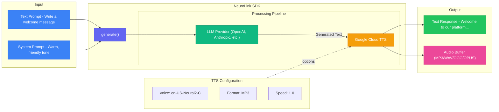
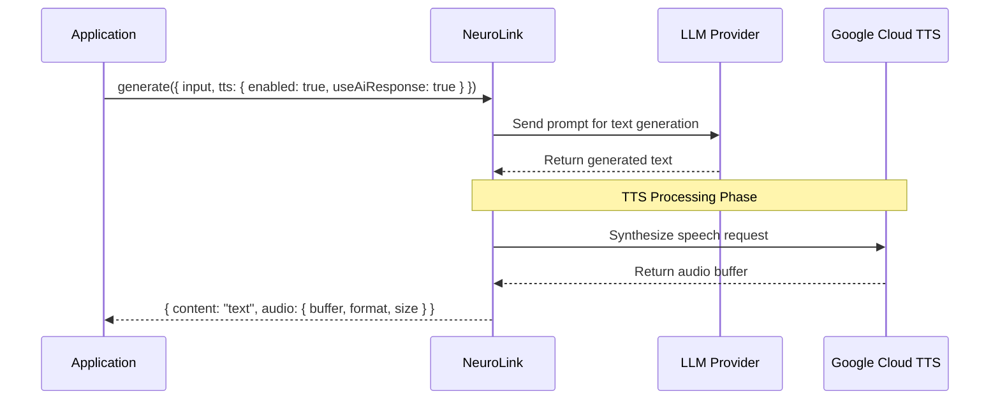
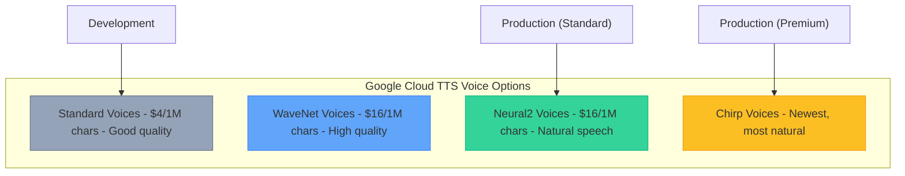
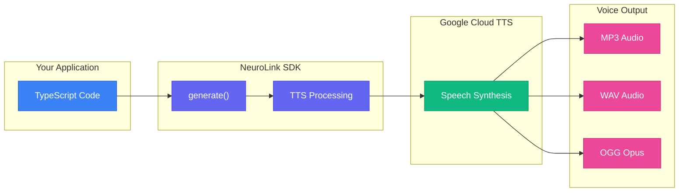

> **Note:** This guide covers the built-in TTS integration available in NeuroLink SDK. TTS uses Google Cloud Text-to-Speech under the hood.
{: .prompt-info }

# Text-to-Speech Integration: Build Voice-Enabled AI Apps with NeuroLink

Your users want voice. They want to listen while commuting, hear responses while cooking, and interact hands-free while multitasking. But adding text-to-speech to your AI application means wrestling with audio encoding, managing voice configurations, and handling provider APIs.

Voice integration should take minutes, not weeks. NeuroLink makes it happen. Pass a single `tts` option to your existing `generate()` call and receive both text and audio in one response. No separate API calls. No audio processing libraries. No voice configuration headaches.

This guide walks you through complete TTS integration with NeuroLink. You will learn voice selection, multi-speaker podcasts, and voice assistant patterns. By the end, you will add natural speech to any AI response with a few lines of TypeScript.



---

## Why Voice Matters for AI Apps

Voice transforms how users interact with AI. Reading text requires attention and focus. Listening frees users to do other things. This fundamental difference opens entirely new use cases.

### The Accessibility Advantage

Voice output makes your application accessible to users with visual impairments. Screen readers work, but natural AI-generated speech provides better context and nuance. Voice also helps users with reading difficulties, dyslexia, or those who simply prefer audio content.

### The Multitasking Factor

Users consume audio while driving, exercising, cleaning, or cooking. Text-only AI applications lose these contexts entirely. Voice-enabled apps stay relevant throughout the user's day.

### The Engagement Difference

Voice creates emotional connection. A well-chosen voice with appropriate pacing builds trust and personality. Users remember voice interactions more vividly than text exchanges.

### What NeuroLink TTS Provides

NeuroLink integrates TTS directly into the generation pipeline. You get:

- **Unified API** - Same `generate()` call produces text and audio
- **Google Cloud Voices** - Access to Neural2, WaveNet, Standard, and Chirp voices
- **Format Options** - MP3, WAV (LINEAR16), and OGG Opus output
- **Voice Control** - Speaking rate, pitch, and volume adjustment
- **Two Modes** - Synthesize input text directly OR synthesize AI-generated responses

**Related:** [API Reference](https://docs.neurolink.ink/docs/sdk/api-reference)

---

## Quick Start: Your First TTS Request

Getting started takes five minutes. You need Google Cloud credentials and the NeuroLink package.

### Step 1: Configure Google Cloud TTS

Enable the Cloud Text-to-Speech API in your Google Cloud Console. Create a service account and download the credentials JSON file. Set the environment variable:

```bash
# Required - Path to Google Cloud credentials
export GOOGLE_APPLICATION_CREDENTIALS=path/to/credentials.json

# For LLM provider (any supported provider)
export OPENAI_API_KEY=sk-...
# or
export ANTHROPIC_API_KEY=sk-ant-...
```

Never commit credentials to version control. Use environment variables or a secrets manager in production.

### Step 2: Generate Your First Audio Response

Install NeuroLink and create your first voice-enabled response:

```bash
pnpm add @juspay/neurolink
# or
npm install @juspay/neurolink
```

```typescript
import { NeuroLink } from "@juspay/neurolink";
import fs from "fs";

async function main() {
  const ai = new NeuroLink();

  console.log("Generating AI response with TTS audio output...\n");

  // Generate AI response with TTS audio output
  // useAiResponse: true means TTS will synthesize the AI-generated response
  const result = await ai.generate({
    input: {
      text: "Write a friendly welcome message for new users",
    },
    systemPrompt: "You are a helpful assistant with a warm tone",
    provider: "google-ai", // or any other provider
    model: 'gemini-2.0-flash-001',
    tts: {
      enabled: true,
      useAiResponse: true, // Synthesize the AI response (not the input)
      voice: "en-US-Neural2-C", // Neural2 voice
      format: "mp3",
    },
  });

  // Save the audio file
  if (result.tts?.buffer) {
    fs.writeFileSync("welcome.mp3", result.tts.buffer);
    console.log("Audio saved to welcome.mp3");
  }

  console.log("\nText Response:", result.content);
}

main().catch(console.error);
```

That's it. One `generate()` call produces both text and audio. The TTS option integrates seamlessly with any LLM provider.

> **TTS Modes:** When `useAiResponse` is `false` or omitted, TTS synthesizes your input text directly without calling the LLM. Set `useAiResponse: true` to synthesize the AI-generated response.
{: .prompt-tip }

**CLI equivalent:**

```bash
# Generate with TTS output
npx @juspay/neurolink generate "Write a welcome message" \
  --tts-voice "en-US-Neural2-C" \
  --ttsOutput welcome.mp3
```



> **Code Examples:** See the complete runnable examples in the [NeuroLink examples directory](https://github.com/juspay/neurolink/tree/main/examples).

---

## Voice Selection Guide

Google Cloud TTS offers multiple voice tiers with different quality levels and pricing. Choosing the right tier balances audio quality against cost.

### Voice Quality Tiers



| Voice Type | Quality | Use Case | Cost per 1M chars |
|------------|---------|----------|-------------------|
| Chirp | Premium | Most natural, newest | Varies |
| Neural2 | High | Standard production apps | ~$16 |
| WaveNet | High | Natural-sounding speech | ~$16 |
| Standard | Good | Development, testing | ~$4 |

### Available Voice Names

Google Cloud TTS voice names follow a pattern: `{language}-{region}-{type}-{variant}`. Here are commonly used voices:

**Neural2 Voices (Recommended for production):**
- `en-US-Neural2-A` - Female
- `en-US-Neural2-C` - Female
- `en-US-Neural2-D` - Male
- `en-US-Neural2-F` - Female
- `en-US-Neural2-J` - Male

**WaveNet Voices:**
- `en-US-Wavenet-A` - Male
- `en-US-Wavenet-B` - Male
- `en-US-Wavenet-C` - Female
- `en-US-Wavenet-D` - Male
- `en-US-Wavenet-F` - Female

**Standard Voices (Cost-effective for development):**
- `en-US-Standard-A` - Male
- `en-US-Standard-B` - Male
- `en-US-Standard-C` - Female
- `en-US-Standard-D` - Male

> **Full Voice List:** See [Google Cloud TTS Supported Voices](https://cloud.google.com/text-to-speech/docs/voices) for the complete list of 400+ voices across 50+ languages.
{: .prompt-info }

### Voice Selection Recommendations

Match voice tier to your use case:

| Scenario | Recommended Voice | Rationale |
|----------|-------------------|-----------|
| Development/Testing | `en-US-Standard-A` | Low cost, fast iteration |
| Internal Tools | `en-US-Neural2-C` | Good quality, reasonable cost |
| Customer-Facing Apps | `en-US-Neural2-D` | High quality, natural speech |
| High-Volume Processing | `en-US-Standard-*` | Cost-effective at scale |

---

## Direct Text-to-Speech (Without LLM)

You can use TTS to convert any text to speech directly, without generating content with an LLM first. This is useful for narrating existing content:

```typescript
import { NeuroLink } from "@juspay/neurolink";
import fs from "fs";

async function synthesizeText() {
  const ai = new NeuroLink();

  // Convert existing text to speech (no LLM generation)
  // When useAiResponse is false/omitted, TTS synthesizes the input directly
  const result = await ai.generate({
    input: {
      text: "Welcome to our platform. We're excited to have you here!",
    },
    provider: "google-ai",
    model: 'gemini-2.0-flash-001',
    tts: {
      enabled: true,
      // useAiResponse: false is the default - synthesizes input.text directly
      voice: "en-US-Neural2-C",
      format: "mp3",
      speed: 1.0,
    },
  });

  if (result.tts?.buffer) {
    fs.writeFileSync("narration.mp3", result.tts.buffer);
    console.log(`Audio saved: ${result.tts.size} bytes`);
    console.log(`Format: ${result.tts.format}`);
  }
}

synthesizeText().catch(console.error);
```

> **Note:** When `useAiResponse` is `false` (the default), the SDK synthesizes your input text directly using Google Cloud TTS without calling any LLM provider.
{: .prompt-tip }

---

## Advanced Patterns

Once you master basics, these patterns unlock sophisticated voice applications.

### Podcast Generation Pipeline

Generate multi-speaker podcast episodes with different voices for each speaker:

```typescript
import { NeuroLink } from "@juspay/neurolink";
import fs from "fs";

interface PodcastSection {
  speaker: "host" | "guest";
  text: string;
}

// Helper function to concatenate audio buffers
function concatenateAudioBuffers(buffers: Buffer[]): Buffer {
  return Buffer.concat(buffers);
}

async function generatePodcastEpisode(script: PodcastSection[]) {
  const ai = new NeuroLink();
  const audioSegments: Buffer[] = [];

  console.log("Generating Podcast Episode\n");
  console.log("=".repeat(60));

  for (let i = 0; i < script.length; i++) {
    const section = script[i];
    console.log(
      `\nProcessing section ${i + 1}/${script.length} (${section.speaker})...`
    );

    // Generate speech for each section
    // Using useAiResponse: false to synthesize the script directly
    const result = await ai.generate({
      input: {
        text: section.text,
      },
      provider: "google-ai",
      model: 'gemini-2.0-flash-001',
      tts: {
        enabled: true,
        // useAiResponse: false - synthesize the script text directly
        voice:
          section.speaker === "host"
            ? "en-US-Neural2-D" // Male host voice
            : "en-US-Neural2-C", // Female guest voice
        speed: 0.95, // Slightly slower for clarity
        format: "mp3",
      },
    });

    if (result.tts?.buffer) {
      audioSegments.push(result.tts.buffer);
      console.log(`  Generated ${result.tts.buffer.length} bytes of audio`);
    }
  }

  console.log("\n" + "-".repeat(60));
  console.log(`\nConcatenating ${audioSegments.length} audio segments...`);

  return concatenateAudioBuffers(audioSegments);
}

async function main() {
  // Sample podcast script
  const podcastScript: PodcastSection[] = [
    {
      speaker: "host",
      text: "Welcome to Tech Insights! Today we're discussing the future of AI in enterprise applications. I'm your host, and joining me is our special guest.",
    },
    {
      speaker: "guest",
      text: "Thanks for having me! I'm excited to share our experiences deploying AI at scale.",
    },
    {
      speaker: "host",
      text: "Let's start with the basics. What are the biggest challenges organizations face when adopting AI?",
    },
    {
      speaker: "guest",
      text: "The main challenges are governance, compliance, and ensuring human oversight. Many teams rush to deploy AI without proper guardrails in place.",
    },
    {
      speaker: "host",
      text: "That's a great point. Human-in-the-loop workflows seem essential for high-stakes decisions.",
    },
    {
      speaker: "guest",
      text: "Absolutely. At our company, we require human review for any customer-facing AI responses. It's added about 8 minutes to our average response time, but the quality improvement is worth it.",
    },
    {
      speaker: "host",
      text: "Fascinating insights! Thank you for joining us today. That's all for this episode of Tech Insights.",
    },
  ];

  try {
    const podcastAudio = await generatePodcastEpisode(podcastScript);

    // Save the podcast episode
    const outputPath = "podcast-episode.mp3";
    fs.writeFileSync(outputPath, podcastAudio);

    console.log(`\nPodcast episode saved to ${outputPath}`);
    console.log(`Total file size: ${(podcastAudio.length / 1024).toFixed(2)} KB`);
  } catch (error) {
    console.error("Error generating podcast:", error);
  }
}

main().catch(console.error);
```

This pattern works for any multi-speaker content: interviews, dialogues, audiobooks with character voices, or educational content with instructor and student roles.

### Voice Assistant Integration

Build conversational voice assistants that generate AI responses with audio:

```typescript
import { NeuroLink } from "@juspay/neurolink";
import fs from "fs";

// Voice assistant that generates AI responses with TTS
async function runVoiceAssistantDemo() {
  const ai = new NeuroLink();

  console.log("Voice Assistant Demo\n");
  console.log("=".repeat(60));

  // Simulated conversation
  const queries = [
    "What's the weather like today?",
    "Should I bring an umbrella?",
    "Thanks for the help!",
  ];

  for (const query of queries) {
    console.log(`\nUser: "${query}"`);

    // Generate AI response with TTS audio
    const result = await ai.generate({
      input: { text: query },
      provider: "google-ai",
      model: 'gemini-2.0-flash-001',
      systemPrompt: "You are a helpful voice assistant. Keep responses concise and conversational.",
      tts: {
        enabled: true,
        useAiResponse: true, // Synthesize the AI's response
        voice: "en-US-Neural2-C",
        format: "mp3",
      },
    });

    console.log(`Assistant: ${result.content}`);
    console.log(`  [Audio: ${result.tts?.buffer ? `${result.tts.size} bytes` : "None"}]`);
  }
}

runVoiceAssistantDemo().catch(console.error);
```

Each response includes both text and audio, enabling seamless voice interactions.

### Conditional TTS Based on Query Type

Enable or disable TTS dynamically based on user preferences or query type:

```typescript
import { NeuroLink } from "@juspay/neurolink";

async function conditionalTTSDemo() {
  const ai = new NeuroLink();

  console.log("Conditional TTS Demo:");
  console.log("=".repeat(60));

  // Different response modes based on query type
  const queries = [
    { text: "Read me the summary", wantsTTS: true },
    { text: "What's in the document?", wantsTTS: false }, // Text-only response
    { text: "Can you explain that out loud?", wantsTTS: true },
  ];

  for (const query of queries) {
    console.log(`\nQuery: "${query.text}" (TTS: ${query.wantsTTS})`);

    const result = await ai.generate({
      input: { text: query.text },
      provider: "google-ai",
      model: 'gemini-2.0-flash-001',
      systemPrompt: "You are a helpful assistant. Keep responses concise.",
      tts: query.wantsTTS
        ? {
            enabled: true,
            useAiResponse: true,
            voice: "en-US-Neural2-C",
            format: "mp3",
          }
        : undefined,
    });

    console.log(`Response: ${result.content.substring(0, 100)}...`);
    console.log(`Audio generated: ${!!result.tts}`);
  }
}

conditionalTTSDemo().catch(console.error);
```

This pattern lets users control when they want voice output, saving costs and respecting user preferences.

---

## CLI Workflows

The NeuroLink CLI provides quick access to TTS features for testing and prototyping.

### Generate with Voice Output

```bash
# Basic TTS generation - synthesizes the AI response
npx @juspay/neurolink generate "Welcome to our platform!" \
  --tts-voice "en-US-Neural2-C" \
  --ttsOutput welcome.mp3

# With specific provider
npx @juspay/neurolink generate "Your order has shipped" \
  --tts-voice "en-US-Neural2-D" \
  --provider google-ai \
  --ttsOutput notification.mp3

# Adjust voice settings
npx @juspay/neurolink generate "Important announcement" \
  --tts-voice "en-US-Neural2-C" \
  --ttsSpeed 0.9 \
  --ttsFormat mp3 \
  --ttsOutput announcement.mp3
```

### CLI TTS Options

| Option | Description | Default |
|--------|-------------|---------|
| `--tts-voice` | Voice ID to enable TTS (e.g., "en-US-Neural2-C") | - |
| `--ttsFormat` | Audio format: mp3, wav, ogg, opus | mp3 |
| `--ttsSpeed` | Speaking rate 0.25-4.0 | 1.0 |
| `--ttsOutput` | Output file path for audio | - |
| `--ttsPlay` | Play audio immediately after generation | false |

> **Note:** CLI streaming TTS support may be available - check `neurolink stream --help` for current capabilities.
{: .prompt-info }

---

## Audio Quality Settings

Fine-tune audio output with these configuration options:

```typescript
const ttsOptions = {
  tts: {
    enabled: true,
    useAiResponse: true, // true = synthesize AI response, false = synthesize input text
    voice: "en-US-Neural2-C",

    // Audio format options
    format: "mp3",         // Options: mp3, wav, ogg, opus

    // Voice modulation
    speed: 1.0,            // Range: 0.25 to 4.0 (1.0 = normal)
    pitch: 0.0,            // Range: -20.0 to 20.0 (0 = normal)
    volumeGainDb: 0.0,     // Range: -96.0 to 16.0 (0 = normal)

    // Quality setting
    quality: "standard",   // Options: standard, hd

    // Optional: save to file directly
    output: "./output.mp3",
  }
};
```

### Audio Format Comparison

| Format | Use Case | File Size | Quality |
|--------|----------|-----------|---------|
| mp3 | General use, web apps | Small | Good |
| wav (LINEAR16) | Professional audio, editing | Large | Lossless |
| ogg/opus (OGG_OPUS) | Low-latency applications | Small | Excellent |

### Speaking Rate Guidelines

| Rate | Effect | Best For |
|------|--------|----------|
| 0.75 | Slow, deliberate | Accessibility, complex content |
| 1.0 | Normal speed | General use |
| 1.15 | Slightly faster | Notifications, quick updates |
| 1.5 | Fast | Speed listeners, time-sensitive |

### Pitch Adjustment

| Pitch | Effect |
|-------|--------|
| -5.0 | Deeper, more authoritative |
| 0.0 | Natural voice pitch |
| +5.0 | Higher, more energetic |

---

## Next Steps

You now have everything needed to add voice to your AI applications. Here's where to go next:

### Expand Your Capabilities

- **[Multimodal Document Processing]()** - Add PDF, CSV, and image processing
- **[NeuroLink Getting Started](https://docs.neurolink.ink/docs/getting-started)** - Complete SDK setup guide
- **[Google Cloud TTS Documentation](https://cloud.google.com/text-to-speech/docs)** - Voice options and pricing details

### Reference Documentation

- **[Full SDK API Reference](https://docs.neurolink.ink/docs/sdk/api-reference)** - Complete TypeScript API documentation
- **[CLI Command Reference](https://docs.neurolink.ink/docs/cli/commands)** - Every CLI command with examples

### Get Started Now

Install NeuroLink and add voice to your first application:

```bash
# Install NeuroLink
pnpm add @juspay/neurolink
# or
npm install @juspay/neurolink
```

Don't forget to set up your Google Cloud credentials for TTS:

```bash
export GOOGLE_APPLICATION_CREDENTIALS=path/to/credentials.json
```

---

## Summary

Voice transforms AI applications from tools into companions. Users engage hands-free, accessibility improves, and emotional connection deepens. NeuroLink makes this transformation effortless.

You learned how to:

- Generate audio output with a single `tts` option in `generate()`
- Choose between synthesizing input text directly or AI-generated responses
- Select the right Google Cloud voice tier for your use case and budget
- Build multi-speaker content like podcasts with distinct voices
- Create conversational voice assistants with TTS output
- Use CLI workflows for rapid TTS prototyping
- Fine-tune audio quality with speed, pitch, and volume settings

Stop building separate audio pipelines. Start shipping voice features. One configuration option. Google Cloud voices. Natural speech.

---

*Have questions about TTS integration? Join our [Discord community](https://discord.gg/neurolink) or [open an issue on GitHub](https://github.com/juspay/neurolink/issues). We're here to help you build.*



**One SDK. Google Cloud Voices. Natural Speech.**
