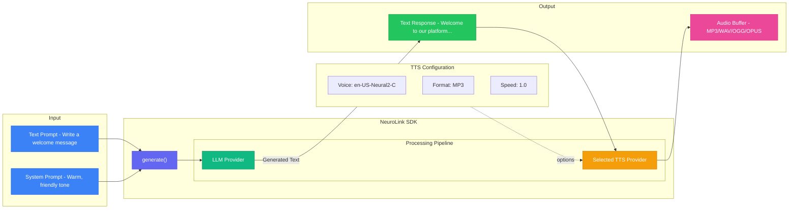
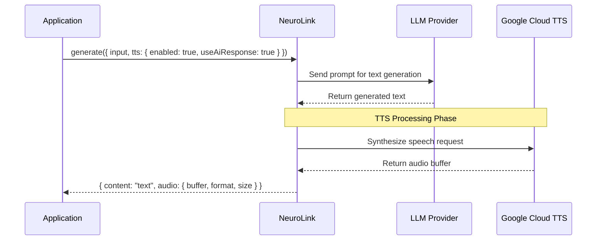
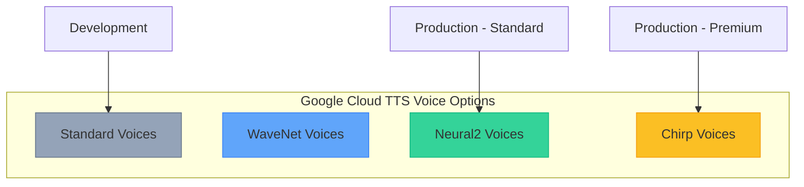
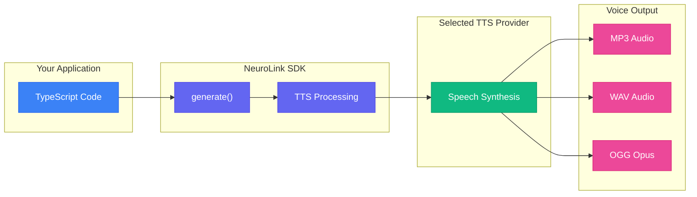

> **Note:** NeuroLink ships six TTS provider integrations: Google Cloud (`google-ai`/`vertex`), OpenAI TTS, ElevenLabs, Azure TTS, Fish Audio, and Cartesia. The examples start with Google Cloud, then show where to select a different TTS provider.
{: .prompt-info }

In this guide, you will add text-to-speech to your NeuroLink applications. You will configure Google Cloud TTS, choose a TTS provider explicitly, generate audio from either input text or an AI response, build multi-speaker audio, and create conversational voice assistants. By the end, you will produce both text and audio from a single `generate()` call and know when to use direct synthesis instead.


```mermaid
flowchart LR
    subgraph Input["Input"]
        TXT["Text Prompt - Write a welcome message"]
        SYS["System Prompt - Warm, friendly tone"]
    end

    subgraph NeuroLink["NeuroLink SDK"]
        GEN["generate()"]

        subgraph Processing["Processing Pipeline"]
            LLM["LLM Provider"]
            TTS["Selected TTS Provider"]
        end
    end

    subgraph TTSConfig["TTS Configuration"]
        VOICE["Voice: en-US-Neural2-C"]
        FMT["Format: MP3"]
        SPD["Speed: 1.0"]
    end

    subgraph Output["Output"]
        RESP["Text Response - Welcome to our platform..."]
        AUDIO["Audio Buffer - MP3/WAV/OGG/OPUS"]
    end

    TXT --> GEN
    SYS --> GEN
    TTSConfig -.->|"options"| TTS

    GEN --> LLM
    LLM -->|"Generated Text"| RESP
    RESP --> TTS
    TTS --> AUDIO

    style TXT fill:#3b82f6,stroke:#2563eb,color:#fff
    style SYS fill:#3b82f6,stroke:#2563eb,color:#fff
    style GEN fill:#6366f1,stroke:#4f46e5,color:#fff
    style LLM fill:#10b981,stroke:#059669,color:#fff
    style TTS fill:#f59e0b,stroke:#d97706,color:#fff
    style RESP fill:#22c55e,stroke:#16a34a,color:#fff
    style AUDIO fill:#ec4899,stroke:#db2777,color:#fff
```

---

## Why Voice Matters for AI Apps

Voice transforms how users interact with AI. Reading text requires attention and focus. Listening frees users to do other things. This fundamental difference opens entirely new use cases.

### The Accessibility Advantage

Voice output makes your application accessible to users with visual impairments. Screen readers work, but natural AI-generated speech provides better context and nuance. Voice also helps users with reading difficulties, dyslexia, or those who simply prefer audio content.

### The Multitasking Factor

Users consume audio while driving, exercising, cleaning, or cooking. Text-only AI applications lose these contexts entirely. Voice-enabled apps stay relevant throughout the user's day.

### The Engagement Difference

Voice creates emotional connection. A well-chosen voice with appropriate pacing builds trust and personality. Users remember voice interactions more vividly than text exchanges.

### What NeuroLink TTS Provides

NeuroLink integrates TTS directly into the generation pipeline. You get:

- **Unified API** - The same `generate()` call can produce text and audio
- **Six TTS providers** - Google Cloud, OpenAI TTS, ElevenLabs, Azure TTS, Fish Audio, and Cartesia
- **Format options** - MP3, WAV, OGG, Opus, M4A, FLAC, WebM, MP4, MPEG, MPGA, and raw PCM16 where supported
- **Voice control** - Speaking rate, pitch, volume, output quality, and provider-specific voice IDs
- **Two modes** - Synthesize `input.text` directly, or synthesize an AI-generated response with `useAiResponse: true`

**Related:** [API Reference](https://docs.neurolink.ink/docs/sdk/api-reference)

---

## Quick Start: Your First TTS Request

Getting started takes five minutes. You need Google Cloud credentials and the NeuroLink package.

### Step 1: Configure Google Cloud TTS

Enable the Cloud Text-to-Speech API in your Google Cloud Console. Create a service account and download the credentials JSON file. Set the environment variable:

```bash
# Required - Path to Google Cloud credentials
export GOOGLE_APPLICATION_CREDENTIALS=path/to/credentials.json

# For LLM provider (any supported provider)
export OPENAI_API_KEY=sk-...
# or
export ANTHROPIC_API_KEY=sk-ant-...
```

Never commit credentials to version control. Use environment variables or a secrets manager in production.

### Step 2: Generate Your First Audio Response

Install NeuroLink and create your first voice-enabled response:

```bash
pnpm add @juspay/neurolink
# or
npm install @juspay/neurolink
```

```typescript
import { NeuroLink } from "@juspay/neurolink";
import { writeFileSync } from "node:fs";

async function main() {
  const ai = new NeuroLink();

  console.log("Generating AI response with TTS audio output...\n");

  // Generate AI response with TTS audio output
  // useAiResponse: true means TTS will synthesize the AI-generated response
  const result = await ai.generate({
    input: {
      text: "Write a friendly welcome message for new users",
    },
    systemPrompt: "You are a helpful assistant with a warm tone",
    provider: "google-ai", // or any other provider
    model: 'gemini-2.5-flash',
    tts: {
      enabled: true,
      provider: "google-ai",
      useAiResponse: true, // Synthesize the AI response (not the input)
      voice: "en-US-Neural2-C", // Neural2 voice
      format: "mp3",
    },
  });

  // Save the audio file
  if (result.audio?.buffer) {
    writeFileSync("welcome.mp3", result.audio.buffer);
    console.log("Audio saved to welcome.mp3");
  }

  console.log("\nText Response:", result.content);
}

main().catch(console.error);
```

That's it. One `generate()` call produces both text and audio. The TTS option integrates seamlessly with any LLM provider.

> **TTS Modes:** When `useAiResponse` is `false` or omitted, TTS synthesizes your input text directly without calling the LLM. Set `useAiResponse: true` to synthesize the AI-generated response.
{: .prompt-tip }

**CLI equivalent:**

```bash
# Generate with TTS output
npx @juspay/neurolink generate "Write a welcome message" \
  --tts \
  --tts-provider google-ai \
  --tts-voice "en-US-Neural2-C" \
  --ttsOutput welcome.mp3
```


```mermaid
sequenceDiagram
    participant App as Application
    participant NL as NeuroLink
    participant LLM as LLM Provider
    participant GTTS as Google Cloud TTS

    App->>NL: generate({ input, tts: { enabled: true, useAiResponse: true } })
    NL->>LLM: Send prompt for text generation
    LLM-->>NL: Return generated text

    Note over NL,GTTS: TTS Processing Phase

    NL->>GTTS: Synthesize speech request
    GTTS-->>NL: Return audio buffer

    NL-->>App: { content: "text", audio: { buffer, format, size } }
```

> **Code Examples:** See the complete runnable examples in the [NeuroLink examples directory](https://github.com/juspay/neurolink/tree/main/examples).

---

## Voice Selection Guide

Google Cloud TTS offers multiple voice tiers with different quality levels and pricing. Choosing the right tier balances audio quality against cost.

### Voice Quality Tiers

Google publishes voice availability and pricing independently of NeuroLink. Check the live Google Cloud TTS pages before choosing a tier; prices and regional availability change.


```mermaid
graph TD
    subgraph Voices["Google Cloud TTS Voice Options"]
        STD["Standard Voices"]
        WAV["WaveNet Voices"]
        NEU["Neural2 Voices"]
        CHIRP["Chirp Voices"]
    end

    DEV["Development"] --> STD
    PROD["Production - Standard"] --> NEU
    PREM["Production - Premium"] --> CHIRP

    style STD fill:#94a3b8,stroke:#64748b
    style WAV fill:#60a5fa,stroke:#3b82f6
    style NEU fill:#34d399,stroke:#10b981
    style CHIRP fill:#fbbf24,stroke:#f59e0b
```

| Voice Type | Typical Use Case | Selection Note |
|------------|------------------|----------------|
| Chirp | Highest-fidelity conversational speech | Verify the requested locale and synthesis mode |
| Neural2 | General production narration | Balance naturalness and availability |
| WaveNet | Natural-sounding speech | Useful where the desired locale lacks Neural2/Chirp |
| Standard | Development and high-volume utility audio | Validate quality with representative content |

### Available Voice Names

Google Cloud TTS voice names follow a pattern: `{language}-{region}-{type}-{variant}`. Here are commonly used voices:

**Neural2 Voices (Recommended for production):**

- `en-US-Neural2-A` - Female
- `en-US-Neural2-C` - Female
- `en-US-Neural2-D` - Male
- `en-US-Neural2-F` - Female
- `en-US-Neural2-J` - Male

**WaveNet Voices:**

- `en-US-Wavenet-A` - Male
- `en-US-Wavenet-B` - Male
- `en-US-Wavenet-C` - Female
- `en-US-Wavenet-D` - Male
- `en-US-Wavenet-F` - Female

**Standard Voices (Cost-effective for development):**

- `en-US-Standard-A` - Male
- `en-US-Standard-B` - Male
- `en-US-Standard-C` - Female
- `en-US-Standard-D` - Male

> **Full Voice List:** See [Google Cloud TTS Supported Voices](https://cloud.google.com/text-to-speech/docs/voices) for the current voice and language catalog.
{: .prompt-info }

### Voice Selection Recommendations

Match voice tier to your use case:

| Scenario | Recommended Voice | Rationale |
|----------|-------------------|-----------|
| Development/Testing | `en-US-Standard-A` | Low cost, fast iteration |
| Internal Tools | `en-US-Neural2-C` | Good quality, reasonable cost |
| Customer-Facing Apps | `en-US-Neural2-D` | High quality, natural speech |
| High-Volume Processing | `en-US-Standard-*` | Cost-effective at scale |

---

## Direct Text-to-Speech (Without LLM)

You can use TTS to convert any text to speech directly, without generating content with an LLM first. This is useful for narrating existing content:

```typescript
import { NeuroLink } from "@juspay/neurolink";
import { writeFileSync } from "node:fs";

async function synthesizeText() {
  const ai = new NeuroLink();

  // Convert existing text to speech (no LLM generation)
  // When useAiResponse is false/omitted, TTS synthesizes the input directly
  const result = await ai.generate({
    input: {
      text: "Welcome to our platform. We're excited to have you here!",
    },
    provider: "google-ai",
    model: 'gemini-2.5-flash',
    tts: {
      enabled: true,
      provider: "google-ai",
      // useAiResponse: false is the default - synthesizes input.text directly
      voice: "en-US-Neural2-C",
      format: "mp3",
      speed: 1.0,
    },
  });

  if (result.audio?.buffer) {
    writeFileSync("narration.mp3", result.audio.buffer);
    console.log(`Audio saved: ${result.audio.size} bytes`);
    console.log(`Format: ${result.audio.format}`);
  }
}

synthesizeText().catch(console.error);
```

> **Note:** When `useAiResponse` is `false` (the default), the SDK synthesizes your input text directly using Google Cloud TTS without calling any LLM provider.
{: .prompt-tip }

---

## Advanced Patterns

Once you master basics, these patterns unlock sophisticated voice applications.

### Podcast Generation Pipeline

Generate multi-speaker podcast episodes with different voices for each speaker:

```typescript
import { NeuroLink } from "@juspay/neurolink";
import { writeFileSync } from "node:fs";

interface PodcastSection {
  speaker: "host" | "guest";
  text: string;
}

async function generatePodcastSegments(
  script: PodcastSection[]
): Promise<Buffer[]> {
  const ai = new NeuroLink();

  return Promise.all(
    script.map(async (section) => {
      // useAiResponse is omitted, so the existing script text is synthesized directly
      const result = await ai.generate({
        input: { text: section.text },
        provider: "google-ai",
        model: "gemini-2.5-flash",
        tts: {
          enabled: true,
          provider: "google-ai",
          voice:
            section.speaker === "host"
              ? "en-US-Neural2-D"
              : "en-US-Neural2-C",
          speed: 0.95,
          format: "mp3",
        },
      });

      if (!result.audio?.buffer) {
        throw new Error(`No audio returned for ${section.speaker} segment`);
      }
      return result.audio.buffer;
    })
  );
}

async function main() {
  // Sample podcast script
  const podcastScript: PodcastSection[] = [
    {
      speaker: "host",
      text: "Welcome to Tech Insights! Today we're discussing the future of AI in enterprise applications. I'm your host, and joining me is our special guest.",
    },
    {
      speaker: "guest",
      text: "Thanks for having me! I'm excited to share our experiences deploying AI at scale.",
    },
    {
      speaker: "host",
      text: "Let's start with the basics. What are the biggest challenges organizations face when adopting AI?",
    },
    {
      speaker: "guest",
      text: "The main challenges are governance, compliance, and ensuring human oversight. Many teams rush to deploy AI without proper guardrails in place.",
    },
    {
      speaker: "host",
      text: "That's a great point. Human-in-the-loop workflows seem essential for high-stakes decisions.",
    },
    {
      speaker: "guest",
      text: "For example, a team might require human review for high-stakes customer-facing responses, accepting extra review time in exchange for stronger oversight.",
    },
    {
      speaker: "host",
      text: "Fascinating insights! Thank you for joining us today. That's all for this episode of Tech Insights.",
    },
  ];

  try {
    const segments = await generatePodcastSegments(podcastScript);

    // MP3 buffers are separate bitstreams. Write each segment, then concatenate
    // them with an audio-aware tool such as FFmpeg so headers/timestamps are valid.
    segments.forEach((segment, index) => {
      writeFileSync(`podcast-segment-${index + 1}.mp3`, segment);
    });

    console.log(`Saved ${segments.length} podcast segments for final mixing`);
  } catch (error) {
    console.error("Error generating podcast:", error);
  }
}

main().catch(console.error);
```

This pattern works for interviews, dialogues, audiobooks with character voices, or educational content. Keep each returned audio buffer as a complete segment and join segments with an audio-aware encoder/muxer; `Buffer.concat()` does not produce a valid combined MP3/WAV file in general.

### Voice Assistant Integration

Build conversational voice assistants that generate AI responses with audio:

```typescript
import { NeuroLink } from "@juspay/neurolink";
import { writeFileSync } from "node:fs";

// Voice assistant that generates AI responses with TTS
async function runVoiceAssistantDemo() {
  const ai = new NeuroLink();

  console.log("Voice Assistant Demo\n");
  console.log("=".repeat(60));

  // Simulated conversation
  const queries = [
    "What's the weather like today?",
    "Should I bring an umbrella?",
    "Thanks for the help!",
  ];

  for (const query of queries) {
    console.log(`\nUser: "${query}"`);

    // Generate AI response with TTS audio
    const result = await ai.generate({
      input: { text: query },
      provider: "google-ai",
      model: 'gemini-2.5-flash',
      systemPrompt: "You are a helpful voice assistant. Keep responses concise and conversational.",
      tts: {
        enabled: true,
        provider: "google-ai",
        useAiResponse: true, // Synthesize the AI's response
        voice: "en-US-Neural2-C",
        format: "mp3",
      },
    });

    console.log(`Assistant: ${result.content}`);
    console.log(`  [Audio: ${result.audio?.buffer ? `${result.audio.size} bytes` : "None"}]`);
  }
}

runVoiceAssistantDemo().catch(console.error);
```

Each response includes both text and audio, enabling seamless voice interactions.

### Conditional TTS Based on Query Type

Enable or disable TTS dynamically based on user preferences or query type:

```typescript
import { NeuroLink } from "@juspay/neurolink";

async function conditionalTTSDemo() {
  const ai = new NeuroLink();

  console.log("Conditional TTS Demo:");
  console.log("=".repeat(60));

  // Different response modes based on query type
  const queries = [
    { text: "Read me the summary", wantsTTS: true },
    { text: "What's in the document?", wantsTTS: false }, // Text-only response
    { text: "Can you explain that out loud?", wantsTTS: true },
  ];

  for (const query of queries) {
    console.log(`\nQuery: "${query.text}" (TTS: ${query.wantsTTS})`);

    const result = await ai.generate({
      input: { text: query.text },
      provider: "google-ai",
      model: 'gemini-2.5-flash',
      systemPrompt: "You are a helpful assistant. Keep responses concise.",
      tts: query.wantsTTS
        ? {
            enabled: true,
            provider: "google-ai",
            useAiResponse: true,
            voice: "en-US-Neural2-C",
            format: "mp3",
          }
        : undefined,
    });

    console.log(`Response: ${result.content.substring(0, 100)}...`);
    console.log(`Audio generated: ${!!result.audio}`);
  }
}

conditionalTTSDemo().catch(console.error);
```

This pattern lets users control when they want voice output, saving costs and respecting user preferences.

---

## CLI Workflows

The NeuroLink CLI provides quick access to TTS features for testing and prototyping.

### Generate with Voice Output

```bash
# Basic TTS generation - synthesizes the AI response
npx @juspay/neurolink generate "Welcome to our platform!" \
  --tts \
  --tts-provider google-ai \
  --tts-voice "en-US-Neural2-C" \
  --ttsOutput welcome.mp3

# With specific provider
npx @juspay/neurolink generate "Your order has shipped" \
  --tts \
  --tts-provider google-ai \
  --tts-voice "en-US-Neural2-D" \
  --provider google-ai \
  --ttsOutput notification.mp3

# Adjust voice settings
npx @juspay/neurolink generate "Important announcement" \
  --tts \
  --tts-provider google-ai \
  --tts-voice "en-US-Neural2-C" \
  --ttsSpeed 0.9 \
  --ttsFormat mp3 \
  --ttsOutput announcement.mp3
```

### CLI TTS Options

| Option | Description | Default |
|--------|-------------|---------|
| `--tts` | Enable text-to-speech for the generated response | `false` |
| `--tts-provider` | TTS provider; independent of the text-generation `--provider` | text provider fallback |
| `--tts-voice` | Provider-specific voice ID (e.g., "en-US-Neural2-C") | provider default |
| `--ttsFormat` | Audio format: mp3, wav, ogg, opus, m4a, flac, webm, mp4, mpeg, mpga | mp3 |
| `--ttsSpeed` | Speaking rate 0.25-4.0 | 1.0 |
| `--ttsQuality` | Audio quality: standard, hd | standard |
| `--ttsOutput` | Output file path for audio | - |
| `--ttsPlay` | Play audio immediately after generation | false |

> **Note:** `neurolink stream` accepts the same `--tts*` flags and always synthesizes the completed streamed response (equivalent to `useAiResponse: true`); it does not synthesize your raw input text.
{: .prompt-info }

---

## Audio Quality Settings

Fine-tune audio output with these configuration options:

```typescript
const ttsOptions = {
  tts: {
    enabled: true,
    provider: "google-ai", // or openai-tts, elevenlabs, azure-tts, fish-audio, cartesia
    useAiResponse: true, // true = synthesize AI response, false = synthesize input text
    voice: "en-US-Neural2-C",

    // Audio format options
    format: "mp3",         // Options: mp3, wav, ogg, opus, m4a, flac, webm, mp4, mpeg, mpga, pcm16

    // Voice modulation
    speed: 1.0,            // Range: 0.25 to 4.0 (1.0 = normal)
    pitch: 0.0,            // Range: -20.0 to 20.0 (0 = normal)
    volumeGainDb: 0.0,     // Range: -96.0 to 16.0 (0 = normal)

    // Quality setting
    quality: "standard",   // Options: standard, hd

    // Optional: save to file directly
    output: "./output.mp3",
  }
};
```

### Audio Format Comparison

| Format | Use Case | File Size | Quality |
|--------|----------|-----------|---------|
| mp3 | General use, web apps | Small | Good |
| wav (LINEAR16) | Professional audio, editing | Large | Lossless |
| ogg/opus (OGG_OPUS) | Low-latency applications | Small | Excellent |

### Speaking Rate Guidelines

| Rate | Effect | Best For |
|------|--------|----------|
| 0.75 | Slow, deliberate | Accessibility, complex content |
| 1.0 | Normal speed | General use |
| 1.15 | Slightly faster | Notifications, quick updates |
| 1.5 | Fast | Speed listeners, time-sensitive |

### Pitch Adjustment

| Pitch | Effect |
|-------|--------|
| -5.0 | Deeper, more authoritative |
| 0.0 | Natural voice pitch |
| +5.0 | Higher, more energetic |

---

## Next Steps

You now have everything needed to add voice to your AI applications. Here's where to go next:

### Expand Your Capabilities

- [Multimodal Document Processing](/posts/multimodal-document-processing/) - Add PDF, CSV, and image processing
- **[NeuroLink Getting Started](https://docs.neurolink.ink/docs/getting-started)** - Complete SDK setup guide
- **[Google Cloud TTS Documentation](https://cloud.google.com/text-to-speech/docs)** - Voice options and pricing details

### Reference Documentation

- **[Full SDK API Reference](https://docs.neurolink.ink/docs/sdk/api-reference)** - Complete TypeScript API documentation
- **[CLI Command Reference](https://docs.neurolink.ink/docs/cli/commands)** - Every CLI command with examples

### Get Started Now

Install NeuroLink and add voice to your first application:

```bash
# Install NeuroLink
pnpm add @juspay/neurolink
# or
npm install @juspay/neurolink
```

Don't forget to set up your Google Cloud credentials for TTS:

```bash
export GOOGLE_APPLICATION_CREDENTIALS=path/to/credentials.json
```

---

## Summary

You have added text-to-speech to your NeuroLink applications. Here is what you built:

- Generated audio output with a single `tts` option in `generate()`
- Chose between synthesizing input text directly (`useAiResponse: false`) or AI-generated responses (`useAiResponse: true`)
- Selected a TTS provider and provider-specific voice for your use case
- Built multi-speaker podcast episodes with distinct host and guest voices
- Created conversational voice assistants with TTS output
- Used CLI workflows for rapid TTS prototyping
- Fine-tuned audio quality with speed, pitch, and volume settings

Next, explore multimodal document processing to combine voice output with PDF, CSV, and image inputs in a single pipeline.

---

*Have questions about TTS integration? Join our [Discord community](https://discord.gg/neurolink) or [open an issue on GitHub](https://github.com/juspay/neurolink/issues). We're here to help you build.*

---

**Related posts:**

- [Real-Time AI: Streaming Response Patterns with NeuroLink](/posts/streaming-best-practices/)
- [Speech-to-Text and Text-to-Speech with NeuroLink](/posts/speech-to-text-neurolink/)
- [Multimodal Document Processing with NeuroLink](/posts/multimodal-document-processing/)


```mermaid
flowchart LR
    subgraph Your["Your Application"]
        App["TypeScript Code"]
    end

    subgraph SDK["NeuroLink SDK"]
        GEN["generate()"]
        PROC["TTS Processing"]
    end

    subgraph Provider["Selected TTS Provider"]
        SYNTH["Speech Synthesis"]
    end

    subgraph Output["Voice Output"]
        MP3["MP3 Audio"]
        WAV["WAV Audio"]
        OGG["OGG Opus"]
    end

    App --> GEN
    GEN --> PROC
    PROC --> SYNTH
    SYNTH --> MP3 & WAV & OGG

    style App fill:#3b82f6,stroke:#2563eb,color:#fff
    style GEN fill:#6366f1,stroke:#4f46e5,color:#fff
    style PROC fill:#6366f1,stroke:#4f46e5,color:#fff
    style SYNTH fill:#10b981,stroke:#059669,color:#fff
    style MP3 fill:#ec4899,stroke:#db2777,color:#fff
    style WAV fill:#ec4899,stroke:#db2777,color:#fff
    style OGG fill:#ec4899,stroke:#db2777,color:#fff
```

**One SDK. Multiple TTS Providers. Natural Speech.**
