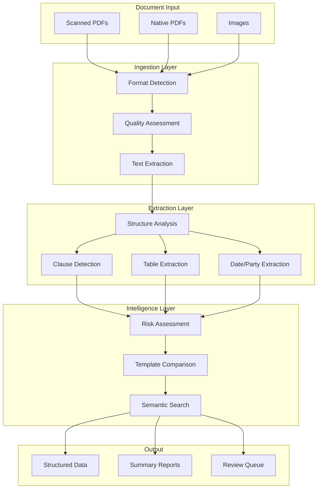

> **Note**: This is an illustrative implementation guide, not a case study of a real deployment. This is not legal advice. Actual results will vary based on your specific implementation.
{: .prompt-info }

# Building a Legal Document Analysis System with NeuroLink

## Overview

Legal document processing presents unique challenges for AI systems: complex layouts, domain-specific terminology, and the need for high accuracy when extracting contractual obligations. This guide explores how NeuroLink's multimodal capabilities can be applied to legal document analysis, with practical implementation patterns you can adapt for your own projects.

> **Note**: This guide presents hypothetical implementation patterns. Actual results will vary based on document quality, model selection, prompt engineering, and validation processes. Always verify AI-extracted information against source documents for legal and compliance purposes.

## The Challenge: Legal Document Complexity

### Industry Context

Legal documents present several challenges that make automated processing difficult:

- **Format variability**: Contracts arrive as scanned PDFs, native digital documents, images, and mixed formats
- **Complex layouts**: Multi-column text, tables, headers, footers, and inline exhibits
- **Domain-specific language**: Legal terminology varies by jurisdiction and practice area
- **High accuracy requirements**: Errors in contract analysis can have significant legal and financial consequences

Traditional rule-based extraction systems struggle with these challenges because legal documents don't follow consistent structural patterns.

### Common Pain Points

**Document Format Handling**

Law firms receive contracts in countless formats. A robust system needs to handle:
- Scanned PDFs (often with varying quality)
- Native digital PDFs with selectable text
- Photographed documents
- Documents with mixed page orientations

**Table and Amendment Processing**

Contracts frequently include complex tables for payment schedules, service levels, and performance metrics. Amendments may modify these tables in subtle ways, requiring careful tracking of changes across document versions.

**Multi-Language Support**

International practices require processing documents in multiple languages while understanding jurisdiction-specific legal concepts.

## Solution Architecture with NeuroLink



NeuroLink provides several capabilities well-suited for legal document processing:

**Unified API for Multiple Providers**

Access vision-capable models from different providers through a single interface, allowing you to choose the best model for each task or implement fallback strategies.

**Multimodal Processing**

Modern LLMs with vision capabilities can process document images directly, understanding both textual content and visual layout in context.

**Structured Output**

NeuroLink's response handling makes it straightforward to parse extracted information into structured formats suitable for downstream processing.

## Implementation Patterns

### Basic Document Processing

Here's a foundational pattern for processing legal documents with NeuroLink:

```typescript
import { NeuroLink } from '@juspay/neurolink';

const client = new NeuroLink();

interface DocumentAnalysis {
  documentType: string;
  parties: string[];
  effectiveDate: string | null;
  keyTerms: string[];
  qualityIssues: string[];
}

async function analyzeDocument(
  documentBase64: string,
  mimeType: string
): Promise<DocumentAnalysis> {
  const response = await client.generate({
    provider: 'anthropic',
    model: 'claude-sonnet-4-5-20250929',
    input: {
      text: `Analyze this legal document and extract the following information:

1. Document type (contract, amendment, exhibit, etc.)
2. Parties involved (names of all signatories/entities)
3. Effective date (if stated)
4. Key terms or provisions
5. Any quality issues (illegible sections, missing pages, etc.)

Respond in JSON format with this structure:
{
  "documentType": "string",
  "parties": ["string"],
  "effectiveDate": "string or null",
  "keyTerms": ["string"],
  "qualityIssues": ["string"]
}`,
      images: [documentBase64],
    },
  });

  // Parse the structured response
  const content = response.content;
  try {
    const parsed = JSON.parse(content);
    return parsed;
  } catch (error) {
    console.error('Failed to parse AI response as JSON:', content);
    throw new Error(`Failed to parse AI response as JSON: ${error instanceof Error ? error.message : 'Unknown error'}`);
  }
}
```

### Clause Extraction Pattern

For extracting specific clause types, use targeted prompts with clear categorization:

```typescript
import { NeuroLink } from '@juspay/neurolink';

const client = new NeuroLink();

interface ExtractedClause {
  type: string;
  text: string;
  page: number;
  section: string;
}

interface ClauseExtractionResult {
  clauses: ExtractedClause[];
  crossReferences: Array<{
    from: string;
    to: string;
    relationship: string;
  }>;
}

const CLAUSE_TYPES = [
  'indemnification',
  'limitation_of_liability',
  'termination',
  'confidentiality',
  'governing_law',
  'dispute_resolution',
  'payment_terms',
  'intellectual_property',
];

async function extractClauses(
  documentPages: Array<{ base64: string; mimeType: string; pageNumber: number }>
): Promise<ClauseExtractionResult> {
  const allClauses: ExtractedClause[] = [];
  const crossReferences: ClauseExtractionResult['crossReferences'] = [];

  // Process each page
  for (const page of documentPages) {
    const response = await client.generate({
      provider: 'anthropic',
      model: 'claude-sonnet-4-5-20250929',
      input: {
        text: `Extract any clauses from this contract page that fall into these categories:
${CLAUSE_TYPES.map((t) => `- ${t}`).join('\n')}

For each clause found, provide:
- type: The category from the list above
- text: The relevant text (summarized if very long)
- section: The section header or number if visible

Also identify any cross-references to other sections.

Respond in JSON format:
{
  "clauses": [{"type": "string", "text": "string", "section": "string"}],
  "crossReferences": [{"from": "string", "to": "string", "relationship": "string"}]
}

If no relevant clauses are found on this page, return empty arrays.`,
        images: [page.base64],
      },
    });

    const content = response.content;
    let pageResult;
    try {
      pageResult = JSON.parse(content);
    } catch (error) {
      console.error(`Failed to parse JSON for page ${page.pageNumber}:`, {
        error: error instanceof Error ? error.message : 'Unknown error',
        content: content.substring(0, 200) // Log first 200 chars for debugging
      });
      continue; // Skip this page and continue with next
    }

    // Add page numbers to extracted clauses
    for (const clause of pageResult.clauses) {
      allClauses.push({
        ...clause,
        page: page.pageNumber,
      });
    }
    crossReferences.push(...pageResult.crossReferences);
  }

  return { clauses: allClauses, crossReferences };
}
```

### Table Extraction Pattern

Tables in contracts often contain critical information. Here's a pattern for structured table extraction:

```typescript
import { NeuroLink } from '@juspay/neurolink';

const client = new NeuroLink();

interface ExtractedTable {
  title: string;
  headers: string[];
  rows: string[][];
  context: string;
}

async function extractTables(
  pageBase64: string,
  mimeType: string
): Promise<ExtractedTable[]> {
  const response = await client.generate({
    provider: 'anthropic',
    model: 'claude-sonnet-4-5-20250929',
    input: {
      text: `Extract all tables from this document page.

For each table, provide:
- title: The table title or caption (if any)
- headers: Column headers
- rows: Data rows (each row as an array of cell values)
- context: Brief description of what this table represents

Respond in JSON format:
{
  "tables": [
    {
      "title": "string",
      "headers": ["string"],
      "rows": [["string"]],
      "context": "string"
    }
  ]
}

If no tables are found, return {"tables": []}.`,
      images: [pageBase64],
    },
  });

  const content = response.content;
  try {
    const result = JSON.parse(content);
    return result.tables || [];
  } catch (error) {
    console.error('Failed to parse table extraction result:', {
      error: error instanceof Error ? error.message : 'Unknown error',
      content: content.substring(0, 300) // Log first 300 chars for debugging
    });
    return []; // Return empty array on parse failure
  }
}
```

### Obligation Extraction Pattern

Extracting specific obligations with deadlines and responsible parties:

```typescript
import { NeuroLink } from '@juspay/neurolink';

const client = new NeuroLink();

interface Obligation {
  responsibleParty: string;
  action: string;
  deadline: string | null;
  conditions: string[];
  category: 'payment' | 'delivery' | 'notice' | 'reporting' | 'other';
}

async function extractObligations(
  documentText: string
): Promise<Obligation[]> {
  const response = await client.generate({
    provider: 'anthropic',
    model: 'claude-sonnet-4-5-20250929',
    input: {
      text: `Analyze this contract text and extract all obligations.

Contract text:
${documentText}

For each obligation, identify:
- responsibleParty: Who must perform the action
- action: What must be done
- deadline: When it must be done (null if not specified)
- conditions: Any conditions that trigger or modify the obligation
- category: One of: payment, delivery, notice, reporting, other

Respond in JSON format:
{
  "obligations": [
    {
      "responsibleParty": "string",
      "action": "string",
      "deadline": "string or null",
      "conditions": ["string"],
      "category": "string"
    }
  ]
}`,
    },
  });

  const content = response.content;
  try {
    const result = JSON.parse(content);
    return result.obligations || [];
  } catch (error) {
    console.error('Failed to parse obligations from AI response:', {
      error: error instanceof Error ? error.message : 'Unknown error',
      content: content.substring(0, 300)
    });
    throw new Error(`Failed to parse obligations from AI response: ${error instanceof Error ? error.message : 'Unknown error'}`);
  }
}
```

### Multi-Provider Fallback Pattern

For production systems, implement fallback across providers:

```typescript
import { NeuroLink } from '@juspay/neurolink';

const client = new NeuroLink();

const VISION_MODELS = [
  { provider: 'anthropic', model: 'claude-sonnet-4-5-20250929' },
  { provider: 'openai', model: 'gpt-4o' },
  { provider: 'google', model: 'gemini-1.5-pro' },
];

async function analyzeWithFallback(
  documentBase64: string,
  mimeType: string,
  prompt: string
): Promise<string> {
  let lastError: Error | null = null;

  for (const { provider, model } of VISION_MODELS) {
    try {
      const response = await client.generate({
        provider,
        model,
        input: {
          text: prompt,
          images: [documentBase64],
        },
      });

      return response.content;
    } catch (error) {
      lastError = error as Error;
      console.warn(`Model ${provider}/${model} failed, trying next...`);
      continue;
    }
  }

  throw new Error(
    `All models failed. Last error: ${lastError?.message}`
  );
}
```

## Implementation Considerations

### Document Quality Assessment

Before processing, assess document quality to route low-quality documents for manual review:

```typescript
import { NeuroLink } from '@juspay/neurolink';

const client = new NeuroLink();

interface QualityAssessment {
  overallScore: number; // 0-1
  issues: string[];
  recommendation: 'process' | 'review' | 'reject';
}

async function assessQuality(
  documentBase64: string,
  mimeType: string
): Promise<QualityAssessment> {
  const response = await client.generate({
    provider: 'anthropic',
    model: 'claude-sonnet-4-5-20250929',
    input: {
      text: `Assess the quality of this document for automated processing.

Check for:
- Text legibility (blur, low resolution, fading)
- Page completeness (cut-off text, missing sections)
- Scan quality (skew, shadows, artifacts)
- Document integrity (all pages present, correct order)

Provide a quality score from 0 to 1 and list any issues.

Respond in JSON:
{
  "overallScore": 0.0-1.0,
  "issues": ["string"],
  "recommendation": "process" | "review" | "reject"
}`,
      images: [documentBase64],
    },
  });

  const content = response.content;
  try {
    const assessment = JSON.parse(content);
    return assessment;
  } catch (error) {
    console.error('Failed to parse quality assessment JSON:', {
      error: error instanceof Error ? error.message : 'Unknown error',
      content: content.substring(0, 300)
    });
    throw new Error(`Failed to parse quality assessment: ${error instanceof Error ? error.message : 'Unknown error'}`);
  }
}
```

### Batch Processing

For large document sets, implement batch processing with progress tracking:

```typescript
import { NeuroLink } from '@juspay/neurolink';

const client = new NeuroLink();

interface BatchResult {
  documentId: string;
  status: 'success' | 'error' | 'review';
  result?: DocumentAnalysis;
  error?: string;
}

async function processBatch(
  documents: Array<{ id: string; base64: string; mimeType: string }>,
  onProgress?: (completed: number, total: number) => void
): Promise<BatchResult[]> {
  const results: BatchResult[] = [];

  for (let i = 0; i < documents.length; i++) {
    const doc = documents[i];

    try {
      // First assess quality
      const quality = await assessQuality(doc.base64, doc.mimeType);

      if (quality.recommendation === 'reject') {
        results.push({
          documentId: doc.id,
          status: 'review',
          error: `Quality issues: ${quality.issues.join(', ')}`,
        });
      } else {
        const analysis = await analyzeDocument(doc.base64, doc.mimeType);
        results.push({
          documentId: doc.id,
          status: quality.recommendation === 'review' ? 'review' : 'success',
          result: analysis,
        });
      }
    } catch (error) {
      results.push({
        documentId: doc.id,
        status: 'error',
        error: (error as Error).message,
      });
    }

    onProgress?.(i + 1, documents.length);
  }

  return results;
}
```

## Critical Legal AI Limitations

> **🚨 CRITICAL - HALLUCINATION RISK**: AI models can and will generate plausible but completely incorrect legal information. This is not a limitation that can be "fixed" with better prompts:
>
> **Fabricated Content Risks:**
> - **False case citations**: Models invent realistic-sounding cases with made-up citations (e.g., "Smith v. Jones, 123 F.2d 456") that do not exist
> - **Invented statutes**: Models cite non-existent laws, regulations, or compliance standards as if they were real
> - **Phantom legal precedents**: Models cite legal principles and authorities that were never established
> - **Incorrect clause interpretations**: Legal language in contracts can be systematically misinterpreted
> - **Missing critical clauses**: AI may overlook important provisions, especially in non-standard contract formats
> - **Jurisdiction errors**: Models may apply wrong jurisdiction's law or mix jurisdictional requirements
>
> **MANDATORY: Human Attorney Verification Required**
> - ALL extracted case citations MUST be verified against official legal databases (Google Scholar, LexisNexis, Westlaw)
> - ALL statute/regulation references MUST be confirmed in primary legal sources
> - ALL contract clause interpretations MUST be reviewed by qualified attorneys
> - ALL obligations extracted MUST be manually verified against original documents
> - Do NOT use AI-extracted legal information in litigation, compliance documentation, or legal advice without attorney sign-off
{: .prompt-danger }

### Required Verification Processes

For legal document analysis systems, implement mandatory human review:

1. **Attorney sign-off required** for all AI-extracted obligations and clauses
2. **Citation verification** - Always verify case law and statute citations against primary sources
3. **Cross-reference checking** - Verify all internal document references are accurate
4. **Jurisdiction validation** - Confirm legal interpretations are valid for the relevant jurisdiction
5. **Version control** - Track which version of a document was analyzed and when

## Best Practices

### Always Verify Extracted Information

AI-extracted information should be treated as a first pass that requires human verification for legal and compliance purposes. Implement review workflows for:

- High-value contracts
- Documents with low confidence scores
- Unusual document formats
- Extracted obligations with significant business impact

### Use Confidence Thresholds

Request confidence levels in your prompts and route low-confidence extractions for review:

```typescript
// Add to your extraction prompts:
const promptSuffix = `
For each extracted item, include a confidence level:
- high: Clearly stated in the document
- medium: Inferred from context
- low: Uncertain, requires verification`;
```

### Monitor and Iterate

Track extraction quality over time:

- Log extraction results alongside human corrections
- Identify patterns in extraction errors
- Refine prompts based on common failure modes
- Consider fine-tuning or few-shot examples for domain-specific terminology

### Handle Sensitive Information

Legal documents often contain sensitive information:

- Implement appropriate data retention policies
- Consider on-premises or private cloud deployment for sensitive documents
- Log access to extracted information
- Redact or mask sensitive data in logs and error reports

## Potential Applications

This architecture can support various legal tech applications:

**Contract Review Acceleration**

Pre-extract key terms and flag unusual clauses for attorney review, reducing time spent on routine document analysis.

**Due Diligence Support**

Process large document sets during M&A or audit activities, organizing findings by category and risk level.

**Obligation Tracking**

Extract deadlines and requirements from executed contracts to populate obligation management systems.

**Clause Library Building**

Build searchable repositories of clause language across contract portfolios for negotiation reference.

**Risk Identification**

Flag contracts with unusual or missing standard clauses for priority review.

## Conclusion

NeuroLink's unified API and multimodal capabilities provide a solid foundation for building legal document analysis systems. The patterns in this guide demonstrate how to structure extraction pipelines, handle various document formats, and implement production-ready workflows.

Key takeaways:

- **Use structured prompts** to extract specific information in parseable formats
- **Implement quality assessment** to route problematic documents for review
- **Build fallback strategies** across providers for production reliability
- **Always include human verification** for legally significant extractions
- **Monitor and iterate** on extraction quality over time

The legal domain demands high accuracy, but the combination of modern LLMs with appropriate human oversight can significantly accelerate document processing workflows while maintaining the verification standards the industry requires.

---

*For more implementation patterns and examples, explore our other guides on [structured output](/posts/structured-output-json/), [error handling](/posts/error-handling-patterns/), and [batch processing](/posts/batch-processing-guide/).*
