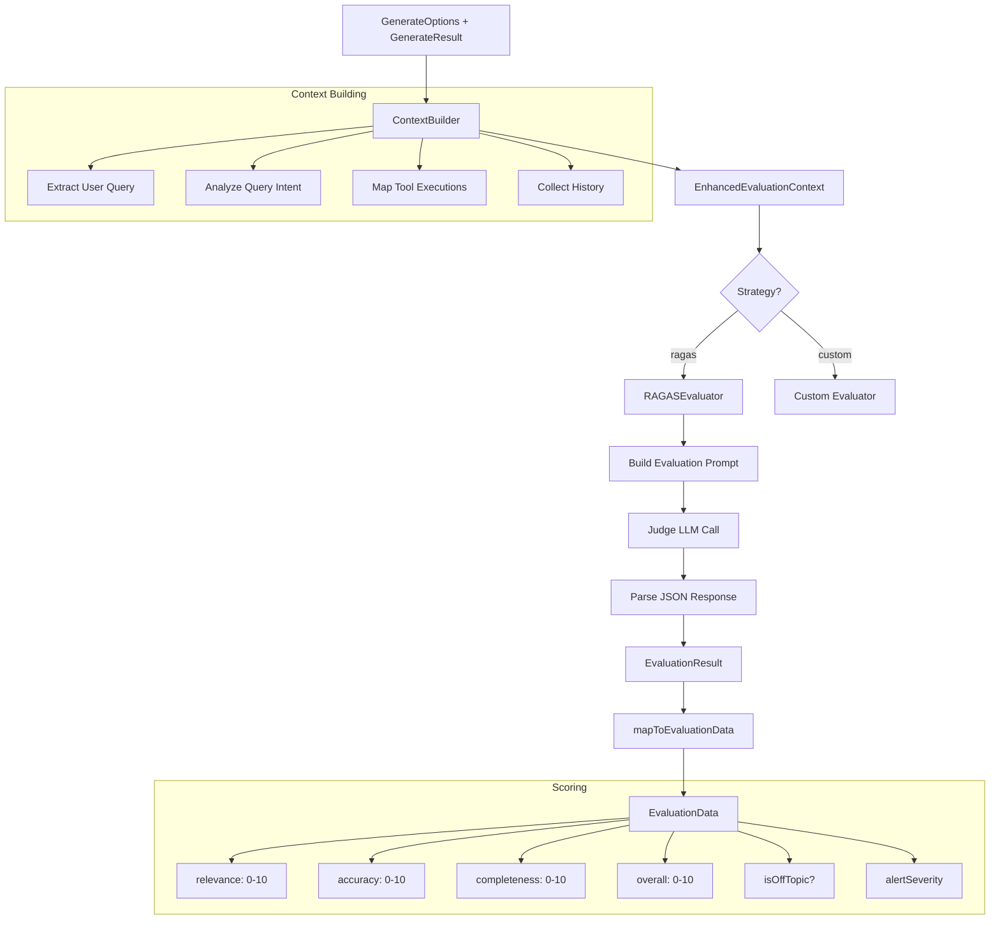

We designed NeuroLink's evaluation system to answer a deceptively hard question: how good is an LLM response? This deep dive examines how we adapted RAGAS-style metrics for production use, the trade-offs between automated scoring and human judgment, and the architecture that enables domain-specific quality assessment across conversation, translation, summarization, and code generation tasks.

NeuroLink implements a RAGAS-inspired evaluation system using the "LLM-as-judge" pattern. A separate judge model evaluates every AI response across three dimensions -- relevance, accuracy, and completeness -- and produces a structured score with reasoning and improvement suggestions. The evaluation runs either as middleware (automatic quality check on every response) or as a standalone call (for batch evaluation, A/B testing, and offline analysis).

This deep dive covers the full evaluation architecture: how context is built, how the judge scores responses, how to configure thresholds, and how to integrate evaluation into your production pipeline.

## Architecture: The Evaluation Pipeline

The evaluation system has four main components that work in sequence:



1. **`ContextBuilder`** (contextBuilder.ts): Assembles rich context from the request and response, including query analysis, tool executions, conversation history, and performance data.
2. **`RAGASEvaluator`** (ragasEvaluator.ts): Builds a detailed evaluation prompt and sends it to a judge LLM. Parses the structured JSON response.
3. **`mapToEvaluationData()`** (scoring.ts): Maps raw evaluation results to the final `EvaluationData` structure with derived fields like `isOffTopic` and `alertSeverity`.
4. **`Evaluator`** (index.ts): Orchestrates the full pipeline and supports both RAGAS and custom evaluation strategies.

## The RAGAS Evaluation Approach

RAGAS (Retrieval Augmented Generation Assessment) is an industry-standard framework for evaluating AI system quality. NeuroLink adapts RAGAS principles for general AI evaluation -- not just RAG applications. The evaluation applies to any AI response, whether it comes from a simple prompt, a tool-calling agent, or a multi-step reasoning pipeline.

### Three Core Metrics

Every evaluation produces three scores on a 0-10 scale:

**Relevance (0-10):** Does the response address the user's actual query? A response about Python when the user asked about TypeScript scores low on relevance, even if the Python information is accurate. The judge evaluates whether the response is on-topic and directly useful.

**Accuracy (0-10):** Are the facts in the response correct? This is the hardest dimension to evaluate because the judge model itself might have incorrect knowledge. The evaluation prompt instructs the judge to flag uncertain claims rather than accepting them as accurate.

**Completeness (0-10):** Does the response fully answer the question? A response that correctly addresses only half of a multi-part question scores high on accuracy but low on completeness. The judge evaluates whether all aspects of the query are addressed.

**Overall score:** A weighted combination of the three metrics, providing a single number for threshold comparisons and trend tracking.

### The Judge Model

The "judge" is a separate LLM call that evaluates the response. By default, NeuroLink uses `gemini-1.5-flash` via Vertex AI as the judge because it is fast, cheap, and capable enough for scoring tasks. The judge model is configurable via the `NEUROLINK_RAGAS_EVALUATION_MODEL` environment variable or directly in the evaluation config.

The default threshold is 7/10, configurable via `NEUROLINK_EVALUATION_THRESHOLD`. Responses scoring below this threshold are flagged as potentially low quality.

> **Note:** The judge model should be different from the model that generated the response. Using the same model to evaluate its own output creates a bias where it rates its own responses more favorably.
{: .prompt-info }

## Context Building: What the Judge Sees

The quality of evaluation depends on the context provided to the judge. The `ContextBuilder` assembles an `EnhancedEvaluationContext` that gives the judge everything it needs to make an informed assessment:

```typescript
// The ContextBuilder creates this rich context automatically
const context: EnhancedEvaluationContext = {
  userQuery: "What is machine learning?",
  queryAnalysis: {
    type: "question",          // question, command, greeting, etc.
    complexity: "medium",      // low, medium, high
    shouldHaveUsedTools: false, // Did the query warrant tool use?
  },
  aiResponse: "Machine learning is a subset of AI...",
  provider: "google-ai",
  model: "gemini-2.5-pro",
  generationParams: { temperature: 0.7, maxTokens: 1000 },
  toolExecutions: [],           // Tools called during generation
  conversationHistory: [...],   // Full conversation context
  responseTime: 1234,          // Performance metrics
  tokenUsage: { input: 50, output: 200, total: 250 },
  attemptNumber: 1,            // Which retry attempt this is
};
```

The context includes several fields that are critical for accurate evaluation:

- **Query analysis**: The builder automatically classifies the query type and complexity. A simple greeting ("hi") should not be evaluated the same way as a complex technical question.
- **Tool executions**: If the AI called tools, the judge can evaluate whether the right tools were used and whether the tool results were correctly incorporated into the response.
- **Conversation history**: For multi-turn conversations, the judge needs prior context to evaluate whether the response is consistent with the conversation so far.
- **Attempt number**: When evaluation triggers a retry, the judge knows this is a second (or third) attempt and can evaluate accordingly.
- **`shouldHaveUsedTools`**: If the query clearly required tool use (e.g., "look up the current weather") but no tools were called, the judge can flag this as an accuracy issue.

## Using Evaluation

NeuroLink supports two evaluation modes: automatic middleware (for production pipelines) and standalone evaluation (for testing and analysis).

### Auto-Evaluation Middleware

Enable auto-evaluation via the middleware system for automatic quality checks on every response:

```typescript
import { NeuroLink, MiddlewareFactory } from '@juspay/neurolink';

const neurolink = new NeuroLink();

// Configure auto-evaluation through MiddlewareFactory
const middleware = new MiddlewareFactory({
  middlewareConfig: {
    autoEvaluation: {
      enabled: true,
      config: {
        threshold: 7,
        maxRetries: 2,
        blocking: true,
        evaluationModel: "gemini-2.5-flash",
        onEvaluationComplete: (evaluation) => {
          console.log(`Score: ${evaluation.overall}/10`);
          if (evaluation.alertSeverity === "high") {
            alertOps(evaluation);
          }
        },
      },
    },
  },
});

const result = await neurolink.generate({
  input: { text: "Explain quantum computing" },
  provider: "google-ai",
});
```

The middleware configuration options:

| Option | Type | Description |
|---|---|---|
| `threshold` | number | Minimum acceptable score (0-10) |
| `maxRetries` | number | Retry attempts if score is below threshold |
| `blocking` | boolean | Whether to block the response until evaluation completes |
| `evaluationModel` | string | Model to use as judge |
| `onEvaluationComplete` | function | Callback with evaluation results |

When `blocking: true`, the middleware evaluates the response before returning it to the caller. If the score is below threshold and retries are configured, it regenerates the response and evaluates again, up to `maxRetries` times. This guarantees that every response the user sees meets your quality bar.

When `blocking: false`, the middleware evaluates asynchronously. The response returns immediately, and the evaluation happens in the background. The `onEvaluationComplete` callback fires when scoring is done. Use this mode when latency is more important than quality guarantees.

### Standalone Evaluation

For batch evaluation, A/B testing, or offline analysis, use the `Evaluator` class directly:

```typescript
import { Evaluator } from "@juspay/neurolink/evaluation";

const evaluator = new Evaluator({
  evaluationModel: "gemini-2.5-flash",
  provider: "vertex",
  threshold: 7,
  evaluationStrategy: "ragas",
});

const evaluation = await evaluator.evaluate(
  callOptions,      // LanguageModelV1CallOptions
  generateResult,   // GenerateResult
  7,                // threshold
  {
    offTopicThreshold: 5,
    highSeverityThreshold: 4,
  },
);

console.log(`Relevance: ${evaluation.relevance}/10`);
console.log(`Accuracy: ${evaluation.accuracy}/10`);
console.log(`Completeness: ${evaluation.completeness}/10`);
console.log(`Overall: ${evaluation.overall}/10`);
console.log(`Off-topic: ${evaluation.isOffTopic}`);
console.log(`Alert: ${evaluation.alertSeverity}`);
```

Standalone evaluation is ideal for:

- **A/B testing models**: Run the same prompts through different models, then evaluate all responses to compare quality
- **Regression testing**: After changing system prompts or model versions, evaluate a test suite to ensure quality has not degraded
- **Dataset creation**: Evaluate large batches of responses to create labeled training data
- **Monitoring dashboards**: Periodically evaluate a sample of production responses to track quality trends

## The EvaluationData Output

Every evaluation produces a comprehensive `EvaluationData` object with scores, derived fields, and improvement suggestions:

| Field | Type | Description |
|---|---|---|
| `relevance` | number (0-10) | How well the response addresses the query |
| `accuracy` | number (0-10) | Factual correctness of the response |
| `completeness` | number (0-10) | How thoroughly the query is answered |
| `overall` | number (0-10) | Combined final score |
| `isOffTopic` | boolean | True if score < offTopicThreshold (default: 5) |
| `alertSeverity` | "none" / "medium" / "high" | Alert level based on score vs thresholds |
| `reasoning` | string | Judge's explanation of the score |
| `suggestedImprovements` | string | Specific suggestions for better responses |
| `evaluationModel` | string | Which model served as judge |
| `evaluationTime` | number | Evaluation duration in ms |
| `responseContent` | string | The response that was evaluated |
| `queryContent` | string | The original query |

### Alert Severity Logic

The `alertSeverity` field is derived from the overall score and configured thresholds:

- **"none"**: Score >= threshold. The response passes quality checks.
- **"medium"**: Score < threshold but >= highSeverityThreshold. The response is below standard but not alarmingly bad.
- **"high"**: Score < highSeverityThreshold. The response is significantly below acceptable quality.

```typescript
// Alert severity derivation logic
if (overall >= threshold) {
  alertSeverity = "none";      // Passing
} else if (overall < highSeverityThreshold) {
  alertSeverity = "high";      // Critically bad
} else {
  alertSeverity = "medium";    // Below standard
}
```

Wire `alertSeverity: "high"` to your alerting system (PagerDuty, Slack, etc.) to catch critically bad responses in real time:

```typescript
onEvaluationComplete: (evaluation) => {
  if (evaluation.alertSeverity === "high") {
    slack.postMessage({
      channel: "#ai-alerts",
      text: `High-severity response detected!\n` +
            `Score: ${evaluation.overall}/10\n` +
            `Query: ${evaluation.queryContent}\n` +
            `Reasoning: ${evaluation.reasoning}`,
    });
  }
}
```

> **Note:** The `isOffTopic` flag uses a separate threshold (default: 5) from the main quality threshold. A response can fail the quality check (score 6 vs threshold 7) without being flagged as off-topic (6 > 5).
{: .prompt-info }

## Custom Evaluation Strategies

While the RAGAS strategy covers most use cases, some applications need domain-specific evaluation criteria. Set `evaluationStrategy: "custom"` and provide your own evaluator function:

```typescript
const evaluator = new Evaluator({
  evaluationStrategy: "custom",
  customEvaluator: async (options, result) => {
    // Your custom evaluation logic
    const evalContext = buildMyContext(options, result);
    const evaluationResult = await myCustomScoring(evalContext);
    return { evaluationResult, evalContext };
  },
});
```

Custom evaluators receive the full `LanguageModelV1CallOptions` and `GenerateResult`, giving you access to the prompt, response, tool calls, and all metadata. Your custom evaluator must return the standard `{ evaluationResult, evalContext }` format so it integrates with the rest of the evaluation pipeline.

Common custom evaluation scenarios:

- **Code quality evaluation**: Score generated code on correctness, style, and security
- **Medical accuracy**: Evaluate medical AI responses against clinical guidelines
- **Legal compliance**: Check whether AI responses comply with regulatory requirements
- **Brand voice**: Score responses for consistency with brand tone and messaging guidelines

You can also provide a custom `promptGenerator` function to modify the evaluation prompt while still using the RAGAS scoring framework:

```typescript
const evaluator = new Evaluator({
  evaluationStrategy: "ragas",
  promptGenerator: (context) => {
    return `Evaluate this customer support response.
    Pay special attention to empathy and actionability.
    Customer query: ${context.userQuery}
    Agent response: ${context.aiResponse}
    Score on relevance, accuracy, and completeness (0-10 each).`;
  },
});
```

## Evaluation-Driven Retry Logic

One of the most powerful patterns is using evaluation to drive automatic retries. When a response scores below threshold, the system regenerates with the evaluation feedback incorporated:

```typescript
async function generateWithQualityGuarantee(
  neurolink: NeuroLink,
  prompt: string,
  threshold: number = 7,
  maxAttempts: number = 3,
) {
  let lastResult = null;
  let lastEvaluation = null;

  for (let attempt = 1; attempt <= maxAttempts; attempt++) {
    const improvementHint = lastEvaluation
      ? `\n\nPrevious attempt scored ${lastEvaluation.overall}/10. ` +
        `Improvements needed: ${lastEvaluation.suggestedImprovements}`
      : "";

    const result = await neurolink.generate({
      input: { text: prompt + improvementHint },
      provider: "vertex",
      model: "gemini-2.5-pro",
    });

    const evaluation = await evaluator.evaluate(
      { prompt },
      result,
      threshold,
    );

    if (evaluation.overall >= threshold) {
      return { result, evaluation, attempts: attempt };
    }

    lastResult = result;
    lastEvaluation = evaluation;
  }

  // Return best attempt even if threshold not met
  return { result: lastResult, evaluation: lastEvaluation, attempts: maxAttempts };
}
```

This pattern incorporates the judge's `suggestedImprovements` into the retry prompt, guiding the model toward a better response. Each attempt builds on the previous evaluation's feedback, creating a self-improving generation loop.

> **Note:** Each retry adds latency (generation time + evaluation time) and cost (two LLM calls per retry). Use `maxAttempts: 2` for latency-sensitive applications and `maxAttempts: 3` for quality-critical applications.
{: .prompt-info }

## Best Practices

### Choose the Right Judge Model

The judge model should be fast, capable, and cheap. Gemini Flash is the default for good reason: it scores responses accurately at a fraction of the cost and latency of premium models. Avoid using the same model family that generated the response -- cross-family evaluation reduces bias.

### Set Thresholds Based on Use Case

| Use Case | Recommended Threshold | Rationale |
|---|---|---|
| Customer support | 7 | Balance quality with response speed |
| Medical/legal AI | 9 | Accuracy is critical, errors have consequences |
| Internal tools | 6 | Lower stakes, speed matters more |
| Content generation | 7 | Quality matters but creativity has subjective value |
| Code generation | 8 | Incorrect code causes bugs in production |

### Monitor Trends, Not Individual Scores

Individual evaluation scores have variance -- the judge model is not perfectly consistent. Focus on trends: average score over time, percentage of responses above threshold, and distribution of alert severities. A dropping average signals systematic issues; occasional low scores are normal.

### Use Off-Topic Detection

The `isOffTopic` flag catches a specific failure mode: the AI generates a well-written response that has nothing to do with the query. This happens more often than you might expect, especially with ambiguous queries or when conversation memory introduces confusing context. Monitor off-topic rates and investigate spikes.

### Log Everything

Evaluation data is a goldmine for improving your AI system. Log every evaluation result with the associated query, response, provider, model, and generation parameters. This data enables:

- Root cause analysis when quality drops
- A/B testing of prompts, models, and system configurations
- Training data curation for fine-tuning
- Cost-quality tradeoff analysis

## Conclusion

The architecture decisions we have described represent trade-offs that worked for our scale and constraints. The key engineering insights to take away: start with the simplest design that handles your current load, instrument everything so you can identify bottlenecks before they become outages, and resist premature abstraction until you have at least three concrete use cases demanding it. The implementation details will differ for your system, but the underlying constraints -- latency budgets, failure domains, resource contention -- are universal.

---

**Related posts:**

- [Testing AI Applications: A Complete Guide](/posts/testing-ai-applications/)
- [Performance Benchmarking Guide for NeuroLink](/posts/performance-benchmarks/)
- [Context Compaction: Managing Long Conversations Without Losing Information](/posts/context-compaction/)
