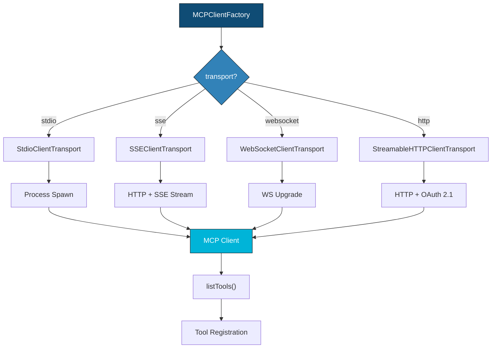
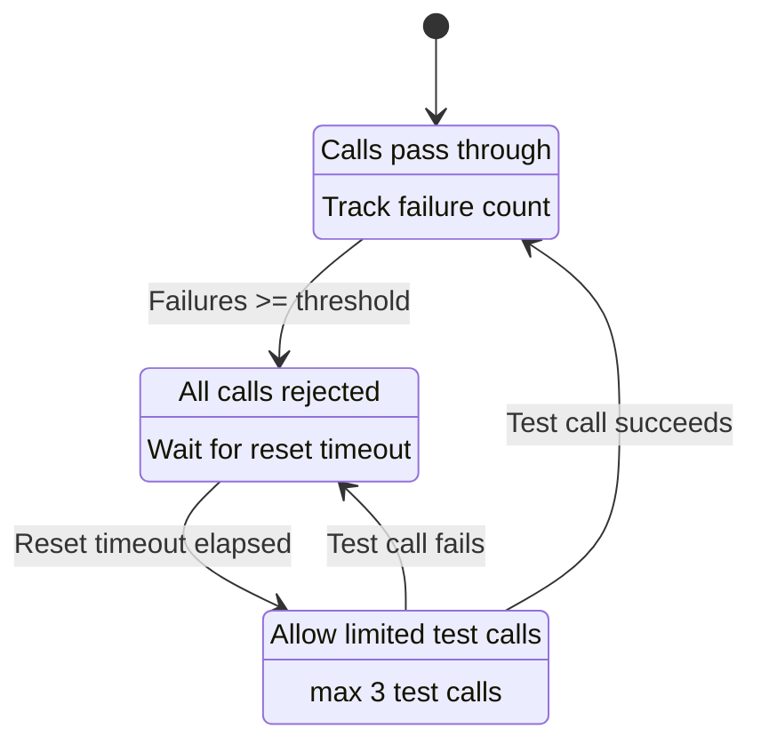
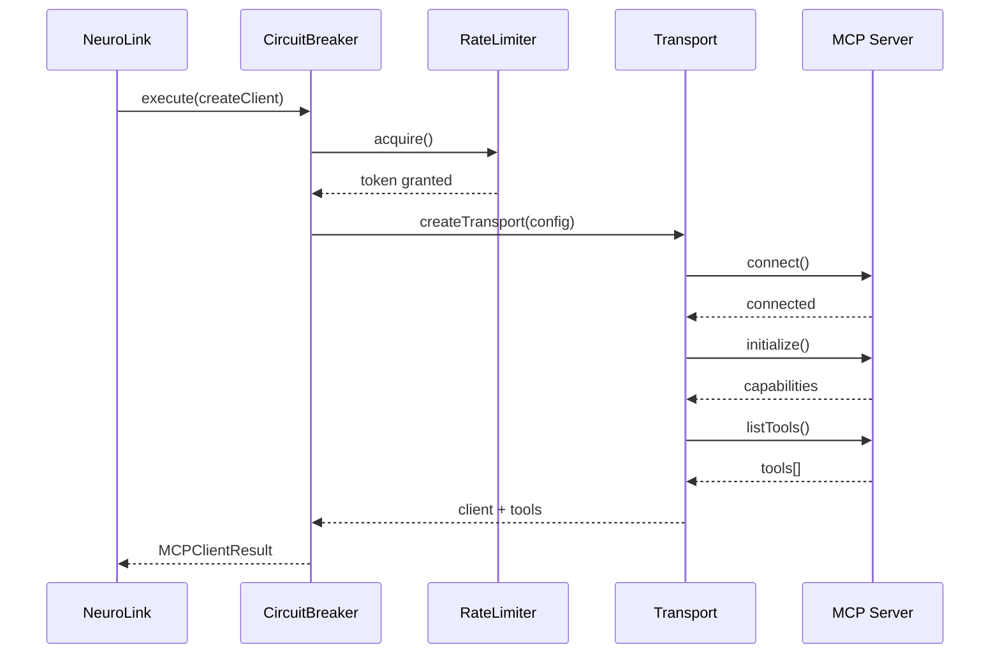

We designed NeuroLink's MCP integration to support four transport protocols -- stdio, HTTP SSE, WebSocket, and in-process -- through a single unified interface. This deep dive examines how we abstracted transport-level concerns away from tool execution, the connection lifecycle management that prevents resource leaks, and the discovery protocol that enables dynamic tool registration at runtime.

Model Context Protocol (MCP) is the open standard for connecting AI models to external tools. NeuroLink integrates MCP so that any MCP server can be used as a tool across all 13 supported providers. But building a reliable MCP client that works across four transport protocols -- with OAuth, circuit breakers, and rate limiting -- was harder than it looked.

This post traces the evolution from stdio-only MCP support to a production-grade multi-transport system. We will cover the bugs that taught us about process lifecycle, the security model we chose, and the resilience patterns that keep things running when servers crash.

---

## MCP 101: What the Protocol Actually Requires

Before diving into our implementation, here is what the MCP specification demands from a client.

**Core concepts.** A Client (NeuroLink) connects to a Server (tools provider). The server declares its tools. The client discovers them, registers them with the AI provider, and executes them when the model requests a tool call.

**The handshake.** The client connects via a transport, calls `initialize`, the server responds with capabilities, the client calls `listTools`, and the tools are registered. Miss any step and the tools exist but cannot be called -- exactly the bug our customer hit.

**Transport layer.** The MCP spec defines multiple transports. The protocol itself is transport-agnostic. The same JSON-RPC messages flow over stdio pipes, SSE streams, WebSocket frames, or HTTP requests. The transport is just the pipe.

**Why it matters for NeuroLink.** Users have MCP servers running as local processes (stdio), cloud services (HTTP), and everything in between. NeuroLink must support them all with a unified interface.

---


## Failed Attempt #1: Stdio Only, No Lifecycle Management

Our first implementation was straightforward: spawn the MCP server process, create a `StdioClientTransport`, connect, list tools, done.

It worked in demos. It failed in production.

### What broke

**Zombie processes.** If NeuroLink crashed, the MCP server process was orphaned. No cleanup hook existed. Restarting NeuroLink would spawn a new server process while the old one continued running, consuming memory and holding file locks.

**No health monitoring.** If the server process died from an OOM kill, a crash, or a segfault, NeuroLink kept trying to call tools on a dead connection. Timeouts stacked up. Each failed tool call waited 30 seconds before timing out, and the model would often attempt multiple tool calls in sequence.

**Environment variable leakage.** The spawned process inherited all of NeuroLink's environment variables, including API keys for all 13 providers. A malicious MCP server could read `process.env` and exfiltrate credentials.

> **Note:** The environment variable leakage issue was particularly concerning for enterprise deployments where MCP servers might come from third-party vendors.
{: .prompt-info }

These failures led us to build the `ExternalServerManager` -- a proper lifecycle manager for MCP server processes.

---


## The ExternalServerManager

The `ExternalServerManager` (source: `src/lib/mcp/externalServerManager.ts`) became the foundation for all MCP server interactions.

### Lifecycle management

The manager provides three core methods for controlling server lifecycle:

- **`loadServer(config)`** spawns the process, creates the client, performs the handshake, and discovers tools
- **`unloadServer(serverId)`** performs graceful shutdown: close the client, close the transport, send SIGTERM, wait 5 seconds, then SIGKILL if still running
- **`unloadAllServers()`** is called on process exit to clean up all running servers

### Health monitoring

Periodic pings detect dead connections before tool execution fails. Instead of waiting for a 30-second timeout during an actual tool call, the health monitor catches dead servers within seconds and marks them as unavailable.

### Environment variable substitution

Instead of passing raw environment variables to spawned processes, the manager uses `substituteEnvVariables()` to replace `${VAR_NAME}` patterns in configuration with `process.env` values. Server configs use template syntax, keeping secrets out of the spawned process environment.

### HITL integration

Before executing sensitive tools, the manager checks with `HITLManager`. If the tool is listed in `dangerousActions` and the user rejects the confirmation prompt, the manager throws `HITLUserRejectedError` and the tool call is safely aborted.

### Event system

The manager emits lifecycle events via `EventEmitter`: `server:connected`, `server:disconnected`, `server:error`, and `tool:discovered`. These events power observability dashboards and alerting.

---

## Adding SSE Transport: Long-Lived Connections

### Why SSE

Cloud-hosted MCP servers need HTTP-based transport. You cannot spawn a remote process via stdio. SSE (Server-Sent Events) provides server-push capability for streaming tool results over a standard HTTP connection.

### Implementation

The `MCPClientFactory.createSSETransport()` method (source: `src/lib/mcp/mcpClientFactory.ts`) wraps `SSEClientTransport` from `@modelcontextprotocol/sdk/client/sse.js` with URL validation and error wrapping.

```typescript
// SSE transport for cloud-hosted MCP servers
const sseClient = await MCPClientFactory.createClient({
  id: 'cloud-tools',
  transport: 'sse',
  url: 'https://mcp.example.com/sse',
});
```

### What we learned

SSE connections can be dropped by proxies, load balancers, and CDNs with idle timeouts. AWS ALB drops idle connections after 60 seconds by default. Cloudflare's proxy has a 100-second timeout. We needed reconnection logic, which led us to the circuit breaker pattern that would become essential for all transports.

---

## Adding WebSocket Transport: The Bidirectional Problem

### Why WebSocket

Some MCP servers need to push notifications to the client -- tool updates, cancellations, progress reports. SSE is unidirectional (server to client only). WebSocket is bidirectional, enabling the server to send unsolicited messages.

### Implementation

The `MCPClientFactory.createWebSocketTransport()` method (source: `src/lib/mcp/mcpClientFactory.ts`) uses `WebSocketClientTransport` from `@modelcontextprotocol/sdk/client/websocket.js`. URLs must use the `ws://` or `wss://` scheme.

```typescript
// WebSocket transport for bidirectional communication
const wsClient = await MCPClientFactory.createClient({
  id: 'realtime-tools',
  transport: 'websocket',
  url: 'wss://mcp.example.com/ws',
});
```

> **Note:** The official MCP specification defines stdio and Streamable HTTP as standard transports. WebSocket support is available via the `@modelcontextprotocol/sdk` transport module but is not part of the specification.
{: .prompt-info }

### The chunking challenge

WebSocket frames have size limits. Large tool results -- a 50KB file read, for example -- must be chunked. The MCP SDK handles this at the protocol layer, but we had to ensure our serialization layer did not add overhead that would push frames over the limit.

---

## Adding HTTP/Streamable HTTP Transport and OAuth 2.1

### Why HTTP

The MCP specification evolved to support stateless HTTP transport for serverless deployments. `StreamableHTTPClientTransport` sends individual HTTP requests and receives streamed responses. This is ideal for serverless functions (AWS Lambda, Cloudflare Workers) where persistent connections are not practical.

### OAuth 2.1 with PKCE

Enterprise MCP servers require authentication. We implemented a full OAuth 2.1 flow with PKCE (Proof Key for Code Exchange):

- **`NeuroLinkOAuthProvider`** manages tokens, handles refresh, and generates PKCE challenges (source: `src/lib/mcp/auth/oauthClientProvider.ts`)
- **`InMemoryTokenStorage` and `FileTokenStorage`** provide pluggable token persistence
- **`createEnhancedFetch()`** wraps the native `fetch()` to inject Authorization headers and handle token refresh transparently

```typescript
// HTTP transport with OAuth 2.1 + PKCE
const httpClient = await MCPClientFactory.createClient({
  id: 'cloud-tools',
  transport: 'http',
  url: 'https://mcp.example.com/v1',
  auth: {
    type: 'oauth2',
    oauth: {
      clientId: '${MCP_CLIENT_ID}',
      clientSecret: '${MCP_CLIENT_SECRET}',
      tokenUrl: 'https://auth.example.com/oauth/token',
      authorizationUrl: 'https://auth.example.com/oauth/authorize',
      scope: 'tools:read tools:execute',
      usePKCE: true,
    },
  },
  retryConfig: { maxAttempts: 3, initialDelay: 1000, backoffMultiplier: 2 },
  rateLimiting: { requestsPerMinute: 60, maxBurst: 10, useTokenBucket: true },
});
```

> **Note:** PKCE (Proof Key for Code Exchange) prevents authorization code interception attacks. It is required by the OAuth 2.1 specification and enabled by default in NeuroLink (`usePKCE: true`).
{: .prompt-info }

### Rate limiting

The `HTTPRateLimiter` (source: `src/lib/mcp/httpRateLimiter.ts`) uses a token bucket algorithm to prevent overwhelming MCP servers. The `globalRateLimiterManager` creates per-server rate limiters with configurable `requestsPerMinute`, `maxBurst`, and `refillRate` parameters.

### Retry with exponential backoff

The `withHTTPRetry()` utility (source: `src/lib/mcp/httpRetryHandler.ts`) wraps operations with configurable max attempts, initial delay, and backoff multiplier. This prevents thundering herd problems when an MCP server recovers from an outage.

---

## The MCPClientFactory: Unifying 4 Transports

The `MCPClientFactory` (source: `src/lib/mcp/mcpClientFactory.ts`) is a static factory class that provides a single `createClient(config, timeout)` method. Internally, it delegates to transport-specific creation methods based on the `config.transport` field.

### The transport switch

```typescript
switch (config.transport) {
  case 'stdio': return this.createStdioTransport(config);
  case 'sse': return this.createSSETransport(config);
  case 'websocket': return this.createWebSocketTransport(config);
  case 'http': return this.createHTTPTransport(config);
}
```

This is the core abstraction. Every transport produces the same `MCP Client` object. The rest of the system does not know or care which transport is in use.



### Connection with timeout

The factory uses `Promise.race([client.connect(transport), timeout])` to prevent hanging on unresponsive servers. Without this, a single unresponsive MCP server could block the entire initialization sequence.

### Test connection

The `testConnection(config, timeout)` method creates a temporary client, verifies connectivity, then cleans up. The setup CLI uses this to validate MCP server configurations before saving them.

### Validation

`validateClientConfig(config)` checks required fields per transport type before attempting connection. Stdio requires `command`, SSE and HTTP require `url`, WebSocket requires a `ws://` or `wss://` URL.

---

## Circuit Breaker: When Servers Go Down

### The problem

When an MCP server crashes, every tool call fails with a timeout. Without protection, NeuroLink keeps attempting calls, wasting 30 seconds per call and degrading the user experience. The model might attempt five tool calls in sequence, resulting in 150 seconds of waiting for nothing.

### The solution

The circuit breaker pattern (source: `src/lib/mcp/mcpCircuitBreaker.ts`) implements three states:



- **Closed** (normal operation): Calls pass through to the MCP server. The breaker tracks failures.
- **Open** (protecting): All calls are immediately rejected with a circuit breaker error. No wasted timeouts. The system fails fast.
- **Half-open** (testing recovery): After the reset timeout, a limited number of test calls are allowed through to check if the server has recovered.

### Configuration defaults

```typescript
import { MCPCircuitBreaker, CircuitBreakerManager } from '@juspay/neurolink';

// Global manager creates per-server circuit breakers
const manager = new CircuitBreakerManager();
const breaker = manager.getBreaker('mcp-cloud-tools', {
  failureThreshold: 3,
  resetTimeout: 30000,
  operationTimeout: 10000,
});

// Wrap operations with circuit breaker protection
try {
  const result = await breaker.execute(async () => {
    return await mcpClient.callTool('search', { query: 'NeuroLink docs' });
  });
  console.log('Tool result:', result);
} catch (error) {
  if (error.message.includes('Circuit breaker')) {
    console.log('Server is down, circuit is open. Failing fast.');
  }
}
```

The `CircuitBreakerManager` creates and retrieves per-server circuit breakers by name. The `MCPClientFactory.createClient()` wraps client creation in `circuitBreaker.execute()`, so even the connection phase is protected.

### Default configuration values

| Parameter | Default | Purpose |
|---|---|---|
| `failureThreshold` | 5 | Open circuit after 5 failures |
| `resetTimeout` | 60000ms | Try half-open after 60 seconds |
| `halfOpenMaxCalls` | 3 | Allow 3 test calls in half-open state |
| `operationTimeout` | 30000ms | Per-operation timeout |
| `statisticsWindowSize` | 300000ms | Track stats over 5-minute windows |

---

## Tool Discovery and Registration

After the MCP handshake completes, tools must be discovered and registered with the AI provider. This happens through two components.

### Discovery flow

The `ToolDiscoveryService` (source: `src/lib/mcp/toolDiscoveryService.ts`) calls `client.listTools()` and transforms MCP tool definitions into AI SDK `Tool` objects.

### Schema translation

MCP tools declare `inputSchema` as JSON Schema. The `ToolsManager` (source: `src/lib/core/modules/ToolsManager.ts`) wraps these schemas with `jsonSchema()` from the Vercel AI SDK for provider compatibility. For OpenAI strict mode, `fixSchemaForOpenAIStrictMode()` patches the schema to meet OpenAI's stricter requirements.

```typescript
// Inside ToolsManager.processExternalMCPTools()
const externalTools = await this.neurolink.getExternalMCPTools();

for (const tool of externalTools) {
  // Convert MCP JSON Schema to AI SDK format
  const finalSchema = tool.inputSchema
    ? jsonSchema(fixSchemaForOpenAIStrictMode(tool.inputSchema))
    : z.object({});

  tools[tool.name] = createAISDKTool({
    description: tool.description || `External MCP tool ${tool.name}`,
    parameters: finalSchema,
    execute: async (params) => {
      // Event emission for observability
      emitter.emit('tool:start', { tool: tool.name, input: params });

      const result = await this.neurolink.executeExternalMCPTool(
        tool.serverId,
        tool.name,
        params,
      );

      emitter.emit('tool:end', { tool: tool.name, result });
      return result;
    },
  });
}
```

### Priority resolution

When tool names conflict across sources, priority determines which tool wins: Direct (Zod) tools take precedence over Custom tools, which take precedence over External MCP tools. This ensures that application-defined tools always override MCP server tools with the same name.

---

## The Complete Connection Flow

Here is the full sequence from application request to tool registration:



Every layer adds protection. The circuit breaker prevents hammering a dead server. The rate limiter prevents overwhelming a healthy one. The transport handles the protocol-specific details. And the handshake ensures the server is actually ready to accept tool calls.

---

## Benchmarks and Production Metrics

We track performance across all four transports in production at Juspay.

### Connection time (p50 / p95)

| Transport | p50 | p95 | Notes |
|---|---|---|---|
| stdio | 180ms | 420ms | Process spawn + handshake |
| SSE | 95ms | 310ms | HTTP connection + SSE setup |
| WebSocket | 110ms | 350ms | WebSocket upgrade + handshake |
| HTTP | 85ms | 280ms | Single HTTP request + handshake |

### Tool execution overhead

NeuroLink adds minimal overhead per tool call (not including actual tool execution time):

| Operation | Latency |
|---|---|
| Event emission | 0.08ms |
| Schema validation | 0.3ms |
| Result serialization | 0.15ms |
| **Total NeuroLink overhead** | **~0.5ms** |

### Circuit breaker recovery

- **Mean time to detect failure:** 2.1 seconds (5 failures at ~420ms average timeout)
- **Mean time to recovery detection:** 61 seconds (resetTimeout + first half-open success)

### Reliability

99.94% successful tool executions across 50,000 calls per day in production (Juspay internal).

---

## Lessons Learned

Building MCP integration across four transports taught us several things the hard way.

**1. Process lifecycle is the hard part.** Spawning a process is easy. Cleaning it up reliably across crashes, signals, and unexpected exits is the real engineering challenge. SIGTERM, wait, SIGKILL is not elegant, but it is reliable.

**2. OAuth adds 10x complexity.** Token refresh, PKCE challenges, secure storage, and expiration handling turn a simple HTTP client into a state machine. If you are building MCP server integration, budget time for OAuth.

**3. Circuit breakers are essential for external dependencies.** Without them, one crashed MCP server degrades the entire system. Fast failure is better than slow failure.

**4. Transport abstraction pays off.** Adding WebSocket support took one day because the transport layer was already abstracted. The protocol (JSON-RPC) is the same across all transports. The investment in the factory pattern paid for itself immediately.

**5. Test with real servers.** Mock transports hide timing bugs, lifecycle issues, and protocol edge cases that only appear with real MCP server processes. Our test suite includes integration tests against actual MCP servers for each transport.

---

## What's Next

The architecture decisions we have described represent trade-offs that worked for our scale and constraints. The key engineering insights to take away: start with the simplest design that handles your current load, instrument everything so you can identify bottlenecks before they become outages, and resist premature abstraction until you have at least three concrete use cases demanding it. The implementation details will differ for your system, but the underlying constraints -- latency budgets, failure domains, resource contention -- are universal.

---

**Related posts:**

- [MCP Tools: Extending AI with External Capabilities](/posts/mcp-tools-integration/)
- [How We Built the RAG Pipeline: 10 Chunking Strategies and Why](/posts/how-we-built-rag-pipeline/)
- [Function Calling: AI Tool Use Patterns with NeuroLink](/posts/function-calling-patterns/)
