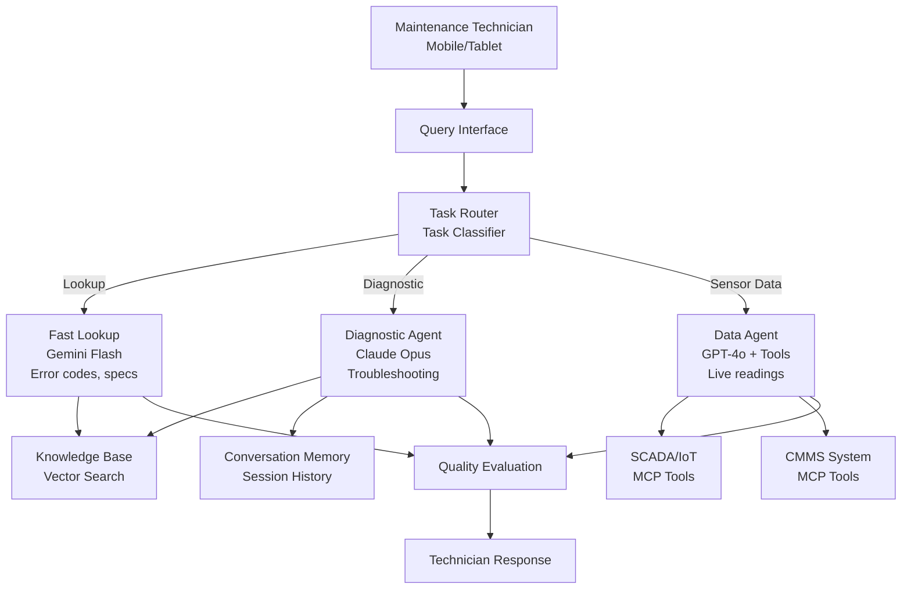

In this guide, you will build an AI-powered maintenance knowledge base for manufacturing environments using NeuroLink's RAG capabilities. You will implement document ingestion for equipment manuals, semantic search across maintenance procedures, and a conversational interface that technicians can query on the factory floor.

An AI-powered knowledge base changes this entirely. It answers maintenance questions instantly, pulls live sensor data for context, guides step-by-step repairs with conversation memory, and tracks troubleshooting sessions across shifts. The technician asks a question, and the system responds with the exact procedure, the current sensor readings, and the maintenance history for that equipment.

NeuroLink provides the building blocks: multi-provider orchestration for routing queries to the right model, MCP tools for SCADA and CMMS access, conversation memory for multi-step troubleshooting sessions, and evaluation for answer quality in safety-critical scenarios.

This guide walks through building a production maintenance knowledge base using NeuroLink SDK.

---

## Knowledge Base Architecture

The system uses three specialized agents, each matched to a query pattern and backed by the optimal AI provider for its task.



### Query routing

The task classifier routes incoming queries to the right agent based on pattern matching from `taskClassificationConfig.ts`.

- **Fast lookup** matches simple patterns: "What is the part number for...?", "List all pressure sensors on...", "Show the spec for...". These queries need speed, not depth.
- **Diagnostic queries** match reasoning patterns: "How to fix...", "Step by step procedure for...", "What is causing the vibration on...". These need deep reasoning and conversation memory.
- **Sensor data queries** trigger the tool-calling agent when the query references live readings, alarms, or equipment status.

### Knowledge retrieval

The knowledge base is backed by vector search with equipment manuals, maintenance procedures, and historical work orders indexed as embeddings. Results are injected as context into the agent's prompt, giving the AI access to the specific procedures relevant to the question.

---

## Multi-Provider Agent Setup

Each agent type uses a different AI provider, chosen for its strengths.

```typescript
import { AIProviderFactory, ModelConfigurationManager } from '@juspay/neurolink';

const modelConfig = ModelConfigurationManager.getInstance();

// Fast lookup - for specs, error codes, part numbers
const lookupAgent = await AIProviderFactory.createProvider(
  "google-ai",
  modelConfig.getModelForTier("google-ai", "fast") // gemini-2.5-flash
);

// Diagnostic agent - for complex troubleshooting
const diagnosticAgent = await AIProviderFactory.createProvider(
  "bedrock",
  modelConfig.getModelForTier("bedrock", "quality") // claude-3-opus
);

// Data agent - with tool calling for live sensor access
const dataAgent = await AIProviderFactory.createProvider(
  "openai",
  modelConfig.getModelForTier("openai", "quality") // gpt-4o
);

// Fallback for offline/disconnected scenarios
const offlineAgent = await AIProviderFactory.createProvider(
  "ollama",
  modelConfig.getModelForTier("ollama", "balanced") // llama3.1:8b
);
```

**Why Gemini Flash for lookups?** Simple factual queries do not need deep reasoning. Flash provides sub-second responses for error code lookups and part number queries, keeping the technician moving.

**Why Claude Opus for diagnostics?** Complex troubleshooting requires multi-step reasoning, cross-referencing maintenance history, and generating step-by-step procedures. Opus excels at these reasoning-heavy tasks.

**Why GPT-4o for sensor data?** Tool calling with live SCADA data requires reliable function execution and the ability to interpret numerical readings in context. GPT-4o's tool calling is robust and well-tested.

**Why Ollama for offline?** Factory floors often have unreliable internet connectivity. Ollama runs locally with no API dependency (`requiredEnvVars: []`), providing basic AI capabilities even when disconnected from the cloud.

---

## MCP Tools for Equipment Data Access

NeuroLink's MCP integration connects the AI directly to plant systems -- SCADA for live sensor readings and CMMS for maintenance records.

```typescript
import { MCPRegistry } from '@juspay/neurolink';
import { tool } from "ai";
import { z } from "zod";

const plantRegistry = new MCPRegistry();

// Register SCADA/IoT data server
await plantRegistry.registerServer("scada-connector", {
  description: "SCADA system for live sensor readings",
  tools: {
    getSensorReading: {},
    getAlarmHistory: {},
    getEquipmentStatus: {},
  },
});

// Register CMMS server
await plantRegistry.registerServer("cmms-connector", {
  description: "Computerized Maintenance Management System",
  tools: {
    getWorkOrders: {},
    createWorkOrder: {},
    getMaintenanceHistory: {},
    getPartInventory: {},
  },
});
```

### Direct sensor tools

For cases where you need fine-grained control over the tool interface, define tools directly with Zod schemas:

```typescript
const getSensorReading = tool({
  description: "Get current sensor reading for equipment",
  parameters: z.object({
    equipmentId: z.string().describe("Equipment tag ID (e.g., PUMP-101)"),
    sensorType: z.enum(["temperature", "pressure", "vibration", "flow", "level"]),
  }),
  execute: async ({ equipmentId, sensorType }) => {
    const reading = await scadaClient.getCurrentReading(equipmentId, sensorType);
    return {
      equipmentId,
      sensorType,
      value: reading.value,
      unit: reading.unit,
      timestamp: reading.timestamp,
      status: reading.value > reading.threshold ? "alarm" : "normal",
    };
  },
});

const getMaintenanceHistory = tool({
  description: "Get maintenance history for equipment",
  parameters: z.object({
    equipmentId: z.string(),
    lastNDays: z.number().default(90),
  }),
  execute: async ({ equipmentId, lastNDays }) => {
    const history = await cmmsClient.getHistory(equipmentId, lastNDays);
    return {
      equipmentId,
      workOrders: history.map(wo => ({
        id: wo.id,
        type: wo.type,
        date: wo.completedDate,
        description: wo.description,
        partsUsed: wo.parts,
      })),
      totalOrders: history.length,
    };
  },
});
```

The SCADA tools provide live sensor readings that give the AI real-time context for diagnostics. When a technician asks "Why is PUMP-101 vibrating?", the AI can pull the current vibration reading, compare it to thresholds, check the last maintenance date, and suggest a root cause -- all in one response.

---

## Conversation Memory for Troubleshooting Sessions

Troubleshooting a complex equipment issue can span hours. A technician might start a session at 10 AM, take a break for parts delivery, and resume at 2 PM. Without conversation memory, every return to the AI starts from scratch.

```typescript
// Troubleshooting sessions can span hours; memory is critical
process.env.NEUROLINK_MEMORY_ENABLED = "true";
process.env.NEUROLINK_MEMORY_MAX_SESSIONS = "500";
process.env.NEUROLINK_SUMMARIZATION_ENABLED = "true";
process.env.NEUROLINK_SUMMARIZATION_PROVIDER = "google-ai";
process.env.NEUROLINK_SUMMARIZATION_MODEL = "gemini-2.5-flash";
```

### Memory configuration

NeuroLink's conversation memory (source: `src/lib/config/conversationMemory.ts`) is tuned for long troubleshooting sessions:

| Parameter | Default | Purpose |
|---|---|---|
| `DEFAULT_MAX_TURNS_PER_SESSION` | 50 | Maximum conversation turns before forced summarization |
| `MEMORY_THRESHOLD_PERCENTAGE` | 0.8 | Summarize at 80% of context window capacity |
| `RECENT_MESSAGES_RATIO` | 0.3 | Keep 30% of recent messages detailed, summarize the rest |

### System prompt with session context

```typescript
const troubleshootingPrompt = `You are a maintenance expert for ${plantName}.
Equipment: ${equipmentId} (${equipmentType})
Current alarm: ${currentAlarm}

Guide the technician step-by-step through troubleshooting.
After each step, ask what they observed before proceeding.
Reference maintenance manual section numbers when available.`;
```

> **Note:** Tying session IDs to work order numbers creates an audit trail. Regulators and safety teams can review the AI's troubleshooting guidance for any work order after the fact.
{: .prompt-info }

Long sessions (50+ turns) trigger automatic summarization to stay within context windows. The `RECENT_MESSAGES_RATIO` of 0.3 keeps the last few troubleshooting steps detailed while summarizing earlier context into a compressed form. The technician does not notice the summarization -- the AI still remembers what was discussed, just in a more compact representation.

---

## Quality Evaluation for Safety-Critical Answers

In manufacturing, incorrect maintenance guidance can cause equipment damage, environmental incidents, or injuries. Every AI response needs quality evaluation with safety-appropriate thresholds.

```typescript
import { generateEvaluation } from '@juspay/neurolink';

const evaluation = await generateEvaluation({
  userQuery: `How to troubleshoot high vibration alarm on ${equipmentId}?`,
  aiResponse: diagnosticResponse,
  primaryDomain: "manufacturing",
  toolUsage: [
    { toolName: "getSensorReading", result: sensorData },
    { toolName: "getMaintenanceHistory", result: historyData },
  ],
  conversationHistory: troubleshootingSession,
});

// Safety-critical: high thresholds for manufacturing
if (evaluation.accuracy < 8) {
  diagnosticResponse += "\n\nIMPORTANT: This is AI-generated guidance. " +
    "Always follow lockout/tagout procedures and consult equipment manual " +
    "before performing maintenance.";
}

// Safety-critical procedures ALWAYS require human verification
if (query.toLowerCase().includes('lockout') ||
    query.toLowerCase().includes('tagout') ||
    query.toLowerCase().includes('electrical') ||
    query.toLowerCase().includes('confined space')) {
  diagnosticResponse += '\n\n⚠️ MANDATORY: This procedure requires verification by a qualified maintenance supervisor before execution. Do not proceed without supervisor sign-off.';
}

// Evaluate tool usage quality
if (evaluation.toolEffectiveness && evaluation.toolEffectiveness < 6) {
  // Re-query with additional tool data
}
```

### Evaluation parameters

- **`primaryDomain: "manufacturing"`** enables domain-specific scoring criteria appropriate for industrial environments
- **`toolUsage`** evaluates whether sensor and maintenance history data was used effectively in the response
- **`toolEffectiveness`** score indicates if tools contributed meaningfully to the diagnosis
- Safety disclaimers are automatically added for lower-confidence responses, reminding technicians to follow standard safety procedures

> **Safety Critical:** AI-generated maintenance procedures must never be followed without verification by qualified personnel for safety-critical tasks (lockout/tagout, electrical work, confined space entry). OSHA 29 CFR 1910.147 requires documented procedures and authorized personnel. This system provides guidance only — it does not replace required safety protocols.
{: .prompt-danger }

---

## Offline Mode with Ollama

Factory floors present a unique challenge: internet connectivity can be unreliable. Network switches go down. Firewalls block external API calls. The AI system must degrade gracefully, not fail completely.

```typescript
import { AIProviderFactory } from '@juspay/neurolink';

// Ollama for disconnected factory floor scenarios
// Available models:
// FAST: "llama3.2:latest"
// BALANCED: "llama3.1:8b"
// QUALITY: "llama3.1:70b"

const offlineAgent = await AIProviderFactory.createProvider(
  "ollama",
  "llama3.1:8b" // Runs locally, no internet required
);

// Detect connectivity and switch
async function getMaintenanceResponse(query: string) {
  try {
    return await diagnosticAgent.generate({ input: { text: query } });
  } catch {
    console.warn("Cloud provider unavailable, using offline model");
    return await offlineAgent.generate({ input: { text: query } });
  }
}
```

Ollama's configuration makes it ideal for offline scenarios:

- **Base URL:** `http://localhost:11434` -- runs entirely on the local network
- **Tool-capable models:** `llama3.1`, `mistral`, `hermes3`, `qwen2.5` support basic tool calling without cloud
- **Zero cost:** `defaultCost: { input: 0, output: 0 }` -- no API billing for local inference
- **No API keys:** `requiredEnvVars: []` -- nothing to configure

> **Note:** Offline mode provides reduced capability compared to cloud providers. Complex diagnostic reasoning may require the full Claude Opus model. Use offline mode as a fallback for basic lookups and simple procedures.
{: .prompt-info }

---

## Resilience for Plant Operations

Plant operations demand high availability. Downtime during a critical maintenance event is not acceptable. NeuroLink's resilience primitives are configured with manufacturing-appropriate parameters.

```typescript
import { CircuitBreaker, withRetry, RateLimiter } from '@juspay/neurolink';

const plantBreaker = new CircuitBreaker(3, 15000); // Fast recovery for plant floor
const apiLimiter = new RateLimiter(30, 60000); // 30 queries/min per technician

async function queryKnowledgeBase(query: string) {
  await apiLimiter.acquire();
  return plantBreaker.execute(() =>
    withRetry(
      () => diagnosticAgent.generate({ input: { text: query } }),
      { maxAttempts: 2, initialDelay: 500, maxDelay: 5000 }
    )
  );
}
```

### Why these parameters

- **Circuit breaker with 15-second recovery:** Plant floor queries are time-sensitive. The standard 60-second recovery timeout is too long when a technician is standing next to a tripped pump. Fifteen seconds balances protection against hammering a dead API with fast recovery when the API comes back.
- **Rate limiting at 30 queries/minute:** Prevents API budget overruns when multiple technicians across shift teams are querying simultaneously. A single shift might have 20 technicians using the system during a plant upset event.
- **Two retry attempts with 500ms initial delay:** Quick retries catch transient network issues without making the technician wait. The low `maxDelay` of 5 seconds ensures the system either succeeds quickly or fails fast to the offline fallback.

---

## What's Next

You have completed all the steps in this guide. To continue building on what you have learned:

1. Review the code examples and adapt them for your specific use case
2. Start with the simplest pattern first and add complexity as your requirements grow
3. Monitor performance metrics to validate that each change improves your system
4. Consult the NeuroLink documentation for advanced configuration options

---

**Related posts:**

- [Building RAG Applications with NeuroLink SDK](/posts/rag-implementation/)
- [Structured Output: JSON Schema Enforcement with NeuroLink](/posts/structured-output-json/)
- [Security Best Practices for AI Applications](/posts/enterprise-security-guide/)
