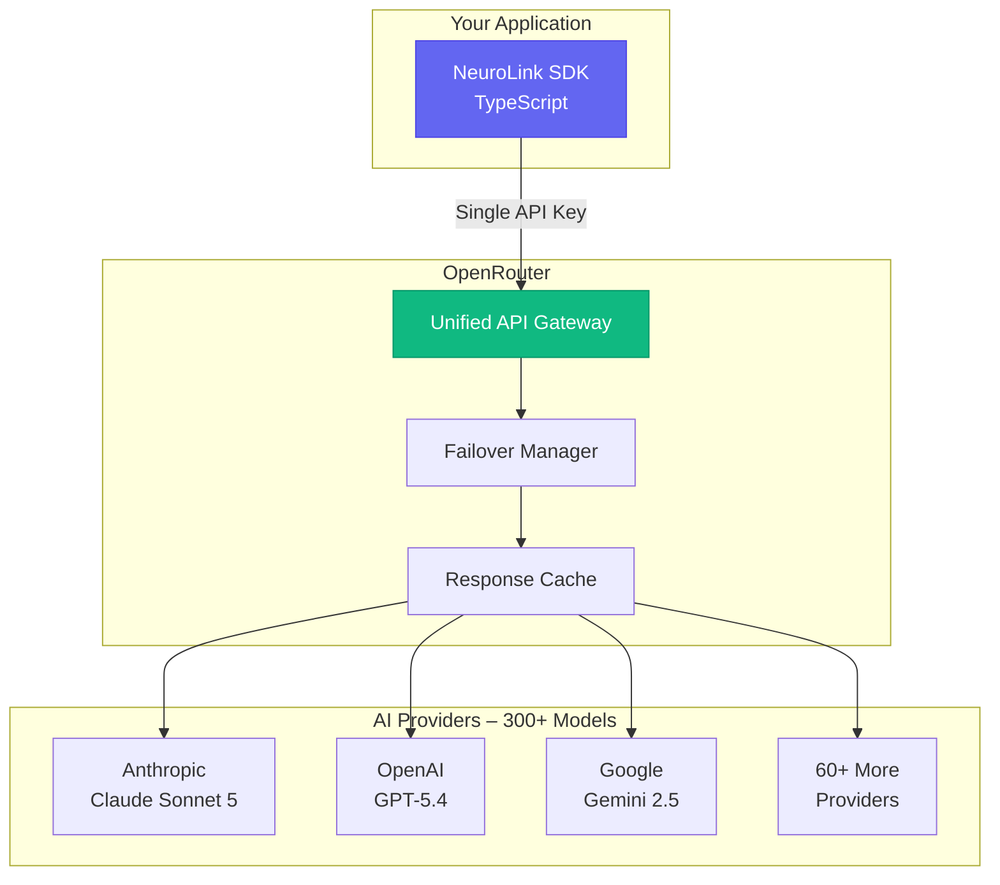
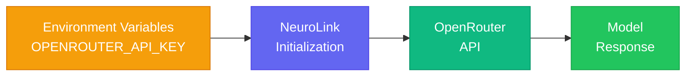
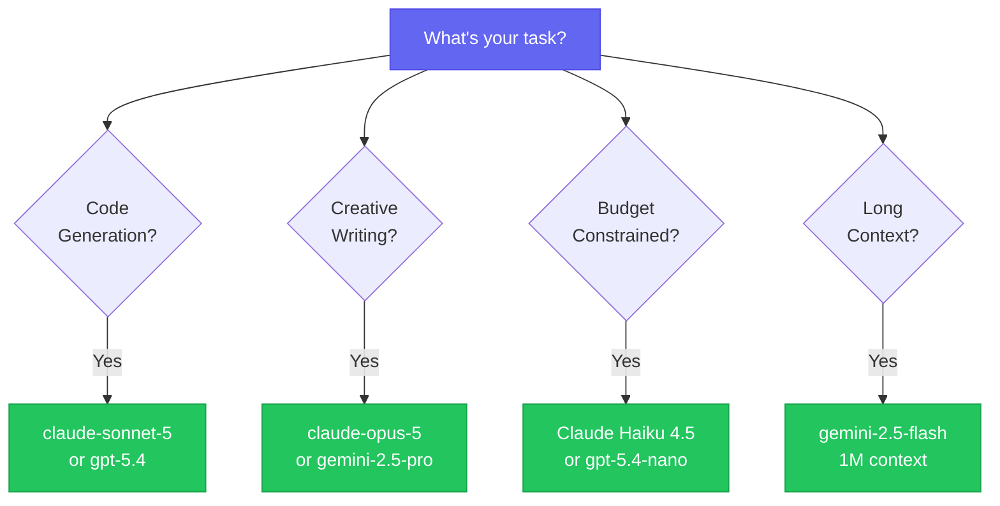
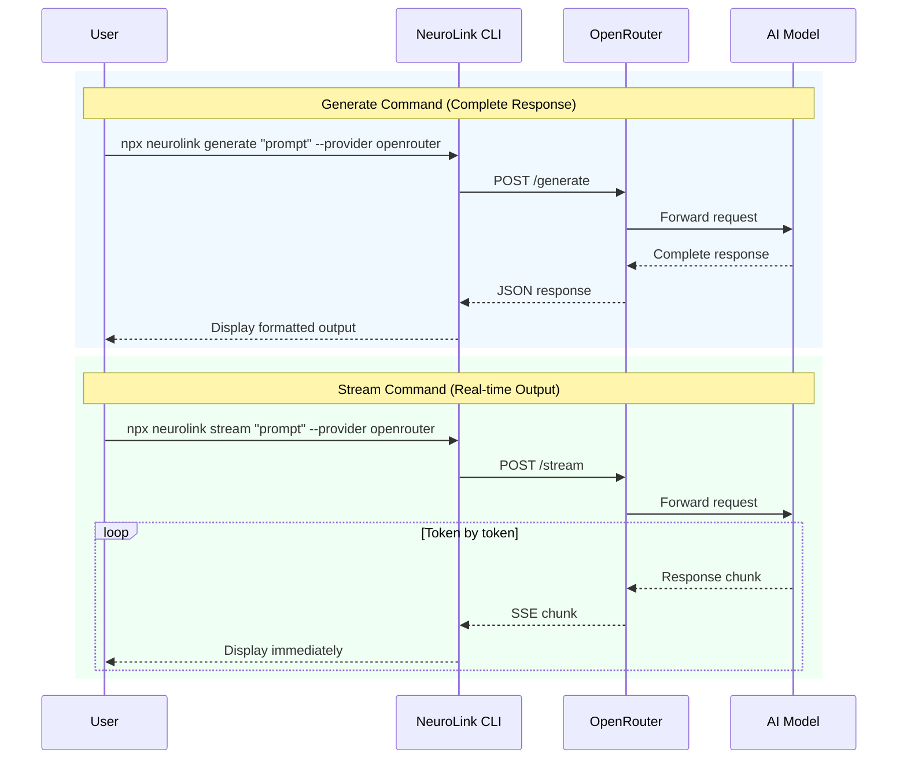
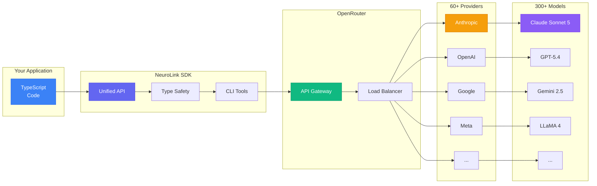

In this guide, you will connect NeuroLink to OpenRouter, giving you access to 300+ AI models through a single API key. You will configure the OpenRouter provider, implement model selection strategies, set up fallback routing, and optimize costs by choosing the right model for each task.

Model fragmentation across OpenAI, Anthropic, Google, Meta, and Mistral creates real problems. Your codebase grows tangled. Your invoices multiply. Your team loses hours switching between provider dashboards.

OpenRouter solves the access problem. NeuroLink solves the developer experience problem. Together, they deliver one API key, 300+ models from dozens of providers, and automatic failover. You ship faster. You optimize costs. You eliminate vendor lock-in.

This guide walks you through complete OpenRouter integration with NeuroLink. You will learn setup, model selection, advanced patterns, and cost optimization. By the end, you will access any major AI model through a single, type-safe TypeScript interface.



---

## Why OpenRouter + NeuroLink?

OpenRouter and NeuroLink each solve distinct problems. Combined, they create the most flexible AI development stack available today.

### What OpenRouter Brings to the Table

OpenRouter operates as a model aggregator. It provides access to 300+ models from dozens of providers through a single API endpoint. You get unified billing instead of managing multiple vendor accounts. Automatic failover protects your application when individual providers experience downtime.

OpenRouter handles provider routing automatically. It optimizes for speed, cost, and availability based on your request. The platform supports provider preferences and ordering if you need more control over which providers handle your requests.

Pricing on OpenRouter stays competitive. Many models cost less than direct provider access. Note that OpenRouter charges a fee on credit purchases (charged at purchase time, not per-usage). *Fee percentages are subject to change; check OpenRouter's pricing page for current rates.* The platform handles rate limiting across providers automatically. You never hit a wall because one provider throttles your requests.

### What NeuroLink Adds on Top

NeuroLink wraps OpenRouter with enterprise-grade features. You get a fully type-safe TypeScript SDK. Every model response carries proper TypeScript types. Your IDE catches errors before runtime.

The professional CLI accelerates prototyping. Test prompts against multiple models in seconds. Switch providers mid-conversation without restarting your session. Build confidence in your model selection before writing integration code.

NeuroLink adds capabilities OpenRouter cannot provide alone. Redis-backed conversation memory persists across application restarts. Human-in-the-loop approval workflows catch dangerous AI actions before execution. Content guardrails filter harmful outputs automatically. Telemetry integration tracks performance across your entire AI stack.

Streaming works identically across all 300+ models. No provider-specific handling required. NeuroLink normalizes the streaming interface so your code stays clean.

**Related:** [Enterprise HITL and Guardrails Guide](https://docs.neurolink.ink/features/hitl/) - [Example Code](https://docs.neurolink.ink/features/enterprise-hitl/)

### Combined Benefits at a Glance

| Capability | OpenRouter Alone | NeuroLink Alone | OpenRouter + NeuroLink |
|------------|------------------|-----------------|------------------------|
| Model Access | 300+ models | 14 native providers | 300+ models |
| TypeScript Types | Partial coverage | Full type safety | Full type safety |
| CLI Tool | Not available | Full-featured | Full-featured |
| HITL/Guardrails | Not available | Enterprise-ready | Enterprise-ready |
| Streaming | Provider-dependent | Zero-config | Zero-config |
| Conversation Memory | Not available | Redis-backed | Redis-backed |
| Cost Tracking | Dashboard only | Real-time in-code | Real-time in-code |
| Provider Failover | Automatic | Configurable | Automatic + Configurable |

You get the best of both worlds. OpenRouter handles model access and routing. NeuroLink handles developer experience and enterprise requirements.

---

## Quick Start: Your First OpenRouter Request

Getting started takes five minutes. You need an OpenRouter API key and the NeuroLink package.

### Step 1: Get Your OpenRouter API Key

Visit [openrouter.ai](https://openrouter.ai) and create an account. Navigate to the keys section at [openrouter.ai/keys](https://openrouter.ai/keys). Generate a new API key. Copy it somewhere safe.

OpenRouter offers free credits for new accounts. You can test integrations without immediate payment. Add a payment method later when you scale up usage.

Optional: Configure attribution settings. Your app name and URL appear in the OpenRouter dashboard. This helps you track usage across multiple projects.

### Step 2: Configure Your Environment

Create or update your environment file with the OpenRouter credentials:

```bash
OPENROUTER_API_KEY=sk-or-v1-...

# Optional - Attribution for dashboard tracking
OPENROUTER_REFERER=https://yourapp.com
OPENROUTER_APP_NAME="Your App Name"
```

Never commit API keys to version control. Use environment variables or a secrets manager in production.

**CLI equivalent:**

```bash
# Set environment variables for CLI usage
export OPENROUTER_API_KEY=sk-or-v1-...
export OPENROUTER_REFERER=https://yourapp.com
export OPENROUTER_APP_NAME="Your App Name"
```

### Step 3: Install and Initialize NeuroLink

Install the NeuroLink package:

```bash
pnpm add @juspay/neurolink
# or
npm install @juspay/neurolink
# or
yarn add @juspay/neurolink
```

Initialize the SDK. NeuroLink automatically detects the `OPENROUTER_API_KEY` environment variable:

```typescript
import { NeuroLink } from "@juspay/neurolink";

// NeuroLink reads OPENROUTER_API_KEY from environment automatically
const ai = new NeuroLink();

// Use OpenRouter with any of 300+ models
const result = await ai.generate({
  input: { text: "Explain quantum computing in simple terms" },
  provider: "openrouter",
  model: "anthropic/claude-sonnet-5",
});

console.log(result.content);
```

That's it. You now have access to 300+ models through one interface.

**CLI equivalent:**

```bash
# Quick test from command line
npx @juspay/neurolink generate "Hello from OpenRouter!" --provider openrouter

# Or with the full command name
npx @juspay/neurolink generate "Explain quantum computing simply" --provider openrouter
```



> **Code Examples:** See the [OpenRouter Setup Guide](https://docs.neurolink.ink/getting-started/providers/openrouter/) for the complete runnable example.

---

## Model Selection Guide

OpenRouter provides access to every major AI model. Choosing the right one depends on your use case, budget, and performance requirements.

### Top Models by Use Case

Different tasks demand different models. Here are recommended choices for common scenarios.

#### Code Generation and Analysis

For code tasks, these models consistently deliver excellent results:

```typescript
// Best overall for code - exceptional reasoning and accuracy
const codeModel = "anthropic/claude-sonnet-5";

// Strong alternative - great for complex refactoring
const altCodeModel = "openai/gpt-5.4";

// Fast with massive context - ideal for large codebases
const fastCodeModel = "google/gemini-2.5-flash";
```

Claude Sonnet 5 excels at understanding complex codebases. GPT-5.4 handles intricate refactoring tasks well. Gemini 2.5 Flash processes million-token contexts quickly.

**CLI equivalent:**

```bash
# Test code generation with different models
npx @juspay/neurolink generate "Write a TypeScript function to debounce API calls" \
  --provider openrouter \
  --model "anthropic/claude-sonnet-5"
```

#### Creative Writing

Creative tasks benefit from models with strong language generation:

```typescript
// Most capable for creative work
const creativeModel = "anthropic/claude-opus-5";

// Excellent for long-form content
const longFormModel = "google/gemini-2.5-pro";
```

Claude Opus 5 produces the most nuanced creative writing. Gemini 2.5 Pro handles long-form content generation effectively.

#### Cost-Optimized Tasks

For high-volume, simpler tasks, use efficient models:

```typescript
// Fast and affordable - great for classification and extraction
const budgetModel = "anthropic/claude-haiku-4.5";

// Budget-friendly GPT-5.4 nano alternative
const gptBudgetModel = "openai/gpt-5.4-nano";
```

These models cost a fraction of their larger siblings. They handle classification, extraction, and simple generation tasks well.

**CLI equivalent:**

```bash
# Use budget models for simple tasks
npx @juspay/neurolink generate "Classify this text as positive or negative: Great product!" \
  --provider openrouter \
  --model "anthropic/claude-haiku-4.5"
```

#### Long Context Processing (100K+ Tokens)

Some tasks require processing massive documents:

```typescript
// 1 million token context window
const longContextModel = "google/gemini-2.5-flash";

// 1M token context with excellent comprehension
const comprehensionModel = "anthropic/claude-sonnet-5";
```

Gemini 2.5 Flash leads with a 1 million token context window. Claude Sonnet 5 offers 1M tokens with superior comprehension.

**Related:** [Multimodal Processing Tutorial](/posts/multimodal-document-processing/) - Add PDFs, CSVs, and more to your AI workflows - [Examples](https://docs.neurolink.ink/features/multimodal/)

### Model Comparison Table

| Model | Context Window | Speed | Best For |
|-------|----------------|-------|----------|
| `anthropic/claude-sonnet-5` | 1M | Fast | General purpose, code |
| `openai/gpt-5.4` | 1M | Fast | Complex reasoning |
| `google/gemini-2.5-flash` | 1M | Fastest | Long documents |
| `meta-llama/llama-4-maverick` | 1M | Fast | Open source preference |
| `anthropic/claude-haiku-4.5` | 200K | Fastest | High-volume tasks |
| `openai/gpt-5.4-nano` | 400K | Fast | Budget applications |
| `anthropic/claude-opus-5` | 1M | Slower | Maximum capability |
| `mistralai/mistral-large-2512` | 256K | Fast | EU compliance |

> **Note:** Pricing changes frequently and varies by provider. Always check the [OpenRouter pricing page](https://openrouter.ai/models) for current rates before production deployment.

### Dynamic Model Variants

OpenRouter supports dynamic variants that modify model or provider behavior. As of today, three of the older suffixes are deprecated in favor of first-class request parameters:

- **`:free`** - Free tier of a model with its own (lower) rate limits (e.g., `google/gemma-4-31b-it:free`)
- **`:nitro`** - Ranks providers by throughput and allows priority-tier endpoints (e.g., `openai/gpt-5.4:nitro`)
- **`:exacto`** - Ranks providers by quality signals tuned for tool-calling reliability, useful for agentic workflows (e.g., `moonshotai/kimi-k2-0905:exacto`)
- **`:floor`** - Ranks providers by lowest price and allows flex-tier endpoints (e.g., `google/gemini-2.5-flash:floor`)
- **`:online`** *(deprecated)* - Used to inject web search results into the prompt. Use OpenRouter's `web_search` server tool instead.
- **`:extended`** *(deprecated)* - Used to request a larger context window. No model currently offers it; the base models already ship with their full context length.
- **`:thinking`** *(deprecated)* - Used to turn on reasoning by default. Use the top-level `reasoning` request parameter (`{ effort: "high" }` or `{ max_tokens: ... }`) instead, which works across providers.

> **Note:** Not all variants are available for all models, and OpenRouter continues to retire and add suffixes over time. Check the [OpenRouter model variants docs](https://openrouter.ai/docs/guides/routing/model-variants/overview) for current availability before shipping a suffix to production.

```typescript
// Use the free variant for zero-cost experimentation (own rate limits apply)
const freeResult = await ai.generate({
  input: { text: "Summarize this paragraph in one sentence..." },
  provider: "openrouter",
  model: "google/gemma-4-31b-it:free",
});

// Use exacto variant when tool-calling reliability matters more than cost
const toolResult = await ai.generate({
  input: { text: "Use the search tool to find..." },
  provider: "openrouter",
  model: "moonshotai/kimi-k2-0905:exacto",
});
```

The `:thinking` suffix shown in older guides is deprecated and no new models will carry it - OpenRouter now recommends its top-level `reasoning` request field for controlling reasoning depth. NeuroLink does not yet expose a typed wrapper for that OpenRouter-specific field, so if you need it today, check the [reasoning tokens guide](https://openrouter.ai/docs/guides/best-practices/reasoning-tokens) for the raw request shape.



> **Code Example:** See the [Provider Comparison Reference](https://docs.neurolink.ink/reference/provider-comparison/) for a runnable comparison script.

---

## Advanced Patterns

Once you master basics, these patterns unlock the full potential of multi-model access.

### Streaming Responses

Streaming delivers response chunks as they generate. Users see results immediately instead of waiting for completion.

```typescript
const result = await ai.stream({
  input: { text: "Write a short story about AI" },
  provider: "openrouter",
  model: "anthropic/claude-sonnet-5",
});

for await (const chunk of result.stream) {
  process.stdout.write(chunk.content);
}
```

The streaming interface works identically across all OpenRouter models. No provider-specific handling required.

**CLI equivalent:**

```bash
# Stream output to terminal in real-time
npx @juspay/neurolink stream "Tell me a story about a robot learning to paint" \
  --provider openrouter \
  --model "anthropic/claude-sonnet-5"
```

### Model Comparison Pattern

Test the same prompt across multiple models. Compare quality, speed, and cost to make informed decisions.

```typescript
async function compareModels(prompt: string) {
  const models = [
    "openai/gpt-5.4",
    "anthropic/claude-sonnet-5",
    "google/gemini-2.5-flash"
  ];

  const results = await Promise.all(
    models.map(model => ai.generate({
      input: { text: prompt },
      provider: "openrouter",
      model
    }))
  );

  return results.map((r, i) => ({
    model: models[i],
    response: r.content,
    tokens: r.usage?.total,
    latency: r.responseTime
  }));
}

// Usage
const comparisons = await compareModels("Explain machine learning in one paragraph");
console.table(comparisons);
```

This pattern helps you choose the optimal model for specific tasks. Run it during development to inform production model selection.

**CLI equivalent:**

```bash
# Test same prompt across models manually
npx @juspay/neurolink generate "Explain machine learning briefly" \
  --provider openrouter --model "openai/gpt-5.4"

npx @juspay/neurolink generate "Explain machine learning briefly" \
  --provider openrouter --model "anthropic/claude-sonnet-5"

npx @juspay/neurolink generate "Explain machine learning briefly" \
  --provider openrouter --model "google/gemini-2.5-flash"
```

### Cost-Optimized Generation

Select budget-friendly models for simple tasks to optimize costs:

```typescript
// Use budget models for simple tasks like summarization
const result = await ai.generate({
  input: { text: "Summarize this document..." },
  provider: "openrouter",
  model: "anthropic/claude-haiku-4.5",  // Budget model for simple tasks
});

console.log(`Model used: ${result.model}`);
console.log(`Tokens: ${result.usage?.total}`);

// Use capable models only for complex tasks
const complexResult = await ai.generate({
  input: { text: "Analyze this code and suggest architectural improvements..." },
  provider: "openrouter",
  model: "anthropic/claude-sonnet-5",  // Full model for complex reasoning
});
```

Match model capability to task complexity. Simple summarization, classification, and extraction tasks work well with Claude Haiku 4.5 or GPT-5.4 nano. Reserve Sonnet and Opus for complex reasoning tasks. Based on OpenRouter's listed input-token pricing today, this approach can save roughly 75-90% on high-volume workloads - check the [OpenRouter pricing page](https://openrouter.ai/models) for current rates before sizing the savings for your own traffic mix.

**CLI equivalent:**

```bash
# Use budget models for simple tasks
npx @juspay/neurolink generate "Summarize: The quick brown fox..." \
  --provider openrouter \
  --model "anthropic/claude-haiku-4.5"
```

### Provider Configuration Options

Configure OpenRouter through environment variables:

```typescript
// NeuroLink reads configuration from environment variables automatically
const ai = new NeuroLink();

// Required environment variable:
// OPENROUTER_API_KEY=sk-or-v1-...

// Optional environment variables for attribution:
// OPENROUTER_REFERER=https://yourapp.com
// OPENROUTER_APP_NAME="Your App Name"

// Optional: Set a default model
// OPENROUTER_MODEL=anthropic/claude-sonnet-5
```

You can also pass request-level options like `timeout` directly in the `generate()` call:

```typescript
const result = await ai.generate({
  input: { text: "Your prompt" },
  provider: "openrouter",
  model: "anthropic/claude-sonnet-5",
  timeout: 30000,  // 30 seconds
});
```

**Reference:** [Full SDK API Documentation](https://docs.neurolink.ink/sdk/api-reference/) | [Provider Configuration Options](https://docs.neurolink.ink/getting-started/provider-setup/)

---

## CLI Workflows

The NeuroLink CLI accelerates development. Test prompts, compare models, and build confidence without writing code.

### Generate and Stream Commands

The two primary CLI commands cover most use cases:

**Generate (`generate`)** - Get complete responses for quick tasks:

```bash
# Simple generation with OpenRouter
npx @juspay/neurolink generate "Explain this code: function debounce(fn, ms) {...}" \
  --provider openrouter \
  --model "anthropic/claude-sonnet-5"

# Switch models easily for comparison
npx @juspay/neurolink generate "Explain this code: function debounce(fn, ms) {...}" \
  --provider openrouter \
  --model "openai/gpt-5.4"
```

**Stream (`stream`)** - Watch responses arrive in real-time for longer outputs:

```bash
# Stream longer responses to see output as it generates
npx @juspay/neurolink stream "Write a detailed guide on TypeScript best practices" \
  --provider openrouter \
  --model "anthropic/claude-sonnet-5"

# Stream creative content
npx @juspay/neurolink stream "Write a short story about AI learning to paint" \
  --provider openrouter \
  --model "anthropic/claude-opus-5"
```

Both commands support all OpenRouter models. Use `generate` for quick queries and `stream` when you want immediate visual feedback.

### Model Testing Commands

Quick commands for common testing workflows:

```bash
# Quick test different models
npx @juspay/neurolink generate "Write a haiku about programming" \
  --provider openrouter \
  --model "openai/gpt-5.4"

# Stream output for longer responses
npx @juspay/neurolink stream "Tell me a detailed story about space exploration" \
  --provider openrouter \
  --model "anthropic/claude-sonnet-5"

# List available models from OpenRouter
npx @juspay/neurolink models list --provider openrouter

# Search for specific models
npx @juspay/neurolink models search "claude" --provider openrouter

# Compare models
npx @juspay/neurolink models compare "anthropic/claude-sonnet-5" "openai/gpt-5.4"

# View model statistics
npx @juspay/neurolink models stats --provider openrouter
```

### Setup Wizard

New to NeuroLink? The setup wizard configures everything:

```bash
# Run interactive setup
npx @juspay/neurolink setup

# Follow prompts to:
# 1. Select providers (choose OpenRouter)
# 2. Enter API keys
# 3. Set default models
# 4. Configure optional features
```

The wizard creates your configuration file automatically. You start generating in under three minutes.



> **CLI Reference:** See the [CLI Commands Documentation](https://docs.neurolink.ink/cli/commands/) for all available commands.

---

## Cost Optimization Strategies

AI costs add up quickly at scale. These strategies help you control spending without sacrificing quality.

### Monitor Usage Actively

OpenRouter provides detailed usage tracking. Visit [openrouter.ai/activity](https://openrouter.ai/activity) to see:

- Requests per model
- Token consumption
- Cost breakdown by day
- Error rates and retries

Review this dashboard weekly. Identify expensive patterns early.

### Use Efficient Models for Simple Tasks

Not every request needs GPT-5.4 or Claude Opus. Match model capability to task complexity:

| Task Type | Recommended Model | Est. Cost Savings vs. same-provider flagship* |
|-----------|-------------------|-------------------------------|
| Classification | Claude Haiku 4.5 | ~80% cheaper than Claude Opus 5 |
| Extraction | gpt-5.4-nano | ~92% cheaper than GPT-5.4 |
| Simple Q&A | Claude Haiku 4.5 | ~80% cheaper than Claude Opus 5 |
| Summarization | gemini-2.5-flash | ~76% cheaper than Gemini 2.5 Pro |
| Complex reasoning | claude-sonnet-5 / gpt-5.4 / gemini-2.5-pro | Baseline |

> **\*Basis:** Savings are computed from each model's listed input-token price on [OpenRouter's model pages](https://openrouter.ai/models) as of 2026-09-27 (e.g. Claude Haiku 4.5 vs. Claude Opus 5, GPT-5.4 nano vs. GPT-5.4, Gemini 2.5 Flash vs. Gemini 2.5 Pro). Output-token pricing and your actual prompt/completion mix will shift real-world savings, and prices change frequently - always check the [OpenRouter pricing page](https://openrouter.ai/models) for current rates before estimating production costs.

### Enable Request Caching

OpenRouter caches identical requests automatically. Repeated prompts return cached responses instantly at no cost. Design your prompts to take advantage of this:

- Use consistent system prompts
- Avoid including timestamps in prompts
- Cache template responses where possible

### Set Spending Limits

Configure spending caps in your OpenRouter dashboard. Set limits per:

- Project (using different API keys)
- Day/week/month
- Individual model

Alerts notify you before hitting limits. This prevents surprise bills.

### Batch Related Queries

Combine related questions into single requests when possible. One detailed prompt costs less than five separate simple prompts. The model handles context better too.

```typescript
// Instead of 5 separate requests
const questions = [
  "What is the capital of France?",
  "What is the population?",
  "What is the main language?",
  "What is the currency?",
  "What is the time zone?"
];

// Batch into one request
const result = await ai.generate({
  input: {
    text: `Answer these questions about France concisely:
    1. Capital city
    2. Population
    3. Main language
    4. Currency
    5. Time zone`
  },
  provider: "openrouter",
  model: "anthropic/claude-haiku-4.5",
});
```

---

## Troubleshooting Common Issues

### Rate Limiting

OpenRouter handles rate limits across providers. If you hit limits:

1. Check your OpenRouter dashboard for current limits
2. Implement exponential backoff in your code
3. Consider upgrading your OpenRouter plan
4. Distribute requests across multiple models

### Model Availability

Some models experience occasional downtime. Handle this with a try/catch fallback pattern:

```typescript
// NeuroLink reads OPENROUTER_API_KEY from environment automatically
const ai = new NeuroLink();

// Implement model fallback with try/catch
async function generateWithFallback(prompt: string) {
  const fallbackModels = [
    "anthropic/claude-sonnet-5",
    "openai/gpt-5.4",
    "google/gemini-2.5-flash"
  ];

  for (const model of fallbackModels) {
    try {
      return await ai.generate({
        input: { text: prompt },
        provider: "openrouter",
        model
      });
    } catch (error) {
      console.warn(`Model ${model} failed, trying next...`);
    }
  }
  throw new Error("All fallback models failed");
}
```

For model-specific failures, implement explicit fallback logic as shown above. The SDK will handle transient failures automatically.

### Authentication Errors

If you see authentication errors:

1. Verify your API key is correct
2. Check that your key has sufficient credits
3. Ensure environment variables load properly
4. Confirm your key has access to the requested model

---

## Next Steps

You now have everything needed to build with 300+ AI models through one unified interface. Here's where to go next:

### Expand your capabilities

- **[Multimodal Processing Tutorial](/posts/multimodal-document-processing/)** - Add PDF, CSV, and image processing to your AI workflows
- **[Enterprise HITL & Guardrails Guide](https://docs.neurolink.ink/features/hitl/)** - Implement governance and safety controls
- **[Redis Memory Configuration](https://docs.neurolink.ink/conversation-memory/)** - Set up persistent conversation memory for production
- **[MCP Tools Integration](https://docs.neurolink.ink/advanced/mcp-integration/)** - Connect any MCP server (9 one-command configs included) to your AI applications

### Reference documentation

- **[Full SDK API Reference](https://docs.neurolink.ink/sdk/api-reference/)** - Complete TypeScript API documentation
- **[Provider Configuration Options](https://docs.neurolink.ink/getting-started/provider-setup/)** - Detailed setup for all 14 supported providers
- **[CLI Command Reference](https://docs.neurolink.ink/cli/commands/)** - Every CLI command with examples

### Get started now

Install NeuroLink and start building:

```bash
# One command to get started
pnpm dlx @juspay/neurolink setup
```

The setup wizard guides you through configuration. You'll make your first OpenRouter request in under five minutes.

---

## What's Next

You have completed all the steps in this guide. To continue building on what you have learned:

1. Review the code examples and adapt them for your specific use case
2. Start with the simplest pattern first and add complexity as your requirements grow
3. Monitor performance metrics to validate that each change improves your system
4. Consult the NeuroLink documentation for advanced configuration options

---

*Have questions about OpenRouter integration? Join our [Discord community](https://discord.gg/neurolink) or [open an issue on GitHub](https://github.com/juspay/neurolink/issues). We're here to help you build.*

---

**Related posts:**

- [Model Evaluation and Scoring: RAGAS-Style Quality Assessment](/posts/model-evaluation-scoring/)
- [LLM Cost Optimization: Practical Strategies to Reduce Your AI Spend](/posts/cost-optimization-strategies/)
- [Real-Time AI: Streaming Response Patterns with NeuroLink](/posts/streaming-best-practices/)



**One SDK. Any Model. Zero Lock-in.**
